# RESULT
# [Box Plot](./overall/README.md)
# [Box Plot (obj_size_ignored)](./overall/README_obj_size_ignored.md)
# Line Plot
## 1351 https://ftp.pdl.cmu.edu/pub/datasets/twemcacheWorkload/cacheDatasets/tencentBlock/v2/traces/1351.oracleGeneral.zst
> 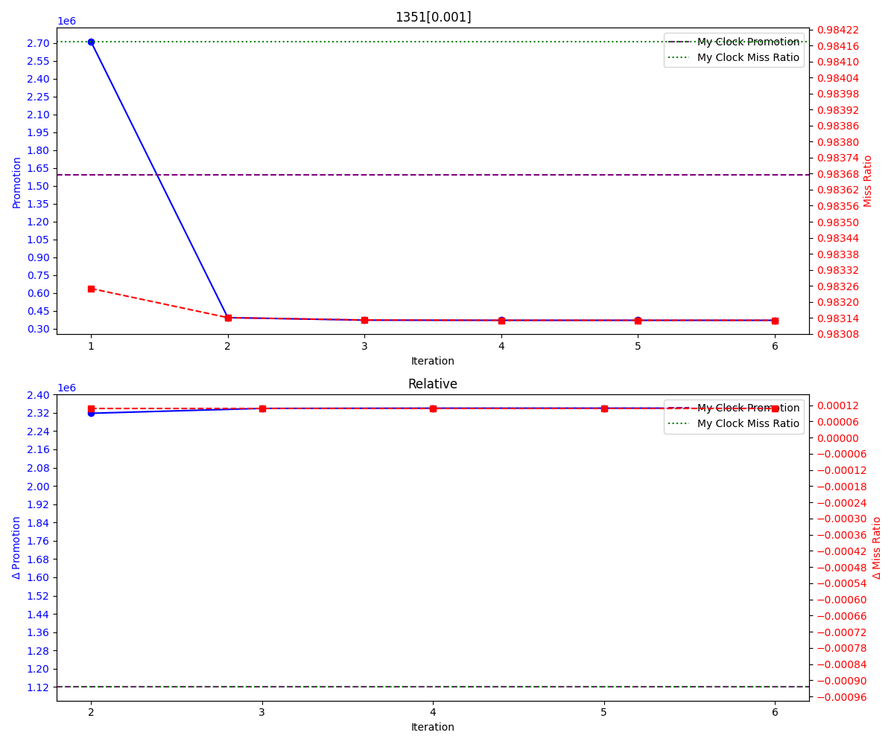  
> **Trace Path**: 1351.oracleGeneral.zst  
> **Log Path**: [../result/log/1351[0.001].csv](../result/log/1351[0.001].csv)  
> **Desc**: 0.001  
> **Cache Size**: 191  
> **Ignore Obj Size**: 0  
> **Total Request**: 195,824,302  
> **First Promotion**: 2,710,642  
> **Last Promotion**: 370,293  
> **Promotion Reduced**: 2,340,349  

>   
> **Trace Path**: 1351.oracleGeneral.zst  
> **Log Path**: [../result/log/1351[0.001,ML,model=logistic_regression_0.001].csv](../result/log/1351[0.001,ML,model=logistic_regression_0.001].csv)  
> **Desc**: 0.001,ML,model=logistic_regression_0.001  
> **Cache Size**: 191  
> **Ignore Obj Size**: 0  
> **Total Request**: 195,824,302  
> **First Promotion**: 0  
> **Last Promotion**: 0  
> **Promotion Reduced**: 0  

> 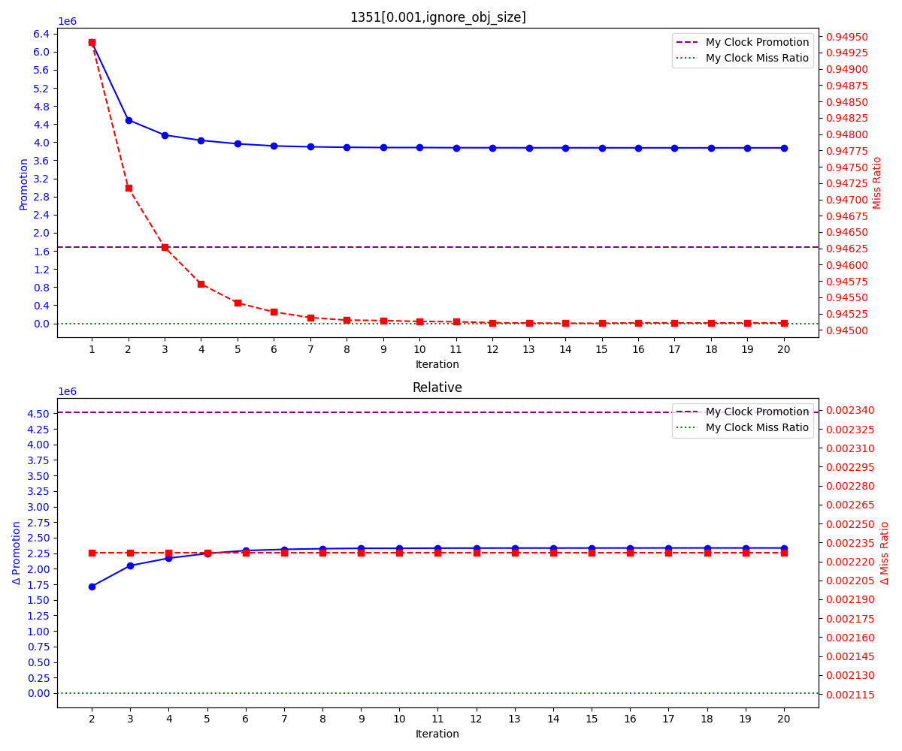  
> **Trace Path**: 1351.oracleGeneral.zst  
> **Log Path**: [../result/log/1351[0.001,ignore_obj_size].csv](../result/log/1351[0.001,ignore_obj_size].csv)  
> **Desc**: 0.001,ignore_obj_size  
> **Cache Size**: 1496  
> **Ignore Obj Size**: 1  
> **Total Request**: 195,824,302  
> **First Promotion**: 6,211,795  
> **Last Promotion**: 3,876,167  
> **Promotion Reduced**: 2,335,628  

>   
> **Trace Path**: 1351.oracleGeneral.zst  
> **Log Path**: [../result/log/1351[0.001,ignore_obj_size,ML,model=logistic_regression_0.001].csv](../result/log/1351[0.001,ignore_obj_size,ML,model=logistic_regression_0.001].csv)  
> **Desc**: 0.001,ignore_obj_size,ML,model=logistic_regression_0.001  
> **Cache Size**: 1496  
> **Ignore Obj Size**: 1  
> **Total Request**: 195,824,302  
> **First Promotion**: 0  
> **Last Promotion**: 0  
> **Promotion Reduced**: 0  

> 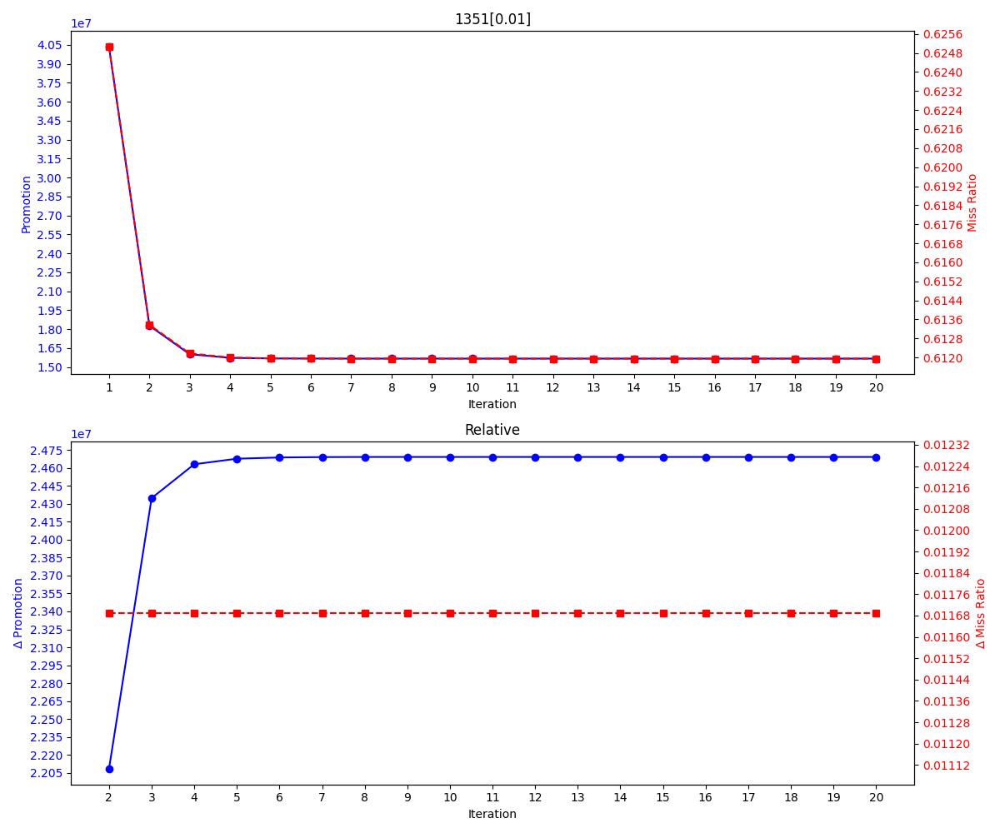  
> **Trace Path**: 1351.oracleGeneral.zst  
> **Log Path**: [../result/log/1351[0.01].csv](../result/log/1351[0.01].csv)  
> **Desc**: 0.01  
> **Cache Size**: 1911  
> **Ignore Obj Size**: 0  
> **Total Request**: 195,824,302  
> **First Promotion**: 40,359,057  
> **Last Promotion**: 15,665,705  
> **Promotion Reduced**: 24,693,352  

>   
> **Trace Path**: 1351.oracleGeneral.zst  
> **Log Path**: [../result/log/1351[0.01,ML,model=logistic_regression_0.01].csv](../result/log/1351[0.01,ML,model=logistic_regression_0.01].csv)  
> **Desc**: 0.01,ML,model=logistic_regression_0.01  
> **Cache Size**: 1911  
> **Ignore Obj Size**: 0  
> **Total Request**: 195,824,302  
> **First Promotion**: 0  
> **Last Promotion**: 0  
> **Promotion Reduced**: 0  

> 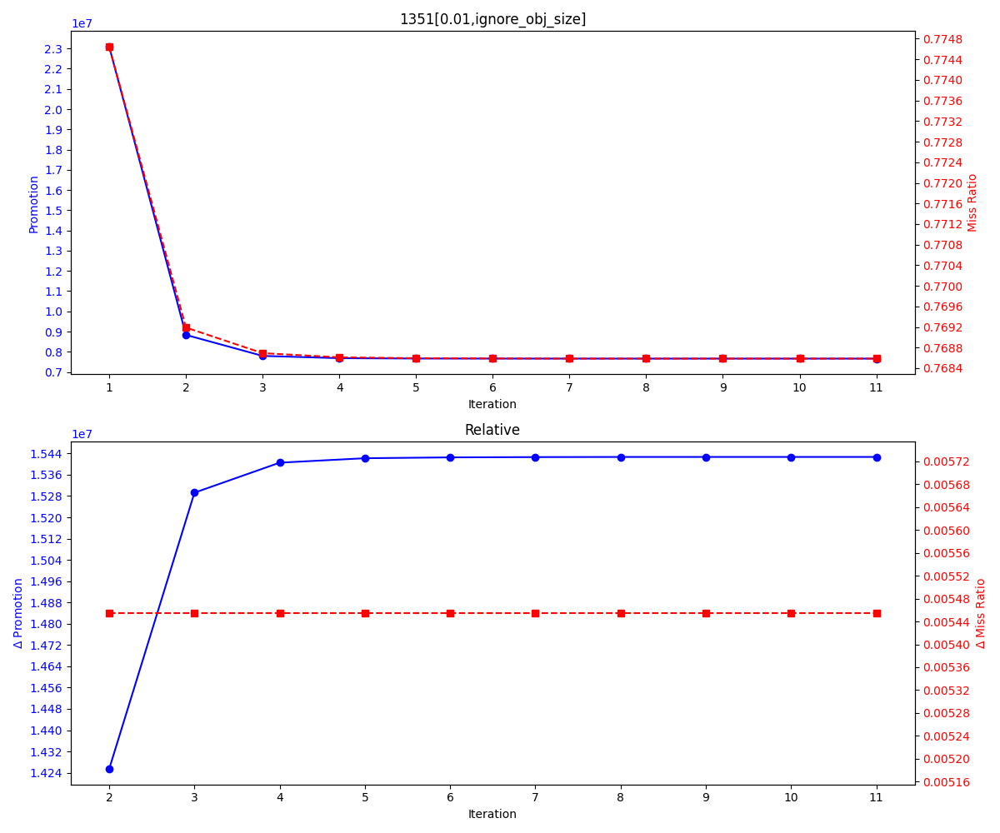  
> **Trace Path**: 1351.oracleGeneral.zst  
> **Log Path**: [../result/log/1351[0.01,ignore_obj_size].csv](../result/log/1351[0.01,ignore_obj_size].csv)  
> **Desc**: 0.01,ignore_obj_size  
> **Cache Size**: 14965  
> **Ignore Obj Size**: 1  
> **Total Request**: 195,824,302  
> **First Promotion**: 23,088,035  
> **Last Promotion**: 7,660,422  
> **Promotion Reduced**: 15,427,613  

>   
> **Trace Path**: 1351.oracleGeneral.zst  
> **Log Path**: [../result/log/1351[0.01,ignore_obj_size,ML,model=logistic_regression_0.01].csv](../result/log/1351[0.01,ignore_obj_size,ML,model=logistic_regression_0.01].csv)  
> **Desc**: 0.01,ignore_obj_size,ML,model=logistic_regression_0.01  
> **Cache Size**: 14965  
> **Ignore Obj Size**: 1  
> **Total Request**: 195,824,302  
> **First Promotion**: 0  
> **Last Promotion**: 0  
> **Promotion Reduced**: 0  

> 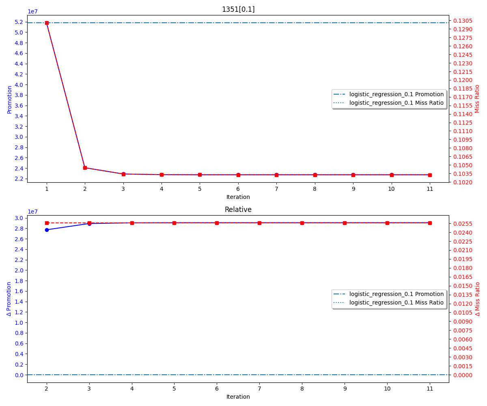  
> **Trace Path**: 1351.oracleGeneral.zst  
> **Log Path**: [../result/log/1351[0.1].csv](../result/log/1351[0.1].csv)  
> **Desc**: 0.1  
> **Cache Size**: 19112  
> **Ignore Obj Size**: 0  
> **Total Request**: 195,824,302  
> **First Promotion**: 51,806,832  
> **Last Promotion**: 22,737,061  
> **Promotion Reduced**: 29,069,771  

>   
> **Trace Path**: 1351.oracleGeneral.zst  
> **Log Path**: [../result/log/1351[0.1,ML,model=logistic_regression_0.1].csv](../result/log/1351[0.1,ML,model=logistic_regression_0.1].csv)  
> **Desc**: 0.1,ML,model=logistic_regression_0.1  
> **Cache Size**: 19112  
> **Ignore Obj Size**: 0  
> **Total Request**: 195,824,302  
> **First Promotion**: 51,806,832  
> **Last Promotion**: 51,806,832  
> **Promotion Reduced**: 0  

> 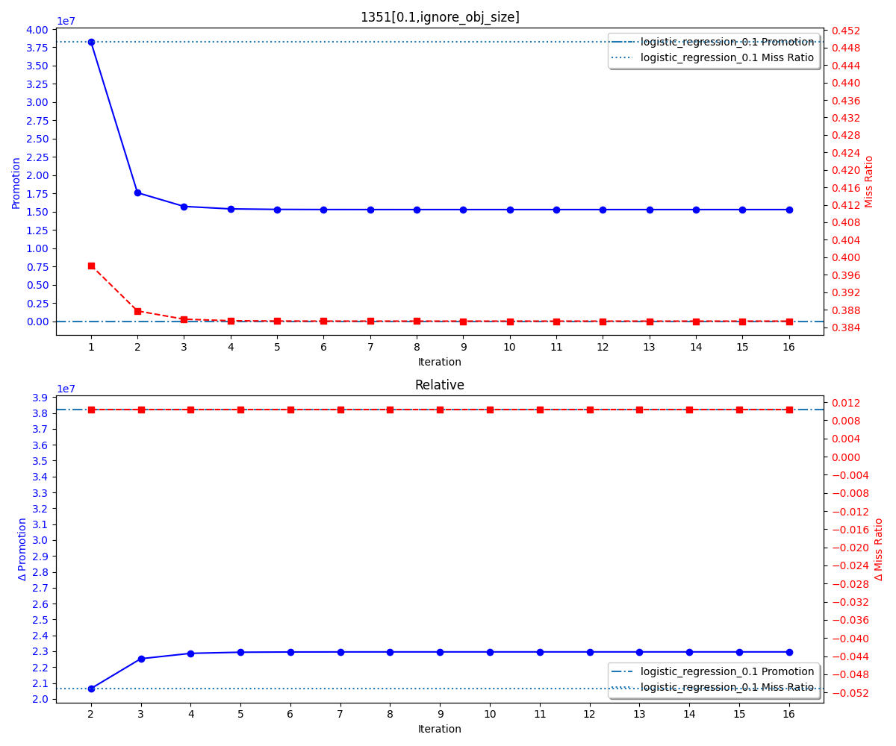  
> **Trace Path**: 1351.oracleGeneral.zst  
> **Log Path**: [../result/log/1351[0.1,ignore_obj_size].csv](../result/log/1351[0.1,ignore_obj_size].csv)  
> **Desc**: 0.1,ignore_obj_size  
> **Cache Size**: 149651  
> **Ignore Obj Size**: 1  
> **Total Request**: 195,824,302  
> **First Promotion**: 38,258,757  
> **Last Promotion**: 15,298,017  
> **Promotion Reduced**: 22,960,740  

>   
> **Trace Path**: 1351.oracleGeneral.zst  
> **Log Path**: [../result/log/1351[0.1,ignore_obj_size,ML,model=logistic_regression_0.1].csv](../result/log/1351[0.1,ignore_obj_size,ML,model=logistic_regression_0.1].csv)  
> **Desc**: 0.1,ignore_obj_size,ML,model=logistic_regression_0.1  
> **Cache Size**: 149651  
> **Ignore Obj Size**: 1  
> **Total Request**: 195,824,302  
> **First Promotion**: 23,381  
> **Last Promotion**: 23,381  
> **Promotion Reduced**: 0  

> 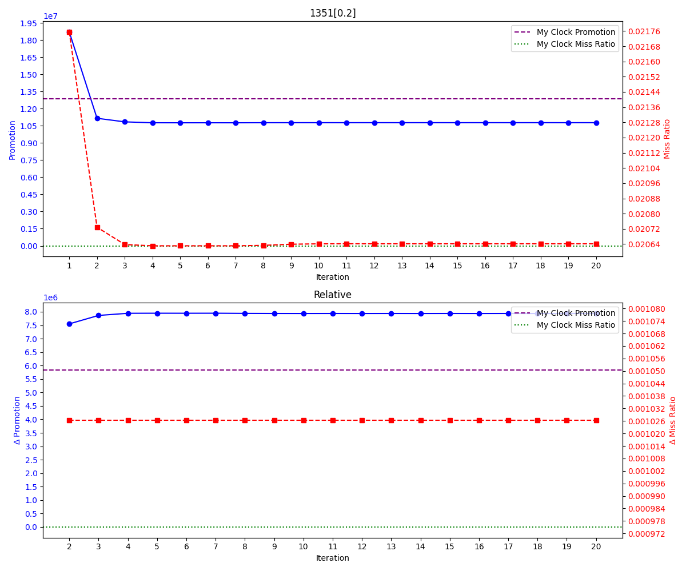  
> **Trace Path**: 1351.oracleGeneral.zst  
> **Log Path**: [../result/log/1351[0.2].csv](../result/log/1351[0.2].csv)  
> **Desc**: 0.2  
> **Cache Size**: 38224  
> **Ignore Obj Size**: 0  
> **Total Request**: 195,824,302  
> **First Promotion**: 18,710,365  
> **Last Promotion**: 10,940,489  
> **Promotion Reduced**: 7,769,876  

>   
> **Trace Path**: 1351.oracleGeneral.zst  
> **Log Path**: [../result/log/1351[0.2,ML,model=logistic_regression_0.2].csv](../result/log/1351[0.2,ML,model=logistic_regression_0.2].csv)  
> **Desc**: 0.2,ML,model=logistic_regression_0.2  
> **Cache Size**: 38224  
> **Ignore Obj Size**: 0  
> **Total Request**: 195,824,302  
> **First Promotion**: 18,710,365  
> **Last Promotion**: 18,710,365  
> **Promotion Reduced**: 0  

>   
> **Trace Path**: 1351.oracleGeneral.zst  
> **Log Path**: [../result/log/1351[0.2,ignore_obj_size].csv](../result/log/1351[0.2,ignore_obj_size].csv)  
> **Desc**: 0.2,ignore_obj_size  
> **Cache Size**: 299303  
> **Ignore Obj Size**: 1  
> **Total Request**: 195,824,302  
> **First Promotion**: 49,001,348  
> **Last Promotion**: 21,007,517  
> **Promotion Reduced**: 27,993,831  

>   
> **Trace Path**: 1351.oracleGeneral.zst  
> **Log Path**: [../result/log/1351[0.2,ignore_obj_size,ML,model=logistic_regression_0.2].csv](../result/log/1351[0.2,ignore_obj_size,ML,model=logistic_regression_0.2].csv)  
> **Desc**: 0.2,ignore_obj_size,ML,model=logistic_regression_0.2  
> **Cache Size**: 299303  
> **Ignore Obj Size**: 1  
> **Total Request**: 195,824,302  
> **First Promotion**: 1,168,061  
> **Last Promotion**: 1,168,061  
> **Promotion Reduced**: 0  

> 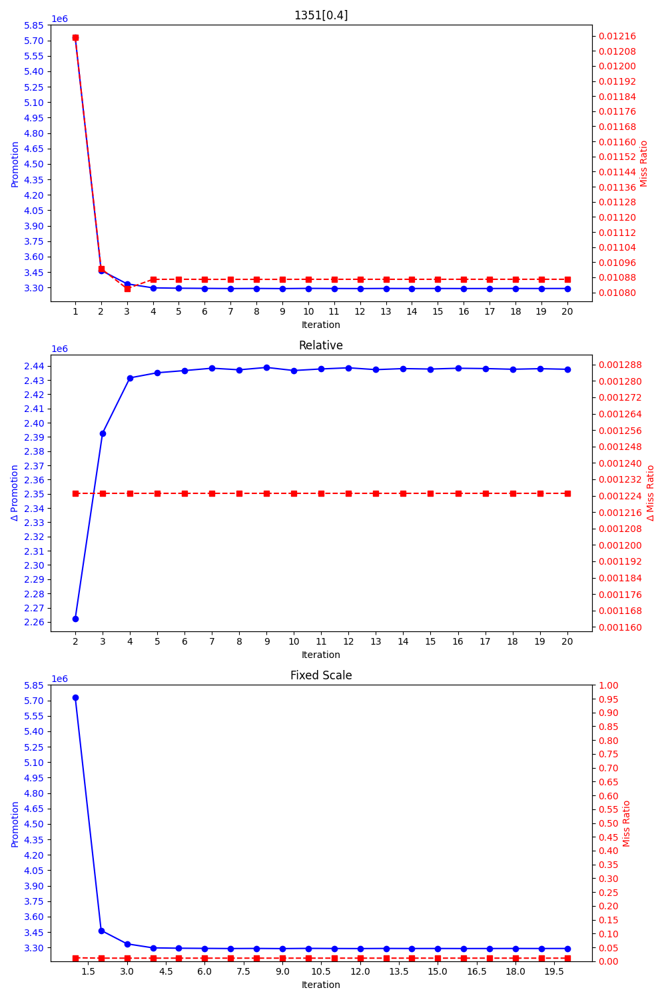  
> **Trace Path**: 1351.oracleGeneral.zst  
> **Log Path**: [../result/log/1351[0.4].csv](../result/log/1351[0.4].csv)  
> **Desc**: 0.4  
> **Cache Size**: 76449  
> **Ignore Obj Size**: 0  
> **Total Request**: 195,824,302  
> **First Promotion**: 5,728,417  
> **Last Promotion**: 3,244,964  
> **Promotion Reduced**: 2,483,453  

>   
> **Trace Path**: 1351.oracleGeneral.zst  
> **Log Path**: [../result/log/1351[0.4,ML,model=logistic_regression_0.4].csv](../result/log/1351[0.4,ML,model=logistic_regression_0.4].csv)  
> **Desc**: 0.4,ML,model=logistic_regression_0.4  
> **Cache Size**: 76449  
> **Ignore Obj Size**: 0  
> **Total Request**: 195,824,302  
> **First Promotion**: 5,728,417  
> **Last Promotion**: 5,728,417  
> **Promotion Reduced**: 0  

> 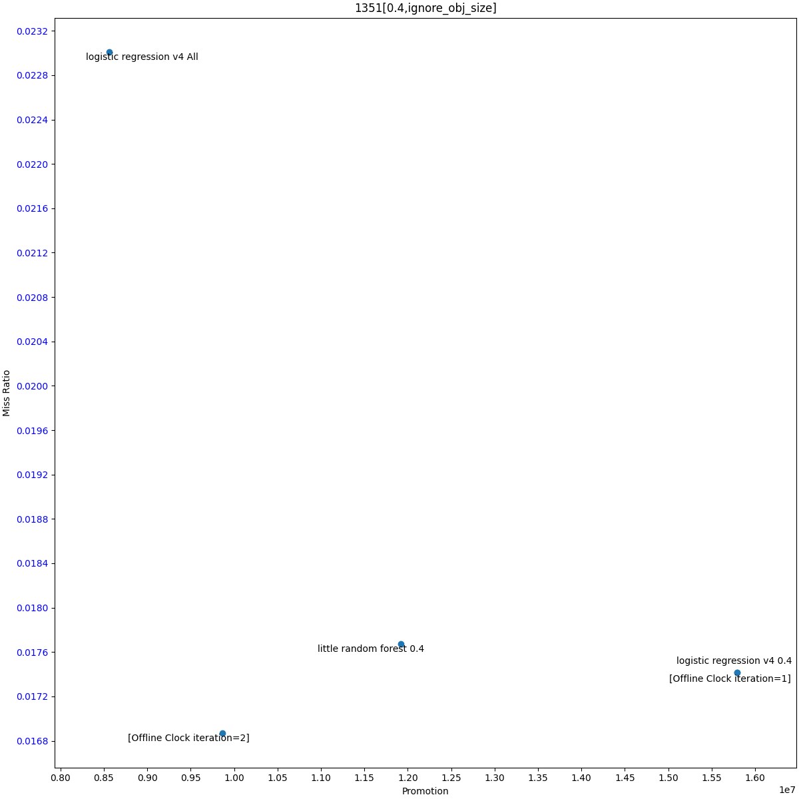  
> **Trace Path**: 1351.oracleGeneral.zst  
> **Log Path**: [../result/log/1351[0.4,ignore_obj_size].csv](../result/log/1351[0.4,ignore_obj_size].csv)  
> **Desc**: 0.4,ignore_obj_size  
> **Cache Size**: 598606  
> **Ignore Obj Size**: 1  
> **Total Request**: 195,824,302  
> **First Promotion**: 15,794,569  
> **Last Promotion**: 9,551,294  
> **Promotion Reduced**: 6,243,275  

>   
> **Trace Path**: 1351.oracleGeneral.zst  
> **Log Path**: [../result/log/1351[0.4,ignore_obj_size,ML,model=logistic_regression_0.4].csv](../result/log/1351[0.4,ignore_obj_size,ML,model=logistic_regression_0.4].csv)  
> **Desc**: 0.4,ignore_obj_size,ML,model=logistic_regression_0.4  
> **Cache Size**: 598606  
> **Ignore Obj Size**: 1  
> **Total Request**: 195,824,302  
> **First Promotion**: 14,276,091  
> **Last Promotion**: 14,276,091  
> **Promotion Reduced**: 0  

## 2016_LUN1 https://ftp.pdl.cmu.edu/pub/datasets/twemcacheWorkload/cacheDatasets/systor/2016_LUN1.oracleGeneral.zst
> 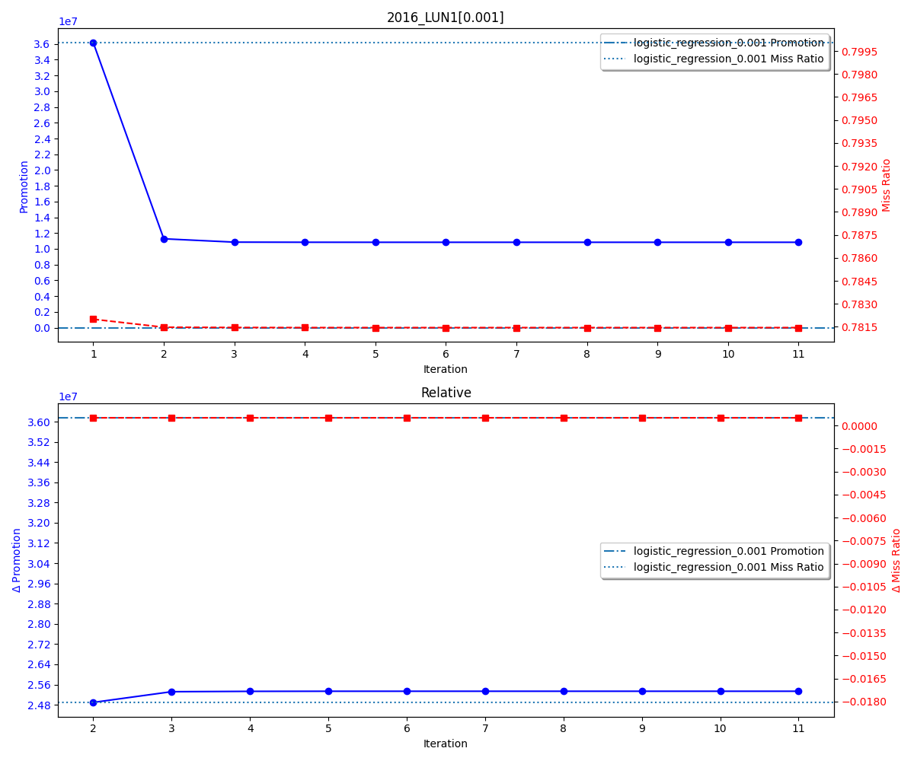  
> **Trace Path**: 2016_LUN1.oracleGeneral.zst  
> **Log Path**: [../result/log/2016_LUN1[0.001].csv](../result/log/2016_LUN1[0.001].csv)  
> **Desc**: 0.001  
> **Cache Size**: 2287  
> **Ignore Obj Size**: 0  
> **Total Request**: 492,030,661  
> **First Promotion**: 36,165,297  
> **Last Promotion**: 10,830,678  
> **Promotion Reduced**: 25,334,619  

>   
> **Trace Path**: 2016_LUN1.oracleGeneral.zst  
> **Log Path**: [../result/log/2016_LUN1[0.001,ML,model=logistic_regression_0.001].csv](../result/log/2016_LUN1[0.001,ML,model=logistic_regression_0.001].csv)  
> **Desc**: 0.001,ML,model=logistic_regression_0.001  
> **Cache Size**: 2287  
> **Ignore Obj Size**: 0  
> **Total Request**: 492,030,661  
> **First Promotion**: 0  
> **Last Promotion**: 0  
> **Promotion Reduced**: 0  

> 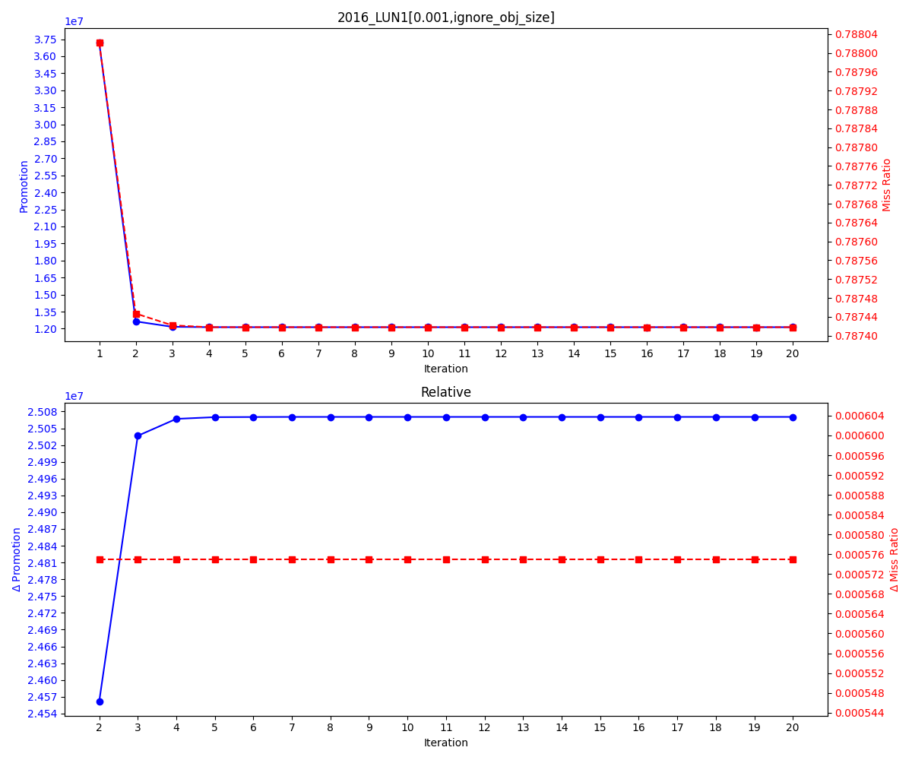  
> **Trace Path**: 2016_LUN1.oracleGeneral.zst  
> **Log Path**: [../result/log/2016_LUN1[0.001,ignore_obj_size].csv](../result/log/2016_LUN1[0.001,ignore_obj_size].csv)  
> **Desc**: 0.001,ignore_obj_size  
> **Cache Size**: 60241  
> **Ignore Obj Size**: 1  
> **Total Request**: 492,030,661  
> **First Promotion**: 37,197,962  
> **Last Promotion**: 12,127,947  
> **Promotion Reduced**: 25,070,015  

>   
> **Trace Path**: 2016_LUN1.oracleGeneral.zst  
> **Log Path**: [../result/log/2016_LUN1[0.001,ignore_obj_size,ML,model=logistic_regression_0.001].csv](../result/log/2016_LUN1[0.001,ignore_obj_size,ML,model=logistic_regression_0.001].csv)  
> **Desc**: 0.001,ignore_obj_size,ML,model=logistic_regression_0.001  
> **Cache Size**: 60241  
> **Ignore Obj Size**: 1  
> **Total Request**: 492,030,661  
> **First Promotion**: 0  
> **Last Promotion**: 0  
> **Promotion Reduced**: 0  

> 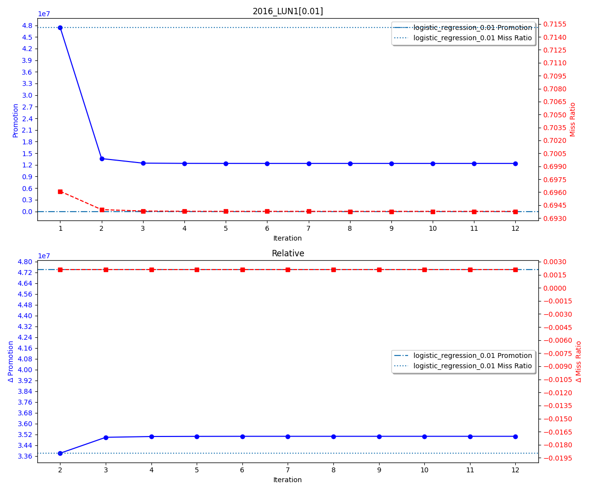  
> **Trace Path**: 2016_LUN1.oracleGeneral.zst  
> **Log Path**: [../result/log/2016_LUN1[0.01].csv](../result/log/2016_LUN1[0.01].csv)  
> **Desc**: 0.01  
> **Cache Size**: 22876  
> **Ignore Obj Size**: 0  
> **Total Request**: 492,030,661  
> **First Promotion**: 47,432,356  
> **Last Promotion**: 12,370,792  
> **Promotion Reduced**: 35,061,564  

>   
> **Trace Path**: 2016_LUN1.oracleGeneral.zst  
> **Log Path**: [../result/log/2016_LUN1[0.01,ML,model=logistic_regression_0.01].csv](../result/log/2016_LUN1[0.01,ML,model=logistic_regression_0.01].csv)  
> **Desc**: 0.01,ML,model=logistic_regression_0.01  
> **Cache Size**: 22876  
> **Ignore Obj Size**: 0  
> **Total Request**: 492,030,661  
> **First Promotion**: 0  
> **Last Promotion**: 0  
> **Promotion Reduced**: 0  

> 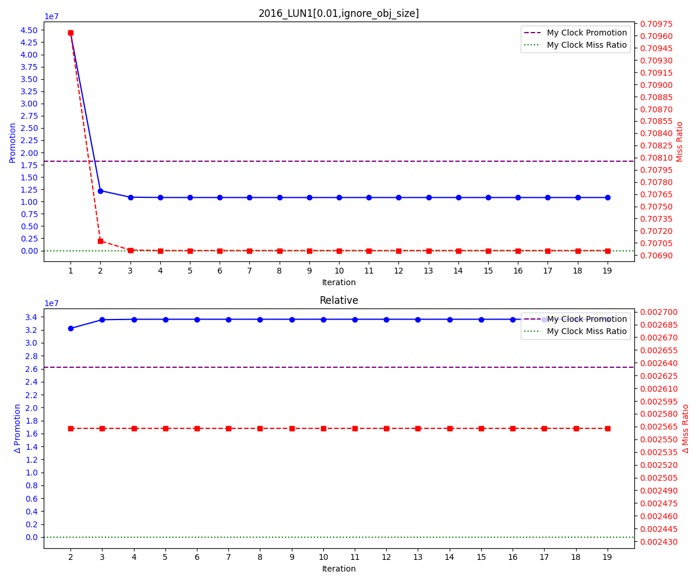  
> **Trace Path**: 2016_LUN1.oracleGeneral.zst  
> **Log Path**: [../result/log/2016_LUN1[0.01,ignore_obj_size].csv](../result/log/2016_LUN1[0.01,ignore_obj_size].csv)  
> **Desc**: 0.01,ignore_obj_size  
> **Cache Size**: 602419  
> **Ignore Obj Size**: 1  
> **Total Request**: 492,030,661  
> **First Promotion**: 44,445,347  
> **Last Promotion**: 10,812,378  
> **Promotion Reduced**: 33,632,969  

>   
> **Trace Path**: 2016_LUN1.oracleGeneral.zst  
> **Log Path**: [../result/log/2016_LUN1[0.01,ignore_obj_size,ML,model=logistic_regression_0.01].csv](../result/log/2016_LUN1[0.01,ignore_obj_size,ML,model=logistic_regression_0.01].csv)  
> **Desc**: 0.01,ignore_obj_size,ML,model=logistic_regression_0.01  
> **Cache Size**: 602419  
> **Ignore Obj Size**: 1  
> **Total Request**: 492,030,661  
> **First Promotion**: 0  
> **Last Promotion**: 0  
> **Promotion Reduced**: 0  

> 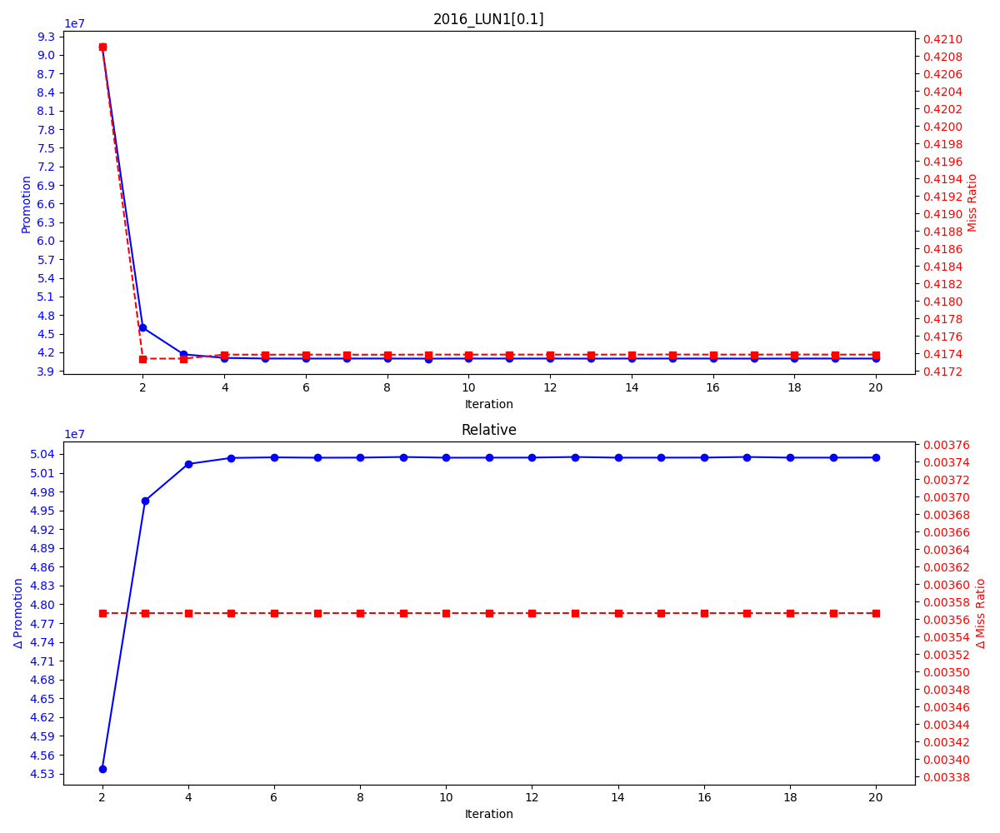  
> **Trace Path**: 2016_LUN1.oracleGeneral.zst  
> **Log Path**: [../result/log/2016_LUN1[0.1].csv](../result/log/2016_LUN1[0.1].csv)  
> **Desc**: 0.1  
> **Cache Size**: 228766  
> **Ignore Obj Size**: 0  
> **Total Request**: 492,030,661  
> **First Promotion**: 91,323,446  
> **Last Promotion**: 40,674,910  
> **Promotion Reduced**: 50,648,536  

>   
> **Trace Path**: 2016_LUN1.oracleGeneral.zst  
> **Log Path**: [../result/log/2016_LUN1[0.1,ML,model=logistic_regression_0.1].csv](../result/log/2016_LUN1[0.1,ML,model=logistic_regression_0.1].csv)  
> **Desc**: 0.1,ML,model=logistic_regression_0.1  
> **Cache Size**: 228766  
> **Ignore Obj Size**: 0  
> **Total Request**: 492,030,661  
> **First Promotion**: 0  
> **Last Promotion**: 0  
> **Promotion Reduced**: 0  

> 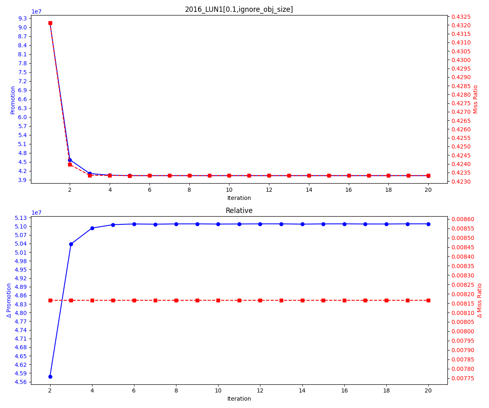  
> **Trace Path**: 2016_LUN1.oracleGeneral.zst  
> **Log Path**: [../result/log/2016_LUN1[0.1,ignore_obj_size].csv](../result/log/2016_LUN1[0.1,ignore_obj_size].csv)  
> **Desc**: 0.1,ignore_obj_size  
> **Cache Size**: 6024191  
> **Ignore Obj Size**: 1  
> **Total Request**: 492,030,661  
> **First Promotion**: 91,470,796  
> **Last Promotion**: 40,068,519  
> **Promotion Reduced**: 51,402,277  

>   
> **Trace Path**: 2016_LUN1.oracleGeneral.zst  
> **Log Path**: [../result/log/2016_LUN1[0.1,ignore_obj_size,ML,model=logistic_regression_0.1].csv](../result/log/2016_LUN1[0.1,ignore_obj_size,ML,model=logistic_regression_0.1].csv)  
> **Desc**: 0.1,ignore_obj_size,ML,model=logistic_regression_0.1  
> **Cache Size**: 6024191  
> **Ignore Obj Size**: 1  
> **Total Request**: 492,030,661  
> **First Promotion**: 131,213  
> **Last Promotion**: 131,213  
> **Promotion Reduced**: 0  

> 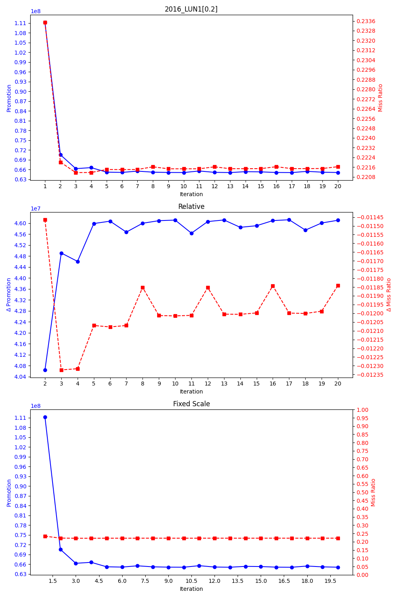  
> **Trace Path**: 2016_LUN1.oracleGeneral.zst  
> **Log Path**: [../result/log/2016_LUN1[0.2].csv](../result/log/2016_LUN1[0.2].csv)  
> **Desc**: 0.2  
> **Cache Size**: 457532  
> **Ignore Obj Size**: 0  
> **Total Request**: 492,030,661  
> **First Promotion**: 111,167,120  
> **Last Promotion**: 63,666,954  
> **Promotion Reduced**: 47,500,166  

>   
> **Trace Path**: 2016_LUN1.oracleGeneral.zst  
> **Log Path**: [../result/log/2016_LUN1[0.2,ML,model=logistic_regression_0.2].csv](../result/log/2016_LUN1[0.2,ML,model=logistic_regression_0.2].csv)  
> **Desc**: 0.2,ML,model=logistic_regression_0.2  
> **Cache Size**: 457532  
> **Ignore Obj Size**: 0  
> **Total Request**: 492,030,661  
> **First Promotion**: 0  
> **Last Promotion**: 0  
> **Promotion Reduced**: 0  

> 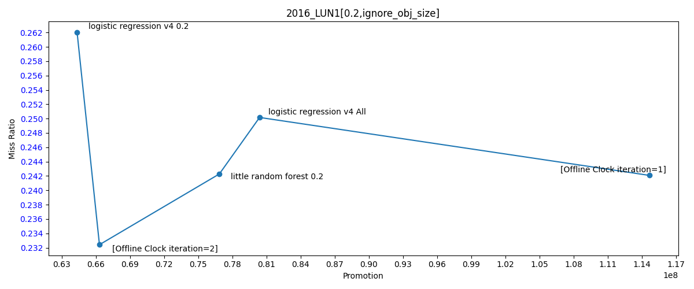  
> **Trace Path**: 2016_LUN1.oracleGeneral.zst  
> **Log Path**: [../result/log/2016_LUN1[0.2,ignore_obj_size].csv](../result/log/2016_LUN1[0.2,ignore_obj_size].csv)  
> **Desc**: 0.2,ignore_obj_size  
> **Cache Size**: 12048382  
> **Ignore Obj Size**: 1  
> **Total Request**: 492,030,661  
> **First Promotion**: 114,666,585  
> **Last Promotion**: 62,740,419  
> **Promotion Reduced**: 51,926,166  

>   
> **Trace Path**: 2016_LUN1.oracleGeneral.zst  
> **Log Path**: [../result/log/2016_LUN1[0.2,ignore_obj_size,ML,model=logistic_regression_0.2].csv](../result/log/2016_LUN1[0.2,ignore_obj_size,ML,model=logistic_regression_0.2].csv)  
> **Desc**: 0.2,ignore_obj_size,ML,model=logistic_regression_0.2  
> **Cache Size**: 12048382  
> **Ignore Obj Size**: 1  
> **Total Request**: 492,030,661  
> **First Promotion**: 64,992,843  
> **Last Promotion**: 64,992,843  
> **Promotion Reduced**: 0  

> 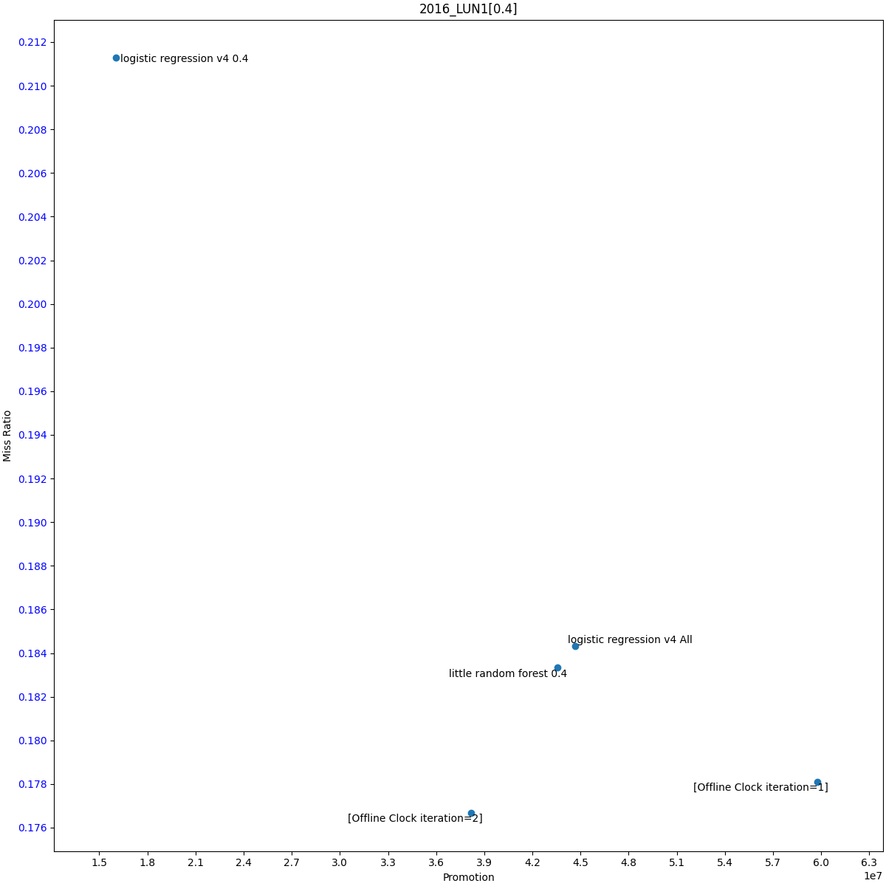  
> **Trace Path**: 2016_LUN1.oracleGeneral.zst  
> **Log Path**: [../result/log/2016_LUN1[0.4].csv](../result/log/2016_LUN1[0.4].csv)  
> **Desc**: 0.4  
> **Cache Size**: 915064  
> **Ignore Obj Size**: 0  
> **Total Request**: 492,030,661  
> **First Promotion**: 59,773,712  
> **Last Promotion**: 37,185,323  
> **Promotion Reduced**: 22,588,389  

>   
> **Trace Path**: 2016_LUN1.oracleGeneral.zst  
> **Log Path**: [../result/log/2016_LUN1[0.4,ML,model=logistic_regression_0.4].csv](../result/log/2016_LUN1[0.4,ML,model=logistic_regression_0.4].csv)  
> **Desc**: 0.4,ML,model=logistic_regression_0.4  
> **Cache Size**: 915064  
> **Ignore Obj Size**: 0  
> **Total Request**: 492,030,661  
> **First Promotion**: 2,652,074  
> **Last Promotion**: 2,652,074  
> **Promotion Reduced**: 0  

> 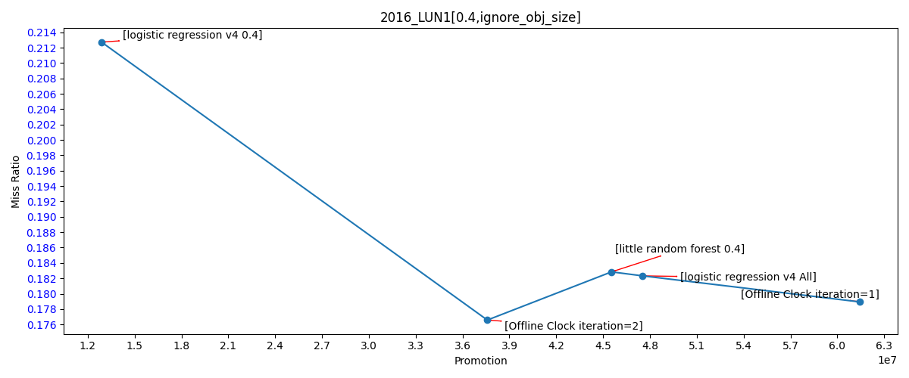  
> **Trace Path**: 2016_LUN1.oracleGeneral.zst  
> **Log Path**: [../result/log/2016_LUN1[0.4,ignore_obj_size].csv](../result/log/2016_LUN1[0.4,ignore_obj_size].csv)  
> **Desc**: 0.4,ignore_obj_size  
> **Cache Size**: 24096764  
> **Ignore Obj Size**: 1  
> **Total Request**: 492,030,661  
> **First Promotion**: 61,435,620  
> **Last Promotion**: 36,457,695  
> **Promotion Reduced**: 24,977,925  

>   
> **Trace Path**: 2016_LUN1.oracleGeneral.zst  
> **Log Path**: [../result/log/2016_LUN1[0.4,ignore_obj_size,ML,model=logistic_regression_0.4].csv](../result/log/2016_LUN1[0.4,ignore_obj_size,ML,model=logistic_regression_0.4].csv)  
> **Desc**: 0.4,ignore_obj_size,ML,model=logistic_regression_0.4  
> **Cache Size**: 24096764  
> **Ignore Obj Size**: 1  
> **Total Request**: 492,030,661  
> **First Promotion**: 25,926,116  
> **Last Promotion**: 25,926,116  
> **Promotion Reduced**: 0  

## 7 https://ftp.pdl.cmu.edu/pub/datasets/twemcacheWorkload/cacheDatasets/twitter/cluster7.oracleGeneral.zst
> 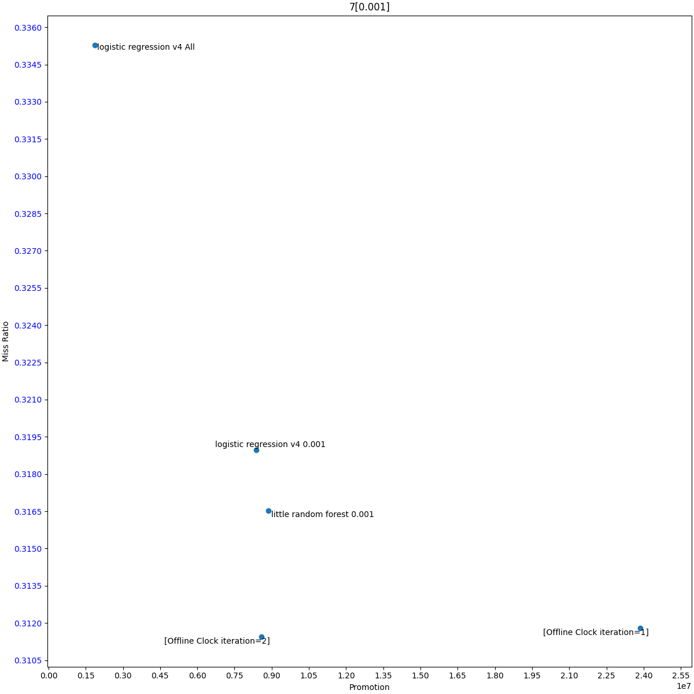  
> **Trace Path**: 7.oracleGeneral.zst  
> **Log Path**: [../result/log/7[0.001].csv](../result/log/7[0.001].csv)  
> **Desc**: 0.001  
> **Cache Size**: 131  
> **Ignore Obj Size**: 0  
> **Total Request**: 265,694,431  
> **First Promotion**: 23,868,697  
> **Last Promotion**: 8,269,446  
> **Promotion Reduced**: 15,599,251  

>   
> **Trace Path**: 7.oracleGeneral.zst  
> **Log Path**: [../result/log/7[0.001,ML,model=logistic_regression_0.001].csv](../result/log/7[0.001,ML,model=logistic_regression_0.001].csv)  
> **Desc**: 0.001,ML,model=logistic_regression_0.001  
> **Cache Size**: 131  
> **Ignore Obj Size**: 0  
> **Total Request**: 265,694,431  
> **First Promotion**: 0  
> **Last Promotion**: 0  
> **Promotion Reduced**: 0  

> 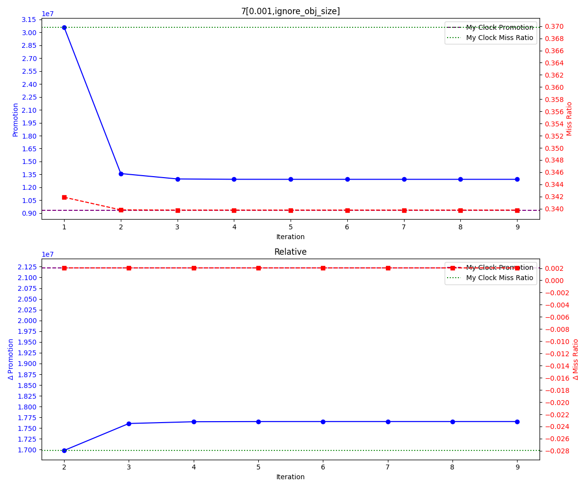  
> **Trace Path**: 7.oracleGeneral.zst  
> **Log Path**: [../result/log/7[0.001,ignore_obj_size].csv](../result/log/7[0.001,ignore_obj_size].csv)  
> **Desc**: 0.001,ignore_obj_size  
> **Cache Size**: 4808  
> **Ignore Obj Size**: 1  
> **Total Request**: 265,694,431  
> **First Promotion**: 30,582,135  
> **Last Promotion**: 12,928,824  
> **Promotion Reduced**: 17,653,311  

>   
> **Trace Path**: 7.oracleGeneral.zst  
> **Log Path**: [../result/log/7[0.001,ignore_obj_size,ML,model=logistic_regression_0.001].csv](../result/log/7[0.001,ignore_obj_size,ML,model=logistic_regression_0.001].csv)  
> **Desc**: 0.001,ignore_obj_size,ML,model=logistic_regression_0.001  
> **Cache Size**: 4808  
> **Ignore Obj Size**: 1  
> **Total Request**: 265,694,431  
> **First Promotion**: 0  
> **Last Promotion**: 0  
> **Promotion Reduced**: 0  

> 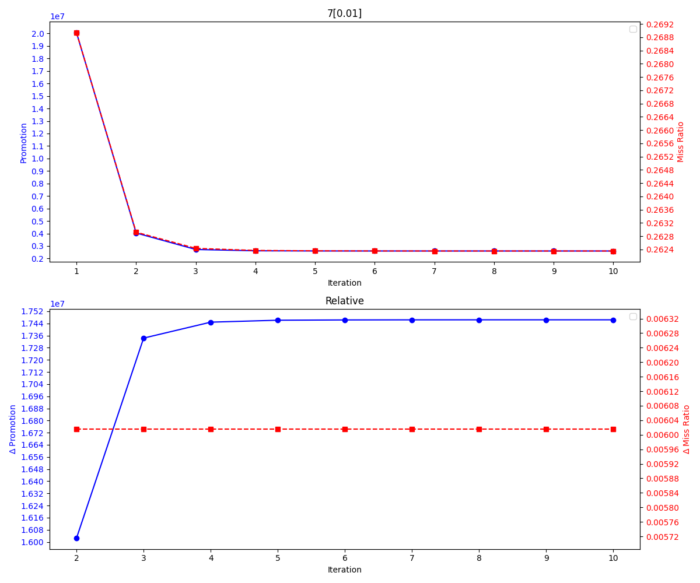  
> **Trace Path**: 7.oracleGeneral.zst  
> **Log Path**: [../result/log/7[0.01].csv](../result/log/7[0.01].csv)  
> **Desc**: 0.01  
> **Cache Size**: 1314  
> **Ignore Obj Size**: 0  
> **Total Request**: 265,694,431  
> **First Promotion**: 20,065,703  
> **Last Promotion**: 2,601,656  
> **Promotion Reduced**: 17,464,047  

>   
> **Trace Path**: 7.oracleGeneral.zst  
> **Log Path**: [../result/log/7[0.01,ML,model=logistic_regression_0.01].csv](../result/log/7[0.01,ML,model=logistic_regression_0.01].csv)  
> **Desc**: 0.01,ML,model=logistic_regression_0.01  
> **Cache Size**: 1314  
> **Ignore Obj Size**: 0  
> **Total Request**: 265,694,431  
> **First Promotion**: 0  
> **Last Promotion**: 0  
> **Promotion Reduced**: 0  

> 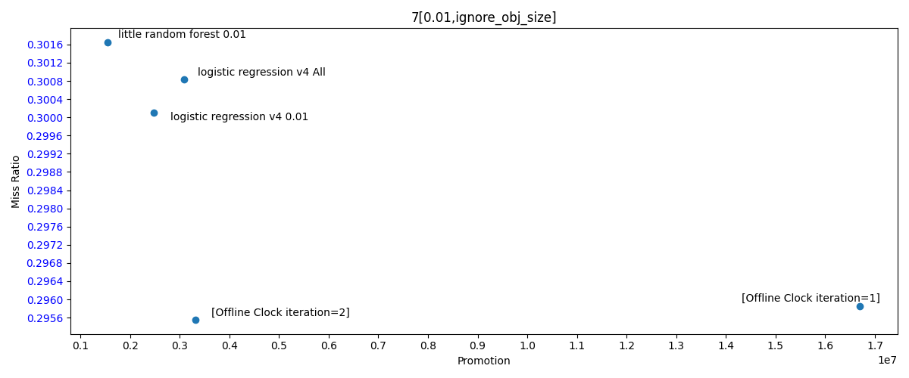  
> **Trace Path**: 7.oracleGeneral.zst  
> **Log Path**: [../result/log/7[0.01,ignore_obj_size].csv](../result/log/7[0.01,ignore_obj_size].csv)  
> **Desc**: 0.01,ignore_obj_size  
> **Cache Size**: 48085  
> **Ignore Obj Size**: 1  
> **Total Request**: 265,694,431  
> **First Promotion**: 16,701,078  
> **Last Promotion**: 3,188,700  
> **Promotion Reduced**: 13,512,378  

>   
> **Trace Path**: 7.oracleGeneral.zst  
> **Log Path**: [../result/log/7[0.01,ignore_obj_size,ML,model=logistic_regression_0.01].csv](../result/log/7[0.01,ignore_obj_size,ML,model=logistic_regression_0.01].csv)  
> **Desc**: 0.01,ignore_obj_size,ML,model=logistic_regression_0.01  
> **Cache Size**: 48085  
> **Ignore Obj Size**: 1  
> **Total Request**: 265,694,431  
> **First Promotion**: 0  
> **Last Promotion**: 0  
> **Promotion Reduced**: 0  

> 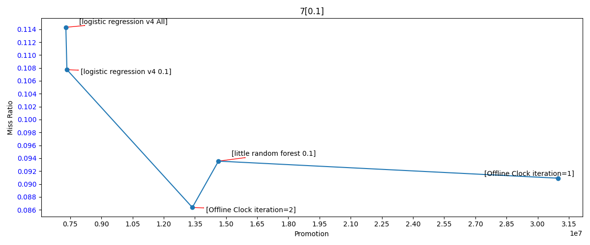  
> **Trace Path**: 7.oracleGeneral.zst  
> **Log Path**: [../result/log/7[0.1].csv](../result/log/7[0.1].csv)  
> **Desc**: 0.1  
> **Cache Size**: 13148  
> **Ignore Obj Size**: 0  
> **Total Request**: 265,694,431  
> **First Promotion**: 30,978,318  
> **Last Promotion**: 12,345,121  
> **Promotion Reduced**: 18,633,197  

>   
> **Trace Path**: 7.oracleGeneral.zst  
> **Log Path**: [../result/log/7[0.1,ML,model=logistic_regression_0.1].csv](../result/log/7[0.1,ML,model=logistic_regression_0.1].csv)  
> **Desc**: 0.1,ML,model=logistic_regression_0.1  
> **Cache Size**: 13148  
> **Ignore Obj Size**: 0  
> **Total Request**: 265,694,431  
> **First Promotion**: 30,978,318  
> **Last Promotion**: 30,978,318  
> **Promotion Reduced**: 0  

> 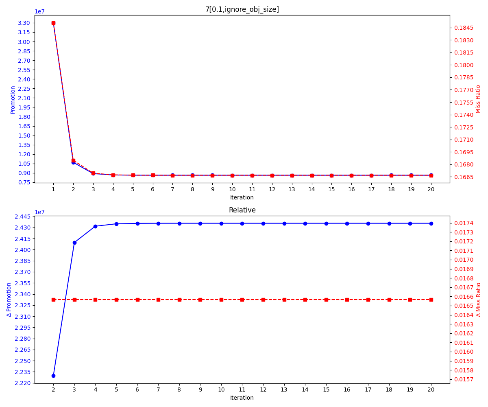  
> **Trace Path**: 7.oracleGeneral.zst  
> **Log Path**: [../result/log/7[0.1,ignore_obj_size].csv](../result/log/7[0.1,ignore_obj_size].csv)  
> **Desc**: 0.1,ignore_obj_size  
> **Cache Size**: 480854  
> **Ignore Obj Size**: 1  
> **Total Request**: 265,694,431  
> **First Promotion**: 32,990,862  
> **Last Promotion**: 8,560,763  
> **Promotion Reduced**: 24,430,099  

>   
> **Trace Path**: 7.oracleGeneral.zst  
> **Log Path**: [../result/log/7[0.1,ignore_obj_size,ML,model=logistic_regression_0.1].csv](../result/log/7[0.1,ignore_obj_size,ML,model=logistic_regression_0.1].csv)  
> **Desc**: 0.1,ignore_obj_size,ML,model=logistic_regression_0.1  
> **Cache Size**: 480854  
> **Ignore Obj Size**: 1  
> **Total Request**: 265,694,431  
> **First Promotion**: 44,344  
> **Last Promotion**: 44,344  
> **Promotion Reduced**: 0  

> 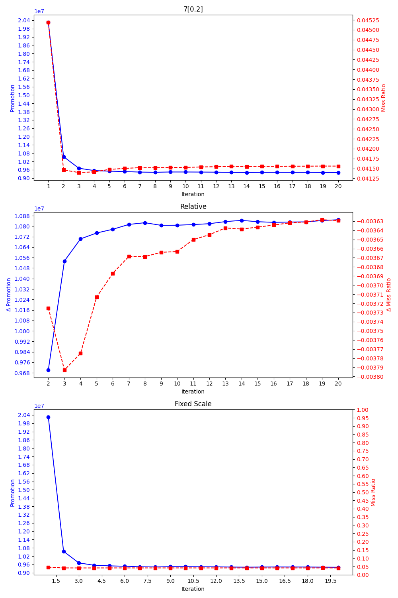  
> **Trace Path**: 7.oracleGeneral.zst  
> **Log Path**: [../result/log/7[0.2].csv](../result/log/7[0.2].csv)  
> **Desc**: 0.2  
> **Cache Size**: 26296  
> **Ignore Obj Size**: 0  
> **Total Request**: 265,694,431  
> **First Promotion**: 20,250,750  
> **Last Promotion**: 9,268,285  
> **Promotion Reduced**: 10,982,465  

>   
> **Trace Path**: 7.oracleGeneral.zst  
> **Log Path**: [../result/log/7[0.2,ML,model=logistic_regression_0.2].csv](../result/log/7[0.2,ML,model=logistic_regression_0.2].csv)  
> **Desc**: 0.2,ML,model=logistic_regression_0.2  
> **Cache Size**: 26296  
> **Ignore Obj Size**: 0  
> **Total Request**: 265,694,431  
> **First Promotion**: 20,250,750  
> **Last Promotion**: 20,250,750  
> **Promotion Reduced**: 0  

> 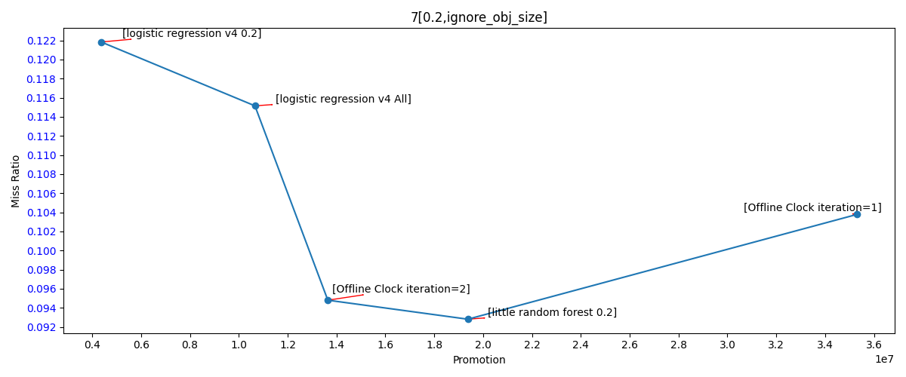  
> **Trace Path**: 7.oracleGeneral.zst  
> **Log Path**: [../result/log/7[0.2,ignore_obj_size].csv](../result/log/7[0.2,ignore_obj_size].csv)  
> **Desc**: 0.2,ignore_obj_size  
> **Cache Size**: 961708  
> **Ignore Obj Size**: 1  
> **Total Request**: 265,694,431  
> **First Promotion**: 35,298,006  
> **Last Promotion**: 12,358,790  
> **Promotion Reduced**: 22,939,216  

>   
> **Trace Path**: 7.oracleGeneral.zst  
> **Log Path**: [../result/log/7[0.2,ignore_obj_size,ML,model=logistic_regression_0.2].csv](../result/log/7[0.2,ignore_obj_size,ML,model=logistic_regression_0.2].csv)  
> **Desc**: 0.2,ignore_obj_size,ML,model=logistic_regression_0.2  
> **Cache Size**: 961708  
> **Ignore Obj Size**: 1  
> **Total Request**: 265,694,431  
> **First Promotion**: 582,959  
> **Last Promotion**: 582,959  
> **Promotion Reduced**: 0  

> 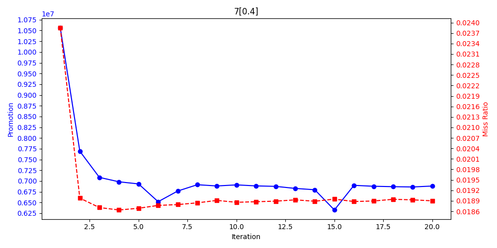  
> **Trace Path**: 7.oracleGeneral.zst  
> **Log Path**: [../result/log/7[0.4].csv](../result/log/7[0.4].csv)  
> **Desc**: 0.4  
> **Cache Size**: 52593  
> **Ignore Obj Size**: 0  
> **Total Request**: 265,694,431  
> **First Promotion**: 10,566,667  
> **Last Promotion**: 6,072,052  
> **Promotion Reduced**: 4,494,615  

>   
> **Trace Path**: 7.oracleGeneral.zst  
> **Log Path**: [../result/log/7[0.4,ML,model=logistic_regression_0.4].csv](../result/log/7[0.4,ML,model=logistic_regression_0.4].csv)  
> **Desc**: 0.4,ML,model=logistic_regression_0.4  
> **Cache Size**: 52593  
> **Ignore Obj Size**: 0  
> **Total Request**: 265,694,431  
> **First Promotion**: 10,566,667  
> **Last Promotion**: 10,566,667  
> **Promotion Reduced**: 0  

> 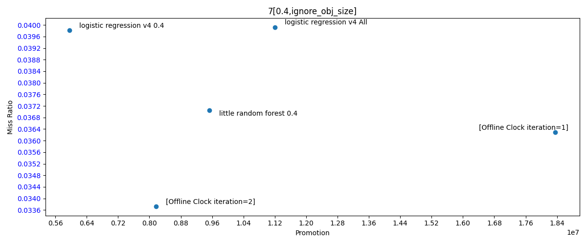  
> **Trace Path**: 7.oracleGeneral.zst  
> **Log Path**: [../result/log/7[0.4,ignore_obj_size].csv](../result/log/7[0.4,ignore_obj_size].csv)  
> **Desc**: 0.4,ignore_obj_size  
> **Cache Size**: 1923416  
> **Ignore Obj Size**: 1  
> **Total Request**: 265,694,431  
> **First Promotion**: 18,359,000  
> **Last Promotion**: 7,611,954  
> **Promotion Reduced**: 10,747,046  

>   
> **Trace Path**: 7.oracleGeneral.zst  
> **Log Path**: [../result/log/7[0.4,ignore_obj_size,ML,model=logistic_regression_0.4].csv](../result/log/7[0.4,ignore_obj_size,ML,model=logistic_regression_0.4].csv)  
> **Desc**: 0.4,ignore_obj_size,ML,model=logistic_regression_0.4  
> **Cache Size**: 1923416  
> **Ignore Obj Size**: 1  
> **Total Request**: 265,694,431  
> **First Promotion**: 16,976,128  
> **Last Promotion**: 16,976,128  
> **Promotion Reduced**: 0  

## block_traces_5 
> 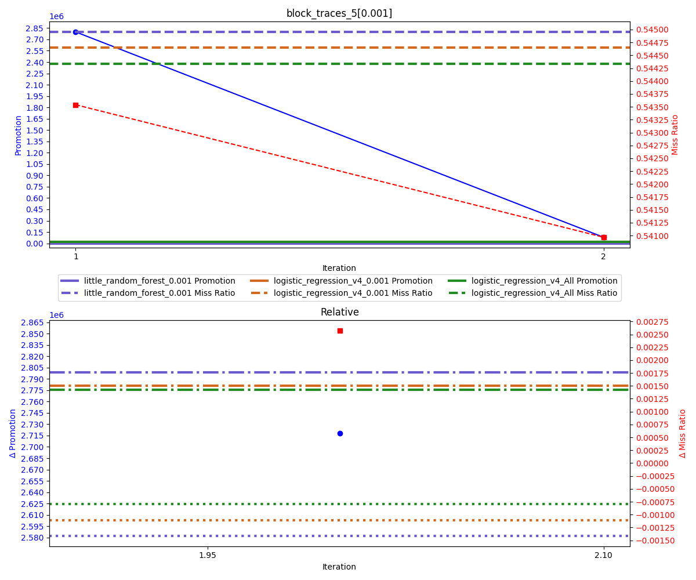  
> **Trace Path**: block_traces_5.oracleGeneral.bin.zst  
> **Log Path**: [../result/log/block_traces_5[0.001].csv](../result/log/block_traces_5[0.001].csv)  
> **Desc**: 0.001  
> **Cache Size**: 31349  
> **Ignore Obj Size**: 0  
> **Total Request**: 14,556,172  
> **First Promotion**: 2,799,029  
> **Last Promotion**: 66,782  
> **Promotion Reduced**: 2,732,247  

>   
> **Trace Path**: block_traces_5.oracleGeneral.bin.zst  
> **Log Path**: [../result/log/block_traces_5[0.001,ML,model=logistic_regression_0.001].csv](../result/log/block_traces_5[0.001,ML,model=logistic_regression_0.001].csv)  
> **Desc**: 0.001,ML,model=logistic_regression_0.001  
> **Cache Size**: 31349  
> **Ignore Obj Size**: 0  
> **Total Request**: 14,556,172  
> **First Promotion**: 0  
> **Last Promotion**: 0  
> **Promotion Reduced**: 0  

> 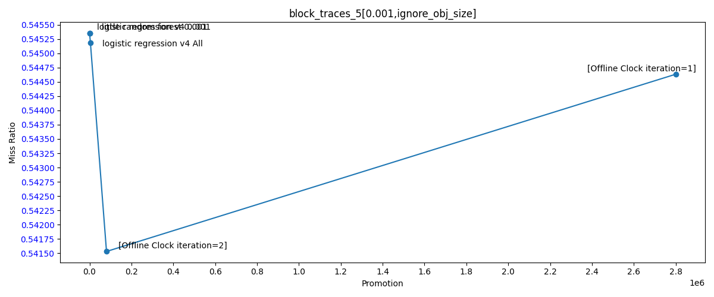  
> **Trace Path**: block_traces_5.oracleGeneral.bin.zst  
> **Log Path**: [../result/log/block_traces_5[0.001,ignore_obj_size].csv](../result/log/block_traces_5[0.001,ignore_obj_size].csv)  
> **Desc**: 0.001,ignore_obj_size  
> **Cache Size**: 7110  
> **Ignore Obj Size**: 1  
> **Total Request**: 14,556,172  
> **First Promotion**: 2,800,236  
> **Last Promotion**: 64,395  
> **Promotion Reduced**: 2,735,841  

>   
> **Trace Path**: block_traces_5.oracleGeneral.bin.zst  
> **Log Path**: [../result/log/block_traces_5[0.001,ignore_obj_size,ML,model=logistic_regression_0.001].csv](../result/log/block_traces_5[0.001,ignore_obj_size,ML,model=logistic_regression_0.001].csv)  
> **Desc**: 0.001,ignore_obj_size,ML,model=logistic_regression_0.001  
> **Cache Size**: 7110  
> **Ignore Obj Size**: 1  
> **Total Request**: 14,556,172  
> **First Promotion**: 0  
> **Last Promotion**: 0  
> **Promotion Reduced**: 0  

> 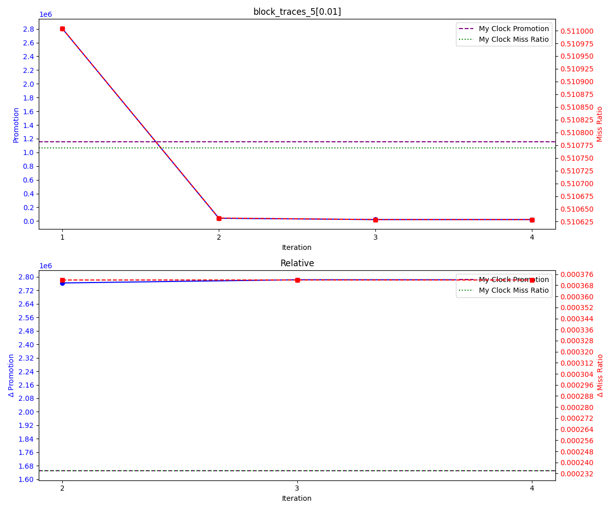  
> **Trace Path**: block_traces_5.oracleGeneral.bin.zst  
> **Log Path**: [../result/log/block_traces_5[0.01].csv](../result/log/block_traces_5[0.01].csv)  
> **Desc**: 0.01  
> **Cache Size**: 313497  
> **Ignore Obj Size**: 0  
> **Total Request**: 14,556,172  
> **First Promotion**: 2,804,423  
> **Last Promotion**: 21,437  
> **Promotion Reduced**: 2,782,986  

>   
> **Trace Path**: block_traces_5.oracleGeneral.bin.zst  
> **Log Path**: [../result/log/block_traces_5[0.01,ML,model=logistic_regression_0.01].csv](../result/log/block_traces_5[0.01,ML,model=logistic_regression_0.01].csv)  
> **Desc**: 0.01,ML,model=logistic_regression_0.01  
> **Cache Size**: 313497  
> **Ignore Obj Size**: 0  
> **Total Request**: 14,556,172  
> **First Promotion**: 0  
> **Last Promotion**: 0  
> **Promotion Reduced**: 0  

> 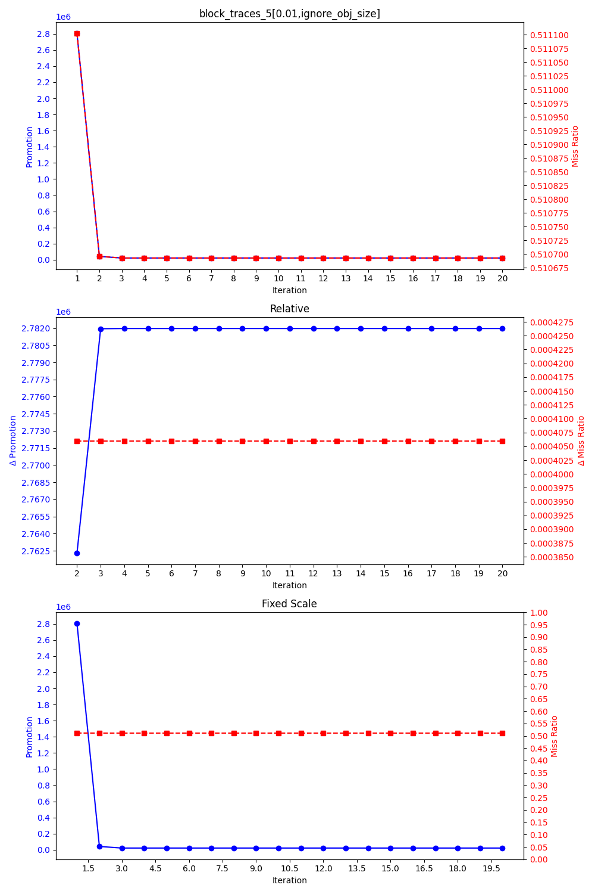  
> **Trace Path**: block_traces_5.oracleGeneral.bin.zst  
> **Log Path**: [../result/log/block_traces_5[0.01,ignore_obj_size].csv](../result/log/block_traces_5[0.01,ignore_obj_size].csv)  
> **Desc**: 0.01,ignore_obj_size  
> **Cache Size**: 71104  
> **Ignore Obj Size**: 1  
> **Total Request**: 14,556,172  
> **First Promotion**: 2,803,707  
> **Last Promotion**: 21,741  
> **Promotion Reduced**: 2,781,966  

>   
> **Trace Path**: block_traces_5.oracleGeneral.bin.zst  
> **Log Path**: [../result/log/block_traces_5[0.01,ignore_obj_size,ML,model=logistic_regression_0.01].csv](../result/log/block_traces_5[0.01,ignore_obj_size,ML,model=logistic_regression_0.01].csv)  
> **Desc**: 0.01,ignore_obj_size,ML,model=logistic_regression_0.01  
> **Cache Size**: 71104  
> **Ignore Obj Size**: 1  
> **Total Request**: 14,556,172  
> **First Promotion**: 0  
> **Last Promotion**: 0  
> **Promotion Reduced**: 0  

> 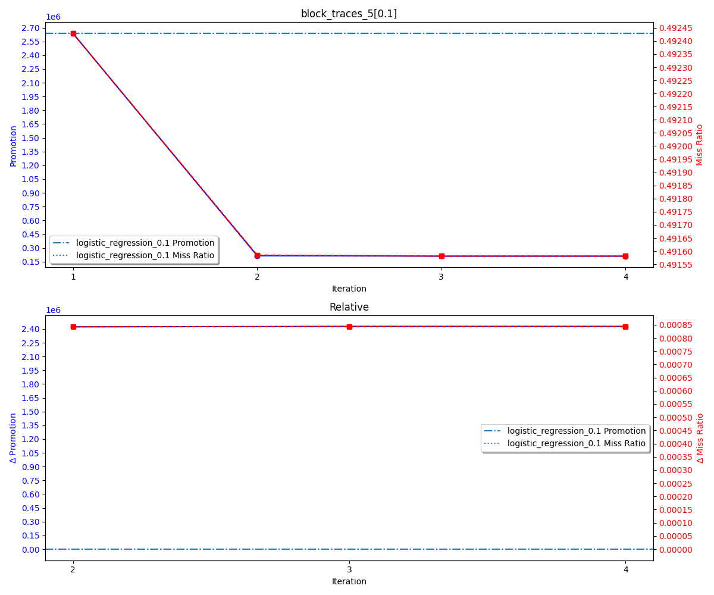  
> **Trace Path**: block_traces_5.oracleGeneral.bin.zst  
> **Log Path**: [../result/log/block_traces_5[0.1].csv](../result/log/block_traces_5[0.1].csv)  
> **Desc**: 0.1  
> **Cache Size**: 3134978  
> **Ignore Obj Size**: 0  
> **Total Request**: 14,556,172  
> **First Promotion**: 2,638,329  
> **Last Promotion**: 210,202  
> **Promotion Reduced**: 2,428,127  

>   
> **Trace Path**: block_traces_5.oracleGeneral.bin.zst  
> **Log Path**: [../result/log/block_traces_5[0.1,ML,model=logistic_regression_0.1].csv](../result/log/block_traces_5[0.1,ML,model=logistic_regression_0.1].csv)  
> **Desc**: 0.1,ML,model=logistic_regression_0.1  
> **Cache Size**: 3134978  
> **Ignore Obj Size**: 0  
> **Total Request**: 14,556,172  
> **First Promotion**: 2,638,329  
> **Last Promotion**: 2,638,329  
> **Promotion Reduced**: 0  

> 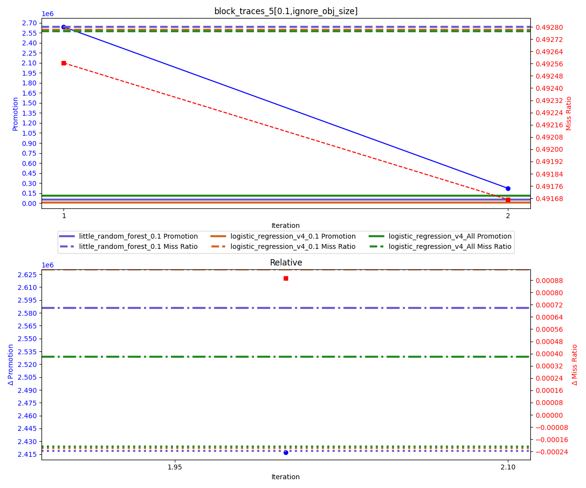  
> **Trace Path**: block_traces_5.oracleGeneral.bin.zst  
> **Log Path**: [../result/log/block_traces_5[0.1,ignore_obj_size].csv](../result/log/block_traces_5[0.1,ignore_obj_size].csv)  
> **Desc**: 0.1,ignore_obj_size  
> **Cache Size**: 711041  
> **Ignore Obj Size**: 1  
> **Total Request**: 14,556,172  
> **First Promotion**: 2,638,446  
> **Last Promotion**: 216,373  
> **Promotion Reduced**: 2,422,073  

>   
> **Trace Path**: block_traces_5.oracleGeneral.bin.zst  
> **Log Path**: [../result/log/block_traces_5[0.1,ignore_obj_size,ML,model=logistic_regression_0.1].csv](../result/log/block_traces_5[0.1,ignore_obj_size,ML,model=logistic_regression_0.1].csv)  
> **Desc**: 0.1,ignore_obj_size,ML,model=logistic_regression_0.1  
> **Cache Size**: 711041  
> **Ignore Obj Size**: 1  
> **Total Request**: 14,556,172  
> **First Promotion**: 116  
> **Last Promotion**: 116  
> **Promotion Reduced**: 0  

> 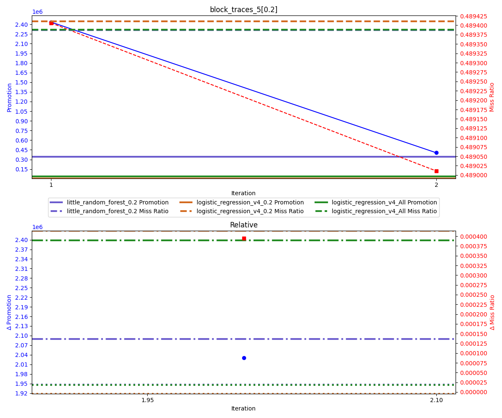  
> **Trace Path**: block_traces_5.oracleGeneral.bin.zst  
> **Log Path**: [../result/log/block_traces_5[0.2].csv](../result/log/block_traces_5[0.2].csv)  
> **Desc**: 0.2  
> **Cache Size**: 6269957  
> **Ignore Obj Size**: 0  
> **Total Request**: 14,556,172  
> **First Promotion**: 2,434,210  
> **Last Promotion**: 403,361  
> **Promotion Reduced**: 2,030,849  

>   
> **Trace Path**: block_traces_5.oracleGeneral.bin.zst  
> **Log Path**: [../result/log/block_traces_5[0.2,ML,model=logistic_regression_0.2].csv](../result/log/block_traces_5[0.2,ML,model=logistic_regression_0.2].csv)  
> **Desc**: 0.2,ML,model=logistic_regression_0.2  
> **Cache Size**: 6269957  
> **Ignore Obj Size**: 0  
> **Total Request**: 14,556,172  
> **First Promotion**: 2,434,210  
> **Last Promotion**: 2,434,210  
> **Promotion Reduced**: 0  

> 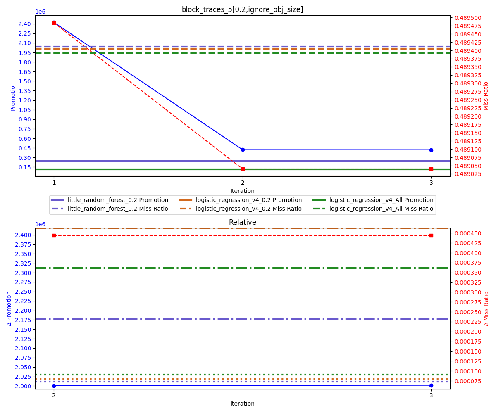  
> **Trace Path**: block_traces_5.oracleGeneral.bin.zst  
> **Log Path**: [../result/log/block_traces_5[0.2,ignore_obj_size].csv](../result/log/block_traces_5[0.2,ignore_obj_size].csv)  
> **Desc**: 0.2,ignore_obj_size  
> **Cache Size**: 1422082  
> **Ignore Obj Size**: 1  
> **Total Request**: 14,556,172  
> **First Promotion**: 2,423,091  
> **Last Promotion**: 421,262  
> **Promotion Reduced**: 2,001,829  

>   
> **Trace Path**: block_traces_5.oracleGeneral.bin.zst  
> **Log Path**: [../result/log/block_traces_5[0.2,ignore_obj_size,ML,model=logistic_regression_0.2].csv](../result/log/block_traces_5[0.2,ignore_obj_size,ML,model=logistic_regression_0.2].csv)  
> **Desc**: 0.2,ignore_obj_size,ML,model=logistic_regression_0.2  
> **Cache Size**: 1422082  
> **Ignore Obj Size**: 1  
> **Total Request**: 14,556,172  
> **First Promotion**: 514  
> **Last Promotion**: 514  
> **Promotion Reduced**: 0  

> 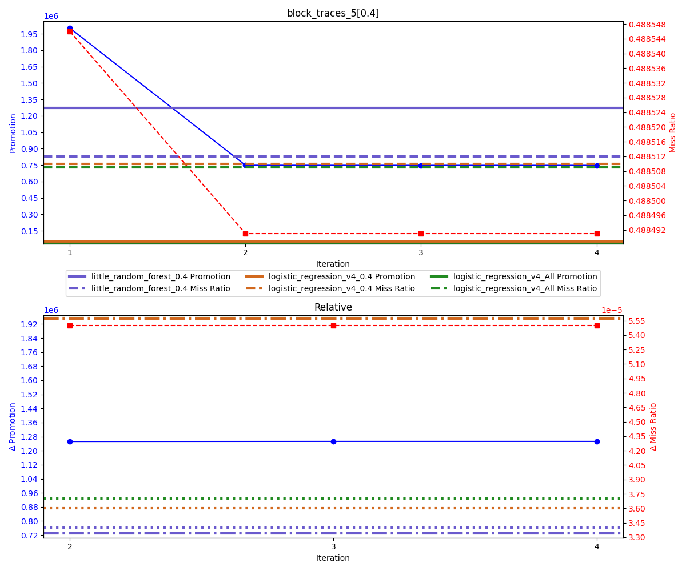  
> **Trace Path**: block_traces_5.oracleGeneral.bin.zst  
> **Log Path**: [../result/log/block_traces_5[0.4].csv](../result/log/block_traces_5[0.4].csv)  
> **Desc**: 0.4  
> **Cache Size**: 12539914  
> **Ignore Obj Size**: 0  
> **Total Request**: 14,556,172  
> **First Promotion**: 2,001,105  
> **Last Promotion**: 748,106  
> **Promotion Reduced**: 1,252,999  

>   
> **Trace Path**: block_traces_5.oracleGeneral.bin.zst  
> **Log Path**: [../result/log/block_traces_5[0.4,ML,model=logistic_regression_0.4].csv](../result/log/block_traces_5[0.4,ML,model=logistic_regression_0.4].csv)  
> **Desc**: 0.4,ML,model=logistic_regression_0.4  
> **Cache Size**: 12539914  
> **Ignore Obj Size**: 0  
> **Total Request**: 14,556,172  
> **First Promotion**: 2,001,105  
> **Last Promotion**: 2,001,105  
> **Promotion Reduced**: 0  

> 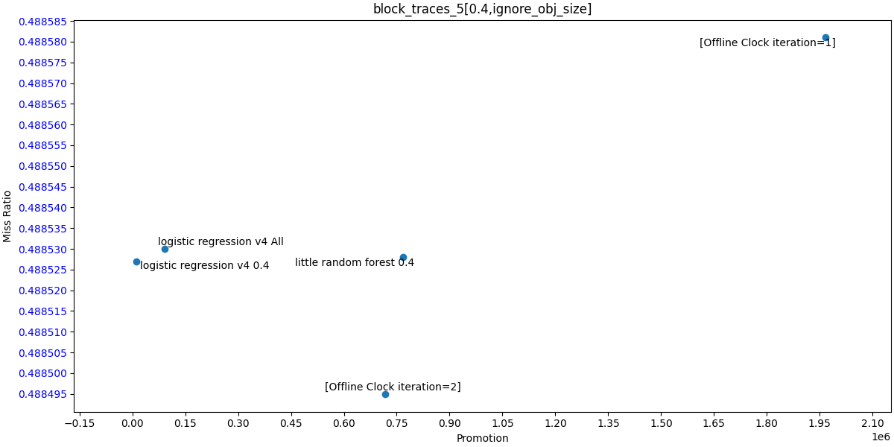  
> **Trace Path**: block_traces_5.oracleGeneral.bin.zst  
> **Log Path**: [../result/log/block_traces_5[0.4,ignore_obj_size].csv](../result/log/block_traces_5[0.4,ignore_obj_size].csv)  
> **Desc**: 0.4,ignore_obj_size  
> **Cache Size**: 2844165  
> **Ignore Obj Size**: 1  
> **Total Request**: 14,556,172  
> **First Promotion**: 1,965,400  
> **Last Promotion**: 715,566  
> **Promotion Reduced**: 1,249,834  

>   
> **Trace Path**: block_traces_5.oracleGeneral.bin.zst  
> **Log Path**: [../result/log/block_traces_5[0.4,ignore_obj_size,ML,model=logistic_regression_0.4].csv](../result/log/block_traces_5[0.4,ignore_obj_size,ML,model=logistic_regression_0.4].csv)  
> **Desc**: 0.4,ignore_obj_size,ML,model=logistic_regression_0.4  
> **Cache Size**: 2844165  
> **Ignore Obj Size**: 1  
> **Total Request**: 14,556,172  
> **First Promotion**: 667,917  
> **Last Promotion**: 667,917  
> **Promotion Reduced**: 0  

## cluster50 https://ftp.pdl.cmu.edu/pub/datasets/twemcacheWorkload/cacheDatasets/twitter/cluster50.oracleGeneral.zst
> 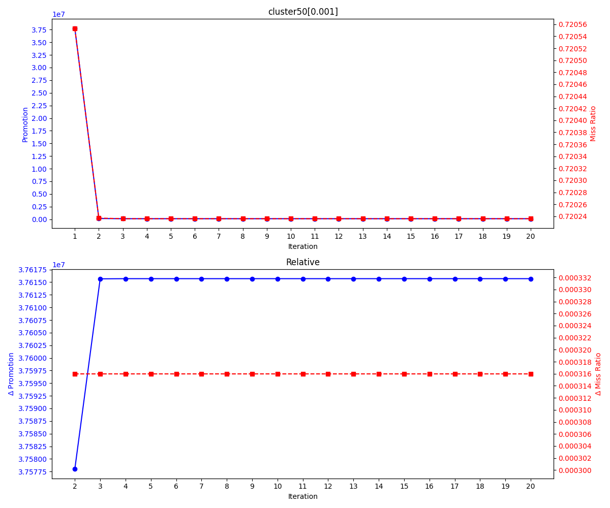  
> **Trace Path**: cluster50.oracleGeneral.zst  
> **Log Path**: [../result/log/cluster50[0.001].csv](../result/log/cluster50[0.001].csv)  
> **Desc**: 0.001  
> **Cache Size**: 41  
> **Ignore Obj Size**: 0  
> **Total Request**: 139,655,585  
> **First Promotion**: 37,725,637  
> **Last Promotion**: 109,940  
> **Promotion Reduced**: 37,615,697  

>   
> **Trace Path**: cluster50.oracleGeneral.zst  
> **Log Path**: [../result/log/cluster50[0.001,ML,model=logistic_regression_0.001].csv](../result/log/cluster50[0.001,ML,model=logistic_regression_0.001].csv)  
> **Desc**: 0.001,ML,model=logistic_regression_0.001  
> **Cache Size**: 41  
> **Ignore Obj Size**: 0  
> **Total Request**: 139,655,585  
> **First Promotion**: 0  
> **Last Promotion**: 0  
> **Promotion Reduced**: 0  

> 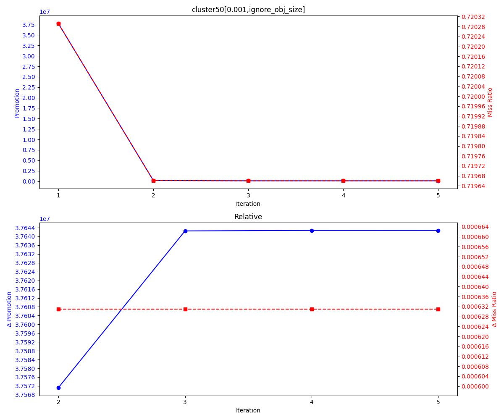  
> **Trace Path**: cluster50.oracleGeneral.zst  
> **Log Path**: [../result/log/cluster50[0.001,ignore_obj_size].csv](../result/log/cluster50[0.001,ignore_obj_size].csv)  
> **Desc**: 0.001,ignore_obj_size  
> **Cache Size**: 2660  
> **Ignore Obj Size**: 1  
> **Total Request**: 139,655,585  
> **First Promotion**: 37,749,952  
> **Last Promotion**: 107,191  
> **Promotion Reduced**: 37,642,761  

>   
> **Trace Path**: cluster50.oracleGeneral.zst  
> **Log Path**: [../result/log/cluster50[0.001,ignore_obj_size,ML,model=logistic_regression_0.001].csv](../result/log/cluster50[0.001,ignore_obj_size,ML,model=logistic_regression_0.001].csv)  
> **Desc**: 0.001,ignore_obj_size,ML,model=logistic_regression_0.001  
> **Cache Size**: 2660  
> **Ignore Obj Size**: 1  
> **Total Request**: 139,655,585  
> **First Promotion**: 0  
> **Last Promotion**: 0  
> **Promotion Reduced**: 0  

> 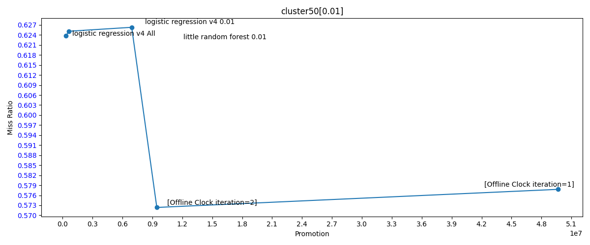  
> **Trace Path**: cluster50.oracleGeneral.zst  
> **Log Path**: [../result/log/cluster50[0.01].csv](../result/log/cluster50[0.01].csv)  
> **Desc**: 0.01  
> **Cache Size**: 413  
> **Ignore Obj Size**: 0  
> **Total Request**: 139,655,585  
> **First Promotion**: 49,659,077  
> **Last Promotion**: 8,628,004  
> **Promotion Reduced**: 41,031,073  

>   
> **Trace Path**: cluster50.oracleGeneral.zst  
> **Log Path**: [../result/log/cluster50[0.01,ML,model=logistic_regression_0.01].csv](../result/log/cluster50[0.01,ML,model=logistic_regression_0.01].csv)  
> **Desc**: 0.01,ML,model=logistic_regression_0.01  
> **Cache Size**: 413  
> **Ignore Obj Size**: 0  
> **Total Request**: 139,655,585  
> **First Promotion**: 0  
> **Last Promotion**: 0  
> **Promotion Reduced**: 0  

> 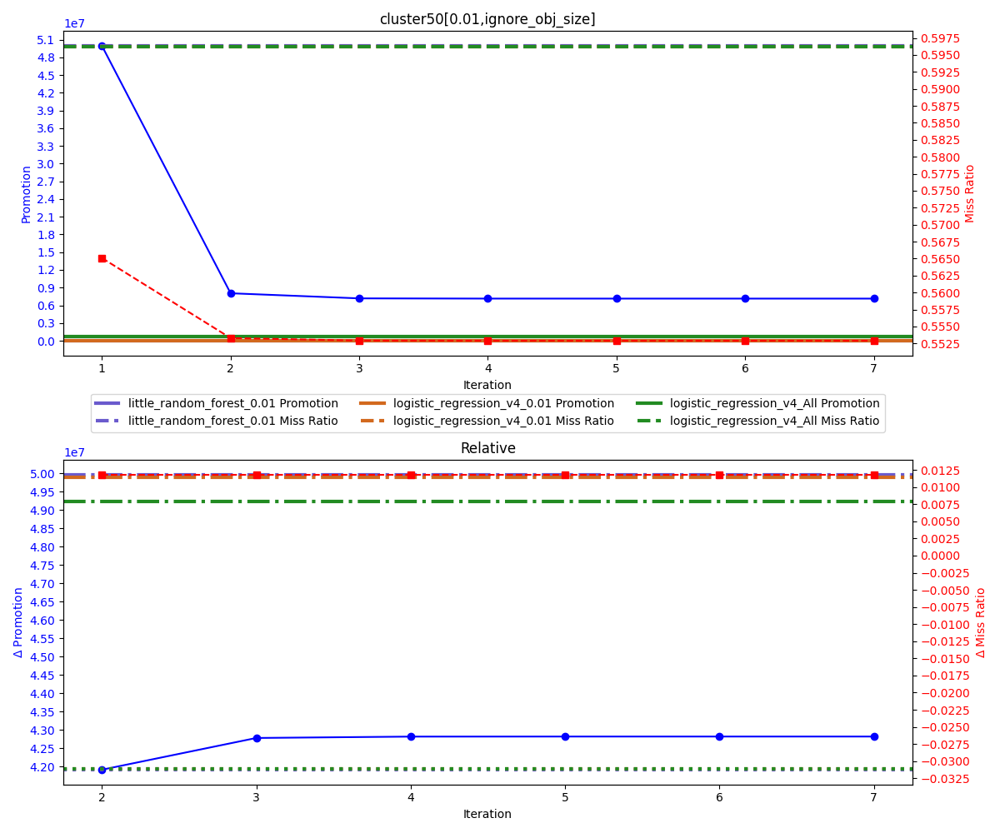  
> **Trace Path**: cluster50.oracleGeneral.zst  
> **Log Path**: [../result/log/cluster50[0.01,ignore_obj_size].csv](../result/log/cluster50[0.01,ignore_obj_size].csv)  
> **Desc**: 0.01,ignore_obj_size  
> **Cache Size**: 26609  
> **Ignore Obj Size**: 1  
> **Total Request**: 139,655,585  
> **First Promotion**: 49,958,216  
> **Last Promotion**: 7,134,989  
> **Promotion Reduced**: 42,823,227  

>   
> **Trace Path**: cluster50.oracleGeneral.zst  
> **Log Path**: [../result/log/cluster50[0.01,ignore_obj_size,ML,model=logistic_regression_0.01].csv](../result/log/cluster50[0.01,ignore_obj_size,ML,model=logistic_regression_0.01].csv)  
> **Desc**: 0.01,ignore_obj_size,ML,model=logistic_regression_0.01  
> **Cache Size**: 26609  
> **Ignore Obj Size**: 1  
> **Total Request**: 139,655,585  
> **First Promotion**: 0  
> **Last Promotion**: 0  
> **Promotion Reduced**: 0  

> 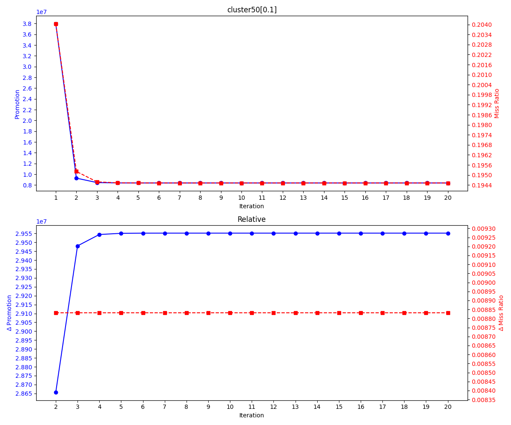  
> **Trace Path**: cluster50.oracleGeneral.zst  
> **Log Path**: [../result/log/cluster50[0.1].csv](../result/log/cluster50[0.1].csv)  
> **Desc**: 0.1  
> **Cache Size**: 4133  
> **Ignore Obj Size**: 0  
> **Total Request**: 139,655,585  
> **First Promotion**: 37,945,441  
> **Last Promotion**: 8,366,824  
> **Promotion Reduced**: 29,578,617  

>   
> **Trace Path**: cluster50.oracleGeneral.zst  
> **Log Path**: [../result/log/cluster50[0.1,ML,model=logistic_regression_0.1].csv](../result/log/cluster50[0.1,ML,model=logistic_regression_0.1].csv)  
> **Desc**: 0.1,ML,model=logistic_regression_0.1  
> **Cache Size**: 4133  
> **Ignore Obj Size**: 0  
> **Total Request**: 139,655,585  
> **First Promotion**: 0  
> **Last Promotion**: 0  
> **Promotion Reduced**: 0  

> 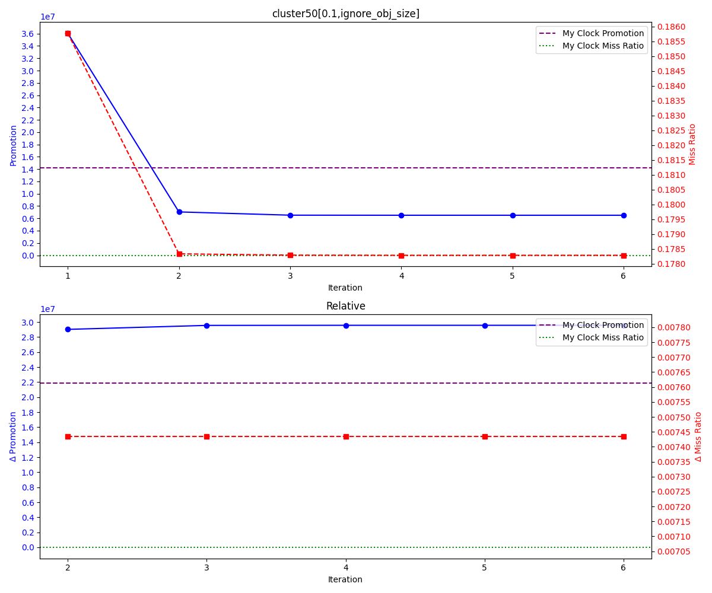  
> **Trace Path**: cluster50.oracleGeneral.zst  
> **Log Path**: [../result/log/cluster50[0.1,ignore_obj_size].csv](../result/log/cluster50[0.1,ignore_obj_size].csv)  
> **Desc**: 0.1,ignore_obj_size  
> **Cache Size**: 266098  
> **Ignore Obj Size**: 1  
> **Total Request**: 139,655,585  
> **First Promotion**: 36,062,844  
> **Last Promotion**: 6,466,275  
> **Promotion Reduced**: 29,596,569  

>   
> **Trace Path**: cluster50.oracleGeneral.zst  
> **Log Path**: [../result/log/cluster50[0.1,ignore_obj_size,ML,model=logistic_regression_0.1].csv](../result/log/cluster50[0.1,ignore_obj_size,ML,model=logistic_regression_0.1].csv)  
> **Desc**: 0.1,ignore_obj_size,ML,model=logistic_regression_0.1  
> **Cache Size**: 266098  
> **Ignore Obj Size**: 1  
> **Total Request**: 139,655,585  
> **First Promotion**: 9,435,805  
> **Last Promotion**: 9,435,805  
> **Promotion Reduced**: 0  

>   
> **Trace Path**: cluster50.oracleGeneral.zst  
> **Log Path**: [../result/log/cluster50[0.2].csv](../result/log/cluster50[0.2].csv)  
> **Desc**: 0.2  
> **Cache Size**: 8267  
> **Ignore Obj Size**: 0  
> **Total Request**: 139,655,585  
> **First Promotion**: 26,127,970  
> **Last Promotion**: 6,088,405  
> **Promotion Reduced**: 20,039,565  

>   
> **Trace Path**: cluster50.oracleGeneral.zst  
> **Log Path**: [../result/log/cluster50[0.2,ML,model=logistic_regression_0.2].csv](../result/log/cluster50[0.2,ML,model=logistic_regression_0.2].csv)  
> **Desc**: 0.2,ML,model=logistic_regression_0.2  
> **Cache Size**: 8267  
> **Ignore Obj Size**: 0  
> **Total Request**: 139,655,585  
> **First Promotion**: 19,623,092  
> **Last Promotion**: 19,623,092  
> **Promotion Reduced**: 0  

> 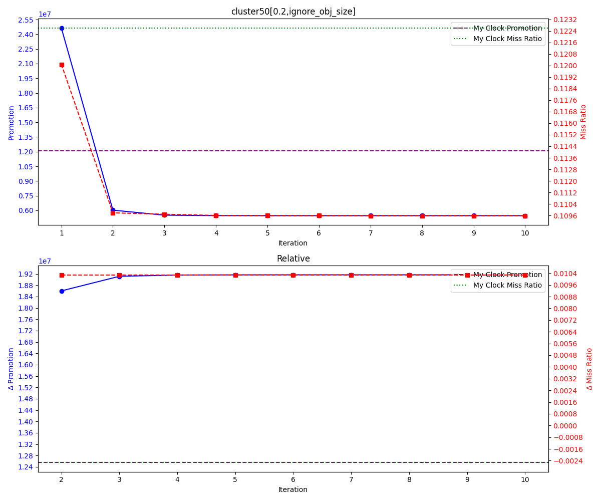  
> **Trace Path**: cluster50.oracleGeneral.zst  
> **Log Path**: [../result/log/cluster50[0.2,ignore_obj_size].csv](../result/log/cluster50[0.2,ignore_obj_size].csv)  
> **Desc**: 0.2,ignore_obj_size  
> **Cache Size**: 532197  
> **Ignore Obj Size**: 1  
> **Total Request**: 139,655,585  
> **First Promotion**: 24,628,231  
> **Last Promotion**: 5,379,945  
> **Promotion Reduced**: 19,248,286  

>   
> **Trace Path**: cluster50.oracleGeneral.zst  
> **Log Path**: [../result/log/cluster50[0.2,ignore_obj_size,ML,model=logistic_regression_0.2].csv](../result/log/cluster50[0.2,ignore_obj_size,ML,model=logistic_regression_0.2].csv)  
> **Desc**: 0.2,ignore_obj_size,ML,model=logistic_regression_0.2  
> **Cache Size**: 532197  
> **Ignore Obj Size**: 1  
> **Total Request**: 139,655,585  
> **First Promotion**: 22,723,623  
> **Last Promotion**: 22,723,623  
> **Promotion Reduced**: 0  

> 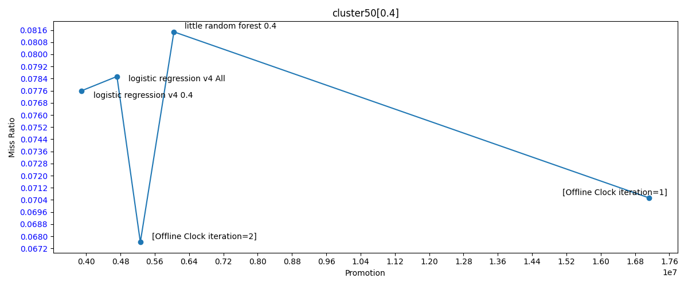  
> **Trace Path**: cluster50.oracleGeneral.zst  
> **Log Path**: [../result/log/cluster50[0.4].csv](../result/log/cluster50[0.4].csv)  
> **Desc**: 0.4  
> **Cache Size**: 16535  
> **Ignore Obj Size**: 0  
> **Total Request**: 139,655,585  
> **First Promotion**: 17,130,495  
> **Last Promotion**: 5,033,746  
> **Promotion Reduced**: 12,096,749  

>   
> **Trace Path**: cluster50.oracleGeneral.zst  
> **Log Path**: [../result/log/cluster50[0.4,ML,model=logistic_regression_0.4].csv](../result/log/cluster50[0.4,ML,model=logistic_regression_0.4].csv)  
> **Desc**: 0.4,ML,model=logistic_regression_0.4  
> **Cache Size**: 16535  
> **Ignore Obj Size**: 0  
> **Total Request**: 139,655,585  
> **First Promotion**: 16,320,445  
> **Last Promotion**: 16,320,445  
> **Promotion Reduced**: 0  

> 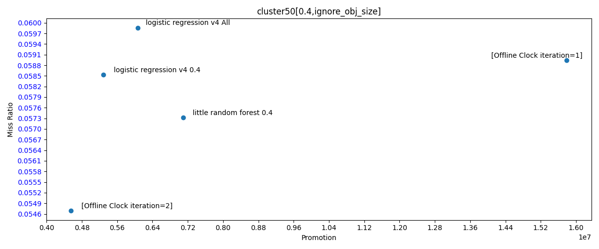  
> **Trace Path**: cluster50.oracleGeneral.zst  
> **Log Path**: [../result/log/cluster50[0.4,ignore_obj_size].csv](../result/log/cluster50[0.4,ignore_obj_size].csv)  
> **Desc**: 0.4,ignore_obj_size  
> **Cache Size**: 1064395  
> **Ignore Obj Size**: 1  
> **Total Request**: 139,655,585  
> **First Promotion**: 15,789,065  
> **Last Promotion**: 4,389,463  
> **Promotion Reduced**: 11,399,602  

>   
> **Trace Path**: cluster50.oracleGeneral.zst  
> **Log Path**: [../result/log/cluster50[0.4,ignore_obj_size,ML,model=logistic_regression_0.4].csv](../result/log/cluster50[0.4,ignore_obj_size,ML,model=logistic_regression_0.4].csv)  
> **Desc**: 0.4,ignore_obj_size,ML,model=logistic_regression_0.4  
> **Cache Size**: 1064395  
> **Ignore Obj Size**: 1  
> **Total Request**: 139,655,585  
> **First Promotion**: 15,789,065  
> **Last Promotion**: 15,789,065  
> **Promotion Reduced**: 0  

## fiu_cheetah.cs.fiu.edu-110108-113008 https://ftp.pdl.cmu.edu/pub/datasets/twemcacheWorkload/cacheDatasets/fiu/fiu_cheetah.cs.fiu.edu-110108-113008.oracleGeneral.zst
> 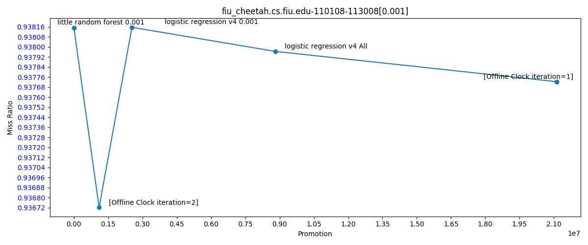  
> **Trace Path**: fiu_cheetah.cs.fiu.edu-110108-113008.oracleGeneral.zst  
> **Log Path**: [../result/log/fiu_cheetah.cs.fiu.edu-110108-113008[0.001].csv](../result/log/fiu_cheetah.cs.fiu.edu-110108-113008[0.001].csv)  
> **Desc**: 0.001  
> **Cache Size**: 58  
> **Ignore Obj Size**: 0  
> **Total Request**: 442,393,092  
> **First Promotion**: 21,117,805  
> **Last Promotion**: 716,982  
> **Promotion Reduced**: 20,400,823  

>   
> **Trace Path**: fiu_cheetah.cs.fiu.edu-110108-113008.oracleGeneral.zst  
> **Log Path**: [../result/log/fiu_cheetah.cs.fiu.edu-110108-113008[0.001,ML,model=logistic_regression_0.001].csv](../result/log/fiu_cheetah.cs.fiu.edu-110108-113008[0.001,ML,model=logistic_regression_0.001].csv)  
> **Desc**: 0.001,ML,model=logistic_regression_0.001  
> **Cache Size**: 58  
> **Ignore Obj Size**: 0  
> **Total Request**: 442,393,092  
> **First Promotion**: 0  
> **Last Promotion**: 0  
> **Promotion Reduced**: 0  

> 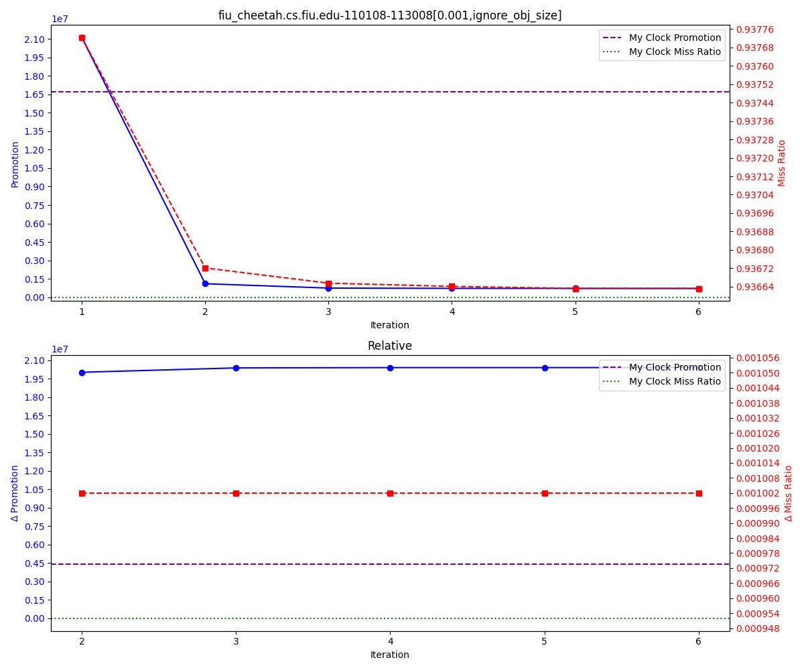  
> **Trace Path**: fiu_cheetah.cs.fiu.edu-110108-113008.oracleGeneral.zst  
> **Log Path**: [../result/log/fiu_cheetah.cs.fiu.edu-110108-113008[0.001,ignore_obj_size].csv](../result/log/fiu_cheetah.cs.fiu.edu-110108-113008[0.001,ignore_obj_size].csv)  
> **Desc**: 0.001,ignore_obj_size  
> **Cache Size**: 14909  
> **Ignore Obj Size**: 1  
> **Total Request**: 442,393,092  
> **First Promotion**: 21,117,805  
> **Last Promotion**: 716,982  
> **Promotion Reduced**: 20,400,823  

>   
> **Trace Path**: fiu_cheetah.cs.fiu.edu-110108-113008.oracleGeneral.zst  
> **Log Path**: [../result/log/fiu_cheetah.cs.fiu.edu-110108-113008[0.001,ignore_obj_size,ML,model=logistic_regression_0.001].csv](../result/log/fiu_cheetah.cs.fiu.edu-110108-113008[0.001,ignore_obj_size,ML,model=logistic_regression_0.001].csv)  
> **Desc**: 0.001,ignore_obj_size,ML,model=logistic_regression_0.001  
> **Cache Size**: 14909  
> **Ignore Obj Size**: 1  
> **Total Request**: 442,393,092  
> **First Promotion**: 0  
> **Last Promotion**: 0  
> **Promotion Reduced**: 0  

> 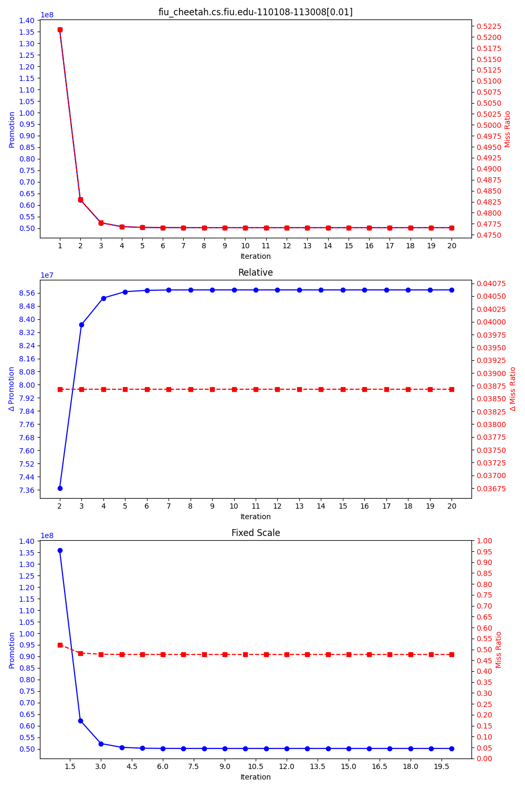  
> **Trace Path**: fiu_cheetah.cs.fiu.edu-110108-113008.oracleGeneral.zst  
> **Log Path**: [../result/log/fiu_cheetah.cs.fiu.edu-110108-113008[0.01].csv](../result/log/fiu_cheetah.cs.fiu.edu-110108-113008[0.01].csv)  
> **Desc**: 0.01  
> **Cache Size**: 582  
> **Ignore Obj Size**: 0  
> **Total Request**: 442,393,092  
> **First Promotion**: 135,940,681  
> **Last Promotion**: 50,162,445  
> **Promotion Reduced**: 85,778,236  

>   
> **Trace Path**: fiu_cheetah.cs.fiu.edu-110108-113008.oracleGeneral.zst  
> **Log Path**: [../result/log/fiu_cheetah.cs.fiu.edu-110108-113008[0.01,ML,model=logistic_regression_0.01].csv](../result/log/fiu_cheetah.cs.fiu.edu-110108-113008[0.01,ML,model=logistic_regression_0.01].csv)  
> **Desc**: 0.01,ML,model=logistic_regression_0.01  
> **Cache Size**: 582  
> **Ignore Obj Size**: 0  
> **Total Request**: 442,393,092  
> **First Promotion**: 0  
> **Last Promotion**: 0  
> **Promotion Reduced**: 0  

> 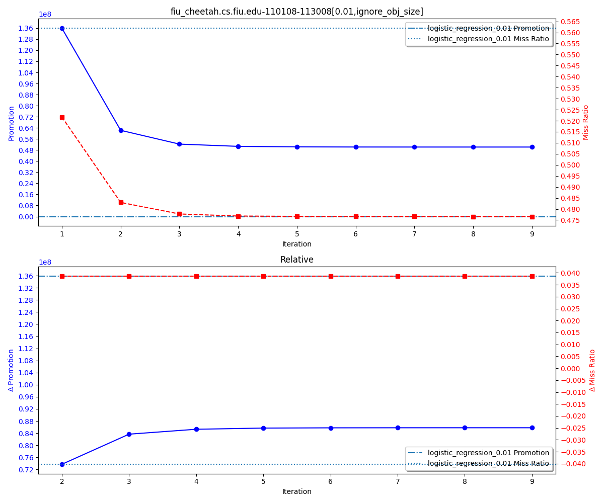  
> **Trace Path**: fiu_cheetah.cs.fiu.edu-110108-113008.oracleGeneral.zst  
> **Log Path**: [../result/log/fiu_cheetah.cs.fiu.edu-110108-113008[0.01,ignore_obj_size].csv](../result/log/fiu_cheetah.cs.fiu.edu-110108-113008[0.01,ignore_obj_size].csv)  
> **Desc**: 0.01,ignore_obj_size  
> **Cache Size**: 149091  
> **Ignore Obj Size**: 1  
> **Total Request**: 442,393,092  
> **First Promotion**: 135,940,681  
> **Last Promotion**: 50,162,445  
> **Promotion Reduced**: 85,778,236  

>   
> **Trace Path**: fiu_cheetah.cs.fiu.edu-110108-113008.oracleGeneral.zst  
> **Log Path**: [../result/log/fiu_cheetah.cs.fiu.edu-110108-113008[0.01,ignore_obj_size,ML,model=logistic_regression_0.01].csv](../result/log/fiu_cheetah.cs.fiu.edu-110108-113008[0.01,ignore_obj_size,ML,model=logistic_regression_0.01].csv)  
> **Desc**: 0.01,ignore_obj_size,ML,model=logistic_regression_0.01  
> **Cache Size**: 149091  
> **Ignore Obj Size**: 1  
> **Total Request**: 442,393,092  
> **First Promotion**: 0  
> **Last Promotion**: 0  
> **Promotion Reduced**: 0  

> 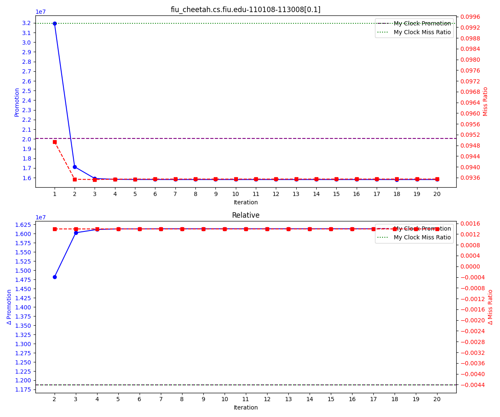  
> **Trace Path**: fiu_cheetah.cs.fiu.edu-110108-113008.oracleGeneral.zst  
> **Log Path**: [../result/log/fiu_cheetah.cs.fiu.edu-110108-113008[0.1].csv](../result/log/fiu_cheetah.cs.fiu.edu-110108-113008[0.1].csv)  
> **Desc**: 0.1  
> **Cache Size**: 5823  
> **Ignore Obj Size**: 0  
> **Total Request**: 442,393,092  
> **First Promotion**: 31,946,046  
> **Last Promotion**: 15,772,247  
> **Promotion Reduced**: 16,173,799  

>   
> **Trace Path**: fiu_cheetah.cs.fiu.edu-110108-113008.oracleGeneral.zst  
> **Log Path**: [../result/log/fiu_cheetah.cs.fiu.edu-110108-113008[0.1,ML,model=logistic_regression_0.1].csv](../result/log/fiu_cheetah.cs.fiu.edu-110108-113008[0.1,ML,model=logistic_regression_0.1].csv)  
> **Desc**: 0.1,ML,model=logistic_regression_0.1  
> **Cache Size**: 5823  
> **Ignore Obj Size**: 0  
> **Total Request**: 442,393,092  
> **First Promotion**: 0  
> **Last Promotion**: 0  
> **Promotion Reduced**: 0  

> 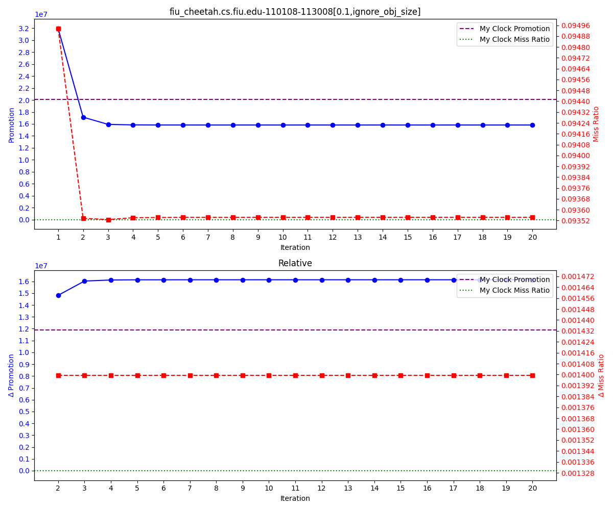  
> **Trace Path**: fiu_cheetah.cs.fiu.edu-110108-113008.oracleGeneral.zst  
> **Log Path**: [../result/log/fiu_cheetah.cs.fiu.edu-110108-113008[0.1,ignore_obj_size].csv](../result/log/fiu_cheetah.cs.fiu.edu-110108-113008[0.1,ignore_obj_size].csv)  
> **Desc**: 0.1,ignore_obj_size  
> **Cache Size**: 1490918  
> **Ignore Obj Size**: 1  
> **Total Request**: 442,393,092  
> **First Promotion**: 31,946,046  
> **Last Promotion**: 15,772,247  
> **Promotion Reduced**: 16,173,799  

>   
> **Trace Path**: fiu_cheetah.cs.fiu.edu-110108-113008.oracleGeneral.zst  
> **Log Path**: [../result/log/fiu_cheetah.cs.fiu.edu-110108-113008[0.1,ignore_obj_size,ML,model=logistic_regression_0.1].csv](../result/log/fiu_cheetah.cs.fiu.edu-110108-113008[0.1,ignore_obj_size,ML,model=logistic_regression_0.1].csv)  
> **Desc**: 0.1,ignore_obj_size,ML,model=logistic_regression_0.1  
> **Cache Size**: 1490918  
> **Ignore Obj Size**: 1  
> **Total Request**: 442,393,092  
> **First Promotion**: 5,083,339  
> **Last Promotion**: 5,083,339  
> **Promotion Reduced**: 0  

> 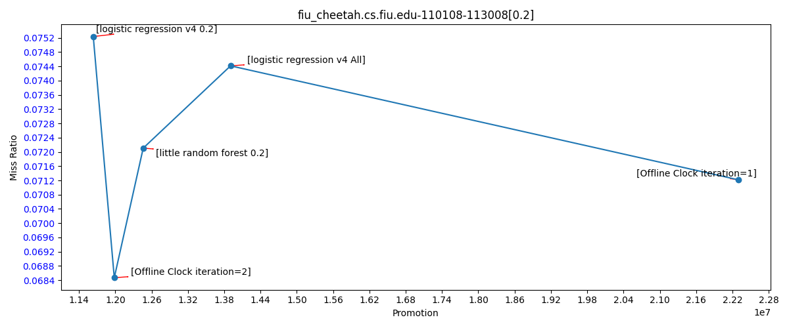  
> **Trace Path**: fiu_cheetah.cs.fiu.edu-110108-113008.oracleGeneral.zst  
> **Log Path**: [../result/log/fiu_cheetah.cs.fiu.edu-110108-113008[0.2].csv](../result/log/fiu_cheetah.cs.fiu.edu-110108-113008[0.2].csv)  
> **Desc**: 0.2  
> **Cache Size**: 11647  
> **Ignore Obj Size**: 0  
> **Total Request**: 442,393,092  
> **First Promotion**: 22,299,069  
> **Last Promotion**: 10,769,008  
> **Promotion Reduced**: 11,530,061  

>   
> **Trace Path**: fiu_cheetah.cs.fiu.edu-110108-113008.oracleGeneral.zst  
> **Log Path**: [../result/log/fiu_cheetah.cs.fiu.edu-110108-113008[0.2,ML,model=logistic_regression_0.2].csv](../result/log/fiu_cheetah.cs.fiu.edu-110108-113008[0.2,ML,model=logistic_regression_0.2].csv)  
> **Desc**: 0.2,ML,model=logistic_regression_0.2  
> **Cache Size**: 11647  
> **Ignore Obj Size**: 0  
> **Total Request**: 442,393,092  
> **First Promotion**: 20,089,599  
> **Last Promotion**: 20,089,599  
> **Promotion Reduced**: 0  

> 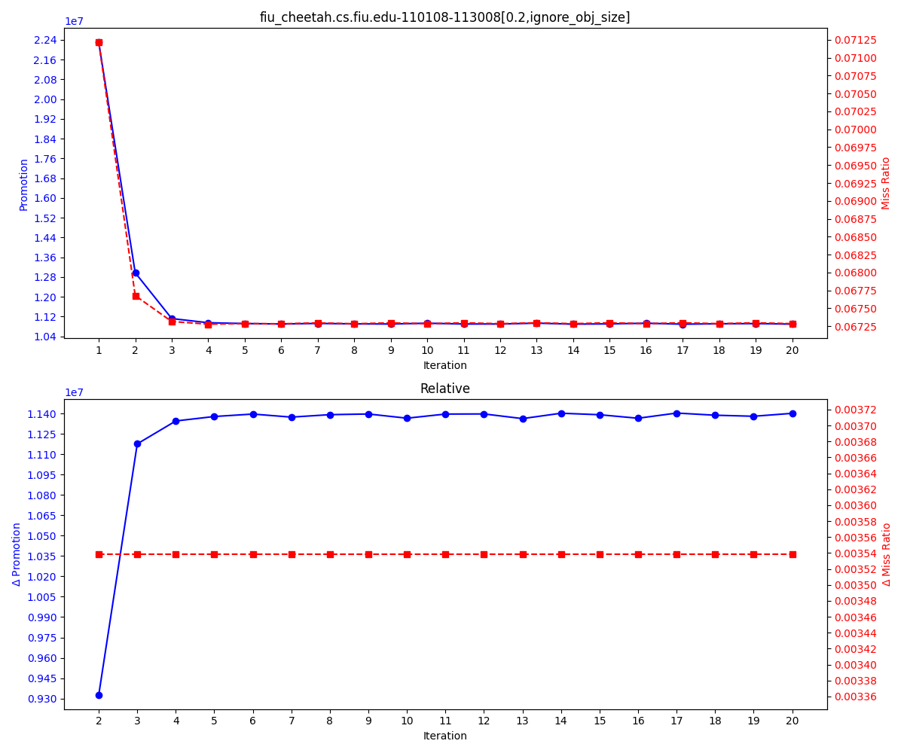  
> **Trace Path**: fiu_cheetah.cs.fiu.edu-110108-113008.oracleGeneral.zst  
> **Log Path**: [../result/log/fiu_cheetah.cs.fiu.edu-110108-113008[0.2,ignore_obj_size].csv](../result/log/fiu_cheetah.cs.fiu.edu-110108-113008[0.2,ignore_obj_size].csv)  
> **Desc**: 0.2,ignore_obj_size  
> **Cache Size**: 2981836  
> **Ignore Obj Size**: 1  
> **Total Request**: 442,393,092  
> **First Promotion**: 22,299,069  
> **Last Promotion**: 10,769,008  
> **Promotion Reduced**: 11,530,061  

>   
> **Trace Path**: fiu_cheetah.cs.fiu.edu-110108-113008.oracleGeneral.zst  
> **Log Path**: [../result/log/fiu_cheetah.cs.fiu.edu-110108-113008[0.2,ignore_obj_size,ML,model=logistic_regression_0.2].csv](../result/log/fiu_cheetah.cs.fiu.edu-110108-113008[0.2,ignore_obj_size,ML,model=logistic_regression_0.2].csv)  
> **Desc**: 0.2,ignore_obj_size,ML,model=logistic_regression_0.2  
> **Cache Size**: 2981836  
> **Ignore Obj Size**: 1  
> **Total Request**: 442,393,092  
> **First Promotion**: 16,937,957  
> **Last Promotion**: 16,937,957  
> **Promotion Reduced**: 0  

> 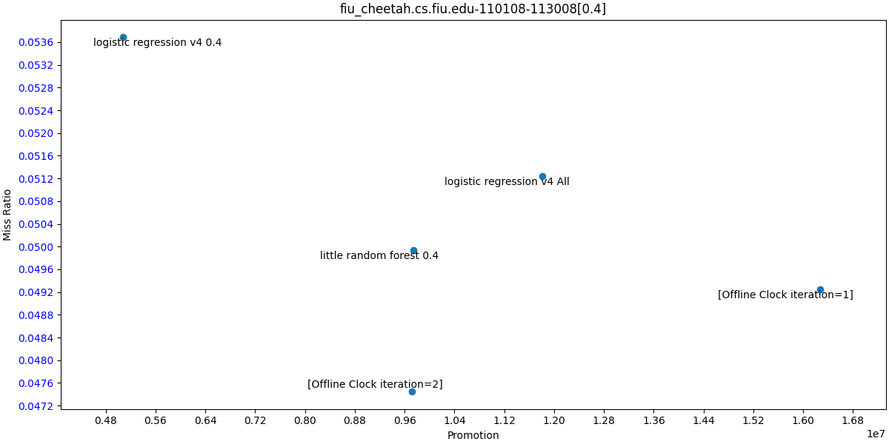  
> **Trace Path**: fiu_cheetah.cs.fiu.edu-110108-113008.oracleGeneral.zst  
> **Log Path**: [../result/log/fiu_cheetah.cs.fiu.edu-110108-113008[0.4].csv](../result/log/fiu_cheetah.cs.fiu.edu-110108-113008[0.4].csv)  
> **Desc**: 0.4  
> **Cache Size**: 23295  
> **Ignore Obj Size**: 0  
> **Total Request**: 442,393,092  
> **First Promotion**: 16,276,237  
> **Last Promotion**: 8,802,190  
> **Promotion Reduced**: 7,474,047  

>   
> **Trace Path**: fiu_cheetah.cs.fiu.edu-110108-113008.oracleGeneral.zst  
> **Log Path**: [../result/log/fiu_cheetah.cs.fiu.edu-110108-113008[0.4,ML,model=logistic_regression_0.4].csv](../result/log/fiu_cheetah.cs.fiu.edu-110108-113008[0.4,ML,model=logistic_regression_0.4].csv)  
> **Desc**: 0.4,ML,model=logistic_regression_0.4  
> **Cache Size**: 23295  
> **Ignore Obj Size**: 0  
> **Total Request**: 442,393,092  
> **First Promotion**: 16,173,121  
> **Last Promotion**: 16,173,121  
> **Promotion Reduced**: 0  

> 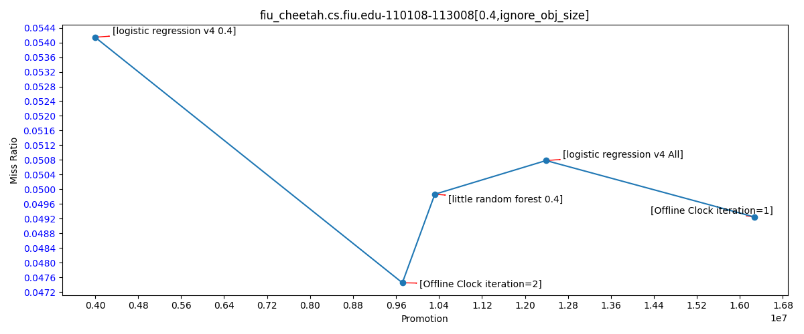  
> **Trace Path**: fiu_cheetah.cs.fiu.edu-110108-113008.oracleGeneral.zst  
> **Log Path**: [../result/log/fiu_cheetah.cs.fiu.edu-110108-113008[0.4,ignore_obj_size].csv](../result/log/fiu_cheetah.cs.fiu.edu-110108-113008[0.4,ignore_obj_size].csv)  
> **Desc**: 0.4,ignore_obj_size  
> **Cache Size**: 5963672  
> **Ignore Obj Size**: 1  
> **Total Request**: 442,393,092  
> **First Promotion**: 16,276,237  
> **Last Promotion**: 8,802,190  
> **Promotion Reduced**: 7,474,047  

>   
> **Trace Path**: fiu_cheetah.cs.fiu.edu-110108-113008.oracleGeneral.zst  
> **Log Path**: [../result/log/fiu_cheetah.cs.fiu.edu-110108-113008[0.4,ignore_obj_size,ML,model=logistic_regression_0.4].csv](../result/log/fiu_cheetah.cs.fiu.edu-110108-113008[0.4,ignore_obj_size,ML,model=logistic_regression_0.4].csv)  
> **Desc**: 0.4,ignore_obj_size,ML,model=logistic_regression_0.4  
> **Cache Size**: 5963672  
> **Ignore Obj Size**: 1  
> **Total Request**: 442,393,092  
> **First Promotion**: 14,434,883  
> **Last Promotion**: 14,434,883  
> **Promotion Reduced**: 0  

## meta_kvcache_traces_1 https://ftp.pdl.cmu.edu/pub/datasets/twemcacheWorkload/cacheDatasets/metaKV/meta_kvcache_traces_1.oracleGeneral.bin.zst
> 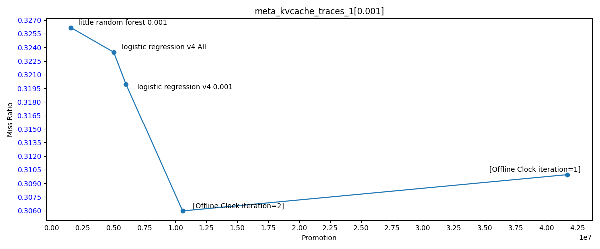  
> **Trace Path**: meta_kvcache_traces_1.oracleGeneral.bin.zst  
> **Log Path**: [../result/log/meta_kvcache_traces_1[0.001].csv](../result/log/meta_kvcache_traces_1[0.001].csv)  
> **Desc**: 0.001  
> **Cache Size**: 15  
> **Ignore Obj Size**: 0  
> **Total Request**: 335,173,084  
> **First Promotion**: 41,676,470  
> **Last Promotion**: 9,186,057  
> **Promotion Reduced**: 32,490,413  

>   
> **Trace Path**: meta_kvcache_traces_1.oracleGeneral.bin.zst  
> **Log Path**: [../result/log/meta_kvcache_traces_1[0.001,ML,model=logistic_regression_0.001].csv](../result/log/meta_kvcache_traces_1[0.001,ML,model=logistic_regression_0.001].csv)  
> **Desc**: 0.001,ML,model=logistic_regression_0.001  
> **Cache Size**: 15  
> **Ignore Obj Size**: 0  
> **Total Request**: 335,173,084  
> **First Promotion**: 0  
> **Last Promotion**: 0  
> **Promotion Reduced**: 0  

> 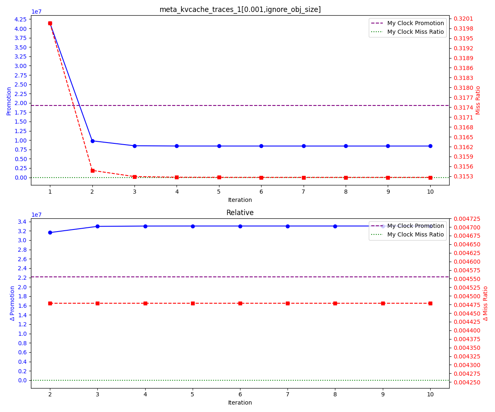  
> **Trace Path**: meta_kvcache_traces_1.oracleGeneral.bin.zst  
> **Log Path**: [../result/log/meta_kvcache_traces_1[0.001,ignore_obj_size].csv](../result/log/meta_kvcache_traces_1[0.001,ignore_obj_size].csv)  
> **Desc**: 0.001,ignore_obj_size  
> **Cache Size**: 17112  
> **Ignore Obj Size**: 1  
> **Total Request**: 335,173,084  
> **First Promotion**: 41,440,439  
> **Last Promotion**: 8,414,837  
> **Promotion Reduced**: 33,025,602  

>   
> **Trace Path**: meta_kvcache_traces_1.oracleGeneral.bin.zst  
> **Log Path**: [../result/log/meta_kvcache_traces_1[0.001,ignore_obj_size,ML,model=logistic_regression_0.001].csv](../result/log/meta_kvcache_traces_1[0.001,ignore_obj_size,ML,model=logistic_regression_0.001].csv)  
> **Desc**: 0.001,ignore_obj_size,ML,model=logistic_regression_0.001  
> **Cache Size**: 17112  
> **Ignore Obj Size**: 1  
> **Total Request**: 335,173,084  
> **First Promotion**: 0  
> **Last Promotion**: 0  
> **Promotion Reduced**: 0  

> 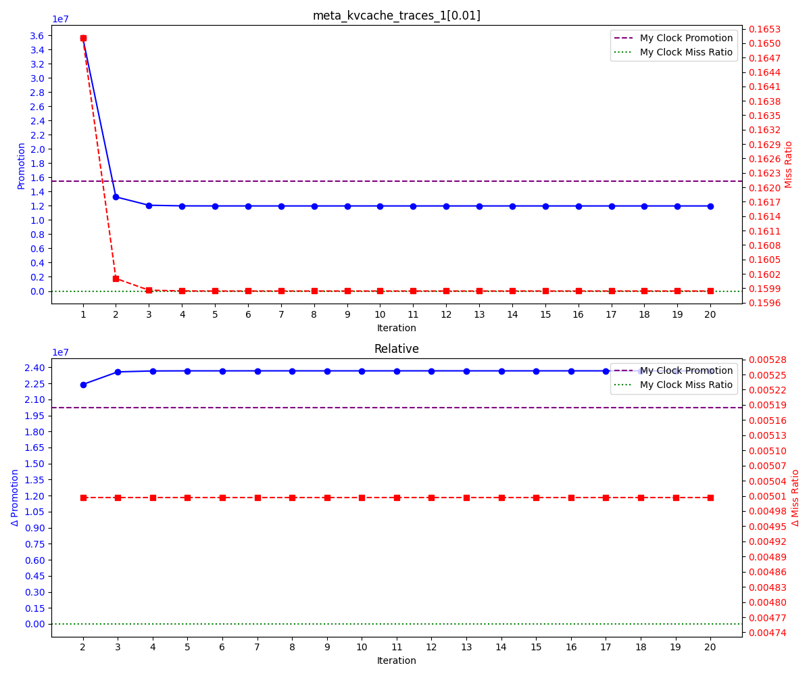  
> **Trace Path**: meta_kvcache_traces_1.oracleGeneral.bin.zst  
> **Log Path**: [../result/log/meta_kvcache_traces_1[0.01].csv](../result/log/meta_kvcache_traces_1[0.01].csv)  
> **Desc**: 0.01  
> **Cache Size**: 153  
> **Ignore Obj Size**: 0  
> **Total Request**: 335,173,084  
> **First Promotion**: 35,654,201  
> **Last Promotion**: 11,969,154  
> **Promotion Reduced**: 23,685,047  

>   
> **Trace Path**: meta_kvcache_traces_1.oracleGeneral.bin.zst  
> **Log Path**: [../result/log/meta_kvcache_traces_1[0.01,ML,model=logistic_regression_0.01].csv](../result/log/meta_kvcache_traces_1[0.01,ML,model=logistic_regression_0.01].csv)  
> **Desc**: 0.01,ML,model=logistic_regression_0.01  
> **Cache Size**: 153  
> **Ignore Obj Size**: 0  
> **Total Request**: 335,173,084  
> **First Promotion**: 0  
> **Last Promotion**: 0  
> **Promotion Reduced**: 0  

> 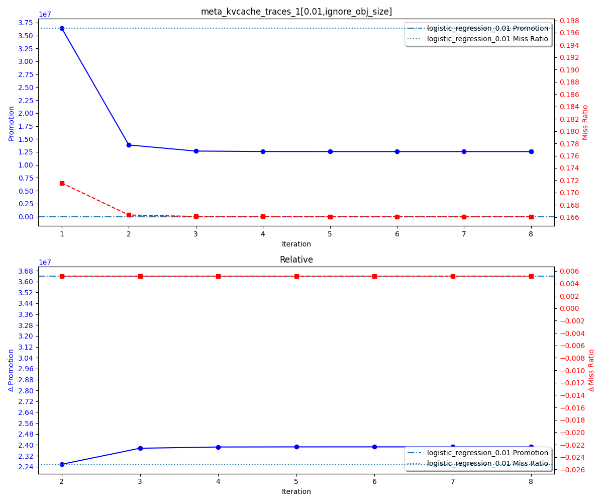  
> **Trace Path**: meta_kvcache_traces_1.oracleGeneral.bin.zst  
> **Log Path**: [../result/log/meta_kvcache_traces_1[0.01,ignore_obj_size].csv](../result/log/meta_kvcache_traces_1[0.01,ignore_obj_size].csv)  
> **Desc**: 0.01,ignore_obj_size  
> **Cache Size**: 171120  
> **Ignore Obj Size**: 1  
> **Total Request**: 335,173,084  
> **First Promotion**: 36,412,128  
> **Last Promotion**: 12,560,901  
> **Promotion Reduced**: 23,851,227  

>   
> **Trace Path**: meta_kvcache_traces_1.oracleGeneral.bin.zst  
> **Log Path**: [../result/log/meta_kvcache_traces_1[0.01,ignore_obj_size,ML,model=logistic_regression_0.01].csv](../result/log/meta_kvcache_traces_1[0.01,ignore_obj_size,ML,model=logistic_regression_0.01].csv)  
> **Desc**: 0.01,ignore_obj_size,ML,model=logistic_regression_0.01  
> **Cache Size**: 171120  
> **Ignore Obj Size**: 1  
> **Total Request**: 335,173,084  
> **First Promotion**: 0  
> **Last Promotion**: 0  
> **Promotion Reduced**: 0  

> 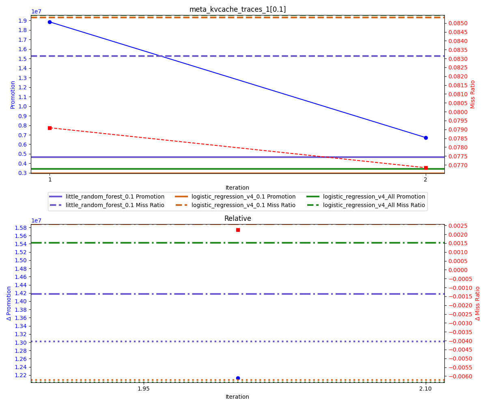  
> **Trace Path**: meta_kvcache_traces_1.oracleGeneral.bin.zst  
> **Log Path**: [../result/log/meta_kvcache_traces_1[0.1].csv](../result/log/meta_kvcache_traces_1[0.1].csv)  
> **Desc**: 0.1  
> **Cache Size**: 1538  
> **Ignore Obj Size**: 0  
> **Total Request**: 335,173,084  
> **First Promotion**: 18,842,395  
> **Last Promotion**: 6,286,693  
> **Promotion Reduced**: 12,555,702  

>   
> **Trace Path**: meta_kvcache_traces_1.oracleGeneral.bin.zst  
> **Log Path**: [../result/log/meta_kvcache_traces_1[0.1,ML,model=logistic_regression_0.1].csv](../result/log/meta_kvcache_traces_1[0.1,ML,model=logistic_regression_0.1].csv)  
> **Desc**: 0.1,ML,model=logistic_regression_0.1  
> **Cache Size**: 1538  
> **Ignore Obj Size**: 0  
> **Total Request**: 335,173,084  
> **First Promotion**: 0  
> **Last Promotion**: 0  
> **Promotion Reduced**: 0  

> 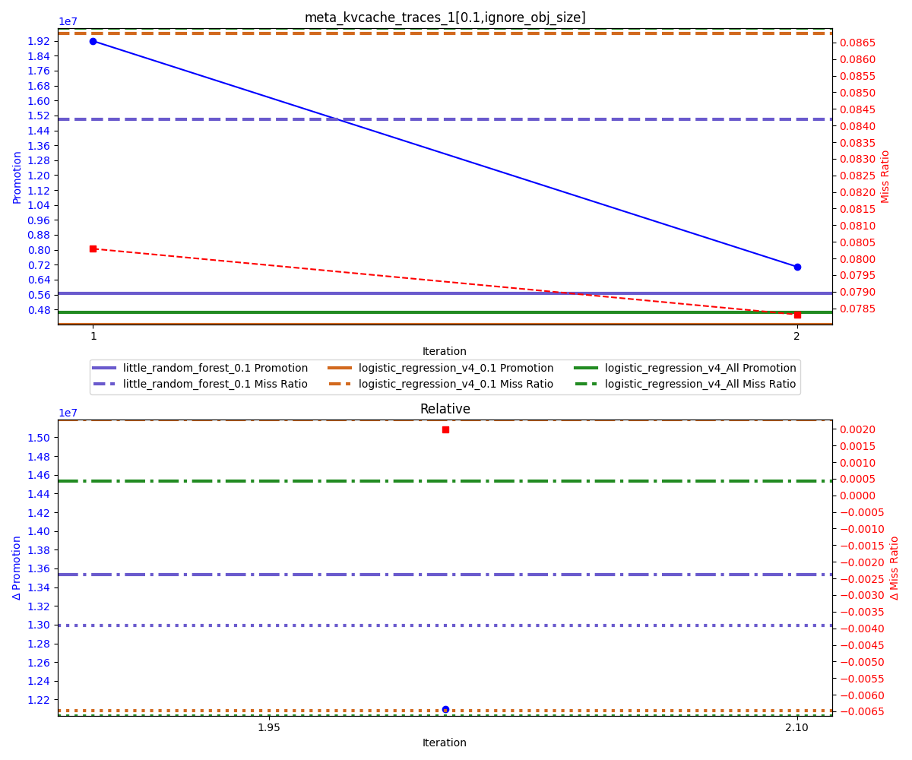  
> **Trace Path**: meta_kvcache_traces_1.oracleGeneral.bin.zst  
> **Log Path**: [../result/log/meta_kvcache_traces_1[0.1,ignore_obj_size].csv](../result/log/meta_kvcache_traces_1[0.1,ignore_obj_size].csv)  
> **Desc**: 0.1,ignore_obj_size  
> **Cache Size**: 1711209  
> **Ignore Obj Size**: 1  
> **Total Request**: 335,173,084  
> **First Promotion**: 19,190,480  
> **Last Promotion**: 6,615,101  
> **Promotion Reduced**: 12,575,379  

>   
> **Trace Path**: meta_kvcache_traces_1.oracleGeneral.bin.zst  
> **Log Path**: [../result/log/meta_kvcache_traces_1[0.1,ignore_obj_size,ML,model=logistic_regression_0.1].csv](../result/log/meta_kvcache_traces_1[0.1,ignore_obj_size,ML,model=logistic_regression_0.1].csv)  
> **Desc**: 0.1,ignore_obj_size,ML,model=logistic_regression_0.1  
> **Cache Size**: 1711209  
> **Ignore Obj Size**: 1  
> **Total Request**: 335,173,084  
> **First Promotion**: 551,202  
> **Last Promotion**: 551,202  
> **Promotion Reduced**: 0  

> 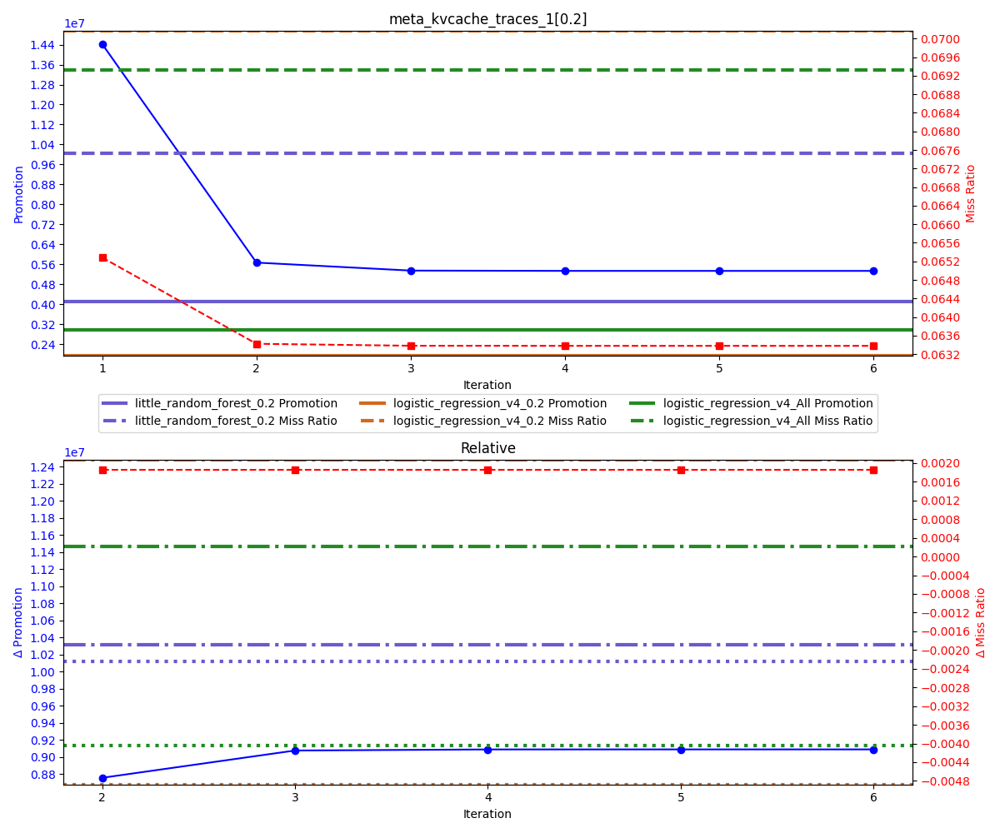  
> **Trace Path**: meta_kvcache_traces_1.oracleGeneral.bin.zst  
> **Log Path**: [../result/log/meta_kvcache_traces_1[0.2].csv](../result/log/meta_kvcache_traces_1[0.2].csv)  
> **Desc**: 0.2  
> **Cache Size**: 3077  
> **Ignore Obj Size**: 0  
> **Total Request**: 335,173,084  
> **First Promotion**: 14,425,819  
> **Last Promotion**: 5,335,279  
> **Promotion Reduced**: 9,090,540  

>   
> **Trace Path**: meta_kvcache_traces_1.oracleGeneral.bin.zst  
> **Log Path**: [../result/log/meta_kvcache_traces_1[0.2,ML,model=logistic_regression_0.2].csv](../result/log/meta_kvcache_traces_1[0.2,ML,model=logistic_regression_0.2].csv)  
> **Desc**: 0.2,ML,model=logistic_regression_0.2  
> **Cache Size**: 3077  
> **Ignore Obj Size**: 0  
> **Total Request**: 335,173,084  
> **First Promotion**: 3,591,747  
> **Last Promotion**: 3,591,747  
> **Promotion Reduced**: 0  

> 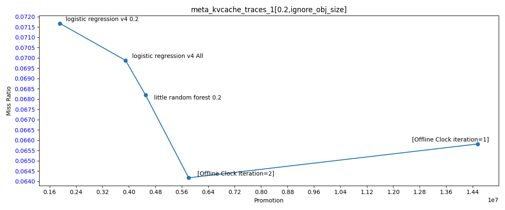  
> **Trace Path**: meta_kvcache_traces_1.oracleGeneral.bin.zst  
> **Log Path**: [../result/log/meta_kvcache_traces_1[0.2,ignore_obj_size].csv](../result/log/meta_kvcache_traces_1[0.2,ignore_obj_size].csv)  
> **Desc**: 0.2,ignore_obj_size  
> **Cache Size**: 3422419  
> **Ignore Obj Size**: 1  
> **Total Request**: 335,173,084  
> **First Promotion**: 14,560,068  
> **Last Promotion**: 5,436,167  
> **Promotion Reduced**: 9,123,901  

>   
> **Trace Path**: meta_kvcache_traces_1.oracleGeneral.bin.zst  
> **Log Path**: [../result/log/meta_kvcache_traces_1[0.2,ignore_obj_size,ML,model=logistic_regression_0.2].csv](../result/log/meta_kvcache_traces_1[0.2,ignore_obj_size,ML,model=logistic_regression_0.2].csv)  
> **Desc**: 0.2,ignore_obj_size,ML,model=logistic_regression_0.2  
> **Cache Size**: 3422419  
> **Ignore Obj Size**: 1  
> **Total Request**: 335,173,084  
> **First Promotion**: 3,690,183  
> **Last Promotion**: 3,690,183  
> **Promotion Reduced**: 0  

> 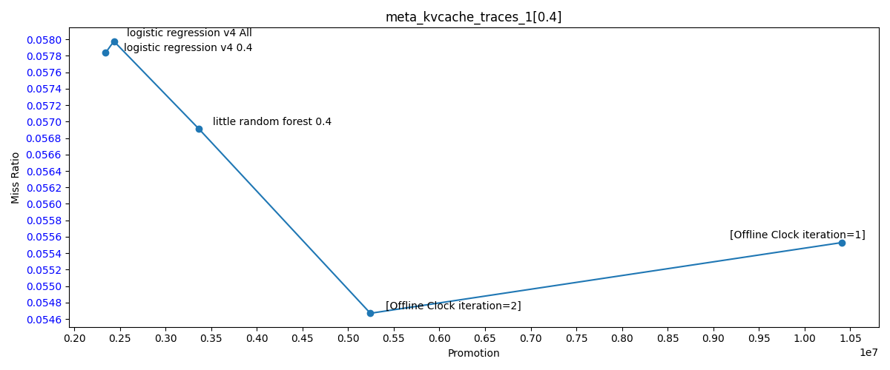  
> **Trace Path**: meta_kvcache_traces_1.oracleGeneral.bin.zst  
> **Log Path**: [../result/log/meta_kvcache_traces_1[0.4].csv](../result/log/meta_kvcache_traces_1[0.4].csv)  
> **Desc**: 0.4  
> **Cache Size**: 6155  
> **Ignore Obj Size**: 0  
> **Total Request**: 335,173,084  
> **First Promotion**: 10,410,262  
> **Last Promotion**: 5,009,155  
> **Promotion Reduced**: 5,401,107  

>   
> **Trace Path**: meta_kvcache_traces_1.oracleGeneral.bin.zst  
> **Log Path**: [../result/log/meta_kvcache_traces_1[0.4,ML,model=logistic_regression_0.4].csv](../result/log/meta_kvcache_traces_1[0.4,ML,model=logistic_regression_0.4].csv)  
> **Desc**: 0.4,ML,model=logistic_regression_0.4  
> **Cache Size**: 6155  
> **Ignore Obj Size**: 0  
> **Total Request**: 335,173,084  
> **First Promotion**: 8,578,951  
> **Last Promotion**: 8,578,951  
> **Promotion Reduced**: 0  

> 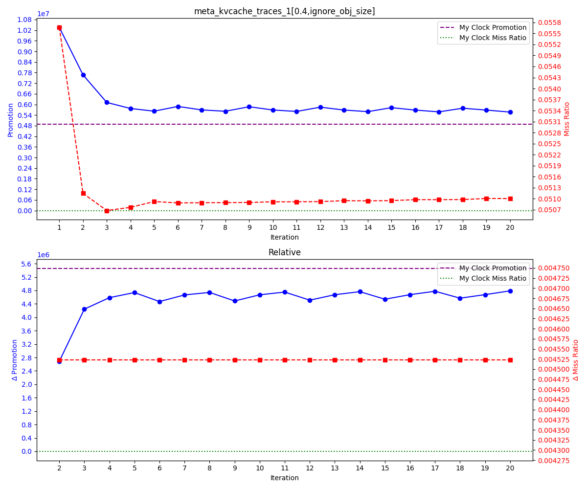  
> **Trace Path**: meta_kvcache_traces_1.oracleGeneral.bin.zst  
> **Log Path**: [../result/log/meta_kvcache_traces_1[0.4,ignore_obj_size].csv](../result/log/meta_kvcache_traces_1[0.4,ignore_obj_size].csv)  
> **Desc**: 0.4,ignore_obj_size  
> **Cache Size**: 6844838  
> **Ignore Obj Size**: 1  
> **Total Request**: 335,173,084  
> **First Promotion**: 10,355,609  
> **Last Promotion**: 5,091,547  
> **Promotion Reduced**: 5,264,062  

>   
> **Trace Path**: meta_kvcache_traces_1.oracleGeneral.bin.zst  
> **Log Path**: [../result/log/meta_kvcache_traces_1[0.4,ignore_obj_size,ML,model=logistic_regression_0.4].csv](../result/log/meta_kvcache_traces_1[0.4,ignore_obj_size,ML,model=logistic_regression_0.4].csv)  
> **Desc**: 0.4,ignore_obj_size,ML,model=logistic_regression_0.4  
> **Cache Size**: 6844838  
> **Ignore Obj Size**: 1  
> **Total Request**: 335,173,084  
> **First Promotion**: 5,879,787  
> **Last Promotion**: 5,879,787  
> **Promotion Reduced**: 0  

## meta_rnha https://ftp.pdl.cmu.edu/pub/datasets/twemcacheWorkload/cacheDatasets/metaCDN/meta_rnha.oracleGeneral.zst
> 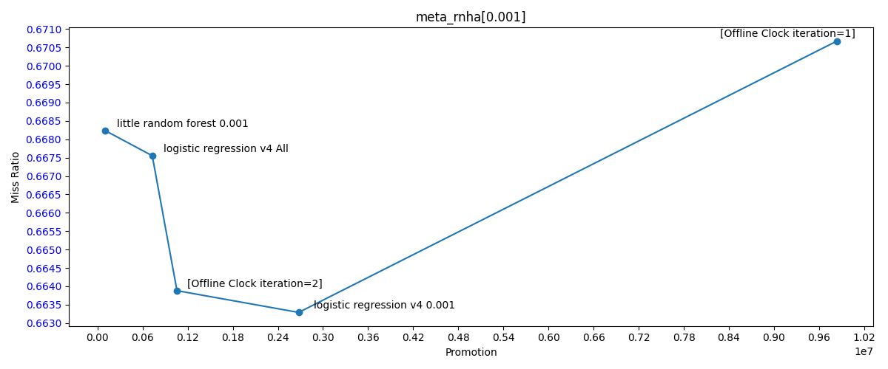  
> **Trace Path**: meta_rnha.oracleGeneral.zst  
> **Log Path**: [../result/log/meta_rnha[0.001].csv](../result/log/meta_rnha[0.001].csv)  
> **Desc**: 0.001  
> **Cache Size**: 729265  
> **Ignore Obj Size**: 0  
> **Total Request**: 96,680,668  
> **First Promotion**: 9,835,651  
> **Last Promotion**: 573,461  
> **Promotion Reduced**: 9,262,190  

>   
> **Trace Path**: meta_rnha.oracleGeneral.zst  
> **Log Path**: [../result/log/meta_rnha[0.001,ML,model=logistic_regression_0.001].csv](../result/log/meta_rnha[0.001,ML,model=logistic_regression_0.001].csv)  
> **Desc**: 0.001,ML,model=logistic_regression_0.001  
> **Cache Size**: 729265  
> **Ignore Obj Size**: 0  
> **Total Request**: 96,680,668  
> **First Promotion**: 0  
> **Last Promotion**: 0  
> **Promotion Reduced**: 0  

> 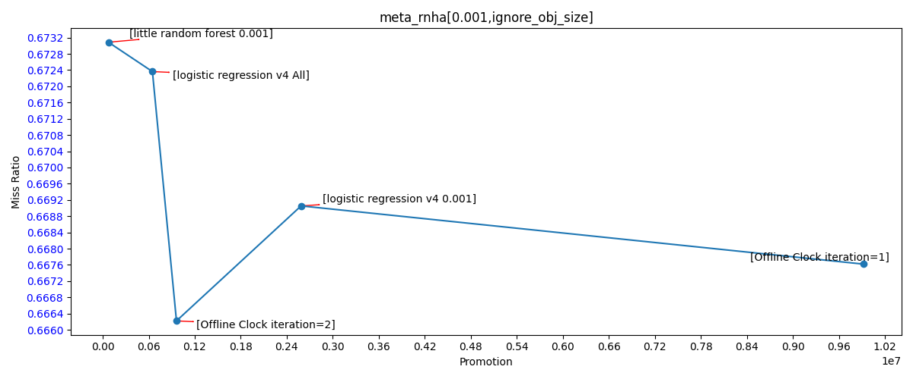  
> **Trace Path**: meta_rnha.oracleGeneral.zst  
> **Log Path**: [../result/log/meta_rnha[0.001,ignore_obj_size].csv](../result/log/meta_rnha[0.001,ignore_obj_size].csv)  
> **Desc**: 0.001,ignore_obj_size  
> **Cache Size**: 35040  
> **Ignore Obj Size**: 1  
> **Total Request**: 96,680,668  
> **First Promotion**: 9,925,546  
> **Last Promotion**: 810,582  
> **Promotion Reduced**: 9,114,964  

>   
> **Trace Path**: meta_rnha.oracleGeneral.zst  
> **Log Path**: [../result/log/meta_rnha[0.001,ignore_obj_size,ML,model=logistic_regression_0.001].csv](../result/log/meta_rnha[0.001,ignore_obj_size,ML,model=logistic_regression_0.001].csv)  
> **Desc**: 0.001,ignore_obj_size,ML,model=logistic_regression_0.001  
> **Cache Size**: 35040  
> **Ignore Obj Size**: 1  
> **Total Request**: 96,680,668  
> **First Promotion**: 0  
> **Last Promotion**: 0  
> **Promotion Reduced**: 0  

> 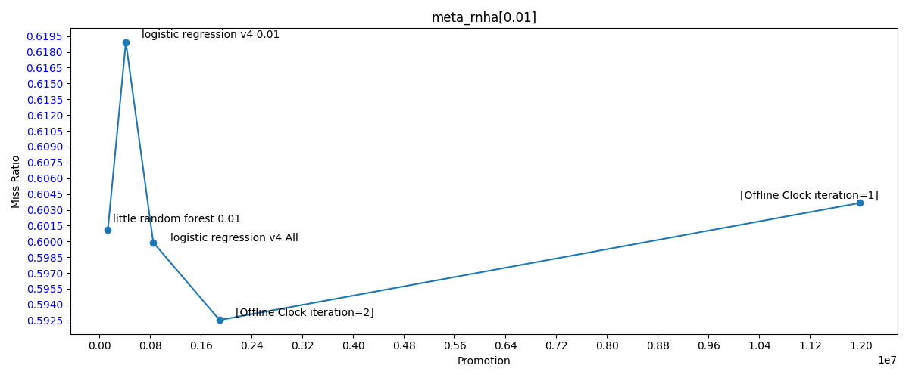  
> **Trace Path**: meta_rnha.oracleGeneral.zst  
> **Log Path**: [../result/log/meta_rnha[0.01].csv](../result/log/meta_rnha[0.01].csv)  
> **Desc**: 0.01  
> **Cache Size**: 7292652  
> **Ignore Obj Size**: 0  
> **Total Request**: 96,680,668  
> **First Promotion**: 11,986,705  
> **Last Promotion**: 1,157,739  
> **Promotion Reduced**: 10,828,966  

>   
> **Trace Path**: meta_rnha.oracleGeneral.zst  
> **Log Path**: [../result/log/meta_rnha[0.01,ML,model=logistic_regression_0.01].csv](../result/log/meta_rnha[0.01,ML,model=logistic_regression_0.01].csv)  
> **Desc**: 0.01,ML,model=logistic_regression_0.01  
> **Cache Size**: 7292652  
> **Ignore Obj Size**: 0  
> **Total Request**: 96,680,668  
> **First Promotion**: 0  
> **Last Promotion**: 0  
> **Promotion Reduced**: 0  

> 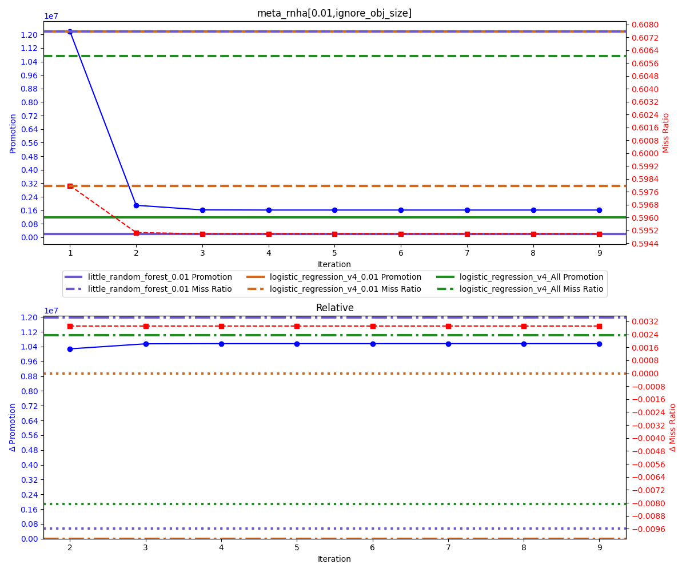  
> **Trace Path**: meta_rnha.oracleGeneral.zst  
> **Log Path**: [../result/log/meta_rnha[0.01,ignore_obj_size].csv](../result/log/meta_rnha[0.01,ignore_obj_size].csv)  
> **Desc**: 0.01,ignore_obj_size  
> **Cache Size**: 350402  
> **Ignore Obj Size**: 1  
> **Total Request**: 96,680,668  
> **First Promotion**: 12,174,665  
> **Last Promotion**: 1,616,583  
> **Promotion Reduced**: 10,558,082  

>   
> **Trace Path**: meta_rnha.oracleGeneral.zst  
> **Log Path**: [../result/log/meta_rnha[0.01,ignore_obj_size,ML,model=logistic_regression_0.01].csv](../result/log/meta_rnha[0.01,ignore_obj_size,ML,model=logistic_regression_0.01].csv)  
> **Desc**: 0.01,ignore_obj_size,ML,model=logistic_regression_0.01  
> **Cache Size**: 350402  
> **Ignore Obj Size**: 1  
> **Total Request**: 96,680,668  
> **First Promotion**: 0  
> **Last Promotion**: 0  
> **Promotion Reduced**: 0  

> 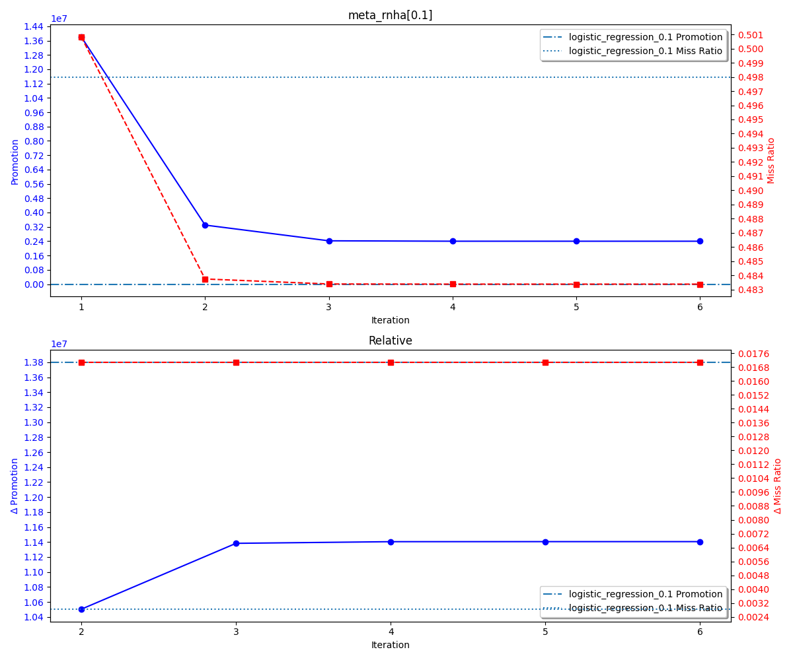  
> **Trace Path**: meta_rnha.oracleGeneral.zst  
> **Log Path**: [../result/log/meta_rnha[0.1].csv](../result/log/meta_rnha[0.1].csv)  
> **Desc**: 0.1  
> **Cache Size**: 72926528  
> **Ignore Obj Size**: 0  
> **Total Request**: 96,680,668  
> **First Promotion**: 13,802,722  
> **Last Promotion**: 2,397,006  
> **Promotion Reduced**: 11,405,716  

>   
> **Trace Path**: meta_rnha.oracleGeneral.zst  
> **Log Path**: [../result/log/meta_rnha[0.1,ML,model=logistic_regression_0.1].csv](../result/log/meta_rnha[0.1,ML,model=logistic_regression_0.1].csv)  
> **Desc**: 0.1,ML,model=logistic_regression_0.1  
> **Cache Size**: 72926528  
> **Ignore Obj Size**: 0  
> **Total Request**: 96,680,668  
> **First Promotion**: 0  
> **Last Promotion**: 0  
> **Promotion Reduced**: 0  

> 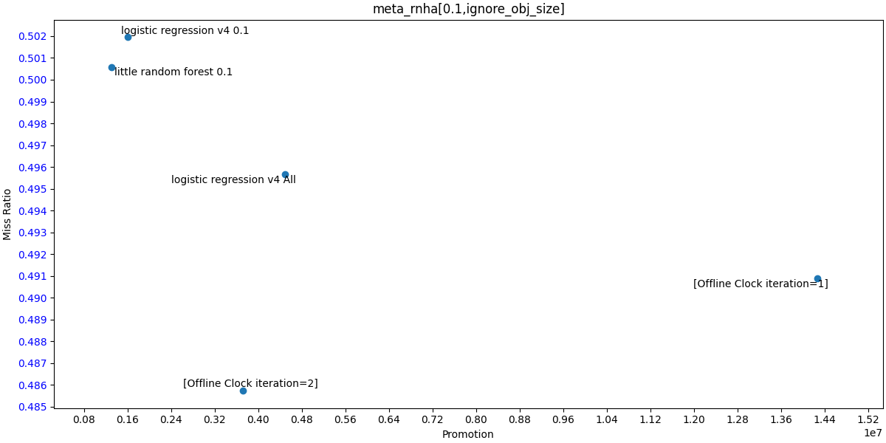  
> **Trace Path**: meta_rnha.oracleGeneral.zst  
> **Log Path**: [../result/log/meta_rnha[0.1,ignore_obj_size].csv](../result/log/meta_rnha[0.1,ignore_obj_size].csv)  
> **Desc**: 0.1,ignore_obj_size  
> **Cache Size**: 3504028  
> **Ignore Obj Size**: 1  
> **Total Request**: 96,680,668  
> **First Promotion**: 14,264,934  
> **Last Promotion**: 3,272,084  
> **Promotion Reduced**: 10,992,850  

>   
> **Trace Path**: meta_rnha.oracleGeneral.zst  
> **Log Path**: [../result/log/meta_rnha[0.1,ignore_obj_size,ML,model=logistic_regression_0.1].csv](../result/log/meta_rnha[0.1,ignore_obj_size,ML,model=logistic_regression_0.1].csv)  
> **Desc**: 0.1,ignore_obj_size,ML,model=logistic_regression_0.1  
> **Cache Size**: 3504028  
> **Ignore Obj Size**: 1  
> **Total Request**: 96,680,668  
> **First Promotion**: 24,192  
> **Last Promotion**: 24,192  
> **Promotion Reduced**: 0  

> 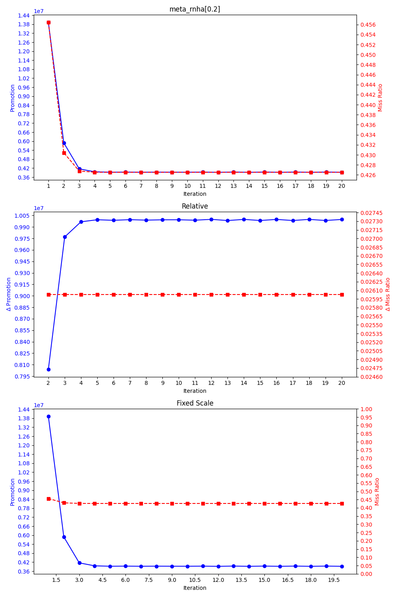  
> **Trace Path**: meta_rnha.oracleGeneral.zst  
> **Log Path**: [../result/log/meta_rnha[0.2].csv](../result/log/meta_rnha[0.2].csv)  
> **Desc**: 0.2  
> **Cache Size**: 145853056  
> **Ignore Obj Size**: 0  
> **Total Request**: 96,680,668  
> **First Promotion**: 13,923,286  
> **Last Promotion**: 3,425,871  
> **Promotion Reduced**: 10,497,415  

>   
> **Trace Path**: meta_rnha.oracleGeneral.zst  
> **Log Path**: [../result/log/meta_rnha[0.2,ML,model=logistic_regression_0.2].csv](../result/log/meta_rnha[0.2,ML,model=logistic_regression_0.2].csv)  
> **Desc**: 0.2,ML,model=logistic_regression_0.2  
> **Cache Size**: 145853056  
> **Ignore Obj Size**: 0  
> **Total Request**: 96,680,668  
> **First Promotion**: 0  
> **Last Promotion**: 0  
> **Promotion Reduced**: 0  

> 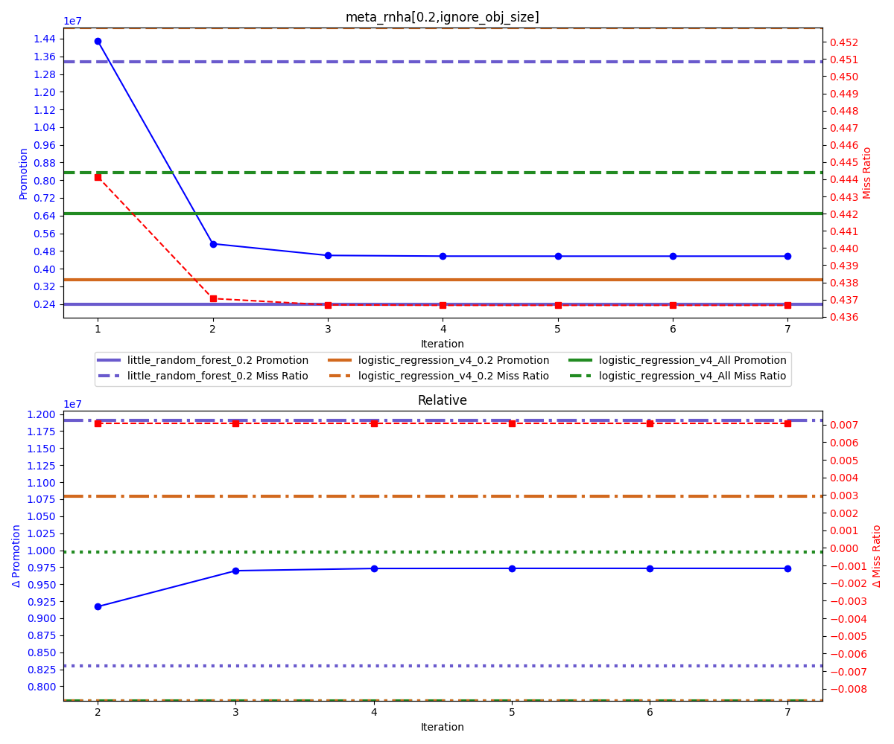  
> **Trace Path**: meta_rnha.oracleGeneral.zst  
> **Log Path**: [../result/log/meta_rnha[0.2,ignore_obj_size].csv](../result/log/meta_rnha[0.2,ignore_obj_size].csv)  
> **Desc**: 0.2,ignore_obj_size  
> **Cache Size**: 7008056  
> **Ignore Obj Size**: 1  
> **Total Request**: 96,680,668  
> **First Promotion**: 14,297,699  
> **Last Promotion**: 4,564,455  
> **Promotion Reduced**: 9,733,244  

>   
> **Trace Path**: meta_rnha.oracleGeneral.zst  
> **Log Path**: [../result/log/meta_rnha[0.2,ignore_obj_size,ML,model=logistic_regression_0.2].csv](../result/log/meta_rnha[0.2,ignore_obj_size,ML,model=logistic_regression_0.2].csv)  
> **Desc**: 0.2,ignore_obj_size,ML,model=logistic_regression_0.2  
> **Cache Size**: 7008056  
> **Ignore Obj Size**: 1  
> **Total Request**: 96,680,668  
> **First Promotion**: 5,948,810  
> **Last Promotion**: 5,948,810  
> **Promotion Reduced**: 0  

> 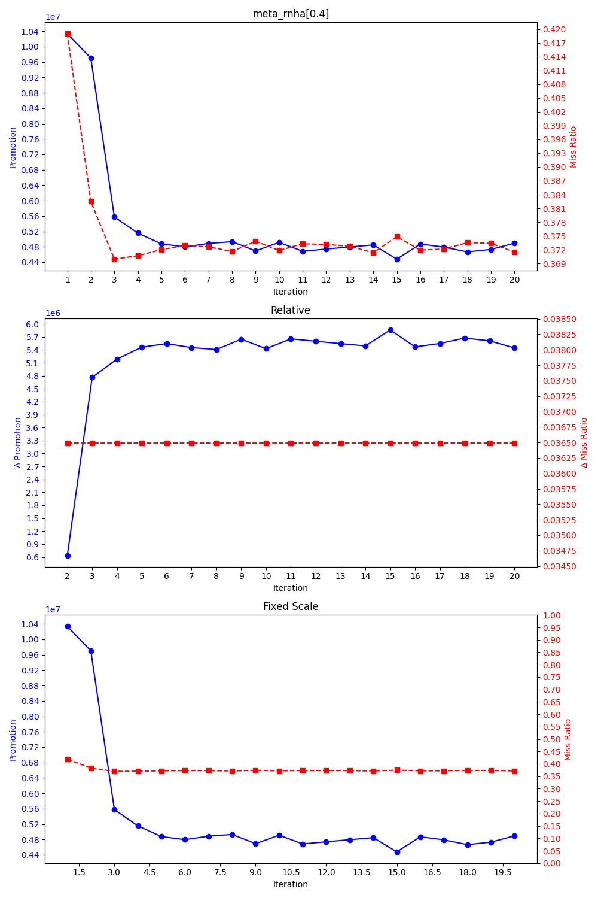  
> **Trace Path**: meta_rnha.oracleGeneral.zst  
> **Log Path**: [../result/log/meta_rnha[0.4].csv](../result/log/meta_rnha[0.4].csv)  
> **Desc**: 0.4  
> **Cache Size**: 291706112  
> **Ignore Obj Size**: 0  
> **Total Request**: 96,680,668  
> **First Promotion**: 10,339,626  
> **Last Promotion**: 4,016,880  
> **Promotion Reduced**: 6,322,746  

>   
> **Trace Path**: meta_rnha.oracleGeneral.zst  
> **Log Path**: [../result/log/meta_rnha[0.4,ML,model=logistic_regression_0.4].csv](../result/log/meta_rnha[0.4,ML,model=logistic_regression_0.4].csv)  
> **Desc**: 0.4,ML,model=logistic_regression_0.4  
> **Cache Size**: 291706112  
> **Ignore Obj Size**: 0  
> **Total Request**: 96,680,668  
> **First Promotion**: 0  
> **Last Promotion**: 0  
> **Promotion Reduced**: 0  

> 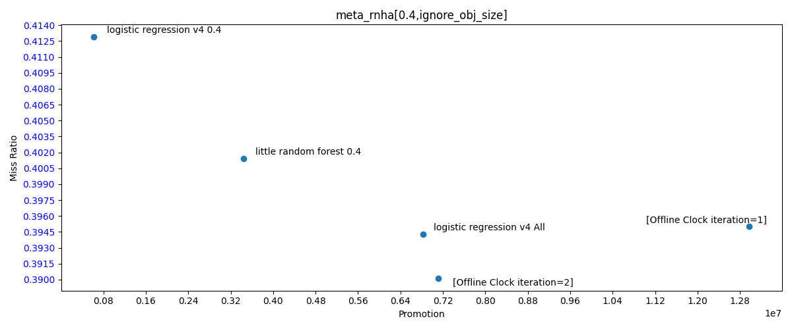  
> **Trace Path**: meta_rnha.oracleGeneral.zst  
> **Log Path**: [../result/log/meta_rnha[0.4,ignore_obj_size].csv](../result/log/meta_rnha[0.4,ignore_obj_size].csv)  
> **Desc**: 0.4,ignore_obj_size  
> **Cache Size**: 14016112  
> **Ignore Obj Size**: 1  
> **Total Request**: 96,680,668  
> **First Promotion**: 12,976,801  
> **Last Promotion**: 6,756,641  
> **Promotion Reduced**: 6,220,160  

>   
> **Trace Path**: meta_rnha.oracleGeneral.zst  
> **Log Path**: [../result/log/meta_rnha[0.4,ignore_obj_size,ML,model=logistic_regression_0.4].csv](../result/log/meta_rnha[0.4,ignore_obj_size,ML,model=logistic_regression_0.4].csv)  
> **Desc**: 0.4,ignore_obj_size,ML,model=logistic_regression_0.4  
> **Cache Size**: 14016112  
> **Ignore Obj Size**: 1  
> **Total Request**: 96,680,668  
> **First Promotion**: 4,956,723  
> **Last Promotion**: 4,956,723  
> **Promotion Reduced**: 0  

## msr_prxy_1 https://ftp.pdl.cmu.edu/pub/datasets/twemcacheWorkload/cacheDatasets/msr/msr_prxy_1.oracleGeneral.zst
> 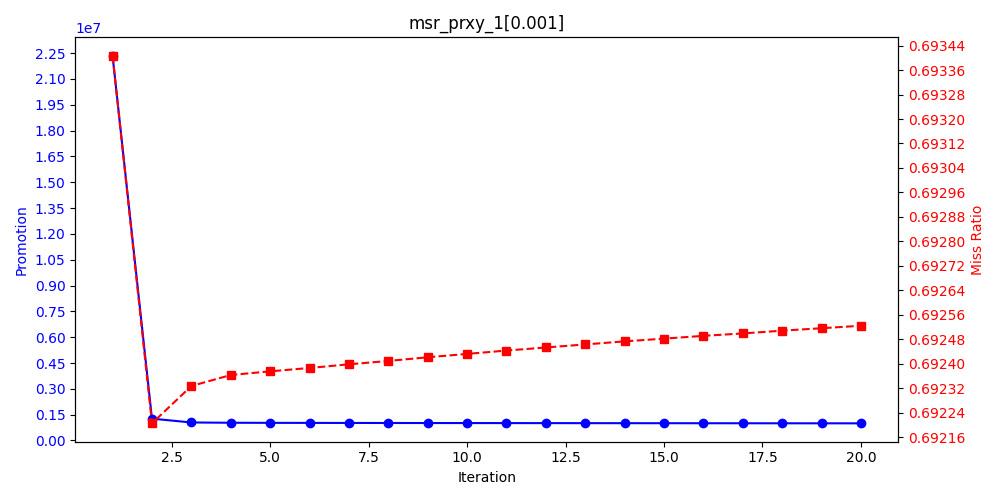  
> **Trace Path**: msr_prxy_1.oracleGeneral.zst  
> **Log Path**: [../result/log/msr_prxy_1[0.001].csv](../result/log/msr_prxy_1[0.001].csv)  
> **Desc**: 0.001  
> **Cache Size**: 15  
> **Ignore Obj Size**: 0  
> **Total Request**: 168,638,964  
> **First Promotion**: 22,350,092  
> **Last Promotion**: 1,061,796  
> **Promotion Reduced**: 21,288,296  

>   
> **Trace Path**: msr_prxy_1.oracleGeneral.zst  
> **Log Path**: [../result/log/msr_prxy_1[0.001,ML,model=logistic_regression_0.001].csv](../result/log/msr_prxy_1[0.001,ML,model=logistic_regression_0.001].csv)  
> **Desc**: 0.001,ML,model=logistic_regression_0.001  
> **Cache Size**: 15  
> **Ignore Obj Size**: 0  
> **Total Request**: 168,638,964  
> **First Promotion**: 0  
> **Last Promotion**: 0  
> **Promotion Reduced**: 0  

> 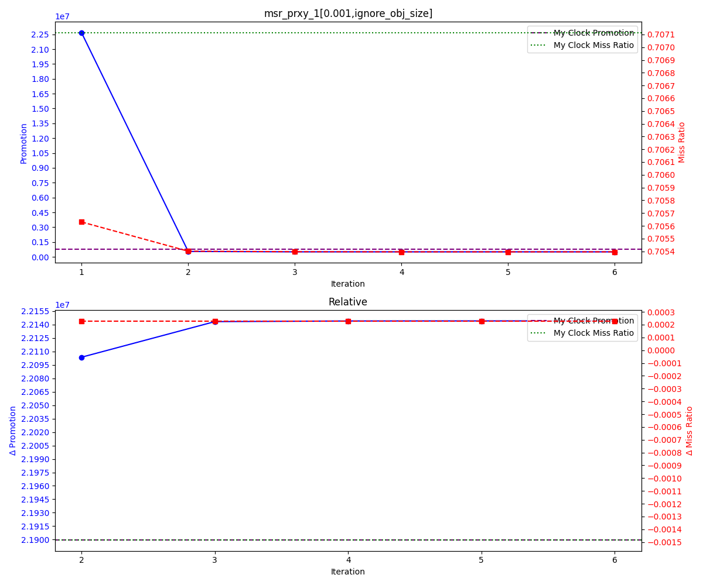  
> **Trace Path**: msr_prxy_1.oracleGeneral.zst  
> **Log Path**: [../result/log/msr_prxy_1[0.001,ignore_obj_size].csv](../result/log/msr_prxy_1[0.001,ignore_obj_size].csv)  
> **Desc**: 0.001,ignore_obj_size  
> **Cache Size**: 390  
> **Ignore Obj Size**: 1  
> **Total Request**: 168,638,964  
> **First Promotion**: 22,655,033  
> **Last Promotion**: 511,096  
> **Promotion Reduced**: 22,143,937  

>   
> **Trace Path**: msr_prxy_1.oracleGeneral.zst  
> **Log Path**: [../result/log/msr_prxy_1[0.001,ignore_obj_size,ML,model=logistic_regression_0.001].csv](../result/log/msr_prxy_1[0.001,ignore_obj_size,ML,model=logistic_regression_0.001].csv)  
> **Desc**: 0.001,ignore_obj_size,ML,model=logistic_regression_0.001  
> **Cache Size**: 390  
> **Ignore Obj Size**: 1  
> **Total Request**: 168,638,964  
> **First Promotion**: 1  
> **Last Promotion**: 1  
> **Promotion Reduced**: 0  

> 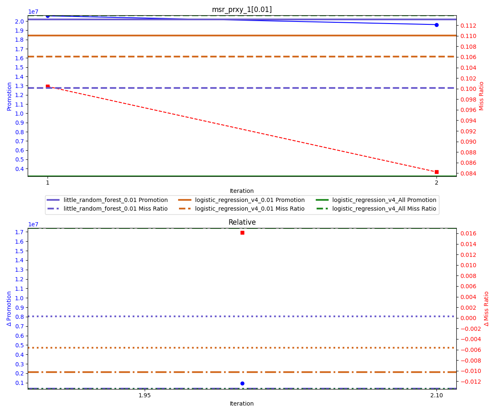  
> **Trace Path**: msr_prxy_1.oracleGeneral.zst  
> **Log Path**: [../result/log/msr_prxy_1[0.01].csv](../result/log/msr_prxy_1[0.01].csv)  
> **Desc**: 0.01  
> **Cache Size**: 157  
> **Ignore Obj Size**: 0  
> **Total Request**: 168,638,964  
> **First Promotion**: 20,572,333  
> **Last Promotion**: 20,760,618  
> **Promotion Reduced**: -188,285  

>   
> **Trace Path**: msr_prxy_1.oracleGeneral.zst  
> **Log Path**: [../result/log/msr_prxy_1[0.01,ML,model=logistic_regression_0.01].csv](../result/log/msr_prxy_1[0.01,ML,model=logistic_regression_0.01].csv)  
> **Desc**: 0.01,ML,model=logistic_regression_0.01  
> **Cache Size**: 157  
> **Ignore Obj Size**: 0  
> **Total Request**: 168,638,964  
> **First Promotion**: 0  
> **Last Promotion**: 0  
> **Promotion Reduced**: 0  

> 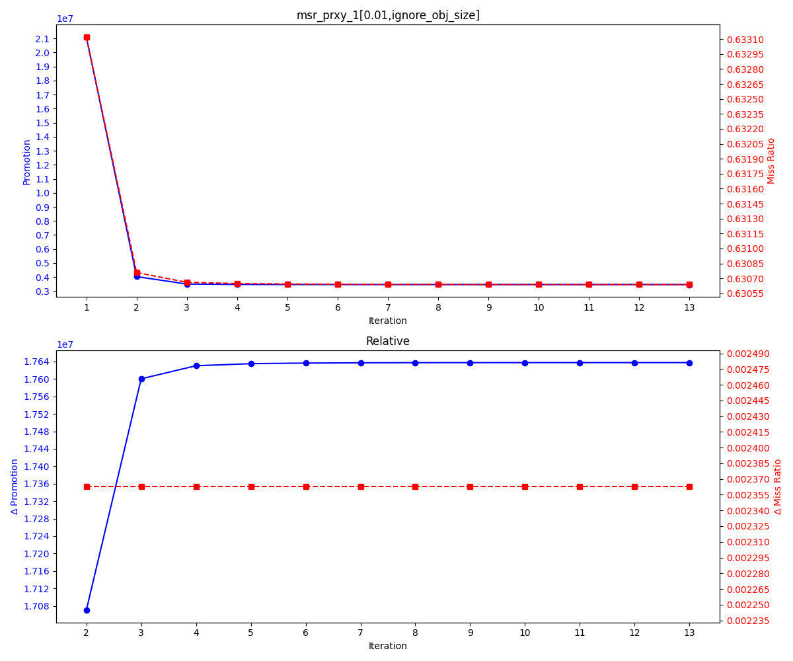  
> **Trace Path**: msr_prxy_1.oracleGeneral.zst  
> **Log Path**: [../result/log/msr_prxy_1[0.01,ignore_obj_size].csv](../result/log/msr_prxy_1[0.01,ignore_obj_size].csv)  
> **Desc**: 0.01,ignore_obj_size  
> **Cache Size**: 3902  
> **Ignore Obj Size**: 1  
> **Total Request**: 168,638,964  
> **First Promotion**: 21,104,131  
> **Last Promotion**: 3,466,508  
> **Promotion Reduced**: 17,637,623  

>   
> **Trace Path**: msr_prxy_1.oracleGeneral.zst  
> **Log Path**: [../result/log/msr_prxy_1[0.01,ignore_obj_size,ML,model=logistic_regression_0.01].csv](../result/log/msr_prxy_1[0.01,ignore_obj_size,ML,model=logistic_regression_0.01].csv)  
> **Desc**: 0.01,ignore_obj_size,ML,model=logistic_regression_0.01  
> **Cache Size**: 3902  
> **Ignore Obj Size**: 1  
> **Total Request**: 168,638,964  
> **First Promotion**: 0  
> **Last Promotion**: 0  
> **Promotion Reduced**: 0  

> 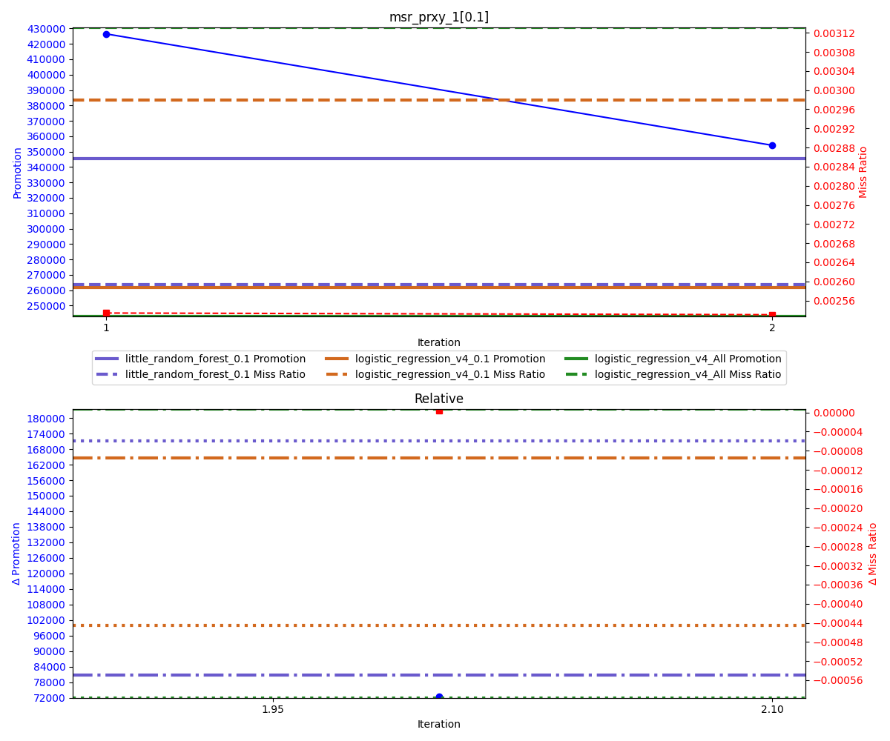  
> **Trace Path**: msr_prxy_1.oracleGeneral.zst  
> **Log Path**: [../result/log/msr_prxy_1[0.1].csv](../result/log/msr_prxy_1[0.1].csv)  
> **Desc**: 0.1  
> **Cache Size**: 1571  
> **Ignore Obj Size**: 0  
> **Total Request**: 168,638,964  
> **First Promotion**: 426,485  
> **Last Promotion**: 352,870  
> **Promotion Reduced**: 73,615  

>   
> **Trace Path**: msr_prxy_1.oracleGeneral.zst  
> **Log Path**: [../result/log/msr_prxy_1[0.1,ML,model=logistic_regression_0.1].csv](../result/log/msr_prxy_1[0.1,ML,model=logistic_regression_0.1].csv)  
> **Desc**: 0.1,ML,model=logistic_regression_0.1  
> **Cache Size**: 1571  
> **Ignore Obj Size**: 0  
> **Total Request**: 168,638,964  
> **First Promotion**: 113,882  
> **Last Promotion**: 113,882  
> **Promotion Reduced**: 0  

> 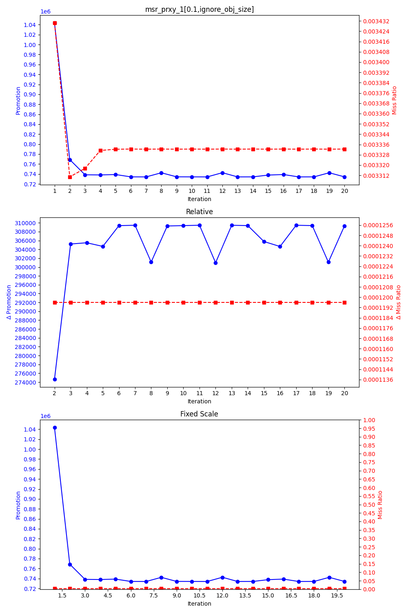  
> **Trace Path**: msr_prxy_1.oracleGeneral.zst  
> **Log Path**: [../result/log/msr_prxy_1[0.1,ignore_obj_size].csv](../result/log/msr_prxy_1[0.1,ignore_obj_size].csv)  
> **Desc**: 0.1,ignore_obj_size  
> **Cache Size**: 39022  
> **Ignore Obj Size**: 1  
> **Total Request**: 168,638,964  
> **First Promotion**: 1,043,522  
> **Last Promotion**: 738,754  
> **Promotion Reduced**: 304,768  

>   
> **Trace Path**: msr_prxy_1.oracleGeneral.zst  
> **Log Path**: [../result/log/msr_prxy_1[0.1,ignore_obj_size,ML,model=logistic_regression_0.1].csv](../result/log/msr_prxy_1[0.1,ignore_obj_size,ML,model=logistic_regression_0.1].csv)  
> **Desc**: 0.1,ignore_obj_size,ML,model=logistic_regression_0.1  
> **Cache Size**: 39022  
> **Ignore Obj Size**: 1  
> **Total Request**: 168,638,964  
> **First Promotion**: 1,043,516  
> **Last Promotion**: 1,043,516  
> **Promotion Reduced**: 0  

> 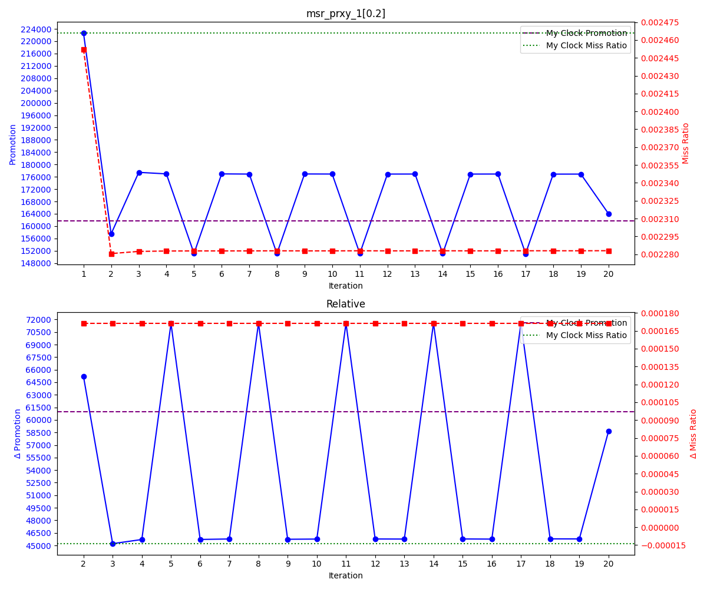  
> **Trace Path**: msr_prxy_1.oracleGeneral.zst  
> **Log Path**: [../result/log/msr_prxy_1[0.2].csv](../result/log/msr_prxy_1[0.2].csv)  
> **Desc**: 0.2  
> **Cache Size**: 3143  
> **Ignore Obj Size**: 0  
> **Total Request**: 168,638,964  
> **First Promotion**: 222,664  
> **Last Promotion**: 150,175  
> **Promotion Reduced**: 72,489  

>   
> **Trace Path**: msr_prxy_1.oracleGeneral.zst  
> **Log Path**: [../result/log/msr_prxy_1[0.2,ML,model=logistic_regression_0.2].csv](../result/log/msr_prxy_1[0.2,ML,model=logistic_regression_0.2].csv)  
> **Desc**: 0.2,ML,model=logistic_regression_0.2  
> **Cache Size**: 3143  
> **Ignore Obj Size**: 0  
> **Total Request**: 168,638,964  
> **First Promotion**: 219,527  
> **Last Promotion**: 219,527  
> **Promotion Reduced**: 0  

> 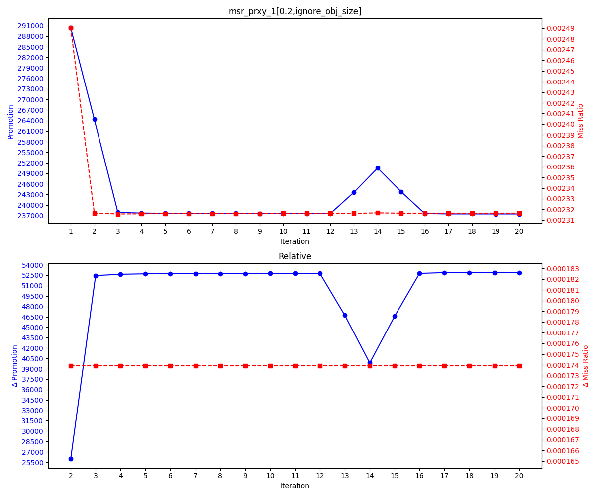  
> **Trace Path**: msr_prxy_1.oracleGeneral.zst  
> **Log Path**: [../result/log/msr_prxy_1[0.2,ignore_obj_size].csv](../result/log/msr_prxy_1[0.2,ignore_obj_size].csv)  
> **Desc**: 0.2,ignore_obj_size  
> **Cache Size**: 78045  
> **Ignore Obj Size**: 1  
> **Total Request**: 168,638,964  
> **First Promotion**: 290,360  
> **Last Promotion**: 226,009  
> **Promotion Reduced**: 64,351  

>   
> **Trace Path**: msr_prxy_1.oracleGeneral.zst  
> **Log Path**: [../result/log/msr_prxy_1[0.2,ignore_obj_size,ML,model=logistic_regression_0.2].csv](../result/log/msr_prxy_1[0.2,ignore_obj_size,ML,model=logistic_regression_0.2].csv)  
> **Desc**: 0.2,ignore_obj_size,ML,model=logistic_regression_0.2  
> **Cache Size**: 78045  
> **Ignore Obj Size**: 1  
> **Total Request**: 168,638,964  
> **First Promotion**: 290,360  
> **Last Promotion**: 290,360  
> **Promotion Reduced**: 0  

>   
> **Trace Path**: msr_prxy_1.oracleGeneral.zst  
> **Log Path**: [../result/log/msr_prxy_1[0.4].csv](../result/log/msr_prxy_1[0.4].csv)  
> **Desc**: 0.4  
> **Cache Size**: 6287  
> **Ignore Obj Size**: 0  
> **Total Request**: 168,638,964  
> **First Promotion**: 105,611  
> **Last Promotion**: 79,031  
> **Promotion Reduced**: 26,580  

>   
> **Trace Path**: msr_prxy_1.oracleGeneral.zst  
> **Log Path**: [../result/log/msr_prxy_1[0.4,ML,model=logistic_regression_0.4].csv](../result/log/msr_prxy_1[0.4,ML,model=logistic_regression_0.4].csv)  
> **Desc**: 0.4,ML,model=logistic_regression_0.4  
> **Cache Size**: 6287  
> **Ignore Obj Size**: 0  
> **Total Request**: 168,638,964  
> **First Promotion**: 104,879  
> **Last Promotion**: 104,879  
> **Promotion Reduced**: 0  

> 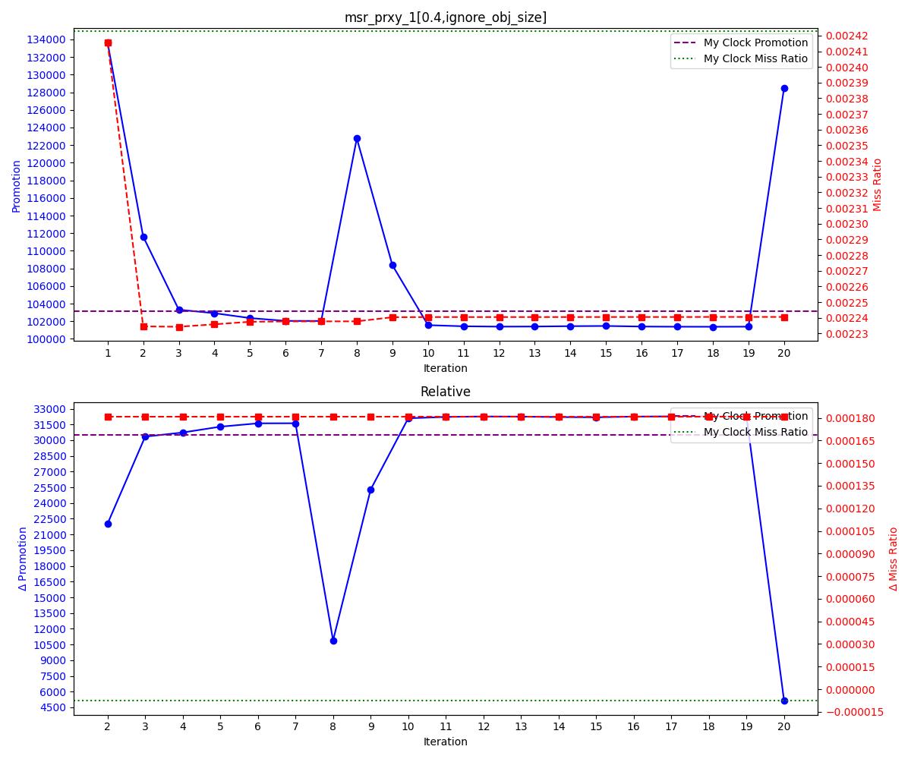  
> **Trace Path**: msr_prxy_1.oracleGeneral.zst  
> **Log Path**: [../result/log/msr_prxy_1[0.4,ignore_obj_size].csv](../result/log/msr_prxy_1[0.4,ignore_obj_size].csv)  
> **Desc**: 0.4,ignore_obj_size  
> **Cache Size**: 156090  
> **Ignore Obj Size**: 1  
> **Total Request**: 168,638,964  
> **First Promotion**: 133,646  
> **Last Promotion**: 101,815  
> **Promotion Reduced**: 31,831  

>   
> **Trace Path**: msr_prxy_1.oracleGeneral.zst  
> **Log Path**: [../result/log/msr_prxy_1[0.4,ignore_obj_size,ML,model=logistic_regression_0.4].csv](../result/log/msr_prxy_1[0.4,ignore_obj_size,ML,model=logistic_regression_0.4].csv)  
> **Desc**: 0.4,ignore_obj_size,ML,model=logistic_regression_0.4  
> **Cache Size**: 156090  
> **Ignore Obj Size**: 1  
> **Total Request**: 168,638,964  
> **First Promotion**: 133,646  
> **Last Promotion**: 133,646  
> **Promotion Reduced**: 0  

## w01 https://ftp.pdl.cmu.edu/pub/datasets/twemcacheWorkload/cacheDatasets/cloudphysics/w01.oracleGeneral.bin.zst
> 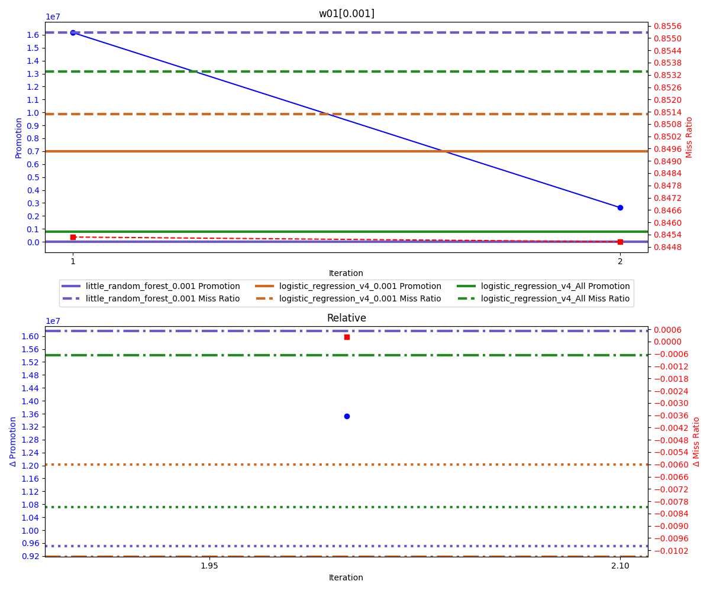  
> **Trace Path**: w01.oracleGeneral.bin.zst  
> **Log Path**: [../result/log/w01[0.001].csv](../result/log/w01[0.001].csv)  
> **Desc**: 0.001  
> **Cache Size**: 654  
> **Ignore Obj Size**: 0  
> **Total Request**: 215,796,257  
> **First Promotion**: 16,173,662  
> **Last Promotion**: 2,564,340  
> **Promotion Reduced**: 13,609,322  

>   
> **Trace Path**: w01.oracleGeneral.bin.zst  
> **Log Path**: [../result/log/w01[0.001,ML,model=logistic_regression_0.001].csv](../result/log/w01[0.001,ML,model=logistic_regression_0.001].csv)  
> **Desc**: 0.001,ML,model=logistic_regression_0.001  
> **Cache Size**: 654  
> **Ignore Obj Size**: 0  
> **Total Request**: 215,796,257  
> **First Promotion**: 0  
> **Last Promotion**: 0  
> **Promotion Reduced**: 0  

> 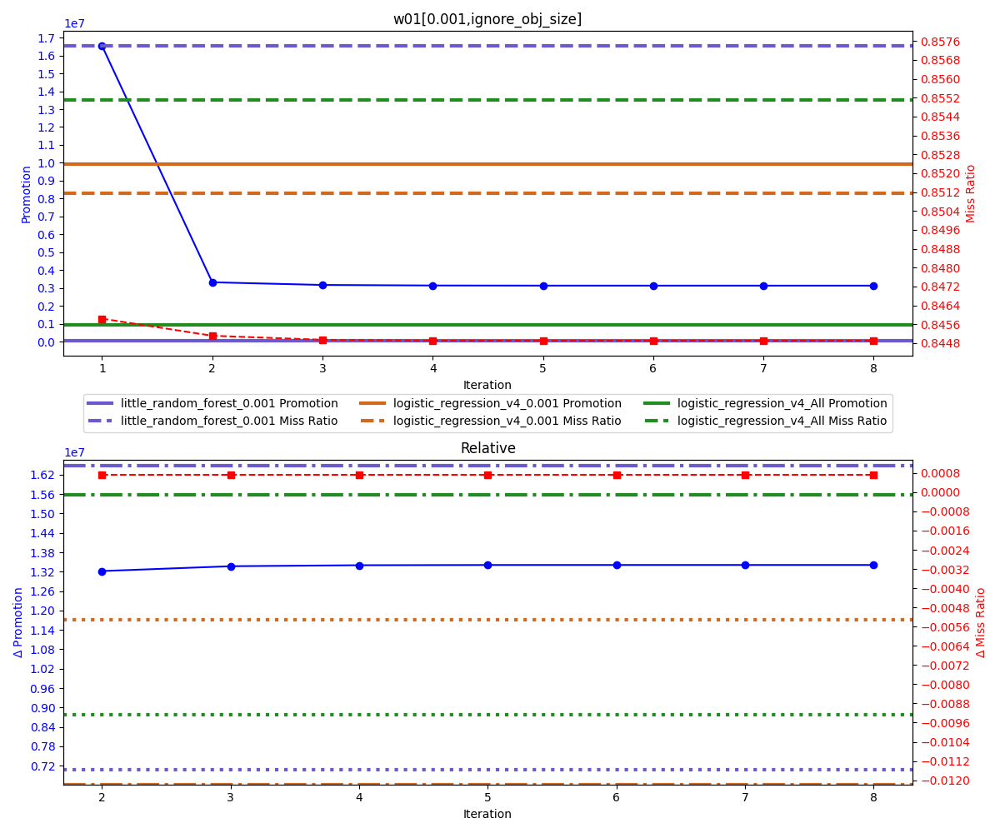  
> **Trace Path**: w01.oracleGeneral.bin.zst  
> **Log Path**: [../result/log/w01[0.001,ignore_obj_size].csv](../result/log/w01[0.001,ignore_obj_size].csv)  
> **Desc**: 0.001,ignore_obj_size  
> **Cache Size**: 122804  
> **Ignore Obj Size**: 1  
> **Total Request**: 215,796,257  
> **First Promotion**: 16,538,593  
> **Last Promotion**: 3,131,001  
> **Promotion Reduced**: 13,407,592  

>   
> **Trace Path**: w01.oracleGeneral.bin.zst  
> **Log Path**: [../result/log/w01[0.001,ignore_obj_size,ML,model=logistic_regression_0.001].csv](../result/log/w01[0.001,ignore_obj_size,ML,model=logistic_regression_0.001].csv)  
> **Desc**: 0.001,ignore_obj_size,ML,model=logistic_regression_0.001  
> **Cache Size**: 122804  
> **Ignore Obj Size**: 1  
> **Total Request**: 215,796,257  
> **First Promotion**: 0  
> **Last Promotion**: 0  
> **Promotion Reduced**: 0  

> 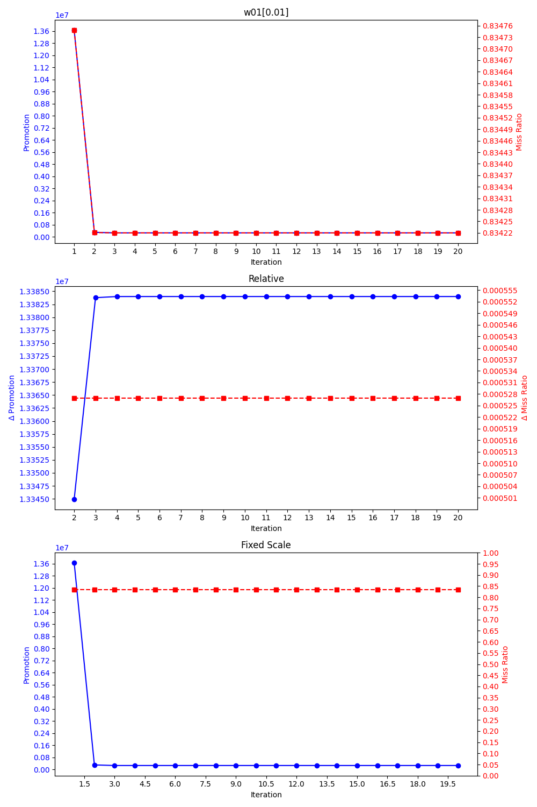  
> **Trace Path**: w01.oracleGeneral.bin.zst  
> **Log Path**: [../result/log/w01[0.01].csv](../result/log/w01[0.01].csv)  
> **Desc**: 0.01  
> **Cache Size**: 6541  
> **Ignore Obj Size**: 0  
> **Total Request**: 215,796,257  
> **First Promotion**: 13,650,281  
> **Last Promotion**: 265,694  
> **Promotion Reduced**: 13,384,587  

>   
> **Trace Path**: w01.oracleGeneral.bin.zst  
> **Log Path**: [../result/log/w01[0.01,ML,model=logistic_regression_0.01].csv](../result/log/w01[0.01,ML,model=logistic_regression_0.01].csv)  
> **Desc**: 0.01,ML,model=logistic_regression_0.01  
> **Cache Size**: 6541  
> **Ignore Obj Size**: 0  
> **Total Request**: 215,796,257  
> **First Promotion**: 0  
> **Last Promotion**: 0  
> **Promotion Reduced**: 0  

> 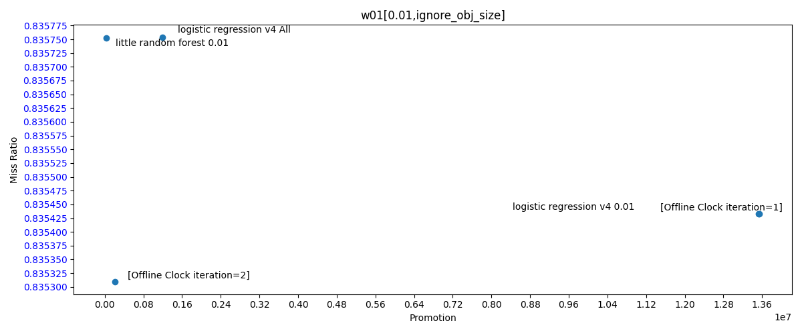  
> **Trace Path**: w01.oracleGeneral.bin.zst  
> **Log Path**: [../result/log/w01[0.01,ignore_obj_size].csv](../result/log/w01[0.01,ignore_obj_size].csv)  
> **Desc**: 0.01,ignore_obj_size  
> **Cache Size**: 1228040  
> **Ignore Obj Size**: 1  
> **Total Request**: 215,796,257  
> **First Promotion**: 13,543,351  
> **Last Promotion**: 188,231  
> **Promotion Reduced**: 13,355,120  

>   
> **Trace Path**: w01.oracleGeneral.bin.zst  
> **Log Path**: [../result/log/w01[0.01,ignore_obj_size,ML,model=logistic_regression_0.01].csv](../result/log/w01[0.01,ignore_obj_size,ML,model=logistic_regression_0.01].csv)  
> **Desc**: 0.01,ignore_obj_size,ML,model=logistic_regression_0.01  
> **Cache Size**: 1228040  
> **Ignore Obj Size**: 1  
> **Total Request**: 215,796,257  
> **First Promotion**: 0  
> **Last Promotion**: 0  
> **Promotion Reduced**: 0  

> 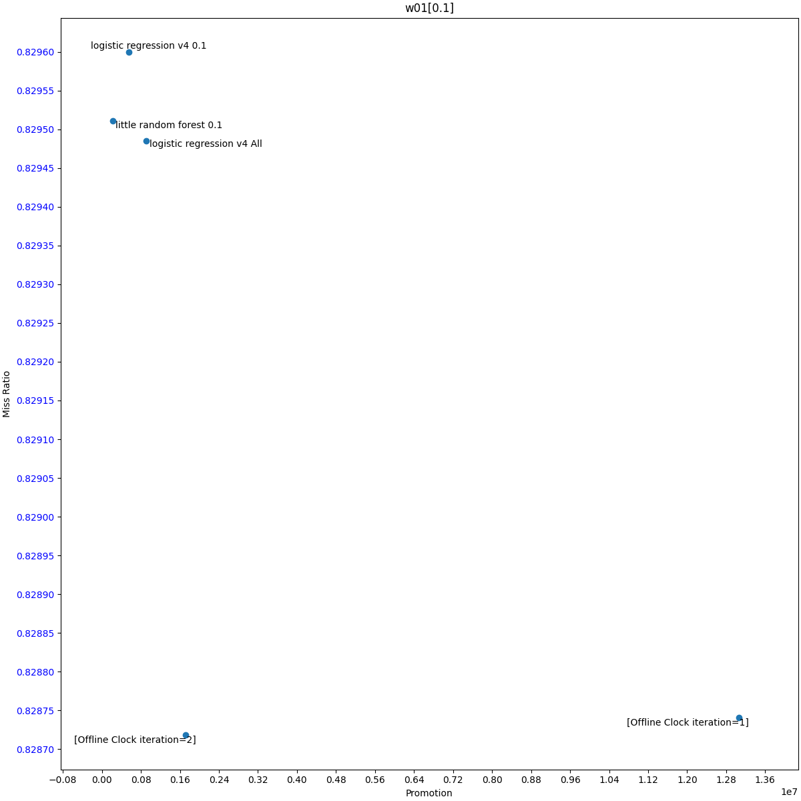  
> **Trace Path**: w01.oracleGeneral.bin.zst  
> **Log Path**: [../result/log/w01[0.1].csv](../result/log/w01[0.1].csv)  
> **Desc**: 0.1  
> **Cache Size**: 65417  
> **Ignore Obj Size**: 0  
> **Total Request**: 215,796,257  
> **First Promotion**: 13,060,808  
> **Last Promotion**: 1,703,809  
> **Promotion Reduced**: 11,356,999  

>   
> **Trace Path**: w01.oracleGeneral.bin.zst  
> **Log Path**: [../result/log/w01[0.1,ML,model=logistic_regression_0.1].csv](../result/log/w01[0.1,ML,model=logistic_regression_0.1].csv)  
> **Desc**: 0.1,ML,model=logistic_regression_0.1  
> **Cache Size**: 65417  
> **Ignore Obj Size**: 0  
> **Total Request**: 215,796,257  
> **First Promotion**: 0  
> **Last Promotion**: 0  
> **Promotion Reduced**: 0  

> 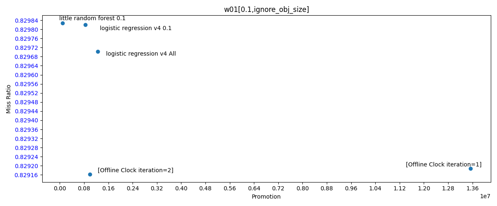  
> **Trace Path**: w01.oracleGeneral.bin.zst  
> **Log Path**: [../result/log/w01[0.1,ignore_obj_size].csv](../result/log/w01[0.1,ignore_obj_size].csv)  
> **Desc**: 0.1,ignore_obj_size  
> **Cache Size**: 12280402  
> **Ignore Obj Size**: 1  
> **Total Request**: 215,796,257  
> **First Promotion**: 13,533,771  
> **Last Promotion**: 969,652  
> **Promotion Reduced**: 12,564,119  

>   
> **Trace Path**: w01.oracleGeneral.bin.zst  
> **Log Path**: [../result/log/w01[0.1,ignore_obj_size,ML,model=logistic_regression_0.1].csv](../result/log/w01[0.1,ignore_obj_size,ML,model=logistic_regression_0.1].csv)  
> **Desc**: 0.1,ignore_obj_size,ML,model=logistic_regression_0.1  
> **Cache Size**: 12280402  
> **Ignore Obj Size**: 1  
> **Total Request**: 215,796,257  
> **First Promotion**: 141  
> **Last Promotion**: 141  
> **Promotion Reduced**: 0  

> 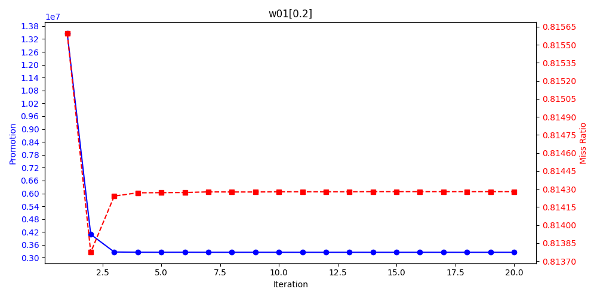  
> **Trace Path**: w01.oracleGeneral.bin.zst  
> **Log Path**: [../result/log/w01[0.2].csv](../result/log/w01[0.2].csv)  
> **Desc**: 0.2  
> **Cache Size**: 130835  
> **Ignore Obj Size**: 0  
> **Total Request**: 215,796,257  
> **First Promotion**: 13,471,298  
> **Last Promotion**: 3,353,673  
> **Promotion Reduced**: 10,117,625  

>   
> **Trace Path**: w01.oracleGeneral.bin.zst  
> **Log Path**: [../result/log/w01[0.2,ML,model=logistic_regression_0.2].csv](../result/log/w01[0.2,ML,model=logistic_regression_0.2].csv)  
> **Desc**: 0.2,ML,model=logistic_regression_0.2  
> **Cache Size**: 130835  
> **Ignore Obj Size**: 0  
> **Total Request**: 215,796,257  
> **First Promotion**: 13,471,298  
> **Last Promotion**: 13,471,298  
> **Promotion Reduced**: 0  

>   
> **Trace Path**: w01.oracleGeneral.bin.zst  
> **Log Path**: [../result/log/w01[0.2,ignore_obj_size].csv](../result/log/w01[0.2,ignore_obj_size].csv)  
> **Desc**: 0.2,ignore_obj_size  
> **Cache Size**: 24560804  
> **Ignore Obj Size**: 1  
> **Total Request**: 215,796,257  
> **First Promotion**: 14,635,242  
> **Last Promotion**: 3,773,947  
> **Promotion Reduced**: 10,861,295  

>   
> **Trace Path**: w01.oracleGeneral.bin.zst  
> **Log Path**: [../result/log/w01[0.2,ignore_obj_size,ML,model=logistic_regression_0.2].csv](../result/log/w01[0.2,ignore_obj_size,ML,model=logistic_regression_0.2].csv)  
> **Desc**: 0.2,ignore_obj_size,ML,model=logistic_regression_0.2  
> **Cache Size**: 24560804  
> **Ignore Obj Size**: 1  
> **Total Request**: 215,796,257  
> **First Promotion**: 198,123  
> **Last Promotion**: 198,123  
> **Promotion Reduced**: 0  

> 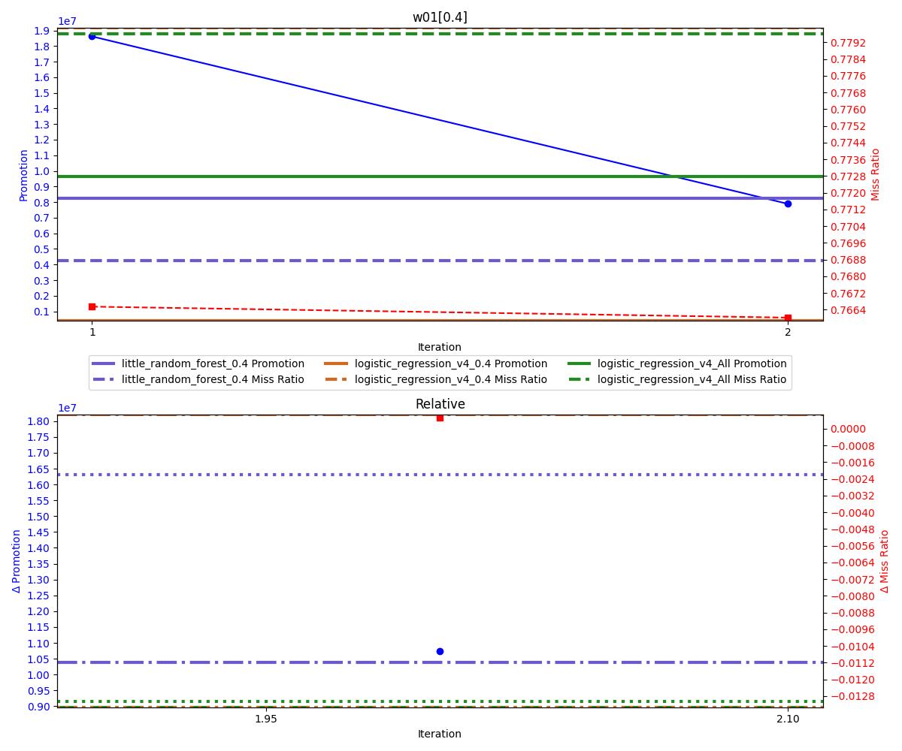  
> **Trace Path**: w01.oracleGeneral.bin.zst  
> **Log Path**: [../result/log/w01[0.4].csv](../result/log/w01[0.4].csv)  
> **Desc**: 0.4  
> **Cache Size**: 261670  
> **Ignore Obj Size**: 0  
> **Total Request**: 215,796,257  
> **First Promotion**: 18,615,984  
> **Last Promotion**: 7,783,202  
> **Promotion Reduced**: 10,832,782  

>   
> **Trace Path**: w01.oracleGeneral.bin.zst  
> **Log Path**: [../result/log/w01[0.4,ML,model=logistic_regression_0.4].csv](../result/log/w01[0.4,ML,model=logistic_regression_0.4].csv)  
> **Desc**: 0.4,ML,model=logistic_regression_0.4  
> **Cache Size**: 261670  
> **Ignore Obj Size**: 0  
> **Total Request**: 215,796,257  
> **First Promotion**: 18,615,984  
> **Last Promotion**: 18,615,984  
> **Promotion Reduced**: 0  

> 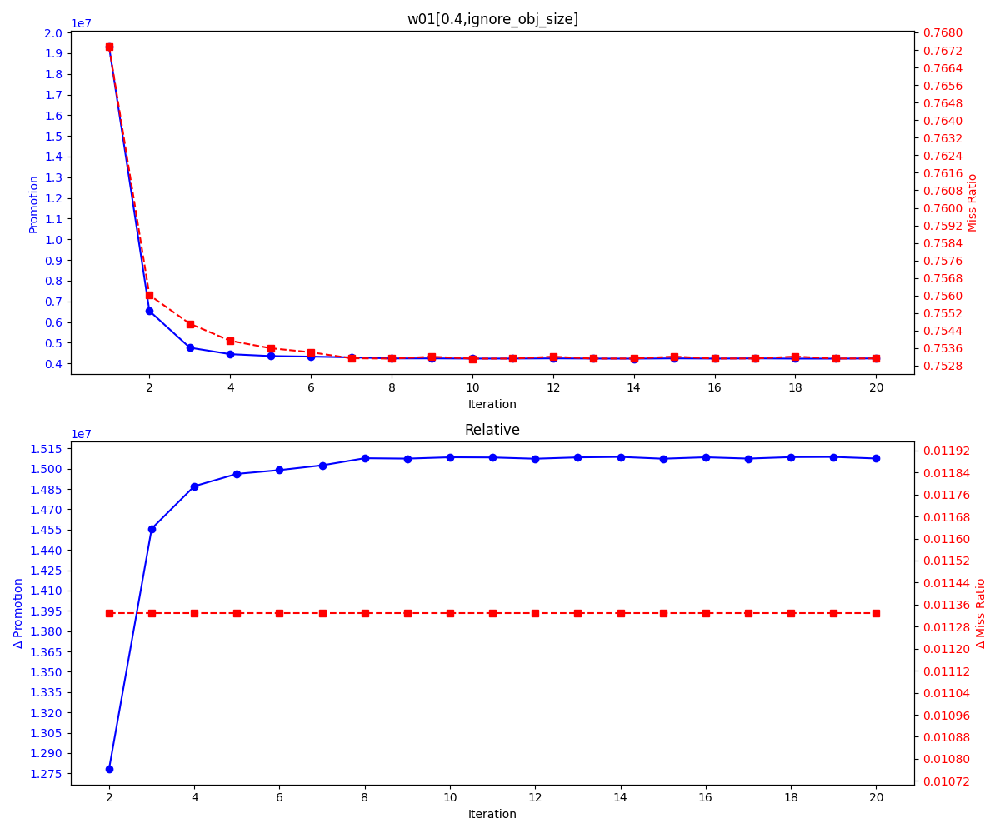  
> **Trace Path**: w01.oracleGeneral.bin.zst  
> **Log Path**: [../result/log/w01[0.4,ignore_obj_size].csv](../result/log/w01[0.4,ignore_obj_size].csv)  
> **Desc**: 0.4,ignore_obj_size  
> **Cache Size**: 49121608  
> **Ignore Obj Size**: 1  
> **Total Request**: 215,796,257  
> **First Promotion**: 19,314,937  
> **Last Promotion**: 3,898,877  
> **Promotion Reduced**: 15,416,060  

>   
> **Trace Path**: w01.oracleGeneral.bin.zst  
> **Log Path**: [../result/log/w01[0.4,ignore_obj_size,ML,model=logistic_regression_0.4].csv](../result/log/w01[0.4,ignore_obj_size,ML,model=logistic_regression_0.4].csv)  
> **Desc**: 0.4,ignore_obj_size,ML,model=logistic_regression_0.4  
> **Cache Size**: 49121608  
> **Ignore Obj Size**: 1  
> **Total Request**: 215,796,257  
> **First Promotion**: 29,550  
> **Last Promotion**: 29,550  
> **Promotion Reduced**: 0  

## wiki_2019t https://ftp.pdl.cmu.edu/pub/datasets/twemcacheWorkload/cacheDatasets/wiki/wiki_2019t.oracleGeneral.zst
> 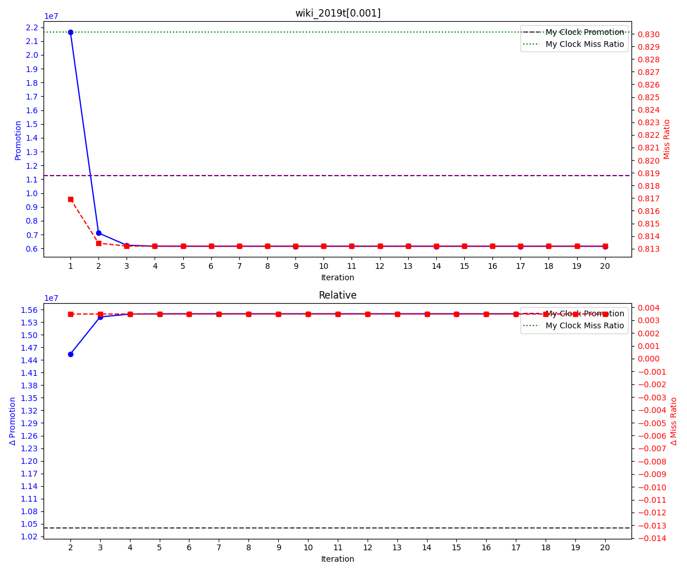  
> **Trace Path**: wiki_2019t.oracleGeneral.zst  
> **Log Path**: [../result/log/wiki_2019t[0.001].csv](../result/log/wiki_2019t[0.001].csv)  
> **Desc**: 0.001  
> **Cache Size**: 409  
> **Ignore Obj Size**: 0  
> **Total Request**: 207,646,002  
> **First Promotion**: 21,651,311  
> **Last Promotion**: 6,153,053  
> **Promotion Reduced**: 15,498,258  

>   
> **Trace Path**: wiki_2019t.oracleGeneral.zst  
> **Log Path**: [../result/log/wiki_2019t[0.001,ML,model=logistic_regression_0.001].csv](../result/log/wiki_2019t[0.001,ML,model=logistic_regression_0.001].csv)  
> **Desc**: 0.001,ML,model=logistic_regression_0.001  
> **Cache Size**: 409  
> **Ignore Obj Size**: 0  
> **Total Request**: 207,646,002  
> **First Promotion**: 0  
> **Last Promotion**: 0  
> **Promotion Reduced**: 0  

> 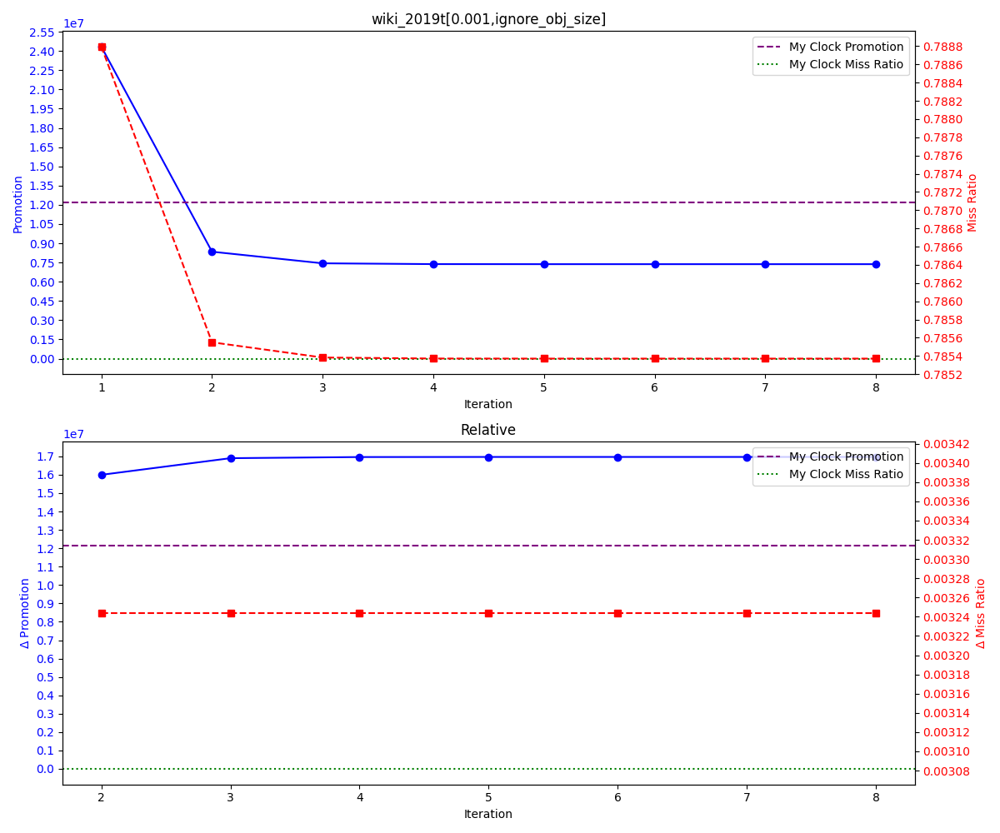  
> **Trace Path**: wiki_2019t.oracleGeneral.zst  
> **Log Path**: [../result/log/wiki_2019t[0.001,ignore_obj_size].csv](../result/log/wiki_2019t[0.001,ignore_obj_size].csv)  
> **Desc**: 0.001,ignore_obj_size  
> **Cache Size**: 18377  
> **Ignore Obj Size**: 1  
> **Total Request**: 207,646,002  
> **First Promotion**: 24,335,745  
> **Last Promotion**: 7,367,947  
> **Promotion Reduced**: 16,967,798  

>   
> **Trace Path**: wiki_2019t.oracleGeneral.zst  
> **Log Path**: [../result/log/wiki_2019t[0.001,ignore_obj_size,ML,model=logistic_regression_0.001].csv](../result/log/wiki_2019t[0.001,ignore_obj_size,ML,model=logistic_regression_0.001].csv)  
> **Desc**: 0.001,ignore_obj_size,ML,model=logistic_regression_0.001  
> **Cache Size**: 18377  
> **Ignore Obj Size**: 1  
> **Total Request**: 207,646,002  
> **First Promotion**: 0  
> **Last Promotion**: 0  
> **Promotion Reduced**: 0  

> 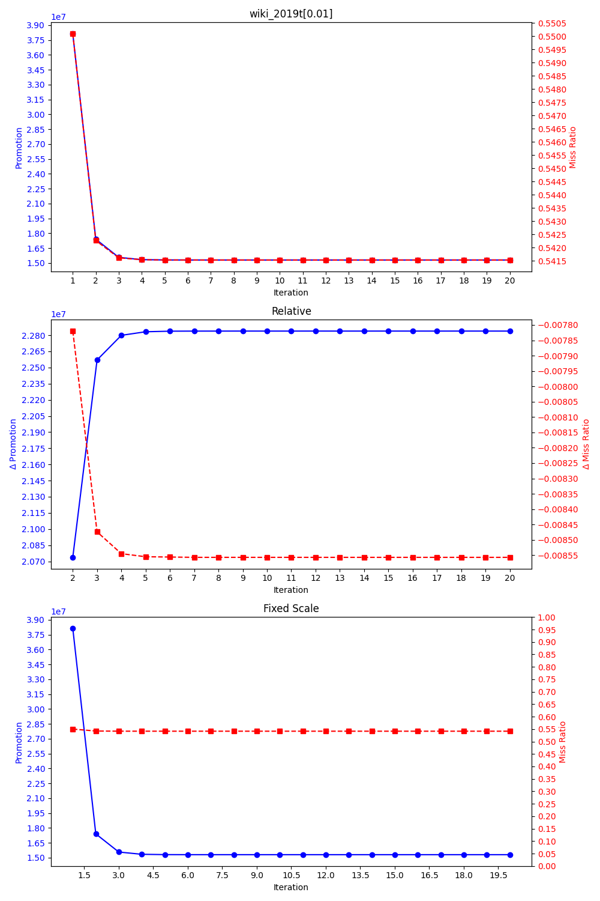  
> **Trace Path**: wiki_2019t.oracleGeneral.zst  
> **Log Path**: [../result/log/wiki_2019t[0.01].csv](../result/log/wiki_2019t[0.01].csv)  
> **Desc**: 0.01  
> **Cache Size**: 4094  
> **Ignore Obj Size**: 0  
> **Total Request**: 207,646,002  
> **First Promotion**: 38,136,381  
> **Last Promotion**: 15,288,633  
> **Promotion Reduced**: 22,847,748  

>   
> **Trace Path**: wiki_2019t.oracleGeneral.zst  
> **Log Path**: [../result/log/wiki_2019t[0.01,ML,model=logistic_regression_0.01].csv](../result/log/wiki_2019t[0.01,ML,model=logistic_regression_0.01].csv)  
> **Desc**: 0.01,ML,model=logistic_regression_0.01  
> **Cache Size**: 4094  
> **Ignore Obj Size**: 0  
> **Total Request**: 207,646,002  
> **First Promotion**: 0  
> **Last Promotion**: 0  
> **Promotion Reduced**: 0  

> 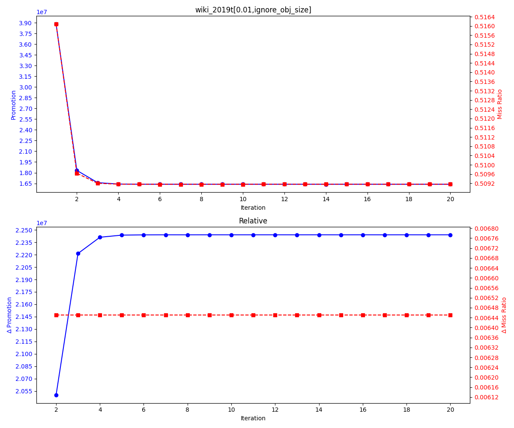  
> **Trace Path**: wiki_2019t.oracleGeneral.zst  
> **Log Path**: [../result/log/wiki_2019t[0.01,ignore_obj_size].csv](../result/log/wiki_2019t[0.01,ignore_obj_size].csv)  
> **Desc**: 0.01,ignore_obj_size  
> **Cache Size**: 183771  
> **Ignore Obj Size**: 1  
> **Total Request**: 207,646,002  
> **First Promotion**: 38,824,361  
> **Last Promotion**: 16,369,147  
> **Promotion Reduced**: 22,455,214  

>   
> **Trace Path**: wiki_2019t.oracleGeneral.zst  
> **Log Path**: [../result/log/wiki_2019t[0.01,ignore_obj_size,ML,model=logistic_regression_0.01].csv](../result/log/wiki_2019t[0.01,ignore_obj_size,ML,model=logistic_regression_0.01].csv)  
> **Desc**: 0.01,ignore_obj_size,ML,model=logistic_regression_0.01  
> **Cache Size**: 183771  
> **Ignore Obj Size**: 1  
> **Total Request**: 207,646,002  
> **First Promotion**: 0  
> **Last Promotion**: 0  
> **Promotion Reduced**: 0  

> 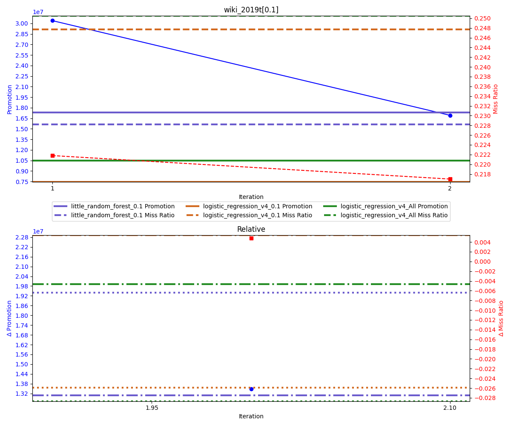  
> **Trace Path**: wiki_2019t.oracleGeneral.zst  
> **Log Path**: [../result/log/wiki_2019t[0.1].csv](../result/log/wiki_2019t[0.1].csv)  
> **Desc**: 0.1  
> **Cache Size**: 40945  
> **Ignore Obj Size**: 0  
> **Total Request**: 207,646,002  
> **First Promotion**: 30,390,321  
> **Last Promotion**: 15,446,990  
> **Promotion Reduced**: 14,943,331  

>   
> **Trace Path**: wiki_2019t.oracleGeneral.zst  
> **Log Path**: [../result/log/wiki_2019t[0.1,ML,model=logistic_regression_0.1].csv](../result/log/wiki_2019t[0.1,ML,model=logistic_regression_0.1].csv)  
> **Desc**: 0.1,ML,model=logistic_regression_0.1  
> **Cache Size**: 40945  
> **Ignore Obj Size**: 0  
> **Total Request**: 207,646,002  
> **First Promotion**: 0  
> **Last Promotion**: 0  
> **Promotion Reduced**: 0  

> 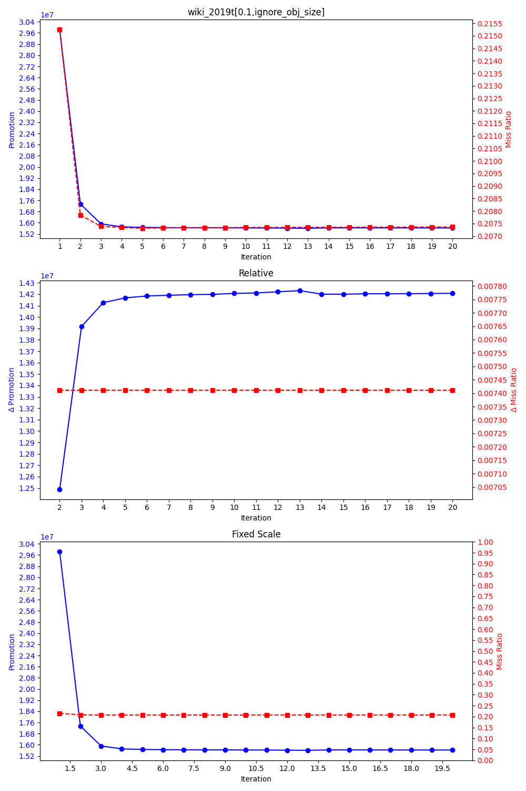  
> **Trace Path**: wiki_2019t.oracleGeneral.zst  
> **Log Path**: [../result/log/wiki_2019t[0.1,ignore_obj_size].csv](../result/log/wiki_2019t[0.1,ignore_obj_size].csv)  
> **Desc**: 0.1,ignore_obj_size  
> **Cache Size**: 1837711  
> **Ignore Obj Size**: 1  
> **Total Request**: 207,646,002  
> **First Promotion**: 29,838,756  
> **Last Promotion**: 15,390,296  
> **Promotion Reduced**: 14,448,460  

>   
> **Trace Path**: wiki_2019t.oracleGeneral.zst  
> **Log Path**: [../result/log/wiki_2019t[0.1,ignore_obj_size,ML,model=logistic_regression_0.1].csv](../result/log/wiki_2019t[0.1,ignore_obj_size,ML,model=logistic_regression_0.1].csv)  
> **Desc**: 0.1,ignore_obj_size,ML,model=logistic_regression_0.1  
> **Cache Size**: 1837711  
> **Ignore Obj Size**: 1  
> **Total Request**: 207,646,002  
> **First Promotion**: 3,556,910  
> **Last Promotion**: 3,556,910  
> **Promotion Reduced**: 0  

> 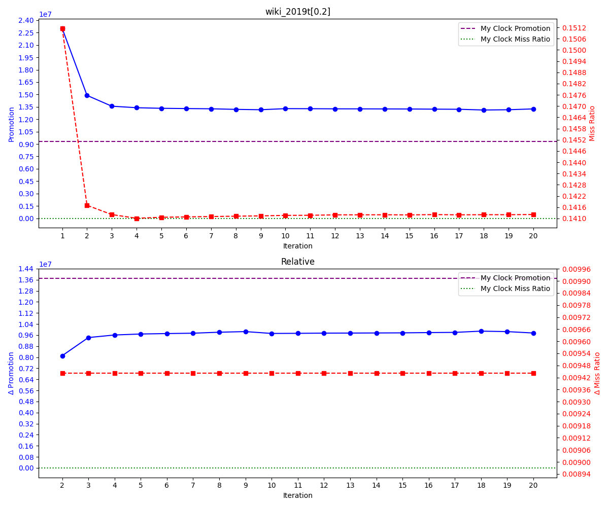  
> **Trace Path**: wiki_2019t.oracleGeneral.zst  
> **Log Path**: [../result/log/wiki_2019t[0.2].csv](../result/log/wiki_2019t[0.2].csv)  
> **Desc**: 0.2  
> **Cache Size**: 81890  
> **Ignore Obj Size**: 0  
> **Total Request**: 207,646,002  
> **First Promotion**: 23,004,908  
> **Last Promotion**: 12,626,963  
> **Promotion Reduced**: 10,377,945  

>   
> **Trace Path**: wiki_2019t.oracleGeneral.zst  
> **Log Path**: [../result/log/wiki_2019t[0.2,ML,model=logistic_regression_0.2].csv](../result/log/wiki_2019t[0.2,ML,model=logistic_regression_0.2].csv)  
> **Desc**: 0.2,ML,model=logistic_regression_0.2  
> **Cache Size**: 81890  
> **Ignore Obj Size**: 0  
> **Total Request**: 207,646,002  
> **First Promotion**: 1,514,077  
> **Last Promotion**: 1,514,077  
> **Promotion Reduced**: 0  

> 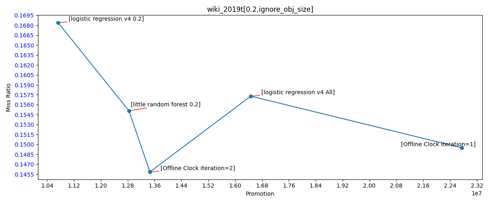  
> **Trace Path**: wiki_2019t.oracleGeneral.zst  
> **Log Path**: [../result/log/wiki_2019t[0.2,ignore_obj_size].csv](../result/log/wiki_2019t[0.2,ignore_obj_size].csv)  
> **Desc**: 0.2,ignore_obj_size  
> **Cache Size**: 3675423  
> **Ignore Obj Size**: 1  
> **Total Request**: 207,646,002  
> **First Promotion**: 22,753,959  
> **Last Promotion**: 12,567,685  
> **Promotion Reduced**: 10,186,274  

>   
> **Trace Path**: wiki_2019t.oracleGeneral.zst  
> **Log Path**: [../result/log/wiki_2019t[0.2,ignore_obj_size,ML,model=logistic_regression_0.2].csv](../result/log/wiki_2019t[0.2,ignore_obj_size,ML,model=logistic_regression_0.2].csv)  
> **Desc**: 0.2,ignore_obj_size,ML,model=logistic_regression_0.2  
> **Cache Size**: 3675423  
> **Ignore Obj Size**: 1  
> **Total Request**: 207,646,002  
> **First Promotion**: 17,949,860  
> **Last Promotion**: 17,949,860  
> **Promotion Reduced**: 0  

> 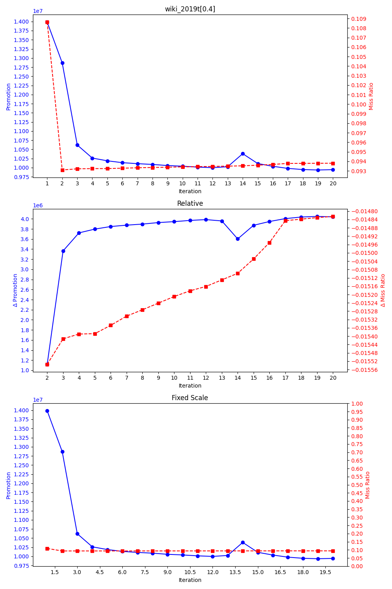  
> **Trace Path**: wiki_2019t.oracleGeneral.zst  
> **Log Path**: [../result/log/wiki_2019t[0.4].csv](../result/log/wiki_2019t[0.4].csv)  
> **Desc**: 0.4  
> **Cache Size**: 163780  
> **Ignore Obj Size**: 0  
> **Total Request**: 207,646,002  
> **First Promotion**: 13,984,564  
> **Last Promotion**: 9,096,683  
> **Promotion Reduced**: 4,887,881  

>   
> **Trace Path**: wiki_2019t.oracleGeneral.zst  
> **Log Path**: [../result/log/wiki_2019t[0.4,ML,model=logistic_regression_0.4].csv](../result/log/wiki_2019t[0.4,ML,model=logistic_regression_0.4].csv)  
> **Desc**: 0.4,ML,model=logistic_regression_0.4  
> **Cache Size**: 163780  
> **Ignore Obj Size**: 0  
> **Total Request**: 207,646,002  
> **First Promotion**: 12,195,295  
> **Last Promotion**: 12,195,295  
> **Promotion Reduced**: 0  

> 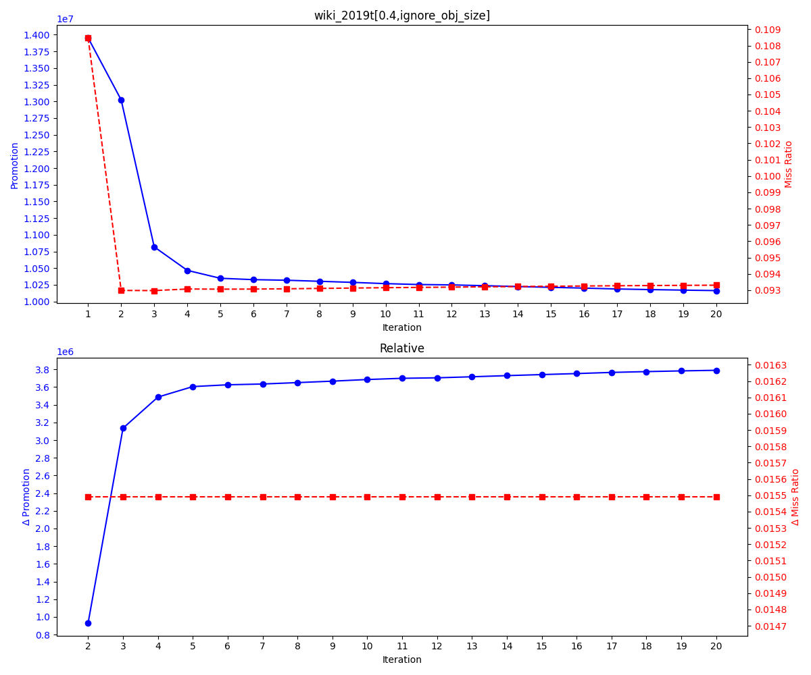  
> **Trace Path**: wiki_2019t.oracleGeneral.zst  
> **Log Path**: [../result/log/wiki_2019t[0.4,ignore_obj_size].csv](../result/log/wiki_2019t[0.4,ignore_obj_size].csv)  
> **Desc**: 0.4,ignore_obj_size  
> **Cache Size**: 7350846  
> **Ignore Obj Size**: 1  
> **Total Request**: 207,646,002  
> **First Promotion**: 13,953,755  
> **Last Promotion**: 9,261,413  
> **Promotion Reduced**: 4,692,342  

>   
> **Trace Path**: wiki_2019t.oracleGeneral.zst  
> **Log Path**: [../result/log/wiki_2019t[0.4,ignore_obj_size,ML,model=logistic_regression_0.4].csv](../result/log/wiki_2019t[0.4,ignore_obj_size,ML,model=logistic_regression_0.4].csv)  
> **Desc**: 0.4,ignore_obj_size,ML,model=logistic_regression_0.4  
> **Cache Size**: 7350846  
> **Ignore Obj Size**: 1  
> **Total Request**: 207,646,002  
> **First Promotion**: 12,699,453  
> **Last Promotion**: 12,699,453  
> **Promotion Reduced**: 0  

