# RESULT
# [Box Plot](./overall/README.md)
# [Box Plot (obj_size_ignored)](./overall/README_obj_size_ignored.md)
# Line Plot
## 1351 https://ftp.pdl.cmu.edu/pub/datasets/twemcacheWorkload/cacheDatasets/tencentBlock/v2/traces/1351.oracleGeneral.zst
>   
> **Trace Path**: 1351.oracleGeneral.zst  
> **Desc**: 0.001  
> **Cache Size**: 191  
> **Ignore Obj Size**: 0  
> **Total Request**: 195,824,302  
> **First Promotion**: 2,710,642  
> **Last Promotion**: 370,293  
> **Promotion Reduced**: 2,340,349  

>   
> **Trace Path**: 1351.oracleGeneral.zst  
> **Desc**: 0.001,ignore_obj_size  
> **Cache Size**: 1496  
> **Ignore Obj Size**: 1  
> **Total Request**: 195,824,302  
> **First Promotion**: 6,211,795  
> **Last Promotion**: 3,876,167  
> **Promotion Reduced**: 2,335,628  

>   
> **Trace Path**: 1351.oracleGeneral.zst  
> **Desc**: 0.01  
> **Cache Size**: 1911  
> **Ignore Obj Size**: 0  
> **Total Request**: 195,824,302  
> **First Promotion**: 40,359,057  
> **Last Promotion**: 15,667,572  
> **Promotion Reduced**: 24,691,485  

>   
> **Trace Path**: 1351.oracleGeneral.zst  
> **Desc**: 0.01,ignore_obj_size  
> **Cache Size**: 14965  
> **Ignore Obj Size**: 1  
> **Total Request**: 195,824,302  
> **First Promotion**: 23,088,035  
> **Last Promotion**: 7,661,064  
> **Promotion Reduced**: 15,426,971  

>   
> **Trace Path**: 1351.oracleGeneral.zst  
> **Desc**: 0.1  
> **Cache Size**: 19112  
> **Ignore Obj Size**: 0  
> **Total Request**: 195,824,302  
> **First Promotion**: 51,806,832  
> **Last Promotion**: 22,742,187  
> **Promotion Reduced**: 29,064,645  

>   
> **Trace Path**: 1351.oracleGeneral.zst  
> **Desc**: 0.1,ignore_obj_size  
> **Cache Size**: 149651  
> **Ignore Obj Size**: 1  
> **Total Request**: 195,824,302  
> **First Promotion**: 38,258,757  
> **Last Promotion**: 15,300,597  
> **Promotion Reduced**: 22,958,160  

>   
> **Trace Path**: 1351.oracleGeneral.zst  
> **Desc**: 0.2  
> **Cache Size**: 38224  
> **Ignore Obj Size**: 0  
> **Total Request**: 195,824,302  
> **First Promotion**: 18,710,365  
> **Last Promotion**: 10,776,585  
> **Promotion Reduced**: 7,933,780  

>   
> **Trace Path**: 1351.oracleGeneral.zst  
> **Desc**: 0.2,ignore_obj_size  
> **Cache Size**: 299303  
> **Ignore Obj Size**: 1  
> **Total Request**: 195,824,302  
> **First Promotion**: 49,001,348  
> **Last Promotion**: 21,010,296  
> **Promotion Reduced**: 27,991,052  

>   
> **Trace Path**: 1351.oracleGeneral.zst  
> **Desc**: 0.4  
> **Cache Size**: 76449  
> **Ignore Obj Size**: 0  
> **Total Request**: 195,824,302  
> **First Promotion**: 5,728,417  
> **Last Promotion**: 3,290,859  
> **Promotion Reduced**: 2,437,558  

>   
> **Trace Path**: 1351.oracleGeneral.zst  
> **Desc**: 0.4,ignore_obj_size  
> **Cache Size**: 598606  
> **Ignore Obj Size**: 1  
> **Total Request**: 195,824,302  
> **First Promotion**: 15,794,569  
> **Last Promotion**: 9,478,217  
> **Promotion Reduced**: 6,316,352  

## 2016_LUN1 https://ftp.pdl.cmu.edu/pub/datasets/twemcacheWorkload/cacheDatasets/systor/2016_LUN1.oracleGeneral.zst
>   
> **Trace Path**: 2016_LUN1.oracleGeneral.zst  
> **Desc**: 0.001  
> **Cache Size**: 2287  
> **Ignore Obj Size**: 0  
> **Total Request**: 492,030,661  
> **First Promotion**: 36,165,297  
> **Last Promotion**: 10,830,932  
> **Promotion Reduced**: 25,334,365  

>   
> **Trace Path**: 2016_LUN1.oracleGeneral.zst  
> **Desc**: 0.001,ignore_obj_size  
> **Cache Size**: 60241  
> **Ignore Obj Size**: 1  
> **Total Request**: 492,030,661  
> **First Promotion**: 37,197,962  
> **Last Promotion**: 12,127,617  
> **Promotion Reduced**: 25,070,345  

>   
> **Trace Path**: 2016_LUN1.oracleGeneral.zst  
> **Desc**: 0.01  
> **Cache Size**: 22876  
> **Ignore Obj Size**: 0  
> **Total Request**: 492,030,661  
> **First Promotion**: 47,432,356  
> **Last Promotion**: 12,375,484  
> **Promotion Reduced**: 35,056,872  

>   
> **Trace Path**: 2016_LUN1.oracleGeneral.zst  
> **Desc**: 0.01,ignore_obj_size  
> **Cache Size**: 602419  
> **Ignore Obj Size**: 1  
> **Total Request**: 492,030,661  
> **First Promotion**: 44,445,347  
> **Last Promotion**: 10,815,119  
> **Promotion Reduced**: 33,630,228  

>   
> **Trace Path**: 2016_LUN1.oracleGeneral.zst  
> **Desc**: 0.1  
> **Cache Size**: 228766  
> **Ignore Obj Size**: 0  
> **Total Request**: 492,030,661  
> **First Promotion**: 91,323,446  
> **Last Promotion**: 40,980,531  
> **Promotion Reduced**: 50,342,915  

>   
> **Trace Path**: 2016_LUN1.oracleGeneral.zst  
> **Desc**: 0.1,ignore_obj_size  
> **Cache Size**: 6024191  
> **Ignore Obj Size**: 1  
> **Total Request**: 492,030,661  
> **First Promotion**: 91,470,796  
> **Last Promotion**: 40,385,994  
> **Promotion Reduced**: 51,084,802  

>   
> **Trace Path**: 2016_LUN1.oracleGeneral.zst  
> **Desc**: 0.2  
> **Cache Size**: 457532  
> **Ignore Obj Size**: 0  
> **Total Request**: 492,030,661  
> **First Promotion**: 111,167,120  
> **Last Promotion**: 65,063,839  
> **Promotion Reduced**: 46,103,281  

>   
> **Trace Path**: 2016_LUN1.oracleGeneral.zst  
> **Desc**: 0.2,ignore_obj_size  
> **Cache Size**: 12048382  
> **Ignore Obj Size**: 1  
> **Total Request**: 492,030,661  
> **First Promotion**: 114,666,585  
> **Last Promotion**: 64,247,742  
> **Promotion Reduced**: 50,418,843  

>   
> **Trace Path**: 2016_LUN1.oracleGeneral.zst  
> **Desc**: 0.4  
> **Cache Size**: 915064  
> **Ignore Obj Size**: 0  
> **Total Request**: 492,030,661  
> **First Promotion**: 59,773,712  
> **Last Promotion**: 41,153,782  
> **Promotion Reduced**: 18,619,930  

>   
> **Trace Path**: 2016_LUN1.oracleGeneral.zst  
> **Desc**: 0.4,ignore_obj_size  
> **Cache Size**: 24096764  
> **Ignore Obj Size**: 1  
> **Total Request**: 492,030,661  
> **First Promotion**: 61,435,620  
> **Last Promotion**: 40,928,407  
> **Promotion Reduced**: 20,507,213  

## 7 https://ftp.pdl.cmu.edu/pub/datasets/twemcacheWorkload/cacheDatasets/alibabaBlock/v2/7.oracleGeneral.zst
>   
> **Trace Path**: 7.oracleGeneral.zst  
> **Desc**: 0.001  
> **Cache Size**: 131  
> **Ignore Obj Size**: 0  
> **Total Request**: 265,694,431  
> **First Promotion**: 23,868,697  
> **Last Promotion**: 8,269,705  
> **Promotion Reduced**: 15,598,992  

>   
> **Trace Path**: 7.oracleGeneral.zst  
> **Desc**: 0.001,ignore_obj_size  
> **Cache Size**: 4808  
> **Ignore Obj Size**: 1  
> **Total Request**: 265,694,431  
> **First Promotion**: 30,582,135  
> **Last Promotion**: 12,928,990  
> **Promotion Reduced**: 17,653,145  

>   
> **Trace Path**: 7.oracleGeneral.zst  
> **Desc**: 0.01  
> **Cache Size**: 1314  
> **Ignore Obj Size**: 0  
> **Total Request**: 265,694,431  
> **First Promotion**: 20,065,703  
> **Last Promotion**: 2,603,128  
> **Promotion Reduced**: 17,462,575  

>   
> **Trace Path**: 7.oracleGeneral.zst  
> **Desc**: 0.01,ignore_obj_size  
> **Cache Size**: 48085  
> **Ignore Obj Size**: 1  
> **Total Request**: 265,694,431  
> **First Promotion**: 16,701,078  
> **Last Promotion**: 3,189,325  
> **Promotion Reduced**: 13,511,753  

>   
> **Trace Path**: 7.oracleGeneral.zst  
> **Desc**: 0.1  
> **Cache Size**: 13148  
> **Ignore Obj Size**: 0  
> **Total Request**: 265,694,431  
> **First Promotion**: 30,978,318  
> **Last Promotion**: 12,833,402  
> **Promotion Reduced**: 18,144,916  

>   
> **Trace Path**: 7.oracleGeneral.zst  
> **Desc**: 0.1,ignore_obj_size  
> **Cache Size**: 480854  
> **Ignore Obj Size**: 1  
> **Total Request**: 265,694,431  
> **First Promotion**: 32,990,862  
> **Last Promotion**: 8,634,017  
> **Promotion Reduced**: 24,356,845  

>   
> **Trace Path**: 7.oracleGeneral.zst  
> **Desc**: 0.2  
> **Cache Size**: 26296  
> **Ignore Obj Size**: 0  
> **Total Request**: 265,694,431  
> **First Promotion**: 20,250,750  
> **Last Promotion**: 9,401,162  
> **Promotion Reduced**: 10,849,588  

>   
> **Trace Path**: 7.oracleGeneral.zst  
> **Desc**: 0.2,ignore_obj_size  
> **Cache Size**: 961708  
> **Ignore Obj Size**: 1  
> **Total Request**: 265,694,431  
> **First Promotion**: 35,298,006  
> **Last Promotion**: 12,731,895  
> **Promotion Reduced**: 22,566,111  

>   
> **Trace Path**: 7.oracleGeneral.zst  
> **Desc**: 0.4  
> **Cache Size**: 52593  
> **Ignore Obj Size**: 0  
> **Total Request**: 265,694,431  
> **First Promotion**: 10,566,667  
> **Last Promotion**: 6,928,054  
> **Promotion Reduced**: 3,638,613  

>   
> **Trace Path**: 7.oracleGeneral.zst  
> **Desc**: 0.4,ignore_obj_size  
> **Cache Size**: 1923416  
> **Ignore Obj Size**: 1  
> **Total Request**: 265,694,431  
> **First Promotion**: 18,359,000  
> **Last Promotion**: 7,964,227  
> **Promotion Reduced**: 10,394,773  

## block_traces_5 https://ftp.pdl.cmu.edu/pub/datasets/twemcacheWorkload/cacheDatasets/metaStorage/block_traces_5.oracleGeneral.bin.zst
>   
> **Trace Path**: block_traces_5.oracleGeneral.bin.zst  
> **Desc**: 0.001  
> **Cache Size**: 31349  
> **Ignore Obj Size**: 0  
> **Total Request**: 14,556,172  
> **First Promotion**: 2,799,029  
> **Last Promotion**: 66,780  
> **Promotion Reduced**: 2,732,249  

>   
> **Trace Path**: block_traces_5.oracleGeneral.bin.zst  
> **Desc**: 0.001,ignore_obj_size  
> **Cache Size**: 7110  
> **Ignore Obj Size**: 1  
> **Total Request**: 14,556,172  
> **First Promotion**: 2,800,236  
> **Last Promotion**: 64,393  
> **Promotion Reduced**: 2,735,843  

>   
> **Trace Path**: block_traces_5.oracleGeneral.bin.zst  
> **Desc**: 0.01  
> **Cache Size**: 313497  
> **Ignore Obj Size**: 0  
> **Total Request**: 14,556,172  
> **First Promotion**: 2,804,423  
> **Last Promotion**: 21,437  
> **Promotion Reduced**: 2,782,986  

>   
> **Trace Path**: block_traces_5.oracleGeneral.bin.zst  
> **Desc**: 0.01,ignore_obj_size  
> **Cache Size**: 71104  
> **Ignore Obj Size**: 1  
> **Total Request**: 14,556,172  
> **First Promotion**: 2,803,707  
> **Last Promotion**: 21,741  
> **Promotion Reduced**: 2,781,966  

>   
> **Trace Path**: block_traces_5.oracleGeneral.bin.zst  
> **Desc**: 0.1  
> **Cache Size**: 3134978  
> **Ignore Obj Size**: 0  
> **Total Request**: 14,556,172  
> **First Promotion**: 2,638,329  
> **Last Promotion**: 210,202  
> **Promotion Reduced**: 2,428,127  

>   
> **Trace Path**: block_traces_5.oracleGeneral.bin.zst  
> **Desc**: 0.1,ignore_obj_size  
> **Cache Size**: 711041  
> **Ignore Obj Size**: 1  
> **Total Request**: 14,556,172  
> **First Promotion**: 2,638,446  
> **Last Promotion**: 216,373  
> **Promotion Reduced**: 2,422,073  

>   
> **Trace Path**: block_traces_5.oracleGeneral.bin.zst  
> **Desc**: 0.2  
> **Cache Size**: 6269957  
> **Ignore Obj Size**: 0  
> **Total Request**: 14,556,172  
> **First Promotion**: 2,434,210  
> **Last Promotion**: 403,361  
> **Promotion Reduced**: 2,030,849  

>   
> **Trace Path**: block_traces_5.oracleGeneral.bin.zst  
> **Desc**: 0.2,ignore_obj_size  
> **Cache Size**: 1422082  
> **Ignore Obj Size**: 1  
> **Total Request**: 14,556,172  
> **First Promotion**: 2,423,091  
> **Last Promotion**: 421,262  
> **Promotion Reduced**: 2,001,829  

>   
> **Trace Path**: block_traces_5.oracleGeneral.bin.zst  
> **Desc**: 0.4  
> **Cache Size**: 12539914  
> **Ignore Obj Size**: 0  
> **Total Request**: 14,556,172  
> **First Promotion**: 2,001,105  
> **Last Promotion**: 748,099  
> **Promotion Reduced**: 1,253,006  

>   
> **Trace Path**: block_traces_5.oracleGeneral.bin.zst  
> **Desc**: 0.4,ignore_obj_size  
> **Cache Size**: 2844165  
> **Ignore Obj Size**: 1  
> **Total Request**: 14,556,172  
> **First Promotion**: 1,965,400  
> **Last Promotion**: 715,566  
> **Promotion Reduced**: 1,249,834  

## cluster50 https://ftp.pdl.cmu.edu/pub/datasets/twemcacheWorkload/cacheDatasets/twitter/cluster50.oracleGeneral.zst
>   
> **Trace Path**: cluster50.oracleGeneral.zst  
> **Desc**: 0.001  
> **Cache Size**: 41  
> **Ignore Obj Size**: 0  
> **Total Request**: 139,655,585  
> **First Promotion**: 37,725,637  
> **Last Promotion**: 109,941  
> **Promotion Reduced**: 37,615,696  

>   
> **Trace Path**: cluster50.oracleGeneral.zst  
> **Desc**: 0.001,ignore_obj_size  
> **Cache Size**: 2660  
> **Ignore Obj Size**: 1  
> **Total Request**: 139,655,585  
> **First Promotion**: 37,749,952  
> **Last Promotion**: 107,193  
> **Promotion Reduced**: 37,642,759  

>   
> **Trace Path**: cluster50.oracleGeneral.zst  
> **Desc**: 0.01  
> **Cache Size**: 413  
> **Ignore Obj Size**: 0  
> **Total Request**: 139,655,585  
> **First Promotion**: 49,659,077  
> **Last Promotion**: 8,628,093  
> **Promotion Reduced**: 41,030,984  

>   
> **Trace Path**: cluster50.oracleGeneral.zst  
> **Desc**: 0.01,ignore_obj_size  
> **Cache Size**: 26609  
> **Ignore Obj Size**: 1  
> **Total Request**: 139,655,585  
> **First Promotion**: 49,958,216  
> **Last Promotion**: 7,135,382  
> **Promotion Reduced**: 42,822,834  

>   
> **Trace Path**: cluster50.oracleGeneral.zst  
> **Desc**: 0.1  
> **Cache Size**: 4133  
> **Ignore Obj Size**: 0  
> **Total Request**: 139,655,585  
> **First Promotion**: 37,945,441  
> **Last Promotion**: 8,393,653  
> **Promotion Reduced**: 29,551,788  

>   
> **Trace Path**: cluster50.oracleGeneral.zst  
> **Desc**: 0.1,ignore_obj_size  
> **Cache Size**: 266098  
> **Ignore Obj Size**: 1  
> **Total Request**: 139,655,585  
> **First Promotion**: 36,062,844  
> **Last Promotion**: 6,501,289  
> **Promotion Reduced**: 29,561,555  

>   
> **Trace Path**: cluster50.oracleGeneral.zst  
> **Desc**: 0.2  
> **Cache Size**: 8267  
> **Ignore Obj Size**: 0  
> **Total Request**: 139,655,585  
> **First Promotion**: 26,127,970  
> **Last Promotion**: 6,172,057  
> **Promotion Reduced**: 19,955,913  

>   
> **Trace Path**: cluster50.oracleGeneral.zst  
> **Desc**: 0.2,ignore_obj_size  
> **Cache Size**: 532197  
> **Ignore Obj Size**: 1  
> **Total Request**: 139,655,585  
> **First Promotion**: 24,628,231  
> **Last Promotion**: 5,461,746  
> **Promotion Reduced**: 19,166,485  

>   
> **Trace Path**: cluster50.oracleGeneral.zst  
> **Desc**: 0.4  
> **Cache Size**: 16535  
> **Ignore Obj Size**: 0  
> **Total Request**: 139,655,585  
> **First Promotion**: 17,130,495  
> **Last Promotion**: 5,318,643  
> **Promotion Reduced**: 11,811,852  

>   
> **Trace Path**: cluster50.oracleGeneral.zst  
> **Desc**: 0.4,ignore_obj_size  
> **Cache Size**: 1064395  
> **Ignore Obj Size**: 1  
> **Total Request**: 139,655,585  
> **First Promotion**: 15,789,065  
> **Last Promotion**: 4,865,015  
> **Promotion Reduced**: 10,924,050  

## fiu_cheetah.cs.fiu.edu-110108-113008 https://ftp.pdl.cmu.edu/pub/datasets/twemcacheWorkload/cacheDatasets/fiu/fiu_cheetah.cs.fiu.edu-110108-113008.oracleGeneral.zst
>   
> **Trace Path**: fiu_cheetah.cs.fiu.edu-110108-113008.oracleGeneral.zst  
> **Desc**: 0.001  
> **Cache Size**: 58  
> **Ignore Obj Size**: 0  
> **Total Request**: 442,393,092  
> **First Promotion**: 21,117,805  
> **Last Promotion**: 716,982  
> **Promotion Reduced**: 20,400,823  

>   
> **Trace Path**: fiu_cheetah.cs.fiu.edu-110108-113008.oracleGeneral.zst  
> **Desc**: 0.001,ignore_obj_size  
> **Cache Size**: 14909  
> **Ignore Obj Size**: 1  
> **Total Request**: 442,393,092  
> **First Promotion**: 21,117,805  
> **Last Promotion**: 716,982  
> **Promotion Reduced**: 20,400,823  

>   
> **Trace Path**: fiu_cheetah.cs.fiu.edu-110108-113008.oracleGeneral.zst  
> **Desc**: 0.01  
> **Cache Size**: 582  
> **Ignore Obj Size**: 0  
> **Total Request**: 442,393,092  
> **First Promotion**: 135,940,681  
> **Last Promotion**: 50,162,607  
> **Promotion Reduced**: 85,778,074  

>   
> **Trace Path**: fiu_cheetah.cs.fiu.edu-110108-113008.oracleGeneral.zst  
> **Desc**: 0.01,ignore_obj_size  
> **Cache Size**: 149091  
> **Ignore Obj Size**: 1  
> **Total Request**: 442,393,092  
> **First Promotion**: 135,940,681  
> **Last Promotion**: 50,162,607  
> **Promotion Reduced**: 85,778,074  

>   
> **Trace Path**: fiu_cheetah.cs.fiu.edu-110108-113008.oracleGeneral.zst  
> **Desc**: 0.1  
> **Cache Size**: 5823  
> **Ignore Obj Size**: 0  
> **Total Request**: 442,393,092  
> **First Promotion**: 31,946,046  
> **Last Promotion**: 15,815,085  
> **Promotion Reduced**: 16,130,961  

>   
> **Trace Path**: fiu_cheetah.cs.fiu.edu-110108-113008.oracleGeneral.zst  
> **Desc**: 0.1,ignore_obj_size  
> **Cache Size**: 1490918  
> **Ignore Obj Size**: 1  
> **Total Request**: 442,393,092  
> **First Promotion**: 31,946,046  
> **Last Promotion**: 15,815,085  
> **Promotion Reduced**: 16,130,961  

>   
> **Trace Path**: fiu_cheetah.cs.fiu.edu-110108-113008.oracleGeneral.zst  
> **Desc**: 0.2  
> **Cache Size**: 11647  
> **Ignore Obj Size**: 0  
> **Total Request**: 442,393,092  
> **First Promotion**: 22,299,069  
> **Last Promotion**: 10,896,915  
> **Promotion Reduced**: 11,402,154  

>   
> **Trace Path**: fiu_cheetah.cs.fiu.edu-110108-113008.oracleGeneral.zst  
> **Desc**: 0.2,ignore_obj_size  
> **Cache Size**: 2981836  
> **Ignore Obj Size**: 1  
> **Total Request**: 442,393,092  
> **First Promotion**: 22,299,069  
> **Last Promotion**: 10,896,915  
> **Promotion Reduced**: 11,402,154  

>   
> **Trace Path**: fiu_cheetah.cs.fiu.edu-110108-113008.oracleGeneral.zst  
> **Desc**: 0.4  
> **Cache Size**: 23295  
> **Ignore Obj Size**: 0  
> **Total Request**: 442,393,092  
> **First Promotion**: 16,276,237  
> **Last Promotion**: 9,678,538  
> **Promotion Reduced**: 6,597,699  

>   
> **Trace Path**: fiu_cheetah.cs.fiu.edu-110108-113008.oracleGeneral.zst  
> **Desc**: 0.4,ignore_obj_size  
> **Cache Size**: 5963672  
> **Ignore Obj Size**: 1  
> **Total Request**: 442,393,092  
> **First Promotion**: 16,276,237  
> **Last Promotion**: 9,678,538  
> **Promotion Reduced**: 6,597,699  

## meta_kvcache_traces_1 https://ftp.pdl.cmu.edu/pub/datasets/twemcacheWorkload/cacheDatasets/metaKV/meta_kvcache_traces_1.oracleGeneral.bin.zst
>   
> **Trace Path**: meta_kvcache_traces_1.oracleGeneral.bin.zst  
> **Desc**: 0.001  
> **Cache Size**: 15  
> **Ignore Obj Size**: 0  
> **Total Request**: 335,173,084  
> **First Promotion**: 41,676,470  
> **Last Promotion**: 9,186,099  
> **Promotion Reduced**: 32,490,371  

>   
> **Trace Path**: meta_kvcache_traces_1.oracleGeneral.bin.zst  
> **Desc**: 0.001,ignore_obj_size  
> **Cache Size**: 17112  
> **Ignore Obj Size**: 1  
> **Total Request**: 335,173,084  
> **First Promotion**: 41,440,439  
> **Last Promotion**: 8,414,830  
> **Promotion Reduced**: 33,025,609  

>   
> **Trace Path**: meta_kvcache_traces_1.oracleGeneral.bin.zst  
> **Desc**: 0.01  
> **Cache Size**: 153  
> **Ignore Obj Size**: 0  
> **Total Request**: 335,173,084  
> **First Promotion**: 35,654,201  
> **Last Promotion**: 11,984,016  
> **Promotion Reduced**: 23,670,185  

>   
> **Trace Path**: meta_kvcache_traces_1.oracleGeneral.bin.zst  
> **Desc**: 0.01,ignore_obj_size  
> **Cache Size**: 171120  
> **Ignore Obj Size**: 1  
> **Total Request**: 335,173,084  
> **First Promotion**: 36,412,128  
> **Last Promotion**: 12,572,817  
> **Promotion Reduced**: 23,839,311  

>   
> **Trace Path**: meta_kvcache_traces_1.oracleGeneral.bin.zst  
> **Desc**: 0.1  
> **Cache Size**: 1538  
> **Ignore Obj Size**: 0  
> **Total Request**: 335,173,084  
> **First Promotion**: 18,842,395  
> **Last Promotion**: 6,433,899  
> **Promotion Reduced**: 12,408,496  

>   
> **Trace Path**: meta_kvcache_traces_1.oracleGeneral.bin.zst  
> **Desc**: 0.1,ignore_obj_size  
> **Cache Size**: 1711209  
> **Ignore Obj Size**: 1  
> **Total Request**: 335,173,084  
> **First Promotion**: 19,190,480  
> **Last Promotion**: 6,757,882  
> **Promotion Reduced**: 12,432,598  

>   
> **Trace Path**: meta_kvcache_traces_1.oracleGeneral.bin.zst  
> **Desc**: 0.2  
> **Cache Size**: 3077  
> **Ignore Obj Size**: 0  
> **Total Request**: 335,173,084  
> **First Promotion**: 14,425,819  
> **Last Promotion**: 5,643,361  
> **Promotion Reduced**: 8,782,458  

>   
> **Trace Path**: meta_kvcache_traces_1.oracleGeneral.bin.zst  
> **Desc**: 0.2,ignore_obj_size  
> **Cache Size**: 3422419  
> **Ignore Obj Size**: 1  
> **Total Request**: 335,173,084  
> **First Promotion**: 14,560,068  
> **Last Promotion**: 5,673,158  
> **Promotion Reduced**: 8,886,910  

>   
> **Trace Path**: meta_kvcache_traces_1.oracleGeneral.bin.zst  
> **Desc**: 0.4  
> **Cache Size**: 6155  
> **Ignore Obj Size**: 0  
> **Total Request**: 335,173,084  
> **First Promotion**: 10,410,262  
> **Last Promotion**: 5,446,219  
> **Promotion Reduced**: 4,964,043  

>   
> **Trace Path**: meta_kvcache_traces_1.oracleGeneral.bin.zst  
> **Desc**: 0.4,ignore_obj_size  
> **Cache Size**: 6844838  
> **Ignore Obj Size**: 1  
> **Total Request**: 335,173,084  
> **First Promotion**: 10,355,609  
> **Last Promotion**: 5,566,699  
> **Promotion Reduced**: 4,788,910  

## meta_rnha https://ftp.pdl.cmu.edu/pub/datasets/twemcacheWorkload/cacheDatasets/metaCDN/meta_rnha.oracleGeneral.zst
>   
> **Trace Path**: meta_rnha.oracleGeneral.zst  
> **Desc**: 0.001  
> **Cache Size**: 729265  
> **Ignore Obj Size**: 0  
> **Total Request**: 96,680,668  
> **First Promotion**: 9,835,651  
> **Last Promotion**: 573,595  
> **Promotion Reduced**: 9,262,056  

>   
> **Trace Path**: meta_rnha.oracleGeneral.zst  
> **Desc**: 0.001,ignore_obj_size  
> **Cache Size**: 35040  
> **Ignore Obj Size**: 1  
> **Total Request**: 96,680,668  
> **First Promotion**: 9,925,546  
> **Last Promotion**: 810,679  
> **Promotion Reduced**: 9,114,867  

>   
> **Trace Path**: meta_rnha.oracleGeneral.zst  
> **Desc**: 0.01  
> **Cache Size**: 7292652  
> **Ignore Obj Size**: 0  
> **Total Request**: 96,680,668  
> **First Promotion**: 11,986,705  
> **Last Promotion**: 1,161,606  
> **Promotion Reduced**: 10,825,099  

>   
> **Trace Path**: meta_rnha.oracleGeneral.zst  
> **Desc**: 0.01,ignore_obj_size  
> **Cache Size**: 350402  
> **Ignore Obj Size**: 1  
> **Total Request**: 96,680,668  
> **First Promotion**: 12,174,665  
> **Last Promotion**: 1,619,140  
> **Promotion Reduced**: 10,555,525  

>   
> **Trace Path**: meta_rnha.oracleGeneral.zst  
> **Desc**: 0.1  
> **Cache Size**: 72926528  
> **Ignore Obj Size**: 0  
> **Total Request**: 96,680,668  
> **First Promotion**: 13,802,722  
> **Last Promotion**: 2,582,218  
> **Promotion Reduced**: 11,220,504  

>   
> **Trace Path**: meta_rnha.oracleGeneral.zst  
> **Desc**: 0.1,ignore_obj_size  
> **Cache Size**: 3504028  
> **Ignore Obj Size**: 1  
> **Total Request**: 96,680,668  
> **First Promotion**: 14,264,934  
> **Last Promotion**: 3,389,939  
> **Promotion Reduced**: 10,874,995  

>   
> **Trace Path**: meta_rnha.oracleGeneral.zst  
> **Desc**: 0.2  
> **Cache Size**: 145853056  
> **Ignore Obj Size**: 0  
> **Total Request**: 96,680,668  
> **First Promotion**: 13,923,286  
> **Last Promotion**: 3,925,149  
> **Promotion Reduced**: 9,998,137  

>   
> **Trace Path**: meta_rnha.oracleGeneral.zst  
> **Desc**: 0.2,ignore_obj_size  
> **Cache Size**: 7008056  
> **Ignore Obj Size**: 1  
> **Total Request**: 96,680,668  
> **First Promotion**: 14,297,699  
> **Last Promotion**: 4,917,913  
> **Promotion Reduced**: 9,379,786  

>   
> **Trace Path**: meta_rnha.oracleGeneral.zst  
> **Desc**: 0.4  
> **Cache Size**: 291706112  
> **Ignore Obj Size**: 0  
> **Total Request**: 96,680,668  
> **First Promotion**: 10,339,626  
> **Last Promotion**: 4,894,418  
> **Promotion Reduced**: 5,445,208  

>   
> **Trace Path**: meta_rnha.oracleGeneral.zst  
> **Desc**: 0.4,ignore_obj_size  
> **Cache Size**: 14016112  
> **Ignore Obj Size**: 1  
> **Total Request**: 96,680,668  
> **First Promotion**: 12,976,801  
> **Last Promotion**: 7,399,518  
> **Promotion Reduced**: 5,577,283  

## msr_prxy_1 https://ftp.pdl.cmu.edu/pub/datasets/twemcacheWorkload/cacheDatasets/msr/msr_prxy_1.oracleGeneral.zst
>   
> **Trace Path**: msr_prxy_1.oracleGeneral.zst  
> **Desc**: 0.001  
> **Cache Size**: 15  
> **Ignore Obj Size**: 0  
> **Total Request**: 168,638,964  
> **First Promotion**: 22,350,092  
> **Last Promotion**: 1,061,809  
> **Promotion Reduced**: 21,288,283  

>   
> **Trace Path**: msr_prxy_1.oracleGeneral.zst  
> **Desc**: 0.001,ignore_obj_size  
> **Cache Size**: 390  
> **Ignore Obj Size**: 1  
> **Total Request**: 168,638,964  
> **First Promotion**: 22,655,033  
> **Last Promotion**: 511,096  
> **Promotion Reduced**: 22,143,937  

>   
> **Trace Path**: msr_prxy_1.oracleGeneral.zst  
> **Desc**: 0.01  
> **Cache Size**: 157  
> **Ignore Obj Size**: 0  
> **Total Request**: 168,638,964  
> **First Promotion**: 20,572,333  
> **Last Promotion**: 20,759,869  
> **Promotion Reduced**: -187,536  

>   
> **Trace Path**: msr_prxy_1.oracleGeneral.zst  
> **Desc**: 0.01,ignore_obj_size  
> **Cache Size**: 3902  
> **Ignore Obj Size**: 1  
> **Total Request**: 168,638,964  
> **First Promotion**: 21,104,131  
> **Last Promotion**: 3,466,535  
> **Promotion Reduced**: 17,637,596  

>   
> **Trace Path**: msr_prxy_1.oracleGeneral.zst  
> **Desc**: 0.1  
> **Cache Size**: 1571  
> **Ignore Obj Size**: 0  
> **Total Request**: 168,638,964  
> **First Promotion**: 426,485  
> **Last Promotion**: 350,983  
> **Promotion Reduced**: 75,502  

>   
> **Trace Path**: msr_prxy_1.oracleGeneral.zst  
> **Desc**: 0.1,ignore_obj_size  
> **Cache Size**: 39022  
> **Ignore Obj Size**: 1  
> **Total Request**: 168,638,964  
> **First Promotion**: 1,043,522  
> **Last Promotion**: 734,211  
> **Promotion Reduced**: 309,311  

>   
> **Trace Path**: msr_prxy_1.oracleGeneral.zst  
> **Desc**: 0.2  
> **Cache Size**: 3143  
> **Ignore Obj Size**: 0  
> **Total Request**: 168,638,964  
> **First Promotion**: 222,664  
> **Last Promotion**: 164,035  
> **Promotion Reduced**: 58,629  

>   
> **Trace Path**: msr_prxy_1.oracleGeneral.zst  
> **Desc**: 0.2,ignore_obj_size  
> **Cache Size**: 78045  
> **Ignore Obj Size**: 1  
> **Total Request**: 168,638,964  
> **First Promotion**: 290,360  
> **Last Promotion**: 237,471  
> **Promotion Reduced**: 52,889  

>   
> **Trace Path**: msr_prxy_1.oracleGeneral.zst  
> **Desc**: 0.4  
> **Cache Size**: 6287  
> **Ignore Obj Size**: 0  
> **Total Request**: 168,638,964  
> **First Promotion**: 105,611  
> **Last Promotion**: 78,187  
> **Promotion Reduced**: 27,424  

>   
> **Trace Path**: msr_prxy_1.oracleGeneral.zst  
> **Desc**: 0.4,ignore_obj_size  
> **Cache Size**: 156090  
> **Ignore Obj Size**: 1  
> **Total Request**: 168,638,964  
> **First Promotion**: 133,646  
> **Last Promotion**: 128,495  
> **Promotion Reduced**: 5,151  

## w01 https://ftp.pdl.cmu.edu/pub/datasets/twemcacheWorkload/cacheDatasets/cloudphysics/w01.oracleGeneral.bin.zst
>   
> **Trace Path**: w01.oracleGeneral.bin.zst  
> **Desc**: 0.001  
> **Cache Size**: 654  
> **Ignore Obj Size**: 0  
> **Total Request**: 215,796,257  
> **First Promotion**: 16,173,662  
> **Last Promotion**: 2,564,525  
> **Promotion Reduced**: 13,609,137  

>   
> **Trace Path**: w01.oracleGeneral.bin.zst  
> **Desc**: 0.001,ignore_obj_size  
> **Cache Size**: 122804  
> **Ignore Obj Size**: 1  
> **Total Request**: 215,796,257  
> **First Promotion**: 16,538,593  
> **Last Promotion**: 3,131,148  
> **Promotion Reduced**: 13,407,445  

>   
> **Trace Path**: w01.oracleGeneral.bin.zst  
> **Desc**: 0.01  
> **Cache Size**: 6541  
> **Ignore Obj Size**: 0  
> **Total Request**: 215,796,257  
> **First Promotion**: 13,650,281  
> **Last Promotion**: 266,295  
> **Promotion Reduced**: 13,383,986  

>   
> **Trace Path**: w01.oracleGeneral.bin.zst  
> **Desc**: 0.01,ignore_obj_size  
> **Cache Size**: 1228040  
> **Ignore Obj Size**: 1  
> **Total Request**: 215,796,257  
> **First Promotion**: 13,543,351  
> **Last Promotion**: 188,715  
> **Promotion Reduced**: 13,354,636  

>   
> **Trace Path**: w01.oracleGeneral.bin.zst  
> **Desc**: 0.1  
> **Cache Size**: 65417  
> **Ignore Obj Size**: 0  
> **Total Request**: 215,796,257  
> **First Promotion**: 13,060,808  
> **Last Promotion**: 1,706,336  
> **Promotion Reduced**: 11,354,472  

>   
> **Trace Path**: w01.oracleGeneral.bin.zst  
> **Desc**: 0.1,ignore_obj_size  
> **Cache Size**: 12280402  
> **Ignore Obj Size**: 1  
> **Total Request**: 215,796,257  
> **First Promotion**: 13,533,771  
> **Last Promotion**: 971,204  
> **Promotion Reduced**: 12,562,567  

>   
> **Trace Path**: w01.oracleGeneral.bin.zst  
> **Desc**: 0.2  
> **Cache Size**: 130835  
> **Ignore Obj Size**: 0  
> **Total Request**: 215,796,257  
> **First Promotion**: 13,471,298  
> **Last Promotion**: 3,356,367  
> **Promotion Reduced**: 10,114,931  

>   
> **Trace Path**: w01.oracleGeneral.bin.zst  
> **Desc**: 0.2,ignore_obj_size  
> **Cache Size**: 24560804  
> **Ignore Obj Size**: 1  
> **Total Request**: 215,796,257  
> **First Promotion**: 14,635,242  
> **Last Promotion**: 3,769,371  
> **Promotion Reduced**: 10,865,871  

>   
> **Trace Path**: w01.oracleGeneral.bin.zst  
> **Desc**: 0.4  
> **Cache Size**: 261670  
> **Ignore Obj Size**: 0  
> **Total Request**: 215,796,257  
> **First Promotion**: 18,615,984  
> **Last Promotion**: 8,188,343  
> **Promotion Reduced**: 10,427,641  

>   
> **Trace Path**: w01.oracleGeneral.bin.zst  
> **Desc**: 0.4,ignore_obj_size  
> **Cache Size**: 49121608  
> **Ignore Obj Size**: 1  
> **Total Request**: 215,796,257  
> **First Promotion**: 19,314,937  
> **Last Promotion**: 4,239,356  
> **Promotion Reduced**: 15,075,581  

## wiki_2019t https://ftp.pdl.cmu.edu/pub/datasets/twemcacheWorkload/cacheDatasets/wiki/wiki_2019t.oracleGeneral.zst
>   
> **Trace Path**: wiki_2019t.oracleGeneral.zst  
> **Desc**: 0.001  
> **Cache Size**: 409  
> **Ignore Obj Size**: 0  
> **Total Request**: 207,646,002  
> **First Promotion**: 21,651,311  
> **Last Promotion**: 6,153,192  
> **Promotion Reduced**: 15,498,119  

>   
> **Trace Path**: wiki_2019t.oracleGeneral.zst  
> **Desc**: 0.001,ignore_obj_size  
> **Cache Size**: 18377  
> **Ignore Obj Size**: 1  
> **Total Request**: 207,646,002  
> **First Promotion**: 24,335,745  
> **Last Promotion**: 7,368,235  
> **Promotion Reduced**: 16,967,510  

>   
> **Trace Path**: wiki_2019t.oracleGeneral.zst  
> **Desc**: 0.01  
> **Cache Size**: 4094  
> **Ignore Obj Size**: 0  
> **Total Request**: 207,646,002  
> **First Promotion**: 38,136,381  
> **Last Promotion**: 15,298,009  
> **Promotion Reduced**: 22,838,372  

>   
> **Trace Path**: wiki_2019t.oracleGeneral.zst  
> **Desc**: 0.01,ignore_obj_size  
> **Cache Size**: 183771  
> **Ignore Obj Size**: 1  
> **Total Request**: 207,646,002  
> **First Promotion**: 38,824,361  
> **Last Promotion**: 16,383,219  
> **Promotion Reduced**: 22,441,142  

>   
> **Trace Path**: wiki_2019t.oracleGeneral.zst  
> **Desc**: 0.1  
> **Cache Size**: 40945  
> **Ignore Obj Size**: 0  
> **Total Request**: 207,646,002  
> **First Promotion**: 30,390,321  
> **Last Promotion**: 15,721,055  
> **Promotion Reduced**: 14,669,266  

>   
> **Trace Path**: wiki_2019t.oracleGeneral.zst  
> **Desc**: 0.1,ignore_obj_size  
> **Cache Size**: 1837711  
> **Ignore Obj Size**: 1  
> **Total Request**: 207,646,002  
> **First Promotion**: 29,838,756  
> **Last Promotion**: 15,630,867  
> **Promotion Reduced**: 14,207,889  

>   
> **Trace Path**: wiki_2019t.oracleGeneral.zst  
> **Desc**: 0.2  
> **Cache Size**: 81890  
> **Ignore Obj Size**: 0  
> **Total Request**: 207,646,002  
> **First Promotion**: 23,004,908  
> **Last Promotion**: 13,252,695  
> **Promotion Reduced**: 9,752,213  

>   
> **Trace Path**: wiki_2019t.oracleGeneral.zst  
> **Desc**: 0.2,ignore_obj_size  
> **Cache Size**: 3675423  
> **Ignore Obj Size**: 1  
> **Total Request**: 207,646,002  
> **First Promotion**: 22,753,959  
> **Last Promotion**: 13,023,601  
> **Promotion Reduced**: 9,730,358  

>   
> **Trace Path**: wiki_2019t.oracleGeneral.zst  
> **Desc**: 0.4  
> **Cache Size**: 163780  
> **Ignore Obj Size**: 0  
> **Total Request**: 207,646,002  
> **First Promotion**: 13,984,564  
> **Last Promotion**: 9,945,392  
> **Promotion Reduced**: 4,039,172  

>   
> **Trace Path**: wiki_2019t.oracleGeneral.zst  
> **Desc**: 0.4,ignore_obj_size  
> **Cache Size**: 7350846  
> **Ignore Obj Size**: 1  
> **Total Request**: 207,646,002  
> **First Promotion**: 13,953,755  
> **Last Promotion**: 10,163,891  
> **Promotion Reduced**: 3,789,864  

## zipf_0 
> 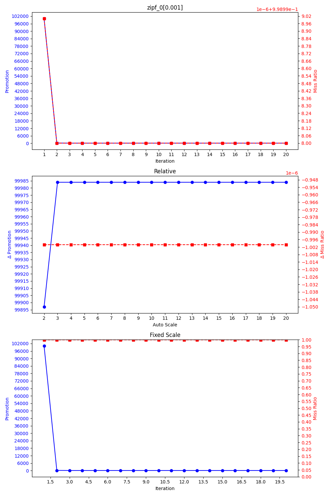  
> **Trace Path**: zipf_0.oracleGeneral  
> **Desc**: 0.001  
> **Cache Size**: 3  
> **Ignore Obj Size**: 0  
> **Total Request**: 100,000,000  
> **First Promotion**: 100,085  
> **Last Promotion**: 101  
> **Promotion Reduced**: 99,984  

> 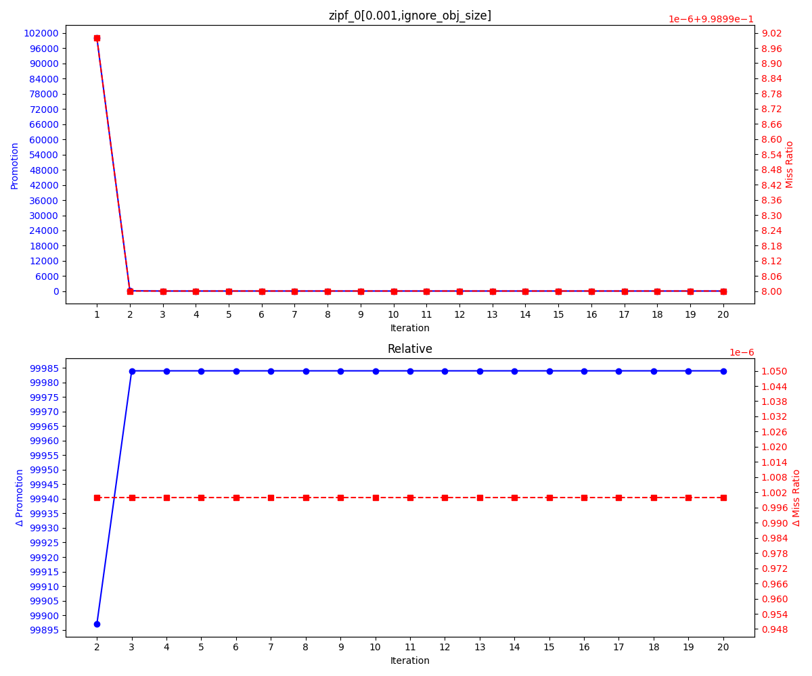  
> **Trace Path**: zipf_0.oracleGeneral  
> **Desc**: 0.001,ignore_obj_size  
> **Cache Size**: 1000  
> **Ignore Obj Size**: 1  
> **Total Request**: 100,000,000  
> **First Promotion**: 100,085  
> **Last Promotion**: 101  
> **Promotion Reduced**: 99,984  

> 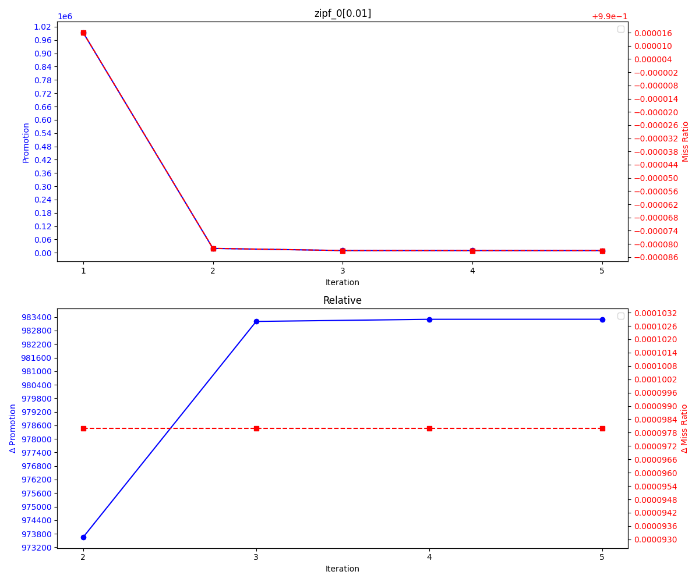  
> **Trace Path**: zipf_0.oracleGeneral  
> **Desc**: 0.01  
> **Cache Size**: 38  
> **Ignore Obj Size**: 0  
> **Total Request**: 100,000,000  
> **First Promotion**: 993,379  
> **Last Promotion**: 10,078  
> **Promotion Reduced**: 983,301  

> 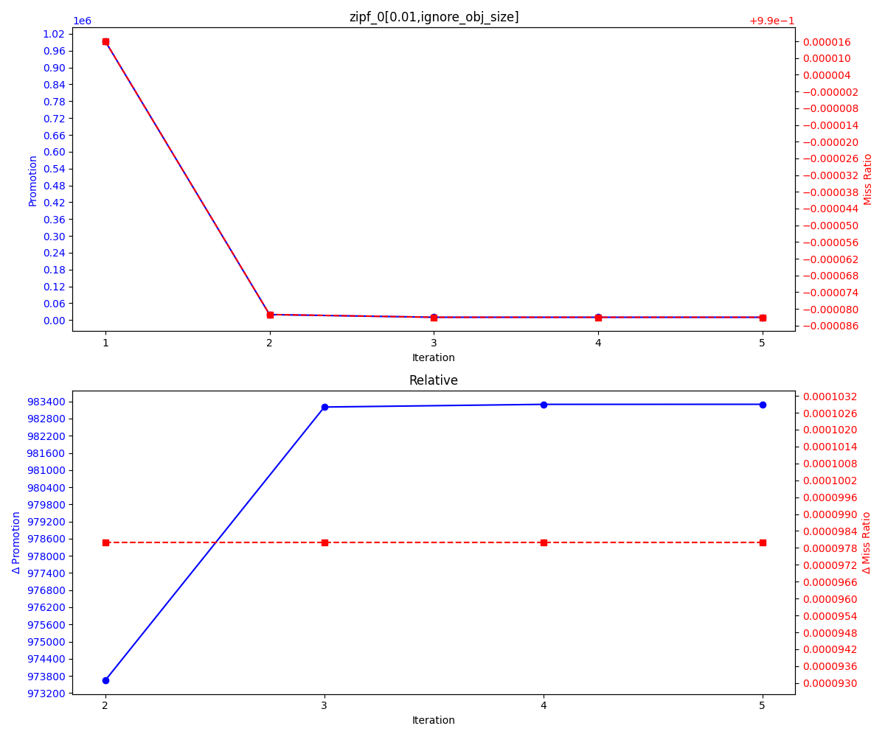  
> **Trace Path**: zipf_0.oracleGeneral  
> **Desc**: 0.01,ignore_obj_size  
> **Cache Size**: 10000  
> **Ignore Obj Size**: 1  
> **Total Request**: 100,000,000  
> **First Promotion**: 993,379  
> **Last Promotion**: 10,078  
> **Promotion Reduced**: 983,301  

> 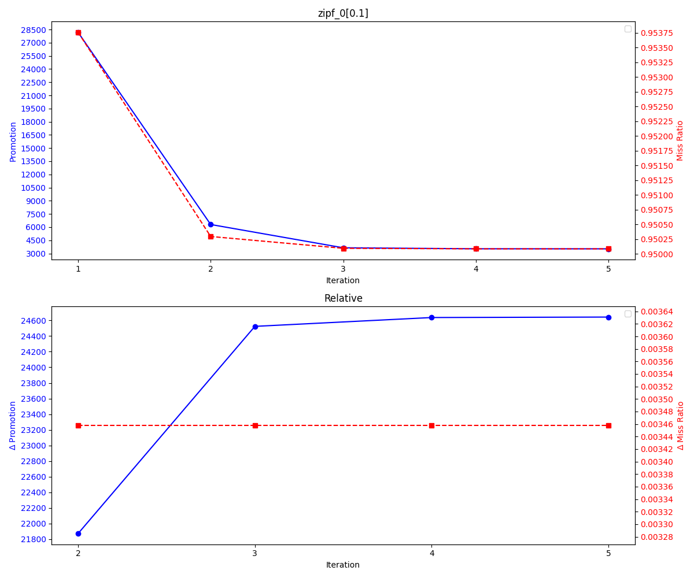  
> **Trace Path**: zipf_0.oracleGeneral  
> **Desc**: 0.1  
> **Cache Size**: 182  
> **Ignore Obj Size**: 0  
> **Total Request**: 649,859  
> **First Promotion**: 28,170  
> **Last Promotion**: 3,527  
> **Promotion Reduced**: 24,643  

> 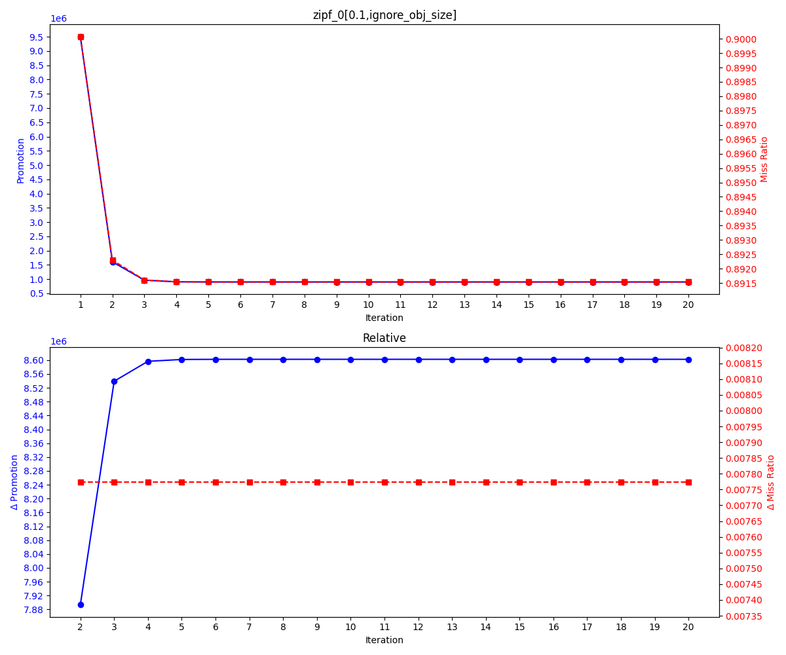  
> **Trace Path**: zipf_0.oracleGeneral  
> **Desc**: 0.1,ignore_obj_size  
> **Cache Size**: 100001  
> **Ignore Obj Size**: 1  
> **Total Request**: 100,000,000  
> **First Promotion**: 9,502,696  
> **Last Promotion**: 900,265  
> **Promotion Reduced**: 8,602,431  

> 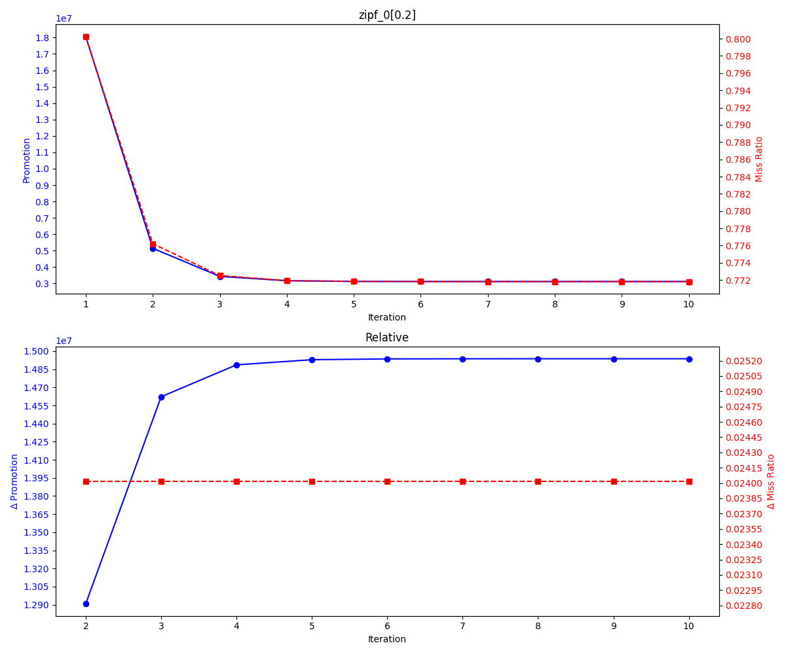  
> **Trace Path**: zipf_0.oracleGeneral  
> **Desc**: 0.2  
> **Cache Size**: 762  
> **Ignore Obj Size**: 0  
> **Total Request**: 100,000,000  
> **First Promotion**: 18,054,195  
> **Last Promotion**: 3,116,965  
> **Promotion Reduced**: 14,937,230  

> 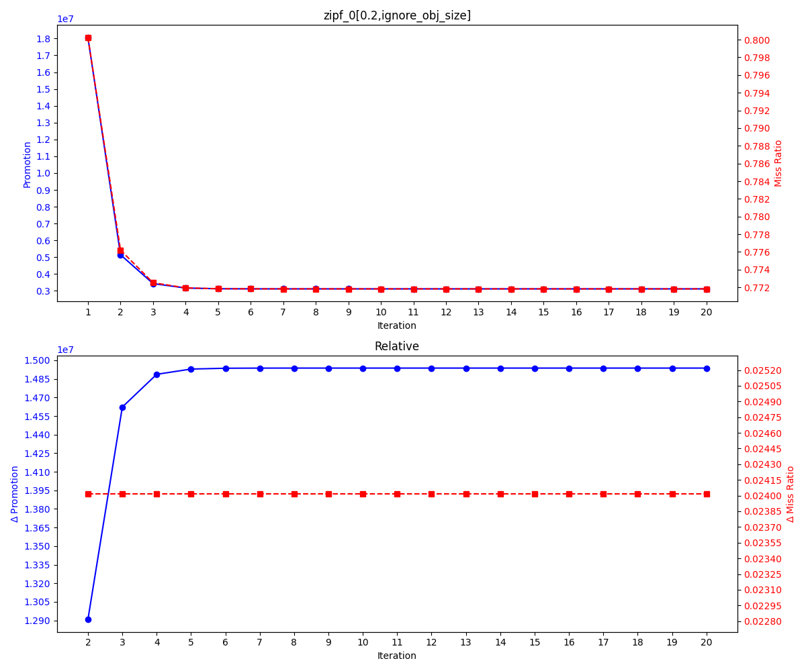  
> **Trace Path**: zipf_0.oracleGeneral  
> **Desc**: 0.2,ignore_obj_size  
> **Cache Size**: 200002  
> **Ignore Obj Size**: 1  
> **Total Request**: 100,000,000  
> **First Promotion**: 18,054,195  
> **Last Promotion**: 3,116,965  
> **Promotion Reduced**: 14,937,230  

> 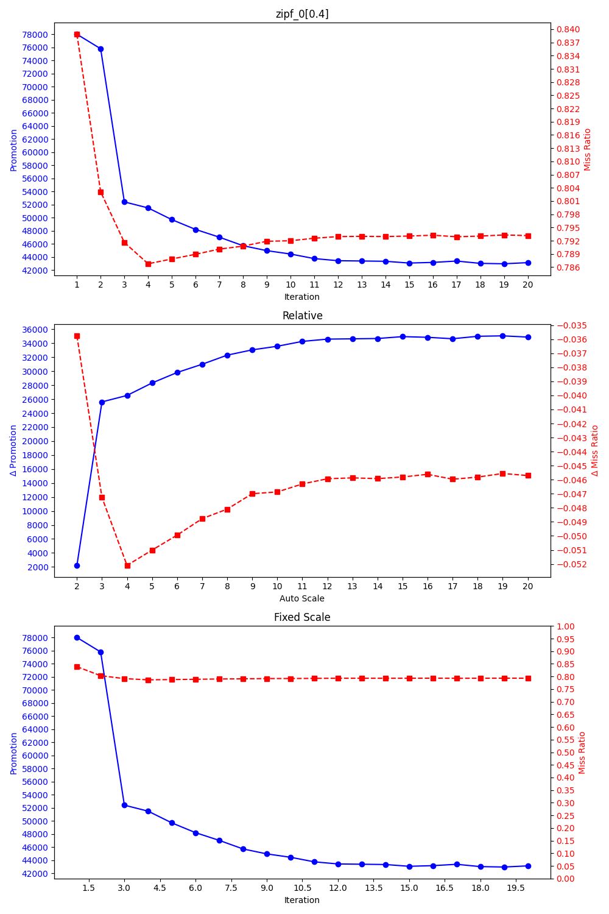  
> **Trace Path**: zipf_0.oracleGeneral  
> **Desc**: 0.4  
> **Cache Size**: 729  
> **Ignore Obj Size**: 0  
> **Total Request**: 649,859  
> **First Promotion**: 78,021  
> **Last Promotion**: 43,134  
> **Promotion Reduced**: 34,887  

> 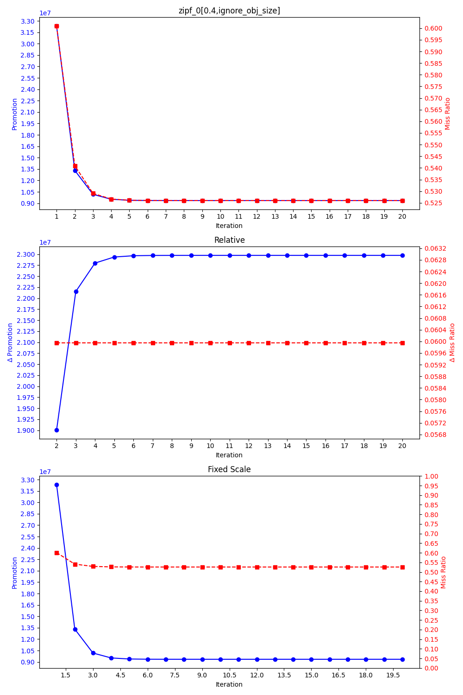  
> **Trace Path**: zipf_0.oracleGeneral  
> **Desc**: 0.4,ignore_obj_size  
> **Cache Size**: 400004  
> **Ignore Obj Size**: 1  
> **Total Request**: 100,000,000  
> **First Promotion**: 32,325,626  
> **Last Promotion**: 9,352,494  
> **Promotion Reduced**: 22,973,132  

## zipf_0.3 
>   
> **Trace Path**: zipf_0.3.oracleGeneral  
> **Desc**: 0.001  
> **Cache Size**: 2  
> **Ignore Obj Size**: 0  
> **Total Request**: 999,363  
> **First Promotion**: 700  
> **Last Promotion**: 1  
> **Promotion Reduced**: 699  

> 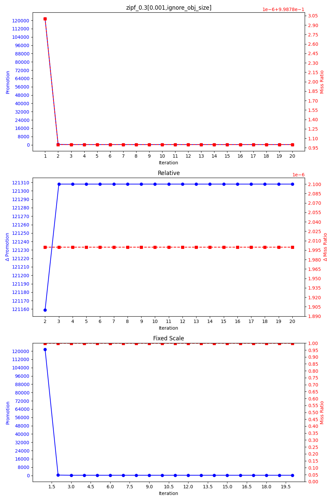  
> **Trace Path**: zipf_0.3.oracleGeneral  
> **Desc**: 0.001,ignore_obj_size  
> **Cache Size**: 1000  
> **Ignore Obj Size**: 1  
> **Total Request**: 100,000,000  
> **First Promotion**: 121,564  
> **Last Promotion**: 256  
> **Promotion Reduced**: 121,308  

> 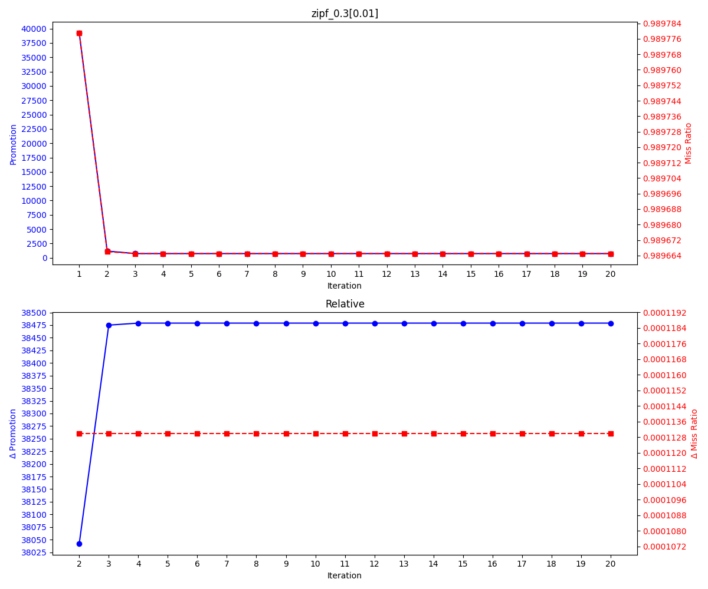  
> **Trace Path**: zipf_0.3.oracleGeneral  
> **Desc**: 0.01  
> **Cache Size**: 31  
> **Ignore Obj Size**: 0  
> **Total Request**: 3,871,849  
> **First Promotion**: 39,229  
> **Last Promotion**: 750  
> **Promotion Reduced**: 38,479  

> 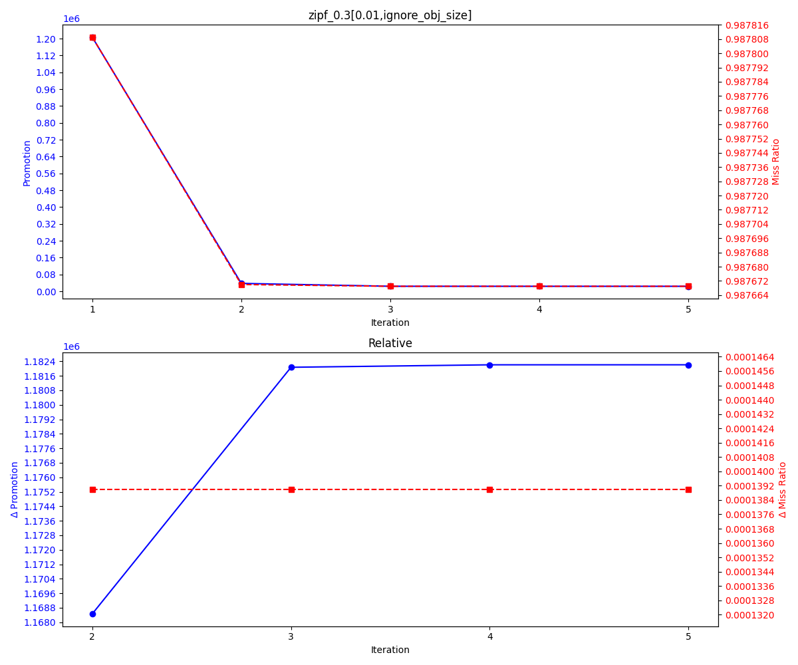  
> **Trace Path**: zipf_0.3.oracleGeneral  
> **Desc**: 0.01,ignore_obj_size  
> **Cache Size**: 10000  
> **Ignore Obj Size**: 1  
> **Total Request**: 100,000,000  
> **First Promotion**: 1,206,384  
> **Last Promotion**: 24,177  
> **Promotion Reduced**: 1,182,207  

> 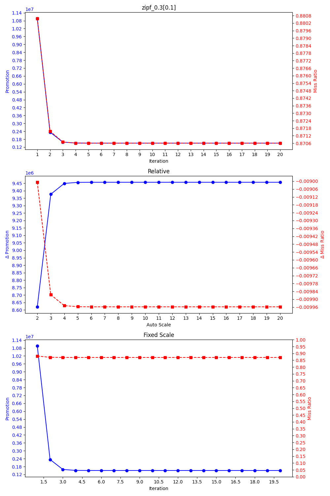  
> **Trace Path**: zipf_0.3.oracleGeneral  
> **Desc**: 0.1  
> **Cache Size**: 381  
> **Ignore Obj Size**: 0  
> **Total Request**: 100,000,000  
> **First Promotion**: 10,959,290  
> **Last Promotion**: 1,502,961  
> **Promotion Reduced**: 9,456,329  

> 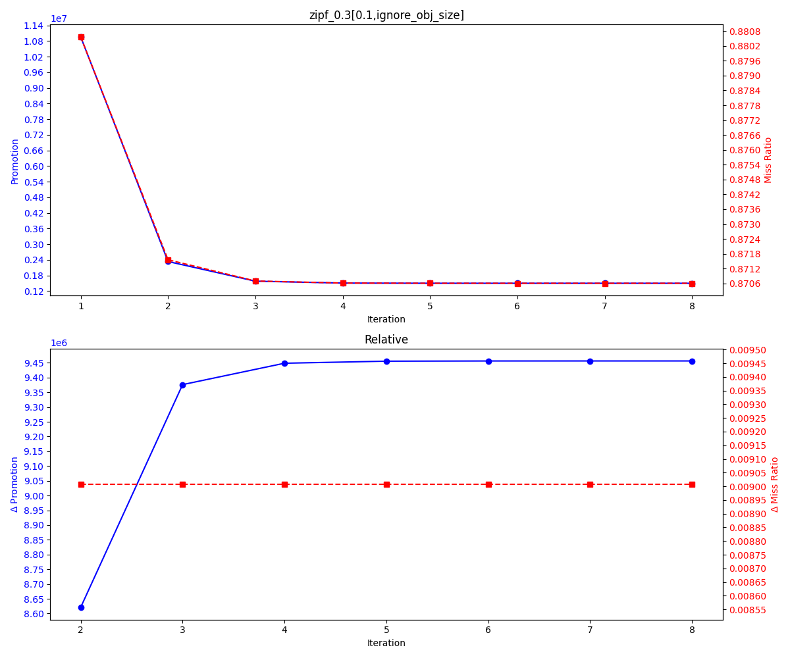  
> **Trace Path**: zipf_0.3.oracleGeneral  
> **Desc**: 0.1,ignore_obj_size  
> **Cache Size**: 100001  
> **Ignore Obj Size**: 1  
> **Total Request**: 100,000,000  
> **First Promotion**: 10,959,290  
> **Last Promotion**: 1,502,961  
> **Promotion Reduced**: 9,456,329  

> 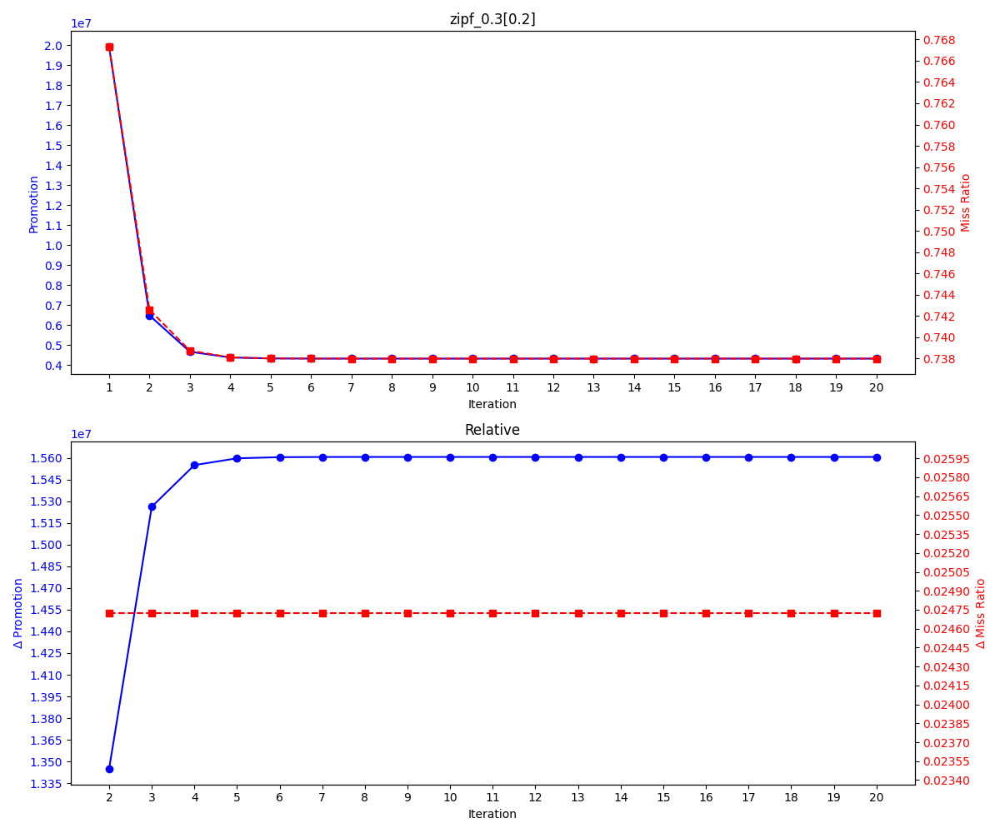  
> **Trace Path**: zipf_0.3.oracleGeneral  
> **Desc**: 0.2  
> **Cache Size**: 762  
> **Ignore Obj Size**: 0  
> **Total Request**: 100,000,000  
> **First Promotion**: 19,927,792  
> **Last Promotion**: 4,321,510  
> **Promotion Reduced**: 15,606,282  

> 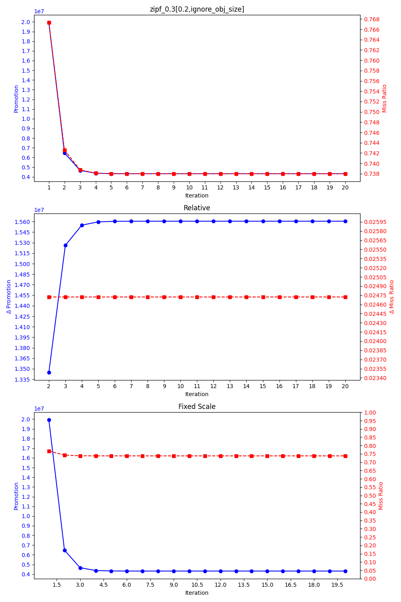  
> **Trace Path**: zipf_0.3.oracleGeneral  
> **Desc**: 0.2,ignore_obj_size  
> **Cache Size**: 200002  
> **Ignore Obj Size**: 1  
> **Total Request**: 100,000,000  
> **First Promotion**: 19,927,792  
> **Last Promotion**: 4,321,510  
> **Promotion Reduced**: 15,606,282  

> 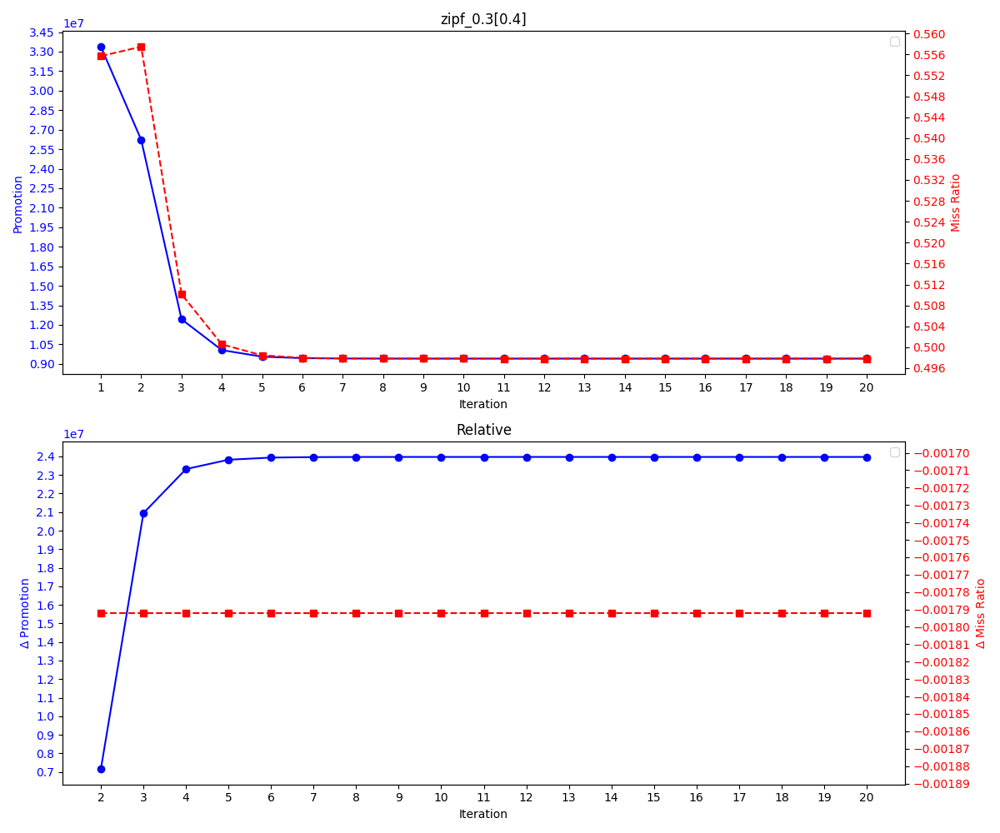  
> **Trace Path**: zipf_0.3.oracleGeneral  
> **Desc**: 0.4  
> **Cache Size**: 1525  
> **Ignore Obj Size**: 0  
> **Total Request**: 100,000,000  
> **First Promotion**: 33,376,438  
> **Last Promotion**: 9,405,562  
> **Promotion Reduced**: 23,970,876  

> 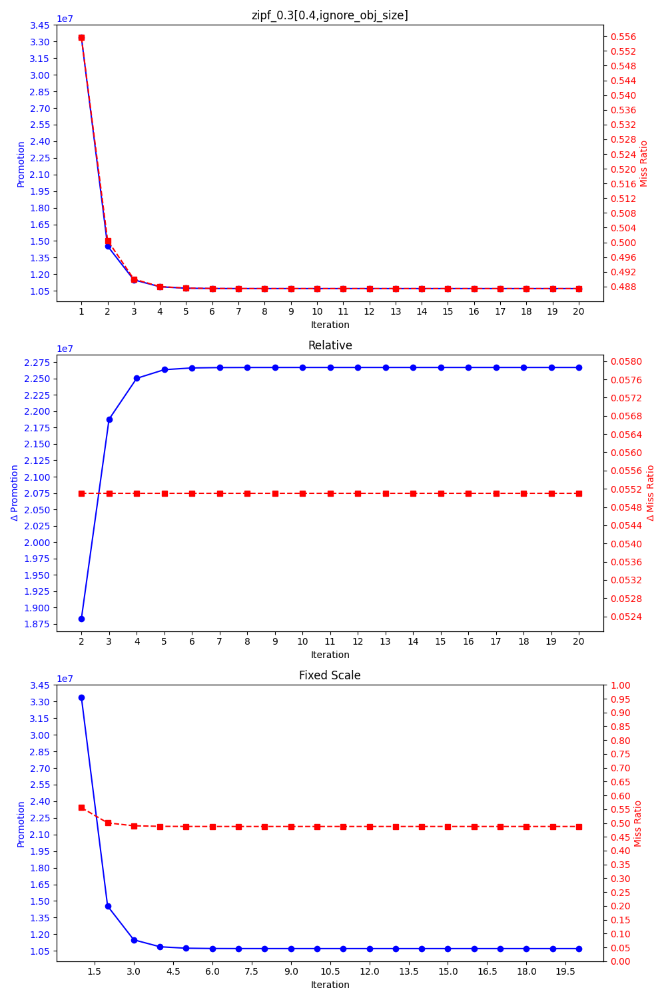  
> **Trace Path**: zipf_0.3.oracleGeneral  
> **Desc**: 0.4,ignore_obj_size  
> **Cache Size**: 400004  
> **Ignore Obj Size**: 1  
> **Total Request**: 100,000,000  
> **First Promotion**: 33,371,131  
> **Last Promotion**: 10,701,697  
> **Promotion Reduced**: 22,669,434  

## zipf_0.7 
> 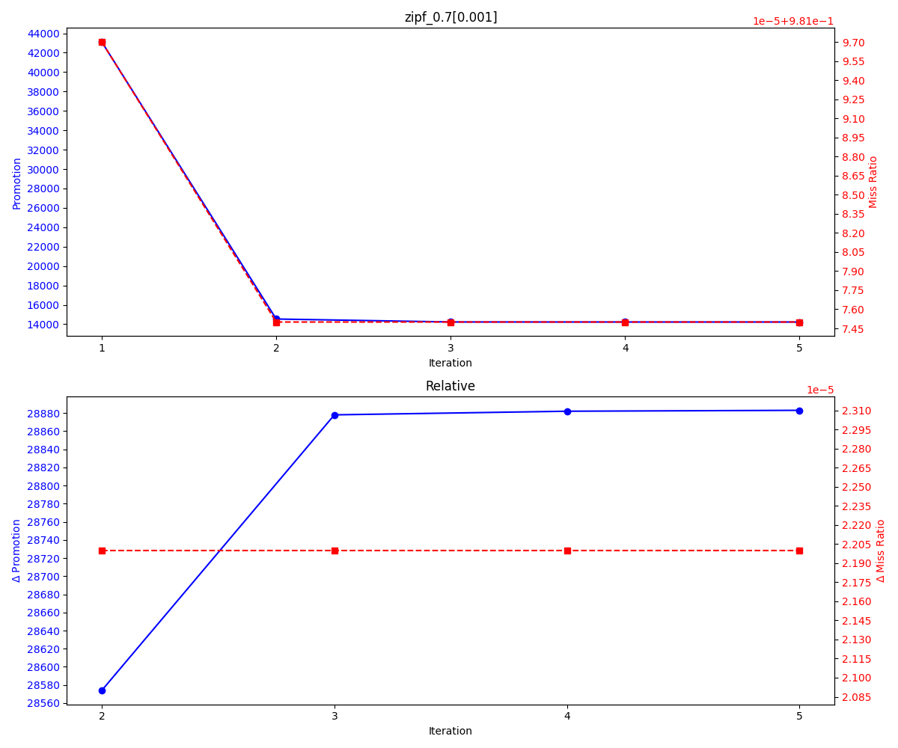  
> **Trace Path**: zipf_0.7.oracleGeneral  
> **Desc**: 0.001  
> **Cache Size**: 1  
> **Ignore Obj Size**: 0  
> **Total Request**: 2,998,089  
> **First Promotion**: 43,109  
> **Last Promotion**: 14,226  
> **Promotion Reduced**: 28,883  

> 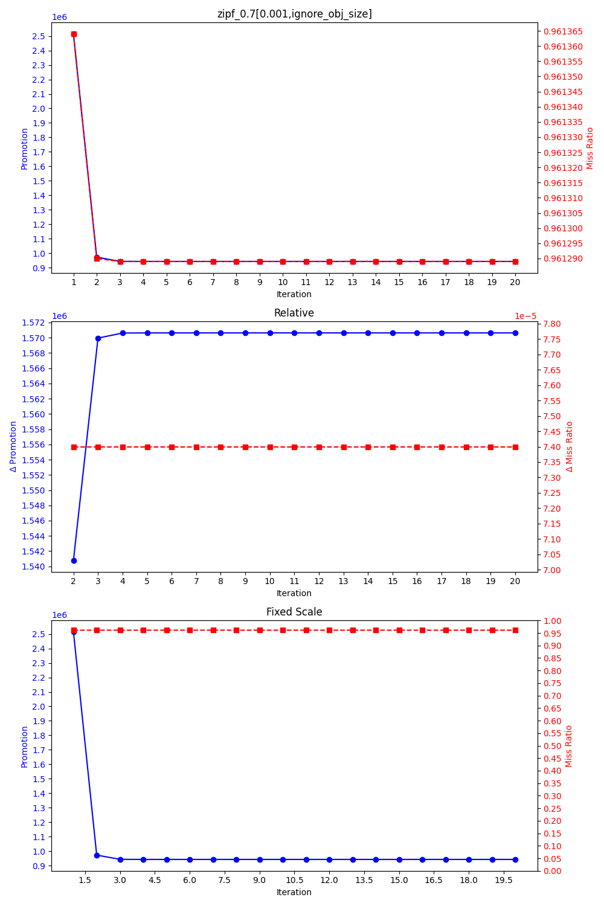  
> **Trace Path**: zipf_0.7.oracleGeneral  
> **Desc**: 0.001,ignore_obj_size  
> **Cache Size**: 1000  
> **Ignore Obj Size**: 1  
> **Total Request**: 100,000,000  
> **First Promotion**: 2,514,144  
> **Last Promotion**: 943,508  
> **Promotion Reduced**: 1,570,636  

> 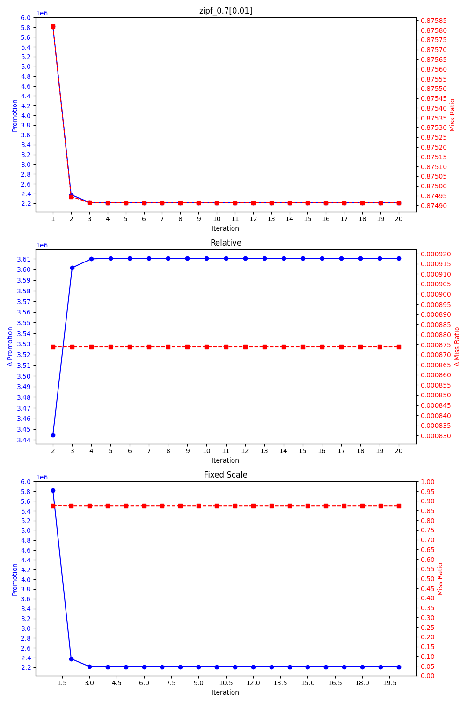  
> **Trace Path**: zipf_0.7.oracleGeneral  
> **Desc**: 0.01  
> **Cache Size**: 36  
> **Ignore Obj Size**: 0  
> **Total Request**: 86,999,191  
> **First Promotion**: 5,820,482  
> **Last Promotion**: 2,210,063  
> **Promotion Reduced**: 3,610,419  

> 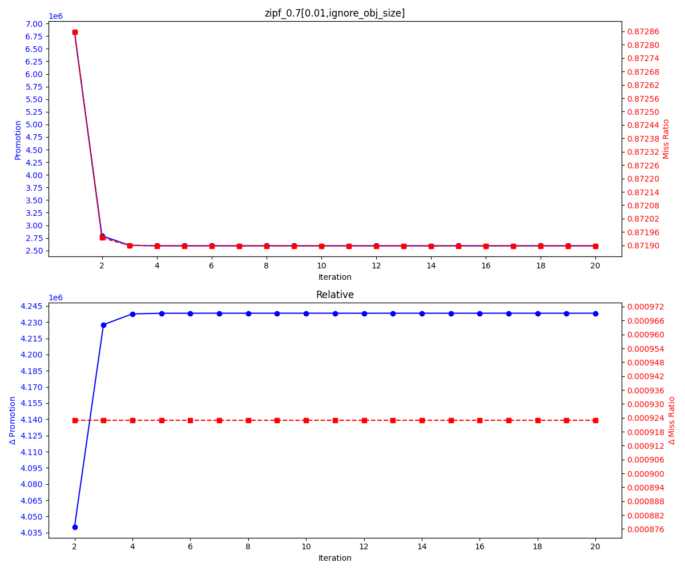  
> **Trace Path**: zipf_0.7.oracleGeneral  
> **Desc**: 0.01,ignore_obj_size  
> **Cache Size**: 10000  
> **Ignore Obj Size**: 1  
> **Total Request**: 100,000,000  
> **First Promotion**: 6,831,416  
> **Last Promotion**: 2,593,135  
> **Promotion Reduced**: 4,238,281  

> 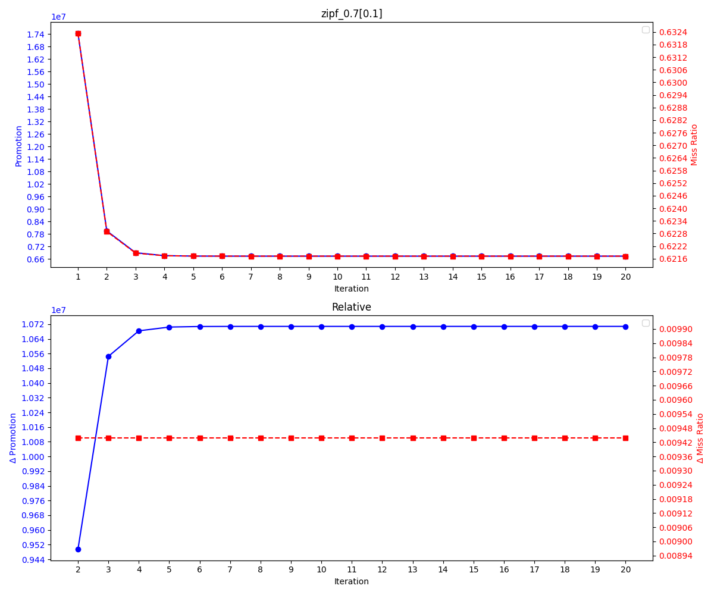  
> **Trace Path**: zipf_0.7.oracleGeneral  
> **Desc**: 0.1  
> **Cache Size**: 381  
> **Ignore Obj Size**: 0  
> **Total Request**: 100,000,000  
> **First Promotion**: 17,437,714  
> **Last Promotion**: 6,729,626  
> **Promotion Reduced**: 10,708,088  

> 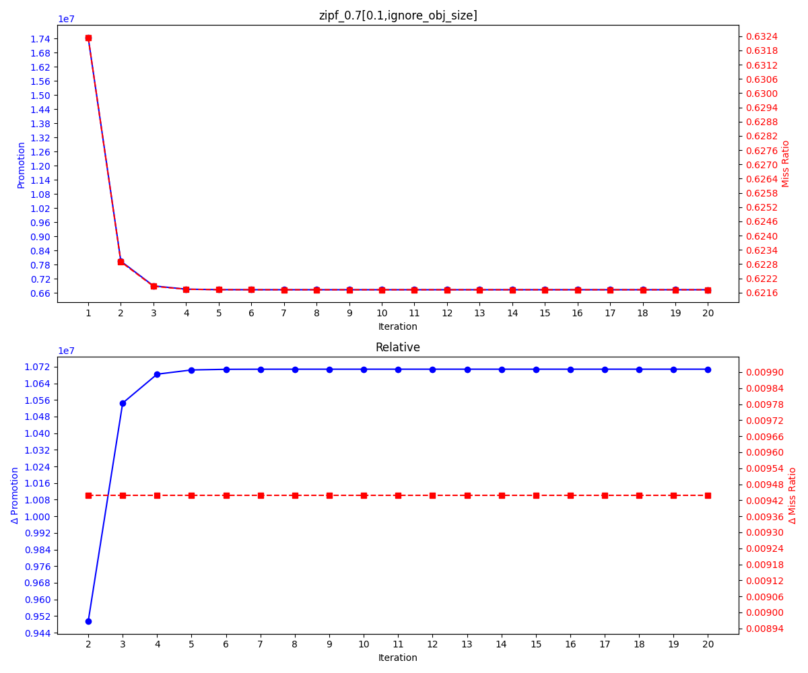  
> **Trace Path**: zipf_0.7.oracleGeneral  
> **Desc**: 0.1,ignore_obj_size  
> **Cache Size**: 100001  
> **Ignore Obj Size**: 1  
> **Total Request**: 100,000,000  
> **First Promotion**: 17,437,714  
> **Last Promotion**: 6,729,626  
> **Promotion Reduced**: 10,708,088  

> 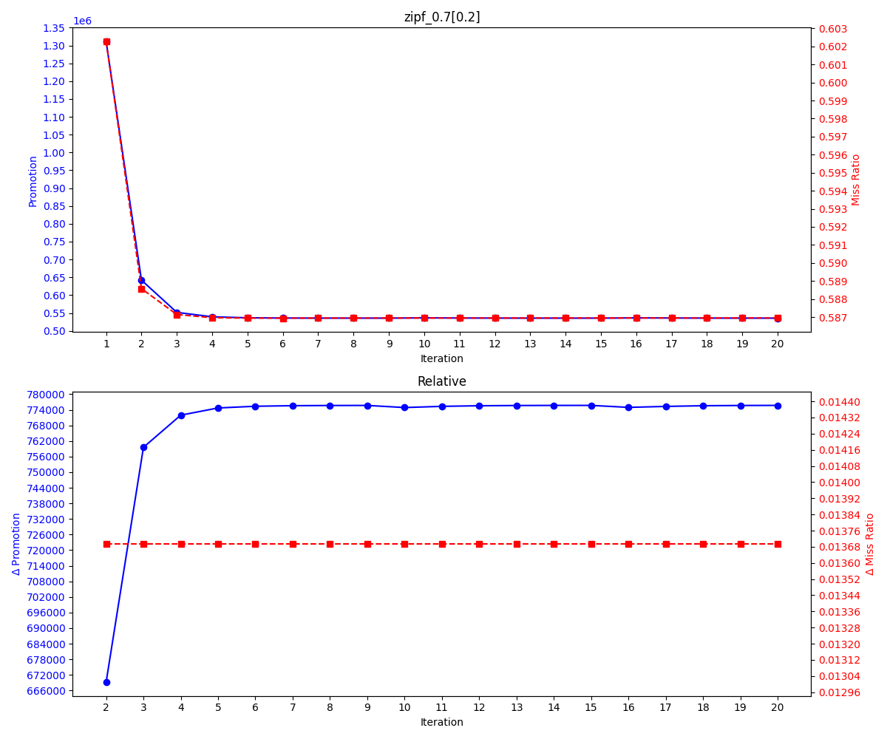  
> **Trace Path**: zipf_0.7.oracleGeneral  
> **Desc**: 0.2  
> **Cache Size**: 461  
> **Ignore Obj Size**: 0  
> **Total Request**: 7,154,006  
> **First Promotion**: 1,311,286  
> **Last Promotion**: 535,578  
> **Promotion Reduced**: 775,708  

> 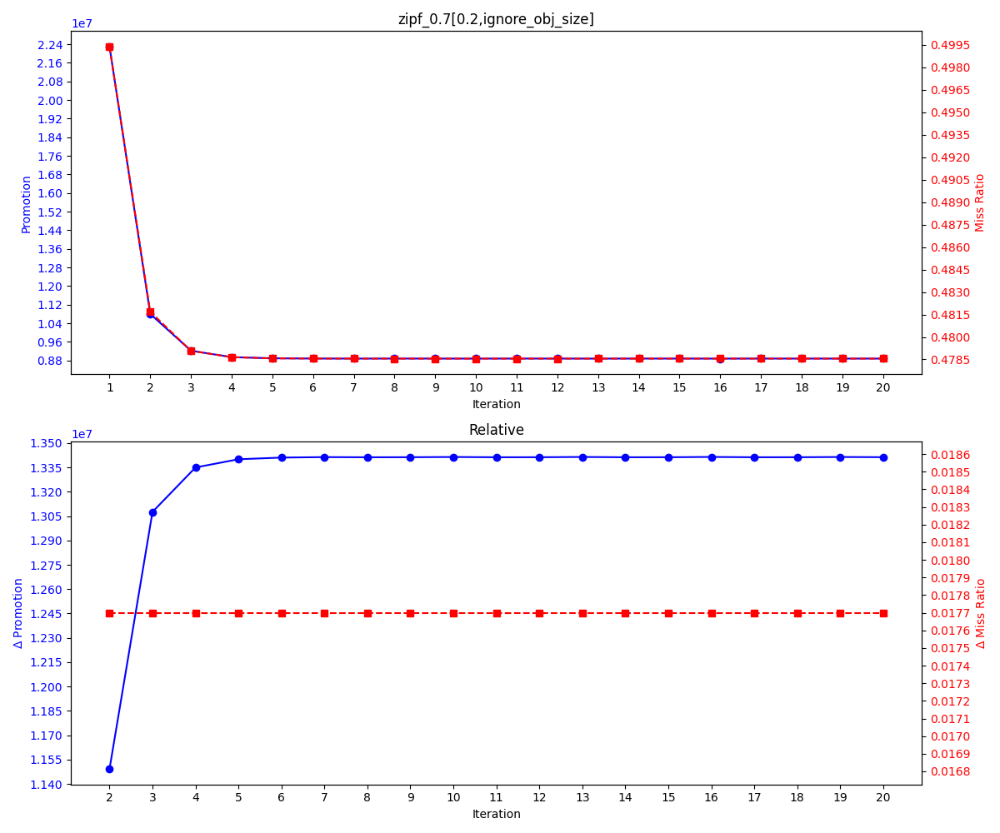  
> **Trace Path**: zipf_0.7.oracleGeneral  
> **Desc**: 0.2,ignore_obj_size  
> **Cache Size**: 200002  
> **Ignore Obj Size**: 1  
> **Total Request**: 100,000,000  
> **First Promotion**: 22,294,792  
> **Last Promotion**: 8,881,745  
> **Promotion Reduced**: 13,413,047  

> 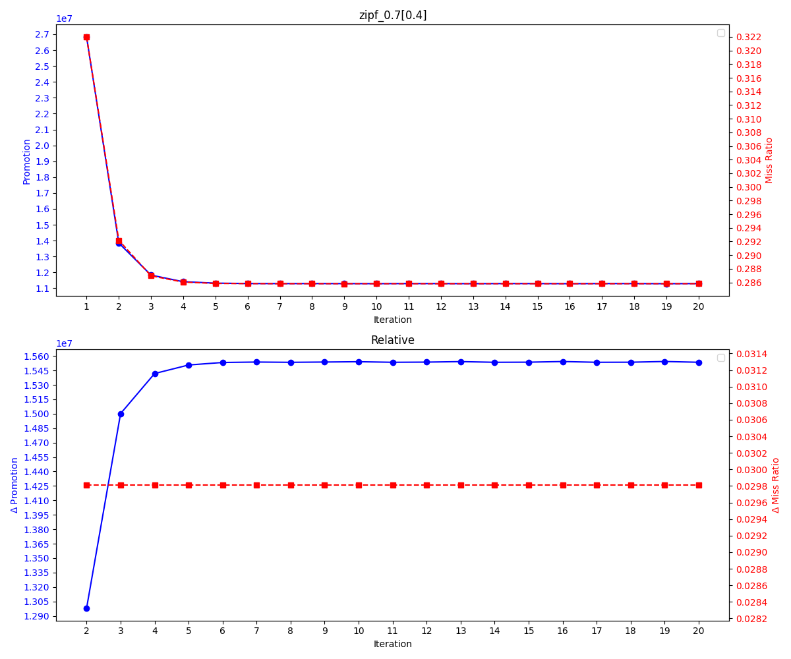  
> **Trace Path**: zipf_0.7.oracleGeneral  
> **Desc**: 0.4  
> **Cache Size**: 1525  
> **Ignore Obj Size**: 0  
> **Total Request**: 100,000,000  
> **First Promotion**: 26,831,220  
> **Last Promotion**: 11,296,490  
> **Promotion Reduced**: 15,534,730  

> 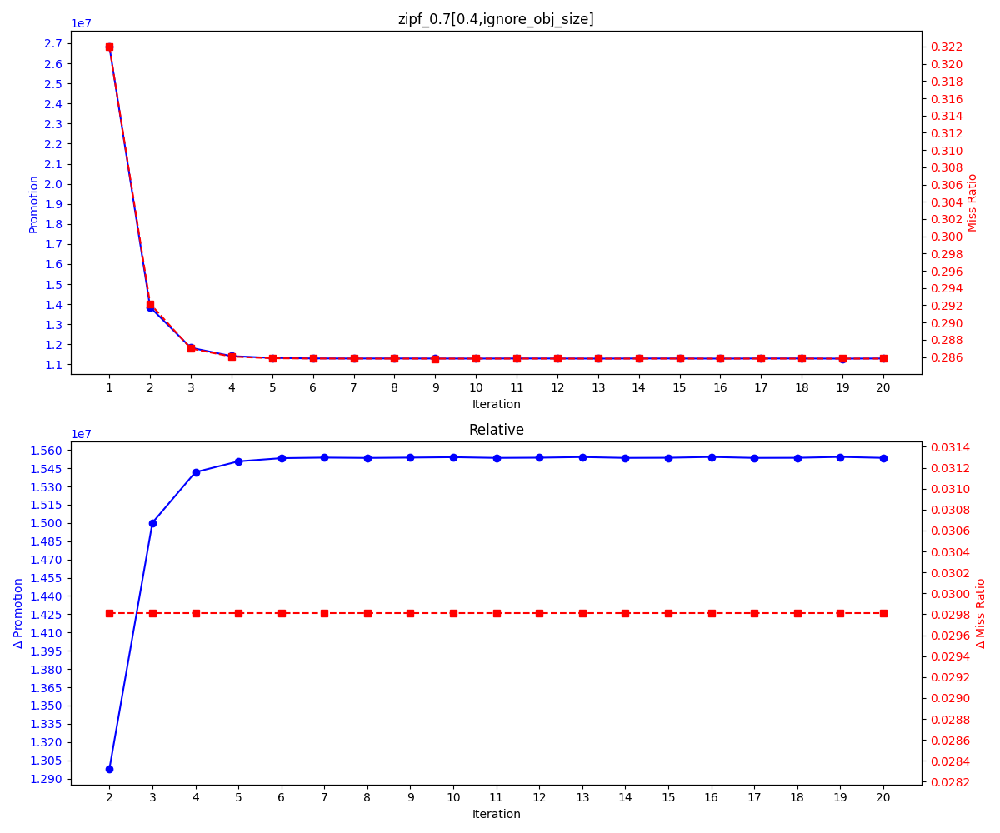  
> **Trace Path**: zipf_0.7.oracleGeneral  
> **Desc**: 0.4,ignore_obj_size  
> **Cache Size**: 400004  
> **Ignore Obj Size**: 1  
> **Total Request**: 100,000,000  
> **First Promotion**: 26,831,220  
> **Last Promotion**: 11,296,490  
> **Promotion Reduced**: 15,534,730  

## zipf_1 
> 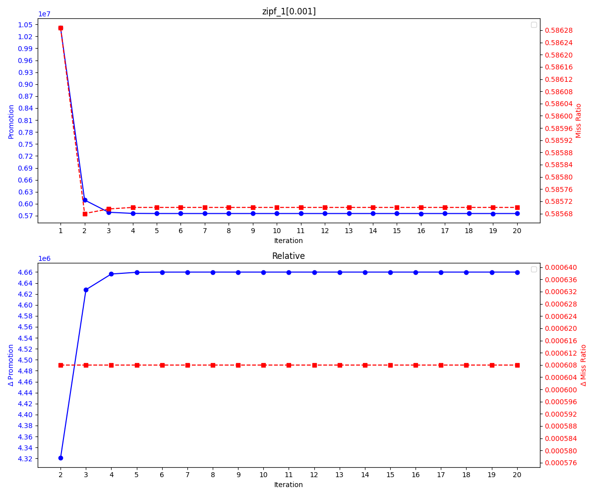  
> **Trace Path**: zipf_1.oracleGeneral  
> **Desc**: 0.001  
> **Cache Size**: 3  
> **Ignore Obj Size**: 0  
> **Total Request**: 100,000,000  
> **First Promotion**: 10,415,087  
> **Last Promotion**: 5,755,206  
> **Promotion Reduced**: 4,659,881  

> 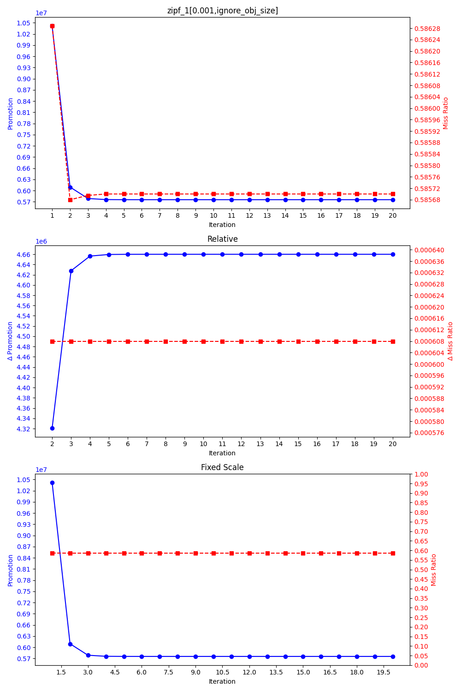  
> **Trace Path**: zipf_1.oracleGeneral  
> **Desc**: 0.001,ignore_obj_size  
> **Cache Size**: 999  
> **Ignore Obj Size**: 1  
> **Total Request**: 100,000,000  
> **First Promotion**: 10,415,087  
> **Last Promotion**: 5,755,206  
> **Promotion Reduced**: 4,659,881  

> 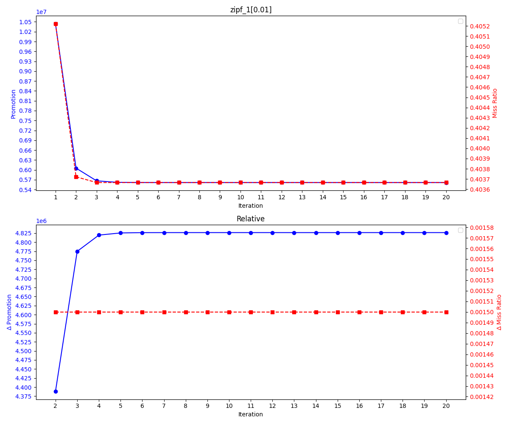  
> **Trace Path**: zipf_1.oracleGeneral  
> **Desc**: 0.01  
> **Cache Size**: 38  
> **Ignore Obj Size**: 0  
> **Total Request**: 100,000,000  
> **First Promotion**: 10,441,118  
> **Last Promotion**: 5,614,550  
> **Promotion Reduced**: 4,826,568  

> 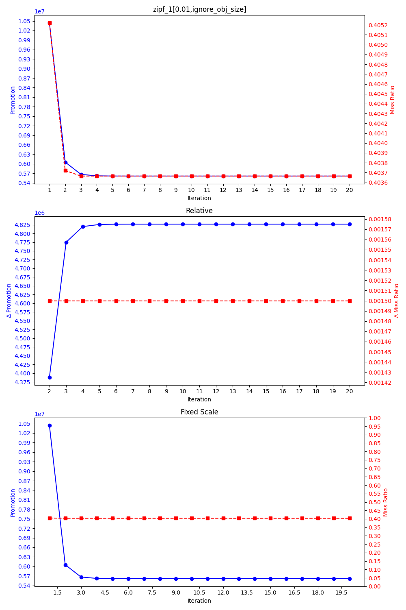  
> **Trace Path**: zipf_1.oracleGeneral  
> **Desc**: 0.01,ignore_obj_size  
> **Cache Size**: 9998  
> **Ignore Obj Size**: 1  
> **Total Request**: 100,000,000  
> **First Promotion**: 10,441,118  
> **Last Promotion**: 5,614,550  
> **Promotion Reduced**: 4,826,568  

> 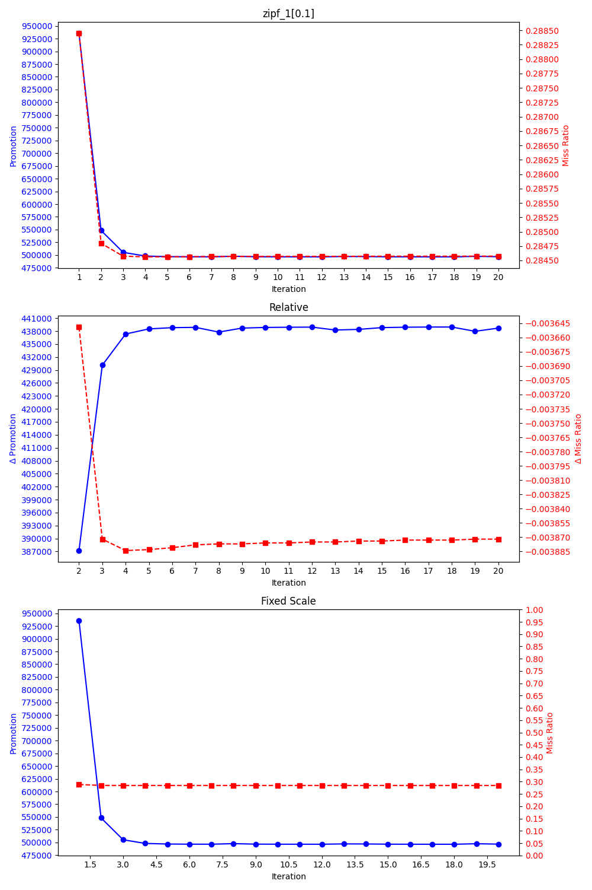  
> **Trace Path**: zipf_1.oracleGeneral  
> **Desc**: 0.1  
> **Cache Size**: 160  
> **Ignore Obj Size**: 0  
> **Total Request**: 9,098,026  
> **First Promotion**: 935,409  
> **Last Promotion**: 496,716  
> **Promotion Reduced**: 438,693  

> 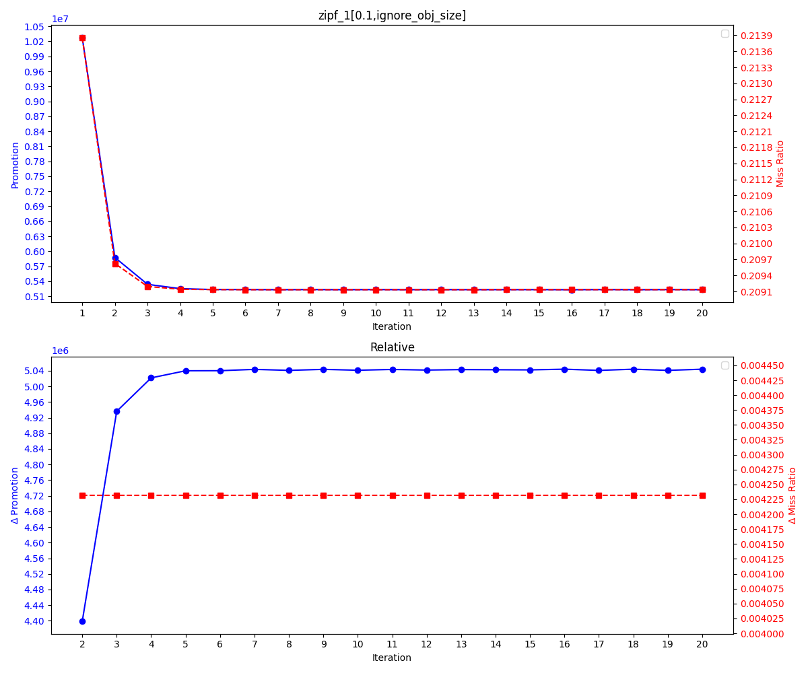  
> **Trace Path**: zipf_1.oracleGeneral  
> **Desc**: 0.1,ignore_obj_size  
> **Cache Size**: 99988  
> **Ignore Obj Size**: 1  
> **Total Request**: 100,000,000  
> **First Promotion**: 10,273,095  
> **Last Promotion**: 5,229,141  
> **Promotion Reduced**: 5,043,954  

> 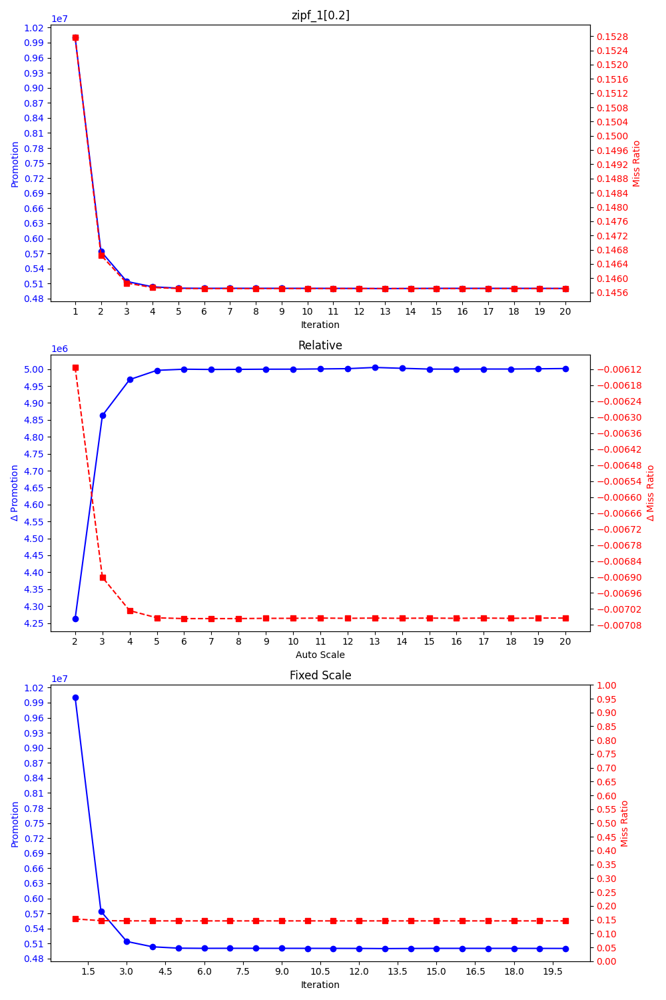  
> **Trace Path**: zipf_1.oracleGeneral  
> **Desc**: 0.2  
> **Cache Size**: 762  
> **Ignore Obj Size**: 0  
> **Total Request**: 100,000,000  
> **First Promotion**: 10,003,389  
> **Last Promotion**: 5,001,631  
> **Promotion Reduced**: 5,001,758  

> 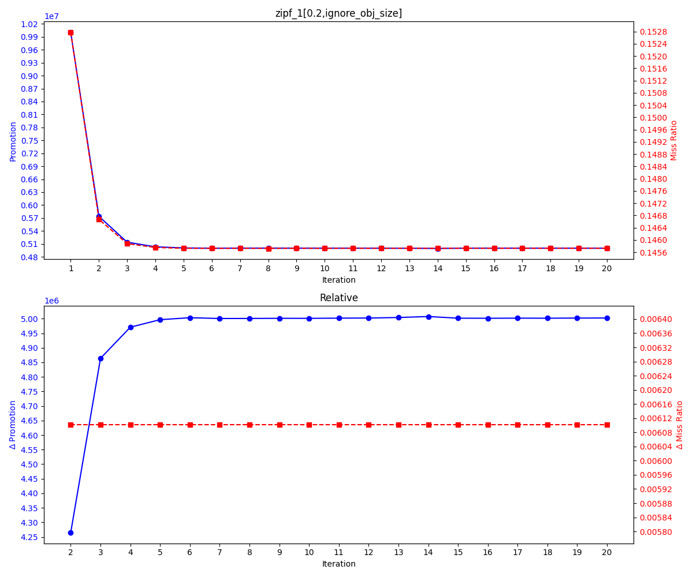  
> **Trace Path**: zipf_1.oracleGeneral  
> **Desc**: 0.2,ignore_obj_size  
> **Cache Size**: 199977  
> **Ignore Obj Size**: 1  
> **Total Request**: 100,000,000  
> **First Promotion**: 10,003,325  
> **Last Promotion**: 5,001,015  
> **Promotion Reduced**: 5,002,310  

> 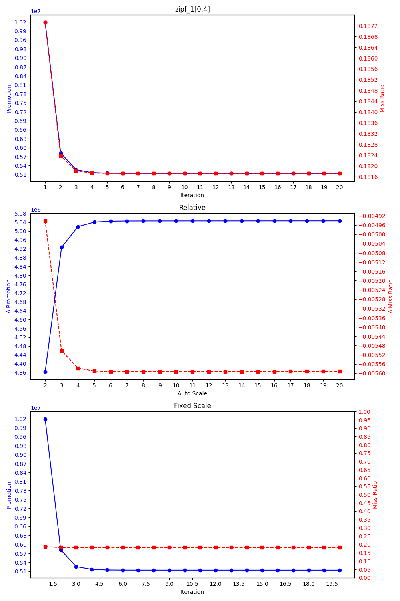  
> **Trace Path**: zipf_1.oracleGeneral  
> **Desc**: 0.4  
> **Cache Size**: 516  
> **Ignore Obj Size**: 0  
> **Total Request**: 100,000,000  
> **First Promotion**: 10,185,594  
> **Last Promotion**: 5,139,113  
> **Promotion Reduced**: 5,046,481  

> 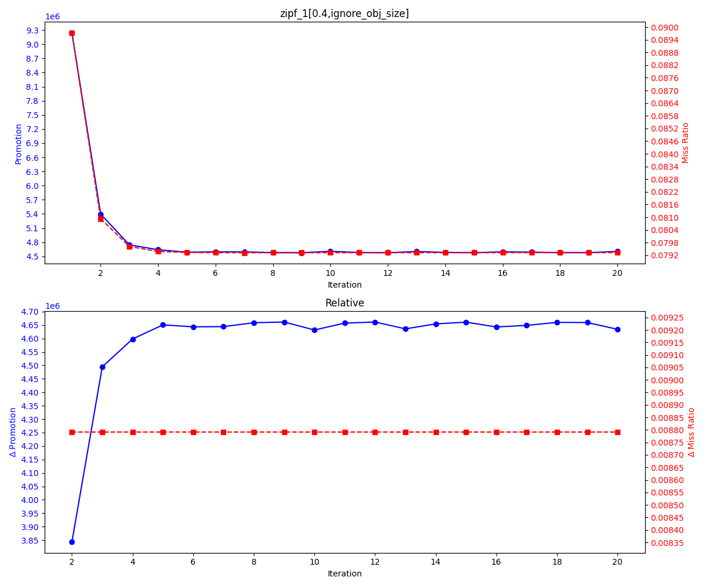  
> **Trace Path**: zipf_1.oracleGeneral  
> **Desc**: 0.4,ignore_obj_size  
> **Cache Size**: 399955  
> **Ignore Obj Size**: 1  
> **Total Request**: 100,000,000  
> **First Promotion**: 9,238,646  
> **Last Promotion**: 4,604,453  
> **Promotion Reduced**: 4,634,193  

## zipf_1.3 
> 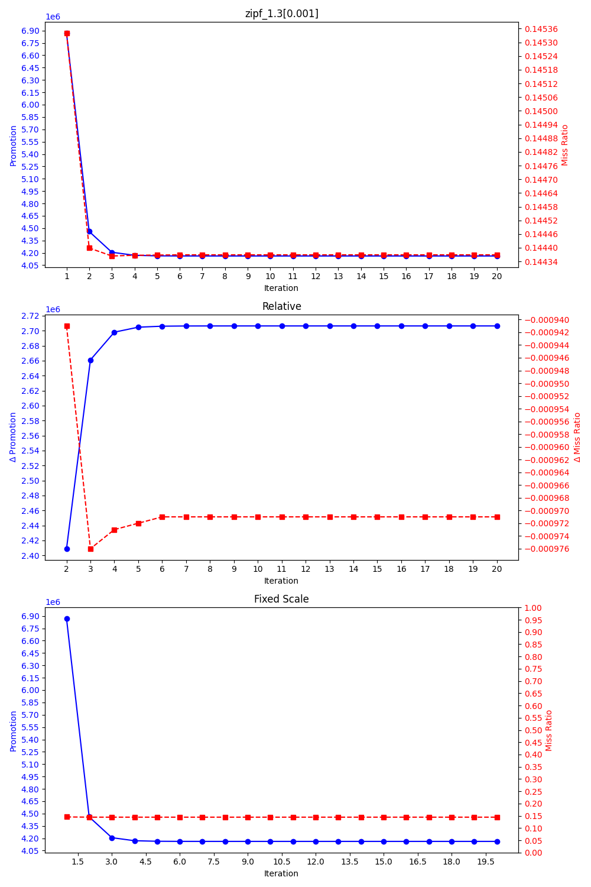  
> **Trace Path**: zipf_1.3.oracleGeneral  
> **Desc**: 0.001  
> **Cache Size**: 2  
> **Ignore Obj Size**: 0  
> **Total Request**: 100,000,000  
> **First Promotion**: 6,867,973  
> **Last Promotion**: 4,161,616  
> **Promotion Reduced**: 2,706,357  

> 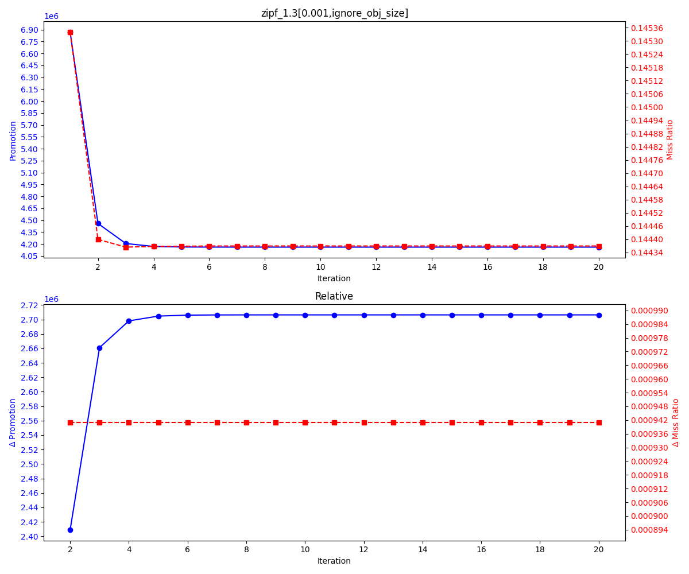  
> **Trace Path**: zipf_1.3.oracleGeneral  
> **Desc**: 0.001,ignore_obj_size  
> **Cache Size**: 670  
> **Ignore Obj Size**: 1  
> **Total Request**: 100,000,000  
> **First Promotion**: 6,867,973  
> **Last Promotion**: 4,161,616  
> **Promotion Reduced**: 2,706,357  

> 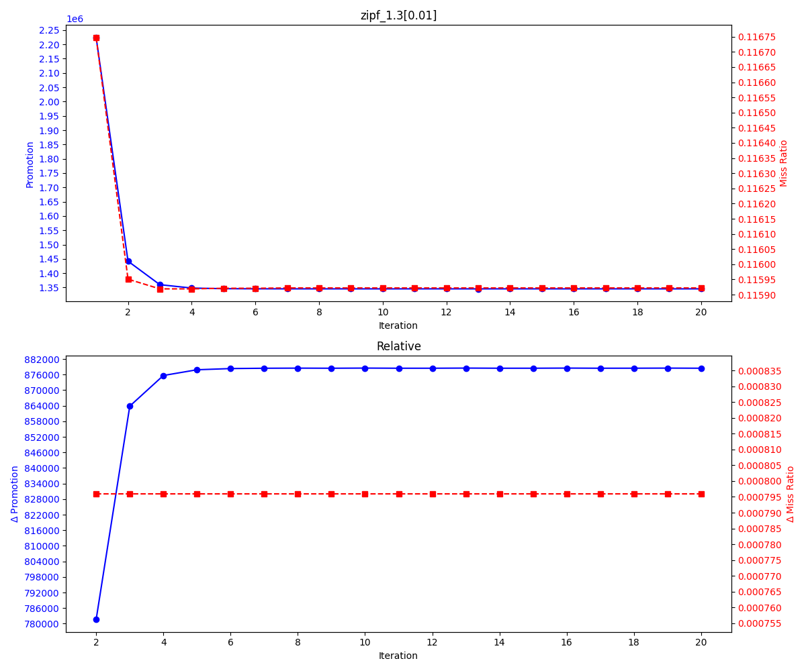  
> **Trace Path**: zipf_1.3.oracleGeneral  
> **Desc**: 0.01  
> **Cache Size**: 4  
> **Ignore Obj Size**: 0  
> **Total Request**: 39,422,976  
> **First Promotion**: 2,223,669  
> **Last Promotion**: 1,345,228  
> **Promotion Reduced**: 878,441  

> 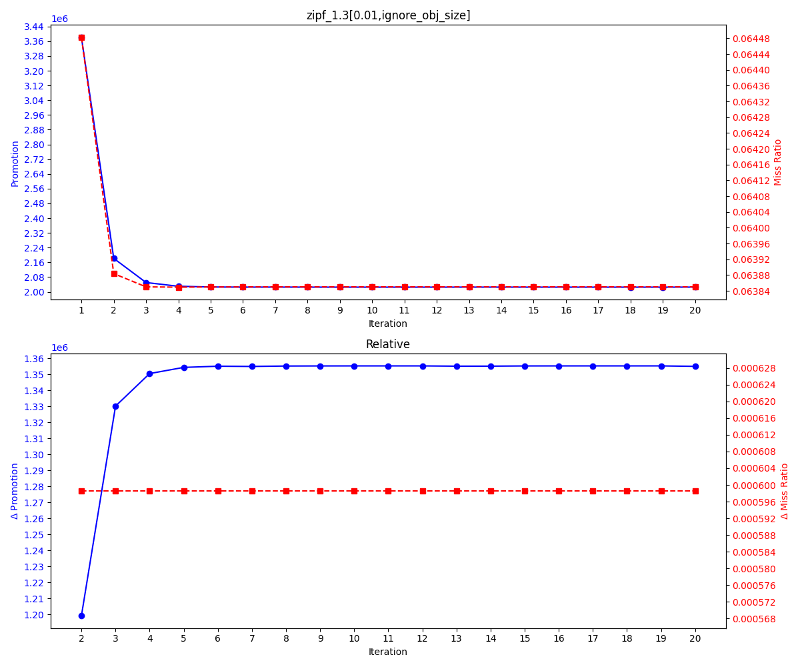  
> **Trace Path**: zipf_1.3.oracleGeneral  
> **Desc**: 0.01,ignore_obj_size  
> **Cache Size**: 6701  
> **Ignore Obj Size**: 1  
> **Total Request**: 100,000,000  
> **First Promotion**: 3,381,028  
> **Last Promotion**: 2,025,992  
> **Promotion Reduced**: 1,355,036  

> 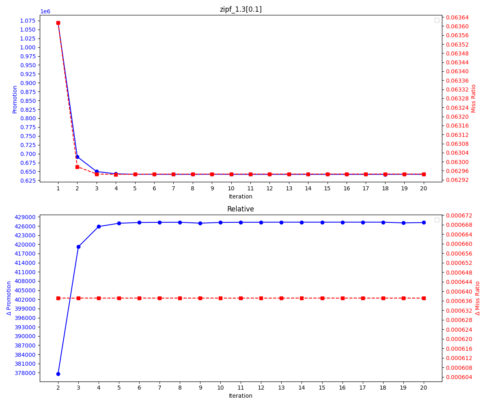  
> **Trace Path**: zipf_1.3.oracleGeneral  
> **Desc**: 0.1  
> **Cache Size**: 26  
> **Ignore Obj Size**: 0  
> **Total Request**: 31,995,999  
> **First Promotion**: 1,069,175  
> **Last Promotion**: 642,033  
> **Promotion Reduced**: 427,142  

> 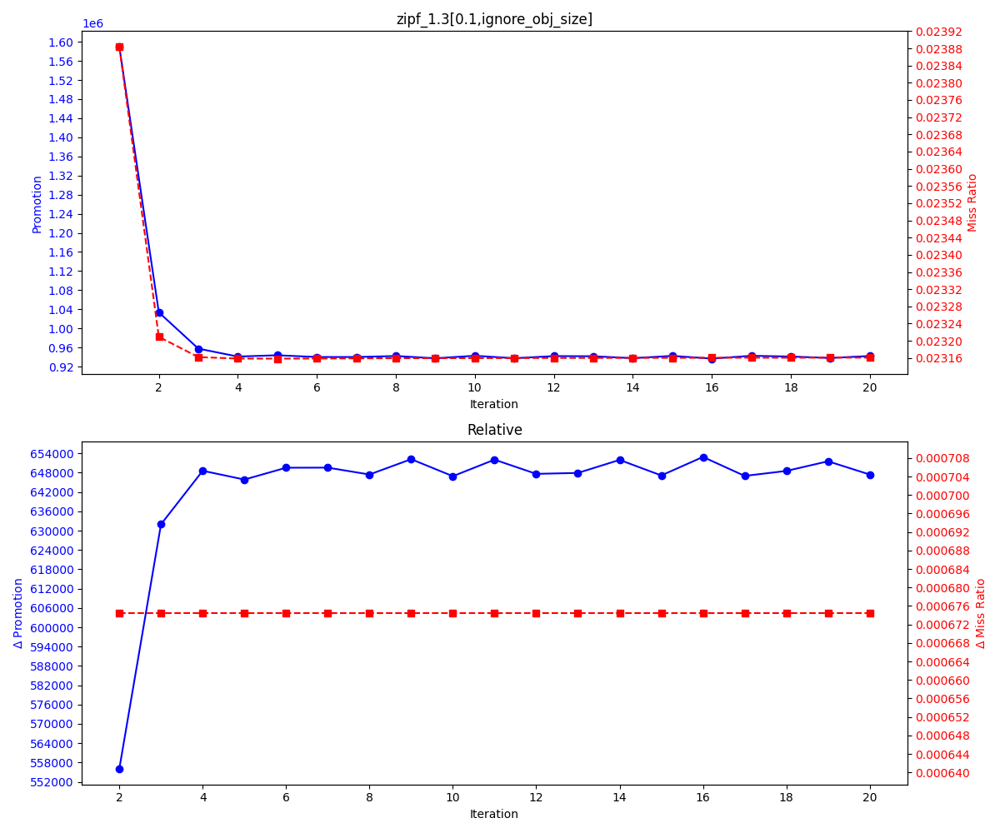  
> **Trace Path**: zipf_1.3.oracleGeneral  
> **Desc**: 0.1,ignore_obj_size  
> **Cache Size**: 67017  
> **Ignore Obj Size**: 1  
> **Total Request**: 100,000,000  
> **First Promotion**: 1,589,707  
> **Last Promotion**: 942,266  
> **Promotion Reduced**: 647,441  

> 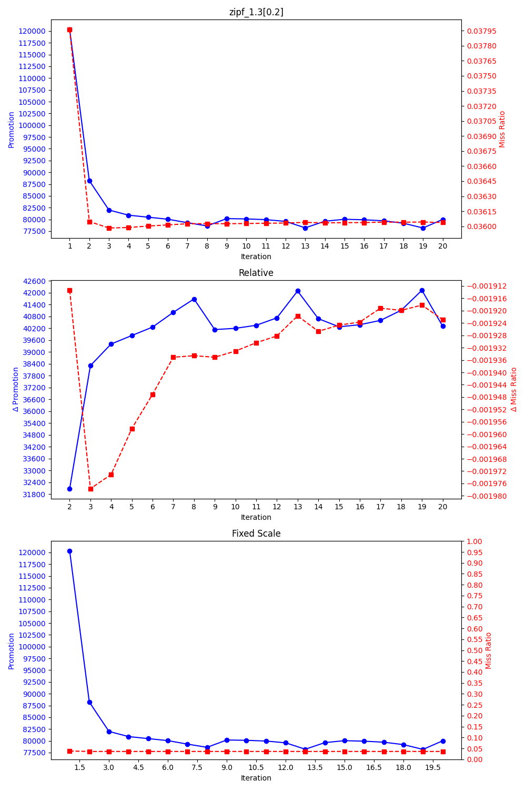  
> **Trace Path**: zipf_1.3.oracleGeneral  
> **Desc**: 0.2  
> **Cache Size**: 104  
> **Ignore Obj Size**: 0  
> **Total Request**: 5,996,178  
> **First Promotion**: 120,302  
> **Last Promotion**: 79,993  
> **Promotion Reduced**: 40,309  

> 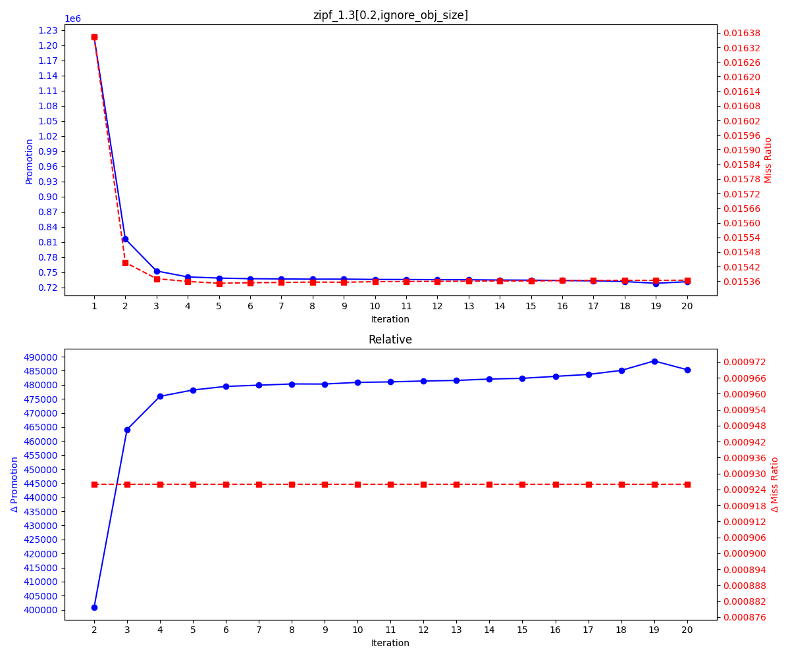  
> **Trace Path**: zipf_1.3.oracleGeneral  
> **Desc**: 0.2,ignore_obj_size  
> **Cache Size**: 134035  
> **Ignore Obj Size**: 1  
> **Total Request**: 100,000,000  
> **First Promotion**: 1,216,355  
> **Last Promotion**: 730,974  
> **Promotion Reduced**: 485,381  

> 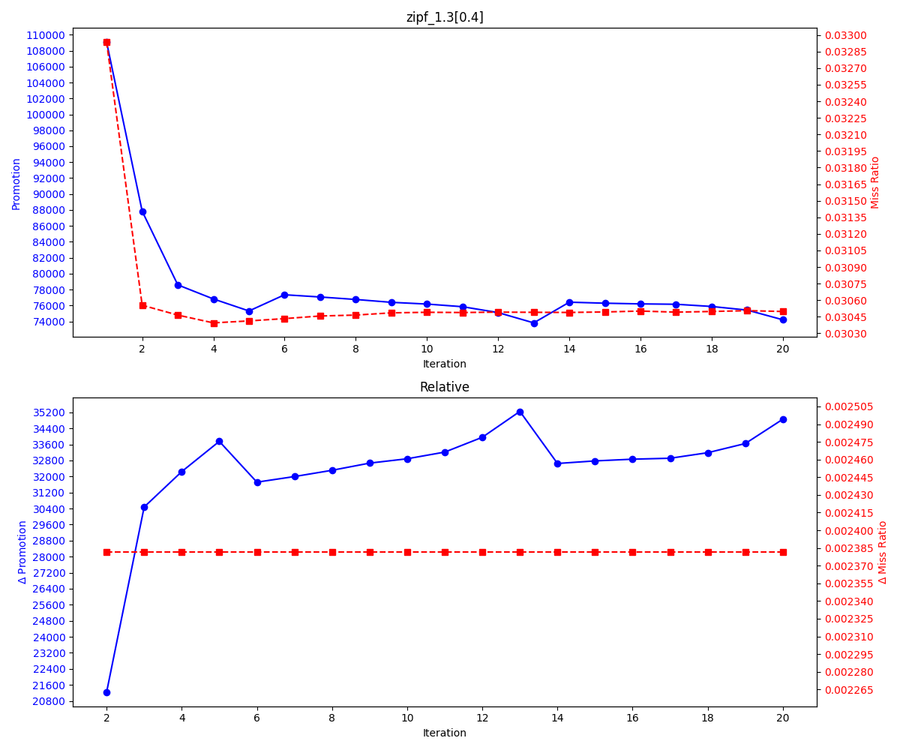  
> **Trace Path**: zipf_1.3.oracleGeneral  
> **Desc**: 0.4  
> **Cache Size**: 150  
> **Ignore Obj Size**: 0  
> **Total Request**: 6,400,292  
> **First Promotion**: 109,078  
> **Last Promotion**: 74,220  
> **Promotion Reduced**: 34,858  

> 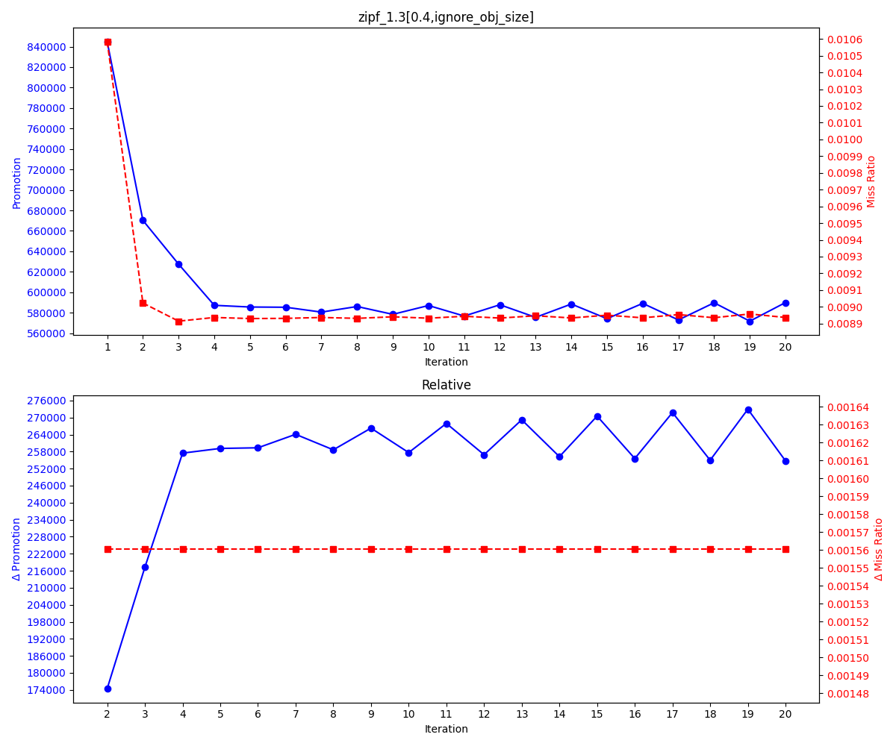  
> **Trace Path**: zipf_1.3.oracleGeneral  
> **Desc**: 0.4,ignore_obj_size  
> **Cache Size**: 268070  
> **Ignore Obj Size**: 1  
> **Total Request**: 100,000,000  
> **First Promotion**: 844,718  
> **Last Promotion**: 590,003  
> **Promotion Reduced**: 254,715  

