# RESULT
## 1351
> 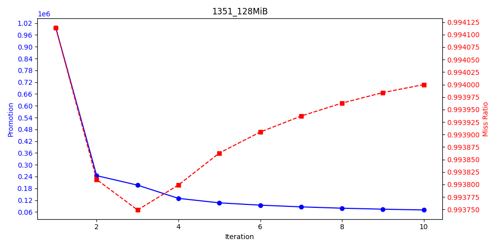  
> **Trace Path**: 1351.oracleGeneral.zst  
> **Cache Size**: 128MiB  
> **Total Request**: 195,824,302  
> **First Promotion**: 997,229  
> **Last Promotion**: 70,164  
> **Promotion Reduced**: 927,065  

>   
> **Trace Path**: 1351.oracleGeneral.zst  
> **Cache Size**: 256MiB  
> **Total Request**: 195,824,302  
> **First Promotion**: 5,301,037  
> **Last Promotion**: 440,234  
> **Promotion Reduced**: 4,860,803  

> 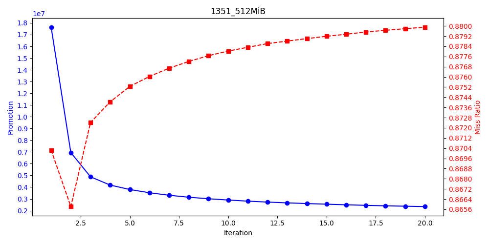  
> **Trace Path**: 1351.oracleGeneral.zst  
> **Cache Size**: 512MiB  
> **Total Request**: 195,824,302  
> **First Promotion**: 17,635,612  
> **Last Promotion**: 2,901,452  
> **Promotion Reduced**: 14,734,160  

> 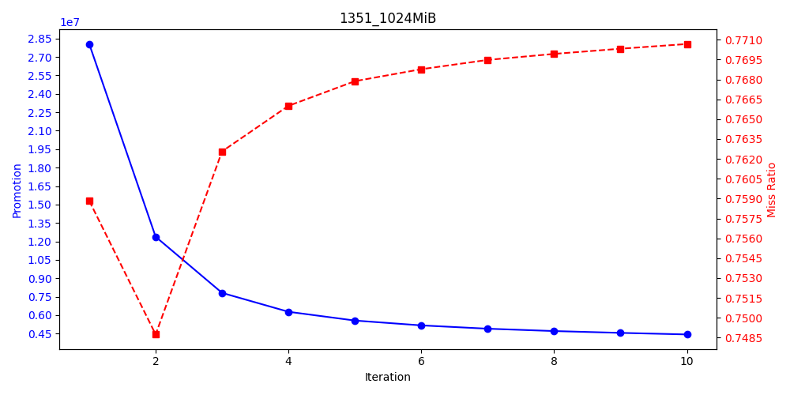  
> **Trace Path**: 1351.oracleGeneral.zst  
> **Cache Size**: 1024MiB  
> **Total Request**: 195,824,302  
> **First Promotion**: 28,054,961  
> **Last Promotion**: 4,429,762  
> **Promotion Reduced**: 23,625,199  

> 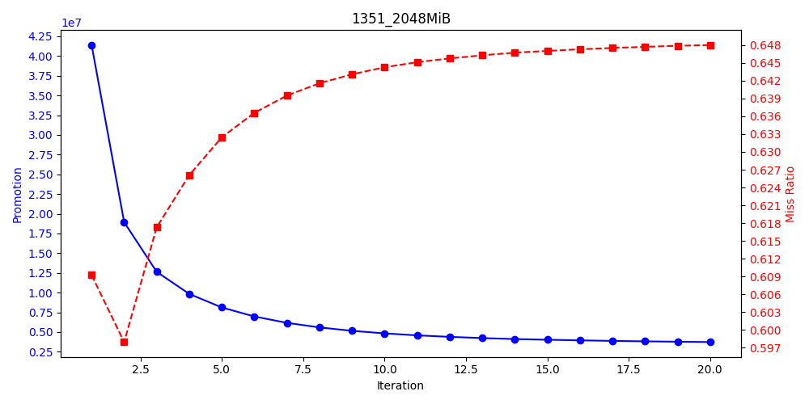  
> **Trace Path**: 1351.oracleGeneral.zst  
> **Cache Size**: 2048MiB  
> **Total Request**: 195,824,302  
> **First Promotion**: 41,401,457  
> **Last Promotion**: 4,827,531  
> **Promotion Reduced**: 36,573,926  

## 2016_LUN1
> 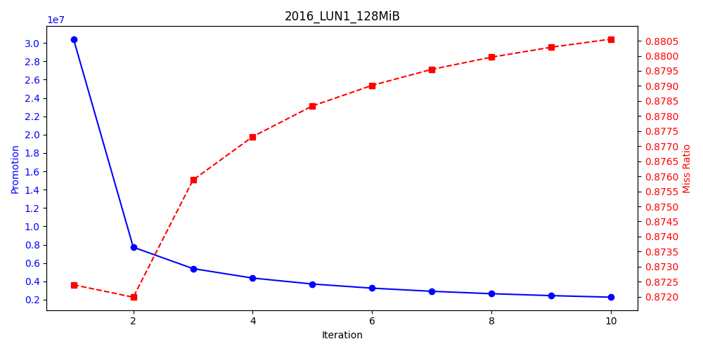  
> **Trace Path**: 2016_LUN1.oracleGeneral.zst  
> **Cache Size**: 128MiB  
> **Total Request**: 492,030,661  
> **First Promotion**: 30,415,709  
> **Last Promotion**: 2,276,385  
> **Promotion Reduced**: 28,139,324  

> 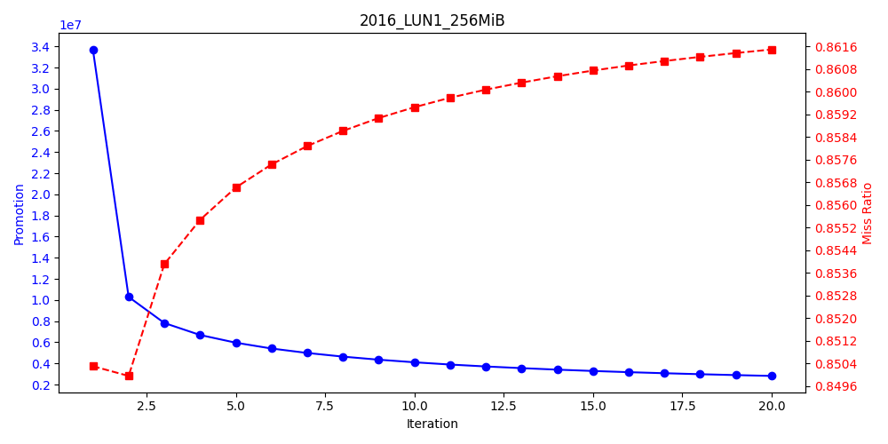  
> **Trace Path**: 2016_LUN1.oracleGeneral.zst  
> **Cache Size**: 256MiB  
> **Total Request**: 492,030,661  
> **First Promotion**: 33,713,860  
> **Last Promotion**: 4,105,352  
> **Promotion Reduced**: 29,608,508  

>   
> **Trace Path**: 2016_LUN1.oracleGeneral.zst  
> **Cache Size**: 512MiB  
> **Total Request**: 492,030,661  
> **First Promotion**: 36,402,647  
> **Last Promotion**: 6,794,294  
> **Promotion Reduced**: 29,608,353  

> 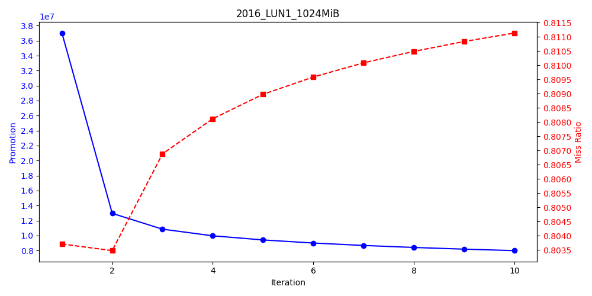  
> **Trace Path**: 2016_LUN1.oracleGeneral.zst  
> **Cache Size**: 1024MiB  
> **Total Request**: 492,030,661  
> **First Promotion**: 37,028,131  
> **Last Promotion**: 7,983,279  
> **Promotion Reduced**: 29,044,852  

> 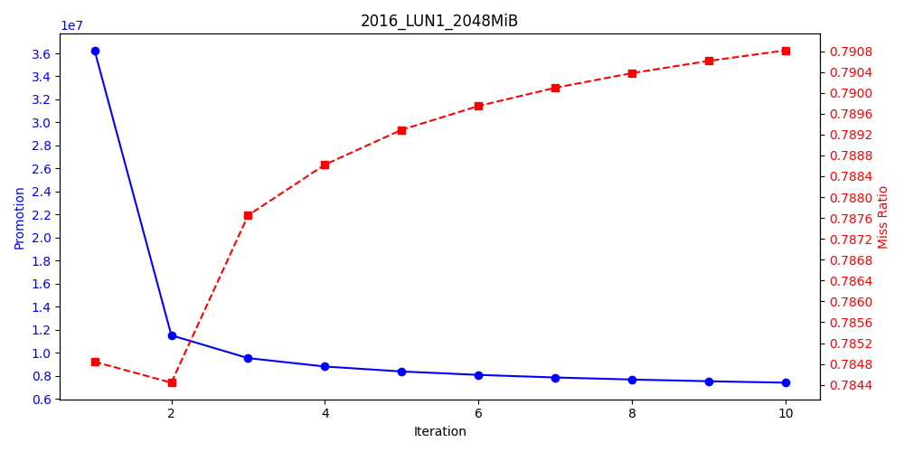  
> **Trace Path**: 2016_LUN1.oracleGeneral.zst  
> **Cache Size**: 2048MiB  
> **Total Request**: 492,030,661  
> **First Promotion**: 36,258,234  
> **Last Promotion**: 7,417,291  
> **Promotion Reduced**: 28,840,943  

## 7
> 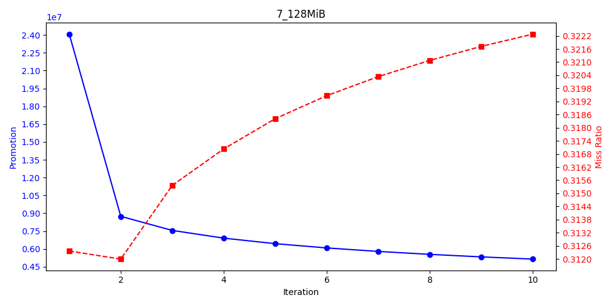  
> **Trace Path**: ../trace/7.oracleGeneral.zst  
> **Cache Size**: 128MiB  
> **Total Request**: 265,694,431  
> **First Promotion**: 24,075,064  
> **Last Promotion**: 5,143,728  
> **Promotion Reduced**: 18,931,336  

> 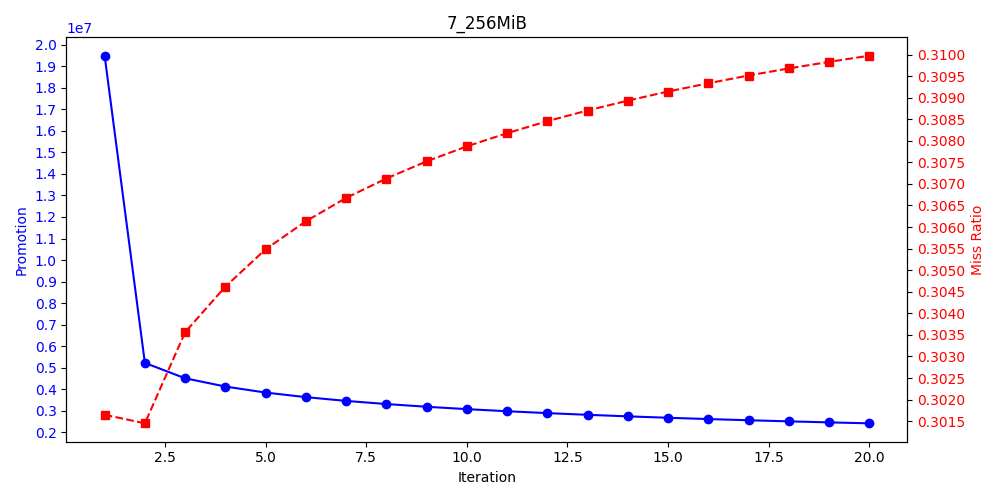  
> **Trace Path**: ../trace/7.oracleGeneral.zst  
> **Cache Size**: 256MiB  
> **Total Request**: 265,694,431  
> **First Promotion**: 19,489,517  
> **Last Promotion**: 3,074,913  
> **Promotion Reduced**: 16,414,604  

> 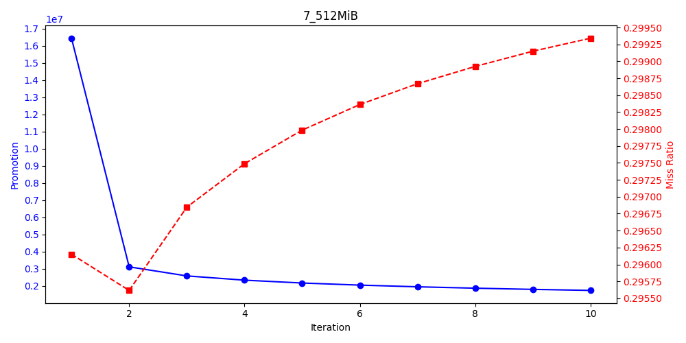  
> **Trace Path**: ../trace/7.oracleGeneral.zst  
> **Cache Size**: 512MiB  
> **Total Request**: 265,694,431  
> **First Promotion**: 16,438,200  
> **Last Promotion**: 1,739,943  
> **Promotion Reduced**: 14,698,257  

> 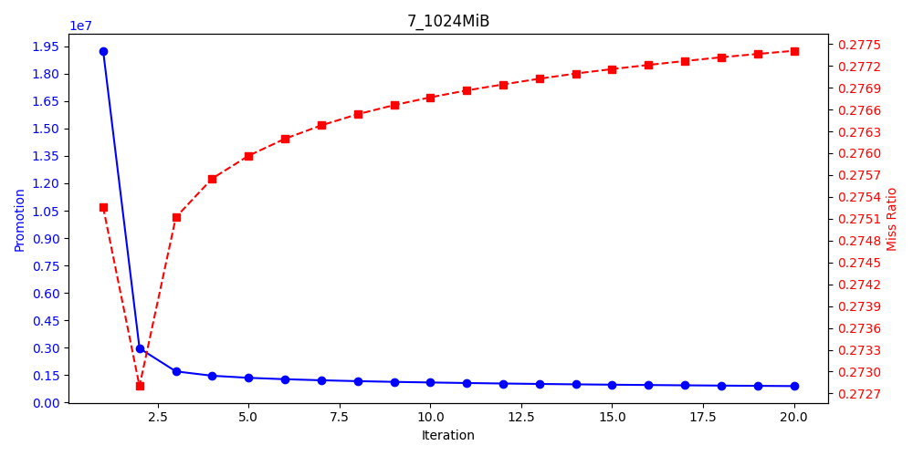  
> **Trace Path**: ../trace/7.oracleGeneral.zst  
> **Cache Size**: 1024MiB  
> **Total Request**: 265,694,431  
> **First Promotion**: 19,246,415  
> **Last Promotion**: 1,101,329  
> **Promotion Reduced**: 18,145,086  

>   
> **Trace Path**: ../trace/7.oracleGeneral.zst  
> **Cache Size**: 2048MiB  
> **Total Request**: 265,694,431  
> **First Promotion**: 24,015,942  
> **Last Promotion**: 1,071,944  
> **Promotion Reduced**: 22,943,998  

## block_traces_5
>   
> **Trace Path**: block_traces_5.oracleGeneral.bin.zst  
> **Cache Size**: 128MiB  
> **Total Request**: 14,556,172  
> **First Promotion**: 1,830,848  
> **Last Promotion**: 1,080  
> **Promotion Reduced**: 1,829,768  

> 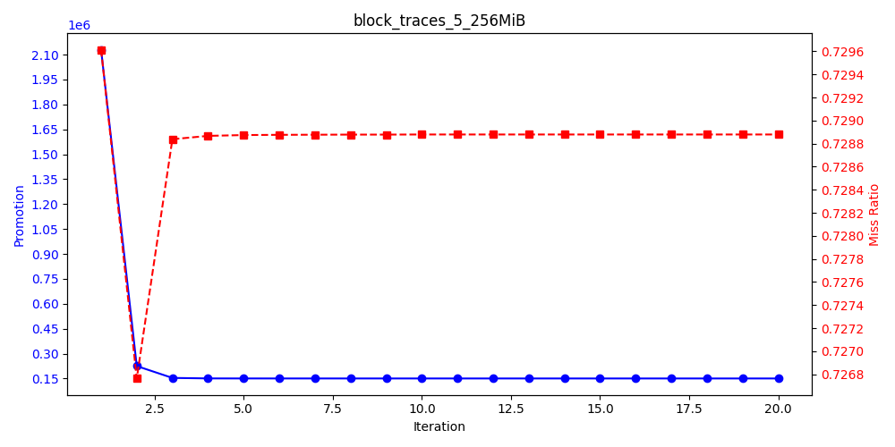  
> **Trace Path**: block_traces_5.oracleGeneral.bin.zst  
> **Cache Size**: 256MiB  
> **Total Request**: 14,556,172  
> **First Promotion**: 2,128,650  
> **Last Promotion**: 150,525  
> **Promotion Reduced**: 1,978,125  

>   
> **Trace Path**: block_traces_5.oracleGeneral.bin.zst  
> **Cache Size**: 512MiB  
> **Total Request**: 14,556,172  
> **First Promotion**: 2,597,456  
> **Last Promotion**: 282,823  
> **Promotion Reduced**: 2,314,633  

>   
> **Trace Path**: block_traces_5.oracleGeneral.bin.zst  
> **Cache Size**: 1024MiB  
> **Total Request**: 14,556,172  
> **First Promotion**: 2,881,691  
> **Last Promotion**: 206,190  
> **Promotion Reduced**: 2,675,501  

> 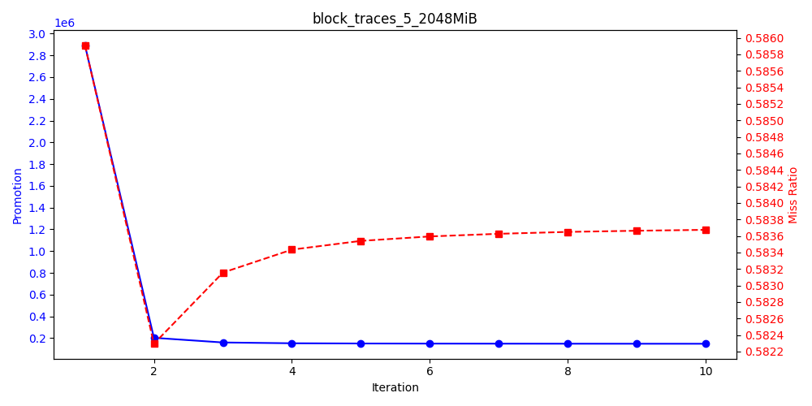  
> **Trace Path**: block_traces_5.oracleGeneral.bin.zst  
> **Cache Size**: 2048MiB  
> **Total Request**: 14,556,172  
> **First Promotion**: 2,892,780  
> **Last Promotion**: 148,646  
> **Promotion Reduced**: 2,744,134  

## cloudPhysicsIO
> 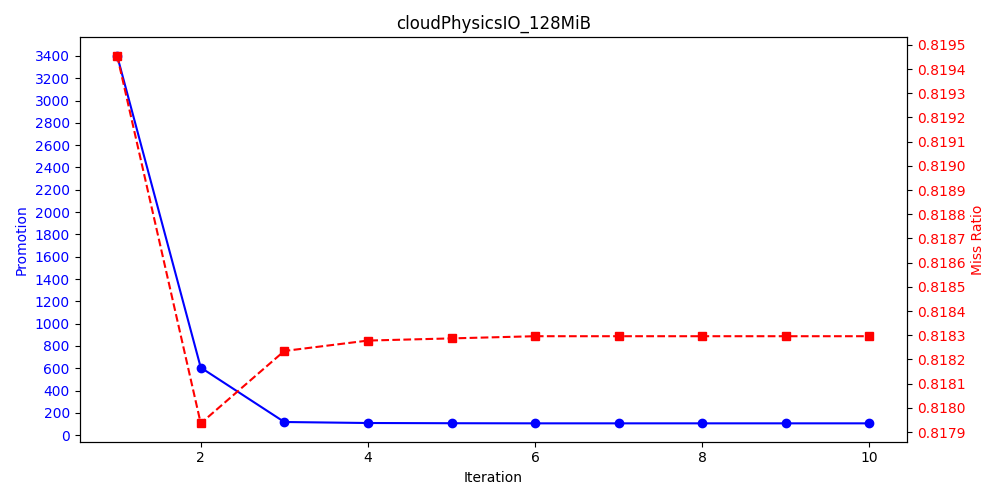  
> **Trace Path**: ../trace/cloudPhysicsIO.oracleGeneral.bin  
> **Cache Size**: 128MiB  
> **Total Request**: 113,872  
> **First Promotion**: 3,402  
> **Last Promotion**: 106  
> **Promotion Reduced**: 3,296  

> 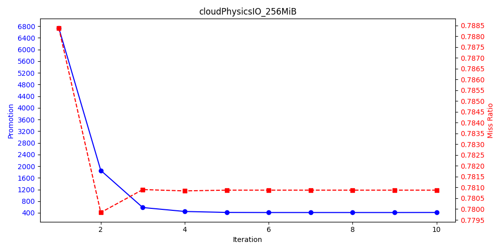  
> **Trace Path**: ../trace/cloudPhysicsIO.oracleGeneral.bin  
> **Cache Size**: 256MiB  
> **Total Request**: 113,872  
> **First Promotion**: 6,739  
> **Last Promotion**: 413  
> **Promotion Reduced**: 6,326  

> 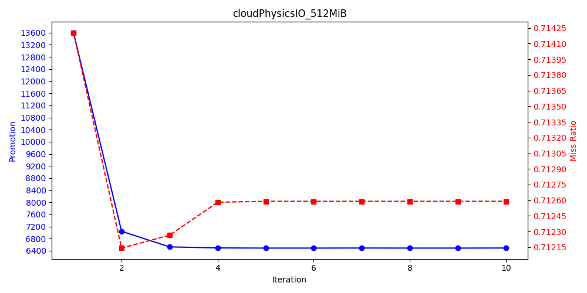  
> **Trace Path**: ../trace/cloudPhysicsIO.oracleGeneral.bin  
> **Cache Size**: 512MiB  
> **Total Request**: 113,872  
> **First Promotion**: 13,602  
> **Last Promotion**: 6,490  
> **Promotion Reduced**: 7,112  

> 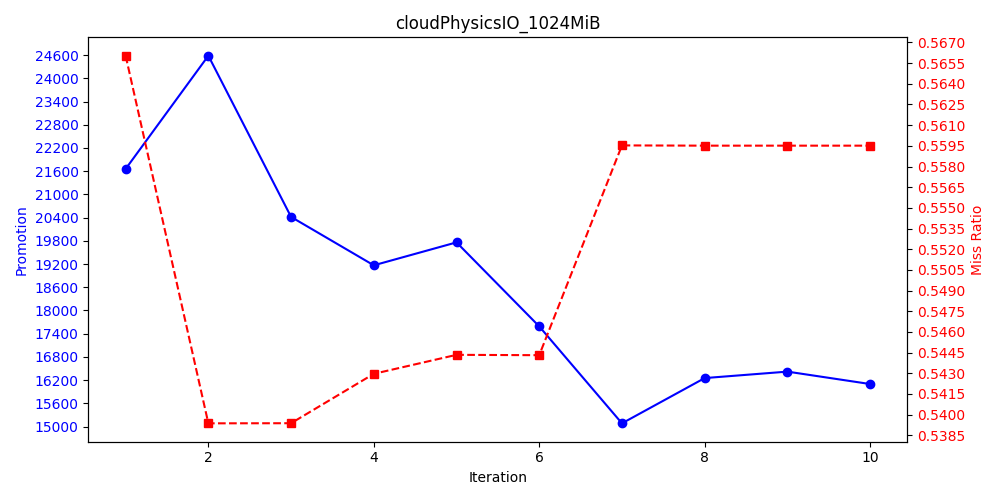  
> **Trace Path**: ../trace/cloudPhysicsIO.oracleGeneral.bin  
> **Cache Size**: 1024MiB  
> **Total Request**: 113,872  
> **First Promotion**: 21,658  
> **Last Promotion**: 16,098  
> **Promotion Reduced**: 5,560  

> 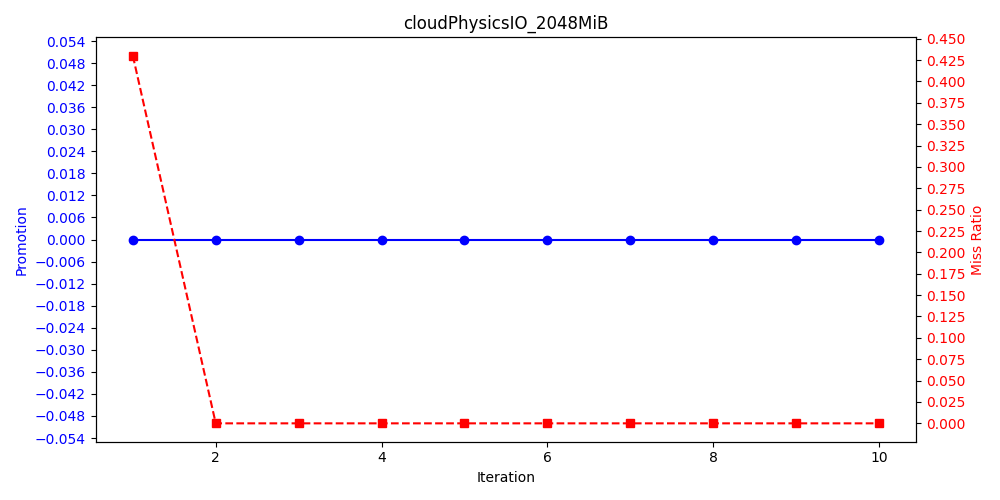  
> **Trace Path**: ../trace/cloudPhysicsIO.oracleGeneral.bin  
> **Cache Size**: 2048MiB  
> **Total Request**: 113,872  
> **First Promotion**: 0  
> **Last Promotion**: 0  
> **Promotion Reduced**: 0  

## cluster50
> 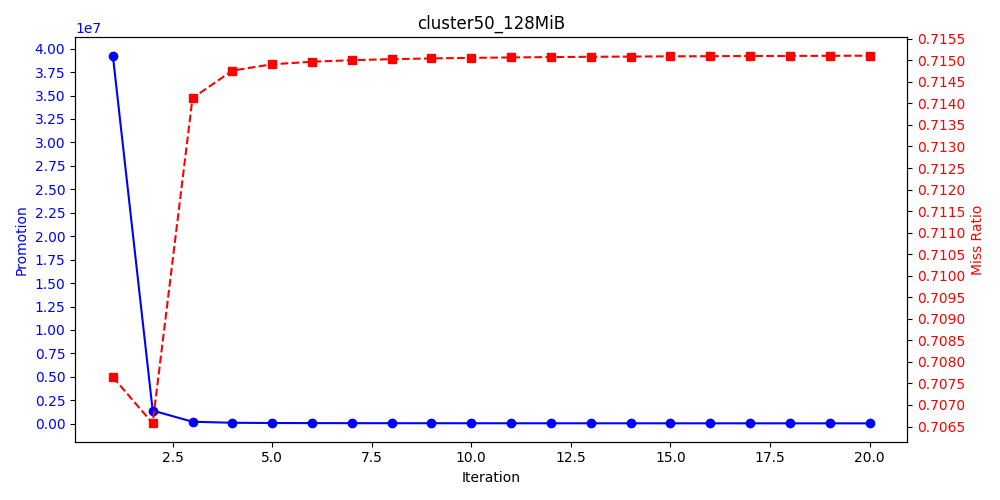  
> **Trace Path**: ../../../data/cluster50.oracleGeneral.zst  
> **Cache Size**: 128MiB  
> **Total Request**: 139,655,585  
> **First Promotion**: 39,246,683  
> **Last Promotion**: 55,699  
> **Promotion Reduced**: 39,190,984  

> 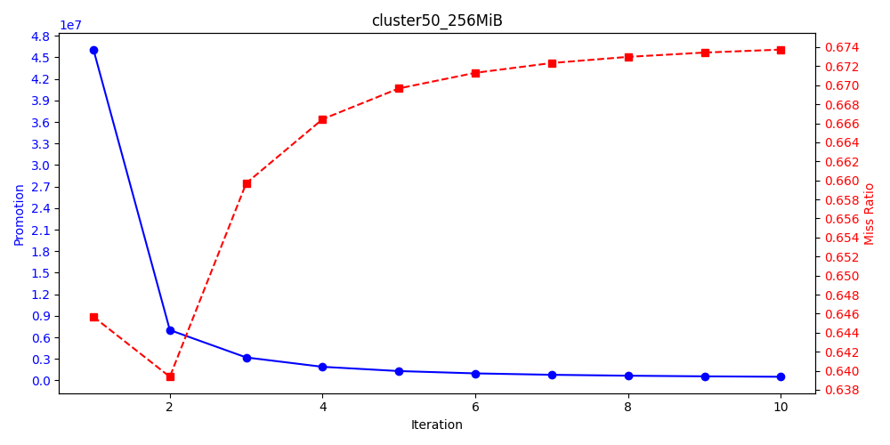  
> **Trace Path**: ../../../data/cluster50.oracleGeneral.zst  
> **Cache Size**: 256MiB  
> **Total Request**: 139,655,585  
> **First Promotion**: 46,084,765  
> **Last Promotion**: 505,984  
> **Promotion Reduced**: 45,578,781  

> 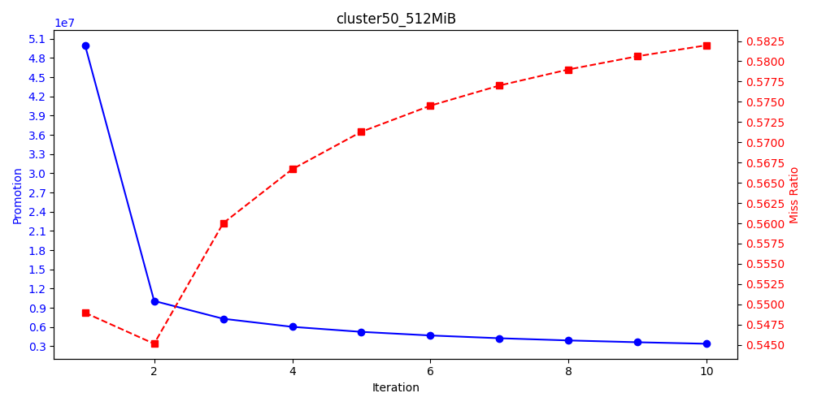  
> **Trace Path**: ../../../data/cluster50.oracleGeneral.zst  
> **Cache Size**: 512MiB  
> **Total Request**: 139,655,585  
> **First Promotion**: 49,979,108  
> **Last Promotion**: 3,393,620  
> **Promotion Reduced**: 46,585,488  

> 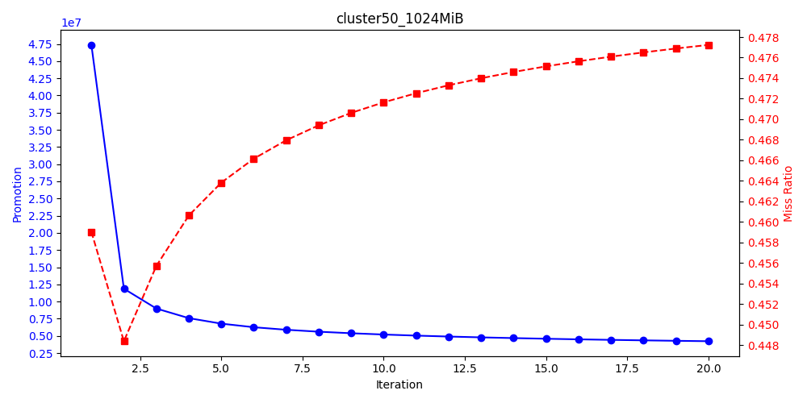  
> **Trace Path**: ../../../data/cluster50.oracleGeneral.zst  
> **Cache Size**: 1024MiB  
> **Total Request**: 139,655,585  
> **First Promotion**: 47,360,904  
> **Last Promotion**: 5,197,939  
> **Promotion Reduced**: 42,162,965  

>   
> **Trace Path**: ../../../data/cluster50.oracleGeneral.zst  
> **Cache Size**: 2048MiB  
> **Total Request**: 139,655,585  
> **First Promotion**: 47,819,137  
> **Last Promotion**: 6,142,735  
> **Promotion Reduced**: 41,676,402  

## fiu_cheetah.cs.fiu.edu-110108-113008
> 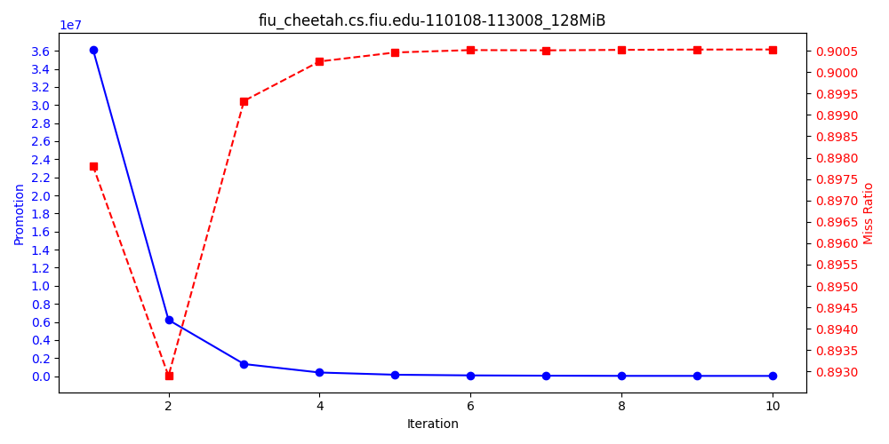  
> **Trace Path**: fiu_cheetah.cs.fiu.edu-110108-113008.oracleGeneral.zst  
> **Cache Size**: 128MiB  
> **Total Request**: 442,393,092  
> **First Promotion**: 36,144,177  
> **Last Promotion**: 30,453  
> **Promotion Reduced**: 36,113,724  

> 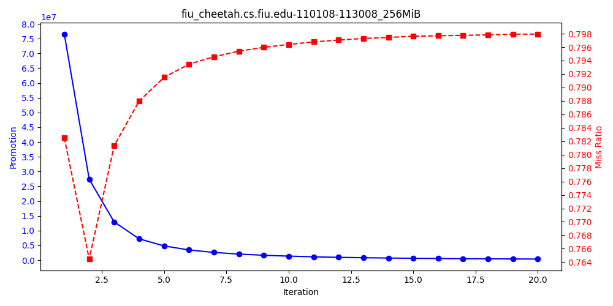  
> **Trace Path**: fiu_cheetah.cs.fiu.edu-110108-113008.oracleGeneral.zst  
> **Cache Size**: 256MiB  
> **Total Request**: 442,393,092  
> **First Promotion**: 76,565,791  
> **Last Promotion**: 1,347,601  
> **Promotion Reduced**: 75,218,190  

> 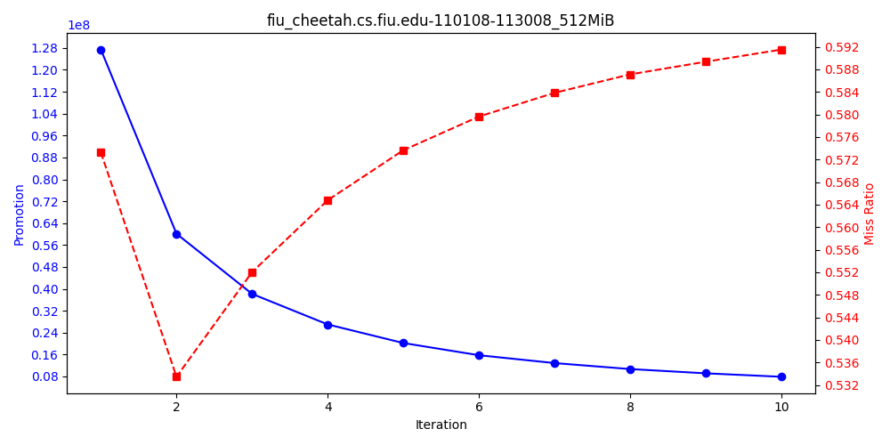  
> **Trace Path**: fiu_cheetah.cs.fiu.edu-110108-113008.oracleGeneral.zst  
> **Cache Size**: 512MiB  
> **Total Request**: 442,393,092  
> **First Promotion**: 127,399,940  
> **Last Promotion**: 7,875,147  
> **Promotion Reduced**: 119,524,793  

>   
> **Trace Path**: fiu_cheetah.cs.fiu.edu-110108-113008.oracleGeneral.zst  
> **Cache Size**: 1024MiB  
> **Total Request**: 442,393,092  
> **First Promotion**: 135,896,867  
> **Last Promotion**: 19,989,879  
> **Promotion Reduced**: 115,906,988  

> 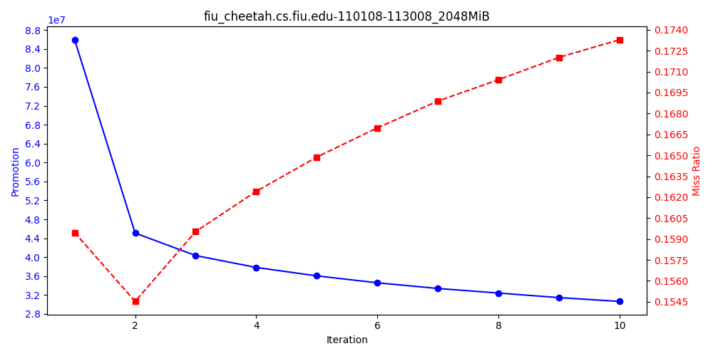  
> **Trace Path**: fiu_cheetah.cs.fiu.edu-110108-113008.oracleGeneral.zst  
> **Cache Size**: 2048MiB  
> **Total Request**: 442,393,092  
> **First Promotion**: 85,970,828  
> **Last Promotion**: 30,655,504  
> **Promotion Reduced**: 55,315,324  

## meta_kvcache_traces_1
> 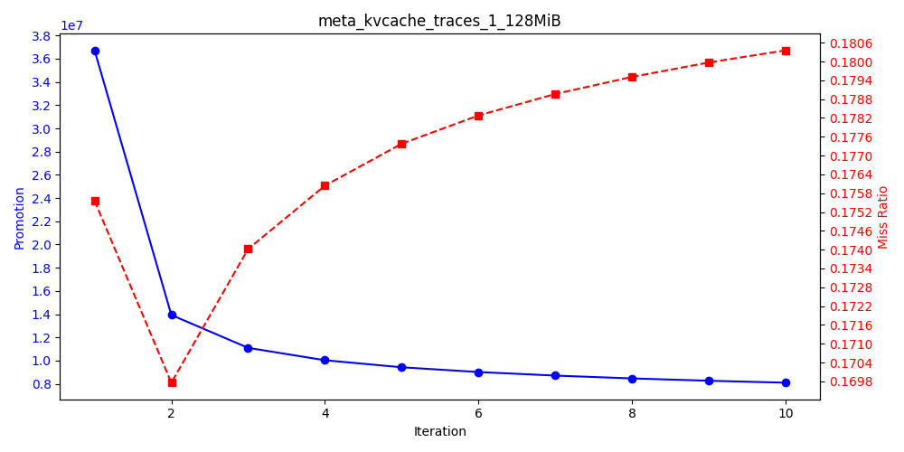  
> **Trace Path**: meta_kvcache_traces_1.oracleGeneral.bin.zst  
> **Cache Size**: 128MiB  
> **Total Request**: 335,173,084  
> **First Promotion**: 36,719,979  
> **Last Promotion**: 8,095,237  
> **Promotion Reduced**: 28,624,742  

> 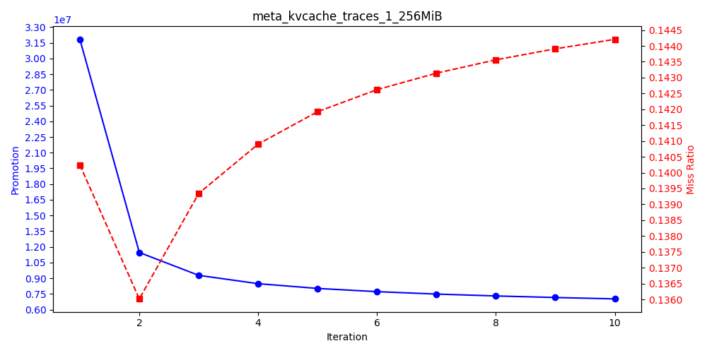  
> **Trace Path**: meta_kvcache_traces_1.oracleGeneral.bin.zst  
> **Cache Size**: 256MiB  
> **Total Request**: 335,173,084  
> **First Promotion**: 31,830,471  
> **Last Promotion**: 7,028,254  
> **Promotion Reduced**: 24,802,217  

> 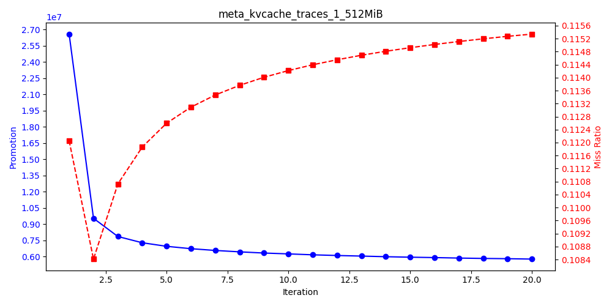  
> **Trace Path**: meta_kvcache_traces_1.oracleGeneral.bin.zst  
> **Cache Size**: 512MiB  
> **Total Request**: 335,173,084  
> **First Promotion**: 26,589,855  
> **Last Promotion**: 6,257,707  
> **Promotion Reduced**: 20,332,148  

> 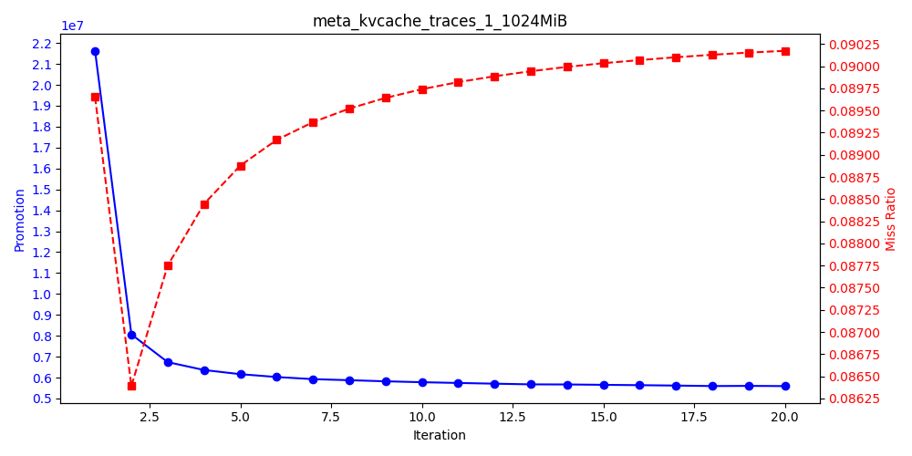  
> **Trace Path**: meta_kvcache_traces_1.oracleGeneral.bin.zst  
> **Cache Size**: 1024MiB  
> **Total Request**: 335,173,084  
> **First Promotion**: 21,628,966  
> **Last Promotion**: 5,781,038  
> **Promotion Reduced**: 15,847,928  

>   
> **Trace Path**: meta_kvcache_traces_1.oracleGeneral.bin.zst  
> **Cache Size**: 2048MiB  
> **Total Request**: 335,173,084  
> **First Promotion**: 16,947,046  
> **Last Promotion**: 5,449,771  
> **Promotion Reduced**: 11,497,275  

## meta_rnha
> 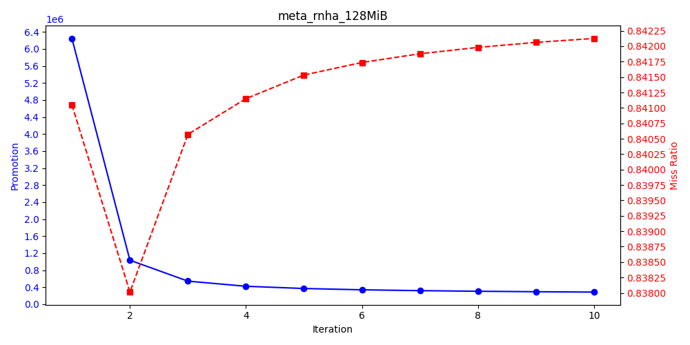  
> **Trace Path**: ../trace/meta_rnha.oracleGeneral.zst  
> **Cache Size**: 128MiB  
> **Total Request**: 96,680,668  
> **First Promotion**: 6,246,080  
> **Last Promotion**: 285,707  
> **Promotion Reduced**: 5,960,373  

> 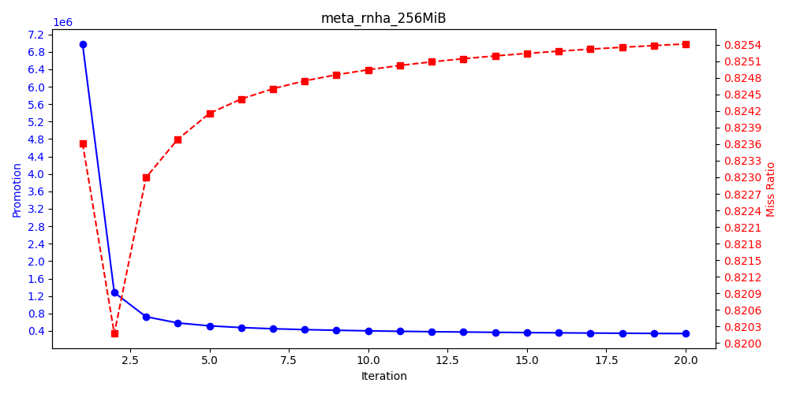  
> **Trace Path**: ../trace/meta_rnha.oracleGeneral.zst  
> **Cache Size**: 256MiB  
> **Total Request**: 96,680,668  
> **First Promotion**: 6,981,627  
> **Last Promotion**: 401,687  
> **Promotion Reduced**: 6,579,940  

> 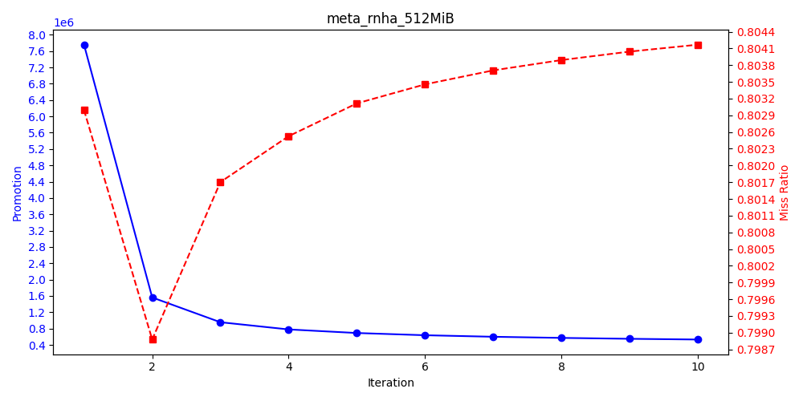  
> **Trace Path**: ../trace/meta_rnha.oracleGeneral.zst  
> **Cache Size**: 512MiB  
> **Total Request**: 96,680,668  
> **First Promotion**: 7,757,460  
> **Last Promotion**: 530,977  
> **Promotion Reduced**: 7,226,483  

> 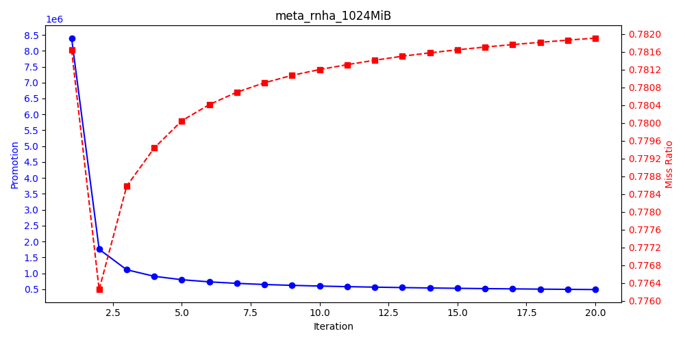  
> **Trace Path**: ../trace/meta_rnha.oracleGeneral.zst  
> **Cache Size**: 1024MiB  
> **Total Request**: 96,680,668  
> **First Promotion**: 8,399,364  
> **Last Promotion**: 599,447  
> **Promotion Reduced**: 7,799,917  

>   
> **Trace Path**: ../trace/meta_rnha.oracleGeneral.zst  
> **Cache Size**: 2048MiB  
> **Total Request**: 96,680,668  
> **First Promotion**: 9,077,791  
> **Last Promotion**: 649,650  
> **Promotion Reduced**: 8,428,141  

## msr_prxy_1
>   
> **Trace Path**: msr_prxy_1.oracleGeneral.zst  
> **Cache Size**: 128MiB  
> **Total Request**: 168,638,964  
> **First Promotion**: 26,542,223  
> **Last Promotion**: 22,478,548  
> **Promotion Reduced**: 4,063,675  

> 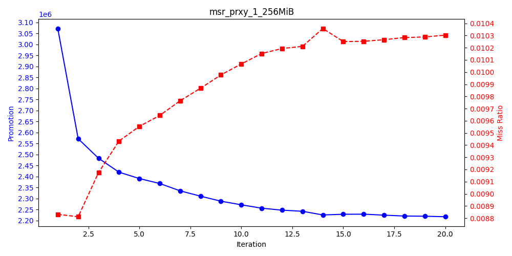  
> **Trace Path**: msr_prxy_1.oracleGeneral.zst  
> **Cache Size**: 256MiB  
> **Total Request**: 168,638,964  
> **First Promotion**: 3,072,713  
> **Last Promotion**: 2,271,103  
> **Promotion Reduced**: 801,610  

>   
> **Trace Path**: msr_prxy_1.oracleGeneral.zst  
> **Cache Size**: 512MiB  
> **Total Request**: 168,638,964  
> **First Promotion**: 1,302,536  
> **Last Promotion**: 810,700  
> **Promotion Reduced**: 491,836  

> 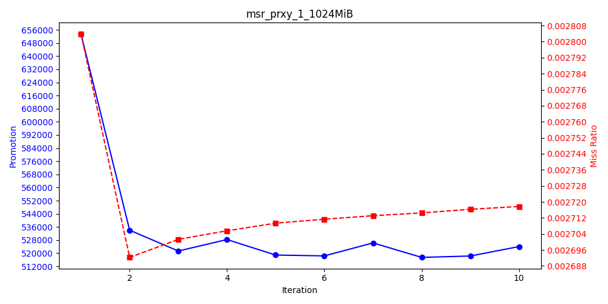  
> **Trace Path**: msr_prxy_1.oracleGeneral.zst  
> **Cache Size**: 1024MiB  
> **Total Request**: 168,638,964  
> **First Promotion**: 653,558  
> **Last Promotion**: 524,036  
> **Promotion Reduced**: 129,522  

> 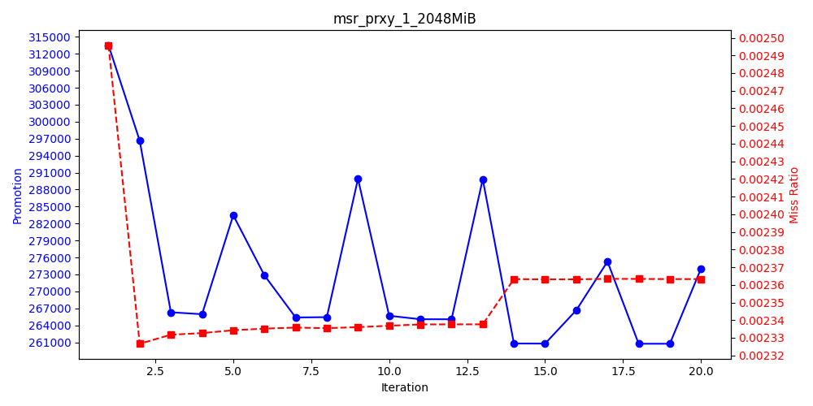  
> **Trace Path**: msr_prxy_1.oracleGeneral.zst  
> **Cache Size**: 2048MiB  
> **Total Request**: 168,638,964  
> **First Promotion**: 313,520  
> **Last Promotion**: 265,687  
> **Promotion Reduced**: 47,833  

## w01
> 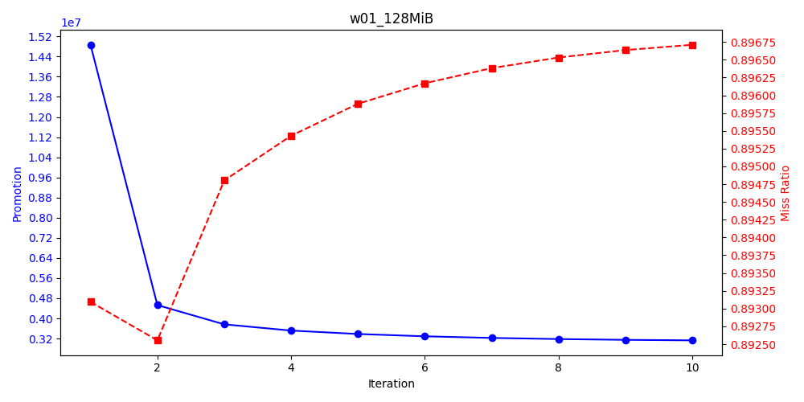  
> **Trace Path**: w01.oracleGeneral.bin.zst  
> **Cache Size**: 128MiB  
> **Total Request**: 215,796,257  
> **First Promotion**: 14,867,761  
> **Last Promotion**: 3,128,184  
> **Promotion Reduced**: 11,739,577  

> 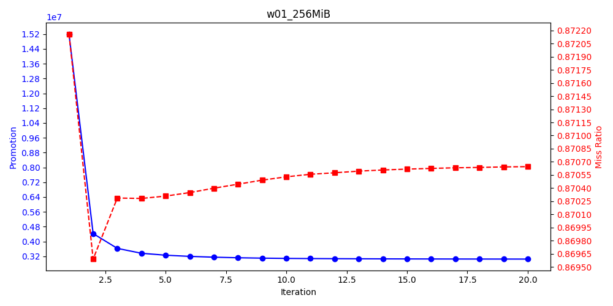  
> **Trace Path**: w01.oracleGeneral.bin.zst  
> **Cache Size**: 256MiB  
> **Total Request**: 215,796,257  
> **First Promotion**: 15,198,565  
> **Last Promotion**: 3,087,038  
> **Promotion Reduced**: 12,111,527  

> 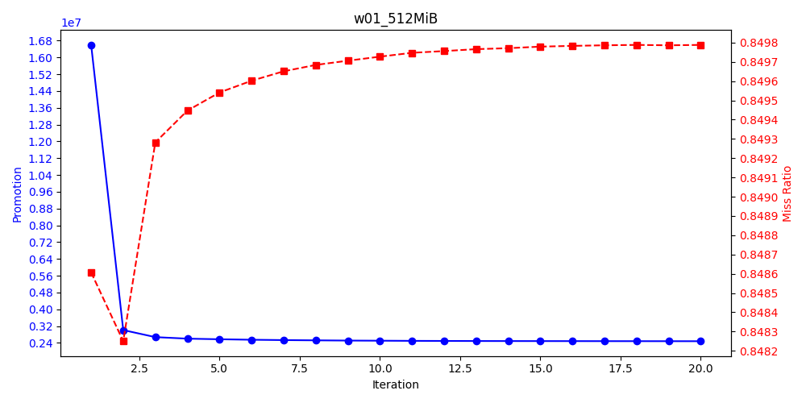  
> **Trace Path**: w01.oracleGeneral.bin.zst  
> **Cache Size**: 512MiB  
> **Total Request**: 215,796,257  
> **First Promotion**: 16,595,778  
> **Last Promotion**: 2,506,006  
> **Promotion Reduced**: 14,089,772  

> 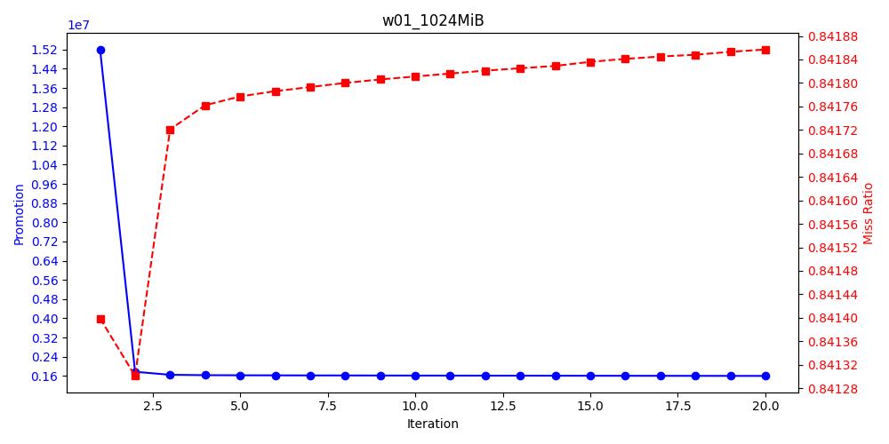  
> **Trace Path**: w01.oracleGeneral.bin.zst  
> **Cache Size**: 1024MiB  
> **Total Request**: 215,796,257  
> **First Promotion**: 15,203,178  
> **Last Promotion**: 1,611,918  
> **Promotion Reduced**: 13,591,260  

> 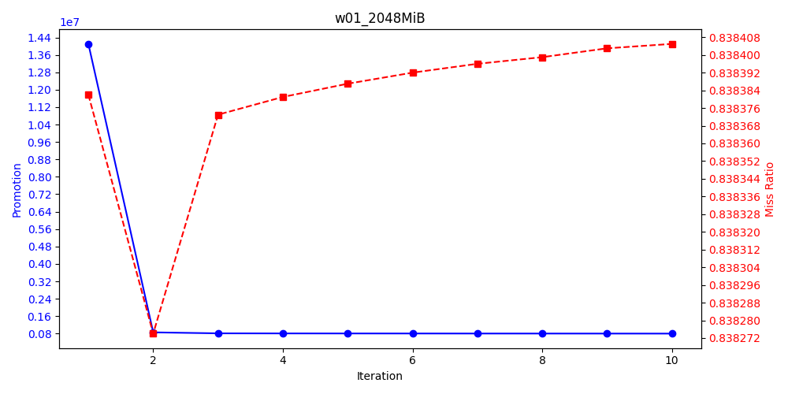  
> **Trace Path**: w01.oracleGeneral.bin.zst  
> **Cache Size**: 2048MiB  
> **Total Request**: 215,796,257  
> **First Promotion**: 14,105,626  
> **Last Promotion**: 798,823  
> **Promotion Reduced**: 13,306,803  

## wiki_2019t
> 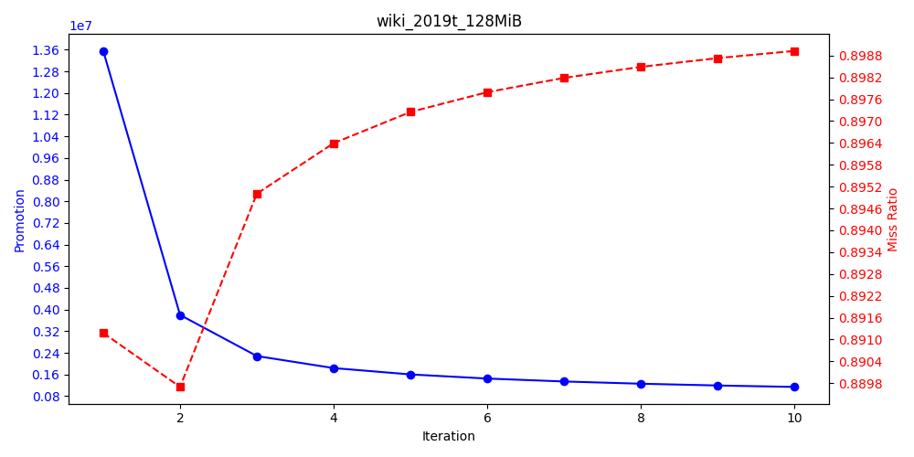  
> **Trace Path**: ../trace/wiki_2019t.oracleGeneral.zst  
> **Cache Size**: 128MiB  
> **Total Request**: 207,646,002  
> **First Promotion**: 13,553,355  
> **Last Promotion**: 1,142,285  
> **Promotion Reduced**: 12,411,070  

> 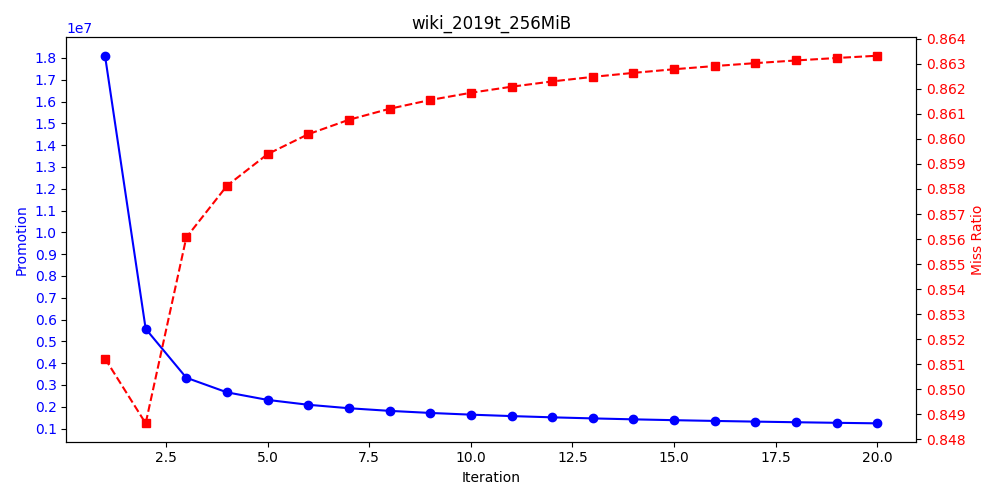  
> **Trace Path**: ../trace/wiki_2019t.oracleGeneral.zst  
> **Cache Size**: 256MiB  
> **Total Request**: 207,646,002  
> **First Promotion**: 18,101,938  
> **Last Promotion**: 1,639,010  
> **Promotion Reduced**: 16,462,928  

> 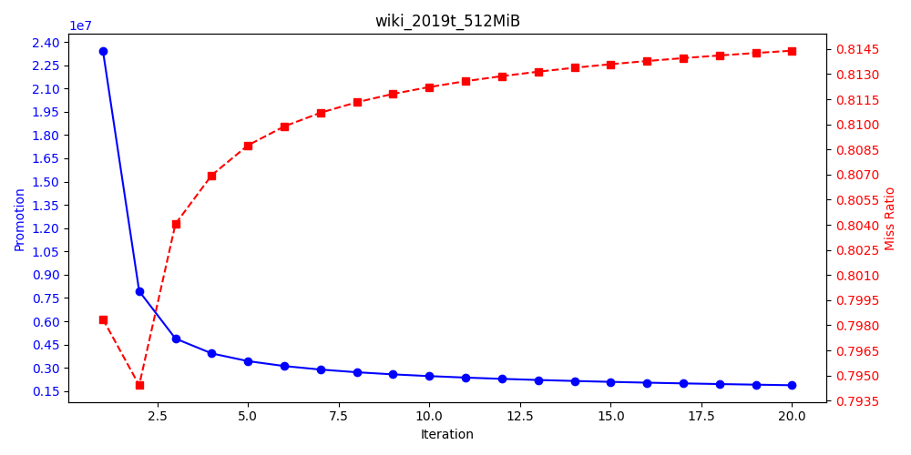  
> **Trace Path**: ../trace/wiki_2019t.oracleGeneral.zst  
> **Cache Size**: 512MiB  
> **Total Request**: 207,646,002  
> **First Promotion**: 23,431,968  
> **Last Promotion**: 2,469,238  
> **Promotion Reduced**: 20,962,730  

> 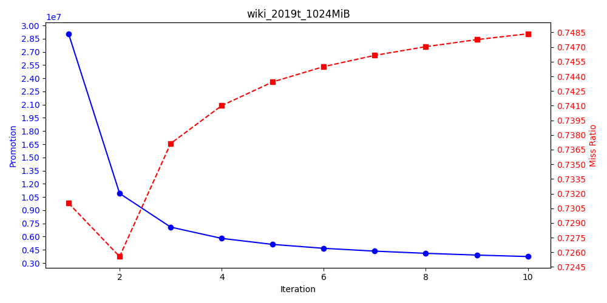  
> **Trace Path**: ../trace/wiki_2019t.oracleGeneral.zst  
> **Cache Size**: 1024MiB  
> **Total Request**: 207,646,002  
> **First Promotion**: 29,059,808  
> **Last Promotion**: 3,736,671  
> **Promotion Reduced**: 25,323,137  

> 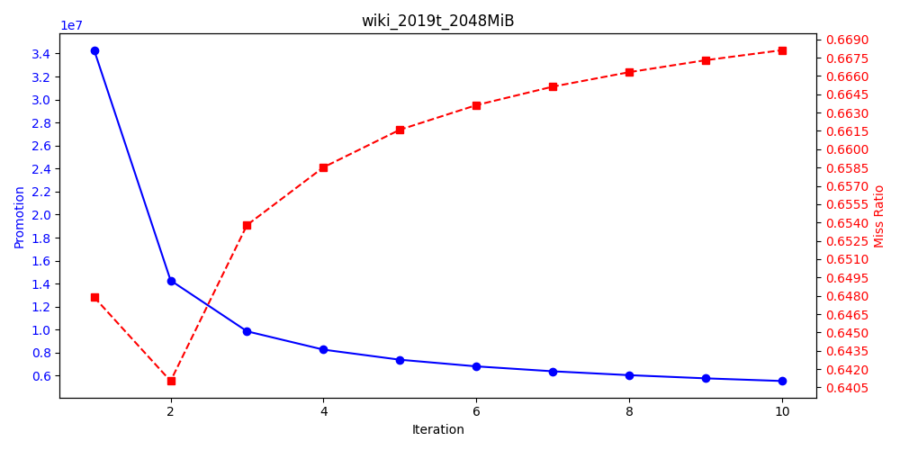  
> **Trace Path**: ../trace/wiki_2019t.oracleGeneral.zst  
> **Cache Size**: 2048MiB  
> **Total Request**: 207,646,002  
> **First Promotion**: 34,293,293  
> **Last Promotion**: 5,541,184  
> **Promotion Reduced**: 28,752,109  

## zipf_0.3_10_100
> 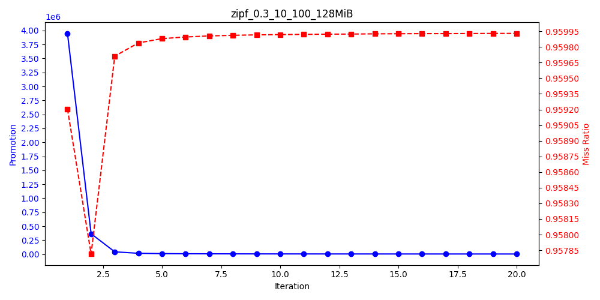  
> **Trace Path**: zipf_0.3_10_100.oracleGeneral  
> **Cache Size**: 128MiB  
> **Total Request**: 100,000,000  
> **First Promotion**: 3,943,760  
> **Last Promotion**: 4,994  
> **Promotion Reduced**: 3,938,766  

> 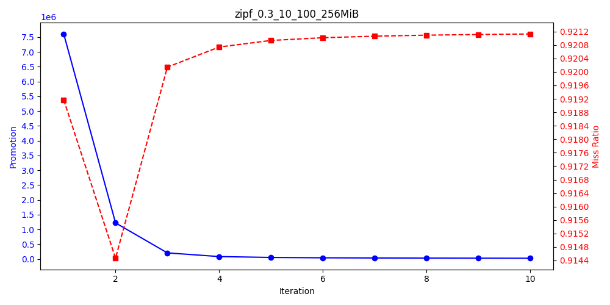  
> **Trace Path**: zipf_0.3_10_100.oracleGeneral  
> **Cache Size**: 256MiB  
> **Total Request**: 100,000,000  
> **First Promotion**: 7,606,666  
> **Last Promotion**: 26,947  
> **Promotion Reduced**: 7,579,719  

> 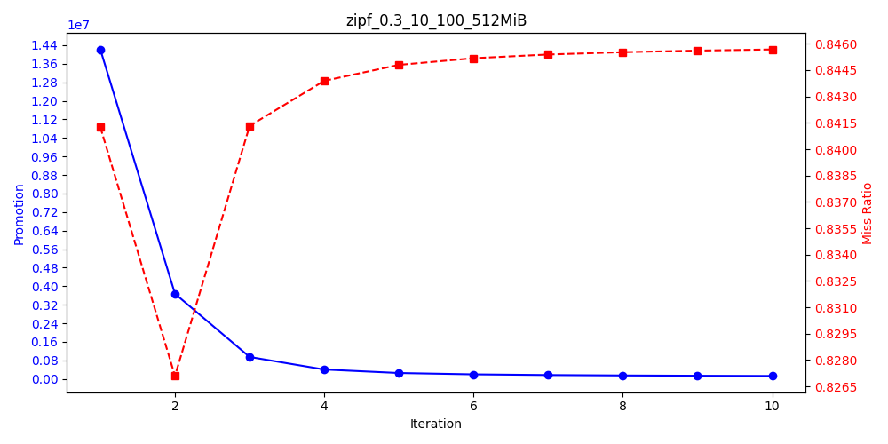  
> **Trace Path**: zipf_0.3_10_100.oracleGeneral  
> **Cache Size**: 512MiB  
> **Total Request**: 100,000,000  
> **First Promotion**: 14,217,380  
> **Last Promotion**: 127,045  
> **Promotion Reduced**: 14,090,335  

> 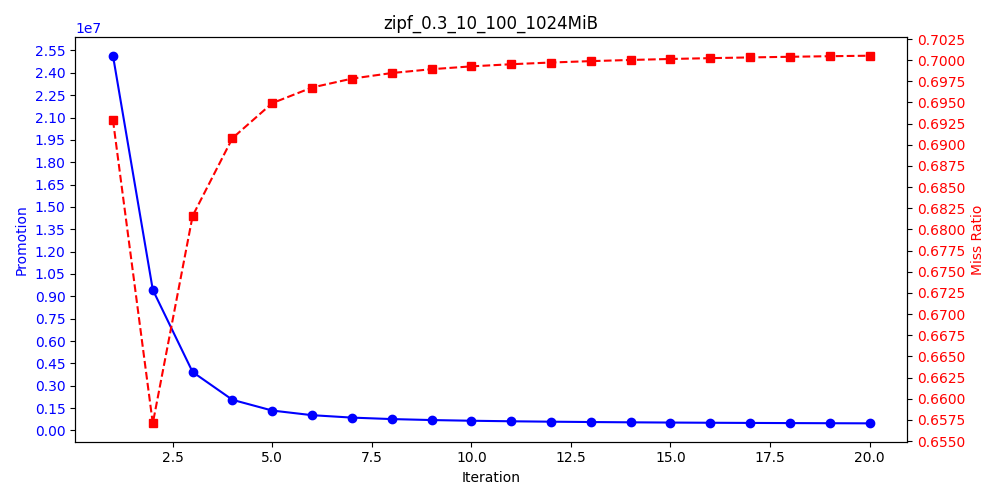  
> **Trace Path**: zipf_0.3_10_100.oracleGeneral  
> **Cache Size**: 1024MiB  
> **Total Request**: 100,000,000  
> **First Promotion**: 25,152,117  
> **Last Promotion**: 648,867  
> **Promotion Reduced**: 24,503,250  

> 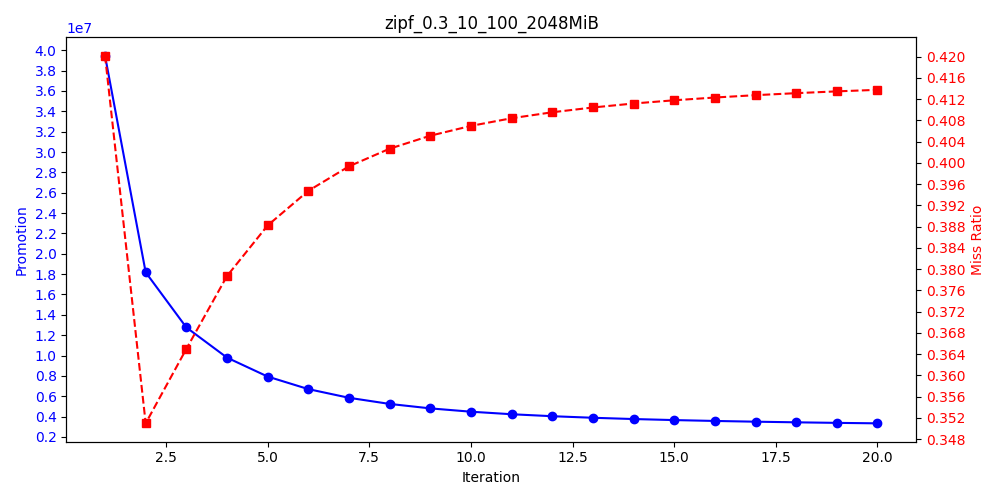  
> **Trace Path**: zipf_0.3_10_100.oracleGeneral  
> **Cache Size**: 2048MiB  
> **Total Request**: 100,000,000  
> **First Promotion**: 39,464,486  
> **Last Promotion**: 4,480,624  
> **Promotion Reduced**: 34,983,862  

## zipf_0.7_10_100
>   
> **Trace Path**: zipf_0.7_10_100.oracleGeneral  
> **Cache Size**: 128MiB  
> **Total Request**: 100,000,000  
> **First Promotion**: 11,316,757  
> **Last Promotion**: 1,956,203  
> **Promotion Reduced**: 9,360,554  

>   
> **Trace Path**: zipf_0.7_10_100.oracleGeneral  
> **Cache Size**: 256MiB  
> **Total Request**: 100,000,000  
> **First Promotion**: 14,954,105  
> **Last Promotion**: 2,634,303  
> **Promotion Reduced**: 12,319,802  

>   
> **Trace Path**: zipf_0.7_10_100.oracleGeneral  
> **Cache Size**: 512MiB  
> **Total Request**: 100,000,000  
> **First Promotion**: 19,438,250  
> **Last Promotion**: 3,586,017  
> **Promotion Reduced**: 15,852,233  

>   
> **Trace Path**: zipf_0.7_10_100.oracleGeneral  
> **Cache Size**: 1024MiB  
> **Total Request**: 100,000,000  
> **First Promotion**: 24,395,385  
> **Last Promotion**: 4,976,299  
> **Promotion Reduced**: 19,419,086  

>   
> **Trace Path**: zipf_0.7_10_100.oracleGeneral  
> **Cache Size**: 2048MiB  
> **Total Request**: 100,000,000  
> **First Promotion**: 27,711,680  
> **Last Promotion**: 7,314,196  
> **Promotion Reduced**: 20,397,484  

## zipf_0_10_100
> 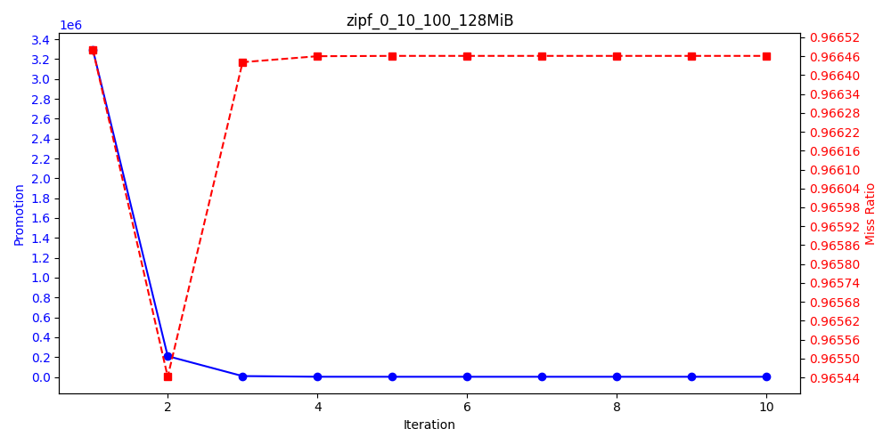  
> **Trace Path**: zipf_0_10_100.oracleGeneral  
> **Cache Size**: 128MiB  
> **Total Request**: 100,000,000  
> **First Promotion**: 3,295,637  
> **Last Promotion**: 2,257  
> **Promotion Reduced**: 3,293,380  

>   
> **Trace Path**: zipf_0_10_100.oracleGeneral  
> **Cache Size**: 256MiB  
> **Total Request**: 100,000,000  
> **First Promotion**: 6,484,276  
> **Last Promotion**: 9,630  
> **Promotion Reduced**: 6,474,646  

> 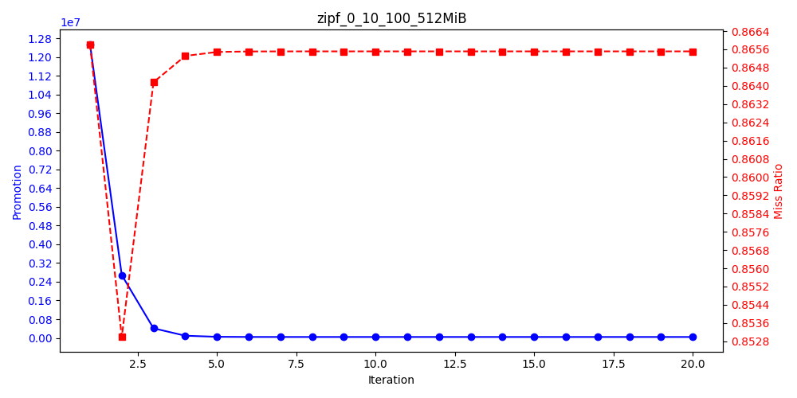  
> **Trace Path**: zipf_0_10_100.oracleGeneral  
> **Cache Size**: 512MiB  
> **Total Request**: 100,000,000  
> **First Promotion**: 12,540,448  
> **Last Promotion**: 40,539  
> **Promotion Reduced**: 12,499,909  

> 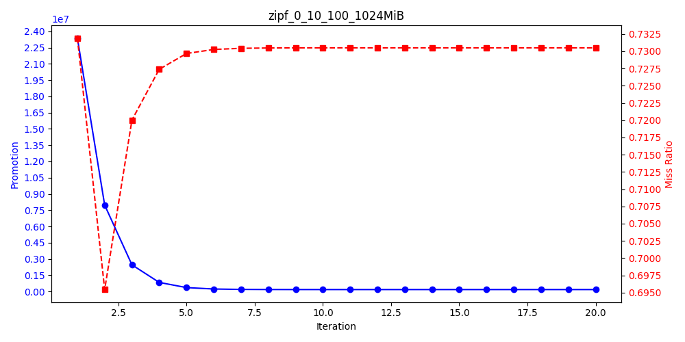  
> **Trace Path**: zipf_0_10_100.oracleGeneral  
> **Cache Size**: 1024MiB  
> **Total Request**: 100,000,000  
> **First Promotion**: 23,373,071  
> **Last Promotion**: 184,192  
> **Promotion Reduced**: 23,188,879  

> 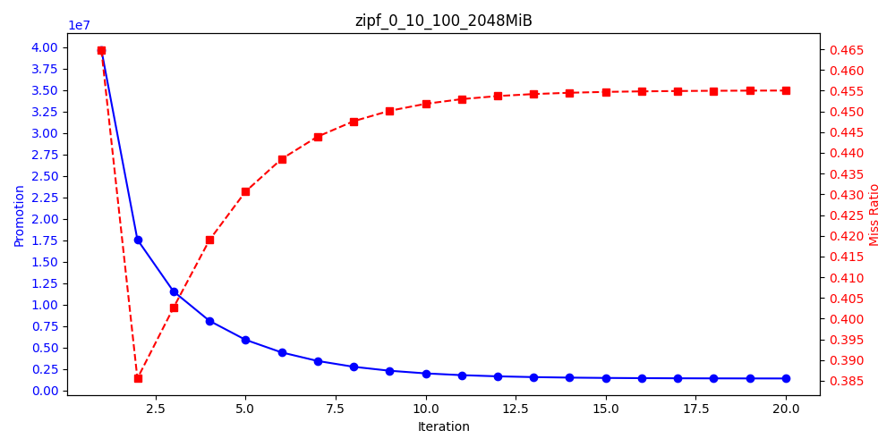  
> **Trace Path**: zipf_0_10_100.oracleGeneral  
> **Cache Size**: 2048MiB  
> **Total Request**: 100,000,000  
> **First Promotion**: 39,702,526  
> **Last Promotion**: 2,000,281  
> **Promotion Reduced**: 37,702,245  

## zipf_1.3_10_100
>   
> **Trace Path**: zipf_1.3_10_100.oracleGeneral  
> **Cache Size**: 128MiB  
> **Total Request**: 100,000,000  
> **First Promotion**: 2,015,276  
> **Last Promotion**: 892,951  
> **Promotion Reduced**: 1,122,325  

>   
> **Trace Path**: zipf_1.3_10_100.oracleGeneral  
> **Cache Size**: 256MiB  
> **Total Request**: 100,000,000  
> **First Promotion**: 1,587,514  
> **Last Promotion**: 726,102  
> **Promotion Reduced**: 861,412  

> 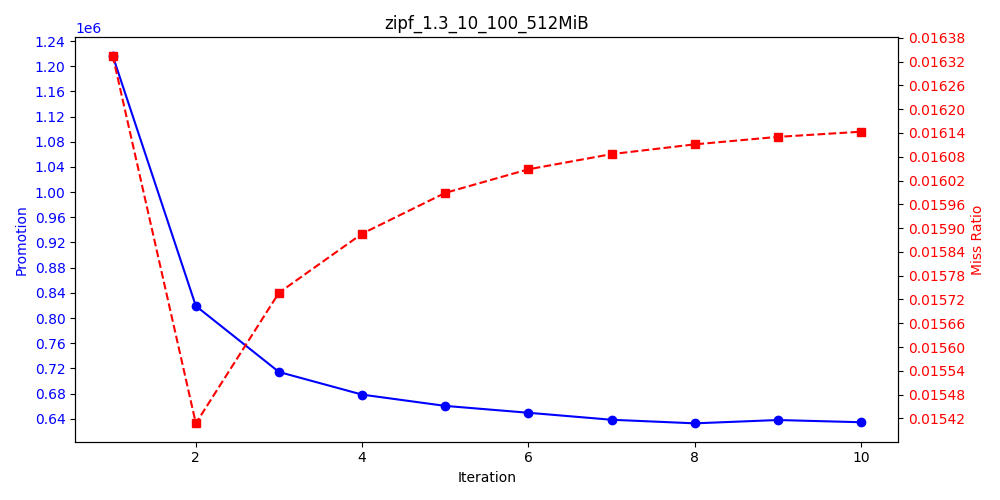  
> **Trace Path**: zipf_1.3_10_100.oracleGeneral  
> **Cache Size**: 512MiB  
> **Total Request**: 100,000,000  
> **First Promotion**: 1,216,802  
> **Last Promotion**: 634,354  
> **Promotion Reduced**: 582,448  

> 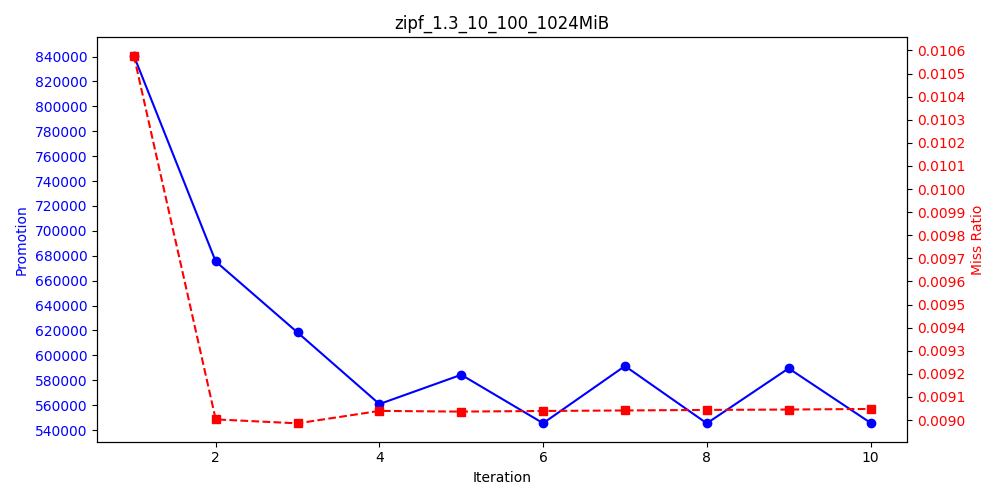  
> **Trace Path**: zipf_1.3_10_100.oracleGeneral  
> **Cache Size**: 1024MiB  
> **Total Request**: 100,000,000  
> **First Promotion**: 840,634  
> **Last Promotion**: 545,843  
> **Promotion Reduced**: 294,791  

>   
> **Trace Path**: zipf_1.3_10_100.oracleGeneral  
> **Cache Size**: 2048MiB  
> **Total Request**: 100,000,000  
> **First Promotion**: 336,796  
> **Last Promotion**: 445,470  
> **Promotion Reduced**: -108,674  

## zipf_1.7_10_100
>   
> **Trace Path**: zipf_1.7_10_100.oracleGeneral  
> **Cache Size**: 128MiB  
> **Total Request**: 100,000,000  
> **First Promotion**: 49,296  
> **Last Promotion**: 43,141  
> **Promotion Reduced**: 6,155  

>   
> **Trace Path**: zipf_1.7_10_100.oracleGeneral  
> **Cache Size**: 256MiB  
> **Total Request**: 100,000,000  
> **First Promotion**: 512  
> **Last Promotion**: 29,493  
> **Promotion Reduced**: -28,981  

>   
> **Trace Path**: zipf_1.7_10_100.oracleGeneral  
> **Cache Size**: 512MiB  
> **Total Request**: 100,000,000  
> **First Promotion**: 0  
> **Last Promotion**: 0  
> **Promotion Reduced**: 0  

>   
> **Trace Path**: zipf_1.7_10_100.oracleGeneral  
> **Cache Size**: 1024MiB  
> **Total Request**: 100,000,000  
> **First Promotion**: 0  
> **Last Promotion**: 0  
> **Promotion Reduced**: 0  

>   
> **Trace Path**: zipf_1.7_10_100.oracleGeneral  
> **Cache Size**: 2048MiB  
> **Total Request**: 100,000,000  
> **First Promotion**: 0  
> **Last Promotion**: 0  
> **Promotion Reduced**: 0  

## zipf_1_10_100
> 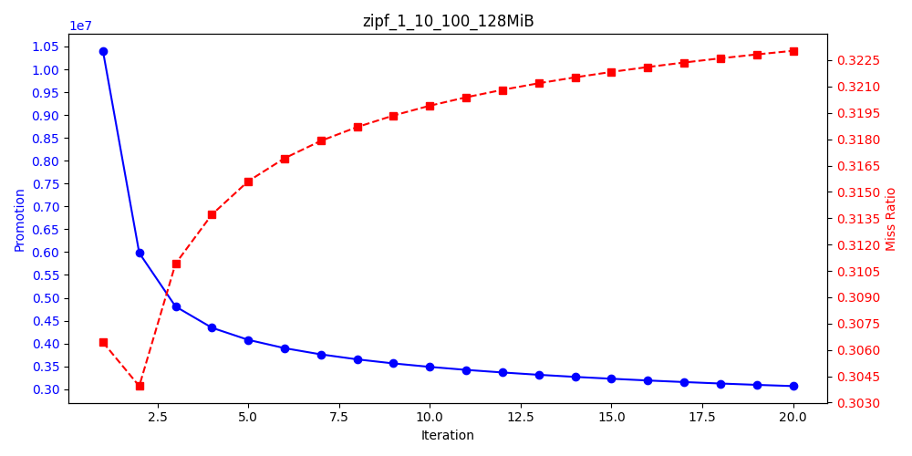  
> **Trace Path**: zipf_1_10_100.oracleGeneral  
> **Cache Size**: 128MiB  
> **Total Request**: 100,000,000  
> **First Promotion**: 10,407,826  
> **Last Promotion**: 3,490,256  
> **Promotion Reduced**: 6,917,570  

> 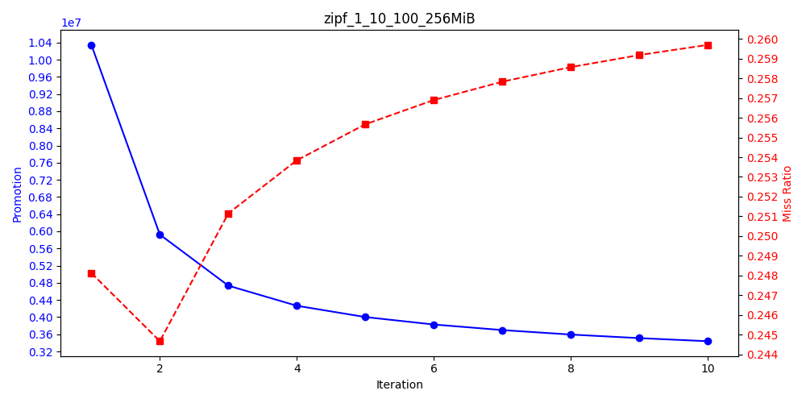  
> **Trace Path**: zipf_1_10_100.oracleGeneral  
> **Cache Size**: 256MiB  
> **Total Request**: 100,000,000  
> **First Promotion**: 10,344,937  
> **Last Promotion**: 3,437,996  
> **Promotion Reduced**: 6,906,941  

> 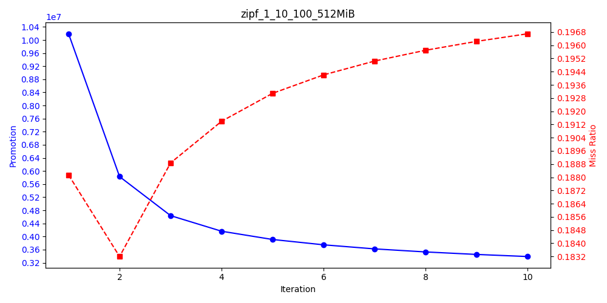  
> **Trace Path**: zipf_1_10_100.oracleGeneral  
> **Cache Size**: 512MiB  
> **Total Request**: 100,000,000  
> **First Promotion**: 10,190,636  
> **Last Promotion**: 3,388,479  
> **Promotion Reduced**: 6,802,157  

> 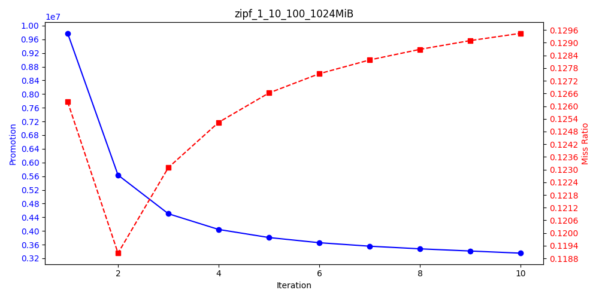  
> **Trace Path**: zipf_1_10_100.oracleGeneral  
> **Cache Size**: 1024MiB  
> **Total Request**: 100,000,000  
> **First Promotion**: 9,776,168  
> **Last Promotion**: 3,350,053  
> **Promotion Reduced**: 6,426,115  

> 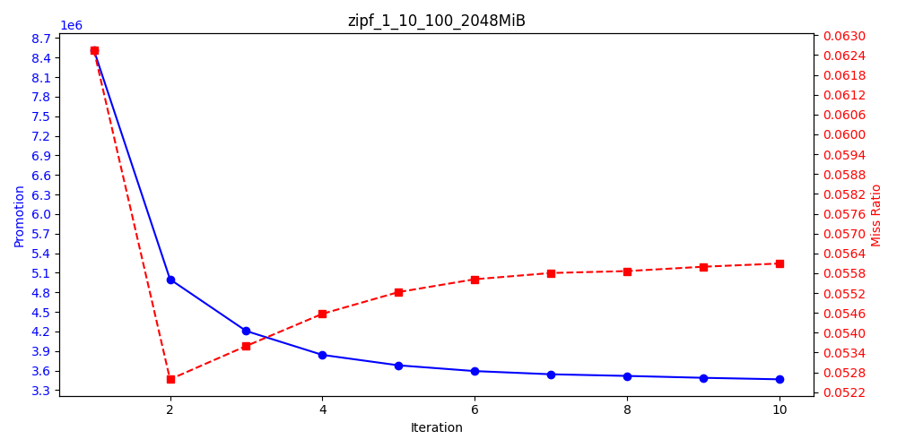  
> **Trace Path**: zipf_1_10_100.oracleGeneral  
> **Cache Size**: 2048MiB  
> **Total Request**: 100,000,000  
> **First Promotion**: 8,518,049  
> **Last Promotion**: 3,465,199  
> **Promotion Reduced**: 5,052,850  

## zipf_2_10_100
>   
> **Trace Path**: zipf_2_10_100.oracleGeneral  
> **Cache Size**: 128MiB  
> **Total Request**: 100,000,000  
> **First Promotion**: 0  
> **Last Promotion**: 0  
> **Promotion Reduced**: 0  

>   
> **Trace Path**: zipf_2_10_100.oracleGeneral  
> **Cache Size**: 256MiB  
> **Total Request**: 100,000,000  
> **First Promotion**: 0  
> **Last Promotion**: 0  
> **Promotion Reduced**: 0  

>   
> **Trace Path**: zipf_2_10_100.oracleGeneral  
> **Cache Size**: 512MiB  
> **Total Request**: 100,000,000  
> **First Promotion**: 0  
> **Last Promotion**: 0  
> **Promotion Reduced**: 0  

>   
> **Trace Path**: zipf_2_10_100.oracleGeneral  
> **Cache Size**: 1024MiB  
> **Total Request**: 100,000,000  
> **First Promotion**: 0  
> **Last Promotion**: 0  
> **Promotion Reduced**: 0  

>   
> **Trace Path**: zipf_2_10_100.oracleGeneral  
> **Cache Size**: 2048MiB  
> **Total Request**: 100,000,000  
> **First Promotion**: 0  
> **Last Promotion**: 0  
> **Promotion Reduced**: 0  

