# RESULT
## 1351 https://ftp.pdl.cmu.edu/pub/datasets/twemcacheWorkload/cacheDatasets/tencentBlock/v2/traces/1351.oracleGeneral.zst
> 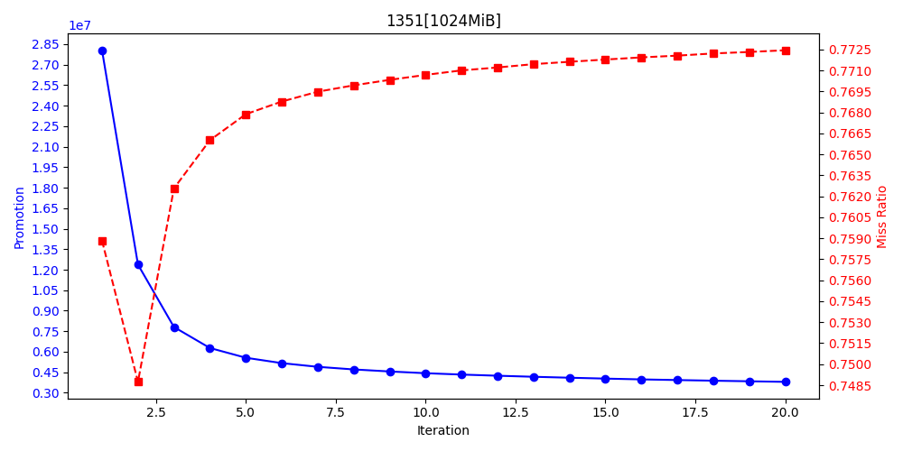  
> **Trace Path**: 1351.oracleGeneral.zst  
> **Desc**: 1024MiB  
> **Cache Size**: 1024MiB  
> **Total Request**: 195,824,302  
> **First Promotion**: 28,054,961  
> **Last Promotion**: 3,797,001  
> **Promotion Reduced**: 24,257,960  

> 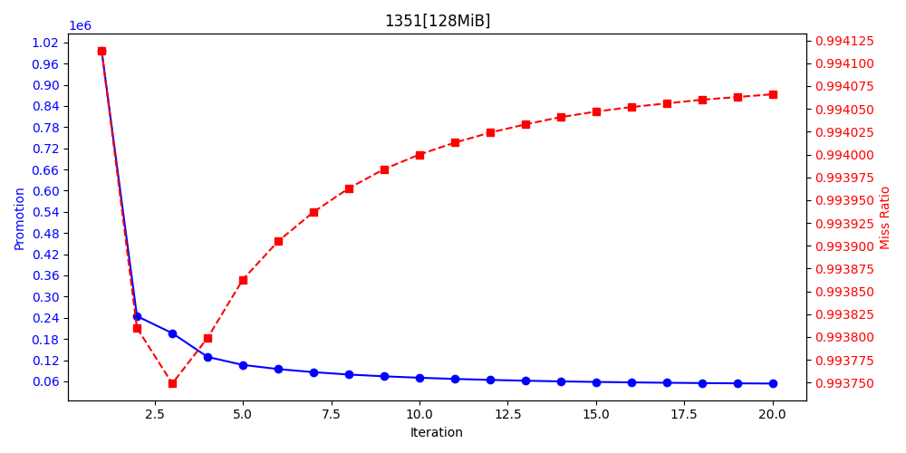  
> **Trace Path**: 1351.oracleGeneral.zst  
> **Desc**: 128MiB  
> **Cache Size**: 128MiB  
> **Total Request**: 195,824,302  
> **First Promotion**: 997,229  
> **Last Promotion**: 53,709  
> **Promotion Reduced**: 943,520  

> 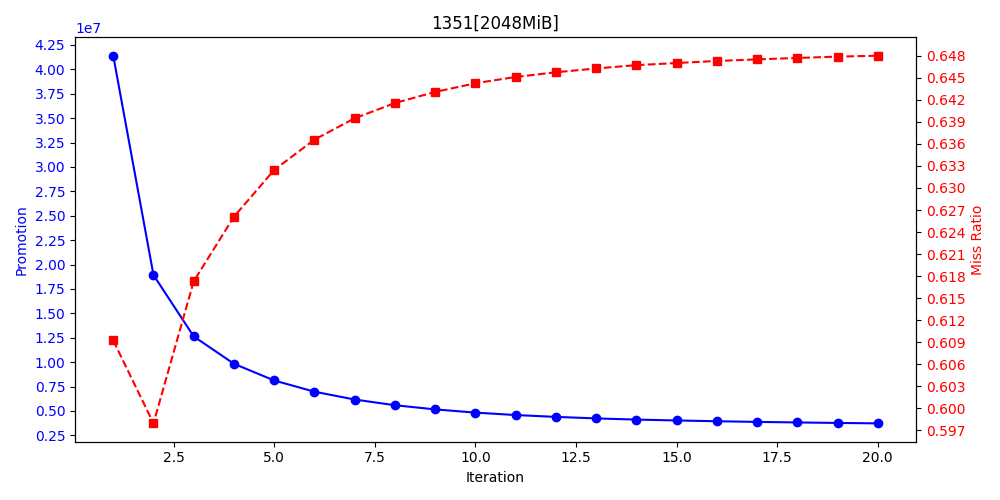  
> **Trace Path**: 1351.oracleGeneral.zst  
> **Desc**: 2048MiB  
> **Cache Size**: 2048MiB  
> **Total Request**: 195,824,302  
> **First Promotion**: 41,401,457  
> **Last Promotion**: 3,727,483  
> **Promotion Reduced**: 37,673,974  

> 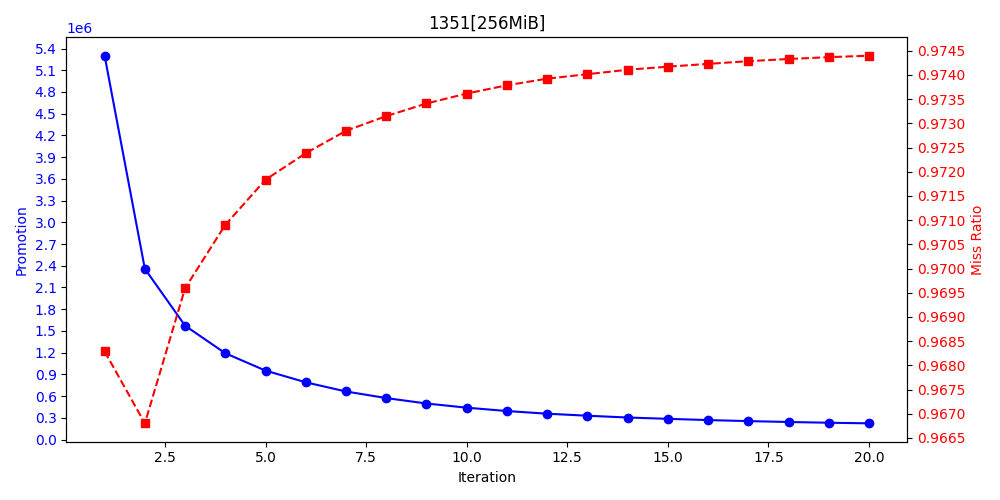  
> **Trace Path**: 1351.oracleGeneral.zst  
> **Desc**: 256MiB  
> **Cache Size**: 256MiB  
> **Total Request**: 195,824,302  
> **First Promotion**: 5,301,037  
> **Last Promotion**: 223,986  
> **Promotion Reduced**: 5,077,051  

>   
> **Trace Path**: 1351.oracleGeneral.zst  
> **Desc**: 512MiB  
> **Cache Size**: 512MiB  
> **Total Request**: 195,824,302  
> **First Promotion**: 17,635,612  
> **Last Promotion**: 2,341,384  
> **Promotion Reduced**: 15,294,228  

## 2016_LUN1 https://ftp.pdl.cmu.edu/pub/datasets/twemcacheWorkload/cacheDatasets/systor/2016_LUN1.oracleGeneral.zst
> 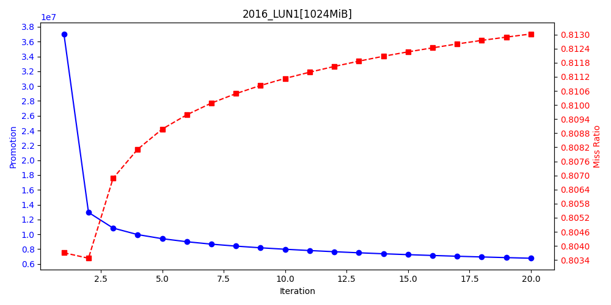  
> **Trace Path**: 2016_LUN1.oracleGeneral.zst  
> **Desc**: 1024MiB  
> **Cache Size**: 1024MiB  
> **Total Request**: 492,030,661  
> **First Promotion**: 37,028,131  
> **Last Promotion**: 6,770,205  
> **Promotion Reduced**: 30,257,926  

> 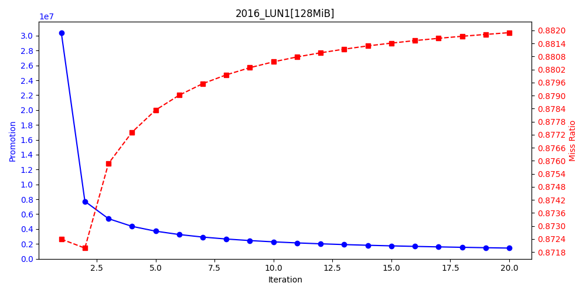  
> **Trace Path**: 2016_LUN1.oracleGeneral.zst  
> **Desc**: 128MiB  
> **Cache Size**: 128MiB  
> **Total Request**: 492,030,661  
> **First Promotion**: 30,415,709  
> **Last Promotion**: 1,437,924  
> **Promotion Reduced**: 28,977,785  

> 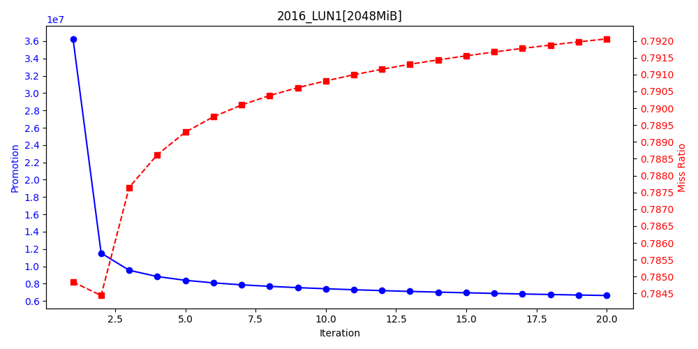  
> **Trace Path**: 2016_LUN1.oracleGeneral.zst  
> **Desc**: 2048MiB  
> **Cache Size**: 2048MiB  
> **Total Request**: 492,030,661  
> **First Promotion**: 36,258,234  
> **Last Promotion**: 6,637,791  
> **Promotion Reduced**: 29,620,443  

> 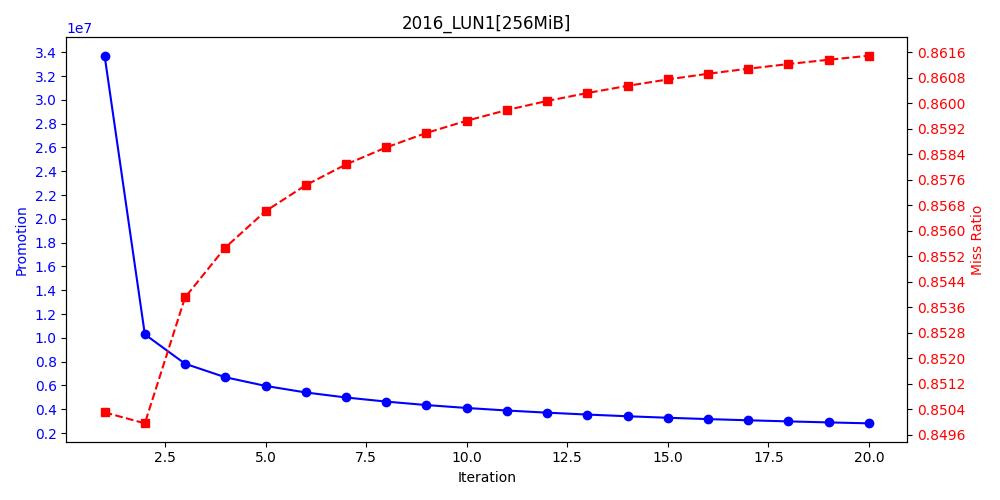  
> **Trace Path**: 2016_LUN1.oracleGeneral.zst  
> **Desc**: 256MiB  
> **Cache Size**: 256MiB  
> **Total Request**: 492,030,661  
> **First Promotion**: 33,713,860  
> **Last Promotion**: 2,813,443  
> **Promotion Reduced**: 30,900,417  

> 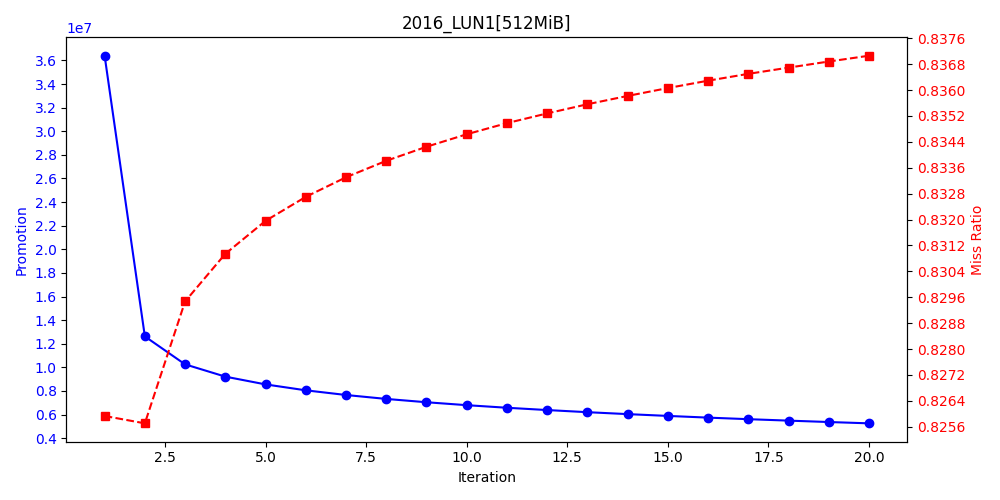  
> **Trace Path**: 2016_LUN1.oracleGeneral.zst  
> **Desc**: 512MiB  
> **Cache Size**: 512MiB  
> **Total Request**: 492,030,661  
> **First Promotion**: 36,402,647  
> **Last Promotion**: 5,254,784  
> **Promotion Reduced**: 31,147,863  

## 7 https://ftp.pdl.cmu.edu/pub/datasets/twemcacheWorkload/cacheDatasets/alibabaBlock/v2/7.oracleGeneral.zst
> 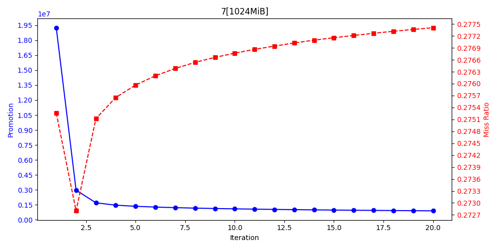  
> **Trace Path**: 7.oracleGeneral.zst  
> **Desc**: 1024MiB  
> **Cache Size**: 1024MiB  
> **Total Request**: 265,694,431  
> **First Promotion**: 19,246,415  
> **Last Promotion**: 903,159  
> **Promotion Reduced**: 18,343,256  

> 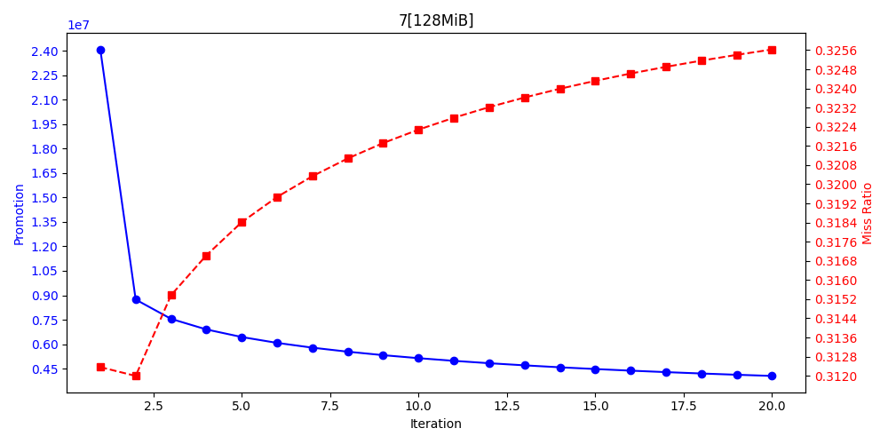  
> **Trace Path**: 7.oracleGeneral.zst  
> **Desc**: 128MiB  
> **Cache Size**: 128MiB  
> **Total Request**: 265,694,431  
> **First Promotion**: 24,075,064  
> **Last Promotion**: 4,054,757  
> **Promotion Reduced**: 20,020,307  

> 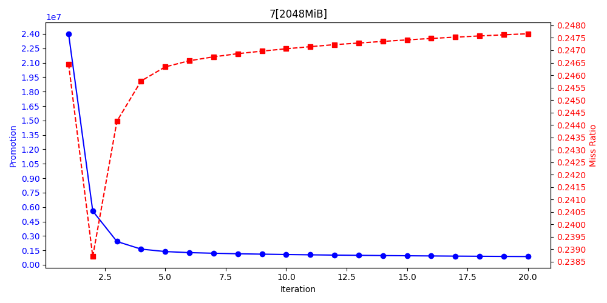  
> **Trace Path**: 7.oracleGeneral.zst  
> **Desc**: 2048MiB  
> **Cache Size**: 2048MiB  
> **Total Request**: 265,694,431  
> **First Promotion**: 24,015,942  
> **Last Promotion**: 860,092  
> **Promotion Reduced**: 23,155,850  

>   
> **Trace Path**: 7.oracleGeneral.zst  
> **Desc**: 256MiB  
> **Cache Size**: 256MiB  
> **Total Request**: 265,694,431  
> **First Promotion**: 19,489,517  
> **Last Promotion**: 2,415,453  
> **Promotion Reduced**: 17,074,064  

> 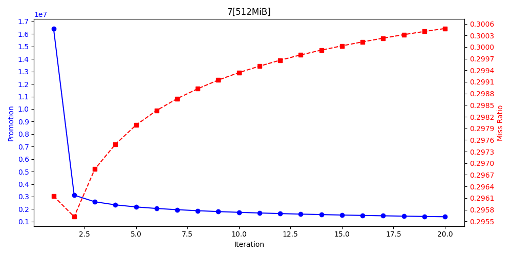  
> **Trace Path**: 7.oracleGeneral.zst  
> **Desc**: 512MiB  
> **Cache Size**: 512MiB  
> **Total Request**: 265,694,431  
> **First Promotion**: 16,438,200  
> **Last Promotion**: 1,386,131  
> **Promotion Reduced**: 15,052,069  

## block_traces_5 https://ftp.pdl.cmu.edu/pub/datasets/twemcacheWorkload/cacheDatasets/metaStorage/block_traces_5.oracleGeneral.bin.zst
> 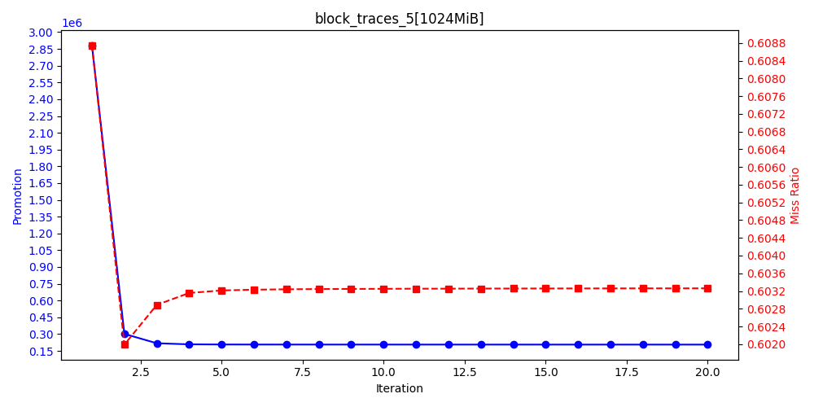  
> **Trace Path**: block_traces_5.oracleGeneral.bin.zst  
> **Desc**: 1024MiB  
> **Cache Size**: 1024MiB  
> **Total Request**: 14,556,172  
> **First Promotion**: 2,881,691  
> **Last Promotion**: 205,985  
> **Promotion Reduced**: 2,675,706  

> 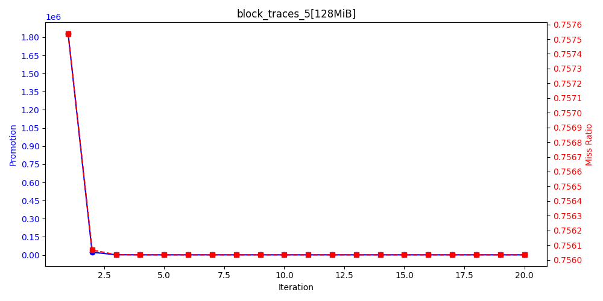  
> **Trace Path**: block_traces_5.oracleGeneral.bin.zst  
> **Desc**: 128MiB  
> **Cache Size**: 128MiB  
> **Total Request**: 14,556,172  
> **First Promotion**: 1,830,848  
> **Last Promotion**: 1,080  
> **Promotion Reduced**: 1,829,768  

>   
> **Trace Path**: block_traces_5.oracleGeneral.bin.zst  
> **Desc**: 2048MiB  
> **Cache Size**: 2048MiB  
> **Total Request**: 14,556,172  
> **First Promotion**: 2,892,780  
> **Last Promotion**: 148,174  
> **Promotion Reduced**: 2,744,606  

>   
> **Trace Path**: block_traces_5.oracleGeneral.bin.zst  
> **Desc**: 256MiB  
> **Cache Size**: 256MiB  
> **Total Request**: 14,556,172  
> **First Promotion**: 2,128,650  
> **Last Promotion**: 150,514  
> **Promotion Reduced**: 1,978,136  

> 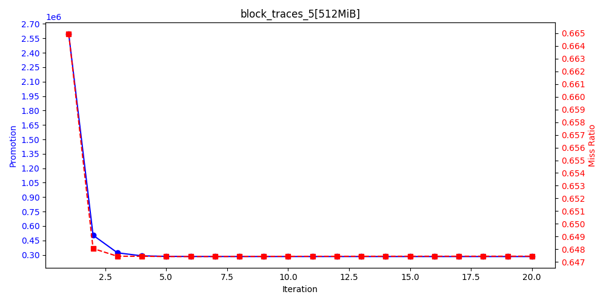  
> **Trace Path**: block_traces_5.oracleGeneral.bin.zst  
> **Desc**: 512MiB  
> **Cache Size**: 512MiB  
> **Total Request**: 14,556,172  
> **First Promotion**: 2,597,456  
> **Last Promotion**: 282,558  
> **Promotion Reduced**: 2,314,898  

## cluster50 https://ftp.pdl.cmu.edu/pub/datasets/twemcacheWorkload/cacheDatasets/twitter/cluster50.oracleGeneral.zst
>   
> **Trace Path**: cluster50.oracleGeneral.zst  
> **Desc**: 0.001  
> **Cache Size**: 41MiB  
> **Total Request**: 139,655,585  
> **First Promotion**: 37,725,637  
> **Last Promotion**: 19,253  
> **Promotion Reduced**: 37,706,384  

>   
> **Trace Path**: cluster50.oracleGeneral.zst  
> **Desc**: 0.01  
> **Cache Size**: 413MiB  
> **Total Request**: 139,655,585  
> **First Promotion**: 49,659,077  
> **Last Promotion**: 1,345,080  
> **Promotion Reduced**: 48,313,997  

>   
> **Trace Path**: cluster50.oracleGeneral.zst  
> **Desc**: 0.1  
> **Cache Size**: 4133MiB  
> **Total Request**: 139,655,585  
> **First Promotion**: 37,945,441  
> **Last Promotion**: 5,585,833  
> **Promotion Reduced**: 32,359,608  

>   
> **Trace Path**: cluster50.oracleGeneral.zst  
> **Desc**: 0.2  
> **Cache Size**: 8267MiB  
> **Total Request**: 139,655,585  
> **First Promotion**: 26,127,970  
> **Last Promotion**: 4,990,049  
> **Promotion Reduced**: 21,137,921  

>   
> **Trace Path**: cluster50.oracleGeneral.zst  
> **Desc**: 0.4  
> **Cache Size**: 16535MiB  
> **Total Request**: 139,655,585  
> **First Promotion**: 17,130,495  
> **Last Promotion**: 5,082,368  
> **Promotion Reduced**: 12,048,127  

> 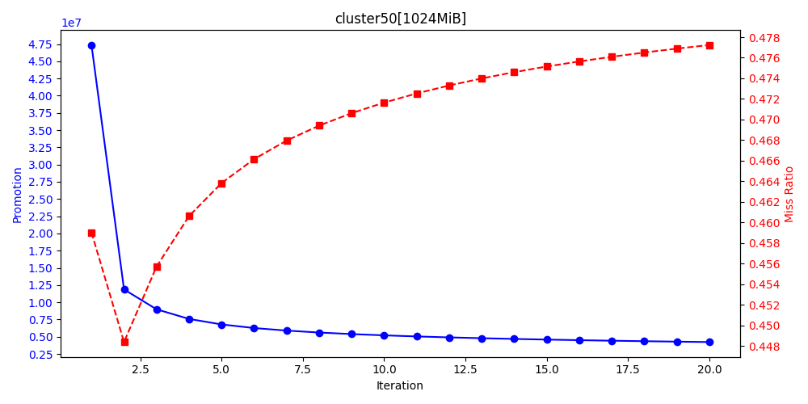  
> **Trace Path**: cluster50.oracleGeneral.zst  
> **Desc**: 1024MiB  
> **Cache Size**: 1024MiB  
> **Total Request**: 139,655,585  
> **First Promotion**: 47,360,904  
> **Last Promotion**: 4,223,955  
> **Promotion Reduced**: 43,136,949  

>   
> **Trace Path**: cluster50.oracleGeneral.zst  
> **Desc**: 128MiB  
> **Cache Size**: 128MiB  
> **Total Request**: 139,655,585  
> **First Promotion**: 39,246,683  
> **Last Promotion**: 46,927  
> **Promotion Reduced**: 39,199,756  

> 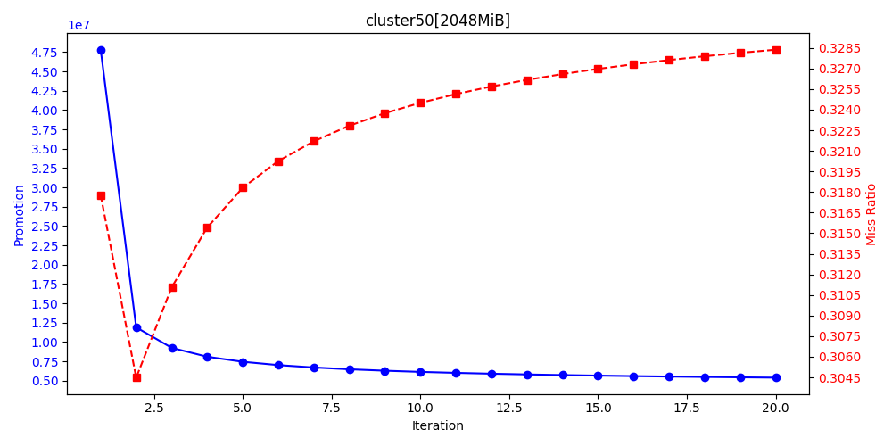  
> **Trace Path**: cluster50.oracleGeneral.zst  
> **Desc**: 2048MiB  
> **Cache Size**: 2048MiB  
> **Total Request**: 139,655,585  
> **First Promotion**: 47,819,137  
> **Last Promotion**: 5,397,665  
> **Promotion Reduced**: 42,421,472  

> 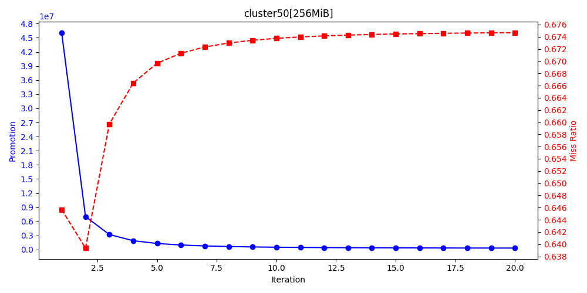  
> **Trace Path**: cluster50.oracleGeneral.zst  
> **Desc**: 256MiB  
> **Cache Size**: 256MiB  
> **Total Request**: 139,655,585  
> **First Promotion**: 46,084,765  
> **Last Promotion**: 323,383  
> **Promotion Reduced**: 45,761,382  

> 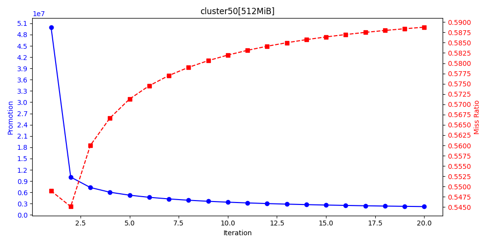  
> **Trace Path**: cluster50.oracleGeneral.zst  
> **Desc**: 512MiB  
> **Cache Size**: 512MiB  
> **Total Request**: 139,655,585  
> **First Promotion**: 49,979,108  
> **Last Promotion**: 2,216,265  
> **Promotion Reduced**: 47,762,843  

## fiu_cheetah.cs.fiu.edu-110108-113008 https://ftp.pdl.cmu.edu/pub/datasets/twemcacheWorkload/cacheDatasets/fiu/fiu_cheetah.cs.fiu.edu-110108-113008.oracleGeneral.zst
> 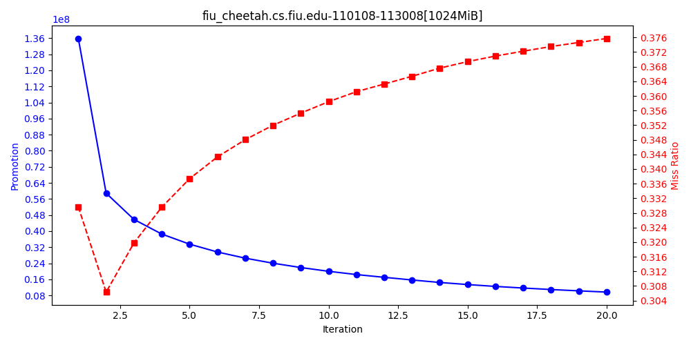  
> **Trace Path**: fiu_cheetah.cs.fiu.edu-110108-113008.oracleGeneral.zst  
> **Desc**: 1024MiB  
> **Cache Size**: 1024MiB  
> **Total Request**: 442,393,092  
> **First Promotion**: 135,896,867  
> **Last Promotion**: 9,629,737  
> **Promotion Reduced**: 126,267,130  

> 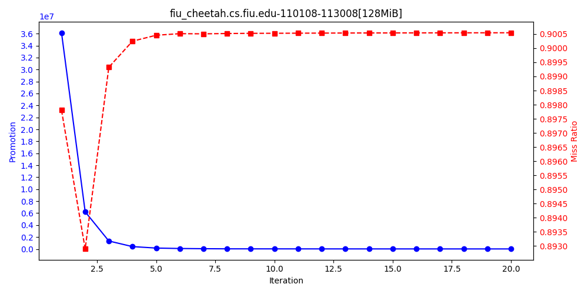  
> **Trace Path**: fiu_cheetah.cs.fiu.edu-110108-113008.oracleGeneral.zst  
> **Desc**: 128MiB  
> **Cache Size**: 128MiB  
> **Total Request**: 442,393,092  
> **First Promotion**: 36,144,177  
> **Last Promotion**: 19,786  
> **Promotion Reduced**: 36,124,391  

> 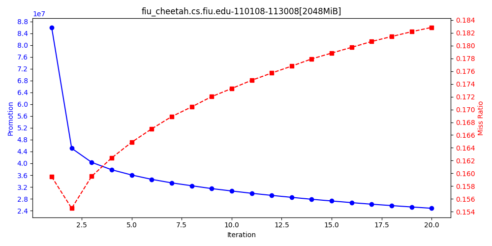  
> **Trace Path**: fiu_cheetah.cs.fiu.edu-110108-113008.oracleGeneral.zst  
> **Desc**: 2048MiB  
> **Cache Size**: 2048MiB  
> **Total Request**: 442,393,092  
> **First Promotion**: 85,970,828  
> **Last Promotion**: 24,799,836  
> **Promotion Reduced**: 61,170,992  

>   
> **Trace Path**: fiu_cheetah.cs.fiu.edu-110108-113008.oracleGeneral.zst  
> **Desc**: 256MiB  
> **Cache Size**: 256MiB  
> **Total Request**: 442,393,092  
> **First Promotion**: 76,565,791  
> **Last Promotion**: 346,157  
> **Promotion Reduced**: 76,219,634  

> 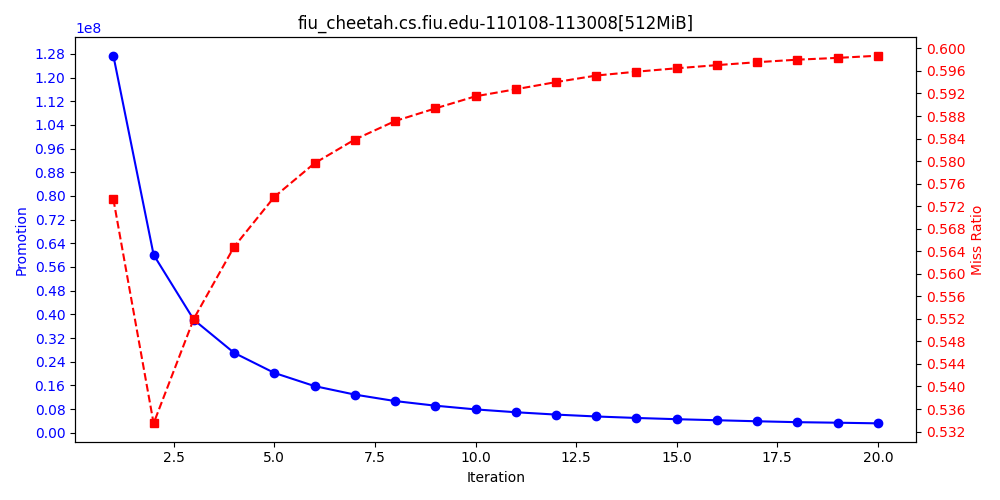  
> **Trace Path**: fiu_cheetah.cs.fiu.edu-110108-113008.oracleGeneral.zst  
> **Desc**: 512MiB  
> **Cache Size**: 512MiB  
> **Total Request**: 442,393,092  
> **First Promotion**: 127,399,940  
> **Last Promotion**: 3,163,473  
> **Promotion Reduced**: 124,236,467  

## meta_kvcache_traces_1 https://ftp.pdl.cmu.edu/pub/datasets/twemcacheWorkload/cacheDatasets/metaKV/meta_kvcache_traces_1.oracleGeneral.bin.zst
> 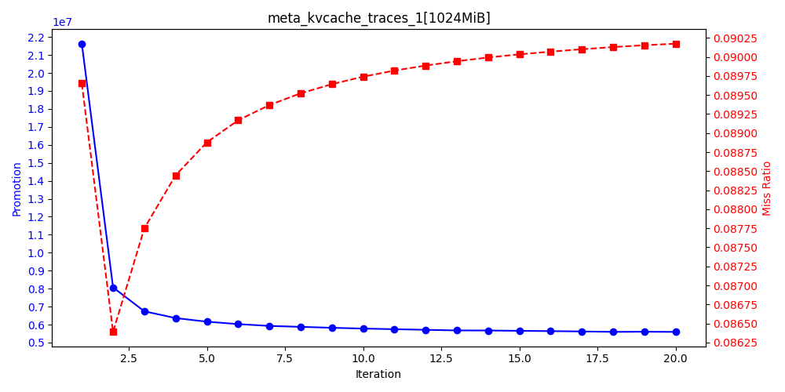  
> **Trace Path**: meta_kvcache_traces_1.oracleGeneral.bin.zst  
> **Desc**: 1024MiB  
> **Cache Size**: 1024MiB  
> **Total Request**: 335,173,084  
> **First Promotion**: 21,628,966  
> **Last Promotion**: 5,595,327  
> **Promotion Reduced**: 16,033,639  

> 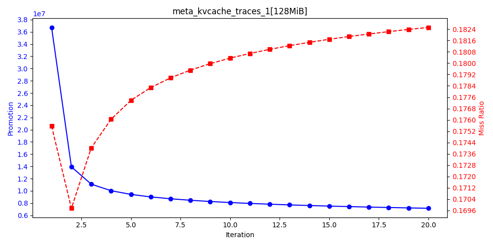  
> **Trace Path**: meta_kvcache_traces_1.oracleGeneral.bin.zst  
> **Desc**: 128MiB  
> **Cache Size**: 128MiB  
> **Total Request**: 335,173,084  
> **First Promotion**: 36,719,979  
> **Last Promotion**: 7,154,108  
> **Promotion Reduced**: 29,565,871  

> 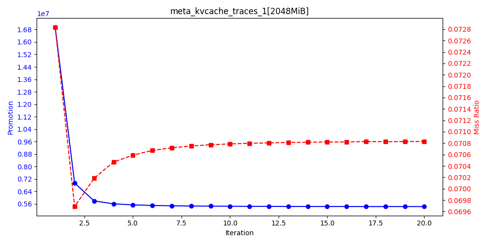  
> **Trace Path**: meta_kvcache_traces_1.oracleGeneral.bin.zst  
> **Desc**: 2048MiB  
> **Cache Size**: 2048MiB  
> **Total Request**: 335,173,084  
> **First Promotion**: 16,947,046  
> **Last Promotion**: 5,428,720  
> **Promotion Reduced**: 11,518,326  

> 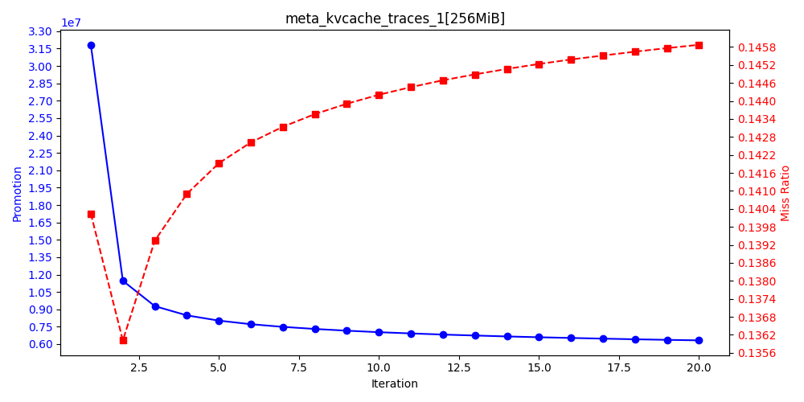  
> **Trace Path**: meta_kvcache_traces_1.oracleGeneral.bin.zst  
> **Desc**: 256MiB  
> **Cache Size**: 256MiB  
> **Total Request**: 335,173,084  
> **First Promotion**: 31,830,471  
> **Last Promotion**: 6,323,089  
> **Promotion Reduced**: 25,507,382  

>   
> **Trace Path**: meta_kvcache_traces_1.oracleGeneral.bin.zst  
> **Desc**: 512MiB  
> **Cache Size**: 512MiB  
> **Total Request**: 335,173,084  
> **First Promotion**: 26,589,855  
> **Last Promotion**: 5,777,743  
> **Promotion Reduced**: 20,812,112  

## meta_rnha https://ftp.pdl.cmu.edu/pub/datasets/twemcacheWorkload/cacheDatasets/metaCDN/meta_rnha.oracleGeneral.zst
>   
> **Trace Path**: meta_rnha.oracleGeneral.zst  
> **Desc**: 1024MiB  
> **Cache Size**: 1024MiB  
> **Total Request**: 96,680,668  
> **First Promotion**: 8,399,364  
> **Last Promotion**: 489,022  
> **Promotion Reduced**: 7,910,342  

> 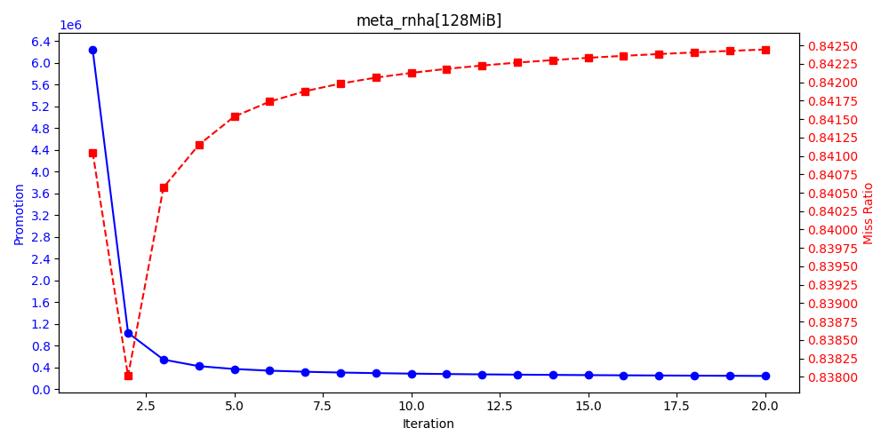  
> **Trace Path**: meta_rnha.oracleGeneral.zst  
> **Desc**: 128MiB  
> **Cache Size**: 128MiB  
> **Total Request**: 96,680,668  
> **First Promotion**: 6,246,080  
> **Last Promotion**: 243,190  
> **Promotion Reduced**: 6,002,890  

> 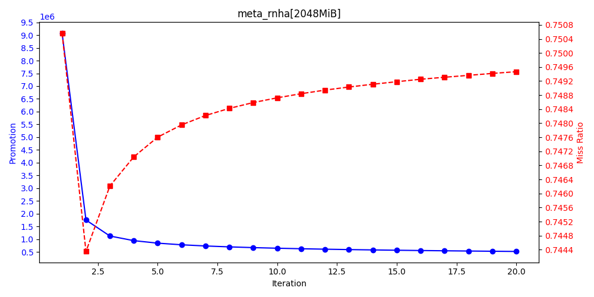  
> **Trace Path**: meta_rnha.oracleGeneral.zst  
> **Desc**: 2048MiB  
> **Cache Size**: 2048MiB  
> **Total Request**: 96,680,668  
> **First Promotion**: 9,077,791  
> **Last Promotion**: 522,376  
> **Promotion Reduced**: 8,555,415  

> 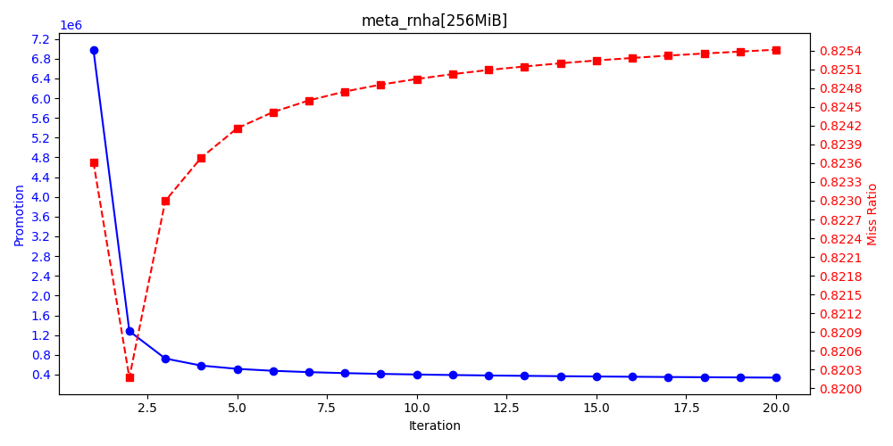  
> **Trace Path**: meta_rnha.oracleGeneral.zst  
> **Desc**: 256MiB  
> **Cache Size**: 256MiB  
> **Total Request**: 96,680,668  
> **First Promotion**: 6,981,627  
> **Last Promotion**: 338,549  
> **Promotion Reduced**: 6,643,078  

> 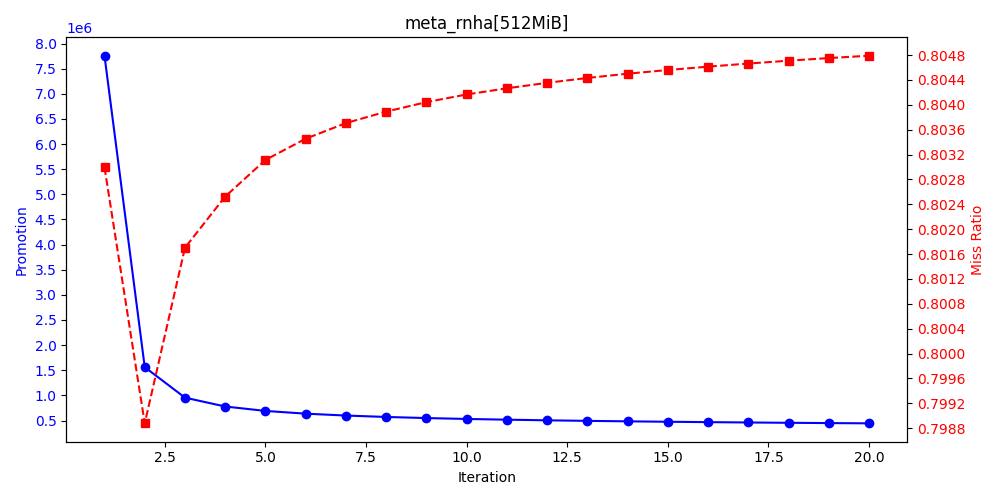  
> **Trace Path**: meta_rnha.oracleGeneral.zst  
> **Desc**: 512MiB  
> **Cache Size**: 512MiB  
> **Total Request**: 96,680,668  
> **First Promotion**: 7,757,460  
> **Last Promotion**: 443,715  
> **Promotion Reduced**: 7,313,745  

## msr_prxy_1 https://ftp.pdl.cmu.edu/pub/datasets/twemcacheWorkload/cacheDatasets/msr/msr_prxy_1.oracleGeneral.zst
> 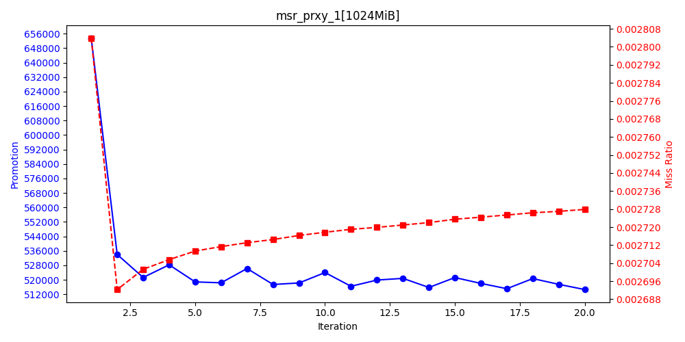  
> **Trace Path**: msr_prxy_1.oracleGeneral.zst  
> **Desc**: 1024MiB  
> **Cache Size**: 1024MiB  
> **Total Request**: 168,638,964  
> **First Promotion**: 653,558  
> **Last Promotion**: 514,637  
> **Promotion Reduced**: 138,921  

> 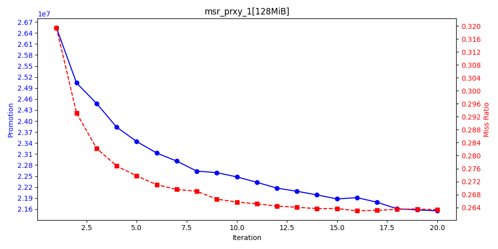  
> **Trace Path**: msr_prxy_1.oracleGeneral.zst  
> **Desc**: 128MiB  
> **Cache Size**: 128MiB  
> **Total Request**: 168,638,964  
> **First Promotion**: 26,542,223  
> **Last Promotion**: 21,553,712  
> **Promotion Reduced**: 4,988,511  

> 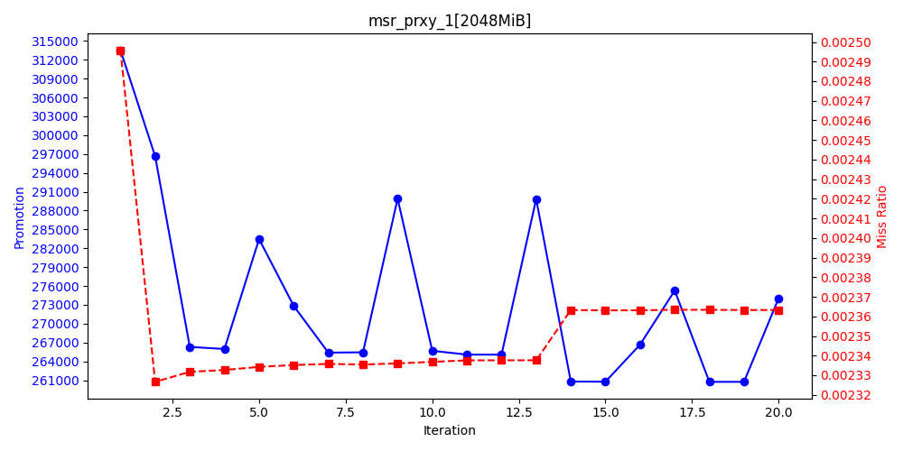  
> **Trace Path**: msr_prxy_1.oracleGeneral.zst  
> **Desc**: 2048MiB  
> **Cache Size**: 2048MiB  
> **Total Request**: 168,638,964  
> **First Promotion**: 313,520  
> **Last Promotion**: 274,051  
> **Promotion Reduced**: 39,469  

> 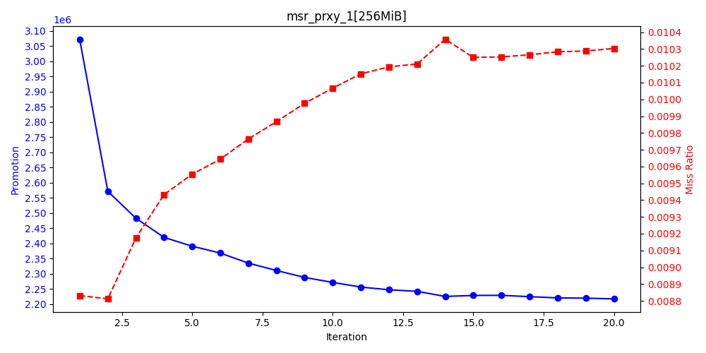  
> **Trace Path**: msr_prxy_1.oracleGeneral.zst  
> **Desc**: 256MiB  
> **Cache Size**: 256MiB  
> **Total Request**: 168,638,964  
> **First Promotion**: 3,072,713  
> **Last Promotion**: 2,216,801  
> **Promotion Reduced**: 855,912  

> 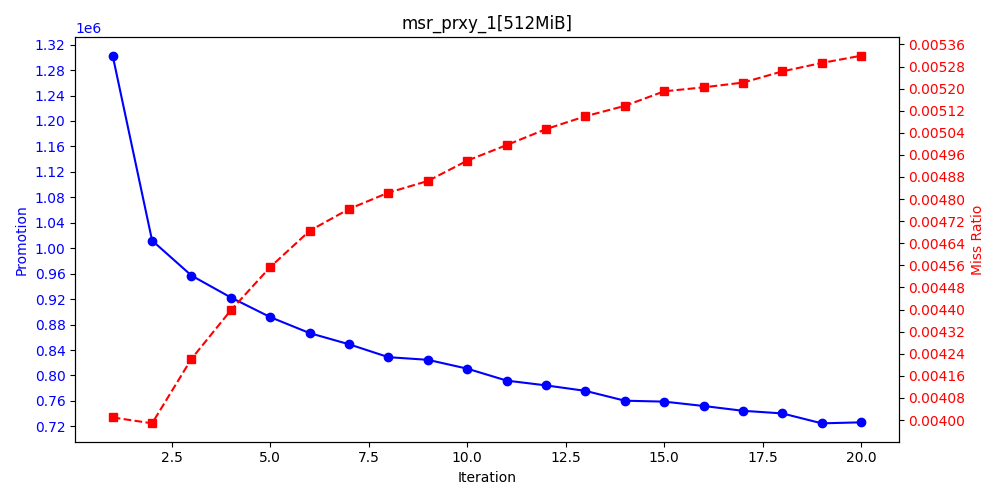  
> **Trace Path**: msr_prxy_1.oracleGeneral.zst  
> **Desc**: 512MiB  
> **Cache Size**: 512MiB  
> **Total Request**: 168,638,964  
> **First Promotion**: 1,302,536  
> **Last Promotion**: 726,347  
> **Promotion Reduced**: 576,189  

## w01 https://ftp.pdl.cmu.edu/pub/datasets/twemcacheWorkload/cacheDatasets/cloudphysics/w01.oracleGeneral.bin.zst
> 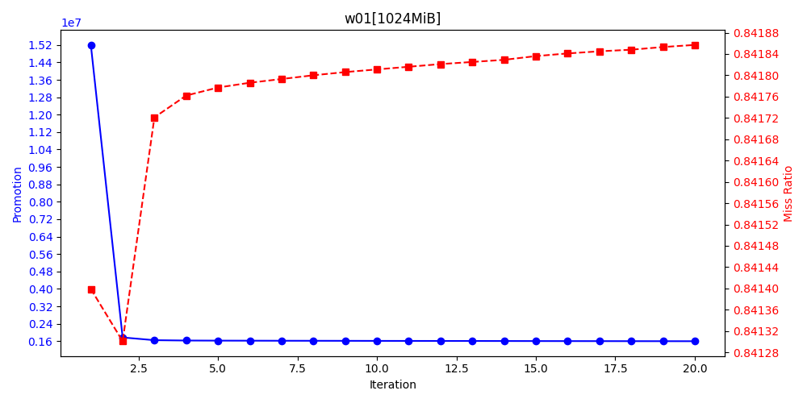  
> **Trace Path**: w01.oracleGeneral.bin.zst  
> **Desc**: 1024MiB  
> **Cache Size**: 1024MiB  
> **Total Request**: 215,796,257  
> **First Promotion**: 15,203,178  
> **Last Promotion**: 1,596,583  
> **Promotion Reduced**: 13,606,595  

> 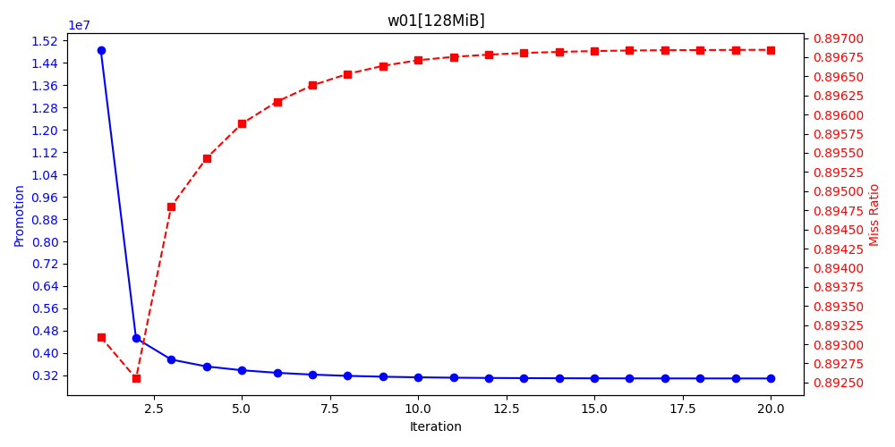  
> **Trace Path**: w01.oracleGeneral.bin.zst  
> **Desc**: 128MiB  
> **Cache Size**: 128MiB  
> **Total Request**: 215,796,257  
> **First Promotion**: 14,867,761  
> **Last Promotion**: 3,086,564  
> **Promotion Reduced**: 11,781,197  

> 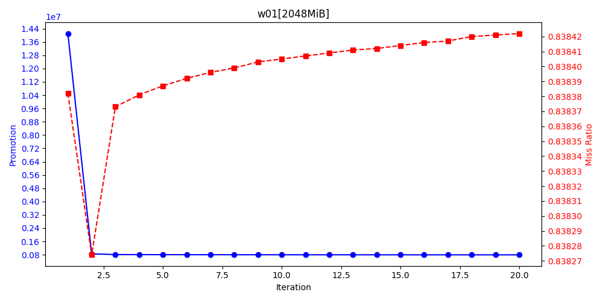  
> **Trace Path**: w01.oracleGeneral.bin.zst  
> **Desc**: 2048MiB  
> **Cache Size**: 2048MiB  
> **Total Request**: 215,796,257  
> **First Promotion**: 14,105,626  
> **Last Promotion**: 794,189  
> **Promotion Reduced**: 13,311,437  

> 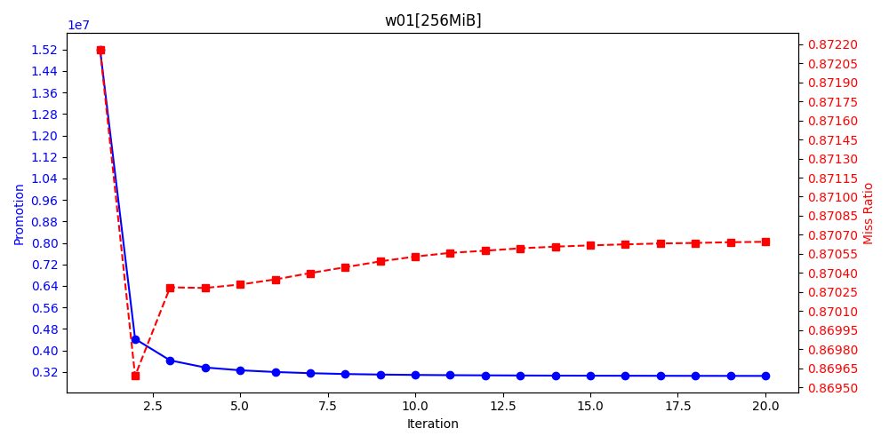  
> **Trace Path**: w01.oracleGeneral.bin.zst  
> **Desc**: 256MiB  
> **Cache Size**: 256MiB  
> **Total Request**: 215,796,257  
> **First Promotion**: 15,198,565  
> **Last Promotion**: 3,050,059  
> **Promotion Reduced**: 12,148,506  

> 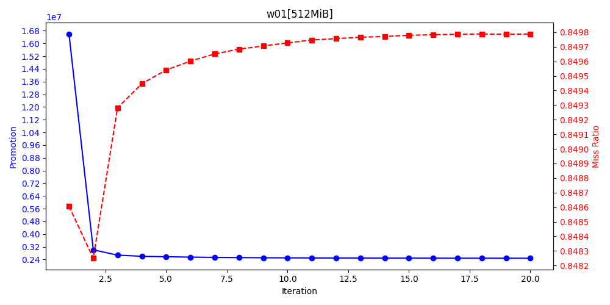  
> **Trace Path**: w01.oracleGeneral.bin.zst  
> **Desc**: 512MiB  
> **Cache Size**: 512MiB  
> **Total Request**: 215,796,257  
> **First Promotion**: 16,595,778  
> **Last Promotion**: 2,481,698  
> **Promotion Reduced**: 14,114,080  

## wiki_2019t https://ftp.pdl.cmu.edu/pub/datasets/twemcacheWorkload/cacheDatasets/wiki/wiki_2019t.oracleGeneral.zst
> 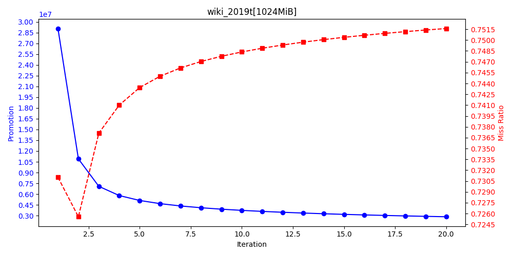  
> **Trace Path**: wiki_2019t.oracleGeneral.zst  
> **Desc**: 1024MiB  
> **Cache Size**: 1024MiB  
> **Total Request**: 207,646,002  
> **First Promotion**: 29,059,808  
> **Last Promotion**: 2,847,540  
> **Promotion Reduced**: 26,212,268  

> 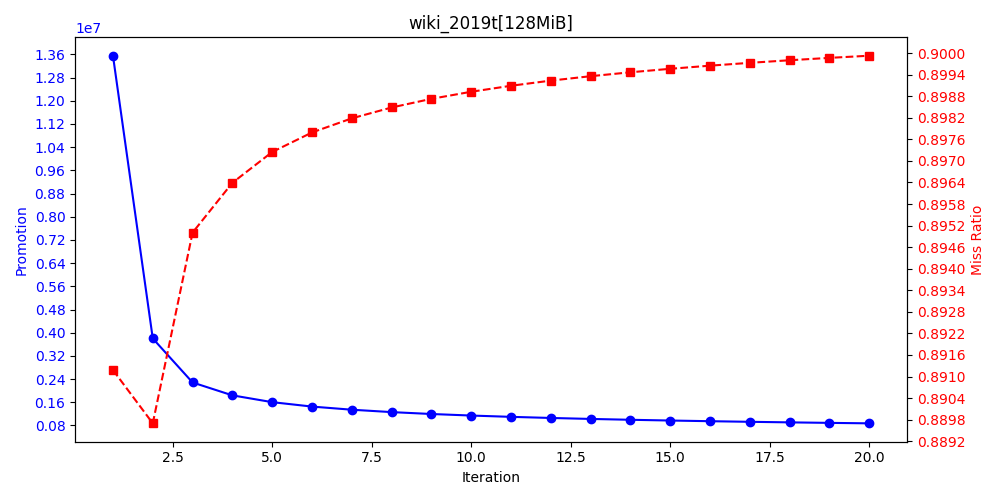  
> **Trace Path**: wiki_2019t.oracleGeneral.zst  
> **Desc**: 128MiB  
> **Cache Size**: 128MiB  
> **Total Request**: 207,646,002  
> **First Promotion**: 13,553,355  
> **Last Promotion**: 873,577  
> **Promotion Reduced**: 12,679,778  

> 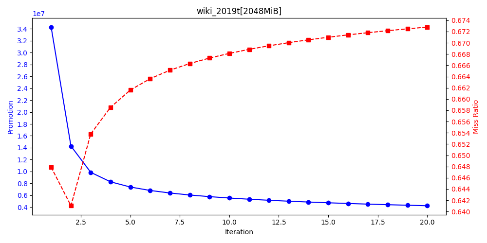  
> **Trace Path**: wiki_2019t.oracleGeneral.zst  
> **Desc**: 2048MiB  
> **Cache Size**: 2048MiB  
> **Total Request**: 207,646,002  
> **First Promotion**: 34,293,293  
> **Last Promotion**: 4,241,720  
> **Promotion Reduced**: 30,051,573  

> 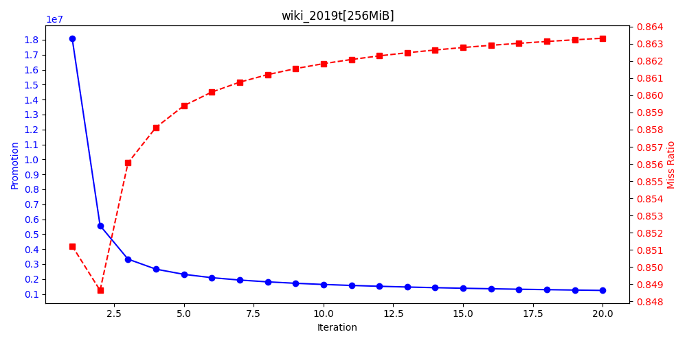  
> **Trace Path**: wiki_2019t.oracleGeneral.zst  
> **Desc**: 256MiB  
> **Cache Size**: 256MiB  
> **Total Request**: 207,646,002  
> **First Promotion**: 18,101,938  
> **Last Promotion**: 1,240,681  
> **Promotion Reduced**: 16,861,257  

> 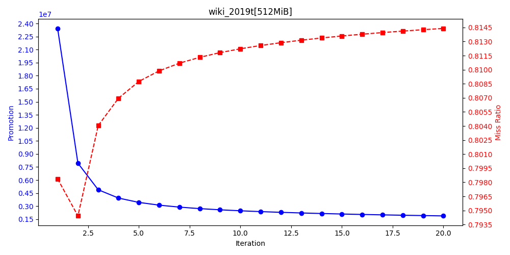  
> **Trace Path**: wiki_2019t.oracleGeneral.zst  
> **Desc**: 512MiB  
> **Cache Size**: 512MiB  
> **Total Request**: 207,646,002  
> **First Promotion**: 23,431,968  
> **Last Promotion**: 1,880,662  
> **Promotion Reduced**: 21,551,306  

## zipf_0.3_10_100 
>   
> **Trace Path**: zipf_0.3_10_100.oracleGeneral  
> **Desc**: 1024MiB  
> **Cache Size**: 1024MiB  
> **Total Request**: 100,000,000  
> **First Promotion**: 25,147,047  
> **Last Promotion**: 474,615  
> **Promotion Reduced**: 24,672,432  

> 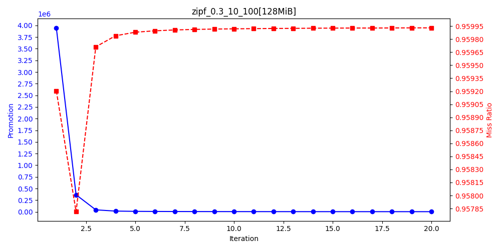  
> **Trace Path**: zipf_0.3_10_100.oracleGeneral  
> **Desc**: 128MiB  
> **Cache Size**: 128MiB  
> **Total Request**: 100,000,000  
> **First Promotion**: 3,947,167  
> **Last Promotion**: 3,606  
> **Promotion Reduced**: 3,943,561  

>   
> **Trace Path**: zipf_0.3_10_100.oracleGeneral  
> **Desc**: 2048MiB  
> **Cache Size**: 2048MiB  
> **Total Request**: 100,000,000  
> **First Promotion**: 39,461,100  
> **Last Promotion**: 3,340,720  
> **Promotion Reduced**: 36,120,380  

> 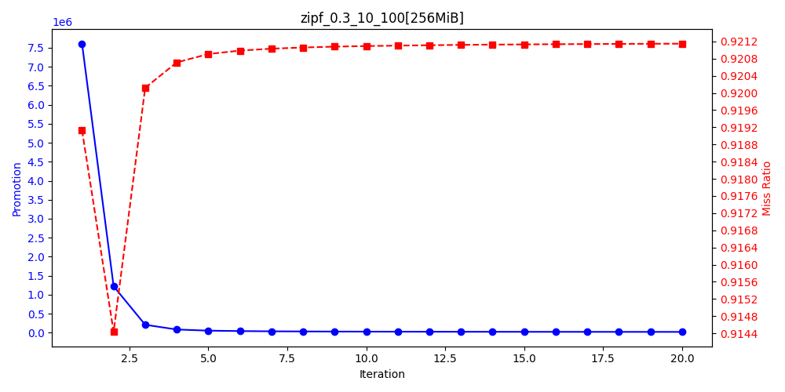  
> **Trace Path**: zipf_0.3_10_100.oracleGeneral  
> **Desc**: 256MiB  
> **Cache Size**: 256MiB  
> **Total Request**: 100,000,000  
> **First Promotion**: 7,608,397  
> **Last Promotion**: 19,506  
> **Promotion Reduced**: 7,588,891  

> 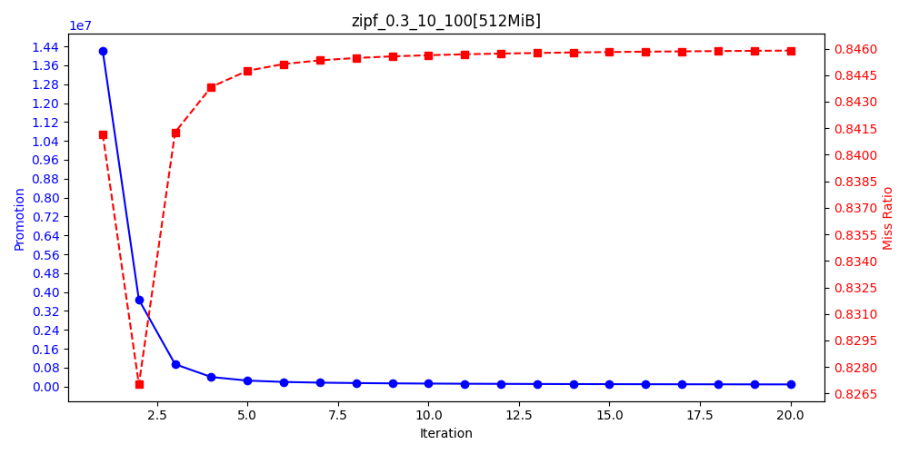  
> **Trace Path**: zipf_0.3_10_100.oracleGeneral  
> **Desc**: 512MiB  
> **Cache Size**: 512MiB  
> **Total Request**: 100,000,000  
> **First Promotion**: 14,223,231  
> **Last Promotion**: 92,367  
> **Promotion Reduced**: 14,130,864  

## zipf_0.7_10_100 
> 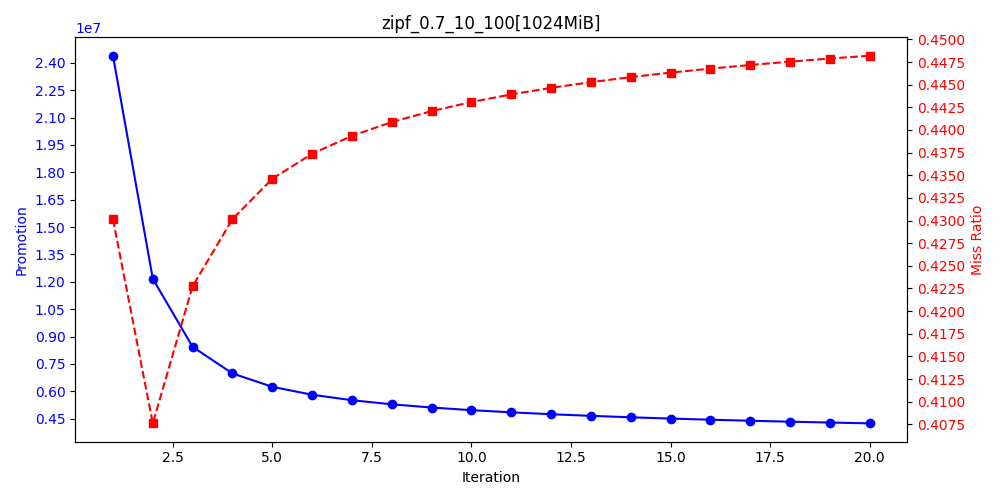  
> **Trace Path**: zipf_0.7_10_100.oracleGeneral  
> **Desc**: 1024MiB  
> **Cache Size**: 1024MiB  
> **Total Request**: 100,000,000  
> **First Promotion**: 24,389,337  
> **Last Promotion**: 4,248,631  
> **Promotion Reduced**: 20,140,706  

> 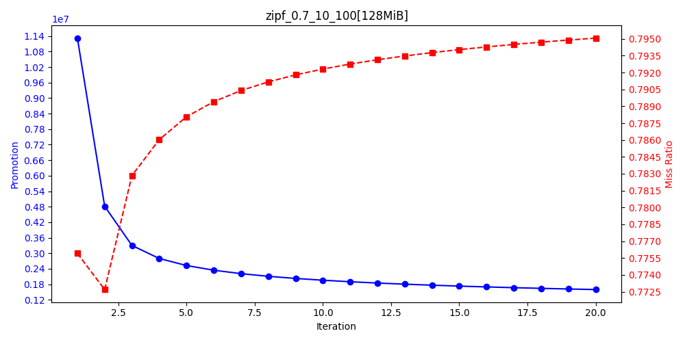  
> **Trace Path**: zipf_0.7_10_100.oracleGeneral  
> **Desc**: 128MiB  
> **Cache Size**: 128MiB  
> **Total Request**: 100,000,000  
> **First Promotion**: 11,321,938  
> **Last Promotion**: 1,594,813  
> **Promotion Reduced**: 9,727,125  

> 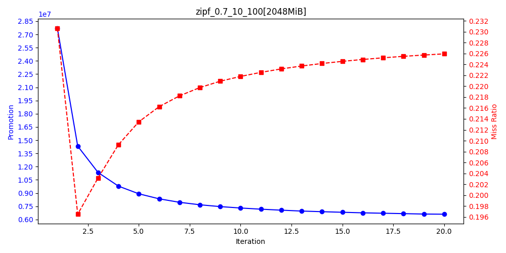  
> **Trace Path**: zipf_0.7_10_100.oracleGeneral  
> **Desc**: 2048MiB  
> **Cache Size**: 2048MiB  
> **Total Request**: 100,000,000  
> **First Promotion**: 27,707,555  
> **Last Promotion**: 6,601,873  
> **Promotion Reduced**: 21,105,682  

> 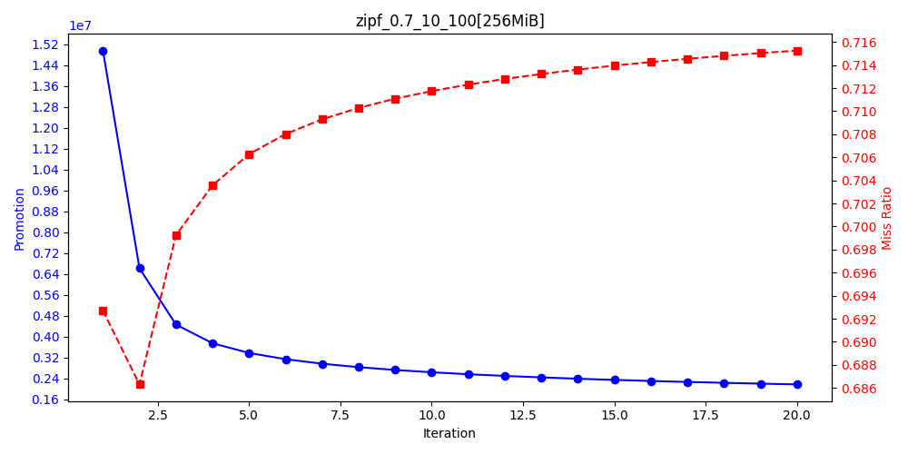  
> **Trace Path**: zipf_0.7_10_100.oracleGeneral  
> **Desc**: 256MiB  
> **Cache Size**: 256MiB  
> **Total Request**: 100,000,000  
> **First Promotion**: 14,954,554  
> **Last Promotion**: 2,168,446  
> **Promotion Reduced**: 12,786,108  

> 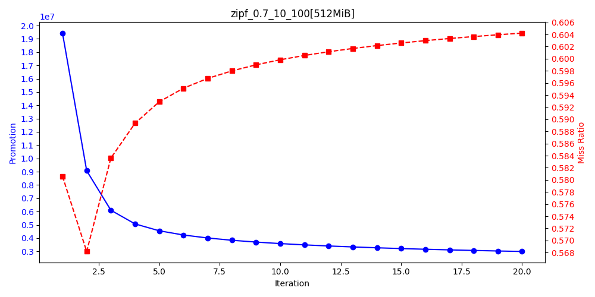  
> **Trace Path**: zipf_0.7_10_100.oracleGeneral  
> **Desc**: 512MiB  
> **Cache Size**: 512MiB  
> **Total Request**: 100,000,000  
> **First Promotion**: 19,433,669  
> **Last Promotion**: 2,995,801  
> **Promotion Reduced**: 16,437,868  

## zipf_0_10_100 
> 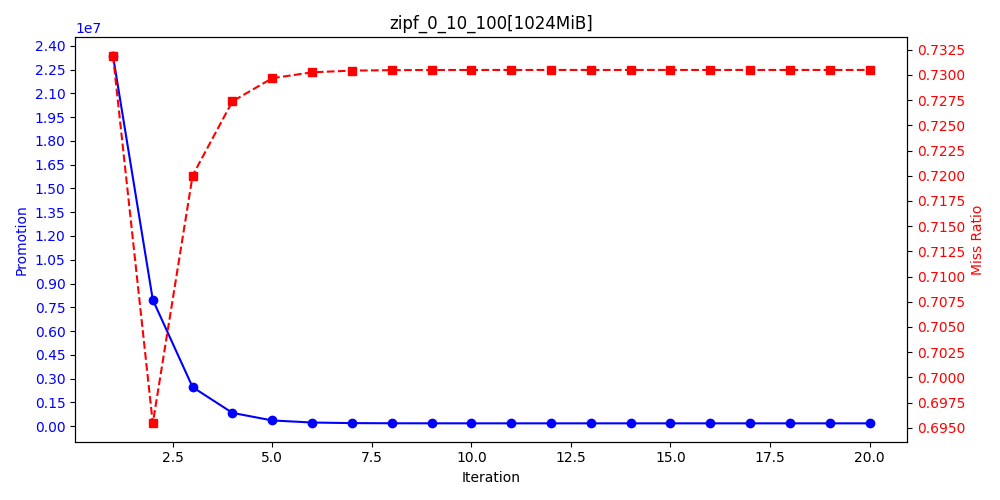  
> **Trace Path**: zipf_0_10_100.oracleGeneral  
> **Desc**: 1024MiB  
> **Cache Size**: 1024MiB  
> **Total Request**: 100,000,000  
> **First Promotion**: 23,371,423  
> **Last Promotion**: 183,336  
> **Promotion Reduced**: 23,188,087  

> 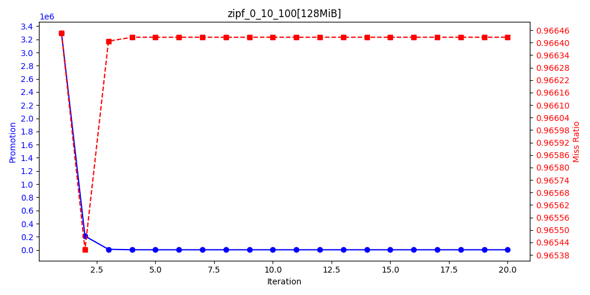  
> **Trace Path**: zipf_0_10_100.oracleGeneral  
> **Desc**: 128MiB  
> **Cache Size**: 128MiB  
> **Total Request**: 100,000,000  
> **First Promotion**: 3,299,204  
> **Last Promotion**: 2,367  
> **Promotion Reduced**: 3,296,837  

> 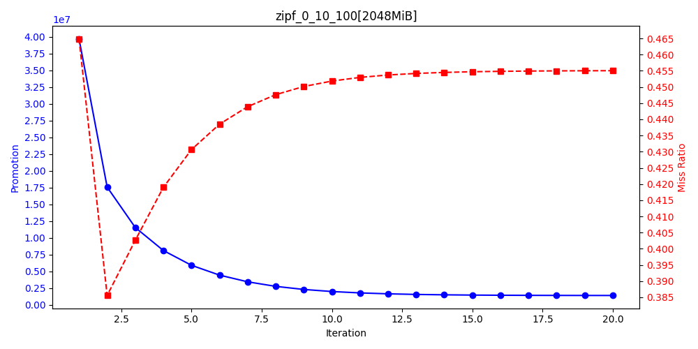  
> **Trace Path**: zipf_0_10_100.oracleGeneral  
> **Desc**: 2048MiB  
> **Cache Size**: 2048MiB  
> **Total Request**: 100,000,000  
> **First Promotion**: 39,701,982  
> **Last Promotion**: 1,405,869  
> **Promotion Reduced**: 38,296,113  

> 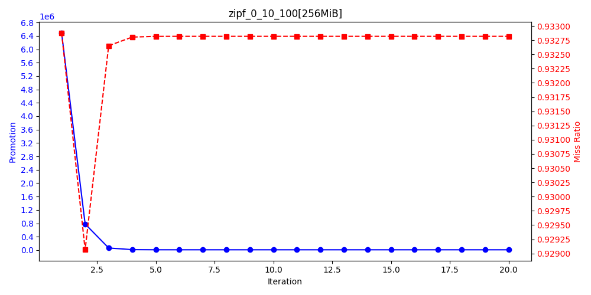  
> **Trace Path**: zipf_0_10_100.oracleGeneral  
> **Desc**: 256MiB  
> **Cache Size**: 256MiB  
> **Total Request**: 100,000,000  
> **First Promotion**: 6,490,010  
> **Last Promotion**: 9,811  
> **Promotion Reduced**: 6,480,199  

> 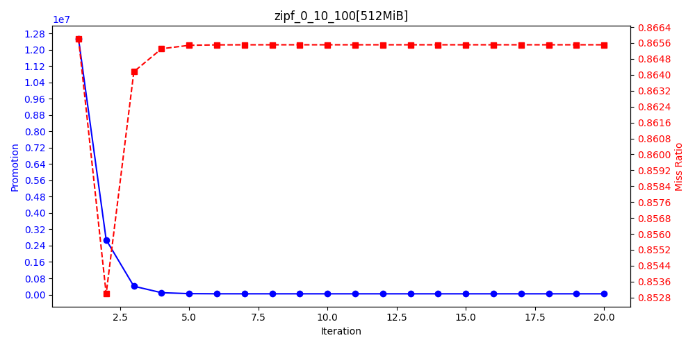  
> **Trace Path**: zipf_0_10_100.oracleGeneral  
> **Desc**: 512MiB  
> **Cache Size**: 512MiB  
> **Total Request**: 100,000,000  
> **First Promotion**: 12,540,067  
> **Last Promotion**: 40,600  
> **Promotion Reduced**: 12,499,467  

## zipf_1.3_10_100 
> 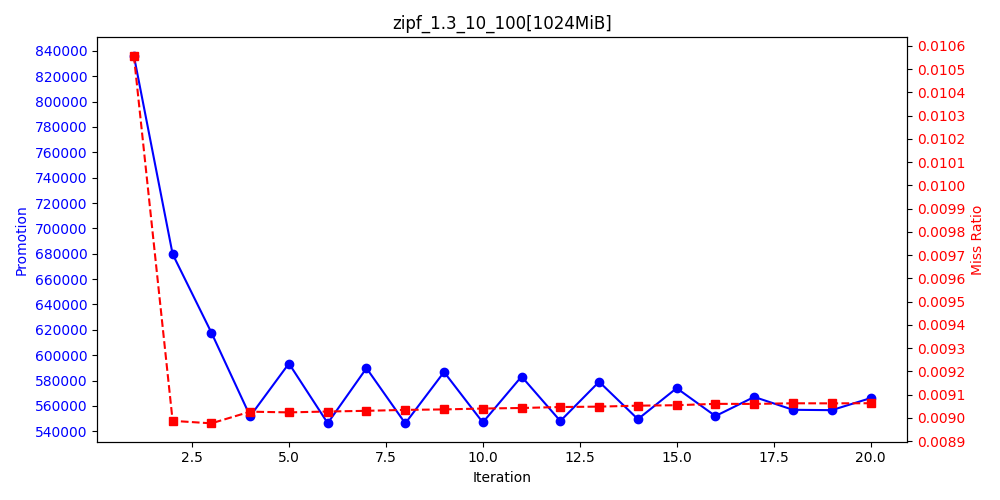  
> **Trace Path**: zipf_1.3_10_100.oracleGeneral  
> **Desc**: 1024MiB  
> **Cache Size**: 1024MiB  
> **Total Request**: 100,000,000  
> **First Promotion**: 836,214  
> **Last Promotion**: 566,136  
> **Promotion Reduced**: 270,078  

> 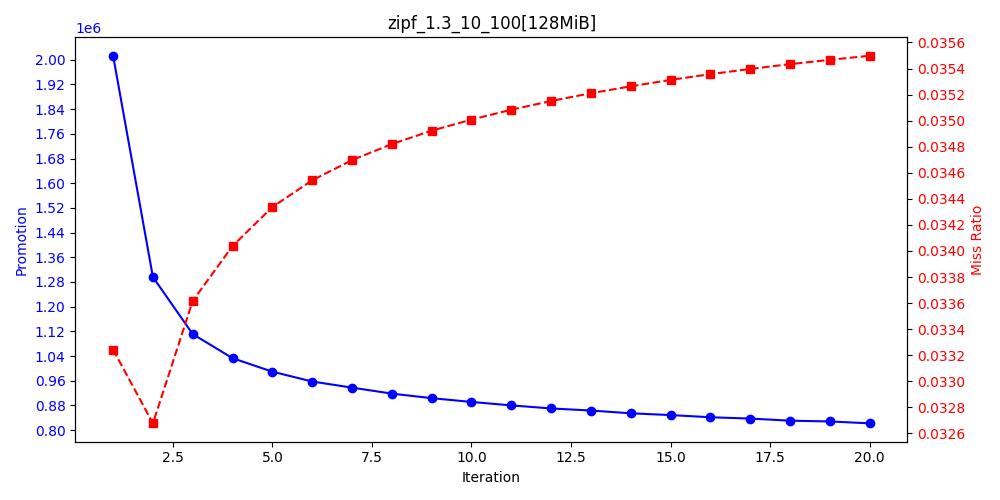  
> **Trace Path**: zipf_1.3_10_100.oracleGeneral  
> **Desc**: 128MiB  
> **Cache Size**: 128MiB  
> **Total Request**: 100,000,000  
> **First Promotion**: 2,013,055  
> **Last Promotion**: 821,995  
> **Promotion Reduced**: 1,191,060  

> 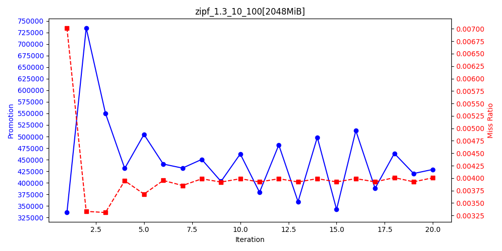  
> **Trace Path**: zipf_1.3_10_100.oracleGeneral  
> **Desc**: 2048MiB  
> **Cache Size**: 2048MiB  
> **Total Request**: 100,000,000  
> **First Promotion**: 335,628  
> **Last Promotion**: 428,849  
> **Promotion Reduced**: -93,221  

> 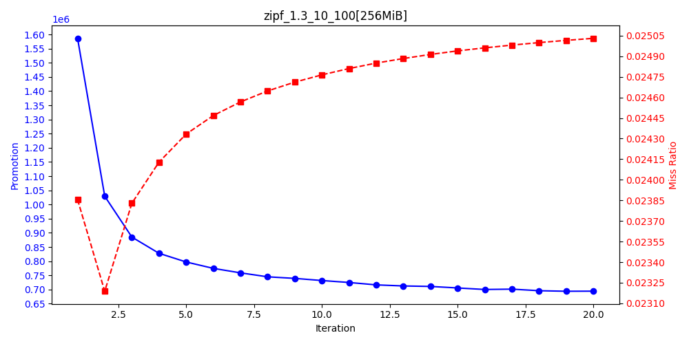  
> **Trace Path**: zipf_1.3_10_100.oracleGeneral  
> **Desc**: 256MiB  
> **Cache Size**: 256MiB  
> **Total Request**: 100,000,000  
> **First Promotion**: 1,586,147  
> **Last Promotion**: 694,232  
> **Promotion Reduced**: 891,915  

> 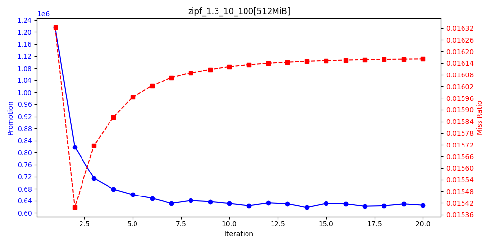  
> **Trace Path**: zipf_1.3_10_100.oracleGeneral  
> **Desc**: 512MiB  
> **Cache Size**: 512MiB  
> **Total Request**: 100,000,000  
> **First Promotion**: 1,215,598  
> **Last Promotion**: 625,621  
> **Promotion Reduced**: 589,977  

## zipf_1.7_10_100 
>   
> **Trace Path**: zipf_1.7_10_100.oracleGeneral  
> **Desc**: 1024MiB  
> **Cache Size**: 1024MiB  
> **Total Request**: 100,000,000  
> **First Promotion**: 0  
> **Last Promotion**: 0  
> **Promotion Reduced**: 0  

>   
> **Trace Path**: zipf_1.7_10_100.oracleGeneral  
> **Desc**: 128MiB  
> **Cache Size**: 128MiB  
> **Total Request**: 100,000,000  
> **First Promotion**: 49,589  
> **Last Promotion**: 43,445  
> **Promotion Reduced**: 6,144  

> 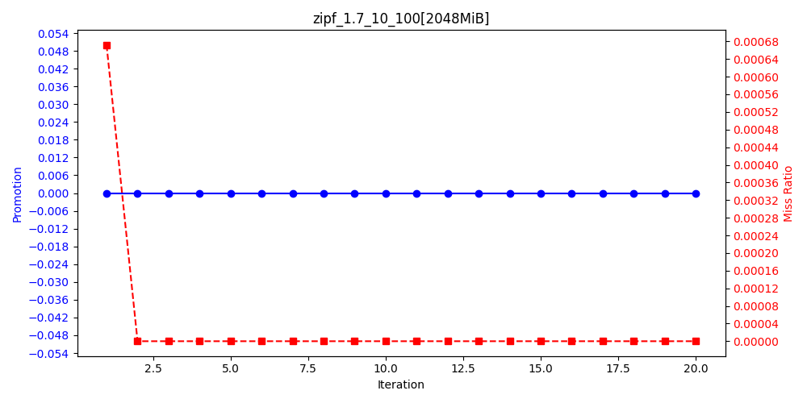  
> **Trace Path**: zipf_1.7_10_100.oracleGeneral  
> **Desc**: 2048MiB  
> **Cache Size**: 2048MiB  
> **Total Request**: 100,000,000  
> **First Promotion**: 0  
> **Last Promotion**: 0  
> **Promotion Reduced**: 0  

> 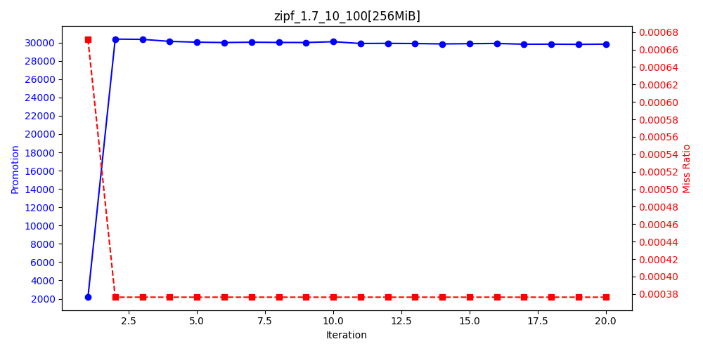  
> **Trace Path**: zipf_1.7_10_100.oracleGeneral  
> **Desc**: 256MiB  
> **Cache Size**: 256MiB  
> **Total Request**: 100,000,000  
> **First Promotion**: 2,169  
> **Last Promotion**: 29,825  
> **Promotion Reduced**: -27,656  

> 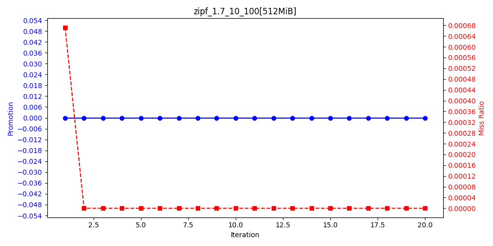  
> **Trace Path**: zipf_1.7_10_100.oracleGeneral  
> **Desc**: 512MiB  
> **Cache Size**: 512MiB  
> **Total Request**: 100,000,000  
> **First Promotion**: 0  
> **Last Promotion**: 0  
> **Promotion Reduced**: 0  

## zipf_1_10_100 
> 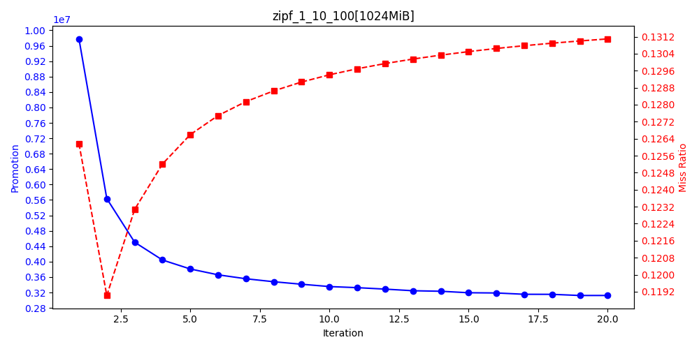  
> **Trace Path**: zipf_1_10_100.oracleGeneral  
> **Desc**: 1024MiB  
> **Cache Size**: 1024MiB  
> **Total Request**: 100,000,000  
> **First Promotion**: 9,778,247  
> **Last Promotion**: 3,122,156  
> **Promotion Reduced**: 6,656,091  

>   
> **Trace Path**: zipf_1_10_100.oracleGeneral  
> **Desc**: 128MiB  
> **Cache Size**: 128MiB  
> **Total Request**: 100,000,000  
> **First Promotion**: 10,405,098  
> **Last Promotion**: 3,067,153  
> **Promotion Reduced**: 7,337,945  

> 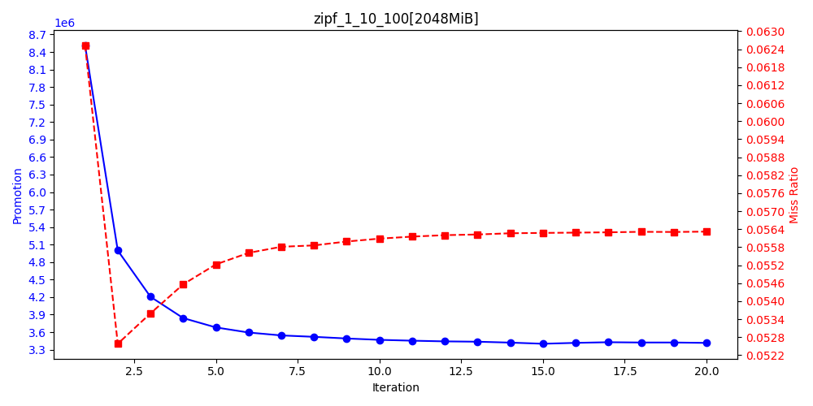  
> **Trace Path**: zipf_1_10_100.oracleGeneral  
> **Desc**: 2048MiB  
> **Cache Size**: 2048MiB  
> **Total Request**: 100,000,000  
> **First Promotion**: 8,515,912  
> **Last Promotion**: 3,415,423  
> **Promotion Reduced**: 5,100,489  

> 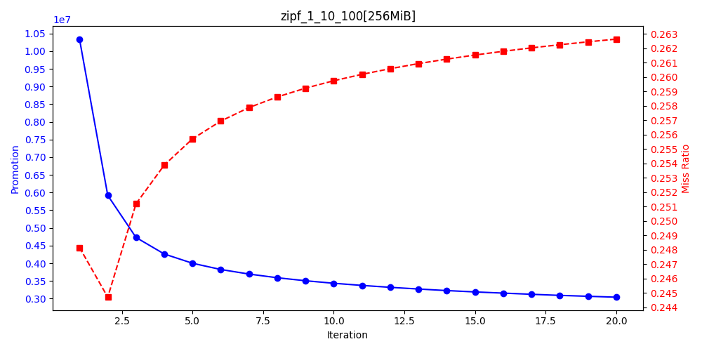  
> **Trace Path**: zipf_1_10_100.oracleGeneral  
> **Desc**: 256MiB  
> **Cache Size**: 256MiB  
> **Total Request**: 100,000,000  
> **First Promotion**: 10,340,258  
> **Last Promotion**: 3,040,580  
> **Promotion Reduced**: 7,299,678  

> 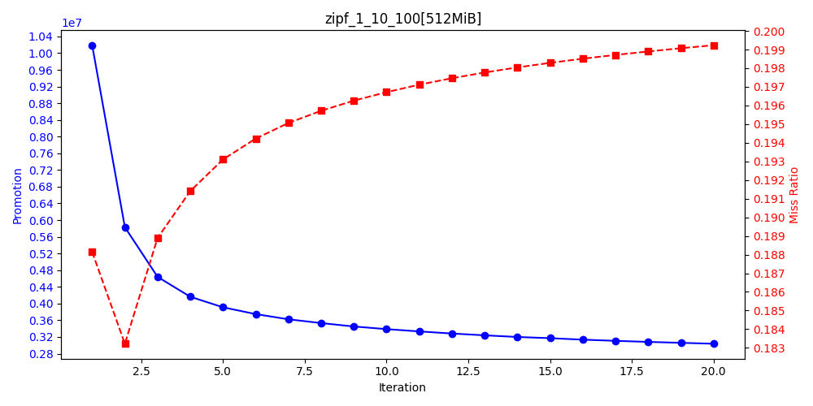  
> **Trace Path**: zipf_1_10_100.oracleGeneral  
> **Desc**: 512MiB  
> **Cache Size**: 512MiB  
> **Total Request**: 100,000,000  
> **First Promotion**: 10,189,931  
> **Last Promotion**: 3,036,856  
> **Promotion Reduced**: 7,153,075  

## zipf_2_10_100 
> 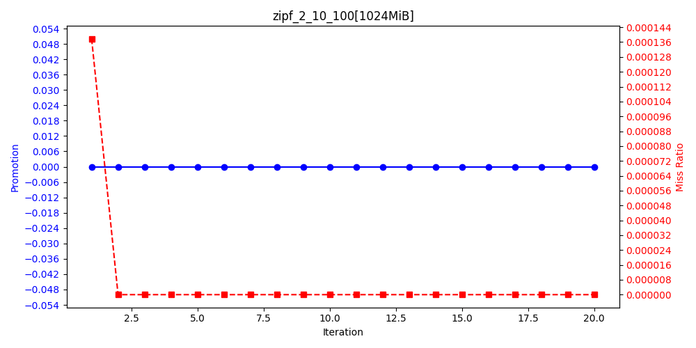  
> **Trace Path**: zipf_2_10_100.oracleGeneral  
> **Desc**: 1024MiB  
> **Cache Size**: 1024MiB  
> **Total Request**: 100,000,000  
> **First Promotion**: 0  
> **Last Promotion**: 0  
> **Promotion Reduced**: 0  

> 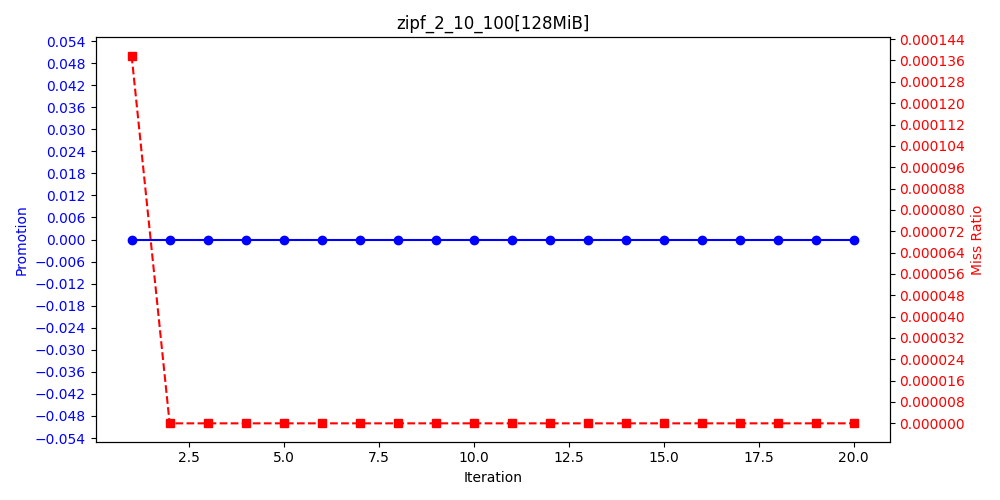  
> **Trace Path**: zipf_2_10_100.oracleGeneral  
> **Desc**: 128MiB  
> **Cache Size**: 128MiB  
> **Total Request**: 100,000,000  
> **First Promotion**: 0  
> **Last Promotion**: 0  
> **Promotion Reduced**: 0  

> 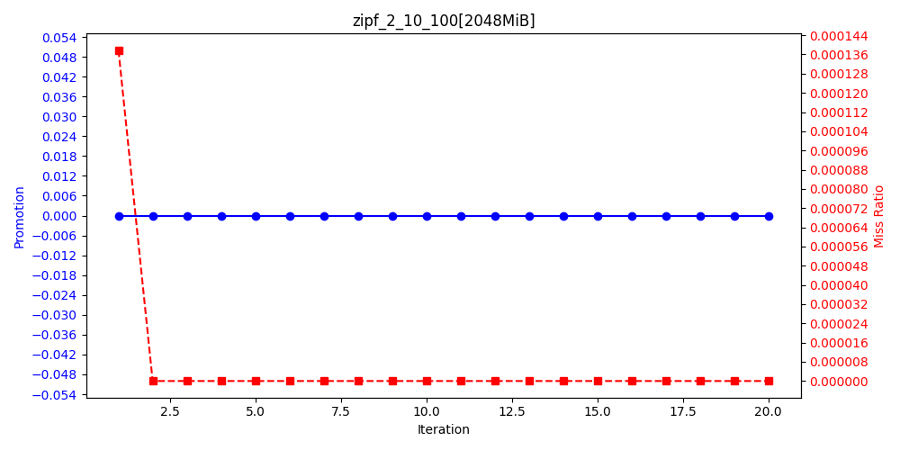  
> **Trace Path**: zipf_2_10_100.oracleGeneral  
> **Desc**: 2048MiB  
> **Cache Size**: 2048MiB  
> **Total Request**: 100,000,000  
> **First Promotion**: 0  
> **Last Promotion**: 0  
> **Promotion Reduced**: 0  

> 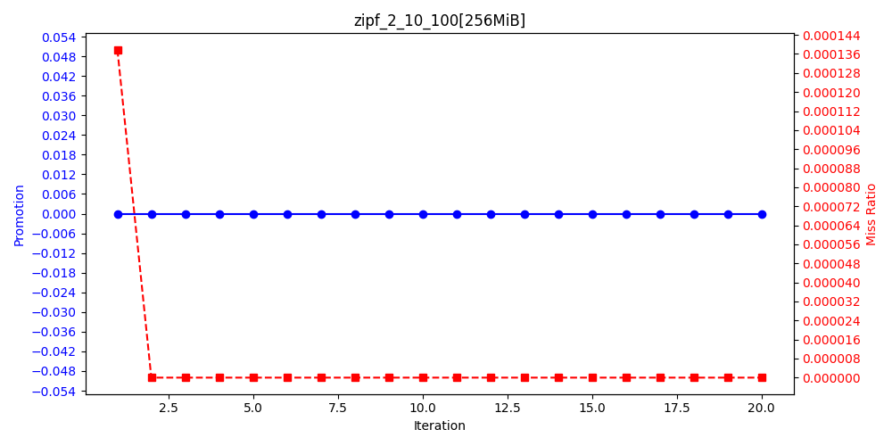  
> **Trace Path**: zipf_2_10_100.oracleGeneral  
> **Desc**: 256MiB  
> **Cache Size**: 256MiB  
> **Total Request**: 100,000,000  
> **First Promotion**: 0  
> **Last Promotion**: 0  
> **Promotion Reduced**: 0  

>   
> **Trace Path**: zipf_2_10_100.oracleGeneral  
> **Desc**: 512MiB  
> **Cache Size**: 512MiB  
> **Total Request**: 100,000,000  
> **First Promotion**: 0  
> **Last Promotion**: 0  
> **Promotion Reduced**: 0  

