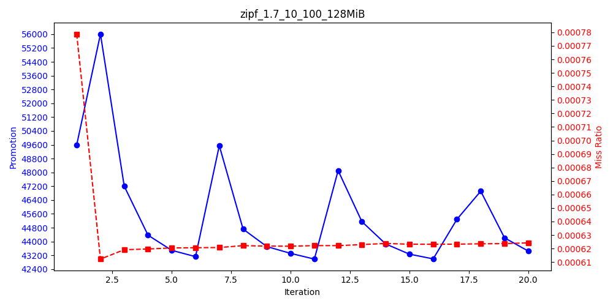
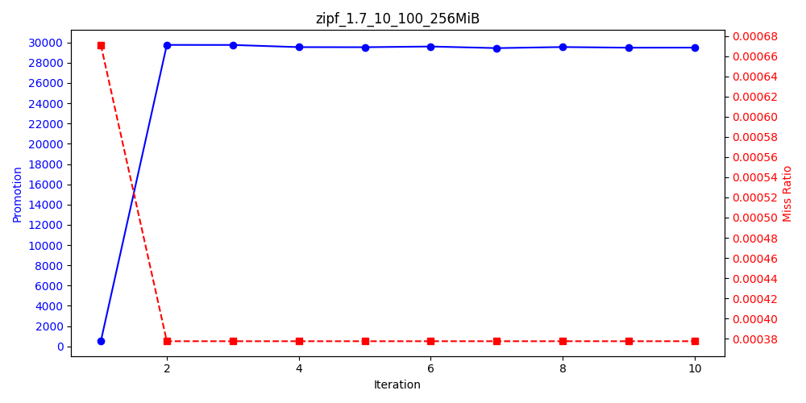
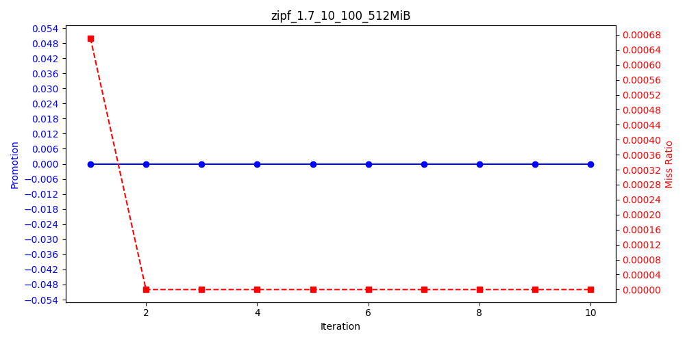
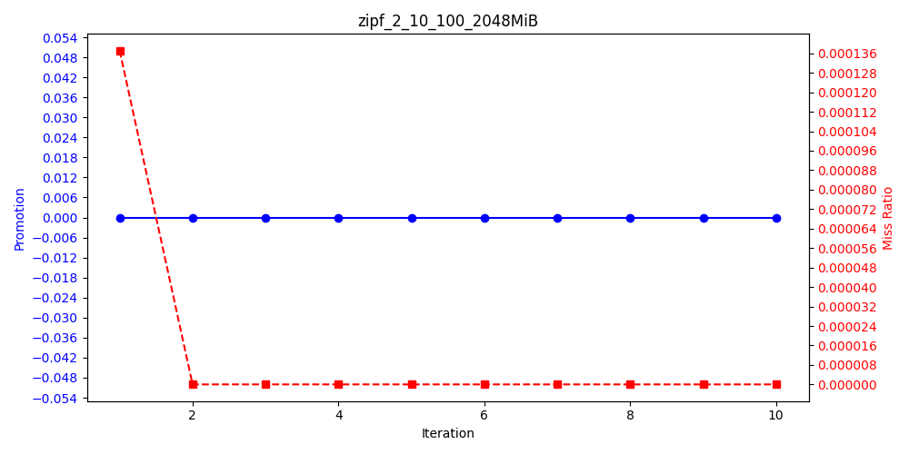

# RESULT
## zipf_1.7_10_100 
>   
> **Trace Path**: zipf_1.7_10_100.oracleGeneral  
> **Cache Size**: 128MiB  
> **Total Request**: 100,000,000  
> **First Promotion**: 49,589  
> **Last Promotion**: 43,445  
> **Promotion Reduced**: 6,144  

>   
> **Trace Path**: zipf_1.7_10_100.oracleGeneral  
> **Cache Size**: 256MiB  
> **Total Request**: 100,000,000  
> **First Promotion**: 2,169  
> **Last Promotion**: 29,825  
> **Promotion Reduced**: -27,656  

>   
> **Trace Path**: zipf_1.7_10_100.oracleGeneral  
> **Cache Size**: 512MiB  
> **Total Request**: 100,000,000  
> **First Promotion**: 0  
> **Last Promotion**: 0  
> **Promotion Reduced**: 0  

>   
> **Trace Path**: zipf_1.7_10_100.oracleGeneral  
> **Cache Size**: 1024MiB  
> **Total Request**: 100,000,000  
> **First Promotion**: 0  
> **Last Promotion**: 0  
> **Promotion Reduced**: 0  

>   
> **Trace Path**: zipf_1.7_10_100.oracleGeneral  
> **Cache Size**: 2048MiB  
> **Total Request**: 100,000,000  
> **First Promotion**: 0  
> **Last Promotion**: 0  
> **Promotion Reduced**: 0  

## zipf_2_10_100 
>   
> **Trace Path**: zipf_2_10_100.oracleGeneral  
> **Cache Size**: 128MiB  
> **Total Request**: 100,000,000  
> **First Promotion**: 0  
> **Last Promotion**: 0  
> **Promotion Reduced**: 0  

>   
> **Trace Path**: zipf_2_10_100.oracleGeneral  
> **Cache Size**: 256MiB  
> **Total Request**: 100,000,000  
> **First Promotion**: 0  
> **Last Promotion**: 0  
> **Promotion Reduced**: 0  

>   
> **Trace Path**: zipf_2_10_100.oracleGeneral  
> **Cache Size**: 512MiB  
> **Total Request**: 100,000,000  
> **First Promotion**: 0  
> **Last Promotion**: 0  
> **Promotion Reduced**: 0  

>   
> **Trace Path**: zipf_2_10_100.oracleGeneral  
> **Cache Size**: 1024MiB  
> **Total Request**: 100,000,000  
> **First Promotion**: 0  
> **Last Promotion**: 0  
> **Promotion Reduced**: 0  

>   
> **Trace Path**: zipf_2_10_100.oracleGeneral  
> **Cache Size**: 2048MiB  
> **Total Request**: 100,000,000  
> **First Promotion**: 0  
> **Last Promotion**: 0  
> **Promotion Reduced**: 0  

