# RESULT
## 1351 https://ftp.pdl.cmu.edu/pub/datasets/twemcacheWorkload/cacheDatasets/tencentBlock/v2/traces/1351.oracleGeneral.zst
>   
> **Trace Path**: 1351.oracleGeneral.zst  
> **Desc**: 0.001  
> **Cache Size**: 191MiB  
> **Total Request**: 195,824,302  
> **First Promotion**: 2,710,642  
> **Last Promotion**: 113,923  
> **Promotion Reduced**: 2,596,719  

>   
> **Trace Path**: 1351.oracleGeneral.zst  
> **Desc**: 0.01  
> **Cache Size**: 1911MiB  
> **Total Request**: 195,824,302  
> **First Promotion**: 40,359,057  
> **Last Promotion**: 3,787,760  
> **Promotion Reduced**: 36,571,297  

>   
> **Trace Path**: 1351.oracleGeneral.zst  
> **Desc**: 0.1  
> **Cache Size**: 19112MiB  
> **Total Request**: 195,824,302  
> **First Promotion**: 51,806,832  
> **Last Promotion**: 12,322,458  
> **Promotion Reduced**: 39,484,374  

>   
> **Trace Path**: 1351.oracleGeneral.zst  
> **Desc**: 0.2  
> **Cache Size**: 38224MiB  
> **Total Request**: 195,824,302  
> **First Promotion**: 18,710,365  
> **Last Promotion**: 10,533,725  
> **Promotion Reduced**: 8,176,640  

>   
> **Trace Path**: 1351.oracleGeneral.zst  
> **Desc**: 0.4  
> **Cache Size**: 76449MiB  
> **Total Request**: 195,824,302  
> **First Promotion**: 5,728,417  
> **Last Promotion**: 3,261,868  
> **Promotion Reduced**: 2,466,549  

>   
> **Trace Path**: 1351.oracleGeneral.zst  
> **Desc**: 512MiB  
> **Cache Size**: 512MiB  
> **Total Request**: 195,824,302  
> **First Promotion**: 17,635,612  
> **Last Promotion**: 2,341,384  
> **Promotion Reduced**: 15,294,228  

## 2016_LUN1 https://ftp.pdl.cmu.edu/pub/datasets/twemcacheWorkload/cacheDatasets/systor/2016_LUN1.oracleGeneral.zst
>   
> **Trace Path**: 2016_LUN1.oracleGeneral.zst  
> **Desc**: 0.001  
> **Cache Size**: 2287MiB  
> **Total Request**: 492,030,661  
> **First Promotion**: 36,165,297  
> **Last Promotion**: 6,439,148  
> **Promotion Reduced**: 29,726,149  

>   
> **Trace Path**: 2016_LUN1.oracleGeneral.zst  
> **Desc**: 0.01  
> **Cache Size**: 22876MiB  
> **Total Request**: 492,030,661  
> **First Promotion**: 47,432,356  
> **Last Promotion**: 3,988,889  
> **Promotion Reduced**: 43,443,467  

>   
> **Trace Path**: 2016_LUN1.oracleGeneral.zst  
> **Desc**: 0.1  
> **Cache Size**: 228766MiB  
> **Total Request**: 492,030,661  
> **First Promotion**: 91,323,446  
> **Last Promotion**: 27,412,298  
> **Promotion Reduced**: 63,911,148  

>   
> **Trace Path**: 2016_LUN1.oracleGeneral.zst  
> **Desc**: 0.2  
> **Cache Size**: 457532MiB  
> **Total Request**: 492,030,661  
> **First Promotion**: 111,167,120  
> **Last Promotion**: 60,066,783  
> **Promotion Reduced**: 51,100,337  

>   
> **Trace Path**: 2016_LUN1.oracleGeneral.zst  
> **Desc**: 0.4  
> **Cache Size**: 915064MiB  
> **Total Request**: 492,030,661  
> **First Promotion**: 59,773,712  
> **Last Promotion**: 40,470,088  
> **Promotion Reduced**: 19,303,624  

## 7 https://ftp.pdl.cmu.edu/pub/datasets/twemcacheWorkload/cacheDatasets/alibabaBlock/v2/7.oracleGeneral.zst
>   
> **Trace Path**: 7.oracleGeneral.zst  
> **Desc**: 0.001  
> **Cache Size**: 131MiB  
> **Total Request**: 265,694,431  
> **First Promotion**: 23,868,697  
> **Last Promotion**: 3,978,258  
> **Promotion Reduced**: 19,890,439  

>   
> **Trace Path**: 7.oracleGeneral.zst  
> **Desc**: 0.01  
> **Cache Size**: 1314MiB  
> **Total Request**: 265,694,431  
> **First Promotion**: 20,065,703  
> **Last Promotion**: 801,111  
> **Promotion Reduced**: 19,264,592  

>   
> **Trace Path**: 7.oracleGeneral.zst  
> **Desc**: 0.1  
> **Cache Size**: 13148MiB  
> **Total Request**: 265,694,431  
> **First Promotion**: 30,978,318  
> **Last Promotion**: 9,870,939  
> **Promotion Reduced**: 21,107,379  

>   
> **Trace Path**: 7.oracleGeneral.zst  
> **Desc**: 0.2  
> **Cache Size**: 26296MiB  
> **Total Request**: 265,694,431  
> **First Promotion**: 20,250,750  
> **Last Promotion**: 8,689,788  
> **Promotion Reduced**: 11,560,962  

>   
> **Trace Path**: 7.oracleGeneral.zst  
> **Desc**: 0.4  
> **Cache Size**: 52593MiB  
> **Total Request**: 265,694,431  
> **First Promotion**: 10,566,667  
> **Last Promotion**: 6,882,048  
> **Promotion Reduced**: 3,684,619  

## block_traces_5 https://ftp.pdl.cmu.edu/pub/datasets/twemcacheWorkload/cacheDatasets/metaStorage/block_traces_5.oracleGeneral.bin.zst
>   
> **Trace Path**: block_traces_5.oracleGeneral.bin.zst  
> **Desc**: 0.001  
> **Cache Size**: 31349MiB  
> **Total Request**: 14,556,172  
> **First Promotion**: 2,799,029  
> **Last Promotion**: 59,968  
> **Promotion Reduced**: 2,739,061  

>   
> **Trace Path**: block_traces_5.oracleGeneral.bin.zst  
> **Desc**: 0.01  
> **Cache Size**: 313497MiB  
> **Total Request**: 14,556,172  
> **First Promotion**: 2,804,423  
> **Last Promotion**: 21,377  
> **Promotion Reduced**: 2,783,046  

>   
> **Trace Path**: block_traces_5.oracleGeneral.bin.zst  
> **Desc**: 0.1  
> **Cache Size**: 3134978MiB  
> **Total Request**: 14,556,172  
> **First Promotion**: 2,638,329  
> **Last Promotion**: 210,171  
> **Promotion Reduced**: 2,428,158  

>   
> **Trace Path**: block_traces_5.oracleGeneral.bin.zst  
> **Desc**: 0.2  
> **Cache Size**: 6269957MiB  
> **Total Request**: 14,556,172  
> **First Promotion**: 2,434,210  
> **Last Promotion**: 403,360  
> **Promotion Reduced**: 2,030,850  

>   
> **Trace Path**: block_traces_5.oracleGeneral.bin.zst  
> **Desc**: 0.4  
> **Cache Size**: 12539914MiB  
> **Total Request**: 14,556,172  
> **First Promotion**: 2,001,105  
> **Last Promotion**: 748,099  
> **Promotion Reduced**: 1,253,006  

## cluster50 https://ftp.pdl.cmu.edu/pub/datasets/twemcacheWorkload/cacheDatasets/twitter/cluster50.oracleGeneral.zst
>   
> **Trace Path**: cluster50.oracleGeneral.zst  
> **Desc**: 0.001  
> **Cache Size**: 41MiB  
> **Total Request**: 139,655,585  
> **First Promotion**: 37,725,637  
> **Last Promotion**: 19,253  
> **Promotion Reduced**: 37,706,384  

>   
> **Trace Path**: cluster50.oracleGeneral.zst  
> **Desc**: 0.01  
> **Cache Size**: 413MiB  
> **Total Request**: 139,655,585  
> **First Promotion**: 49,659,077  
> **Last Promotion**: 1,345,080  
> **Promotion Reduced**: 48,313,997  

>   
> **Trace Path**: cluster50.oracleGeneral.zst  
> **Desc**: 0.1  
> **Cache Size**: 4133MiB  
> **Total Request**: 139,655,585  
> **First Promotion**: 37,945,441  
> **Last Promotion**: 5,585,833  
> **Promotion Reduced**: 32,359,608  

>   
> **Trace Path**: cluster50.oracleGeneral.zst  
> **Desc**: 0.2  
> **Cache Size**: 8267MiB  
> **Total Request**: 139,655,585  
> **First Promotion**: 26,127,970  
> **Last Promotion**: 4,990,049  
> **Promotion Reduced**: 21,137,921  

>   
> **Trace Path**: cluster50.oracleGeneral.zst  
> **Desc**: 0.4  
> **Cache Size**: 16535MiB  
> **Total Request**: 139,655,585  
> **First Promotion**: 17,130,495  
> **Last Promotion**: 5,082,368  
> **Promotion Reduced**: 12,048,127  

## fiu_cheetah.cs.fiu.edu-110108-113008 https://ftp.pdl.cmu.edu/pub/datasets/twemcacheWorkload/cacheDatasets/fiu/fiu_cheetah.cs.fiu.edu-110108-113008.oracleGeneral.zst
>   
> **Trace Path**: fiu_cheetah.cs.fiu.edu-110108-113008.oracleGeneral.zst  
> **Desc**: 0.001  
> **Cache Size**: 58MiB  
> **Total Request**: 442,393,092  
> **First Promotion**: 21,117,805  
> **Last Promotion**: 5,548  
> **Promotion Reduced**: 21,112,257  

>   
> **Trace Path**: fiu_cheetah.cs.fiu.edu-110108-113008.oracleGeneral.zst  
> **Desc**: 0.01  
> **Cache Size**: 582MiB  
> **Total Request**: 442,393,092  
> **First Promotion**: 135,940,681  
> **Last Promotion**: 3,706,277  
> **Promotion Reduced**: 132,234,404  

>   
> **Trace Path**: fiu_cheetah.cs.fiu.edu-110108-113008.oracleGeneral.zst  
> **Desc**: 0.1  
> **Cache Size**: 5823MiB  
> **Total Request**: 442,393,092  
> **First Promotion**: 31,946,046  
> **Last Promotion**: 13,082,488  
> **Promotion Reduced**: 18,863,558  

>   
> **Trace Path**: fiu_cheetah.cs.fiu.edu-110108-113008.oracleGeneral.zst  
> **Desc**: 0.2  
> **Cache Size**: 11647MiB  
> **Total Request**: 442,393,092  
> **First Promotion**: 22,299,069  
> **Last Promotion**: 9,368,430  
> **Promotion Reduced**: 12,930,639  

>   
> **Trace Path**: fiu_cheetah.cs.fiu.edu-110108-113008.oracleGeneral.zst  
> **Desc**: 0.4  
> **Cache Size**: 23295MiB  
> **Total Request**: 442,393,092  
> **First Promotion**: 16,276,237  
> **Last Promotion**: 9,483,117  
> **Promotion Reduced**: 6,793,120  

## meta_kvcache_traces_1 https://ftp.pdl.cmu.edu/pub/datasets/twemcacheWorkload/cacheDatasets/metaKV/meta_kvcache_traces_1.oracleGeneral.bin.zst
>   
> **Trace Path**: meta_kvcache_traces_1.oracleGeneral.bin.zst  
> **Desc**: 0.001  
> **Cache Size**: 15MiB  
> **Total Request**: 340,306,627  
> **First Promotion**: 42,137,594  
> **Last Promotion**: 1,545,194  
> **Promotion Reduced**: 40,592,400  

>   
> **Trace Path**: meta_kvcache_traces_1.oracleGeneral.bin.zst  
> **Desc**: 0.01  
> **Cache Size**: 154MiB  
> **Total Request**: 340,306,627  
> **First Promotion**: 35,940,168  
> **Last Promotion**: 7,051,201  
> **Promotion Reduced**: 28,888,967  

>   
> **Trace Path**: meta_kvcache_traces_1.oracleGeneral.bin.zst  
> **Desc**: 0.1  
> **Cache Size**: 1547MiB  
> **Total Request**: 340,306,627  
> **First Promotion**: 18,900,782  
> **Last Promotion**: 5,548,145  
> **Promotion Reduced**: 13,352,637  

>   
> **Trace Path**: meta_kvcache_traces_1.oracleGeneral.bin.zst  
> **Desc**: 0.2  
> **Cache Size**: 3094MiB  
> **Total Request**: 340,306,627  
> **First Promotion**: 14,457,342  
> **Last Promotion**: 5,461,252  
> **Promotion Reduced**: 8,996,090  

>   
> **Trace Path**: meta_kvcache_traces_1.oracleGeneral.bin.zst  
> **Desc**: 0.4  
> **Cache Size**: 6188MiB  
> **Total Request**: 340,306,627  
> **First Promotion**: 10,387,672  
> **Last Promotion**: 5,491,211  
> **Promotion Reduced**: 4,896,461  

## meta_rnha https://ftp.pdl.cmu.edu/pub/datasets/twemcacheWorkload/cacheDatasets/metaCDN/meta_rnha.oracleGeneral.zst
>   
> **Trace Path**: meta_rnha.oracleGeneral.zst  
> **Desc**: 0.001  
> **Cache Size**: 729265MiB  
> **Total Request**: 96,680,668  
> **First Promotion**: 9,835,651  
> **Last Promotion**: 159,048  
> **Promotion Reduced**: 9,676,603  

>   
> **Trace Path**: meta_rnha.oracleGeneral.zst  
> **Desc**: 0.01  
> **Cache Size**: 7292652MiB  
> **Total Request**: 96,680,668  
> **First Promotion**: 11,986,705  
> **Last Promotion**: 536,889  
> **Promotion Reduced**: 11,449,816  

>   
> **Trace Path**: meta_rnha.oracleGeneral.zst  
> **Desc**: 0.1  
> **Cache Size**: 72926528MiB  
> **Total Request**: 96,680,668  
> **First Promotion**: 13,802,722  
> **Last Promotion**: 2,091,905  
> **Promotion Reduced**: 11,710,817  

>   
> **Trace Path**: meta_rnha.oracleGeneral.zst  
> **Desc**: 0.2  
> **Cache Size**: 145853056MiB  
> **Total Request**: 96,680,668  
> **First Promotion**: 13,923,286  
> **Last Promotion**: 3,713,235  
> **Promotion Reduced**: 10,210,051  

>   
> **Trace Path**: meta_rnha.oracleGeneral.zst  
> **Desc**: 0.4  
> **Cache Size**: 291706112MiB  
> **Total Request**: 96,680,668  
> **First Promotion**: 10,339,626  
> **Last Promotion**: 4,890,692  
> **Promotion Reduced**: 5,448,934  

## msr_prxy_1 https://ftp.pdl.cmu.edu/pub/datasets/twemcacheWorkload/cacheDatasets/msr/msr_prxy_1.oracleGeneral.zst
>   
> **Trace Path**: msr_prxy_1.oracleGeneral.zst  
> **Desc**: 0.001  
> **Cache Size**: 15MiB  
> **Total Request**: 168,638,964  
> **First Promotion**: 22,350,092  
> **Last Promotion**: 996,554  
> **Promotion Reduced**: 21,353,538  

>   
> **Trace Path**: msr_prxy_1.oracleGeneral.zst  
> **Desc**: 0.01  
> **Cache Size**: 157MiB  
> **Total Request**: 168,638,964  
> **First Promotion**: 20,572,333  
> **Last Promotion**: 17,239,077  
> **Promotion Reduced**: 3,333,256  

>   
> **Trace Path**: msr_prxy_1.oracleGeneral.zst  
> **Desc**: 0.1  
> **Cache Size**: 1571MiB  
> **Total Request**: 168,638,964  
> **First Promotion**: 426,485  
> **Last Promotion**: 340,076  
> **Promotion Reduced**: 86,409  

>   
> **Trace Path**: msr_prxy_1.oracleGeneral.zst  
> **Desc**: 0.2  
> **Cache Size**: 3143MiB  
> **Total Request**: 168,638,964  
> **First Promotion**: 222,664  
> **Last Promotion**: 158,382  
> **Promotion Reduced**: 64,282  

>   
> **Trace Path**: msr_prxy_1.oracleGeneral.zst  
> **Desc**: 0.4  
> **Cache Size**: 6287MiB  
> **Total Request**: 168,638,964  
> **First Promotion**: 105,611  
> **Last Promotion**: 78,187  
> **Promotion Reduced**: 27,424  

## w01 https://ftp.pdl.cmu.edu/pub/datasets/twemcacheWorkload/cacheDatasets/cloudphysics/w01.oracleGeneral.bin.zst
>   
> **Trace Path**: w01.oracleGeneral.bin.zst  
> **Desc**: 0.001  
> **Cache Size**: 654MiB  
> **Total Request**: 215,796,257  
> **First Promotion**: 16,173,662  
> **Last Promotion**: 2,248,734  
> **Promotion Reduced**: 13,924,928  

>   
> **Trace Path**: w01.oracleGeneral.bin.zst  
> **Desc**: 0.01  
> **Cache Size**: 6541MiB  
> **Total Request**: 215,796,257  
> **First Promotion**: 13,650,281  
> **Last Promotion**: 222,609  
> **Promotion Reduced**: 13,427,672  

>   
> **Trace Path**: w01.oracleGeneral.bin.zst  
> **Desc**: 0.1  
> **Cache Size**: 65417MiB  
> **Total Request**: 215,796,257  
> **First Promotion**: 13,060,808  
> **Last Promotion**: 1,650,568  
> **Promotion Reduced**: 11,410,240  

>   
> **Trace Path**: w01.oracleGeneral.bin.zst  
> **Desc**: 0.2  
> **Cache Size**: 130835MiB  
> **Total Request**: 215,796,257  
> **First Promotion**: 13,471,298  
> **Last Promotion**: 3,253,301  
> **Promotion Reduced**: 10,217,997  

>   
> **Trace Path**: w01.oracleGeneral.bin.zst  
> **Desc**: 0.4  
> **Cache Size**: 261670MiB  
> **Total Request**: 215,796,257  
> **First Promotion**: 18,615,984  
> **Last Promotion**: 8,188,342  
> **Promotion Reduced**: 10,427,642  

## wiki_2019t https://ftp.pdl.cmu.edu/pub/datasets/twemcacheWorkload/cacheDatasets/wiki/wiki_2019t.oracleGeneral.zst
>   
> **Trace Path**: wiki_2019t.oracleGeneral.zst  
> **Desc**: 0.001  
> **Cache Size**: 409MiB  
> **Total Request**: 207,646,002  
> **First Promotion**: 21,651,311  
> **Last Promotion**: 1,642,653  
> **Promotion Reduced**: 20,008,658  

>   
> **Trace Path**: wiki_2019t.oracleGeneral.zst  
> **Desc**: 0.01  
> **Cache Size**: 4094MiB  
> **Total Request**: 207,646,002  
> **First Promotion**: 38,136,381  
> **Last Promotion**: 5,967,521  
> **Promotion Reduced**: 32,168,860  

>   
> **Trace Path**: wiki_2019t.oracleGeneral.zst  
> **Desc**: 0.1  
> **Cache Size**: 40945MiB  
> **Total Request**: 207,646,002  
> **First Promotion**: 30,390,321  
> **Last Promotion**: 11,292,360  
> **Promotion Reduced**: 19,097,961  

>   
> **Trace Path**: wiki_2019t.oracleGeneral.zst  
> **Desc**: 0.2  
> **Cache Size**: 81890MiB  
> **Total Request**: 207,646,002  
> **First Promotion**: 23,004,908  
> **Last Promotion**: 11,833,515  
> **Promotion Reduced**: 11,171,393  

>   
> **Trace Path**: wiki_2019t.oracleGeneral.zst  
> **Desc**: 0.4  
> **Cache Size**: 163780MiB  
> **Total Request**: 207,646,002  
> **First Promotion**: 13,984,564  
> **Last Promotion**: 9,878,734  
> **Promotion Reduced**: 4,105,830  

## zipf_0.3_10_100 
> 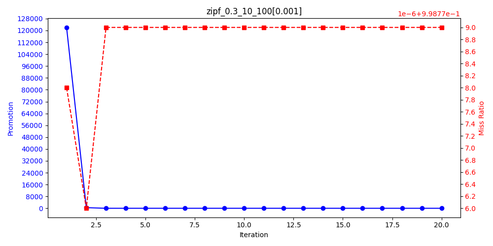  
> **Trace Path**: zipf_0.3_10_100.oracleGeneral  
> **Desc**: 0.001  
> **Cache Size**: 3MiB  
> **Total Request**: 100,000,000  
> **First Promotion**: 122,082  
> **Last Promotion**: 1  
> **Promotion Reduced**: 122,081  

> 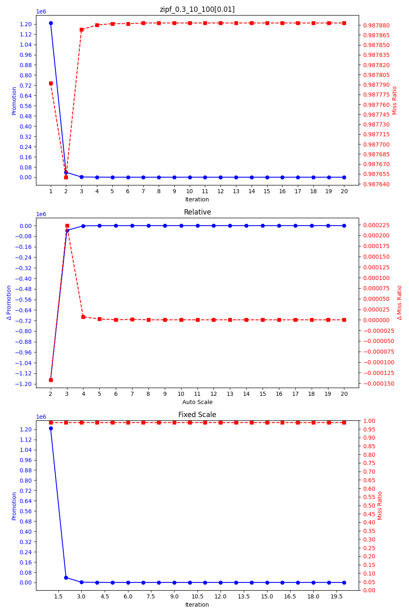  
> **Trace Path**: zipf_0.3_10_100.oracleGeneral  
> **Desc**: 0.01  
> **Cache Size**: 38MiB  
> **Total Request**: 100,000,000  
> **First Promotion**: 1,207,983  
> **Last Promotion**: 260  
> **Promotion Reduced**: 1,207,723  

> 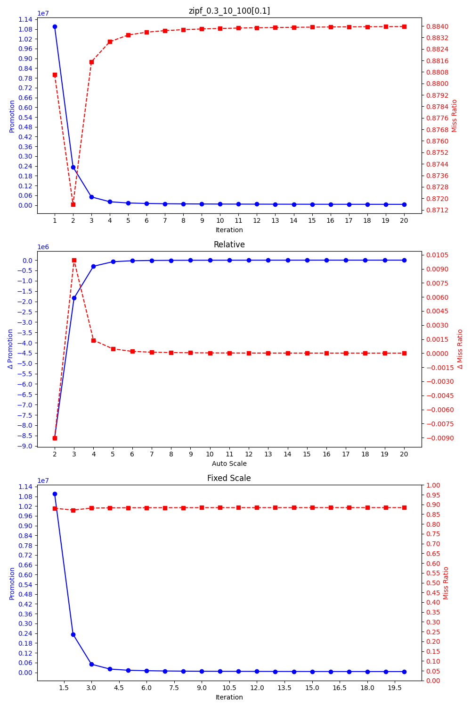  
> **Trace Path**: zipf_0.3_10_100.oracleGeneral  
> **Desc**: 0.1  
> **Cache Size**: 381MiB  
> **Total Request**: 100,000,000  
> **First Promotion**: 10,955,586  
> **Last Promotion**: 48,118  
> **Promotion Reduced**: 10,907,468  

> 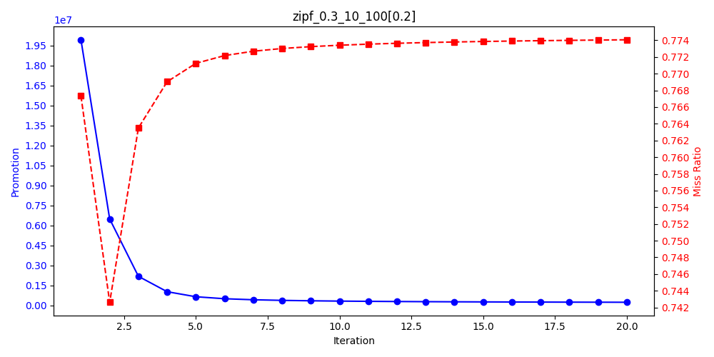  
> **Trace Path**: zipf_0.3_10_100.oracleGeneral  
> **Desc**: 0.2  
> **Cache Size**: 762MiB  
> **Total Request**: 100,000,000  
> **First Promotion**: 19,927,776  
> **Last Promotion**: 231,854  
> **Promotion Reduced**: 19,695,922  

> 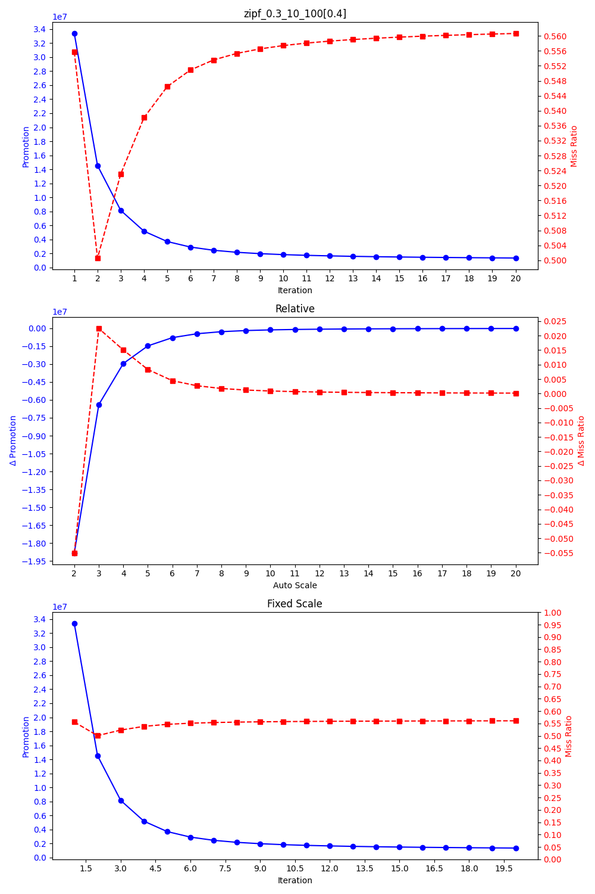  
> **Trace Path**: zipf_0.3_10_100.oracleGeneral  
> **Desc**: 0.4  
> **Cache Size**: 1525MiB  
> **Total Request**: 100,000,000  
> **First Promotion**: 33,369,072  
> **Last Promotion**: 1,360,976  
> **Promotion Reduced**: 32,008,096  

## zipf_0.7_10_100 
> 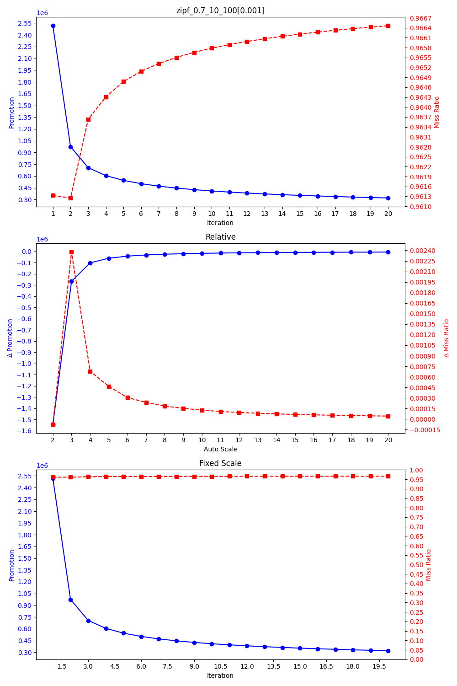  
> **Trace Path**: zipf_0.7_10_100.oracleGeneral  
> **Desc**: 0.001  
> **Cache Size**: 3MiB  
> **Total Request**: 100,000,000  
> **First Promotion**: 2,516,800  
> **Last Promotion**: 320,189  
> **Promotion Reduced**: 2,196,611  

> 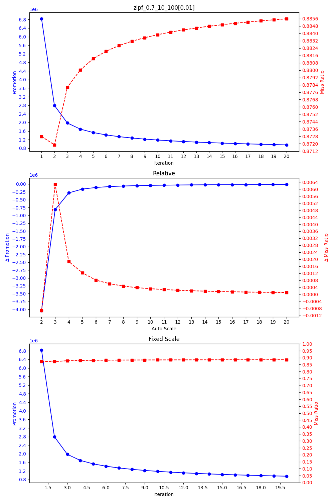  
> **Trace Path**: zipf_0.7_10_100.oracleGeneral  
> **Desc**: 0.01  
> **Cache Size**: 38MiB  
> **Total Request**: 100,000,000  
> **First Promotion**: 6,833,771  
> **Last Promotion**: 954,736  
> **Promotion Reduced**: 5,879,035  

> 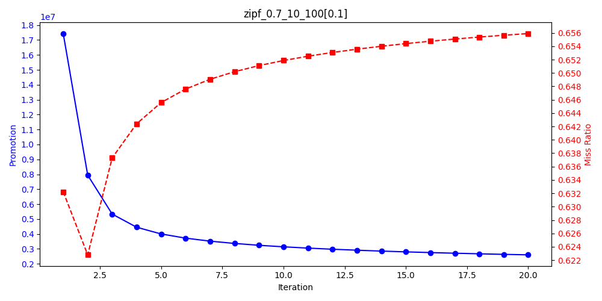  
> **Trace Path**: zipf_0.7_10_100.oracleGeneral  
> **Desc**: 0.1  
> **Cache Size**: 381MiB  
> **Total Request**: 100,000,000  
> **First Promotion**: 17,433,911  
> **Last Promotion**: 2,600,938  
> **Promotion Reduced**: 14,832,973  

> 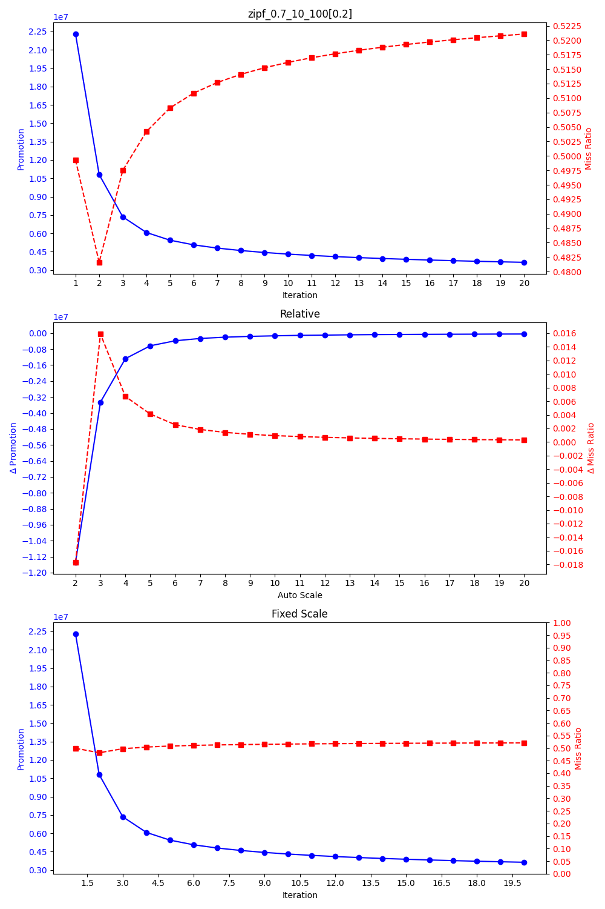  
> **Trace Path**: zipf_0.7_10_100.oracleGeneral  
> **Desc**: 0.2  
> **Cache Size**: 762MiB  
> **Total Request**: 100,000,000  
> **First Promotion**: 22,289,601  
> **Last Promotion**: 3,637,677  
> **Promotion Reduced**: 18,651,924  

> 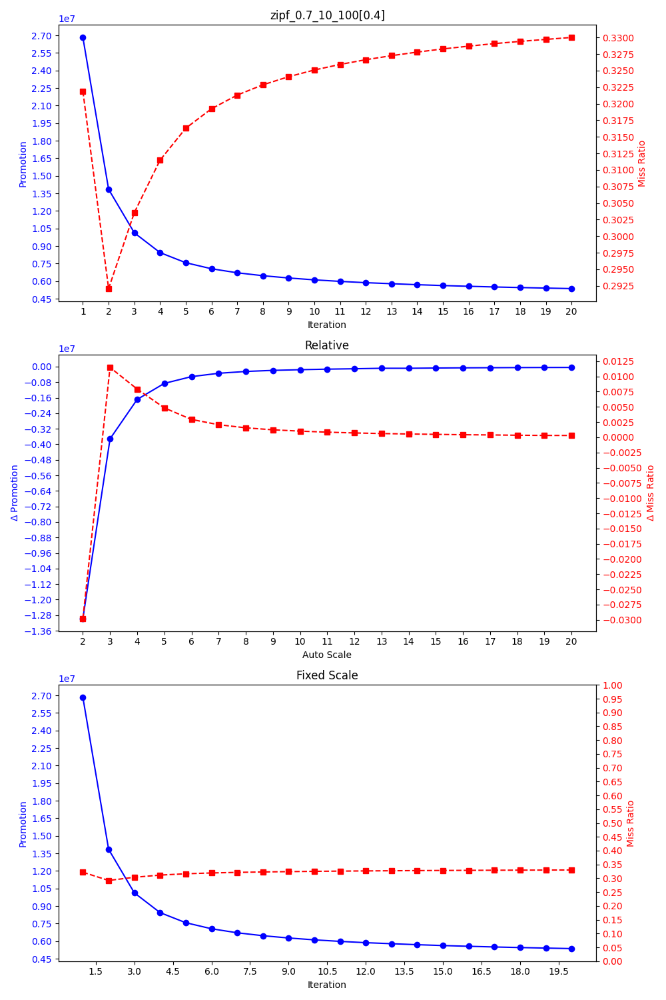  
> **Trace Path**: zipf_0.7_10_100.oracleGeneral  
> **Desc**: 0.4  
> **Cache Size**: 1525MiB  
> **Total Request**: 100,000,000  
> **First Promotion**: 26,828,643  
> **Last Promotion**: 5,367,377  
> **Promotion Reduced**: 21,461,266  

## zipf_0_10_100 
> 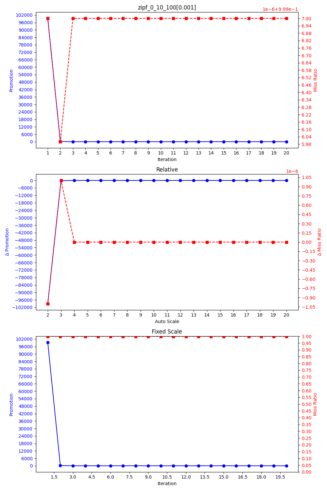  
> **Trace Path**: zipf_0_10_100.oracleGeneral  
> **Desc**: 0.001  
> **Cache Size**: 3MiB  
> **Total Request**: 100,000,000  
> **First Promotion**: 99,275  
> **Last Promotion**: 1  
> **Promotion Reduced**: 99,274  

> 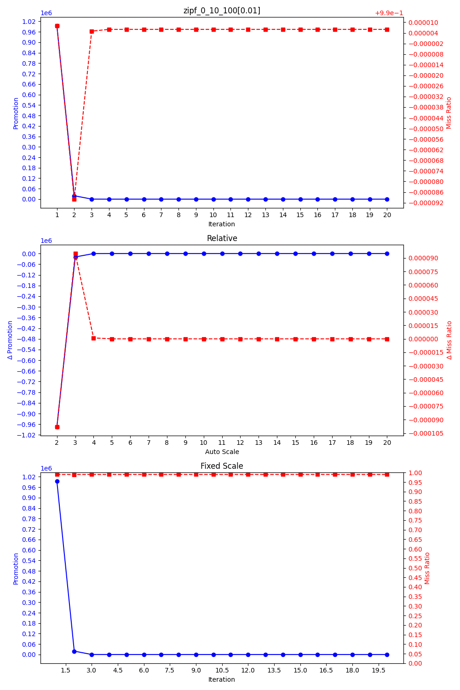  
> **Trace Path**: zipf_0_10_100.oracleGeneral  
> **Desc**: 0.01  
> **Cache Size**: 38MiB  
> **Total Request**: 100,000,000  
> **First Promotion**: 994,266  
> **Last Promotion**: 212  
> **Promotion Reduced**: 994,054  

> 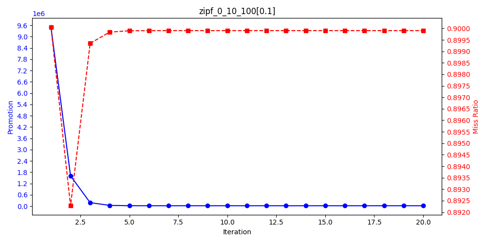  
> **Trace Path**: zipf_0_10_100.oracleGeneral  
> **Desc**: 0.1  
> **Cache Size**: 381MiB  
> **Total Request**: 100,000,000  
> **First Promotion**: 9,504,482  
> **Last Promotion**: 21,902  
> **Promotion Reduced**: 9,482,580  

>   
> **Trace Path**: zipf_0_10_100.oracleGeneral  
> **Desc**: 0.2  
> **Cache Size**: 762MiB  
> **Total Request**: 100,000,000  
> **First Promotion**: 18,050,666  
> **Last Promotion**: 95,046  
> **Promotion Reduced**: 17,955,620  

>   
> **Trace Path**: zipf_0_10_100.oracleGeneral  
> **Desc**: 0.4  
> **Cache Size**: 1525MiB  
> **Total Request**: 100,000,000  
> **First Promotion**: 32,317,227  
> **Last Promotion**: 509,565  
> **Promotion Reduced**: 31,807,662  

## zipf_1.3_10_100 
> 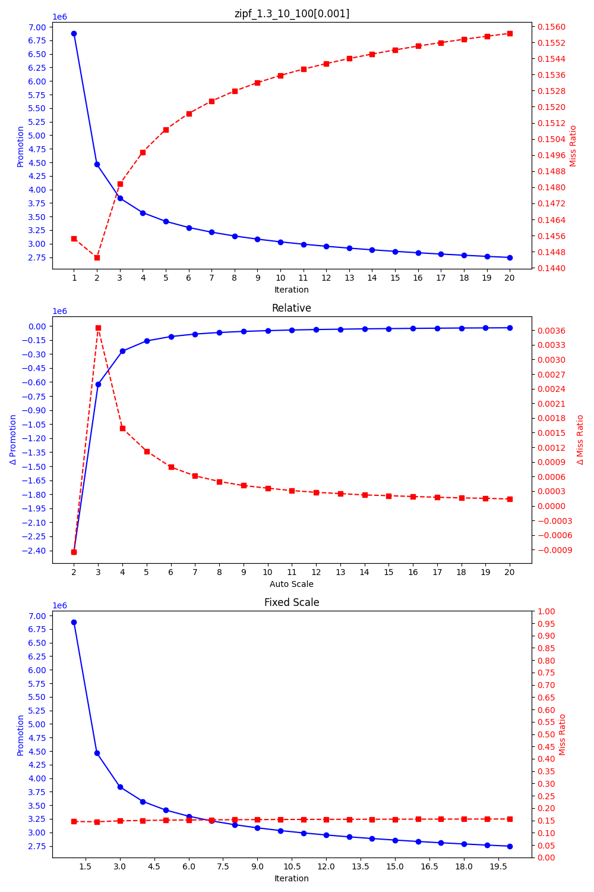  
> **Trace Path**: zipf_1.3_10_100.oracleGeneral  
> **Desc**: 0.001  
> **Cache Size**: 2MiB  
> **Total Request**: 100,000,000  
> **First Promotion**: 6,878,648  
> **Last Promotion**: 2,746,630  
> **Promotion Reduced**: 4,132,018  

> 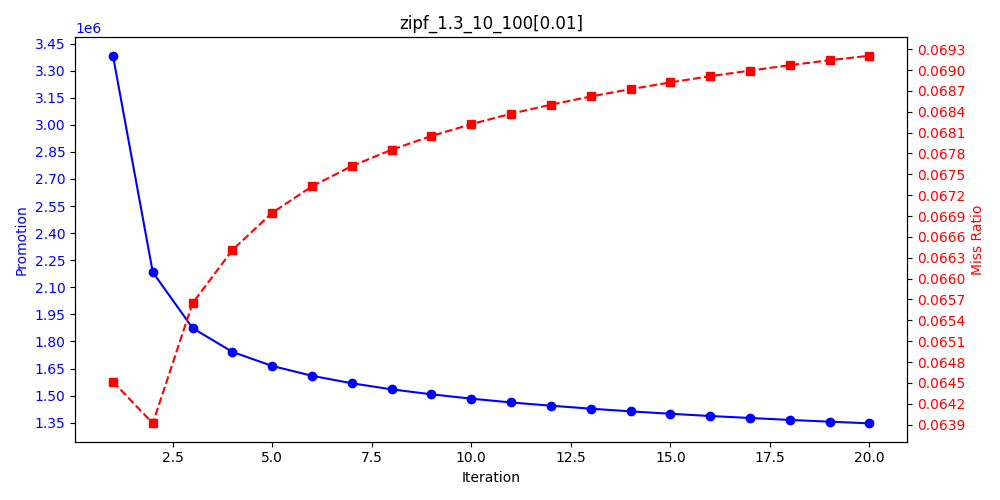  
> **Trace Path**: zipf_1.3_10_100.oracleGeneral  
> **Desc**: 0.01  
> **Cache Size**: 25MiB  
> **Total Request**: 100,000,000  
> **First Promotion**: 3,382,373  
> **Last Promotion**: 1,346,767  
> **Promotion Reduced**: 2,035,606  

> 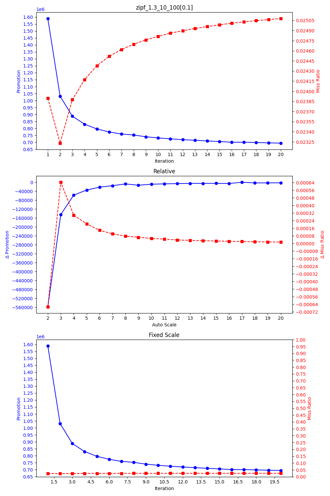  
> **Trace Path**: zipf_1.3_10_100.oracleGeneral  
> **Desc**: 0.1  
> **Cache Size**: 255MiB  
> **Total Request**: 100,000,000  
> **First Promotion**: 1,589,630  
> **Last Promotion**: 693,567  
> **Promotion Reduced**: 896,063  

> 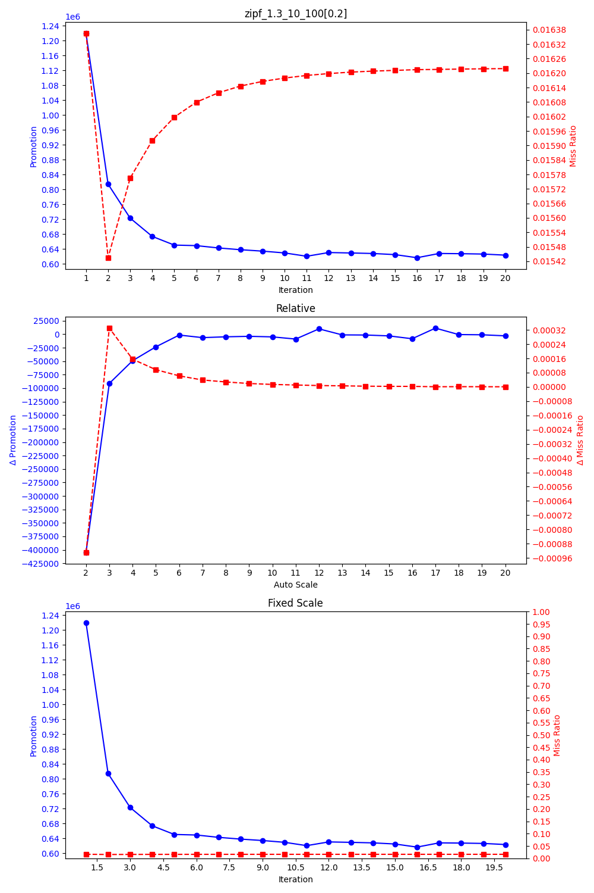  
> **Trace Path**: zipf_1.3_10_100.oracleGeneral  
> **Desc**: 0.2  
> **Cache Size**: 510MiB  
> **Total Request**: 100,000,000  
> **First Promotion**: 1,219,226  
> **Last Promotion**: 623,828  
> **Promotion Reduced**: 595,398  

> 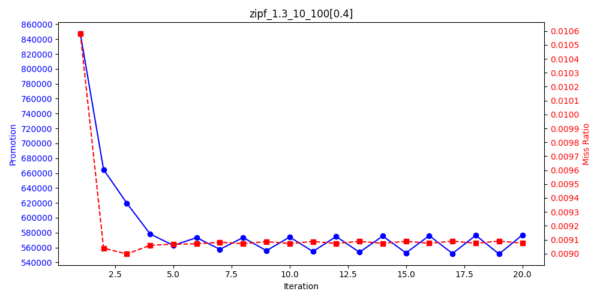  
> **Trace Path**: zipf_1.3_10_100.oracleGeneral  
> **Desc**: 0.4  
> **Cache Size**: 1020MiB  
> **Total Request**: 100,000,000  
> **First Promotion**: 847,675  
> **Last Promotion**: 576,796  
> **Promotion Reduced**: 270,879  

## zipf_1.7_10_100 
> 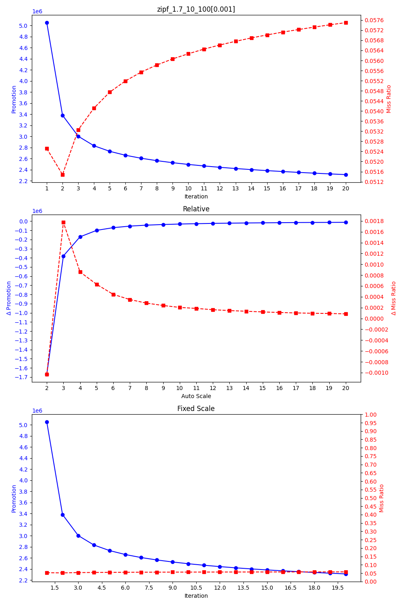  
> **Trace Path**: zipf_1.7_10_100.oracleGeneral  
> **Desc**: 0.001  
> **Cache Size**: 0MiB  
> **Total Request**: 100,000,000  
> **First Promotion**: 5,051,153  
> **Last Promotion**: 2,311,295  
> **Promotion Reduced**: 2,739,858  

> 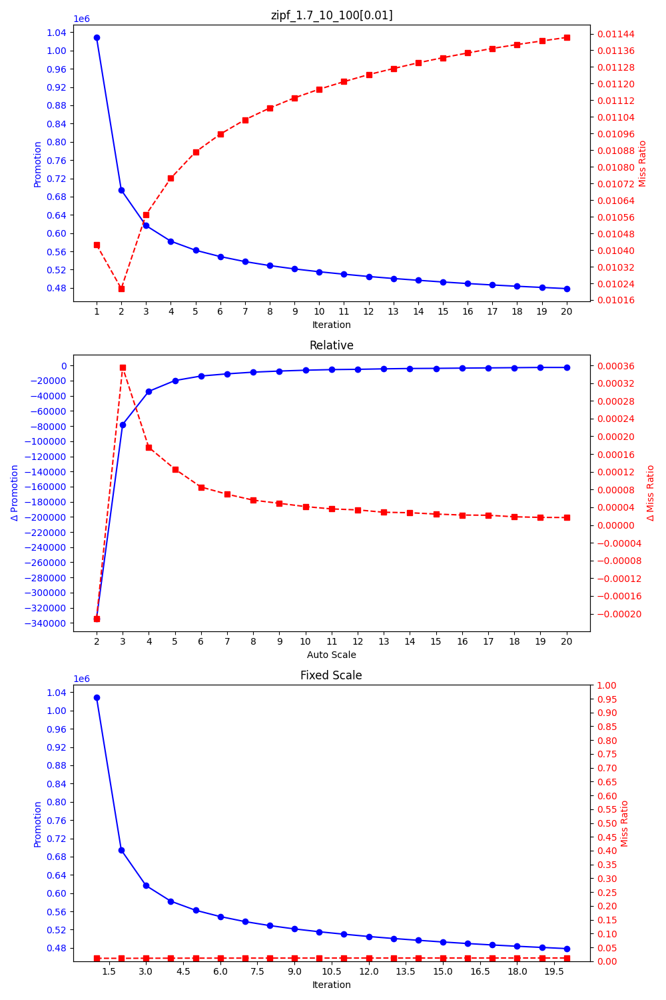  
> **Trace Path**: zipf_1.7_10_100.oracleGeneral  
> **Desc**: 0.01  
> **Cache Size**: 2MiB  
> **Total Request**: 100,000,000  
> **First Promotion**: 1,028,703  
> **Last Promotion**: 478,526  
> **Promotion Reduced**: 550,177  

> 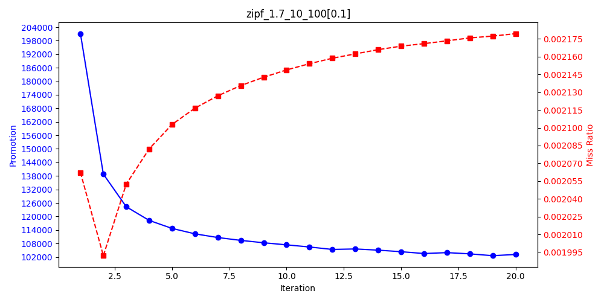  
> **Trace Path**: zipf_1.7_10_100.oracleGeneral  
> **Desc**: 0.1  
> **Cache Size**: 25MiB  
> **Total Request**: 100,000,000  
> **First Promotion**: 201,133  
> **Last Promotion**: 103,150  
> **Promotion Reduced**: 97,983  

> 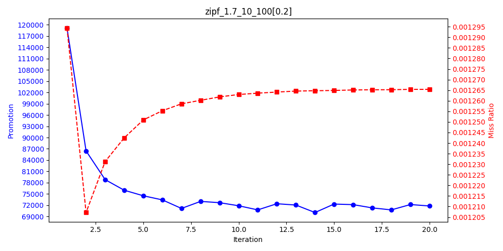  
> **Trace Path**: zipf_1.7_10_100.oracleGeneral  
> **Desc**: 0.2  
> **Cache Size**: 51MiB  
> **Total Request**: 100,000,000  
> **First Promotion**: 119,169  
> **Last Promotion**: 71,788  
> **Promotion Reduced**: 47,381  

> 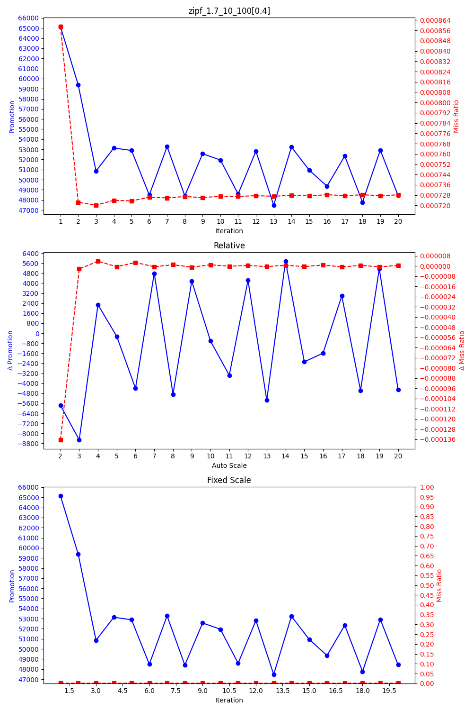  
> **Trace Path**: zipf_1.7_10_100.oracleGeneral  
> **Desc**: 0.4  
> **Cache Size**: 102MiB  
> **Total Request**: 100,000,000  
> **First Promotion**: 65,143  
> **Last Promotion**: 48,443  
> **Promotion Reduced**: 16,700  

## zipf_1_10_100 
> 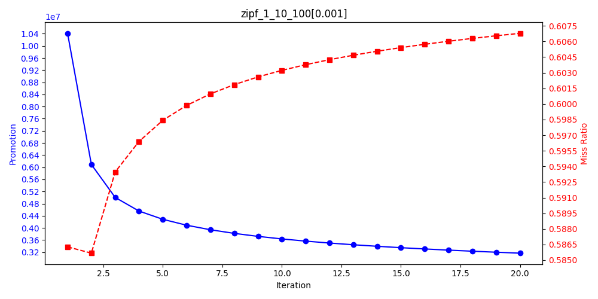  
> **Trace Path**: zipf_1_10_100.oracleGeneral  
> **Desc**: 0.001  
> **Cache Size**: 3MiB  
> **Total Request**: 100,000,000  
> **First Promotion**: 10,414,192  
> **Last Promotion**: 3,168,499  
> **Promotion Reduced**: 7,245,693  

> 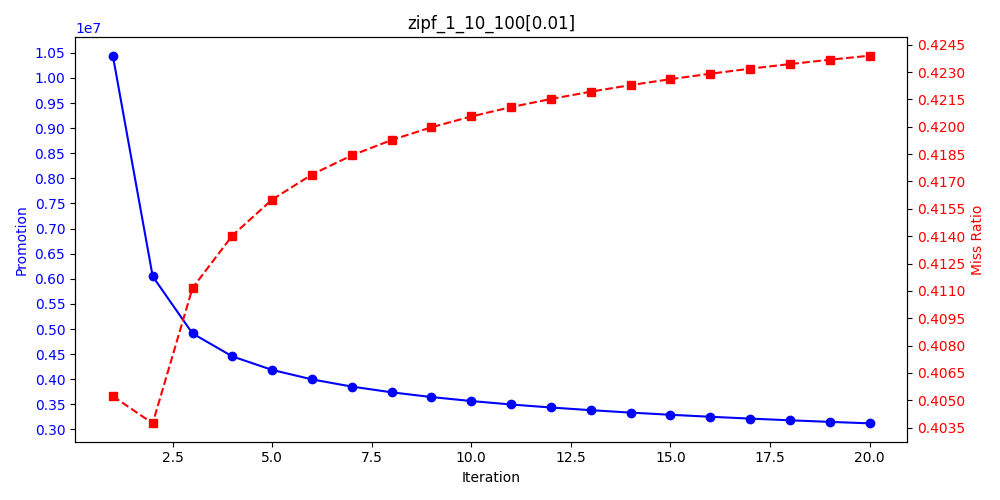  
> **Trace Path**: zipf_1_10_100.oracleGeneral  
> **Desc**: 0.01  
> **Cache Size**: 38MiB  
> **Total Request**: 100,000,000  
> **First Promotion**: 10,441,768  
> **Last Promotion**: 3,122,558  
> **Promotion Reduced**: 7,319,210  

> 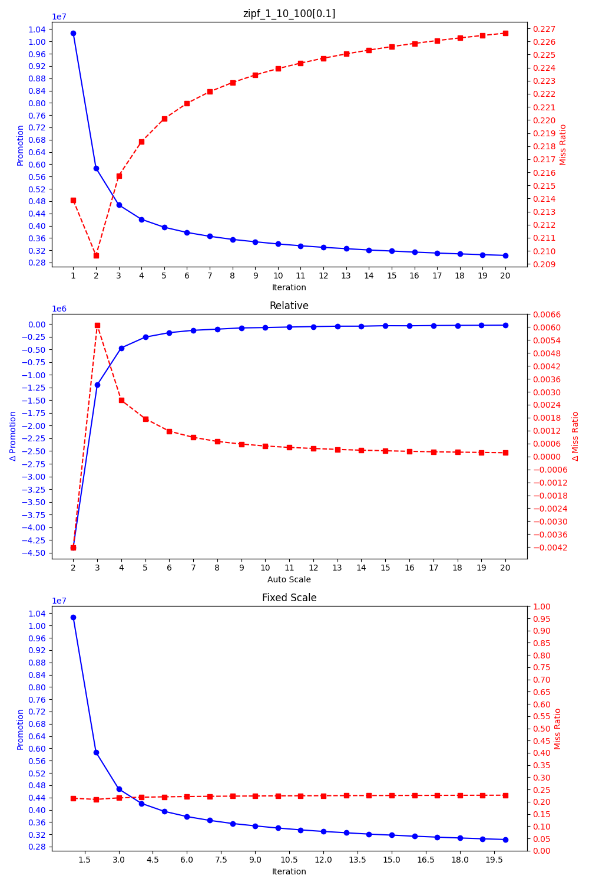  
> **Trace Path**: zipf_1_10_100.oracleGeneral  
> **Desc**: 0.1  
> **Cache Size**: 381MiB  
> **Total Request**: 100,000,000  
> **First Promotion**: 10,270,812  
> **Last Promotion**: 3,032,429  
> **Promotion Reduced**: 7,238,383  

> 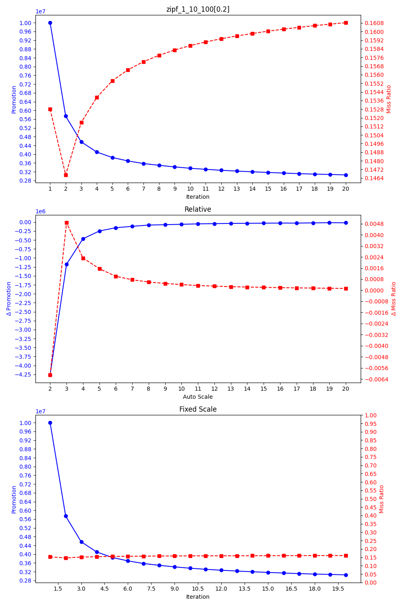  
> **Trace Path**: zipf_1_10_100.oracleGeneral  
> **Desc**: 0.2  
> **Cache Size**: 762MiB  
> **Total Request**: 100,000,000  
> **First Promotion**: 10,000,957  
> **Last Promotion**: 3,058,118  
> **Promotion Reduced**: 6,942,839  

> 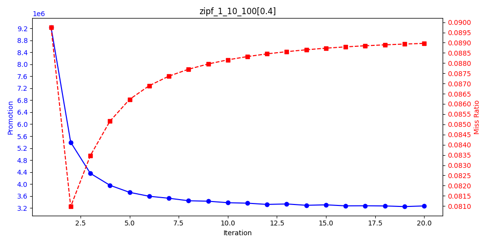  
> **Trace Path**: zipf_1_10_100.oracleGeneral  
> **Desc**: 0.4  
> **Cache Size**: 1525MiB  
> **Total Request**: 100,000,000  
> **First Promotion**: 9,237,721  
> **Last Promotion**: 3,270,361  
> **Promotion Reduced**: 5,967,360  

## zipf_2_10_100 
> 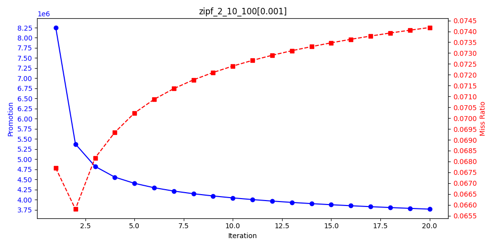  
> **Trace Path**: zipf_2_10_100.oracleGeneral  
> **Desc**: 0.001  
> **Cache Size**: 0MiB  
> **Total Request**: 100,000,000  
> **First Promotion**: 8,253,615  
> **Last Promotion**: 3,765,484  
> **Promotion Reduced**: 4,488,131  

> 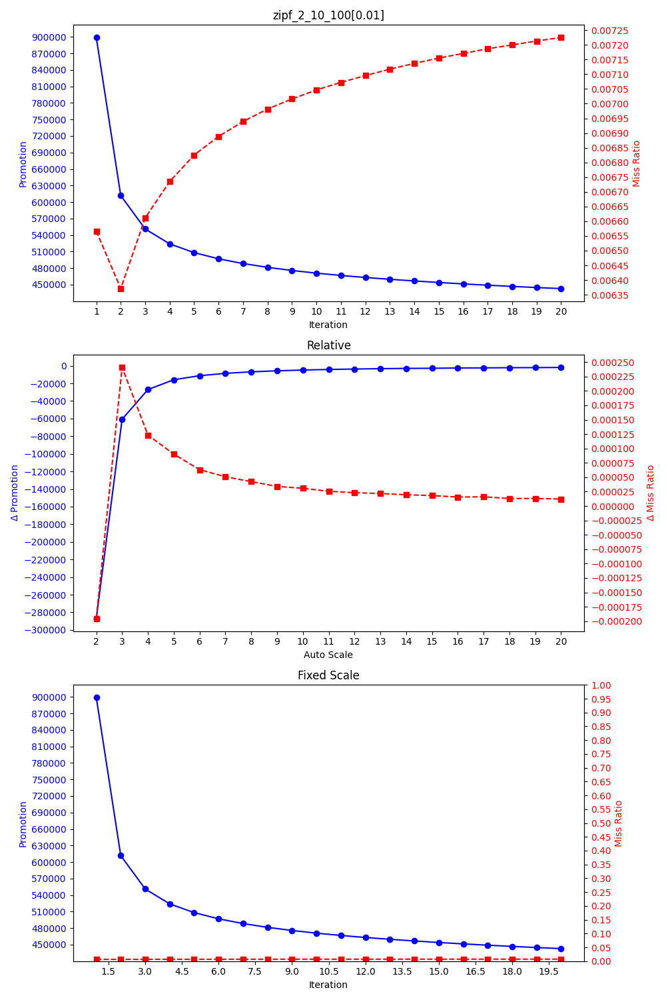  
> **Trace Path**: zipf_2_10_100.oracleGeneral  
> **Desc**: 0.01  
> **Cache Size**: 0MiB  
> **Total Request**: 100,000,000  
> **First Promotion**: 898,911  
> **Last Promotion**: 442,849  
> **Promotion Reduced**: 456,062  

> 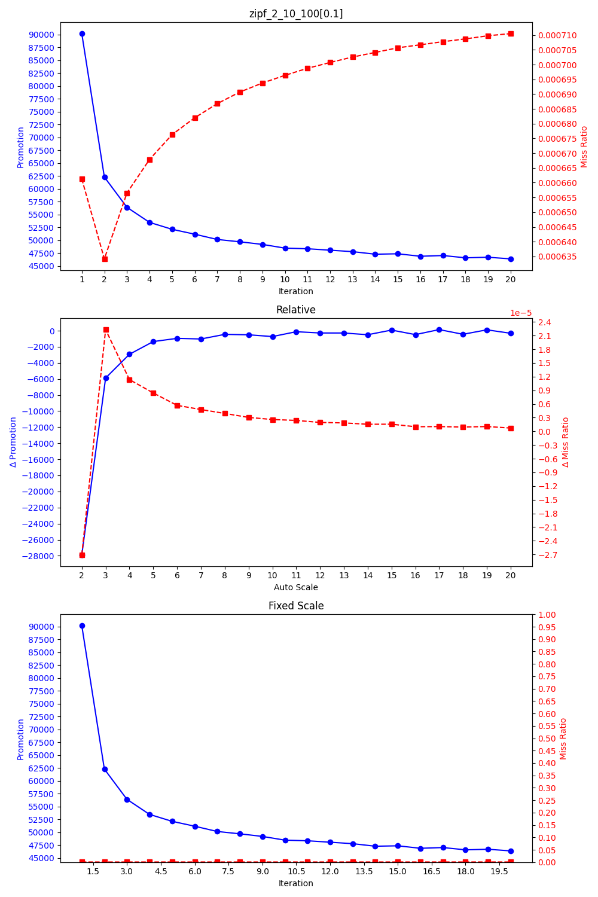  
> **Trace Path**: zipf_2_10_100.oracleGeneral  
> **Desc**: 0.1  
> **Cache Size**: 5MiB  
> **Total Request**: 100,000,000  
> **First Promotion**: 90,194  
> **Last Promotion**: 46,399  
> **Promotion Reduced**: 43,795  

> 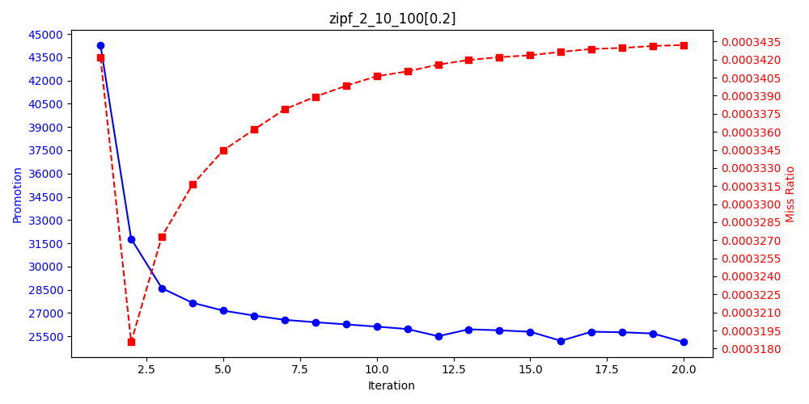  
> **Trace Path**: zipf_2_10_100.oracleGeneral  
> **Desc**: 0.2  
> **Cache Size**: 10MiB  
> **Total Request**: 100,000,000  
> **First Promotion**: 44,292  
> **Last Promotion**: 25,126  
> **Promotion Reduced**: 19,166  

> 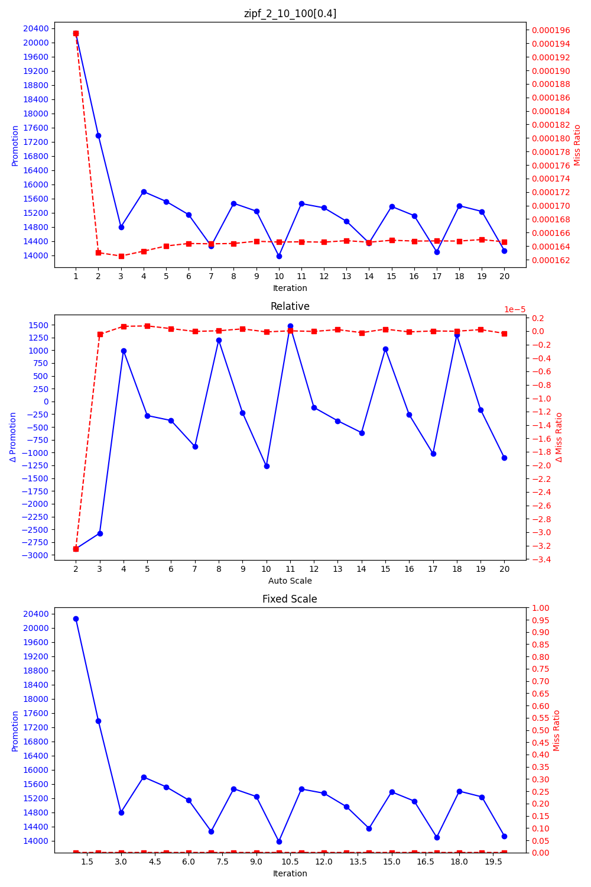  
> **Trace Path**: zipf_2_10_100.oracleGeneral  
> **Desc**: 0.4  
> **Cache Size**: 21MiB  
> **Total Request**: 100,000,000  
> **First Promotion**: 20,256  
> **Last Promotion**: 14,133  
> **Promotion Reduced**: 6,123  

