# RESULT AGAINST TEST DATA
# [Train Data](./README.md)
# [Box Plot](./overall/README.md)
# [Box Plot (obj_size_ignored)](./overall/README_obj_size_ignored.md)
# Line Plot
## 10 https://ftp.pdl.cmu.edu/pub/datasets/twemcacheWorkload/cacheDatasets/twitter/cluster10.oracleGeneral.zst
> 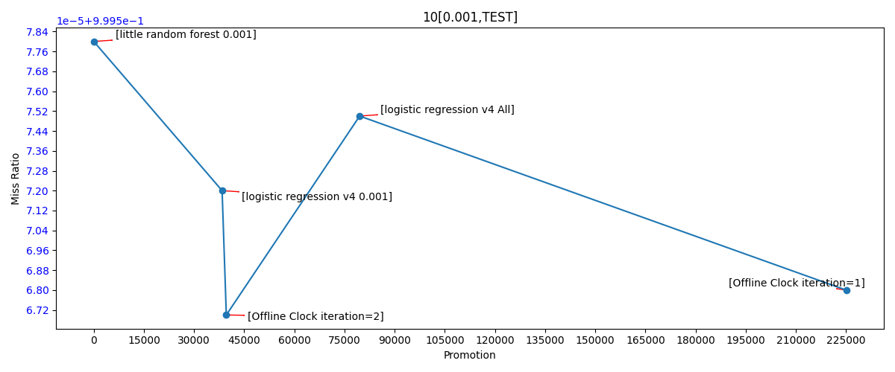  
> **Trace Path**: 10.oracleGeneral.zst  
> **Log Path**: [../result/log/10[0.001,TEST].csv](../result/log/10[0.001,TEST].csv)  
> **Desc**: ['0.001', 'TEST', {}]  
> **Cache Size**: 82  
> **Ignore Obj Size**: 0  
> **Total Request**: 2,756,726,994  
> **First Promotion**: 225,015  
> **Last Promotion**: 39,640  
> **Promotion Reduced**: 185,375  

>   
> **Trace Path**: 10.oracleGeneral.zst  
> **Log Path**: [../result/log/10[0.001,ignore_obj_size,TEST].csv](../result/log/10[0.001,ignore_obj_size,TEST].csv)  
> **Desc**: ['0.001', 'ignore_obj_size', 'TEST', {}]  
> **Cache Size**: 7360  
> **Ignore Obj Size**: 1  
> **Total Request**: 2,756,726,994  
> **First Promotion**: 157,317  
> **Last Promotion**: 25,645  
> **Promotion Reduced**: 131,672  

>   
> **Trace Path**: 10.oracleGeneral.zst  
> **Log Path**: [../result/log/10[0.01,TEST].csv](../result/log/10[0.01,TEST].csv)  
> **Desc**: ['0.01', 'TEST', {}]  
> **Cache Size**: 826  
> **Ignore Obj Size**: 0  
> **Total Request**: 2,756,726,994  
> **First Promotion**: 259,397,595  
> **Last Promotion**: 101,771,354  
> **Promotion Reduced**: 157,626,241  

>   
> **Trace Path**: 10.oracleGeneral.zst  
> **Log Path**: [../result/log/10[0.01,ignore_obj_size,TEST].csv](../result/log/10[0.01,ignore_obj_size,TEST].csv)  
> **Desc**: ['0.01', 'ignore_obj_size', 'TEST', {}]  
> **Cache Size**: 73601  
> **Ignore Obj Size**: 1  
> **Total Request**: 2,756,726,994  
> **First Promotion**: 13,248,917  
> **Last Promotion**: 1,737,324  
> **Promotion Reduced**: 11,511,593  

> 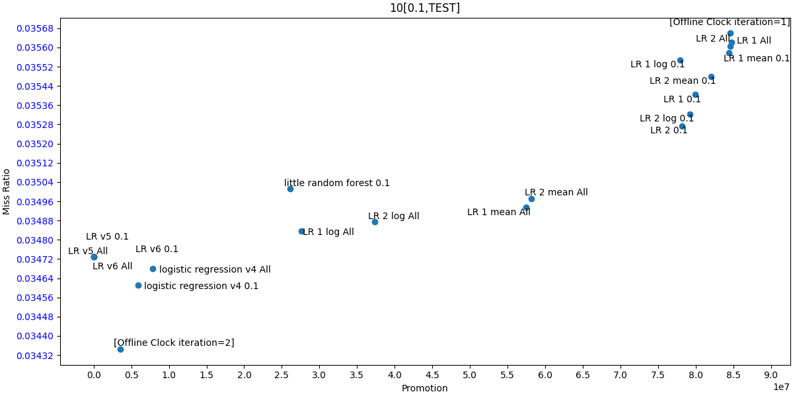  
> **Trace Path**: 10.oracleGeneral.zst  
> **Log Path**: [../result/log/10[0.1,TEST].csv](../result/log/10[0.1,TEST].csv)  
> **Desc**: ['0.1', 'TEST', {}]  
> **Cache Size**: 8269  
> **Ignore Obj Size**: 0  
> **Total Request**: 2,756,726,994  
> **First Promotion**: 84,562,398  
> **Last Promotion**: 3,510,051  
> **Promotion Reduced**: 81,052,347  

>   
> **Trace Path**: 10.oracleGeneral.zst  
> **Log Path**: [../result/log/10[0.1,ignore_obj_size,TEST].csv](../result/log/10[0.1,ignore_obj_size,TEST].csv)  
> **Desc**: ['0.1', 'ignore_obj_size', 'TEST', {}]  
> **Cache Size**: 736017  
> **Ignore Obj Size**: 1  
> **Total Request**: 2,756,726,994  
> **First Promotion**: 1,046,691,584  
> **Last Promotion**: 290,808,172  
> **Promotion Reduced**: 755,883,412  

> 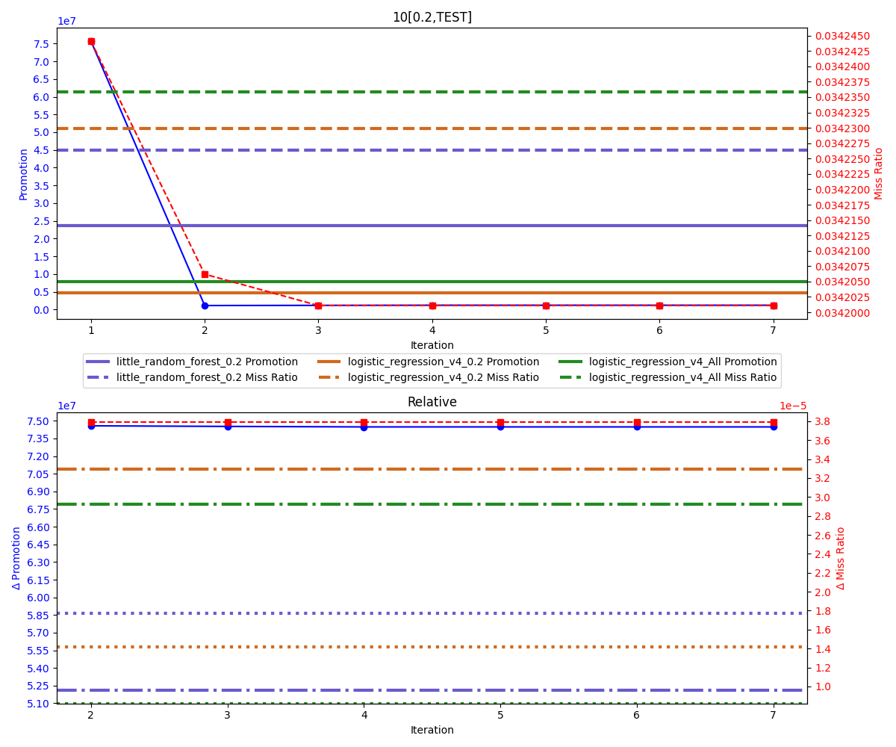  
> **Trace Path**: 10.oracleGeneral.zst  
> **Log Path**: [../result/log/10[0.2,TEST].csv](../result/log/10[0.2,TEST].csv)  
> **Desc**: ['0.2', 'TEST', {}]  
> **Cache Size**: 16539  
> **Ignore Obj Size**: 0  
> **Total Request**: 2,756,726,994  
> **First Promotion**: 75,688,656  
> **Last Promotion**: 1,113,825  
> **Promotion Reduced**: 74,574,831  

>   
> **Trace Path**: 10.oracleGeneral.zst  
> **Log Path**: [../result/log/10[0.2,ignore_obj_size,TEST].csv](../result/log/10[0.2,ignore_obj_size,TEST].csv)  
> **Desc**: ['0.2', 'ignore_obj_size', 'TEST', {}]  
> **Cache Size**: 1472034  
> **Ignore Obj Size**: 1  
> **Total Request**: 2,756,726,994  
> **First Promotion**: 76,247,128  
> **Last Promotion**: 1,259,189  
> **Promotion Reduced**: 74,987,939  

> 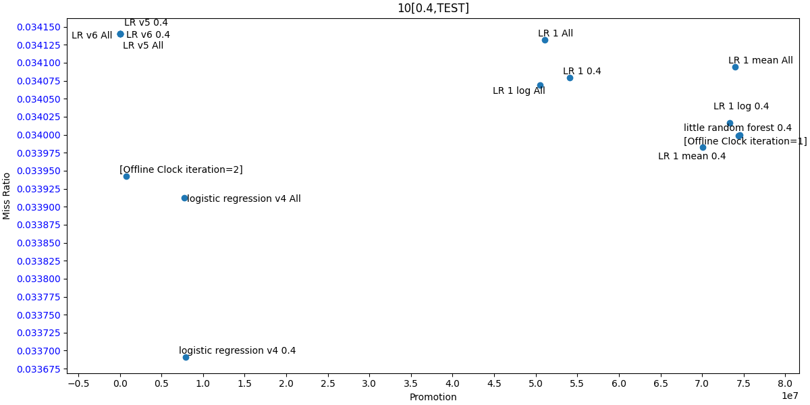  
> **Trace Path**: 10.oracleGeneral.zst  
> **Log Path**: [../result/log/10[0.4,TEST].csv](../result/log/10[0.4,TEST].csv)  
> **Desc**: ['0.4', 'TEST', {}]  
> **Cache Size**: 33078  
> **Ignore Obj Size**: 0  
> **Total Request**: 2,756,726,994  
> **First Promotion**: 74,550,089  
> **Last Promotion**: 753,270  
> **Promotion Reduced**: 73,796,819  

>   
> **Trace Path**: 10.oracleGeneral.zst  
> **Log Path**: [../result/log/10[0.4,ignore_obj_size,TEST].csv](../result/log/10[0.4,ignore_obj_size,TEST].csv)  
> **Desc**: ['0.4', 'ignore_obj_size', 'TEST', {}]  
> **Cache Size**: 2944069  
> **Ignore Obj Size**: 1  
> **Total Request**: 2,756,726,994  
> **First Promotion**: 74,625,245  
> **Last Promotion**: 2,136,834  
> **Promotion Reduced**: 72,488,411  

## 1351 https://ftp.pdl.cmu.edu/pub/datasets/twemcacheWorkload/cacheDatasets/tencentBlock/v2/traces/1351.oracleGeneral.zst
>   
> **Trace Path**: 1351.oracleGeneral.zst  
> **Log Path**: [../result/log/1351[0.001,ignore_obj_size].csv](../result/log/1351[0.001,ignore_obj_size].csv)  
> **Desc**: ['0.001', 'ignore_obj_size', {}]  
> **Cache Size**: 1496  
> **Ignore Obj Size**: 1  
> **Total Request**: 195,824,302  
> **First Promotion**: 6,211,795  
> **Last Promotion**: 4,493,205  
> **Promotion Reduced**: 1,718,590  

## 2016_LUN6 https://ftp.pdl.cmu.edu/pub/datasets/twemcacheWorkload/cacheDatasets/systor/2016_LUN6.oracleGeneral.zst
> 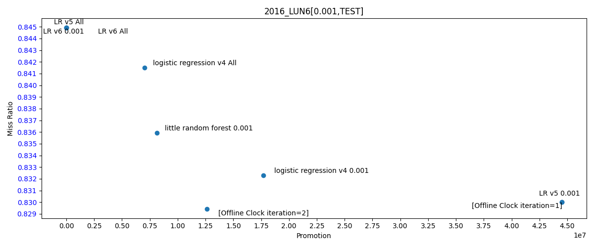  
> **Trace Path**: 2016_LUN6.oracleGeneral.zst  
> **Log Path**: [../result/log/2016_LUN6[0.001,TEST].csv](../result/log/2016_LUN6[0.001,TEST].csv)  
> **Desc**: ['0.001', 'TEST', {}]  
> **Cache Size**: 2476  
> **Ignore Obj Size**: 0  
> **Total Request**: 655,119,703  
> **First Promotion**: 44,505,157  
> **Last Promotion**: 12,631,561  
> **Promotion Reduced**: 31,873,596  

>   
> **Trace Path**: 2016_LUN6.oracleGeneral.zst  
> **Log Path**: [../result/log/2016_LUN6[0.001,ignore_obj_size,TEST].csv](../result/log/2016_LUN6[0.001,ignore_obj_size,TEST].csv)  
> **Desc**: ['0.001', 'ignore_obj_size', 'TEST', {}]  
> **Cache Size**: 72393  
> **Ignore Obj Size**: 1  
> **Total Request**: 655,119,703  
> **First Promotion**: 45,268,939  
> **Last Promotion**: 14,147,954  
> **Promotion Reduced**: 31,120,985  

> 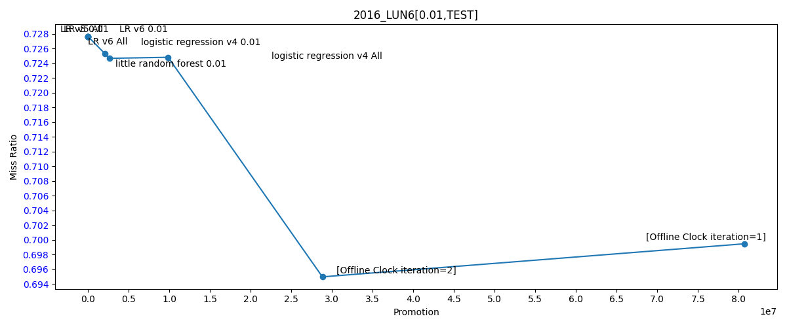  
> **Trace Path**: 2016_LUN6.oracleGeneral.zst  
> **Log Path**: [../result/log/2016_LUN6[0.01,TEST].csv](../result/log/2016_LUN6[0.01,TEST].csv)  
> **Desc**: ['0.01', 'TEST', {}]  
> **Cache Size**: 24761  
> **Ignore Obj Size**: 0  
> **Total Request**: 655,119,703  
> **First Promotion**: 80,694,890  
> **Last Promotion**: 28,824,626  
> **Promotion Reduced**: 51,870,264  

>   
> **Trace Path**: 2016_LUN6.oracleGeneral.zst  
> **Log Path**: [../result/log/2016_LUN6[0.01,ignore_obj_size,TEST].csv](../result/log/2016_LUN6[0.01,ignore_obj_size,TEST].csv)  
> **Desc**: ['0.01', 'ignore_obj_size', 'TEST', {}]  
> **Cache Size**: 723935  
> **Ignore Obj Size**: 1  
> **Total Request**: 655,119,703  
> **First Promotion**: 73,155,745  
> **Last Promotion**: 22,684,855  
> **Promotion Reduced**: 50,470,890  

> 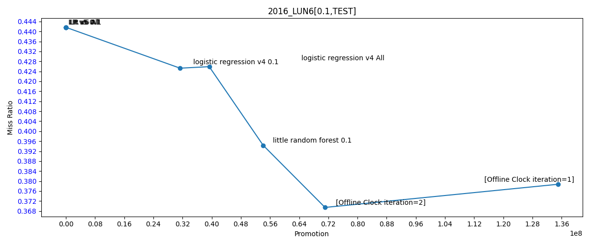  
> **Trace Path**: 2016_LUN6.oracleGeneral.zst  
> **Log Path**: [../result/log/2016_LUN6[0.1,TEST].csv](../result/log/2016_LUN6[0.1,TEST].csv)  
> **Desc**: ['0.1', 'TEST', {}]  
> **Cache Size**: 247614  
> **Ignore Obj Size**: 0  
> **Total Request**: 655,119,703  
> **First Promotion**: 134,990,669  
> **Last Promotion**: 71,085,337  
> **Promotion Reduced**: 63,905,332  

>   
> **Trace Path**: 2016_LUN6.oracleGeneral.zst  
> **Log Path**: [../result/log/2016_LUN6[0.1,ignore_obj_size,TEST].csv](../result/log/2016_LUN6[0.1,ignore_obj_size,TEST].csv)  
> **Desc**: ['0.1', 'ignore_obj_size', 'TEST', {}]  
> **Cache Size**: 7239357  
> **Ignore Obj Size**: 1  
> **Total Request**: 655,119,703  
> **First Promotion**: 134,515,060  
> **Last Promotion**: 68,228,699  
> **Promotion Reduced**: 66,286,361  

> 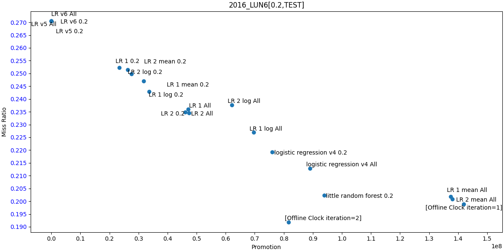  
> **Trace Path**: 2016_LUN6.oracleGeneral.zst  
> **Log Path**: [../result/log/2016_LUN6[0.2,TEST].csv](../result/log/2016_LUN6[0.2,TEST].csv)  
> **Desc**: ['0.2', 'TEST', {}]  
> **Cache Size**: 495229  
> **Ignore Obj Size**: 0  
> **Total Request**: 655,119,703  
> **First Promotion**: 141,972,329  
> **Last Promotion**: 81,647,750  
> **Promotion Reduced**: 60,324,579  

>   
> **Trace Path**: 2016_LUN6.oracleGeneral.zst  
> **Log Path**: [../result/log/2016_LUN6[0.2,ignore_obj_size,TEST].csv](../result/log/2016_LUN6[0.2,ignore_obj_size,TEST].csv)  
> **Desc**: ['0.2', 'ignore_obj_size', 'TEST', {}]  
> **Cache Size**: 14478714  
> **Ignore Obj Size**: 1  
> **Total Request**: 655,119,703  
> **First Promotion**: 155,759,449  
> **Last Promotion**: 87,267,928  
> **Promotion Reduced**: 68,491,521  

> 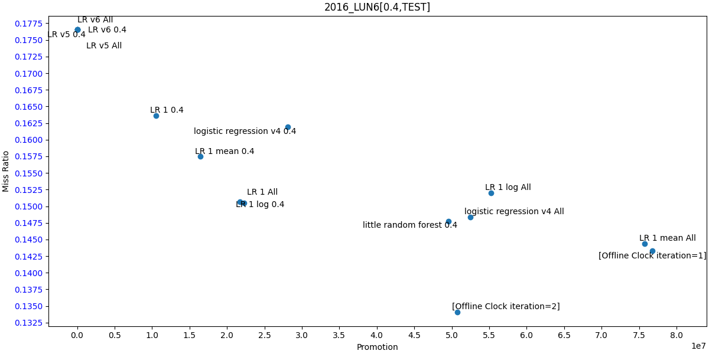  
> **Trace Path**: 2016_LUN6.oracleGeneral.zst  
> **Log Path**: [../result/log/2016_LUN6[0.4,TEST].csv](../result/log/2016_LUN6[0.4,TEST].csv)  
> **Desc**: ['0.4', 'TEST', {}]  
> **Cache Size**: 990459  
> **Ignore Obj Size**: 0  
> **Total Request**: 655,119,703  
> **First Promotion**: 76,803,029  
> **Last Promotion**: 50,754,557  
> **Promotion Reduced**: 26,048,472  

>   
> **Trace Path**: 2016_LUN6.oracleGeneral.zst  
> **Log Path**: [../result/log/2016_LUN6[0.4,ignore_obj_size,TEST].csv](../result/log/2016_LUN6[0.4,ignore_obj_size,TEST].csv)  
> **Desc**: ['0.4', 'ignore_obj_size', 'TEST', {}]  
> **Cache Size**: 28957428  
> **Ignore Obj Size**: 1  
> **Total Request**: 655,119,703  
> **First Promotion**: 82,129,129  
> **Last Promotion**: 46,456,929  
> **Promotion Reduced**: 35,672,200  

## 202206_kv_traces_all.csv https://ftp.pdl.cmu.edu/pub/datasets/twemcacheWorkload/cacheDatasets/metaKV/202206_kv_traces_all.csv.oracleGeneral.zst
> 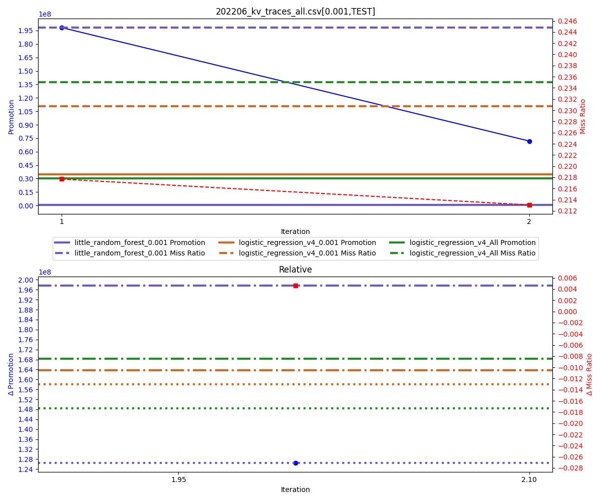  
> **Trace Path**: 202206_kv_traces_all.csv.oracleGeneral.zst  
> **Log Path**: [../result/log/202206_kv_traces_all.csv[0.001,TEST].csv](../result/log/202206_kv_traces_all.csv[0.001,TEST].csv)  
> **Desc**: ['0.001', 'TEST', {}]  
> **Cache Size**: 60  
> **Ignore Obj Size**: 0  
> **Total Request**: 1,644,762,386  
> **First Promotion**: 198,320,094  
> **Last Promotion**: 71,859,428  
> **Promotion Reduced**: 126,460,666  

>   
> **Trace Path**: 202206_kv_traces_all.csv.oracleGeneral.zst  
> **Log Path**: [../result/log/202206_kv_traces_all.csv[0.001,ignore_obj_size,TEST].csv](../result/log/202206_kv_traces_all.csv[0.001,ignore_obj_size,TEST].csv)  
> **Desc**: ['0.001', 'ignore_obj_size', 'TEST', {}]  
> **Cache Size**: 52429  
> **Ignore Obj Size**: 1  
> **Total Request**: 1,644,762,386  
> **First Promotion**: 205,403,650  
> **Last Promotion**: 70,077,154  
> **Promotion Reduced**: 135,326,496  

> 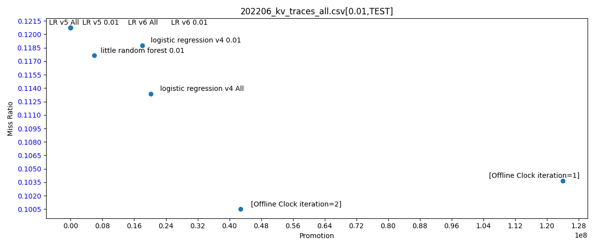  
> **Trace Path**: 202206_kv_traces_all.csv.oracleGeneral.zst  
> **Log Path**: [../result/log/202206_kv_traces_all.csv[0.01,TEST].csv](../result/log/202206_kv_traces_all.csv[0.01,TEST].csv)  
> **Desc**: ['0.01', 'TEST', {}]  
> **Cache Size**: 605  
> **Ignore Obj Size**: 0  
> **Total Request**: 1,644,762,386  
> **First Promotion**: 124,058,326  
> **Last Promotion**: 42,790,232  
> **Promotion Reduced**: 81,268,094  

>   
> **Trace Path**: 202206_kv_traces_all.csv.oracleGeneral.zst  
> **Log Path**: [../result/log/202206_kv_traces_all.csv[0.01,ignore_obj_size,TEST].csv](../result/log/202206_kv_traces_all.csv[0.01,ignore_obj_size,TEST].csv)  
> **Desc**: ['0.01', 'ignore_obj_size', 'TEST', {}]  
> **Cache Size**: 524291  
> **Ignore Obj Size**: 1  
> **Total Request**: 1,644,762,386  
> **First Promotion**: 135,981,665  
> **Last Promotion**: 48,526,381  
> **Promotion Reduced**: 87,455,284  

> 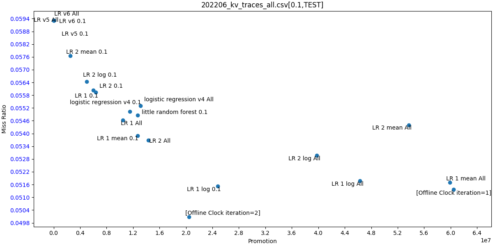  
> **Trace Path**: 202206_kv_traces_all.csv.oracleGeneral.zst  
> **Log Path**: [../result/log/202206_kv_traces_all.csv[0.1,TEST].csv](../result/log/202206_kv_traces_all.csv[0.1,TEST].csv)  
> **Desc**: ['0.1', 'TEST', {}]  
> **Cache Size**: 6055  
> **Ignore Obj Size**: 0  
> **Total Request**: 1,644,762,386  
> **First Promotion**: 60,044,440  
> **Last Promotion**: 20,303,096  
> **Promotion Reduced**: 39,741,344  

>   
> **Trace Path**: 202206_kv_traces_all.csv.oracleGeneral.zst  
> **Log Path**: [../result/log/202206_kv_traces_all.csv[0.1,ignore_obj_size,TEST].csv](../result/log/202206_kv_traces_all.csv[0.1,ignore_obj_size,TEST].csv)  
> **Desc**: ['0.1', 'ignore_obj_size', 'TEST', {}]  
> **Cache Size**: 5242910  
> **Ignore Obj Size**: 1  
> **Total Request**: 1,644,762,386  
> **First Promotion**: 64,990,650  
> **Last Promotion**: 21,878,149  
> **Promotion Reduced**: 43,112,501  

> 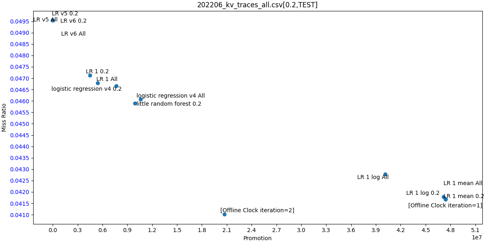  
> **Trace Path**: 202206_kv_traces_all.csv.oracleGeneral.zst  
> **Log Path**: [../result/log/202206_kv_traces_all.csv[0.2,TEST].csv](../result/log/202206_kv_traces_all.csv[0.2,TEST].csv)  
> **Desc**: ['0.2', 'TEST', {}]  
> **Cache Size**: 12110  
> **Ignore Obj Size**: 0  
> **Total Request**: 1,644,762,386  
> **First Promotion**: 47,155,835  
> **Last Promotion**: 20,454,622  
> **Promotion Reduced**: 26,701,213  

>   
> **Trace Path**: 202206_kv_traces_all.csv.oracleGeneral.zst  
> **Log Path**: [../result/log/202206_kv_traces_all.csv[0.2,ignore_obj_size,TEST].csv](../result/log/202206_kv_traces_all.csv[0.2,ignore_obj_size,TEST].csv)  
> **Desc**: ['0.2', 'ignore_obj_size', 'TEST', {}]  
> **Cache Size**: 10485820  
> **Ignore Obj Size**: 1  
> **Total Request**: 1,644,762,386  
> **First Promotion**: 50,459,511  
> **Last Promotion**: 19,595,697  
> **Promotion Reduced**: 30,863,814  

> 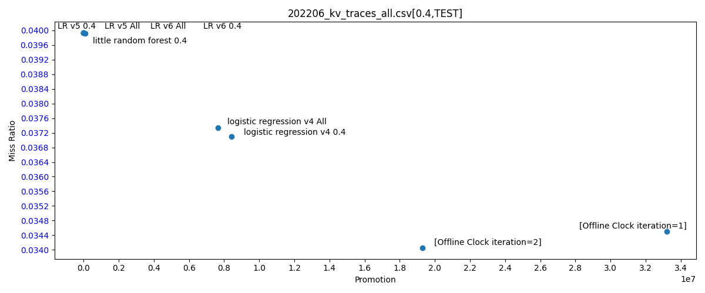  
> **Trace Path**: 202206_kv_traces_all.csv.oracleGeneral.zst  
> **Log Path**: [../result/log/202206_kv_traces_all.csv[0.4,TEST].csv](../result/log/202206_kv_traces_all.csv[0.4,TEST].csv)  
> **Desc**: ['0.4', 'TEST', {}]  
> **Cache Size**: 24221  
> **Ignore Obj Size**: 0  
> **Total Request**: 1,644,762,386  
> **First Promotion**: 33,220,797  
> **Last Promotion**: 19,277,016  
> **Promotion Reduced**: 13,943,781  

>   
> **Trace Path**: 202206_kv_traces_all.csv.oracleGeneral.zst  
> **Log Path**: [../result/log/202206_kv_traces_all.csv[0.4,ignore_obj_size,TEST].csv](../result/log/202206_kv_traces_all.csv[0.4,ignore_obj_size,TEST].csv)  
> **Desc**: ['0.4', 'ignore_obj_size', 'TEST', {}]  
> **Cache Size**: 20971640  
> **Ignore Obj Size**: 1  
> **Total Request**: 1,644,762,386  
> **First Promotion**: 36,018,579  
> **Last Promotion**: 19,980,527  
> **Promotion Reduced**: 16,038,052  

## 7 https://ftp.pdl.cmu.edu/pub/datasets/twemcacheWorkload/cacheDatasets/twitter/cluster7.oracleGeneral.zst
>   
> **Trace Path**: 7.oracleGeneral.zst  
> **Log Path**: [../result/log/7[0.001,ignore_obj_size].csv](../result/log/7[0.001,ignore_obj_size].csv)  
> **Desc**: ['0.001', 'ignore_obj_size', {}]  
> **Cache Size**: 4808  
> **Ignore Obj Size**: 1  
> **Total Request**: 265,694,431  
> **First Promotion**: 30,582,135  
> **Last Promotion**: 13,598,964  
> **Promotion Reduced**: 16,983,171  

## 8610 https://ftp.pdl.cmu.edu/pub/datasets/twemcacheWorkload/cacheDatasets/tencentBlock/v2/traces/8610.oracleGeneral.zst
> 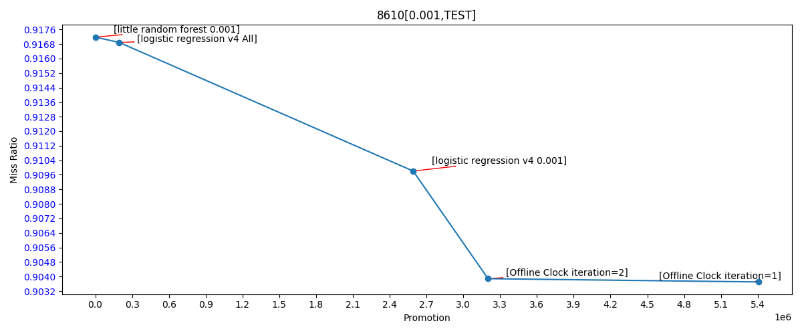  
> **Trace Path**: 8610.oracleGeneral.zst  
> **Log Path**: [../result/log/8610[0.001,TEST].csv](../result/log/8610[0.001,TEST].csv)  
> **Desc**: ['0.001', 'TEST', {}]  
> **Cache Size**: 16  
> **Ignore Obj Size**: 0  
> **Total Request**: 188,982,398  
> **First Promotion**: 5,408,744  
> **Last Promotion**: 3,201,959  
> **Promotion Reduced**: 2,206,785  

>   
> **Trace Path**: 8610.oracleGeneral.zst  
> **Log Path**: [../result/log/8610[0.001,ignore_obj_size,TEST].csv](../result/log/8610[0.001,ignore_obj_size,TEST].csv)  
> **Desc**: ['0.001', 'ignore_obj_size', 'TEST', {}]  
> **Cache Size**: 1033  
> **Ignore Obj Size**: 1  
> **Total Request**: 188,982,398  
> **First Promotion**: 5,258,333  
> **Last Promotion**: 3,350,886  
> **Promotion Reduced**: 1,907,447  

> 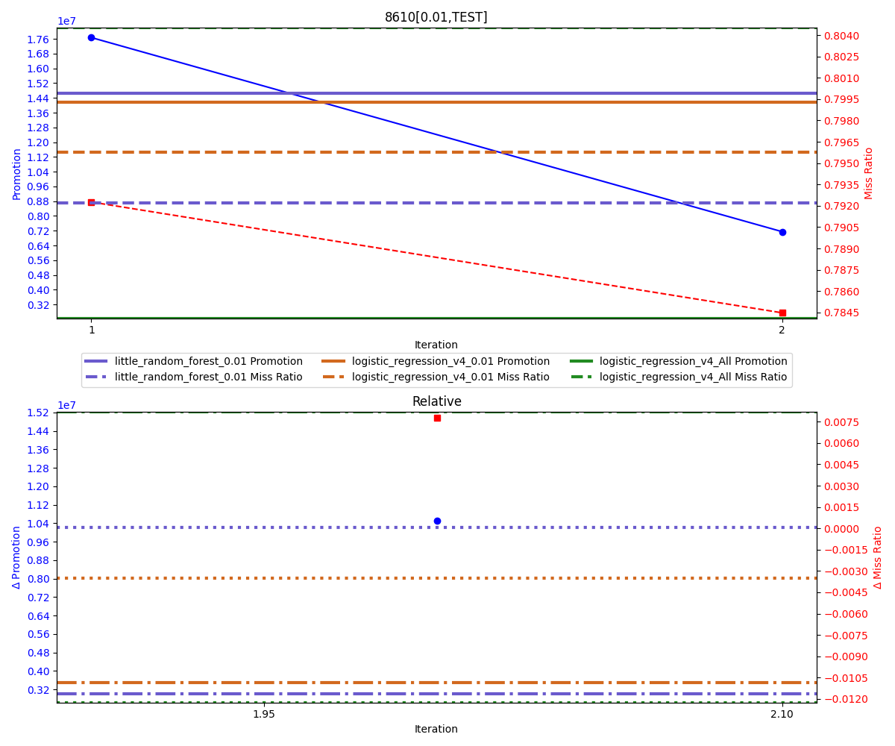  
> **Trace Path**: 8610.oracleGeneral.zst  
> **Log Path**: [../result/log/8610[0.01,TEST].csv](../result/log/8610[0.01,TEST].csv)  
> **Desc**: ['0.01', 'TEST', {}]  
> **Cache Size**: 166  
> **Ignore Obj Size**: 0  
> **Total Request**: 188,982,398  
> **First Promotion**: 17,670,550  
> **Last Promotion**: 7,150,291  
> **Promotion Reduced**: 10,520,259  

>   
> **Trace Path**: 8610.oracleGeneral.zst  
> **Log Path**: [../result/log/8610[0.01,ignore_obj_size,TEST].csv](../result/log/8610[0.01,ignore_obj_size,TEST].csv)  
> **Desc**: ['0.01', 'ignore_obj_size', 'TEST', {}]  
> **Cache Size**: 10330  
> **Ignore Obj Size**: 1  
> **Total Request**: 188,982,398  
> **First Promotion**: 21,743,535  
> **Last Promotion**: 9,154,976  
> **Promotion Reduced**: 12,588,559  

> 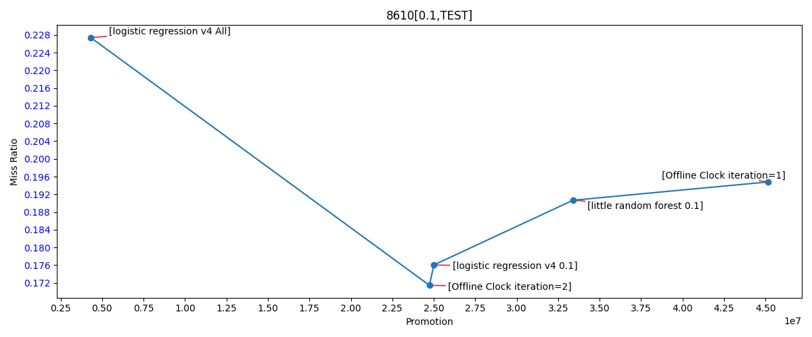  
> **Trace Path**: 8610.oracleGeneral.zst  
> **Log Path**: [../result/log/8610[0.1,TEST].csv](../result/log/8610[0.1,TEST].csv)  
> **Desc**: ['0.1', 'TEST', {}]  
> **Cache Size**: 1669  
> **Ignore Obj Size**: 0  
> **Total Request**: 188,982,398  
> **First Promotion**: 45,152,846  
> **Last Promotion**: 24,737,689  
> **Promotion Reduced**: 20,415,157  

>   
> **Trace Path**: 8610.oracleGeneral.zst  
> **Log Path**: [../result/log/8610[0.1,ignore_obj_size,TEST].csv](../result/log/8610[0.1,ignore_obj_size,TEST].csv)  
> **Desc**: ['0.1', 'ignore_obj_size', 'TEST', {}]  
> **Cache Size**: 103301  
> **Ignore Obj Size**: 1  
> **Total Request**: 188,982,398  
> **First Promotion**: 41,828,908  
> **Last Promotion**: 23,764,503  
> **Promotion Reduced**: 18,064,405  

> 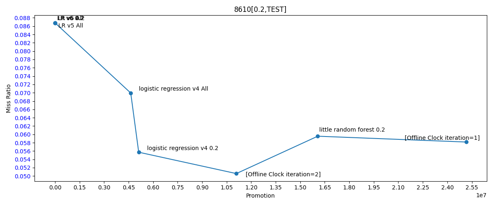  
> **Trace Path**: 8610.oracleGeneral.zst  
> **Log Path**: [../result/log/8610[0.2,TEST].csv](../result/log/8610[0.2,TEST].csv)  
> **Desc**: ['0.2', 'TEST', {}]  
> **Cache Size**: 3339  
> **Ignore Obj Size**: 0  
> **Total Request**: 188,982,398  
> **First Promotion**: 25,159,052  
> **Last Promotion**: 11,091,146  
> **Promotion Reduced**: 14,067,906  

>   
> **Trace Path**: 8610.oracleGeneral.zst  
> **Log Path**: [../result/log/8610[0.2,ignore_obj_size,TEST].csv](../result/log/8610[0.2,ignore_obj_size,TEST].csv)  
> **Desc**: ['0.2', 'ignore_obj_size', 'TEST', {}]  
> **Cache Size**: 206602  
> **Ignore Obj Size**: 1  
> **Total Request**: 188,982,398  
> **First Promotion**: 23,823,783  
> **Last Promotion**: 10,657,735  
> **Promotion Reduced**: 13,166,048  

> 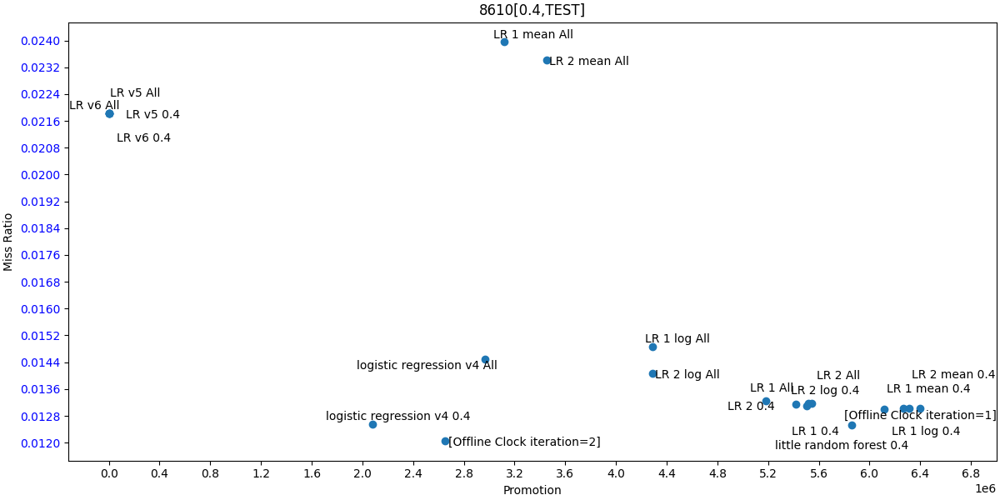  
> **Trace Path**: 8610.oracleGeneral.zst  
> **Log Path**: [../result/log/8610[0.4,TEST].csv](../result/log/8610[0.4,TEST].csv)  
> **Desc**: ['0.4', 'TEST', {}]  
> **Cache Size**: 6679  
> **Ignore Obj Size**: 0  
> **Total Request**: 188,982,398  
> **First Promotion**: 6,400,174  
> **Last Promotion**: 2,648,355  
> **Promotion Reduced**: 3,751,819  

>   
> **Trace Path**: 8610.oracleGeneral.zst  
> **Log Path**: [../result/log/8610[0.4,ignore_obj_size,TEST].csv](../result/log/8610[0.4,ignore_obj_size,TEST].csv)  
> **Desc**: ['0.4', 'ignore_obj_size', 'TEST', {}]  
> **Cache Size**: 413204  
> **Ignore Obj Size**: 1  
> **Total Request**: 188,982,398  
> **First Promotion**: 6,325,788  
> **Last Promotion**: 2,678,245  
> **Promotion Reduced**: 3,647,543  

## block_traces_5 
>   
> **Trace Path**: block_traces_5.oracleGeneral.bin.zst  
> **Log Path**: [../result/log/block_traces_5[0.001,ignore_obj_size].csv](../result/log/block_traces_5[0.001,ignore_obj_size].csv)  
> **Desc**: ['0.001', 'ignore_obj_size', {}]  
> **Cache Size**: 7110  
> **Ignore Obj Size**: 1  
> **Total Request**: 14,556,172  
> **First Promotion**: 2,800,236  
> **Last Promotion**: 80,887  
> **Promotion Reduced**: 2,719,349  

## cluster53 https://ftp.pdl.cmu.edu/pub/datasets/twemcacheWorkload/cacheDatasets/twitter/cluster53.oracleGeneral.zst
> 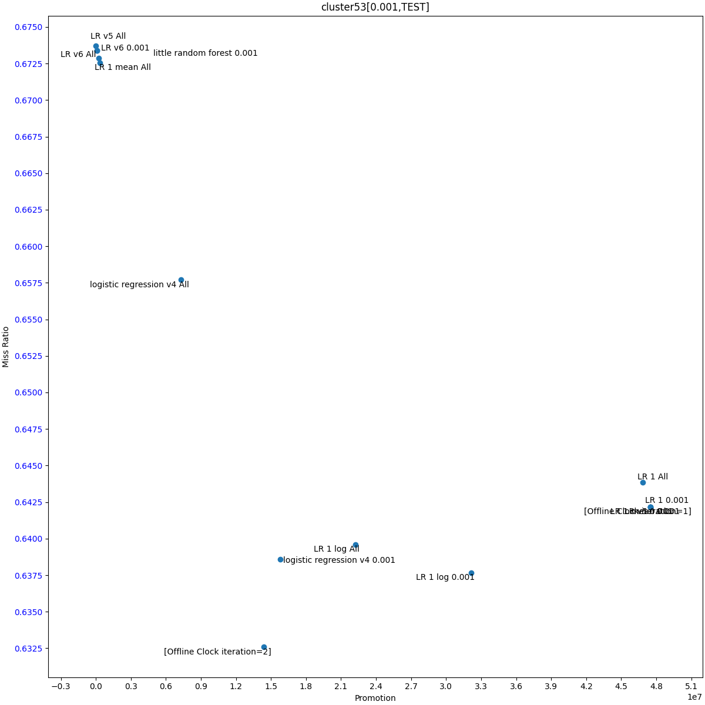  
> **Trace Path**: cluster53.oracleGeneral.zst  
> **Log Path**: [../result/log/cluster53[0.001,TEST].csv](../result/log/cluster53[0.001,TEST].csv)  
> **Desc**: ['0.001', 'TEST', {}]  
> **Cache Size**: 10  
> **Ignore Obj Size**: 0  
> **Total Request**: 246,508,262  
> **First Promotion**: 47,505,064  
> **Last Promotion**: 14,364,723  
> **Promotion Reduced**: 33,140,341  

>   
> **Trace Path**: cluster53.oracleGeneral.zst  
> **Log Path**: [../result/log/cluster53[0.001,ignore_obj_size,TEST].csv](../result/log/cluster53[0.001,ignore_obj_size,TEST].csv)  
> **Desc**: ['0.001', 'ignore_obj_size', 'TEST', {}]  
> **Cache Size**: 7243  
> **Ignore Obj Size**: 1  
> **Total Request**: 246,508,262  
> **First Promotion**: 53,593,070  
> **Last Promotion**: 19,624,041  
> **Promotion Reduced**: 33,969,029  

> 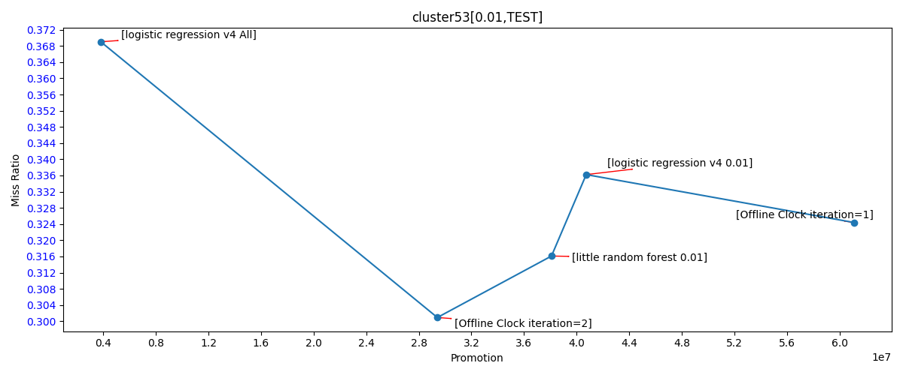  
> **Trace Path**: cluster53.oracleGeneral.zst  
> **Log Path**: [../result/log/cluster53[0.01,TEST].csv](../result/log/cluster53[0.01,TEST].csv)  
> **Desc**: ['0.01', 'TEST', {}]  
> **Cache Size**: 103  
> **Ignore Obj Size**: 0  
> **Total Request**: 246,508,262  
> **First Promotion**: 61,094,288  
> **Last Promotion**: 29,410,012  
> **Promotion Reduced**: 31,684,276  

>   
> **Trace Path**: cluster53.oracleGeneral.zst  
> **Log Path**: [../result/log/cluster53[0.01,ignore_obj_size,TEST].csv](../result/log/cluster53[0.01,ignore_obj_size,TEST].csv)  
> **Desc**: ['0.01', 'ignore_obj_size', 'TEST', {}]  
> **Cache Size**: 72439  
> **Ignore Obj Size**: 1  
> **Total Request**: 246,508,262  
> **First Promotion**: 34,628,562  
> **Last Promotion**: 12,603,512  
> **Promotion Reduced**: 22,025,050  

> 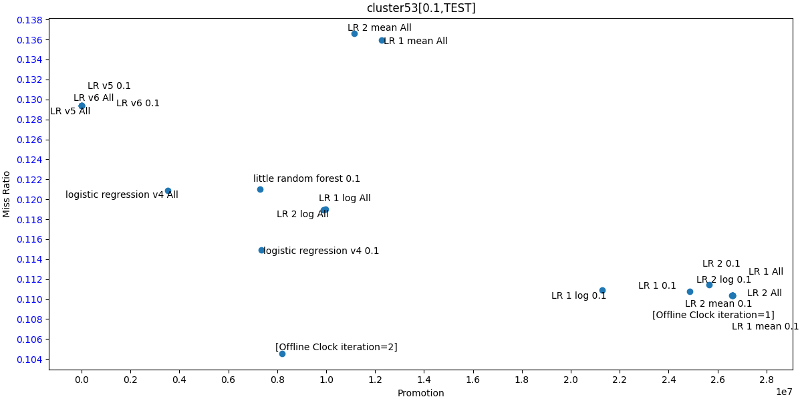  
> **Trace Path**: cluster53.oracleGeneral.zst  
> **Log Path**: [../result/log/cluster53[0.1,TEST].csv](../result/log/cluster53[0.1,TEST].csv)  
> **Desc**: ['0.1', 'TEST', {}]  
> **Cache Size**: 1033  
> **Ignore Obj Size**: 0  
> **Total Request**: 246,508,262  
> **First Promotion**: 26,600,418  
> **Last Promotion**: 8,197,787  
> **Promotion Reduced**: 18,402,631  

>   
> **Trace Path**: cluster53.oracleGeneral.zst  
> **Log Path**: [../result/log/cluster53[0.1,ignore_obj_size,TEST].csv](../result/log/cluster53[0.1,ignore_obj_size,TEST].csv)  
> **Desc**: ['0.1', 'ignore_obj_size', 'TEST', {}]  
> **Cache Size**: 724391  
> **Ignore Obj Size**: 1  
> **Total Request**: 246,508,262  
> **First Promotion**: 16,096,799  
> **Last Promotion**: 4,195,864  
> **Promotion Reduced**: 11,900,935  

> 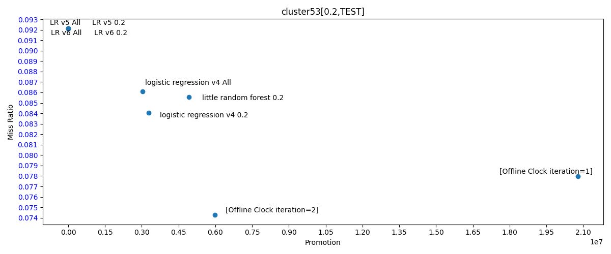  
> **Trace Path**: cluster53.oracleGeneral.zst  
> **Log Path**: [../result/log/cluster53[0.2,TEST].csv](../result/log/cluster53[0.2,TEST].csv)  
> **Desc**: ['0.2', 'TEST', {}]  
> **Cache Size**: 2066  
> **Ignore Obj Size**: 0  
> **Total Request**: 246,508,262  
> **First Promotion**: 20,783,375  
> **Last Promotion**: 5,976,053  
> **Promotion Reduced**: 14,807,322  

>   
> **Trace Path**: cluster53.oracleGeneral.zst  
> **Log Path**: [../result/log/cluster53[0.2,ignore_obj_size,TEST].csv](../result/log/cluster53[0.2,ignore_obj_size,TEST].csv)  
> **Desc**: ['0.2', 'ignore_obj_size', 'TEST', {}]  
> **Cache Size**: 1448783  
> **Ignore Obj Size**: 1  
> **Total Request**: 246,508,262  
> **First Promotion**: 12,261,385  
> **Last Promotion**: 3,345,674  
> **Promotion Reduced**: 8,915,711  

> 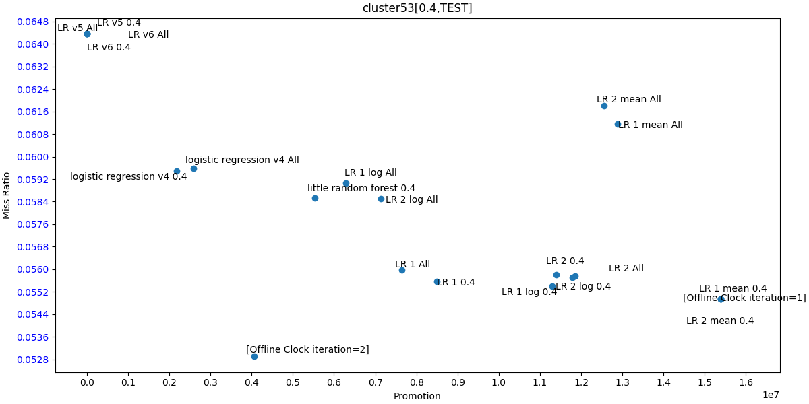  
> **Trace Path**: cluster53.oracleGeneral.zst  
> **Log Path**: [../result/log/cluster53[0.4,TEST].csv](../result/log/cluster53[0.4,TEST].csv)  
> **Desc**: ['0.4', 'TEST', {}]  
> **Cache Size**: 4132  
> **Ignore Obj Size**: 0  
> **Total Request**: 246,508,262  
> **First Promotion**: 15,380,289  
> **Last Promotion**: 4,058,288  
> **Promotion Reduced**: 11,322,001  

>   
> **Trace Path**: cluster53.oracleGeneral.zst  
> **Log Path**: [../result/log/cluster53[0.4,ignore_obj_size,TEST].csv](../result/log/cluster53[0.4,ignore_obj_size,TEST].csv)  
> **Desc**: ['0.4', 'ignore_obj_size', 'TEST', {}]  
> **Cache Size**: 2897567  
> **Ignore Obj Size**: 1  
> **Total Request**: 246,508,262  
> **First Promotion**: 8,774,802  
> **Last Promotion**: 3,061,870  
> **Promotion Reduced**: 5,712,932  

## fiu_cheetah.cs.fiu.edu-110108-113008 https://ftp.pdl.cmu.edu/pub/datasets/twemcacheWorkload/cacheDatasets/fiu/fiu_cheetah.cs.fiu.edu-110108-113008.oracleGeneral.zst
>   
> **Trace Path**: fiu_cheetah.cs.fiu.edu-110108-113008.oracleGeneral.zst  
> **Log Path**: [../result/log/fiu_cheetah.cs.fiu.edu-110108-113008[0.001,ignore_obj_size].csv](../result/log/fiu_cheetah.cs.fiu.edu-110108-113008[0.001,ignore_obj_size].csv)  
> **Desc**: ['0.001', 'ignore_obj_size', {}]  
> **Cache Size**: 14909  
> **Ignore Obj Size**: 1  
> **Total Request**: 442,393,092  
> **First Promotion**: 21,117,805  
> **Last Promotion**: 1,100,888  
> **Promotion Reduced**: 20,016,917  

## meta_rprn https://ftp.pdl.cmu.edu/pub/datasets/twemcacheWorkload/cacheDatasets/metaCDN/meta_rprn.oracleGeneral.zst
>   
> **Trace Path**: meta_rprn.oracleGeneral.zst  
> **Log Path**: [../result/log/meta_rprn[0.001,TEST].csv](../result/log/meta_rprn[0.001,TEST].csv)  
> **Desc**: ['0.001', 'TEST', {}]  
> **Cache Size**: 698675  
> **Ignore Obj Size**: 0  
> **Total Request**: 88,470,732  
> **First Promotion**: 8,288,021  
> **Last Promotion**: 1,162,602  
> **Promotion Reduced**: 7,125,419  

>   
> **Trace Path**: meta_rprn.oracleGeneral.zst  
> **Log Path**: [../result/log/meta_rprn[0.001,ignore_obj_size,TEST].csv](../result/log/meta_rprn[0.001,ignore_obj_size,TEST].csv)  
> **Desc**: ['0.001', 'ignore_obj_size', 'TEST', {}]  
> **Cache Size**: 29030  
> **Ignore Obj Size**: 1  
> **Total Request**: 88,470,732  
> **First Promotion**: 8,302,538  
> **Last Promotion**: 1,192,313  
> **Promotion Reduced**: 7,110,225  

> 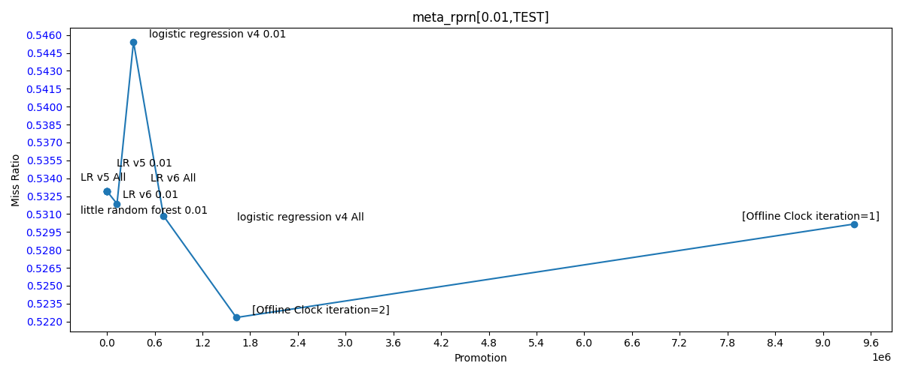  
> **Trace Path**: meta_rprn.oracleGeneral.zst  
> **Log Path**: [../result/log/meta_rprn[0.01,TEST].csv](../result/log/meta_rprn[0.01,TEST].csv)  
> **Desc**: ['0.01', 'TEST', {}]  
> **Cache Size**: 6986759  
> **Ignore Obj Size**: 0  
> **Total Request**: 88,470,732  
> **First Promotion**: 9,395,689  
> **Last Promotion**: 1,625,545  
> **Promotion Reduced**: 7,770,144  

>   
> **Trace Path**: meta_rprn.oracleGeneral.zst  
> **Log Path**: [../result/log/meta_rprn[0.01,ignore_obj_size,TEST].csv](../result/log/meta_rprn[0.01,ignore_obj_size,TEST].csv)  
> **Desc**: ['0.01', 'ignore_obj_size', 'TEST', {}]  
> **Cache Size**: 290302  
> **Ignore Obj Size**: 1  
> **Total Request**: 88,470,732  
> **First Promotion**: 9,425,698  
> **Last Promotion**: 1,711,809  
> **Promotion Reduced**: 7,713,889  

> 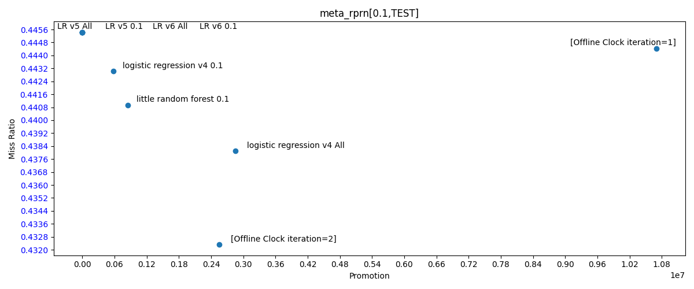  
> **Trace Path**: meta_rprn.oracleGeneral.zst  
> **Log Path**: [../result/log/meta_rprn[0.1,TEST].csv](../result/log/meta_rprn[0.1,TEST].csv)  
> **Desc**: ['0.1', 'TEST', {}]  
> **Cache Size**: 69867592  
> **Ignore Obj Size**: 0  
> **Total Request**: 88,470,732  
> **First Promotion**: 10,703,932  
> **Last Promotion**: 2,549,034  
> **Promotion Reduced**: 8,154,898  

>   
> **Trace Path**: meta_rprn.oracleGeneral.zst  
> **Log Path**: [../result/log/meta_rprn[0.1,ignore_obj_size,TEST].csv](../result/log/meta_rprn[0.1,ignore_obj_size,TEST].csv)  
> **Desc**: ['0.1', 'ignore_obj_size', 'TEST', {}]  
> **Cache Size**: 2903028  
> **Ignore Obj Size**: 1  
> **Total Request**: 88,470,732  
> **First Promotion**: 10,695,550  
> **Last Promotion**: 2,807,092  
> **Promotion Reduced**: 7,888,458  

> 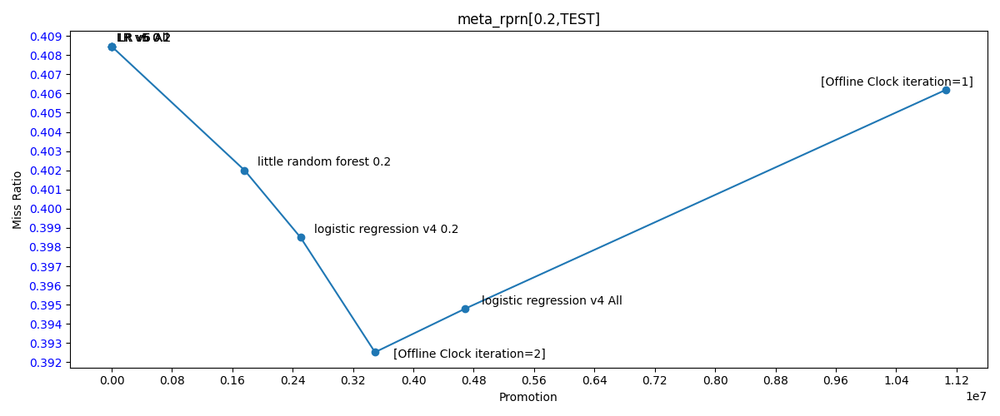  
> **Trace Path**: meta_rprn.oracleGeneral.zst  
> **Log Path**: [../result/log/meta_rprn[0.2,TEST].csv](../result/log/meta_rprn[0.2,TEST].csv)  
> **Desc**: ['0.2', 'TEST', {}]  
> **Cache Size**: 139735184  
> **Ignore Obj Size**: 0  
> **Total Request**: 88,470,732  
> **First Promotion**: 11,058,533  
> **Last Promotion**: 3,491,518  
> **Promotion Reduced**: 7,567,015  

>   
> **Trace Path**: meta_rprn.oracleGeneral.zst  
> **Log Path**: [../result/log/meta_rprn[0.2,ignore_obj_size,TEST].csv](../result/log/meta_rprn[0.2,ignore_obj_size,TEST].csv)  
> **Desc**: ['0.2', 'ignore_obj_size', 'TEST', {}]  
> **Cache Size**: 5806056  
> **Ignore Obj Size**: 1  
> **Total Request**: 88,470,732  
> **First Promotion**: 10,978,824  
> **Last Promotion**: 4,056,857  
> **Promotion Reduced**: 6,921,967  

> 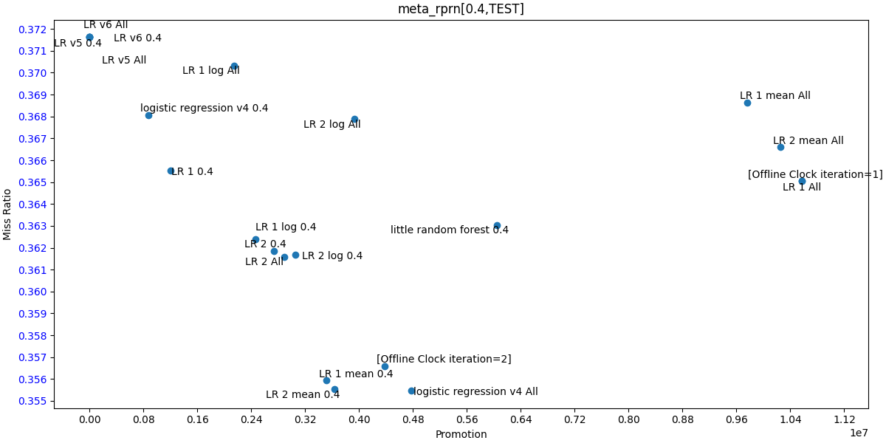  
> **Trace Path**: meta_rprn.oracleGeneral.zst  
> **Log Path**: [../result/log/meta_rprn[0.4,TEST].csv](../result/log/meta_rprn[0.4,TEST].csv)  
> **Desc**: ['0.4', 'TEST', {}]  
> **Cache Size**: 279470368  
> **Ignore Obj Size**: 0  
> **Total Request**: 88,470,732  
> **First Promotion**: 10,574,442  
> **Last Promotion**: 4,379,575  
> **Promotion Reduced**: 6,194,867  

>   
> **Trace Path**: meta_rprn.oracleGeneral.zst  
> **Log Path**: [../result/log/meta_rprn[0.4,ignore_obj_size,TEST].csv](../result/log/meta_rprn[0.4,ignore_obj_size,TEST].csv)  
> **Desc**: ['0.4', 'ignore_obj_size', 'TEST', {}]  
> **Cache Size**: 11612113  
> **Ignore Obj Size**: 1  
> **Total Request**: 88,470,732  
> **First Promotion**: 10,004,076  
> **Last Promotion**: 5,579,338  
> **Promotion Reduced**: 4,424,738  

## msr_prxy_1 https://ftp.pdl.cmu.edu/pub/datasets/twemcacheWorkload/cacheDatasets/msr/msr_prxy_1.oracleGeneral.zst
>   
> **Trace Path**: msr_prxy_1.oracleGeneral.zst  
> **Log Path**: [../result/log/msr_prxy_1[0.001,ignore_obj_size].csv](../result/log/msr_prxy_1[0.001,ignore_obj_size].csv)  
> **Desc**: ['0.001', 'ignore_obj_size', {}]  
> **Cache Size**: 390  
> **Ignore Obj Size**: 1  
> **Total Request**: 168,638,964  
> **First Promotion**: 22,655,033  
> **Last Promotion**: 551,531  
> **Promotion Reduced**: 22,103,502  

## wiki_2019u https://ftp.pdl.cmu.edu/pub/datasets/twemcacheWorkload/cacheDatasets/wiki/wiki_2019u.oracleGeneral.zst
> 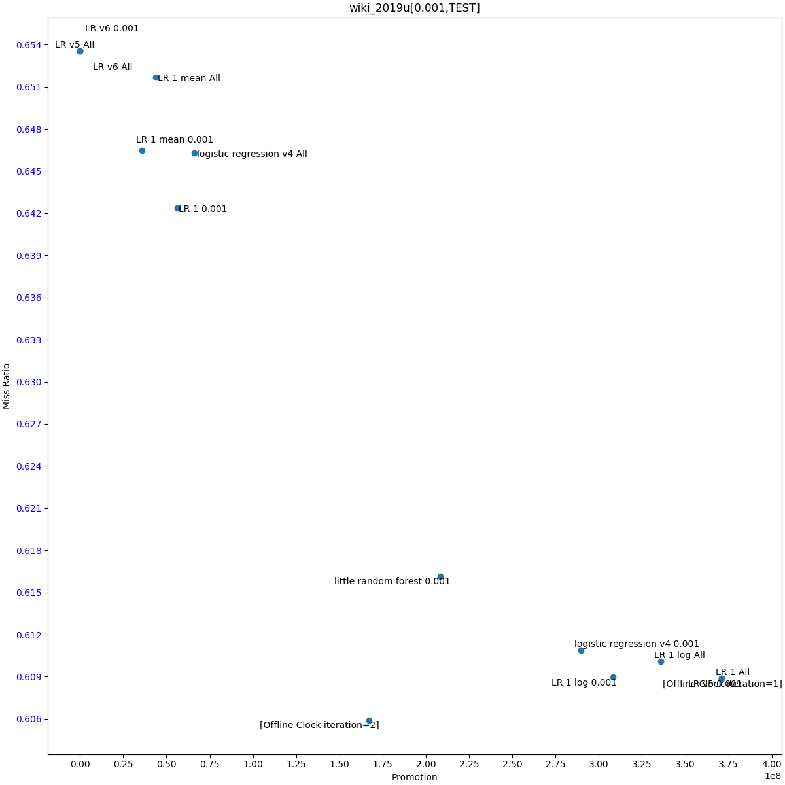  
> **Trace Path**: wiki_2019u.oracleGeneral.zst  
> **Log Path**: [../result/log/wiki_2019u[0.001,TEST].csv](../result/log/wiki_2019u[0.001,TEST].csv)  
> **Desc**: ['0.001', 'TEST', {}]  
> **Cache Size**: 8016  
> **Ignore Obj Size**: 0  
> **Total Request**: 2,655,612,611  
> **First Promotion**: 371,118,617  
> **Last Promotion**: 167,057,775  
> **Promotion Reduced**: 204,060,842  

>   
> **Trace Path**: wiki_2019u.oracleGeneral.zst  
> **Log Path**: [../result/log/wiki_2019u[0.001,ignore_obj_size,TEST].csv](../result/log/wiki_2019u[0.001,ignore_obj_size,TEST].csv)  
> **Desc**: ['0.001', 'ignore_obj_size', 'TEST', {}]  
> **Cache Size**: 49619  
> **Ignore Obj Size**: 1  
> **Total Request**: 2,655,612,611  
> **First Promotion**: 250,581,840  
> **Last Promotion**: 104,185,782  
> **Promotion Reduced**: 146,396,058  

> 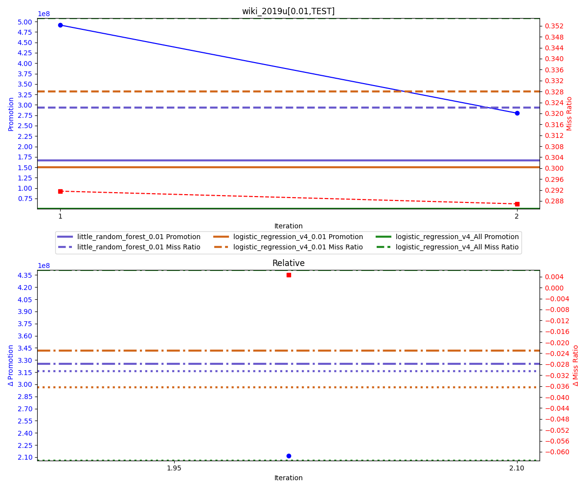  
> **Trace Path**: wiki_2019u.oracleGeneral.zst  
> **Log Path**: [../result/log/wiki_2019u[0.01,TEST].csv](../result/log/wiki_2019u[0.01,TEST].csv)  
> **Desc**: ['0.01', 'TEST', {}]  
> **Cache Size**: 80166  
> **Ignore Obj Size**: 0  
> **Total Request**: 2,655,612,611  
> **First Promotion**: 491,687,145  
> **Last Promotion**: 280,069,700  
> **Promotion Reduced**: 211,617,445  

>   
> **Trace Path**: wiki_2019u.oracleGeneral.zst  
> **Log Path**: [../result/log/wiki_2019u[0.01,ignore_obj_size,TEST].csv](../result/log/wiki_2019u[0.01,ignore_obj_size,TEST].csv)  
> **Desc**: ['0.01', 'ignore_obj_size', 'TEST', {}]  
> **Cache Size**: 496199  
> **Ignore Obj Size**: 1  
> **Total Request**: 2,655,612,611  
> **First Promotion**: 473,136,479  
> **Last Promotion**: 239,062,219  
> **Promotion Reduced**: 234,074,260  

> 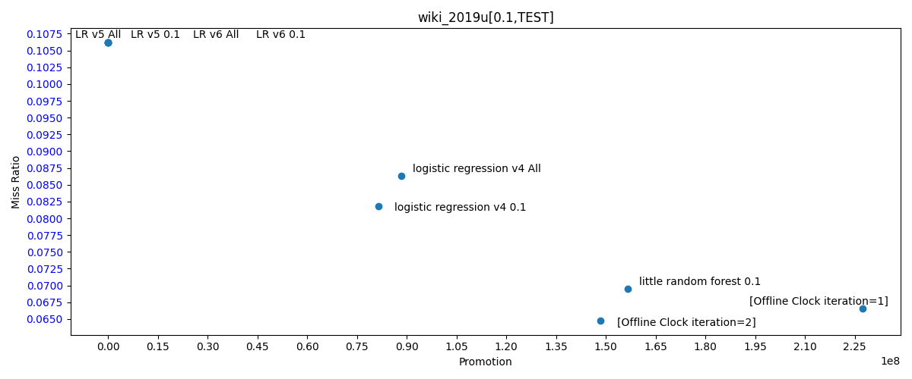  
> **Trace Path**: wiki_2019u.oracleGeneral.zst  
> **Log Path**: [../result/log/wiki_2019u[0.1,TEST].csv](../result/log/wiki_2019u[0.1,TEST].csv)  
> **Desc**: ['0.1', 'TEST', {}]  
> **Cache Size**: 801664  
> **Ignore Obj Size**: 0  
> **Total Request**: 2,655,612,611  
> **First Promotion**: 227,465,125  
> **Last Promotion**: 148,305,692  
> **Promotion Reduced**: 79,159,433  

>   
> **Trace Path**: wiki_2019u.oracleGeneral.zst  
> **Log Path**: [../result/log/wiki_2019u[0.1,ignore_obj_size,TEST].csv](../result/log/wiki_2019u[0.1,ignore_obj_size,TEST].csv)  
> **Desc**: ['0.1', 'ignore_obj_size', 'TEST', {}]  
> **Cache Size**: 4961999  
> **Ignore Obj Size**: 1  
> **Total Request**: 2,655,612,611  
> **First Promotion**: 335,941,101  
> **Last Promotion**: 201,292,595  
> **Promotion Reduced**: 134,648,506  

> 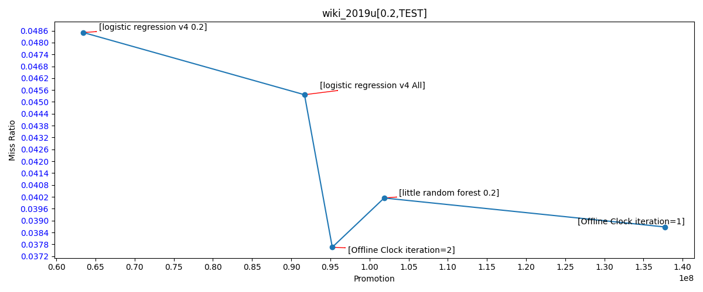  
> **Trace Path**: wiki_2019u.oracleGeneral.zst  
> **Log Path**: [../result/log/wiki_2019u[0.2,TEST].csv](../result/log/wiki_2019u[0.2,TEST].csv)  
> **Desc**: ['0.2', 'TEST', {}]  
> **Cache Size**: 1603329  
> **Ignore Obj Size**: 0  
> **Total Request**: 2,655,612,611  
> **First Promotion**: 137,760,213  
> **Last Promotion**: 95,249,977  
> **Promotion Reduced**: 42,510,236  

>   
> **Trace Path**: wiki_2019u.oracleGeneral.zst  
> **Log Path**: [../result/log/wiki_2019u[0.2,ignore_obj_size,TEST].csv](../result/log/wiki_2019u[0.2,ignore_obj_size,TEST].csv)  
> **Desc**: ['0.2', 'ignore_obj_size', 'TEST', {}]  
> **Cache Size**: 9923998  
> **Ignore Obj Size**: 1  
> **Total Request**: 2,655,612,611  
> **First Promotion**: 207,854,955  
> **Last Promotion**: 132,371,165  
> **Promotion Reduced**: 75,483,790  

> 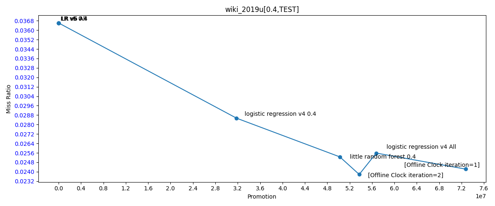  
> **Trace Path**: wiki_2019u.oracleGeneral.zst  
> **Log Path**: [../result/log/wiki_2019u[0.4,TEST].csv](../result/log/wiki_2019u[0.4,TEST].csv)  
> **Desc**: ['0.4', 'TEST', {}]  
> **Cache Size**: 3206658  
> **Ignore Obj Size**: 0  
> **Total Request**: 2,655,612,611  
> **First Promotion**: 72,724,050  
> **Last Promotion**: 53,709,788  
> **Promotion Reduced**: 19,014,262  

>   
> **Trace Path**: wiki_2019u.oracleGeneral.zst  
> **Log Path**: [../result/log/wiki_2019u[0.4,ignore_obj_size,TEST].csv](../result/log/wiki_2019u[0.4,ignore_obj_size,TEST].csv)  
> **Desc**: ['0.4', 'ignore_obj_size', 'TEST', {}]  
> **Cache Size**: 19847996  
> **Ignore Obj Size**: 1  
> **Total Request**: 2,655,612,611  
> **First Promotion**: 98,329,628  
> **Last Promotion**: 69,256,477  
> **Promotion Reduced**: 29,073,151  

## zipf_0.3 
> 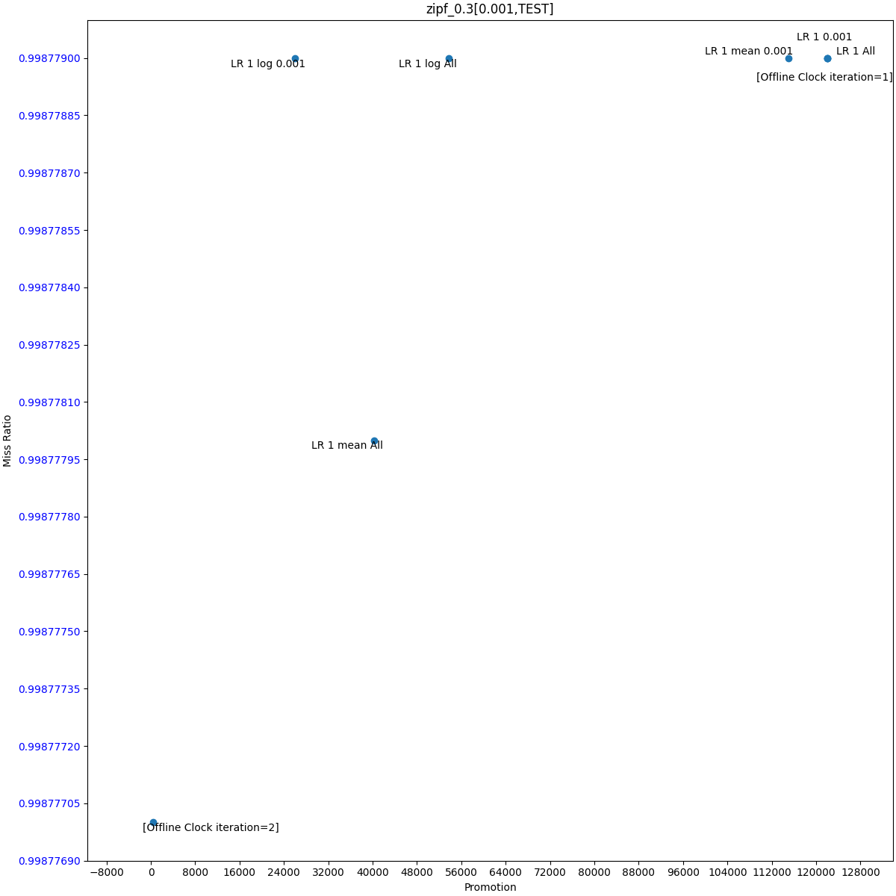  
> **Trace Path**: zipf_0.3.oracleGeneral  
> **Log Path**: [../result/log/zipf_0.3[0.001,TEST].csv](../result/log/zipf_0.3[0.001,TEST].csv)  
> **Desc**: ['0.001', 'TEST', {}]  
> **Cache Size**: 3  
> **Ignore Obj Size**: 0  
> **Total Request**: 100,000,000  
> **First Promotion**: 122,011  
> **Last Promotion**: 399  
> **Promotion Reduced**: 121,612  

>   
> **Trace Path**: zipf_0.3.oracleGeneral  
> **Log Path**: [../result/log/zipf_0.3[0.001,ignore_obj_size,TEST].csv](../result/log/zipf_0.3[0.001,ignore_obj_size,TEST].csv)  
> **Desc**: ['0.001', 'ignore_obj_size', 'TEST', {}]  
> **Cache Size**: 1000  
> **Ignore Obj Size**: 1  
> **Total Request**: 100,000,000  
> **First Promotion**: 122,011  
> **Last Promotion**: 399  
> **Promotion Reduced**: 121,612  

> 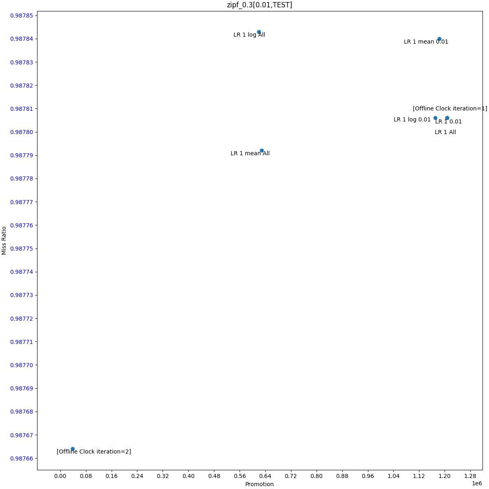  
> **Trace Path**: zipf_0.3.oracleGeneral  
> **Log Path**: [../result/log/zipf_0.3[0.01,TEST].csv](../result/log/zipf_0.3[0.01,TEST].csv)  
> **Desc**: ['0.01', 'TEST', {}]  
> **Cache Size**: 38  
> **Ignore Obj Size**: 0  
> **Total Request**: 100,000,000  
> **First Promotion**: 1,206,715  
> **Last Promotion**: 38,265  
> **Promotion Reduced**: 1,168,450  

>   
> **Trace Path**: zipf_0.3.oracleGeneral  
> **Log Path**: [../result/log/zipf_0.3[0.01,ignore_obj_size,TEST].csv](../result/log/zipf_0.3[0.01,ignore_obj_size,TEST].csv)  
> **Desc**: ['0.01', 'ignore_obj_size', 'TEST', {}]  
> **Cache Size**: 10000  
> **Ignore Obj Size**: 1  
> **Total Request**: 100,000,000  
> **First Promotion**: 1,206,715  
> **Last Promotion**: 38,265  
> **Promotion Reduced**: 1,168,450  

> 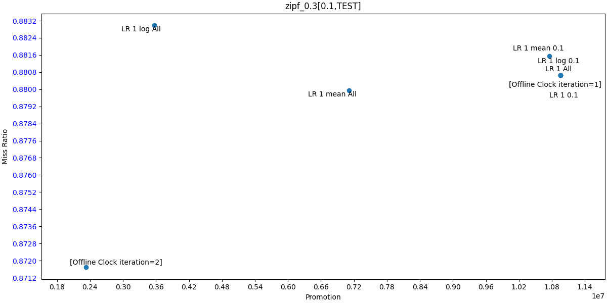  
> **Trace Path**: zipf_0.3.oracleGeneral  
> **Log Path**: [../result/log/zipf_0.3[0.1,TEST].csv](../result/log/zipf_0.3[0.1,TEST].csv)  
> **Desc**: ['0.1', 'TEST', {}]  
> **Cache Size**: 381  
> **Ignore Obj Size**: 0  
> **Total Request**: 100,000,000  
> **First Promotion**: 10,953,632  
> **Last Promotion**: 2,328,361  
> **Promotion Reduced**: 8,625,271  

>   
> **Trace Path**: zipf_0.3.oracleGeneral  
> **Log Path**: [../result/log/zipf_0.3[0.1,ignore_obj_size,TEST].csv](../result/log/zipf_0.3[0.1,ignore_obj_size,TEST].csv)  
> **Desc**: ['0.1', 'ignore_obj_size', 'TEST', {}]  
> **Cache Size**: 100001  
> **Ignore Obj Size**: 1  
> **Total Request**: 100,000,000  
> **First Promotion**: 10,953,632  
> **Last Promotion**: 2,328,361  
> **Promotion Reduced**: 8,625,271  

> 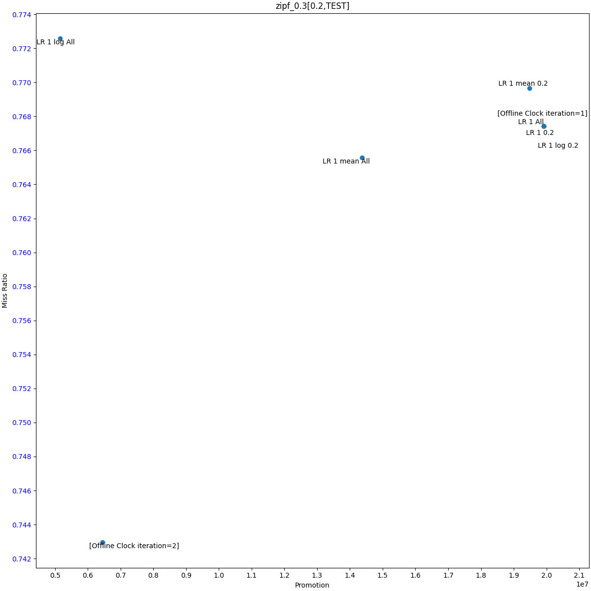  
> **Trace Path**: zipf_0.3.oracleGeneral  
> **Log Path**: [../result/log/zipf_0.3[0.2,TEST].csv](../result/log/zipf_0.3[0.2,TEST].csv)  
> **Desc**: ['0.2', 'TEST', {}]  
> **Cache Size**: 762  
> **Ignore Obj Size**: 0  
> **Total Request**: 100,000,000  
> **First Promotion**: 19,921,484  
> **Last Promotion**: 6,449,506  
> **Promotion Reduced**: 13,471,978  

>   
> **Trace Path**: zipf_0.3.oracleGeneral  
> **Log Path**: [../result/log/zipf_0.3[0.2,ignore_obj_size,TEST].csv](../result/log/zipf_0.3[0.2,ignore_obj_size,TEST].csv)  
> **Desc**: ['0.2', 'ignore_obj_size', 'TEST', {}]  
> **Cache Size**: 200002  
> **Ignore Obj Size**: 1  
> **Total Request**: 100,000,000  
> **First Promotion**: 19,921,484  
> **Last Promotion**: 6,449,506  
> **Promotion Reduced**: 13,471,978  

> 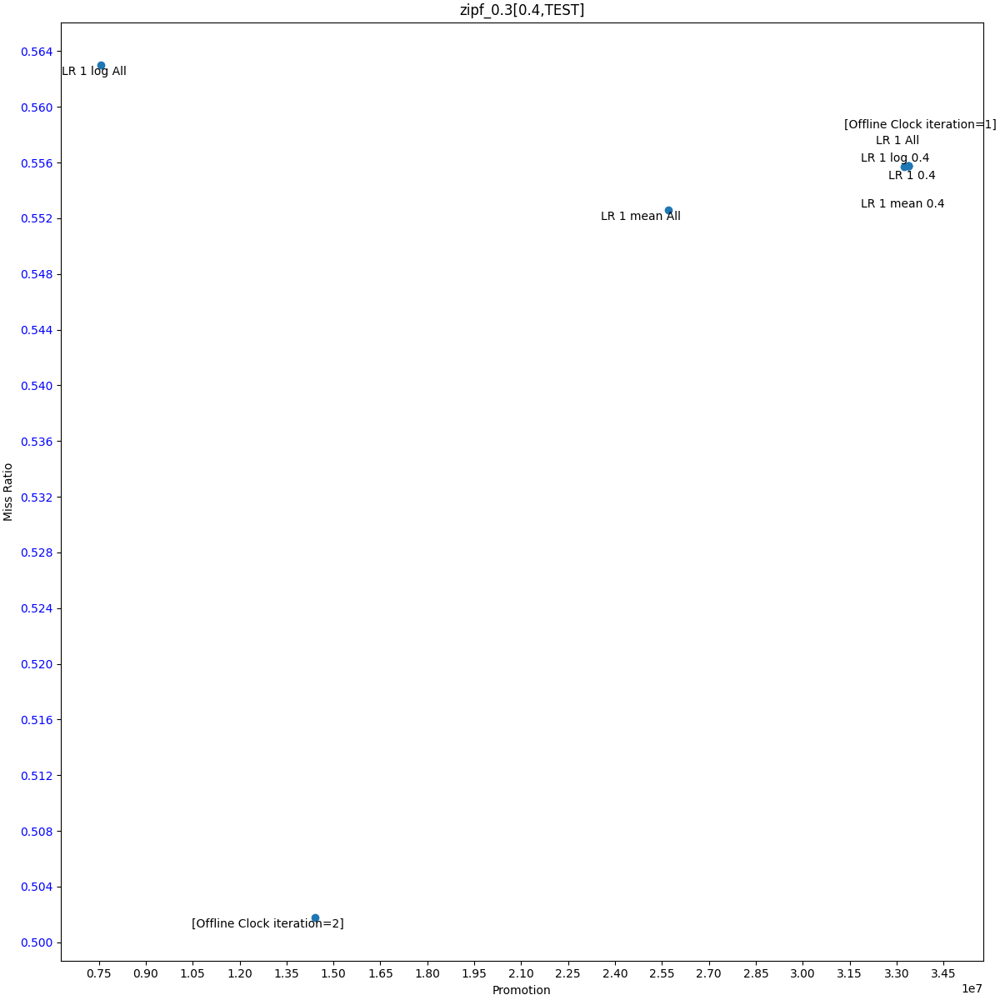  
> **Trace Path**: zipf_0.3.oracleGeneral  
> **Log Path**: [../result/log/zipf_0.3[0.4,TEST].csv](../result/log/zipf_0.3[0.4,TEST].csv)  
> **Desc**: ['0.4', 'TEST', {}]  
> **Cache Size**: 1525  
> **Ignore Obj Size**: 0  
> **Total Request**: 100,000,000  
> **First Promotion**: 33,366,072  
> **Last Promotion**: 14,419,469  
> **Promotion Reduced**: 18,946,603  

>   
> **Trace Path**: zipf_0.3.oracleGeneral  
> **Log Path**: [../result/log/zipf_0.3[0.4,ignore_obj_size,TEST].csv](../result/log/zipf_0.3[0.4,ignore_obj_size,TEST].csv)  
> **Desc**: ['0.4', 'ignore_obj_size', 'TEST', {}]  
> **Cache Size**: 400004  
> **Ignore Obj Size**: 1  
> **Total Request**: 100,000,000  
> **First Promotion**: 33,366,072  
> **Last Promotion**: 14,419,469  
> **Promotion Reduced**: 18,946,603  

## zipf_0.7 
> 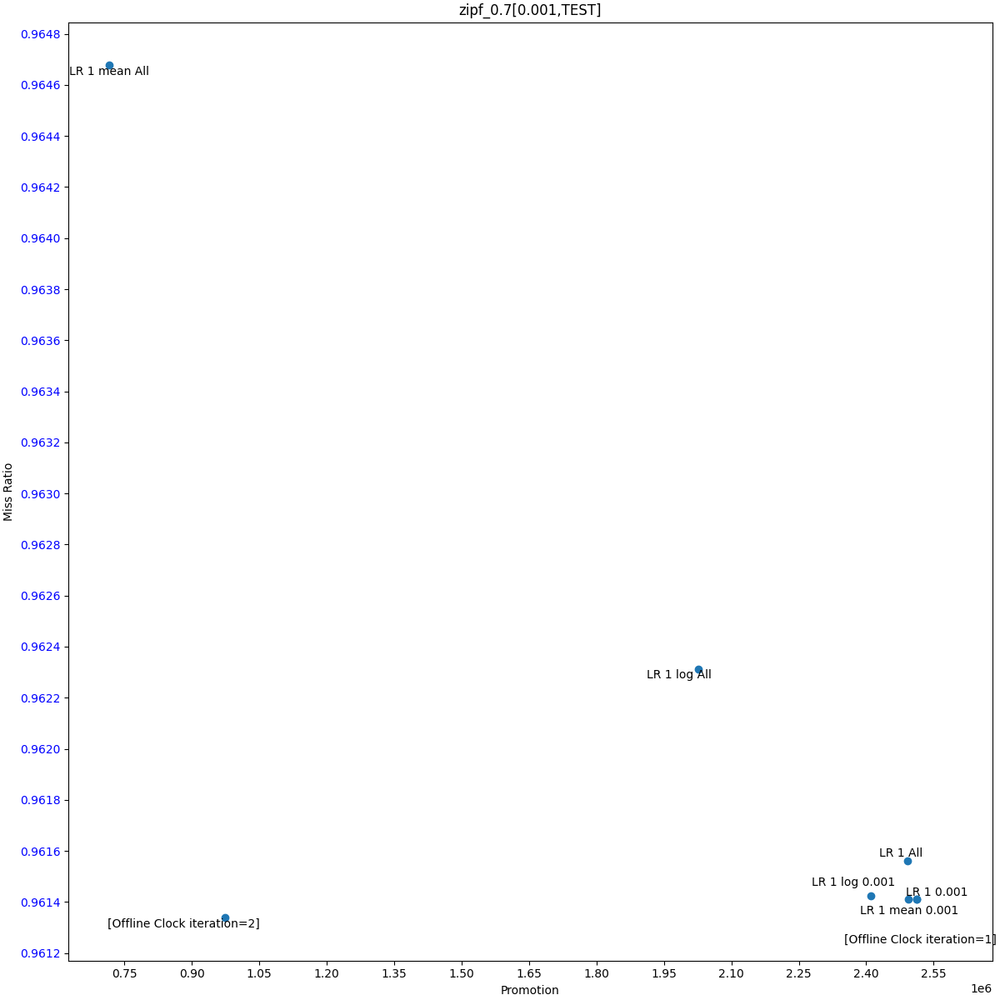  
> **Trace Path**: zipf_0.7.oracleGeneral  
> **Log Path**: [../result/log/zipf_0.7[0.001,TEST].csv](../result/log/zipf_0.7[0.001,TEST].csv)  
> **Desc**: ['0.001', 'TEST', {}]  
> **Cache Size**: 3  
> **Ignore Obj Size**: 0  
> **Total Request**: 100,000,000  
> **First Promotion**: 2,511,432  
> **Last Promotion**: 973,861  
> **Promotion Reduced**: 1,537,571  

>   
> **Trace Path**: zipf_0.7.oracleGeneral  
> **Log Path**: [../result/log/zipf_0.7[0.001,ignore_obj_size,TEST].csv](../result/log/zipf_0.7[0.001,ignore_obj_size,TEST].csv)  
> **Desc**: ['0.001', 'ignore_obj_size', 'TEST', {}]  
> **Cache Size**: 1000  
> **Ignore Obj Size**: 1  
> **Total Request**: 100,000,000  
> **First Promotion**: 2,511,432  
> **Last Promotion**: 973,861  
> **Promotion Reduced**: 1,537,571  

> 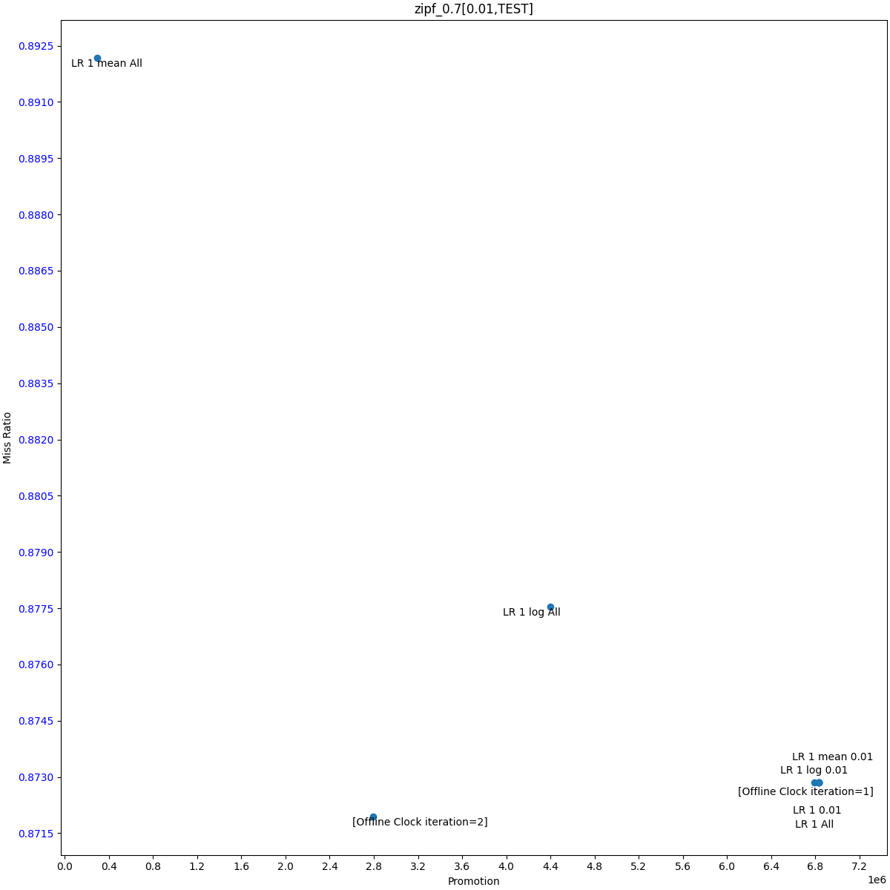  
> **Trace Path**: zipf_0.7.oracleGeneral  
> **Log Path**: [../result/log/zipf_0.7[0.01,TEST].csv](../result/log/zipf_0.7[0.01,TEST].csv)  
> **Desc**: ['0.01', 'TEST', {}]  
> **Cache Size**: 38  
> **Ignore Obj Size**: 0  
> **Total Request**: 100,000,000  
> **First Promotion**: 6,833,114  
> **Last Promotion**: 2,791,475  
> **Promotion Reduced**: 4,041,639  

>   
> **Trace Path**: zipf_0.7.oracleGeneral  
> **Log Path**: [../result/log/zipf_0.7[0.01,ignore_obj_size,TEST].csv](../result/log/zipf_0.7[0.01,ignore_obj_size,TEST].csv)  
> **Desc**: ['0.01', 'ignore_obj_size', 'TEST', {}]  
> **Cache Size**: 10000  
> **Ignore Obj Size**: 1  
> **Total Request**: 100,000,000  
> **First Promotion**: 6,833,114  
> **Last Promotion**: 2,791,475  
> **Promotion Reduced**: 4,041,639  

> 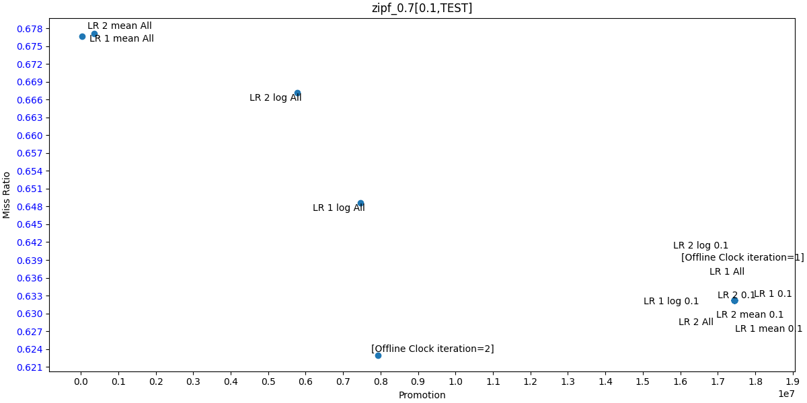  
> **Trace Path**: zipf_0.7.oracleGeneral  
> **Log Path**: [../result/log/zipf_0.7[0.1,TEST].csv](../result/log/zipf_0.7[0.1,TEST].csv)  
> **Desc**: ['0.1', 'TEST', {}]  
> **Cache Size**: 381  
> **Ignore Obj Size**: 0  
> **Total Request**: 100,000,000  
> **First Promotion**: 17,442,035  
> **Last Promotion**: 7,929,741  
> **Promotion Reduced**: 9,512,294  

>   
> **Trace Path**: zipf_0.7.oracleGeneral  
> **Log Path**: [../result/log/zipf_0.7[0.1,ignore_obj_size,TEST].csv](../result/log/zipf_0.7[0.1,ignore_obj_size,TEST].csv)  
> **Desc**: ['0.1', 'ignore_obj_size', 'TEST', {}]  
> **Cache Size**: 100001  
> **Ignore Obj Size**: 1  
> **Total Request**: 100,000,000  
> **First Promotion**: 17,442,035  
> **Last Promotion**: 7,929,741  
> **Promotion Reduced**: 9,512,294  

> 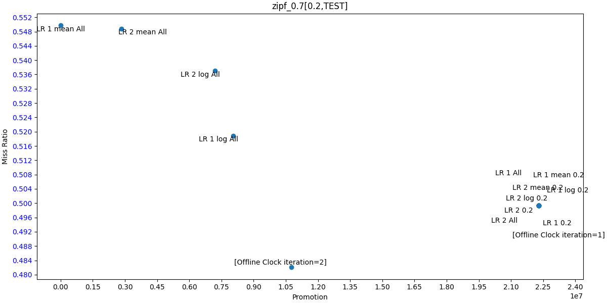  
> **Trace Path**: zipf_0.7.oracleGeneral  
> **Log Path**: [../result/log/zipf_0.7[0.2,TEST].csv](../result/log/zipf_0.7[0.2,TEST].csv)  
> **Desc**: ['0.2', 'TEST', {}]  
> **Cache Size**: 762  
> **Ignore Obj Size**: 0  
> **Total Request**: 100,000,000  
> **First Promotion**: 22,291,697  
> **Last Promotion**: 10,760,181  
> **Promotion Reduced**: 11,531,516  

>   
> **Trace Path**: zipf_0.7.oracleGeneral  
> **Log Path**: [../result/log/zipf_0.7[0.2,ignore_obj_size,TEST].csv](../result/log/zipf_0.7[0.2,ignore_obj_size,TEST].csv)  
> **Desc**: ['0.2', 'ignore_obj_size', 'TEST', {}]  
> **Cache Size**: 200002  
> **Ignore Obj Size**: 1  
> **Total Request**: 100,000,000  
> **First Promotion**: 22,291,697  
> **Last Promotion**: 10,760,181  
> **Promotion Reduced**: 11,531,516  

> 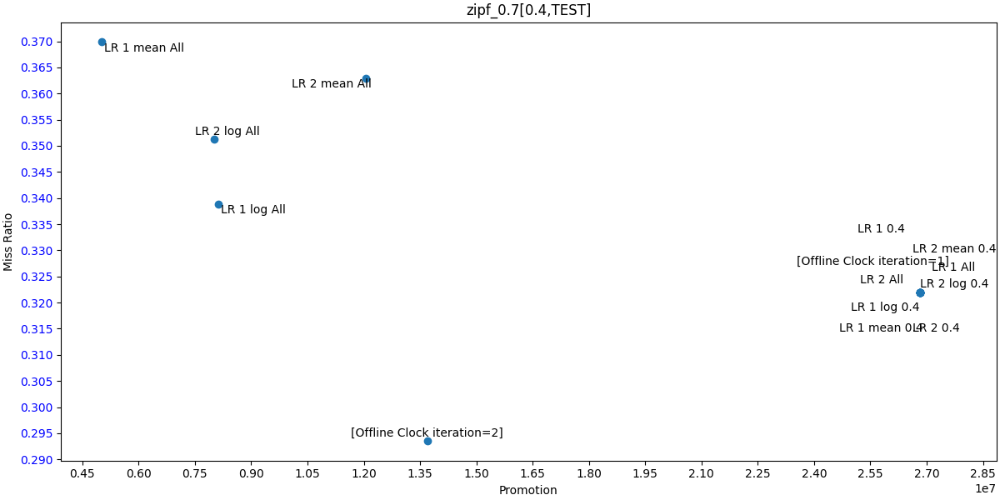  
> **Trace Path**: zipf_0.7.oracleGeneral  
> **Log Path**: [../result/log/zipf_0.7[0.4,TEST].csv](../result/log/zipf_0.7[0.4,TEST].csv)  
> **Desc**: ['0.4', 'TEST', {}]  
> **Cache Size**: 1525  
> **Ignore Obj Size**: 0  
> **Total Request**: 100,000,000  
> **First Promotion**: 26,829,983  
> **Last Promotion**: 13,705,756  
> **Promotion Reduced**: 13,124,227  

>   
> **Trace Path**: zipf_0.7.oracleGeneral  
> **Log Path**: [../result/log/zipf_0.7[0.4,ignore_obj_size,TEST].csv](../result/log/zipf_0.7[0.4,ignore_obj_size,TEST].csv)  
> **Desc**: ['0.4', 'ignore_obj_size', 'TEST', {}]  
> **Cache Size**: 400004  
> **Ignore Obj Size**: 1  
> **Total Request**: 100,000,000  
> **First Promotion**: 26,829,983  
> **Last Promotion**: 13,705,756  
> **Promotion Reduced**: 13,124,227  

## zipf_0 
> 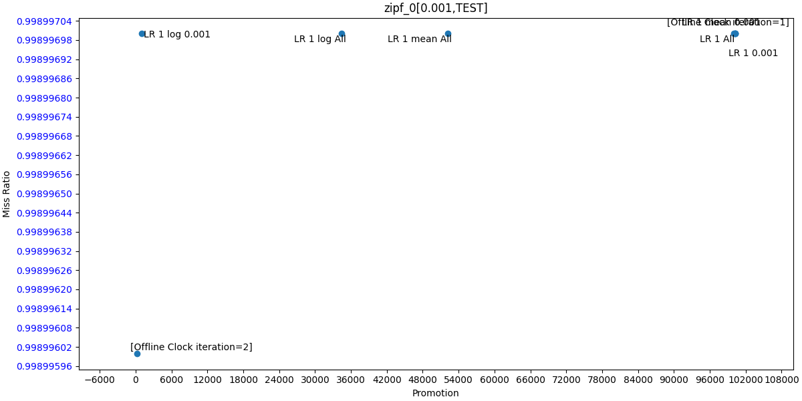  
> **Trace Path**: zipf_0.oracleGeneral  
> **Log Path**: [../result/log/zipf_0[0.001,TEST].csv](../result/log/zipf_0[0.001,TEST].csv)  
> **Desc**: ['0.001', 'TEST', {}]  
> **Cache Size**: 3  
> **Ignore Obj Size**: 0  
> **Total Request**: 100,000,000  
> **First Promotion**: 100,208  
> **Last Promotion**: 195  
> **Promotion Reduced**: 100,013  

>   
> **Trace Path**: zipf_0.oracleGeneral  
> **Log Path**: [../result/log/zipf_0[0.001,ignore_obj_size,TEST].csv](../result/log/zipf_0[0.001,ignore_obj_size,TEST].csv)  
> **Desc**: ['0.001', 'ignore_obj_size', 'TEST', {}]  
> **Cache Size**: 1000  
> **Ignore Obj Size**: 1  
> **Total Request**: 100,000,000  
> **First Promotion**: 100,208  
> **Last Promotion**: 195  
> **Promotion Reduced**: 100,013  

>   
> **Trace Path**: zipf_0.oracleGeneral  
> **Log Path**: [../result/log/zipf_0[0.01,TEST].csv](../result/log/zipf_0[0.01,TEST].csv)  
> **Desc**: ['0.01', 'TEST', {}]  
> **Cache Size**: 38  
> **Ignore Obj Size**: 0  
> **Total Request**: 100,000,000  
> **First Promotion**: 994,604  
> **Last Promotion**: 19,505  
> **Promotion Reduced**: 975,099  

>   
> **Trace Path**: zipf_0.oracleGeneral  
> **Log Path**: [../result/log/zipf_0[0.01,ignore_obj_size,TEST].csv](../result/log/zipf_0[0.01,ignore_obj_size,TEST].csv)  
> **Desc**: ['0.01', 'ignore_obj_size', 'TEST', {}]  
> **Cache Size**: 10000  
> **Ignore Obj Size**: 1  
> **Total Request**: 100,000,000  
> **First Promotion**: 994,604  
> **Last Promotion**: 19,505  
> **Promotion Reduced**: 975,099  

> 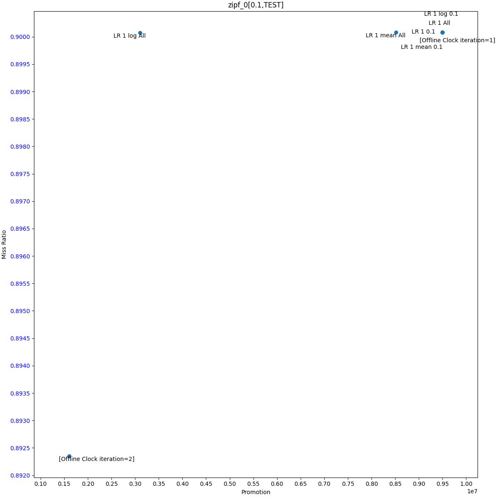  
> **Trace Path**: zipf_0.oracleGeneral  
> **Log Path**: [../result/log/zipf_0[0.1,TEST].csv](../result/log/zipf_0[0.1,TEST].csv)  
> **Desc**: ['0.1', 'TEST', {}]  
> **Cache Size**: 381  
> **Ignore Obj Size**: 0  
> **Total Request**: 100,000,000  
> **First Promotion**: 9,500,689  
> **Last Promotion**: 1,602,415  
> **Promotion Reduced**: 7,898,274  

>   
> **Trace Path**: zipf_0.oracleGeneral  
> **Log Path**: [../result/log/zipf_0[0.1,ignore_obj_size,TEST].csv](../result/log/zipf_0[0.1,ignore_obj_size,TEST].csv)  
> **Desc**: ['0.1', 'ignore_obj_size', 'TEST', {}]  
> **Cache Size**: 100001  
> **Ignore Obj Size**: 1  
> **Total Request**: 100,000,000  
> **First Promotion**: 9,500,689  
> **Last Promotion**: 1,602,415  
> **Promotion Reduced**: 7,898,274  

> 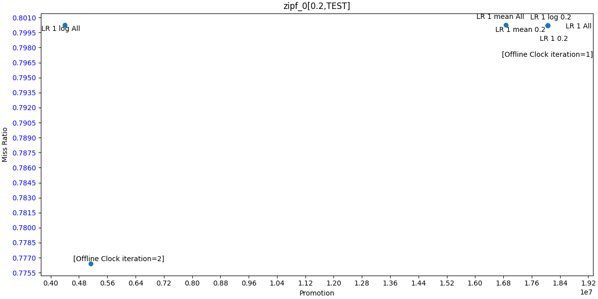  
> **Trace Path**: zipf_0.oracleGeneral  
> **Log Path**: [../result/log/zipf_0[0.2,TEST].csv](../result/log/zipf_0[0.2,TEST].csv)  
> **Desc**: ['0.2', 'TEST', {}]  
> **Cache Size**: 762  
> **Ignore Obj Size**: 0  
> **Total Request**: 100,000,000  
> **First Promotion**: 18,053,519  
> **Last Promotion**: 5,124,657  
> **Promotion Reduced**: 12,928,862  

>   
> **Trace Path**: zipf_0.oracleGeneral  
> **Log Path**: [../result/log/zipf_0[0.2,ignore_obj_size,TEST].csv](../result/log/zipf_0[0.2,ignore_obj_size,TEST].csv)  
> **Desc**: ['0.2', 'ignore_obj_size', 'TEST', {}]  
> **Cache Size**: 200002  
> **Ignore Obj Size**: 1  
> **Total Request**: 100,000,000  
> **First Promotion**: 18,053,519  
> **Last Promotion**: 5,124,657  
> **Promotion Reduced**: 12,928,862  

> 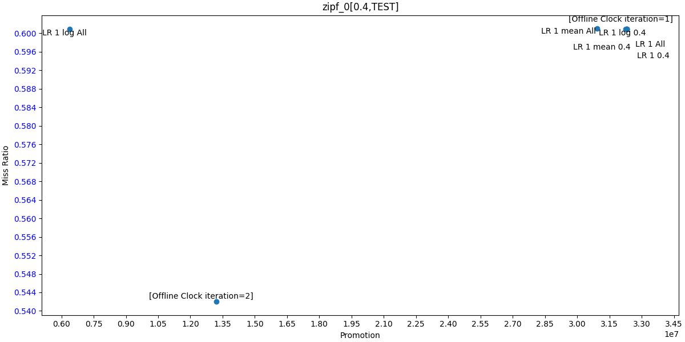  
> **Trace Path**: zipf_0.oracleGeneral  
> **Log Path**: [../result/log/zipf_0[0.4,TEST].csv](../result/log/zipf_0[0.4,TEST].csv)  
> **Desc**: ['0.4', 'TEST', {}]  
> **Cache Size**: 1525  
> **Ignore Obj Size**: 0  
> **Total Request**: 100,000,000  
> **First Promotion**: 32,320,909  
> **Last Promotion**: 13,200,252  
> **Promotion Reduced**: 19,120,657  

>   
> **Trace Path**: zipf_0.oracleGeneral  
> **Log Path**: [../result/log/zipf_0[0.4,ignore_obj_size,TEST].csv](../result/log/zipf_0[0.4,ignore_obj_size,TEST].csv)  
> **Desc**: ['0.4', 'ignore_obj_size', 'TEST', {}]  
> **Cache Size**: 400004  
> **Ignore Obj Size**: 1  
> **Total Request**: 100,000,000  
> **First Promotion**: 32,320,909  
> **Last Promotion**: 13,200,252  
> **Promotion Reduced**: 19,120,657  

## zipf_1.3 
> 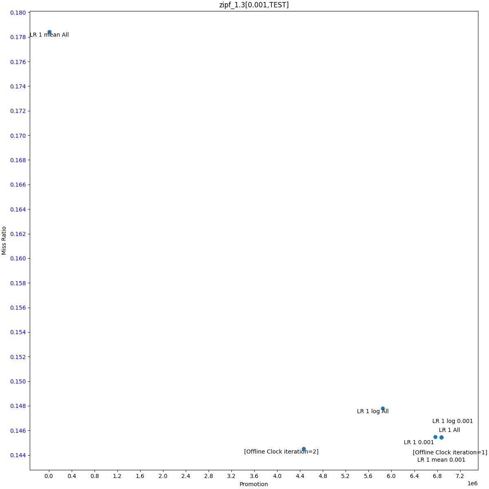  
> **Trace Path**: zipf_1.3.oracleGeneral  
> **Log Path**: [../result/log/zipf_1.3[0.001,TEST].csv](../result/log/zipf_1.3[0.001,TEST].csv)  
> **Desc**: ['0.001', 'TEST', {}]  
> **Cache Size**: 2  
> **Ignore Obj Size**: 0  
> **Total Request**: 100,000,000  
> **First Promotion**: 6,874,956  
> **Last Promotion**: 4,461,137  
> **Promotion Reduced**: 2,413,819  

>   
> **Trace Path**: zipf_1.3.oracleGeneral  
> **Log Path**: [../result/log/zipf_1.3[0.001,ignore_obj_size,TEST].csv](../result/log/zipf_1.3[0.001,ignore_obj_size,TEST].csv)  
> **Desc**: ['0.001', 'ignore_obj_size', 'TEST', {}]  
> **Cache Size**: 669  
> **Ignore Obj Size**: 1  
> **Total Request**: 100,000,000  
> **First Promotion**: 6,874,956  
> **Last Promotion**: 4,461,137  
> **Promotion Reduced**: 2,413,819  

> 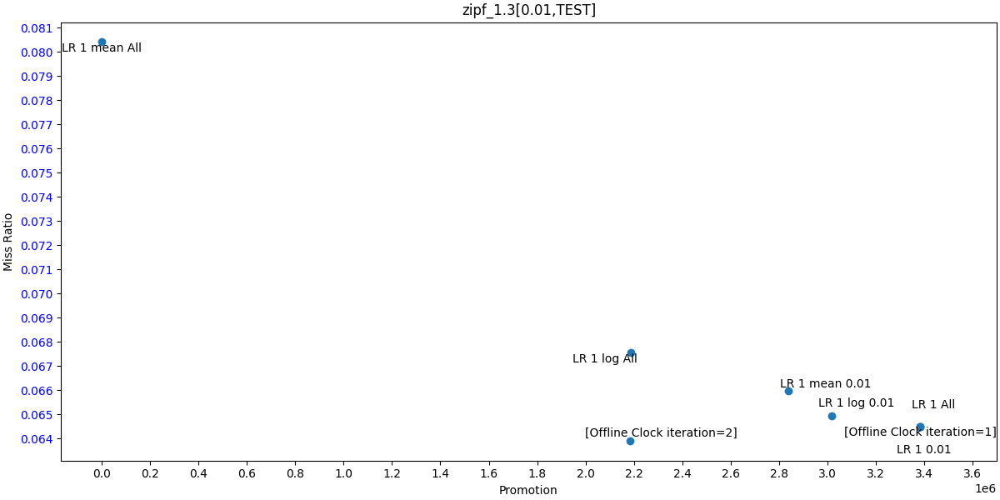  
> **Trace Path**: zipf_1.3.oracleGeneral  
> **Log Path**: [../result/log/zipf_1.3[0.01,TEST].csv](../result/log/zipf_1.3[0.01,TEST].csv)  
> **Desc**: ['0.01', 'TEST', {}]  
> **Cache Size**: 25  
> **Ignore Obj Size**: 0  
> **Total Request**: 100,000,000  
> **First Promotion**: 3,383,387  
> **Last Promotion**: 2,184,128  
> **Promotion Reduced**: 1,199,259  

>   
> **Trace Path**: zipf_1.3.oracleGeneral  
> **Log Path**: [../result/log/zipf_1.3[0.01,ignore_obj_size,TEST].csv](../result/log/zipf_1.3[0.01,ignore_obj_size,TEST].csv)  
> **Desc**: ['0.01', 'ignore_obj_size', 'TEST', {}]  
> **Cache Size**: 6695  
> **Ignore Obj Size**: 1  
> **Total Request**: 100,000,000  
> **First Promotion**: 3,383,387  
> **Last Promotion**: 2,184,128  
> **Promotion Reduced**: 1,199,259  

>   
> **Trace Path**: zipf_1.3.oracleGeneral  
> **Log Path**: [../result/log/zipf_1.3[0.1,TEST].csv](../result/log/zipf_1.3[0.1,TEST].csv)  
> **Desc**: ['0.1', 'TEST', {}]  
> **Cache Size**: 255  
> **Ignore Obj Size**: 0  
> **Total Request**: 100,000,000  
> **First Promotion**: 1,589,992  
> **Last Promotion**: 1,013,287  
> **Promotion Reduced**: 576,705  

>   
> **Trace Path**: zipf_1.3.oracleGeneral  
> **Log Path**: [../result/log/zipf_1.3[0.1,ignore_obj_size,TEST].csv](../result/log/zipf_1.3[0.1,ignore_obj_size,TEST].csv)  
> **Desc**: ['0.1', 'ignore_obj_size', 'TEST', {}]  
> **Cache Size**: 66952  
> **Ignore Obj Size**: 1  
> **Total Request**: 100,000,000  
> **First Promotion**: 1,589,992  
> **Last Promotion**: 1,013,287  
> **Promotion Reduced**: 576,705  

> 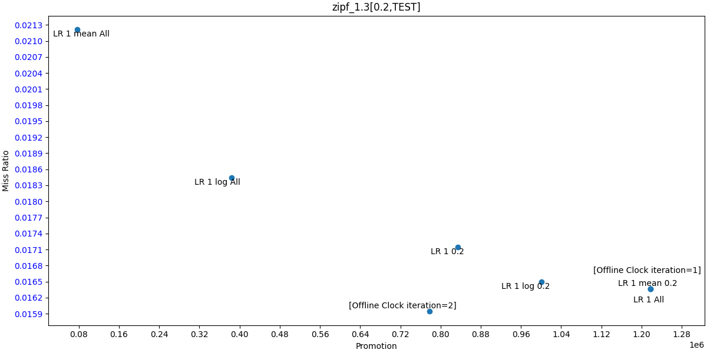  
> **Trace Path**: zipf_1.3.oracleGeneral  
> **Log Path**: [../result/log/zipf_1.3[0.2,TEST].csv](../result/log/zipf_1.3[0.2,TEST].csv)  
> **Desc**: ['0.2', 'TEST', {}]  
> **Cache Size**: 510  
> **Ignore Obj Size**: 0  
> **Total Request**: 100,000,000  
> **First Promotion**: 1,218,254  
> **Last Promotion**: 778,528  
> **Promotion Reduced**: 439,726  

>   
> **Trace Path**: zipf_1.3.oracleGeneral  
> **Log Path**: [../result/log/zipf_1.3[0.2,ignore_obj_size,TEST].csv](../result/log/zipf_1.3[0.2,ignore_obj_size,TEST].csv)  
> **Desc**: ['0.2', 'ignore_obj_size', 'TEST', {}]  
> **Cache Size**: 133905  
> **Ignore Obj Size**: 1  
> **Total Request**: 100,000,000  
> **First Promotion**: 1,218,254  
> **Last Promotion**: 778,528  
> **Promotion Reduced**: 439,726  

> 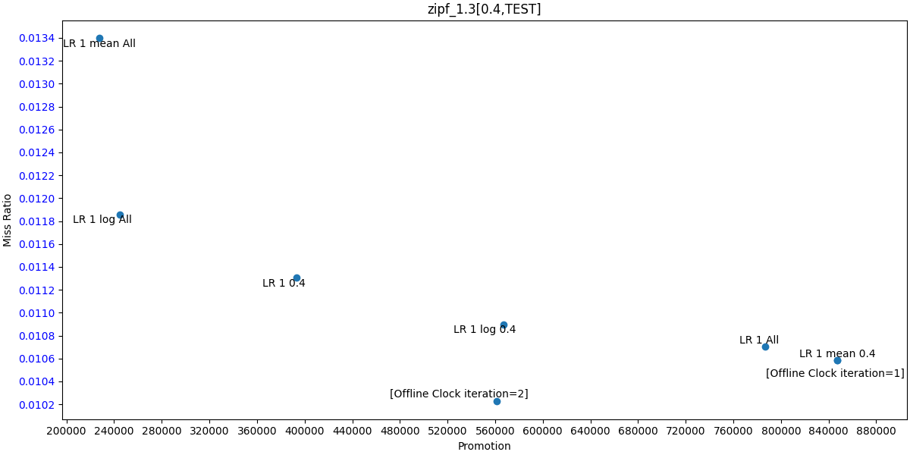  
> **Trace Path**: zipf_1.3.oracleGeneral  
> **Log Path**: [../result/log/zipf_1.3[0.4,TEST].csv](../result/log/zipf_1.3[0.4,TEST].csv)  
> **Desc**: ['0.4', 'TEST', {}]  
> **Cache Size**: 1021  
> **Ignore Obj Size**: 0  
> **Total Request**: 100,000,000  
> **First Promotion**: 847,461  
> **Last Promotion**: 561,330  
> **Promotion Reduced**: 286,131  

>   
> **Trace Path**: zipf_1.3.oracleGeneral  
> **Log Path**: [../result/log/zipf_1.3[0.4,ignore_obj_size,TEST].csv](../result/log/zipf_1.3[0.4,ignore_obj_size,TEST].csv)  
> **Desc**: ['0.4', 'ignore_obj_size', 'TEST', {}]  
> **Cache Size**: 267810  
> **Ignore Obj Size**: 1  
> **Total Request**: 100,000,000  
> **First Promotion**: 847,461  
> **Last Promotion**: 561,330  
> **Promotion Reduced**: 286,131  

## zipf_1.7 
> 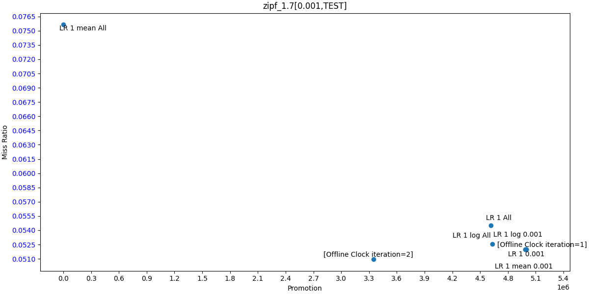  
> **Trace Path**: zipf_1.7.oracleGeneral  
> **Log Path**: [../result/log/zipf_1.7[0.001,TEST].csv](../result/log/zipf_1.7[0.001,TEST].csv)  
> **Desc**: ['0.001', 'TEST', {}]  
> **Cache Size**: 0  
> **Ignore Obj Size**: 0  
> **Total Request**: 100,000,000  
> **First Promotion**: 4,997,325  
> **Last Promotion**: 3,346,428  
> **Promotion Reduced**: 1,650,897  

>   
> **Trace Path**: zipf_1.7.oracleGeneral  
> **Log Path**: [../result/log/zipf_1.7[0.001,ignore_obj_size,TEST].csv](../result/log/zipf_1.7[0.001,ignore_obj_size,TEST].csv)  
> **Desc**: ['0.001', 'ignore_obj_size', 'TEST', {}]  
> **Cache Size**: 68  
> **Ignore Obj Size**: 1  
> **Total Request**: 100,000,000  
> **First Promotion**: 4,997,325  
> **Last Promotion**: 3,346,428  
> **Promotion Reduced**: 1,650,897  

> 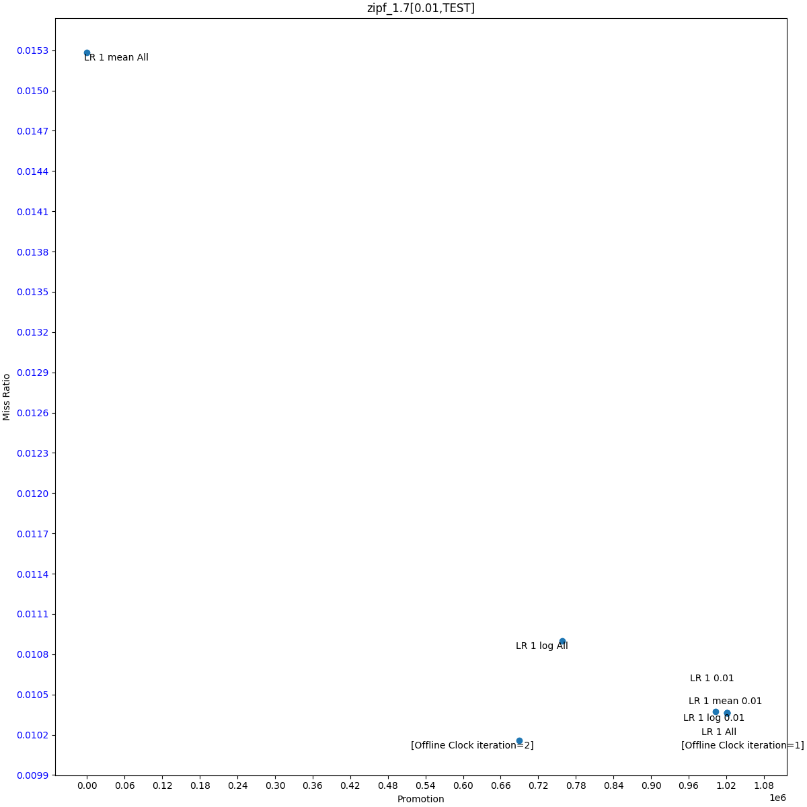  
> **Trace Path**: zipf_1.7.oracleGeneral  
> **Log Path**: [../result/log/zipf_1.7[0.01,TEST].csv](../result/log/zipf_1.7[0.01,TEST].csv)  
> **Desc**: ['0.01', 'TEST', {}]  
> **Cache Size**: 2  
> **Ignore Obj Size**: 0  
> **Total Request**: 100,000,000  
> **First Promotion**: 1,020,761  
> **Last Promotion**: 690,143  
> **Promotion Reduced**: 330,618  

>   
> **Trace Path**: zipf_1.7.oracleGeneral  
> **Log Path**: [../result/log/zipf_1.7[0.01,ignore_obj_size,TEST].csv](../result/log/zipf_1.7[0.01,ignore_obj_size,TEST].csv)  
> **Desc**: ['0.01', 'ignore_obj_size', 'TEST', {}]  
> **Cache Size**: 680  
> **Ignore Obj Size**: 1  
> **Total Request**: 100,000,000  
> **First Promotion**: 1,020,761  
> **Last Promotion**: 690,143  
> **Promotion Reduced**: 330,618  

> 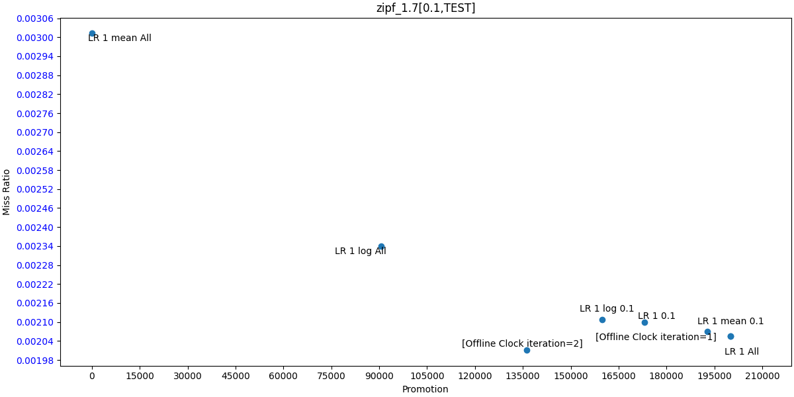  
> **Trace Path**: zipf_1.7.oracleGeneral  
> **Log Path**: [../result/log/zipf_1.7[0.1,TEST].csv](../result/log/zipf_1.7[0.1,TEST].csv)  
> **Desc**: ['0.1', 'TEST', {}]  
> **Cache Size**: 25  
> **Ignore Obj Size**: 0  
> **Total Request**: 100,000,000  
> **First Promotion**: 200,132  
> **Last Promotion**: 136,246  
> **Promotion Reduced**: 63,886  

>   
> **Trace Path**: zipf_1.7.oracleGeneral  
> **Log Path**: [../result/log/zipf_1.7[0.1,ignore_obj_size,TEST].csv](../result/log/zipf_1.7[0.1,ignore_obj_size,TEST].csv)  
> **Desc**: ['0.1', 'ignore_obj_size', 'TEST', {}]  
> **Cache Size**: 6807  
> **Ignore Obj Size**: 1  
> **Total Request**: 100,000,000  
> **First Promotion**: 200,132  
> **Last Promotion**: 136,246  
> **Promotion Reduced**: 63,886  

> 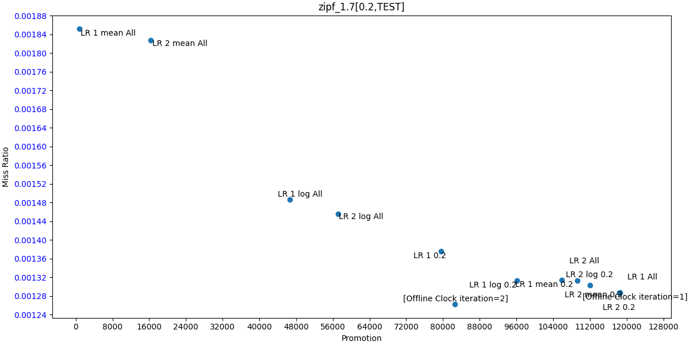  
> **Trace Path**: zipf_1.7.oracleGeneral  
> **Log Path**: [../result/log/zipf_1.7[0.2,TEST].csv](../result/log/zipf_1.7[0.2,TEST].csv)  
> **Desc**: ['0.2', 'TEST', {}]  
> **Cache Size**: 51  
> **Ignore Obj Size**: 0  
> **Total Request**: 100,000,000  
> **First Promotion**: 118,484  
> **Last Promotion**: 82,651  
> **Promotion Reduced**: 35,833  

>   
> **Trace Path**: zipf_1.7.oracleGeneral  
> **Log Path**: [../result/log/zipf_1.7[0.2,ignore_obj_size,TEST].csv](../result/log/zipf_1.7[0.2,ignore_obj_size,TEST].csv)  
> **Desc**: ['0.2', 'ignore_obj_size', 'TEST', {}]  
> **Cache Size**: 13615  
> **Ignore Obj Size**: 1  
> **Total Request**: 100,000,000  
> **First Promotion**: 118,484  
> **Last Promotion**: 82,651  
> **Promotion Reduced**: 35,833  

> 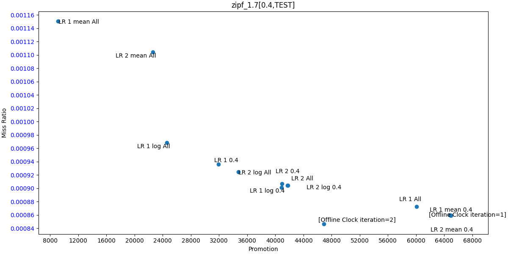  
> **Trace Path**: zipf_1.7.oracleGeneral  
> **Log Path**: [../result/log/zipf_1.7[0.4,TEST].csv](../result/log/zipf_1.7[0.4,TEST].csv)  
> **Desc**: ['0.4', 'TEST', {}]  
> **Cache Size**: 103  
> **Ignore Obj Size**: 0  
> **Total Request**: 100,000,000  
> **First Promotion**: 64,943  
> **Last Promotion**: 46,900  
> **Promotion Reduced**: 18,043  

>   
> **Trace Path**: zipf_1.7.oracleGeneral  
> **Log Path**: [../result/log/zipf_1.7[0.4,ignore_obj_size,TEST].csv](../result/log/zipf_1.7[0.4,ignore_obj_size,TEST].csv)  
> **Desc**: ['0.4', 'ignore_obj_size', 'TEST', {}]  
> **Cache Size**: 27231  
> **Ignore Obj Size**: 1  
> **Total Request**: 100,000,000  
> **First Promotion**: 64,943  
> **Last Promotion**: 46,900  
> **Promotion Reduced**: 18,043  

## zipf_1 
> 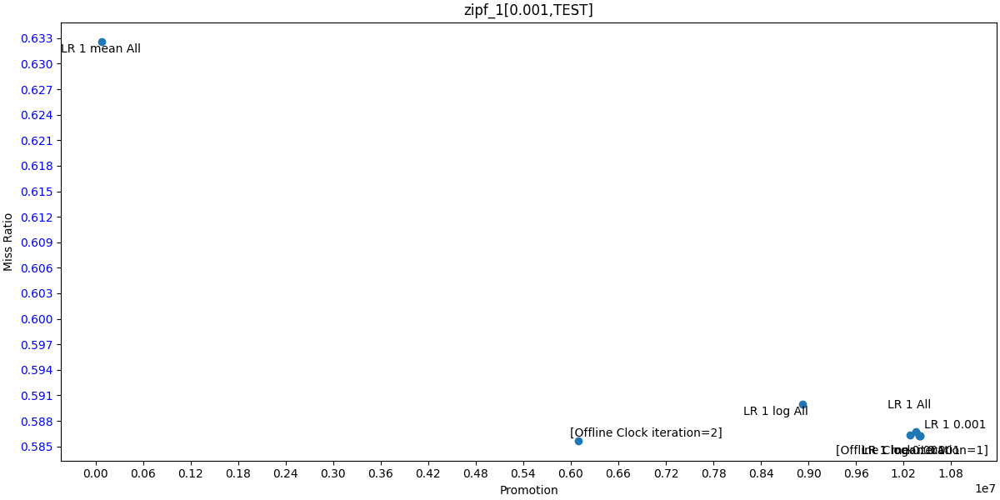  
> **Trace Path**: zipf_1.oracleGeneral  
> **Log Path**: [../result/log/zipf_1[0.001,TEST].csv](../result/log/zipf_1[0.001,TEST].csv)  
> **Desc**: ['0.001', 'TEST', {}]  
> **Cache Size**: 3  
> **Ignore Obj Size**: 0  
> **Total Request**: 100,000,000  
> **First Promotion**: 10,413,036  
> **Last Promotion**: 6,091,845  
> **Promotion Reduced**: 4,321,191  

>   
> **Trace Path**: zipf_1.oracleGeneral  
> **Log Path**: [../result/log/zipf_1[0.001,ignore_obj_size,TEST].csv](../result/log/zipf_1[0.001,ignore_obj_size,TEST].csv)  
> **Desc**: ['0.001', 'ignore_obj_size', 'TEST', {}]  
> **Cache Size**: 999  
> **Ignore Obj Size**: 1  
> **Total Request**: 100,000,000  
> **First Promotion**: 10,413,036  
> **Last Promotion**: 6,091,845  
> **Promotion Reduced**: 4,321,191  

> 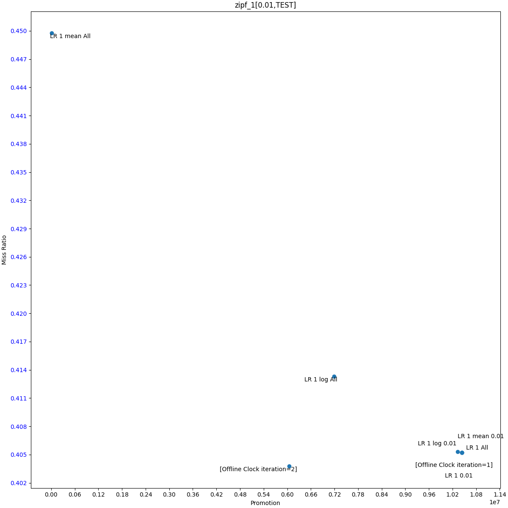  
> **Trace Path**: zipf_1.oracleGeneral  
> **Log Path**: [../result/log/zipf_1[0.01,TEST].csv](../result/log/zipf_1[0.01,TEST].csv)  
> **Desc**: ['0.01', 'TEST', {}]  
> **Cache Size**: 38  
> **Ignore Obj Size**: 0  
> **Total Request**: 100,000,000  
> **First Promotion**: 10,441,137  
> **Last Promotion**: 6,047,997  
> **Promotion Reduced**: 4,393,140  

>   
> **Trace Path**: zipf_1.oracleGeneral  
> **Log Path**: [../result/log/zipf_1[0.01,ignore_obj_size,TEST].csv](../result/log/zipf_1[0.01,ignore_obj_size,TEST].csv)  
> **Desc**: ['0.01', 'ignore_obj_size', 'TEST', {}]  
> **Cache Size**: 9999  
> **Ignore Obj Size**: 1  
> **Total Request**: 100,000,000  
> **First Promotion**: 10,441,137  
> **Last Promotion**: 6,047,997  
> **Promotion Reduced**: 4,393,140  

> 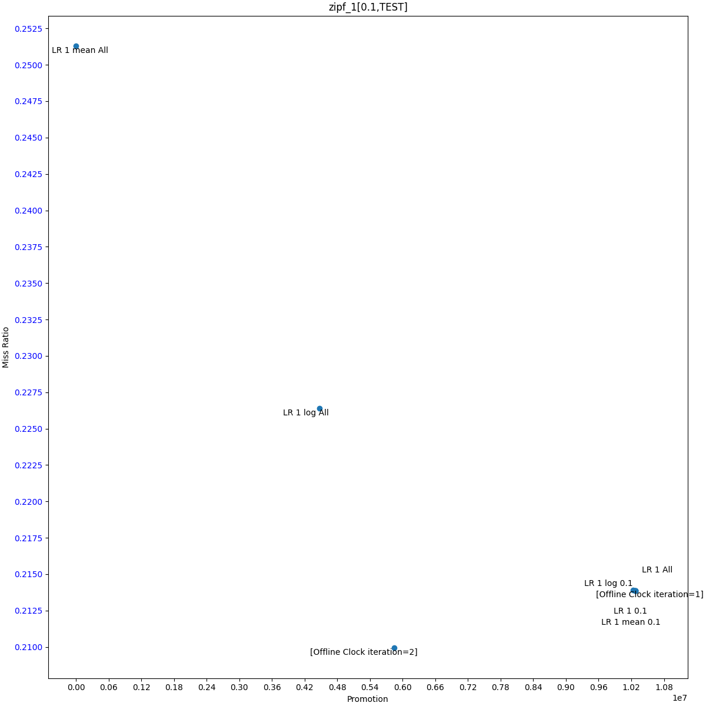  
> **Trace Path**: zipf_1.oracleGeneral  
> **Log Path**: [../result/log/zipf_1[0.1,TEST].csv](../result/log/zipf_1[0.1,TEST].csv)  
> **Desc**: ['0.1', 'TEST', {}]  
> **Cache Size**: 381  
> **Ignore Obj Size**: 0  
> **Total Request**: 100,000,000  
> **First Promotion**: 10,270,964  
> **Last Promotion**: 5,848,956  
> **Promotion Reduced**: 4,422,008  

>   
> **Trace Path**: zipf_1.oracleGeneral  
> **Log Path**: [../result/log/zipf_1[0.1,ignore_obj_size,TEST].csv](../result/log/zipf_1[0.1,ignore_obj_size,TEST].csv)  
> **Desc**: ['0.1', 'ignore_obj_size', 'TEST', {}]  
> **Cache Size**: 99994  
> **Ignore Obj Size**: 1  
> **Total Request**: 100,000,000  
> **First Promotion**: 10,270,964  
> **Last Promotion**: 5,848,956  
> **Promotion Reduced**: 4,422,008  

> 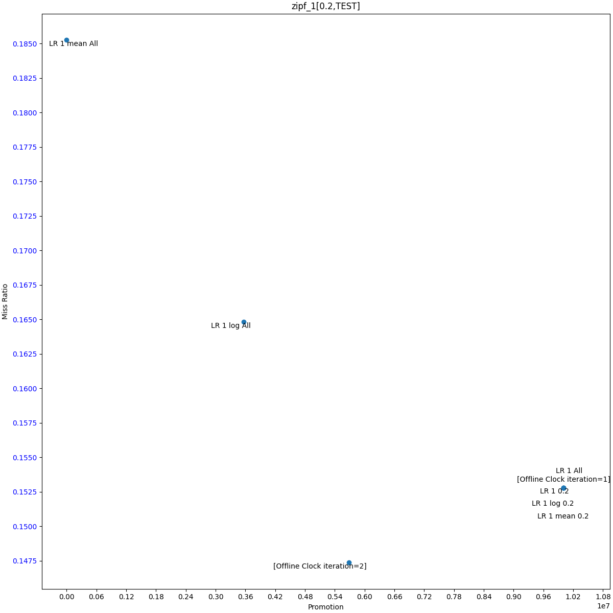  
> **Trace Path**: zipf_1.oracleGeneral  
> **Log Path**: [../result/log/zipf_1[0.2,TEST].csv](../result/log/zipf_1[0.2,TEST].csv)  
> **Desc**: ['0.2', 'TEST', {}]  
> **Cache Size**: 762  
> **Ignore Obj Size**: 0  
> **Total Request**: 100,000,000  
> **First Promotion**: 10,005,116  
> **Last Promotion**: 5,679,168  
> **Promotion Reduced**: 4,325,948  

>   
> **Trace Path**: zipf_1.oracleGeneral  
> **Log Path**: [../result/log/zipf_1[0.2,ignore_obj_size,TEST].csv](../result/log/zipf_1[0.2,ignore_obj_size,TEST].csv)  
> **Desc**: ['0.2', 'ignore_obj_size', 'TEST', {}]  
> **Cache Size**: 199988  
> **Ignore Obj Size**: 1  
> **Total Request**: 100,000,000  
> **First Promotion**: 10,005,116  
> **Last Promotion**: 5,679,168  
> **Promotion Reduced**: 4,325,948  

> 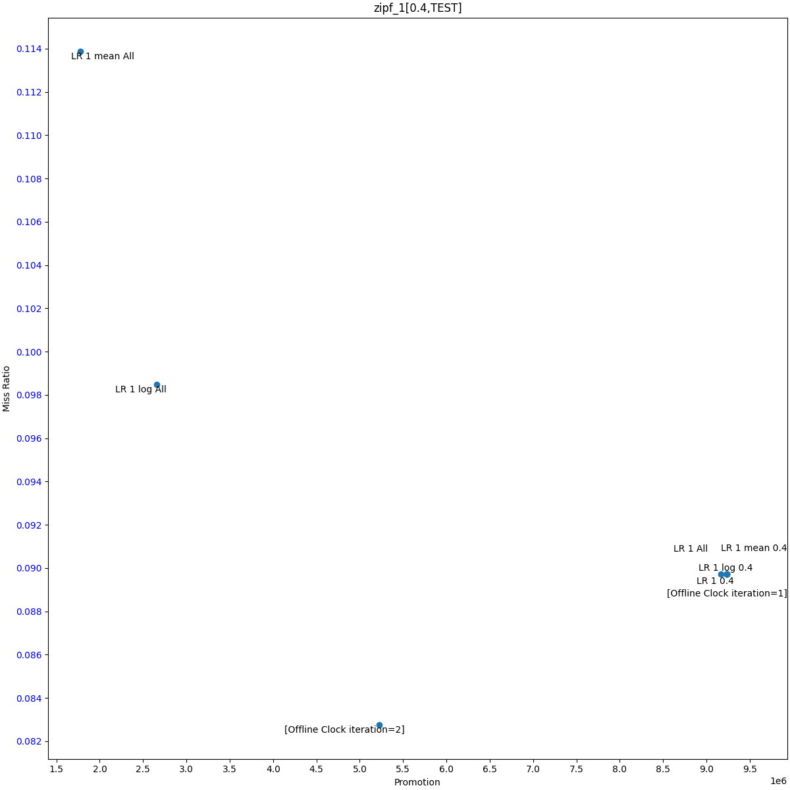  
> **Trace Path**: zipf_1.oracleGeneral  
> **Log Path**: [../result/log/zipf_1[0.4,TEST].csv](../result/log/zipf_1[0.4,TEST].csv)  
> **Desc**: ['0.4', 'TEST', {}]  
> **Cache Size**: 1525  
> **Ignore Obj Size**: 0  
> **Total Request**: 100,000,000  
> **First Promotion**: 9,238,436  
> **Last Promotion**: 5,224,224  
> **Promotion Reduced**: 4,014,212  

>   
> **Trace Path**: zipf_1.oracleGeneral  
> **Log Path**: [../result/log/zipf_1[0.4,ignore_obj_size,TEST].csv](../result/log/zipf_1[0.4,ignore_obj_size,TEST].csv)  
> **Desc**: ['0.4', 'ignore_obj_size', 'TEST', {}]  
> **Cache Size**: 399977  
> **Ignore Obj Size**: 1  
> **Total Request**: 100,000,000  
> **First Promotion**: 9,238,436  
> **Last Promotion**: 5,224,224  
> **Promotion Reduced**: 4,014,212  

## zipf_2 
> 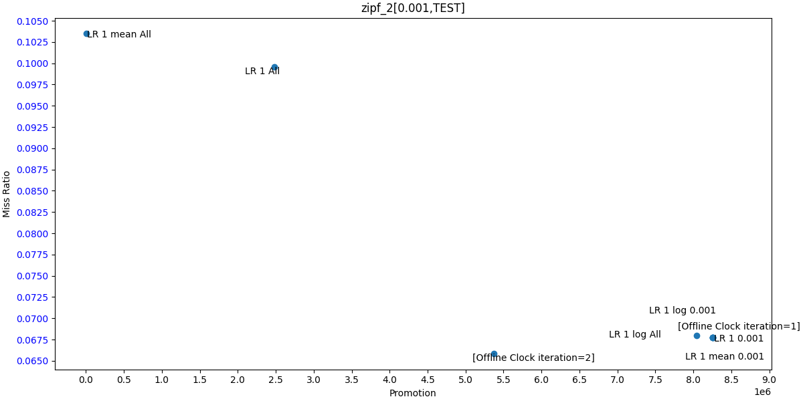  
> **Trace Path**: zipf_2.oracleGeneral  
> **Log Path**: [../result/log/zipf_2[0.001,TEST].csv](../result/log/zipf_2[0.001,TEST].csv)  
> **Desc**: ['0.001', 'TEST', {}]  
> **Cache Size**: 0  
> **Ignore Obj Size**: 0  
> **Total Request**: 100,000,000  
> **First Promotion**: 8,254,967  
> **Last Promotion**: 5,375,095  
> **Promotion Reduced**: 2,879,872  

>   
> **Trace Path**: zipf_2.oracleGeneral  
> **Log Path**: [../result/log/zipf_2[0.001,ignore_obj_size,TEST].csv](../result/log/zipf_2[0.001,ignore_obj_size,TEST].csv)  
> **Desc**: ['0.001', 'ignore_obj_size', 'TEST', {}]  
> **Cache Size**: 13  
> **Ignore Obj Size**: 1  
> **Total Request**: 100,000,000  
> **First Promotion**: 8,254,967  
> **Last Promotion**: 5,375,095  
> **Promotion Reduced**: 2,879,872  

> 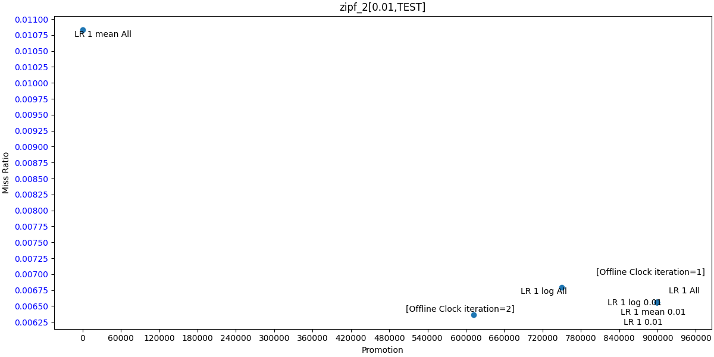  
> **Trace Path**: zipf_2.oracleGeneral  
> **Log Path**: [../result/log/zipf_2[0.01,TEST].csv](../result/log/zipf_2[0.01,TEST].csv)  
> **Desc**: ['0.01', 'TEST', {}]  
> **Cache Size**: 0  
> **Ignore Obj Size**: 0  
> **Total Request**: 100,000,000  
> **First Promotion**: 899,380  
> **Last Promotion**: 611,982  
> **Promotion Reduced**: 287,398  

>   
> **Trace Path**: zipf_2.oracleGeneral  
> **Log Path**: [../result/log/zipf_2[0.01,ignore_obj_size,TEST].csv](../result/log/zipf_2[0.01,ignore_obj_size,TEST].csv)  
> **Desc**: ['0.01', 'ignore_obj_size', 'TEST', {}]  
> **Cache Size**: 137  
> **Ignore Obj Size**: 1  
> **Total Request**: 100,000,000  
> **First Promotion**: 899,380  
> **Last Promotion**: 611,982  
> **Promotion Reduced**: 287,398  

> 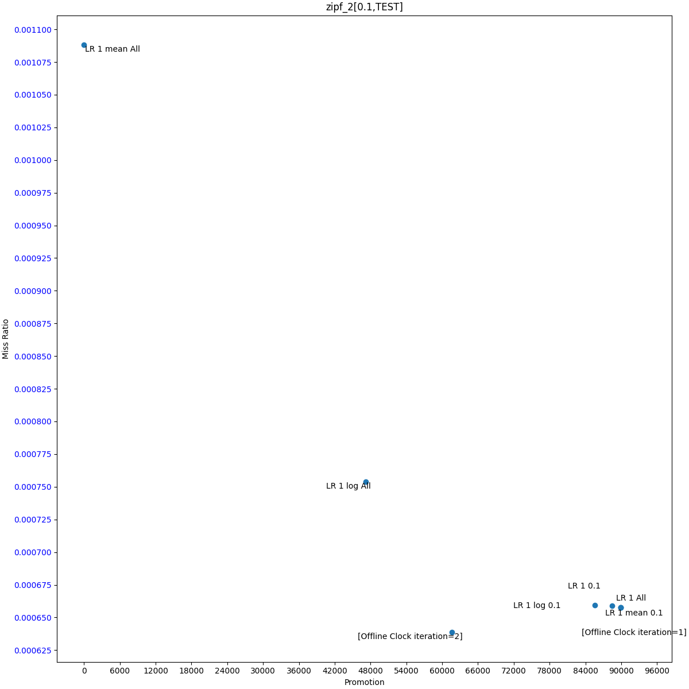  
> **Trace Path**: zipf_2.oracleGeneral  
> **Log Path**: [../result/log/zipf_2[0.1,TEST].csv](../result/log/zipf_2[0.1,TEST].csv)  
> **Desc**: ['0.1', 'TEST', {}]  
> **Cache Size**: 5  
> **Ignore Obj Size**: 0  
> **Total Request**: 100,000,000  
> **First Promotion**: 89,877  
> **Last Promotion**: 61,585  
> **Promotion Reduced**: 28,292  

>   
> **Trace Path**: zipf_2.oracleGeneral  
> **Log Path**: [../result/log/zipf_2[0.1,ignore_obj_size,TEST].csv](../result/log/zipf_2[0.1,ignore_obj_size,TEST].csv)  
> **Desc**: ['0.1', 'ignore_obj_size', 'TEST', {}]  
> **Cache Size**: 1379  
> **Ignore Obj Size**: 1  
> **Total Request**: 100,000,000  
> **First Promotion**: 89,877  
> **Last Promotion**: 61,585  
> **Promotion Reduced**: 28,292  

> 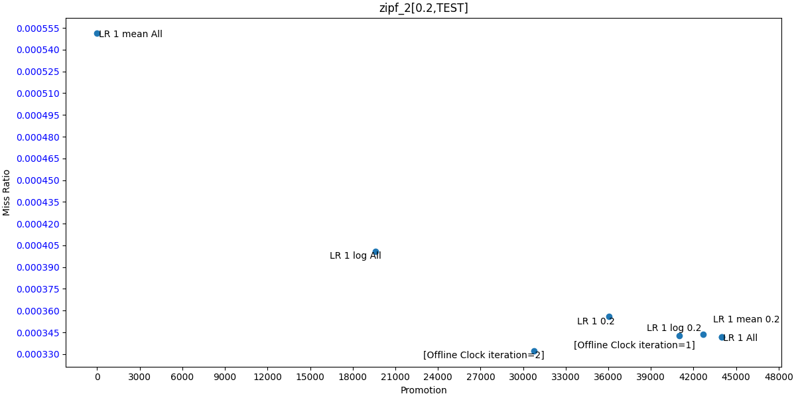  
> **Trace Path**: zipf_2.oracleGeneral  
> **Log Path**: [../result/log/zipf_2[0.2,TEST].csv](../result/log/zipf_2[0.2,TEST].csv)  
> **Desc**: ['0.2', 'TEST', {}]  
> **Cache Size**: 10  
> **Ignore Obj Size**: 0  
> **Total Request**: 100,000,000  
> **First Promotion**: 44,002  
> **Last Promotion**: 30,770  
> **Promotion Reduced**: 13,232  

>   
> **Trace Path**: zipf_2.oracleGeneral  
> **Log Path**: [../result/log/zipf_2[0.2,ignore_obj_size,TEST].csv](../result/log/zipf_2[0.2,ignore_obj_size,TEST].csv)  
> **Desc**: ['0.2', 'ignore_obj_size', 'TEST', {}]  
> **Cache Size**: 2758  
> **Ignore Obj Size**: 1  
> **Total Request**: 100,000,000  
> **First Promotion**: 44,002  
> **Last Promotion**: 30,770  
> **Promotion Reduced**: 13,232  

> 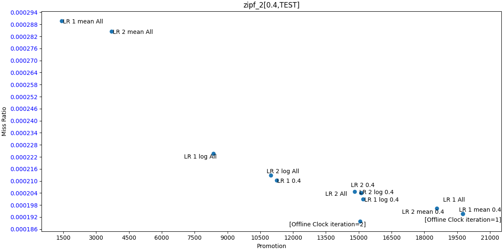  
> **Trace Path**: zipf_2.oracleGeneral  
> **Log Path**: [../result/log/zipf_2[0.4,TEST].csv](../result/log/zipf_2[0.4,TEST].csv)  
> **Desc**: ['0.4', 'TEST', {}]  
> **Cache Size**: 21  
> **Ignore Obj Size**: 0  
> **Total Request**: 100,000,000  
> **First Promotion**: 19,761  
> **Last Promotion**: 15,064  
> **Promotion Reduced**: 4,697  

>   
> **Trace Path**: zipf_2.oracleGeneral  
> **Log Path**: [../result/log/zipf_2[0.4,ignore_obj_size,TEST].csv](../result/log/zipf_2[0.4,ignore_obj_size,TEST].csv)  
> **Desc**: ['0.4', 'ignore_obj_size', 'TEST', {}]  
> **Cache Size**: 5517  
> **Ignore Obj Size**: 1  
> **Total Request**: 100,000,000  
> **First Promotion**: 19,761  
> **Last Promotion**: 15,064  
> **Promotion Reduced**: 4,697  

