# Test Data Result Obj Size Ignored  
# Result  
# Model Summaries  
| Model                       |   Best Models on Exp. |   Better than base % of the times |
|-----------------------------|-----------------------|-----------------------------------|
| LR_1_spec                   |                    19 |                          14.2857  |
| LR_1_All                    |                    29 |                           5.71429 |
| LR_1_log_spec               |                    11 |                          15.7143  |
| LR_1_log_All                |                     1 |                           7.14286 |
| LR_1_mean_spec              |                    11 |                          14.2857  |
| LR_1_mean_All               |                     7 |                          10       |
| LR_2_spec                   |                    21 |                           8.57143 |
| LR_2_All                    |                    25 |                           7.24638 |
| LR_2_log_spec               |                    13 |                           2.85714 |
| LR_2_log_All                |                     3 |                           4.28571 |
| LR_2_mean_spec              |                    13 |                           4.28571 |
| LR_2_mean_All               |                     3 |                           5.71429 |
| LR_v5_spec                  |                     4 |                           5.71429 |
| LR_v5_All                   |                     1 |                           5.71429 |
| LR_v6_spec                  |                     1 |                           5.71429 |
| LR_v6_All                   |                     1 |                           5.71429 |
| little_random_forest_spec   |                     0 |                           8.57143 |
| logistic_regression_spec    |                     2 |                          14.2857  |
| logistic_regression_All     |                     4 |                          11.4286  |
| logistic_regression_v2_spec |                     6 |                          11.4286  |
| logistic_regression_v2_All  |                    10 |                           5.71429 |
| logistic_regression_v3_spec |                     0 |                           8.57143 |
| logistic_regression_v3_All  |                     0 |                           2.85714 |
| logistic_regression_v4_spec |                     3 |                           5.71429 |
| logistic_regression_v4_All  |                     0 |                          11.4286  |  

## Promotion Reduced (%)  
$\dfrac{Base Promotion - Model Promotion}{Base Promotion} \times 100$  
| Model                       |      Max |           Min |      Avg |      Mdn |
|-----------------------------|----------|---------------|----------|----------|
| LR_1_spec                   |  92.0446 |   0           |  32.7461 |  10.5128 |
| LR_1_All                    |  91.9917 |  -1.06327     |  14.4885 |   0      |
| LR_1_log_spec               | 100      |  -1.12488     |  32.8915 |  15.5722 |
| LR_1_log_All                |  90.6117 |   3.97207     |  48.3129 |  52.9563 |
| LR_1_mean_spec              |  97.3788 |  -1.12488     |  36.6896 |  11.0929 |
| LR_1_mean_All               |  99.9988 |  -0.872275    |  58.8501 |  81.6335 |
| LR_2_spec                   |  90.931  |   0           |  27.1572 |   0      |
| LR_2_All                    |  88.8918 |  -1.08096     |  16.0244 |   0      |
| LR_2_log_spec               |  95.7198 |   0           |  34.0425 |  12.8883 |
| LR_2_log_All                |  84.3947 |   5.1315      |  53.7967 |  59.2451 |
| LR_2_mean_spec              |  97.8264 |   0           |  37.0855 |  12.0563 |
| LR_2_mean_All               |  99.9956 |   0.804119    |  61.8432 |  79.2326 |
| LR_v5_spec                  | 100      |   6.78421e-06 |  80.0002 | 100      |
| LR_v5_All                   | 100      | 100           | 100      | 100      |
| LR_v6_spec                  | 100      |  97.7969      |  99.9305 |  99.9999 |
| LR_v6_All                   | 100      |  97.7968      |  99.9304 |  99.9999 |
| little_random_forest_spec   |  98.4318 |  15.6201      |  65.9544 |  74.0006 |
| logistic_regression_spec    | 100      |   0           |  73.5277 |  86.7793 |
| logistic_regression_All     |  99.9965 |   0           |  59.1499 |  68.9119 |
| logistic_regression_v2_spec | 100      |   0           |  42.788  |  25.96   |
| logistic_regression_v2_All  |  99.8691 |  -6.6907e-06  |  46.267  |  50.0287 |
| logistic_regression_v3_spec |  99.9781 |   0           |  75.9921 |  85.43   |
| logistic_regression_v3_All  |  99.2417 |  39.3788      |  90.4969 |  94.528  |
| logistic_regression_v4_spec |  94.894  |   0           |  57.4264 |  68.9322 |
| logistic_regression_v4_All  |  93.5123 |  14.7999      |  66.0359 |  73.8614 |  

## Miss Ratio Reduced (%)  
$\dfrac{Base Miss Ratio - Model Miss Ratio}{Base Miss Ratio} \times 100$  
| Model                       |        Max |       Min |       Avg |         Mdn |
|-----------------------------|------------|-----------|-----------|-------------|
| LR_1_spec                   | 0.814411   |  -28.9246 |  -3.41595 |  -0.0103247 |
| LR_1_All                    | 1.73908    |  -31.2671 |  -2.07613 |   0         |
| LR_1_log_spec               | 1.67397    |  -27.121  |  -2.47744 |  -0.0347169 |
| LR_1_log_All                | 2.90327    |  -17.9166 |  -4.0107  |  -1.77686   |
| LR_1_mean_spec              | 0.370884   |  -34.2553 |  -5.0524  |  -0.798484  |
| LR_1_mean_All               | 0.411127   | -101.391  | -15.6041  |  -4.35833   |
| LR_2_spec                   | 3.27644    |  -27.2999 |  -2.68145 |   0         |
| LR_2_All                    | 3.9955     |  -27.1992 |  -2.05873 |   0         |
| LR_2_log_spec               | 0.522617   |  -29.7012 |  -3.66113 |  -0.350655  |
| LR_2_log_All                | 1.37734    |  -27.8001 |  -6.96888 |  -5.78625   |
| LR_2_mean_spec              | 0.420901   |  -34.7739 |  -4.98049 |  -0.476007  |
| LR_2_mean_All               | 0.0194047  |  -90.674  | -15.7937  |  -6.73837   |
| LR_v5_spec                  | 0.179718   |  -67.5507 | -15.5198  | -12.0956    |
| LR_v5_All                   | 0.179718   |  -67.5507 | -16.3988  | -12.0958    |
| LR_v6_spec                  | 0.179718   |  -67.5507 | -16.3965  | -12.0956    |
| LR_v6_All                   | 0.179718   |  -67.5507 | -16.3965  | -12.0956    |
| little_random_forest_spec   | 0.787593   |  -15.0014 |  -3.60195 |  -1.97334   |
| logistic_regression_spec    | 7.43423    |  -27.1145 |  -6.21537 |  -2.83513   |
| logistic_regression_All     | 4.96142    |  -57.0391 | -10.3355  |  -1.54011   |
| logistic_regression_v2_spec | 3.23472    |  -16.5131 |  -2.03106 |  -0.674374  |
| logistic_regression_v2_All  | 0.955959   |  -50.9477 |  -5.64218 |   0         |
| logistic_regression_v3_spec | 2.74147    |  -24.9863 |  -6.43694 |  -2.76207   |
| logistic_regression_v3_All  | 0.00140759 |  -44.6993 | -12.9765  |  -9.23276   |
| logistic_regression_v4_spec | 2.95571    |  -25.7473 |  -5.19023 |  -2.38206   |
| logistic_regression_v4_All  | 0.666145   |  -24.4697 |  -5.60997 |  -2.23389   |  

# Model Summaries Plot  
## Miss Ratio Reduced (%) 
$\dfrac{Base Miss Ratio - Model Miss Ratio}{Base Miss Ratio} \times 100$  

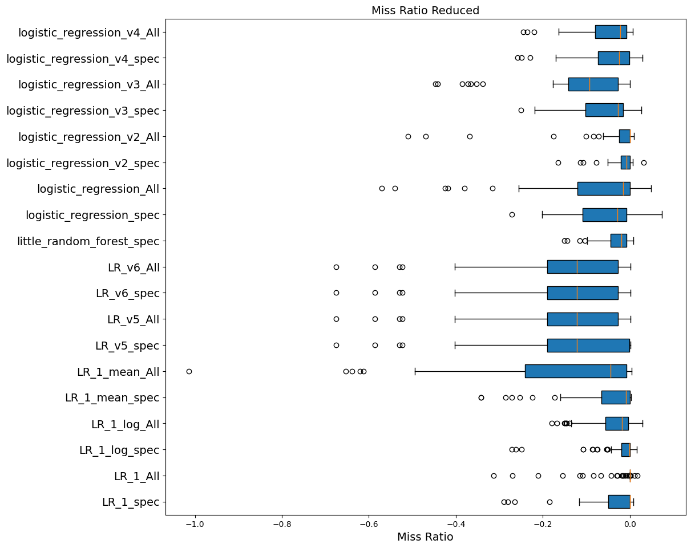  
## Promotion Reduced (%) 
$\dfrac{Base Promotion - Model Promotion}{Base Promotion} \times 100$  

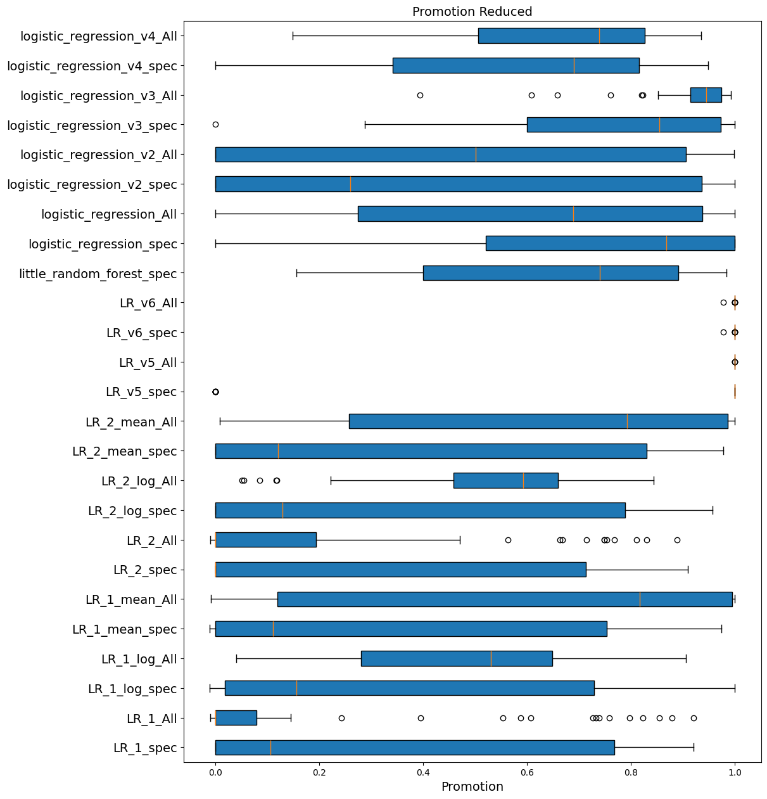  
## True Negatives(%) 
  
## True Postives(%) 
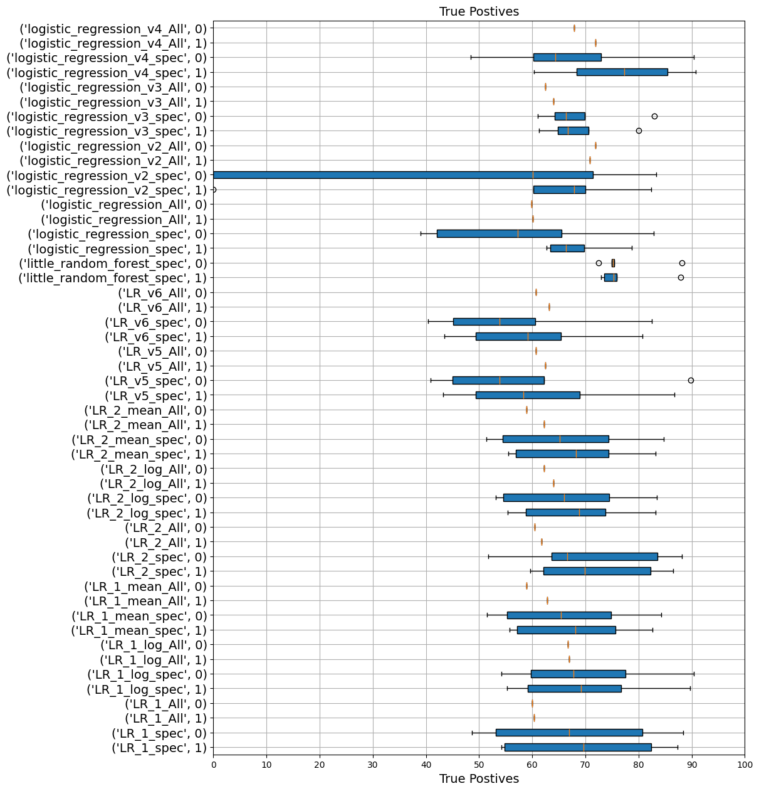  
## False Negatives(%) 
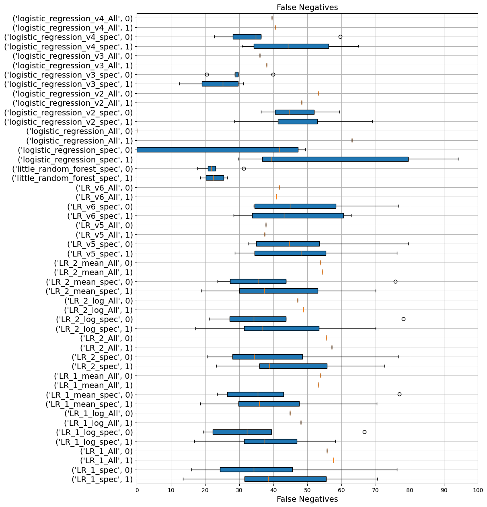  
## False Postives(%) 
  
# Individual Workload Result  
## 10  
 https://ftp.pdl.cmu.edu/pub/datasets/twemcacheWorkload/cacheDatasets/twitter/cluster10.oracleGeneral.zst
> 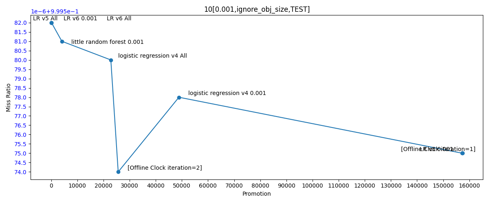  
> **Trace Path**: 10.oracleGeneral.zst  
> **Desc**: ['0.001', 'ignore_obj_size', 'TEST', {}]  
> **Cache Size**: 7360  
> **Total Request**: 2,756,726,994  
> **Best Model**: LR_1_All,LR_2_spec,LR_2_All,LR_v5_spec => 0.999575  
> **Better Than Base**: False  
>   
> **Trace Path**: 10.oracleGeneral.zst  
> **Desc**: ['0.01', 'ignore_obj_size', 'TEST', {}]  
> **Cache Size**: 73601  
> **Total Request**: 2,756,726,994  
> **Best Model**: LR_1_mean_All => 0.994365  
> **Better Than Base**: True  
> 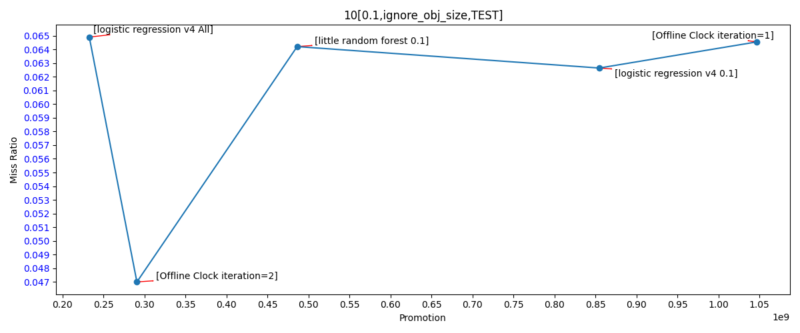  
> **Trace Path**: 10.oracleGeneral.zst  
> **Desc**: ['0.1', 'ignore_obj_size', 'TEST', {}]  
> **Cache Size**: 736017  
> **Total Request**: 2,756,726,994  
> **Best Model**: logistic_regression_v4_spec => 0.062645  
> **Better Than Base**: True  
> 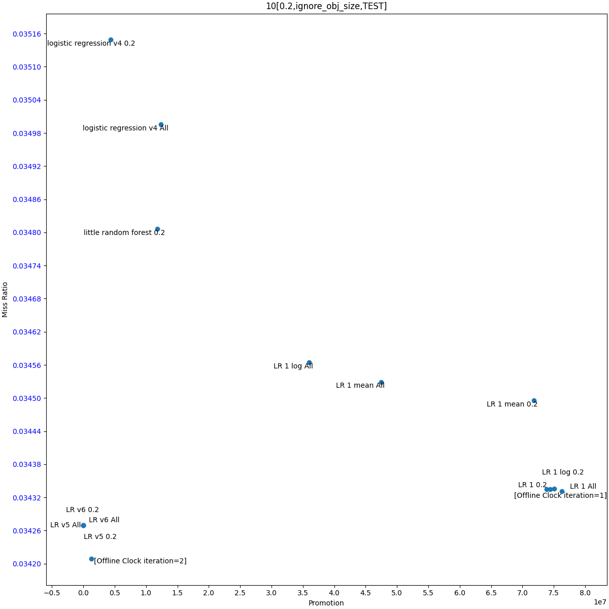  
> **Trace Path**: 10.oracleGeneral.zst  
> **Desc**: ['0.2', 'ignore_obj_size', 'TEST', {}]  
> **Cache Size**: 1472034  
> **Total Request**: 2,756,726,994  
> **Best Model**: LR_v5_spec,LR_v5_All,LR_v6_spec,LR_v6_All => 0.0342699  
> **Better Than Base**: True  
> 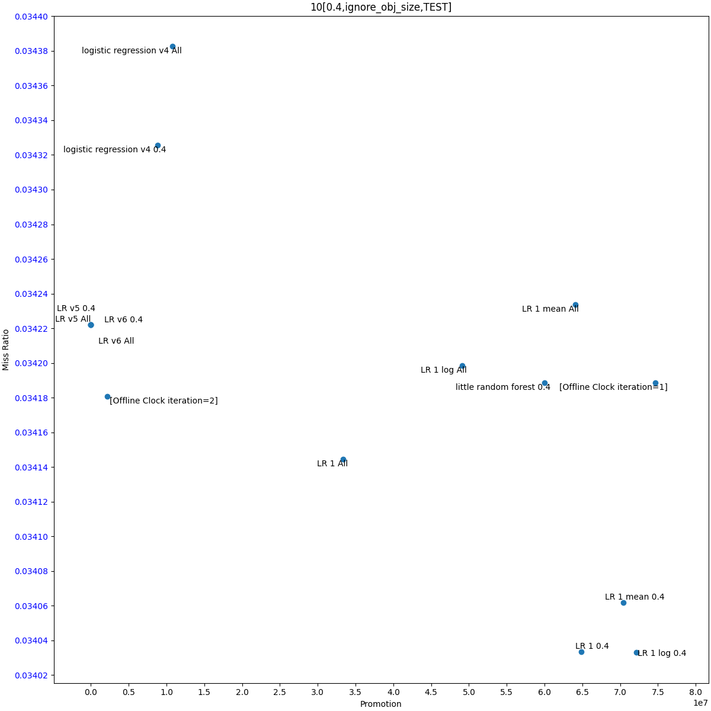  
> **Trace Path**: 10.oracleGeneral.zst  
> **Desc**: ['0.4', 'ignore_obj_size', 'TEST', {}]  
> **Cache Size**: 2944069  
> **Total Request**: 2,756,726,994  
> **Best Model**: LR_1_log_spec => 0.034033  
> **Better Than Base**: True  
## 2016_LUN6  
 https://ftp.pdl.cmu.edu/pub/datasets/twemcacheWorkload/cacheDatasets/systor/2016_LUN6.oracleGeneral.zst
> 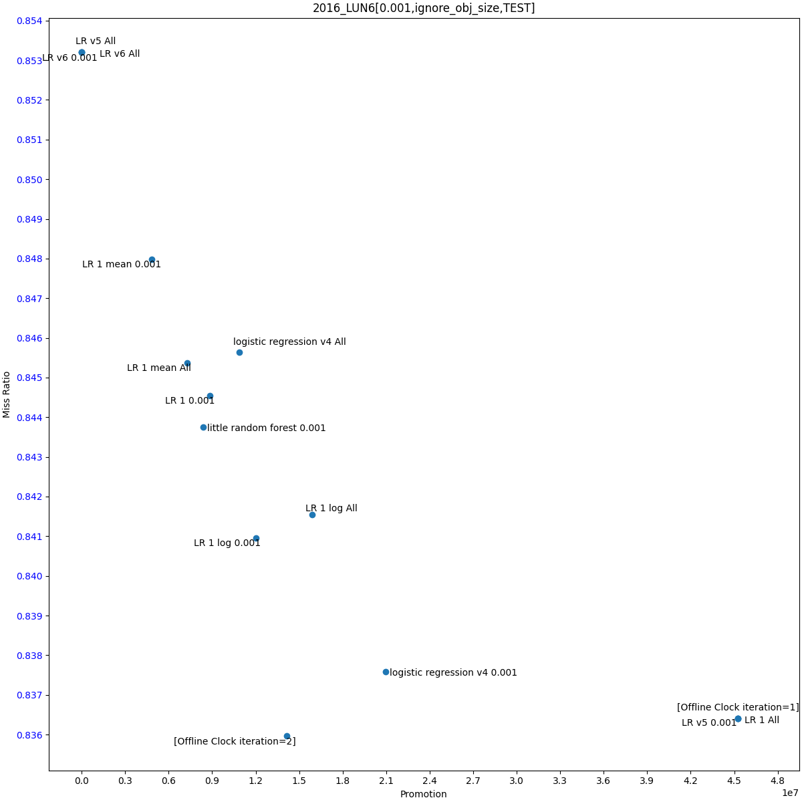  
> **Trace Path**: 2016_LUN6.oracleGeneral.zst  
> **Desc**: ['0.001', 'ignore_obj_size', 'TEST', {}]  
> **Cache Size**: 72393  
> **Total Request**: 655,119,703  
> **Best Model**: LR_1_All,LR_2_All,LR_v5_spec,logistic_regression_All => 0.836408  
> **Better Than Base**: False  
> 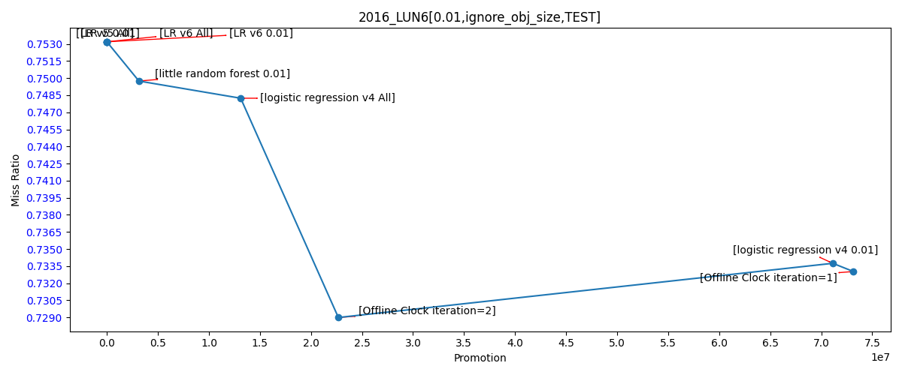  
> **Trace Path**: 2016_LUN6.oracleGeneral.zst  
> **Desc**: ['0.01', 'ignore_obj_size', 'TEST', {}]  
> **Cache Size**: 723935  
> **Total Request**: 655,119,703  
> **Best Model**: LR_1_All,LR_2_All => 0.733029  
> **Better Than Base**: False  
> 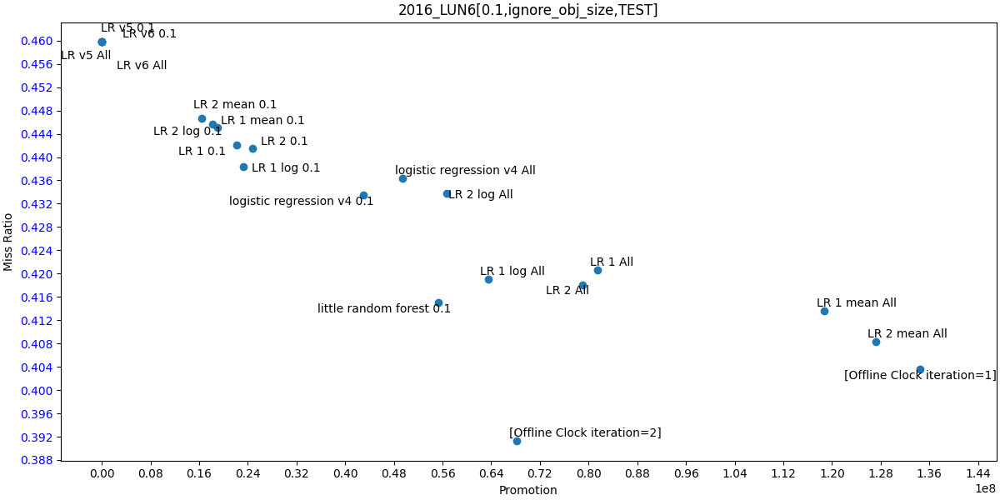  
> **Trace Path**: 2016_LUN6.oracleGeneral.zst  
> **Desc**: ['0.1', 'ignore_obj_size', 'TEST', {}]  
> **Cache Size**: 7239357  
> **Total Request**: 655,119,703  
> **Best Model**: logistic_regression_v2_All => 0.403522  
> **Better Than Base**: False  
> 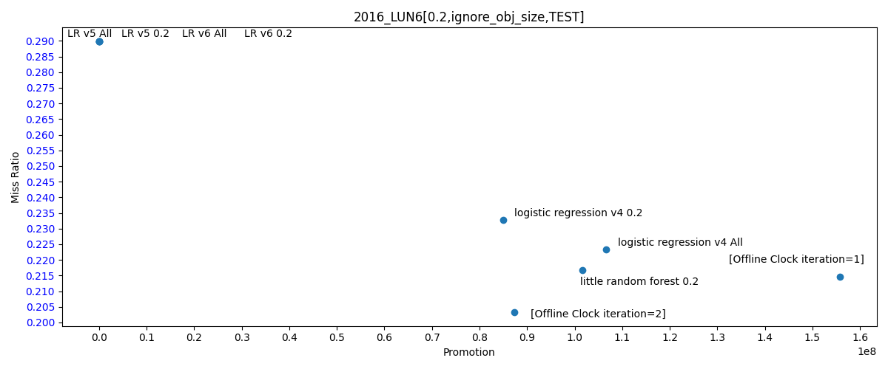  
> **Trace Path**: 2016_LUN6.oracleGeneral.zst  
> **Desc**: ['0.2', 'ignore_obj_size', 'TEST', {}]  
> **Cache Size**: 14478714  
> **Total Request**: 655,119,703  
> **Best Model**: logistic_regression_v2_All => 0.214693  
> **Better Than Base**: False  
> 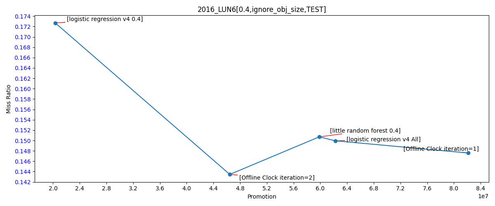  
> **Trace Path**: 2016_LUN6.oracleGeneral.zst  
> **Desc**: ['0.4', 'ignore_obj_size', 'TEST', {}]  
> **Cache Size**: 28957428  
> **Total Request**: 655,119,703  
> **Best Model**: logistic_regression_v2_spec,logistic_regression_v2_All => 0.147587  
> **Better Than Base**: False  
## 202206_kv_traces_all.csv  
 https://ftp.pdl.cmu.edu/pub/datasets/twemcacheWorkload/cacheDatasets/metaKV/202206_kv_traces_all.csv.oracleGeneral.zst
> 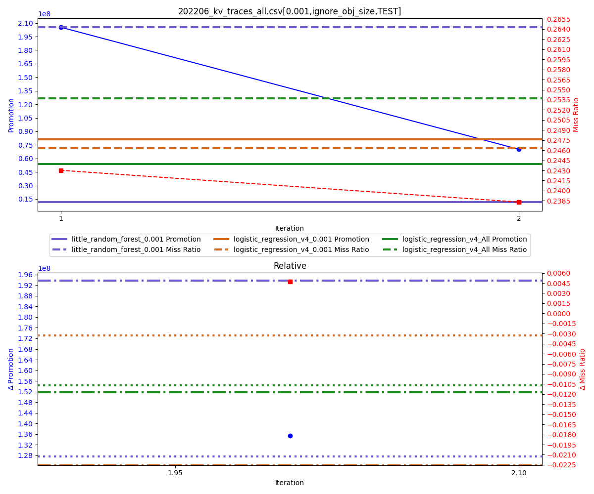  
> **Trace Path**: 202206_kv_traces_all.csv.oracleGeneral.zst  
> **Desc**: ['0.001', 'ignore_obj_size', 'TEST', {}]  
> **Cache Size**: 52429  
> **Total Request**: 1,644,762,386  
> **Best Model**: LR_1_All,LR_2_All => 0.242686  
> **Better Than Base**: True  
> 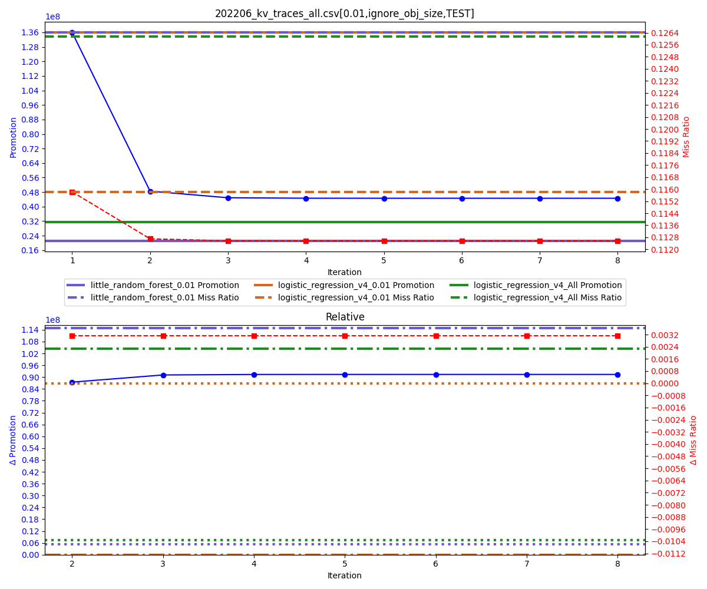  
> **Trace Path**: 202206_kv_traces_all.csv.oracleGeneral.zst  
> **Desc**: ['0.01', 'ignore_obj_size', 'TEST', {}]  
> **Cache Size**: 524291  
> **Total Request**: 1,644,762,386  
> **Best Model**: LR_1_log_spec,LR_1_mean_spec => 0.115557  
> **Better Than Base**: True  
> 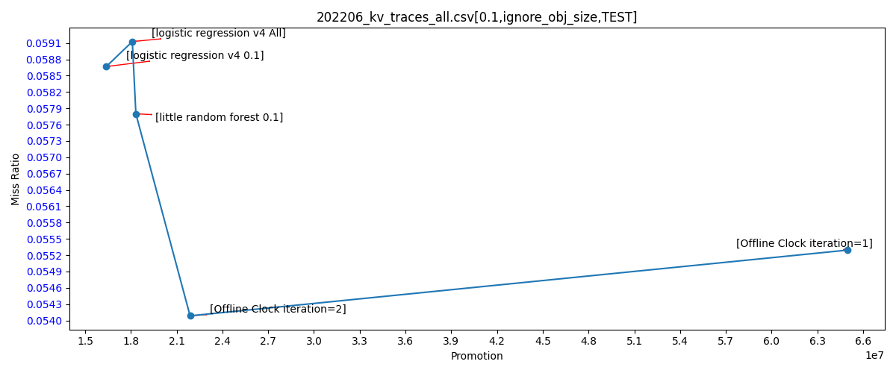  
> **Trace Path**: 202206_kv_traces_all.csv.oracleGeneral.zst  
> **Desc**: ['0.1', 'ignore_obj_size', 'TEST', {}]  
> **Cache Size**: 5242910  
> **Total Request**: 1,644,762,386  
> **Best Model**: logistic_regression_v2_spec,logistic_regression_v2_All => 0.0552932  
> **Better Than Base**: False  
> 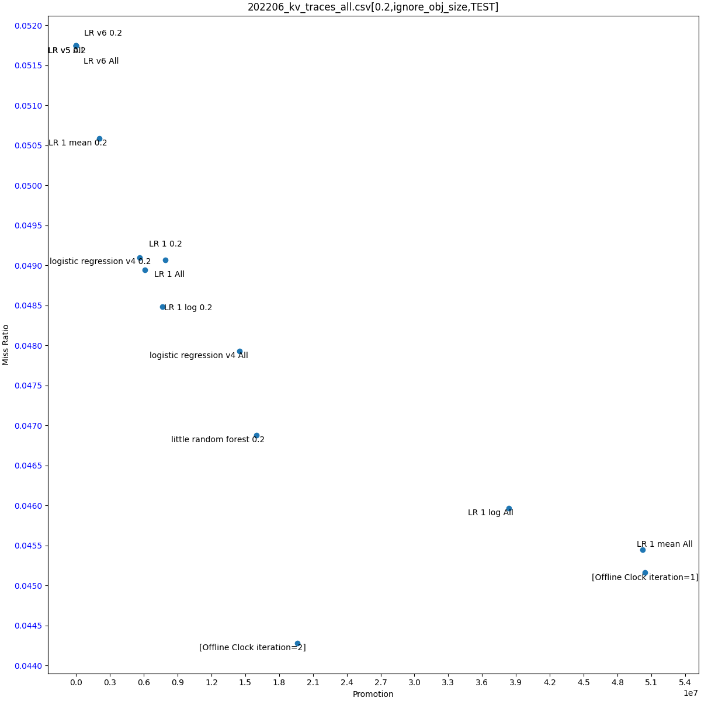  
> **Trace Path**: 202206_kv_traces_all.csv.oracleGeneral.zst  
> **Desc**: ['0.2', 'ignore_obj_size', 'TEST', {}]  
> **Cache Size**: 10485820  
> **Total Request**: 1,644,762,386  
> **Best Model**: logistic_regression_v2_spec,logistic_regression_v2_All => 0.0451591  
> **Better Than Base**: False  
> 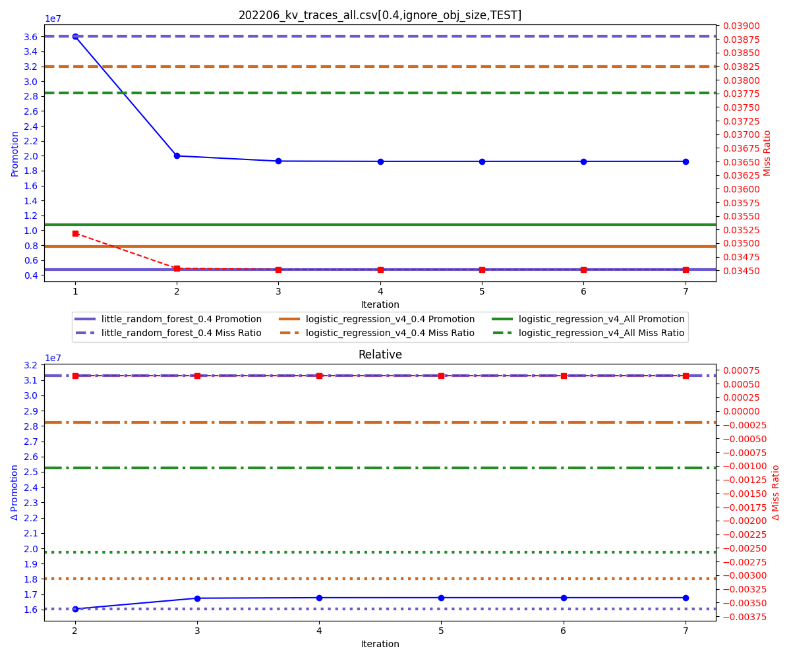  
> **Trace Path**: 202206_kv_traces_all.csv.oracleGeneral.zst  
> **Desc**: ['0.4', 'ignore_obj_size', 'TEST', {}]  
> **Cache Size**: 20971640  
> **Total Request**: 1,644,762,386  
> **Best Model**: logistic_regression_v2_spec,logistic_regression_v2_All => 0.0351843  
> **Better Than Base**: False  
## 8610  
 https://ftp.pdl.cmu.edu/pub/datasets/twemcacheWorkload/cacheDatasets/tencentBlock/v2/traces/8610.oracleGeneral.zst
> 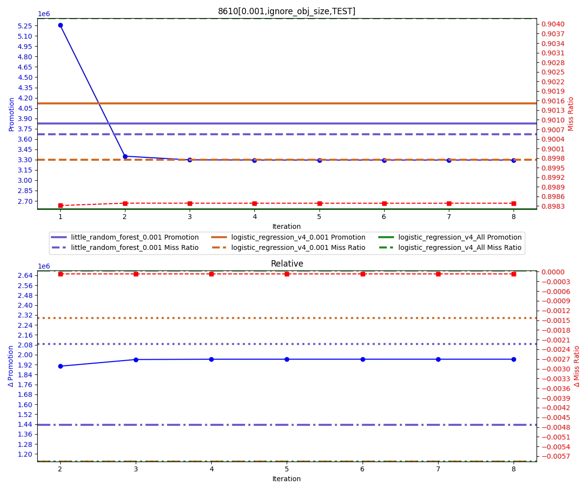  
> **Trace Path**: 8610.oracleGeneral.zst  
> **Desc**: ['0.001', 'ignore_obj_size', 'TEST', {}]  
> **Cache Size**: 1033  
> **Total Request**: 188,982,398  
> **Best Model**: LR_1_spec => 0.89831  
> **Better Than Base**: True  
> 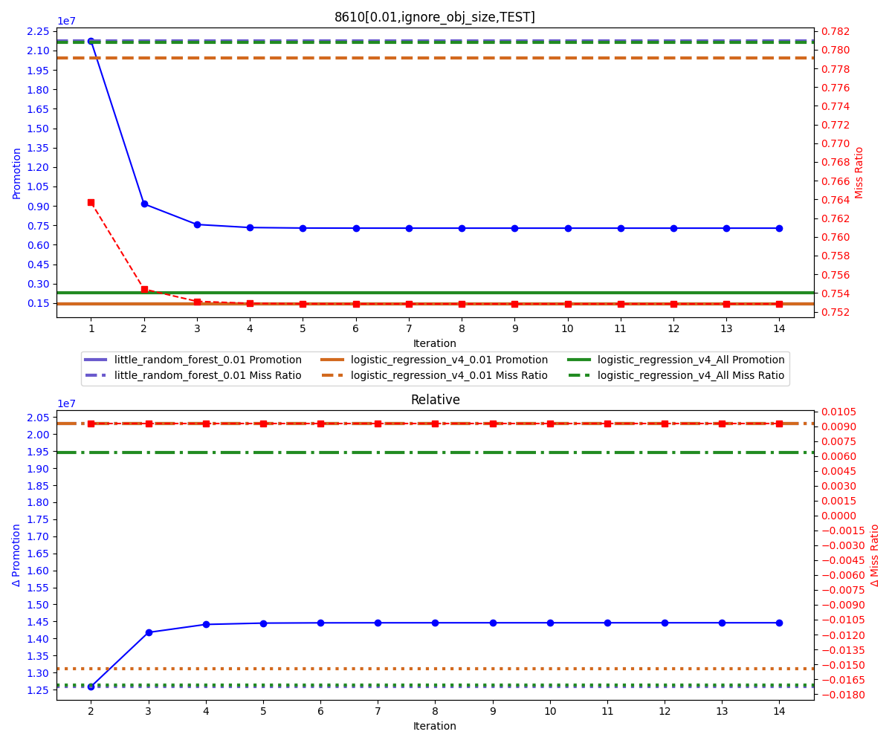  
> **Trace Path**: 8610.oracleGeneral.zst  
> **Desc**: ['0.01', 'ignore_obj_size', 'TEST', {}]  
> **Cache Size**: 10330  
> **Total Request**: 188,982,398  
> **Best Model**: LR_1_spec,LR_1_All,LR_2_spec,LR_2_All,LR_2_log_spec,LR_2_mean_spec => 0.763691  
> **Better Than Base**: False  
> 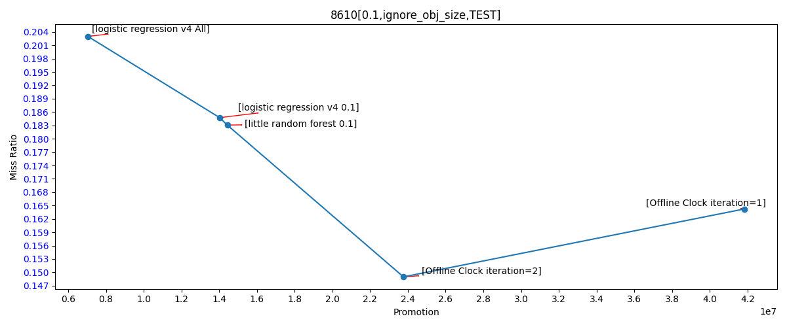  
> **Trace Path**: 8610.oracleGeneral.zst  
> **Desc**: ['0.1', 'ignore_obj_size', 'TEST', {}]  
> **Cache Size**: 103301  
> **Total Request**: 188,982,398  
> **Best Model**: LR_1_log_spec => 0.164029  
> **Better Than Base**: True  
> 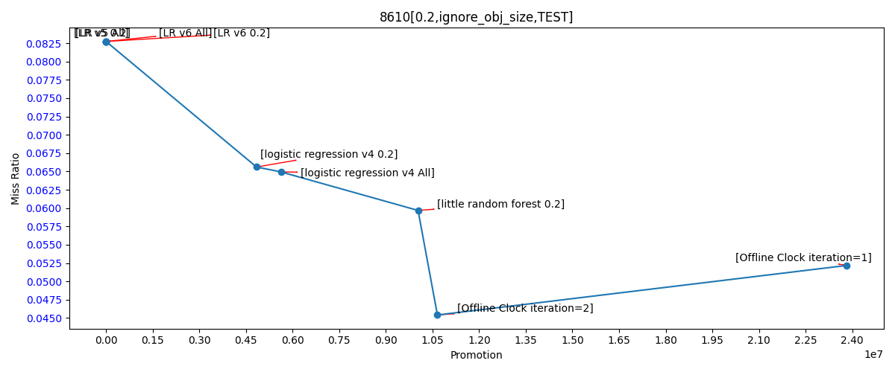  
> **Trace Path**: 8610.oracleGeneral.zst  
> **Desc**: ['0.2', 'ignore_obj_size', 'TEST', {}]  
> **Cache Size**: 206602  
> **Total Request**: 188,982,398  
> **Best Model**: LR_1_mean_spec => 0.0521634  
> **Better Than Base**: True  
> 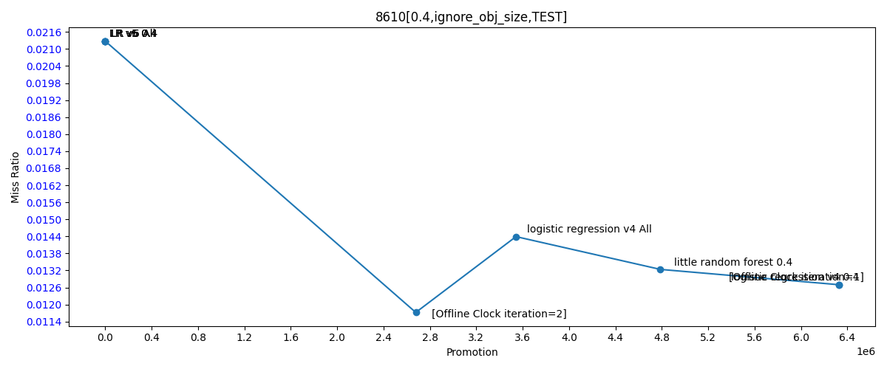  
> **Trace Path**: 8610.oracleGeneral.zst  
> **Desc**: ['0.4', 'ignore_obj_size', 'TEST', {}]  
> **Cache Size**: 413204  
> **Total Request**: 188,982,398  
> **Best Model**: logistic_regression_spec => 0.0126432  
> **Better Than Base**: True  
## cluster53  
 https://ftp.pdl.cmu.edu/pub/datasets/twemcacheWorkload/cacheDatasets/twitter/cluster53.oracleGeneral.zst
> 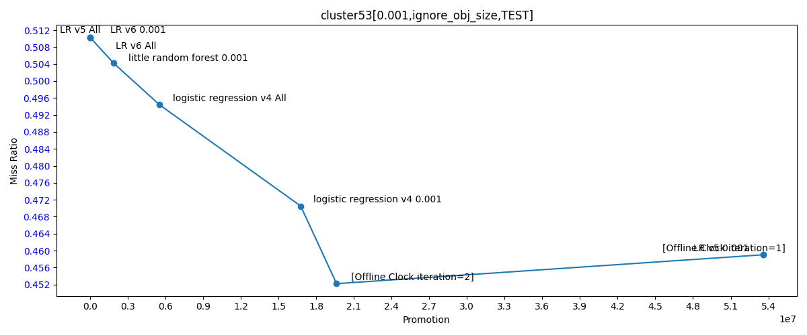  
> **Trace Path**: cluster53.oracleGeneral.zst  
> **Desc**: ['0.001', 'ignore_obj_size', 'TEST', {}]  
> **Cache Size**: 7243  
> **Total Request**: 246,508,262  
> **Best Model**: LR_1_log_spec => 0.456887  
> **Better Than Base**: True  
> 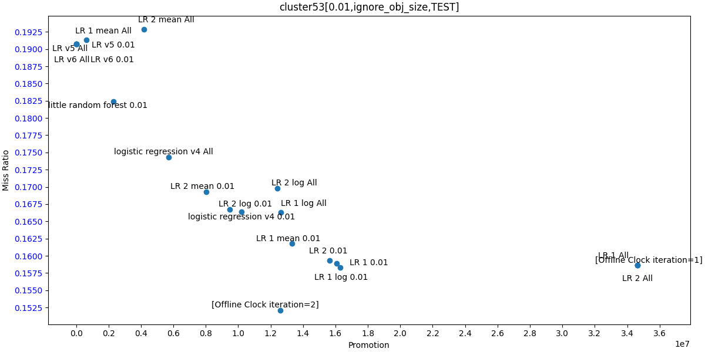  
> **Trace Path**: cluster53.oracleGeneral.zst  
> **Desc**: ['0.01', 'ignore_obj_size', 'TEST', {}]  
> **Cache Size**: 72439  
> **Total Request**: 246,508,262  
> **Best Model**: LR_1_log_spec => 0.1583  
> **Better Than Base**: True  
> 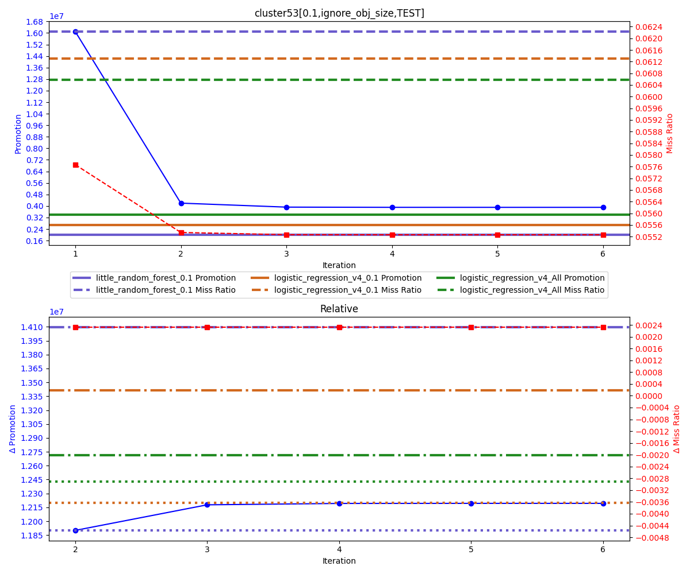  
> **Trace Path**: cluster53.oracleGeneral.zst  
> **Desc**: ['0.1', 'ignore_obj_size', 'TEST', {}]  
> **Cache Size**: 724391  
> **Total Request**: 246,508,262  
> **Best Model**: logistic_regression_All => 0.056228  
> **Better Than Base**: True  
> 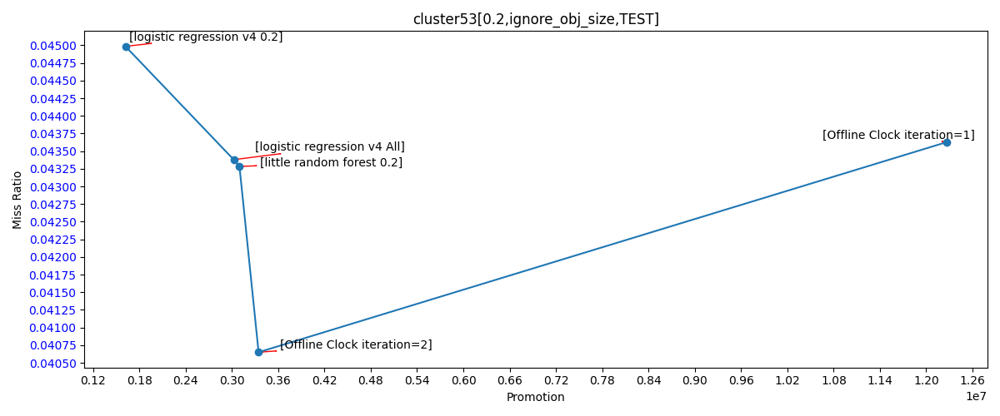  
> **Trace Path**: cluster53.oracleGeneral.zst  
> **Desc**: ['0.2', 'ignore_obj_size', 'TEST', {}]  
> **Cache Size**: 1448783  
> **Total Request**: 246,508,262  
> **Best Model**: logistic_regression_spec => 0.0403833  
> **Better Than Base**: True  
> 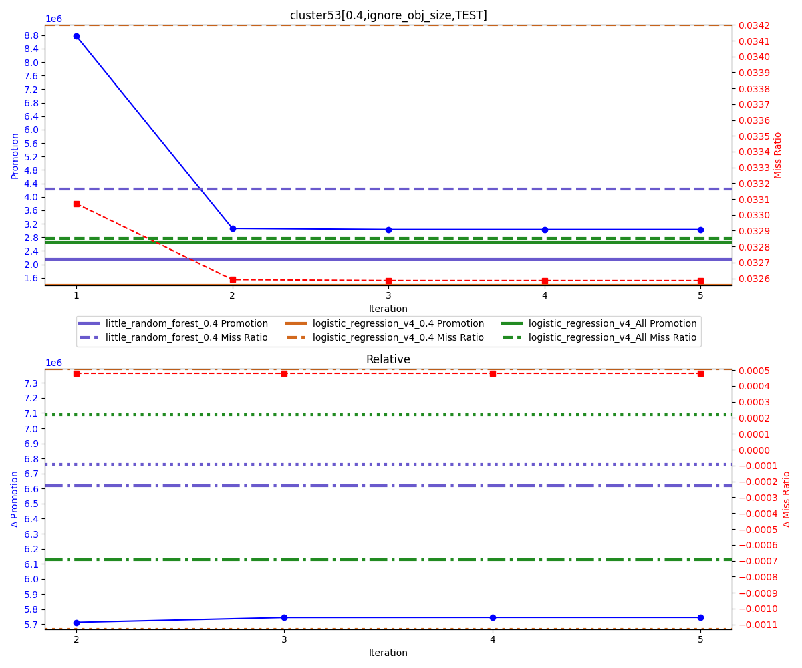  
> **Trace Path**: cluster53.oracleGeneral.zst  
> **Desc**: ['0.4', 'ignore_obj_size', 'TEST', {}]  
> **Cache Size**: 2897567  
> **Total Request**: 246,508,262  
> **Best Model**: LR_2_log_All => 0.0326154  
> **Better Than Base**: True  
## meta_rprn  
 https://ftp.pdl.cmu.edu/pub/datasets/twemcacheWorkload/cacheDatasets/metaCDN/meta_rprn.oracleGeneral.zst
>   
> **Trace Path**: meta_rprn.oracleGeneral.zst  
> **Desc**: ['0.001', 'ignore_obj_size', 'TEST', {}]  
> **Cache Size**: 29030  
> **Total Request**: 88,470,732  
> **Best Model**: LR_1_All,LR_2_All,logistic_regression_All => 0.59364  
> **Better Than Base**: False  
> 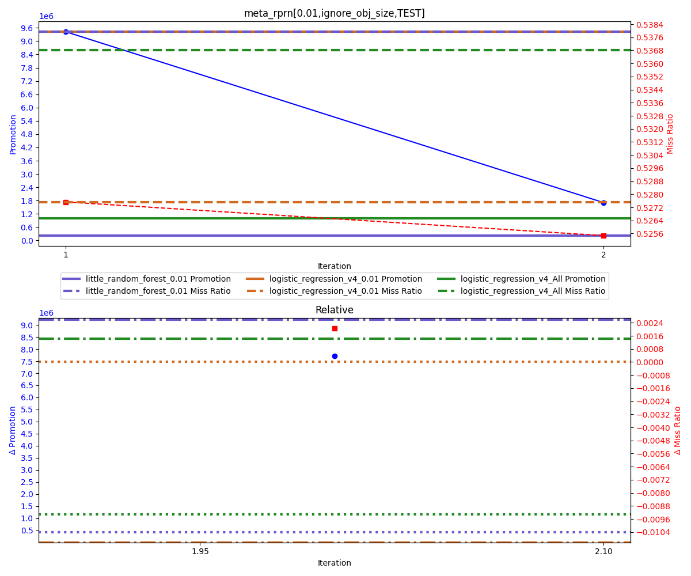  
> **Trace Path**: meta_rprn.oracleGeneral.zst  
> **Desc**: ['0.01', 'ignore_obj_size', 'TEST', {}]  
> **Cache Size**: 290302  
> **Total Request**: 88,470,732  
> **Best Model**: LR_1_All,LR_2_All,logistic_regression_v4_spec => 0.527533  
> **Better Than Base**: False  
> 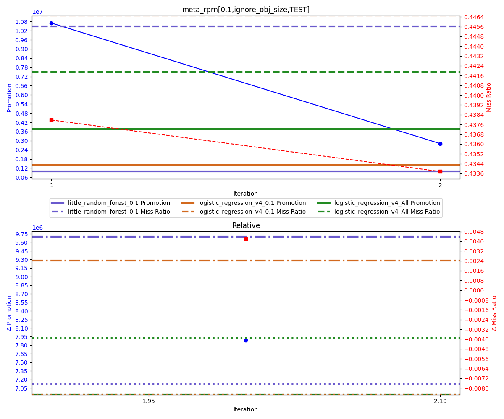  
> **Trace Path**: meta_rprn.oracleGeneral.zst  
> **Desc**: ['0.1', 'ignore_obj_size', 'TEST', {}]  
> **Cache Size**: 2903028  
> **Total Request**: 88,470,732  
> **Best Model**: LR_1_All,logistic_regression_v2_All => 0.437969  
> **Better Than Base**: False  
> 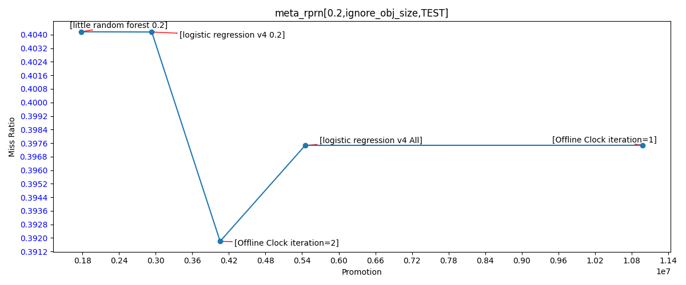  
> **Trace Path**: meta_rprn.oracleGeneral.zst  
> **Desc**: ['0.2', 'ignore_obj_size', 'TEST', {}]  
> **Cache Size**: 5806056  
> **Total Request**: 88,470,732  
> **Best Model**: logistic_regression_v2_spec => 0.394803  
> **Better Than Base**: True  
> 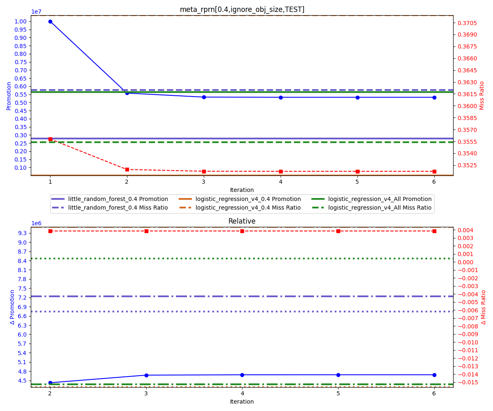  
> **Trace Path**: meta_rprn.oracleGeneral.zst  
> **Desc**: ['0.4', 'ignore_obj_size', 'TEST', {}]  
> **Cache Size**: 11612113  
> **Total Request**: 88,470,732  
> **Best Model**: LR_2_spec => 0.353883  
> **Better Than Base**: True  
## wiki_2019u  
 https://ftp.pdl.cmu.edu/pub/datasets/twemcacheWorkload/cacheDatasets/wiki/wiki_2019u.oracleGeneral.zst
> 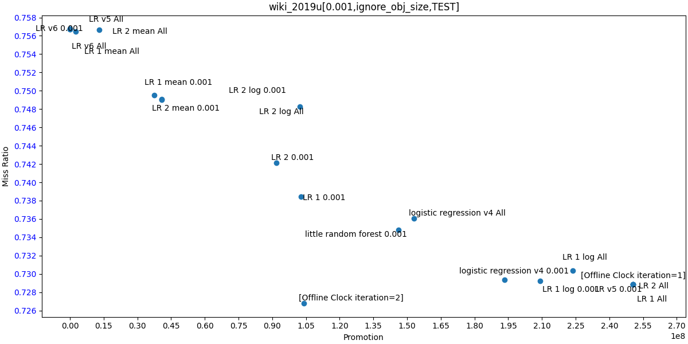  
> **Trace Path**: wiki_2019u.oracleGeneral.zst  
> **Desc**: ['0.001', 'ignore_obj_size', 'TEST', {}]  
> **Cache Size**: 49619  
> **Total Request**: 2,655,612,611  
> **Best Model**: LR_1_All,LR_2_All,LR_v5_spec,logistic_regression_All => 0.728852  
> **Better Than Base**: False  
> 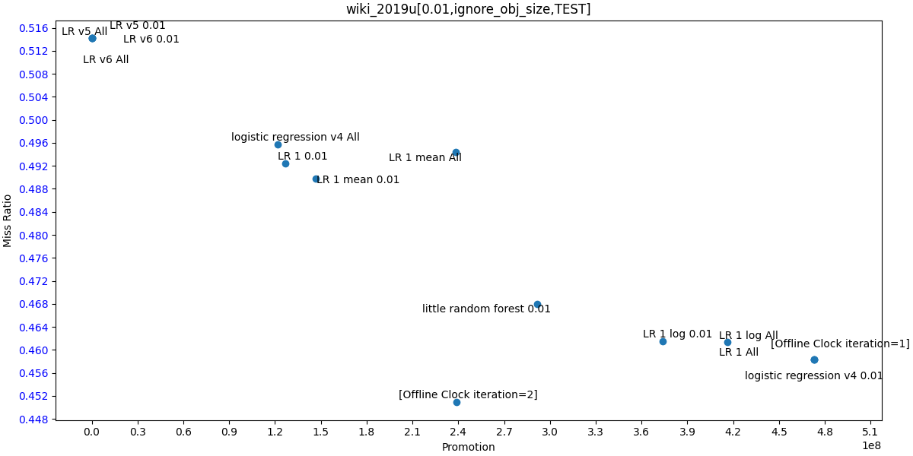  
> **Trace Path**: wiki_2019u.oracleGeneral.zst  
> **Desc**: ['0.01', 'ignore_obj_size', 'TEST', {}]  
> **Cache Size**: 496199  
> **Total Request**: 2,655,612,611  
> **Best Model**: LR_1_All,LR_2_All,logistic_regression_v4_spec => 0.458307  
> **Better Than Base**: False  
> 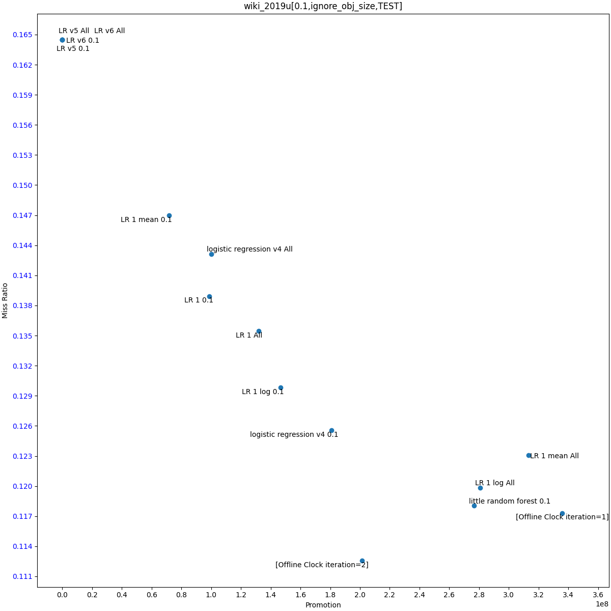  
> **Trace Path**: wiki_2019u.oracleGeneral.zst  
> **Desc**: ['0.1', 'ignore_obj_size', 'TEST', {}]  
> **Cache Size**: 4961999  
> **Total Request**: 2,655,612,611  
> **Best Model**: logistic_regression_v2_All => 0.117294  
> **Better Than Base**: False  
> 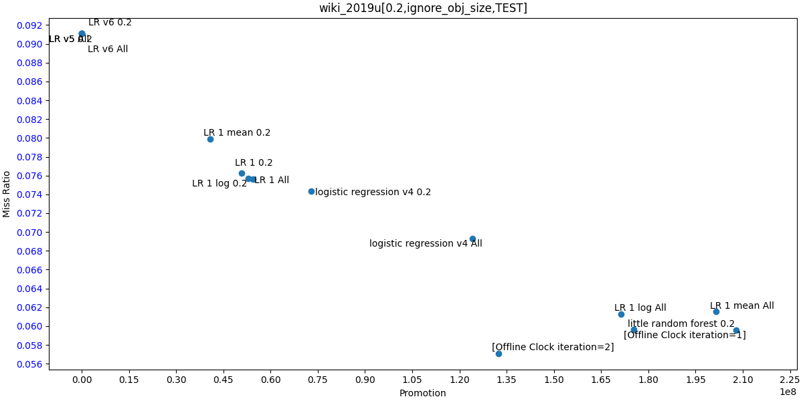  
> **Trace Path**: wiki_2019u.oracleGeneral.zst  
> **Desc**: ['0.2', 'ignore_obj_size', 'TEST', {}]  
> **Cache Size**: 9923998  
> **Total Request**: 2,655,612,611  
> **Best Model**: logistic_regression_v2_All => 0.0595329  
> **Better Than Base**: False  
> 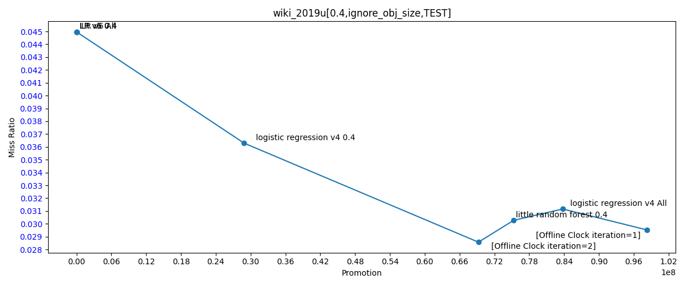  
> **Trace Path**: wiki_2019u.oracleGeneral.zst  
> **Desc**: ['0.4', 'ignore_obj_size', 'TEST', {}]  
> **Cache Size**: 19847996  
> **Total Request**: 2,655,612,611  
> **Best Model**: logistic_regression_v2_spec,logistic_regression_v2_All => 0.0295192  
> **Better Than Base**: False  
## zipf_0.3  
 
> 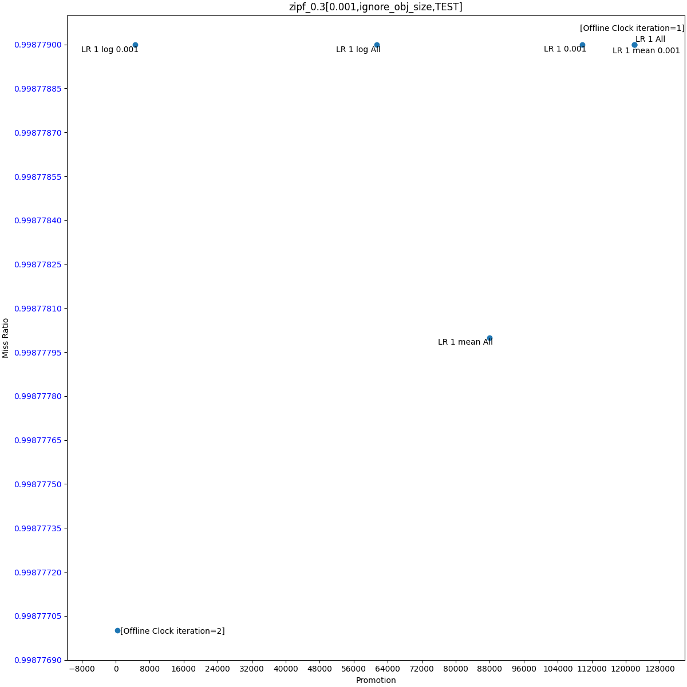  
> **Trace Path**: zipf_0.3.oracleGeneral  
> **Desc**: ['0.001', 'ignore_obj_size', 'TEST', {}]  
> **Cache Size**: 1000  
> **Total Request**: 100,000,000  
> **Best Model**: LR_1_mean_All => 0.998778  
> **Better Than Base**: True  
> 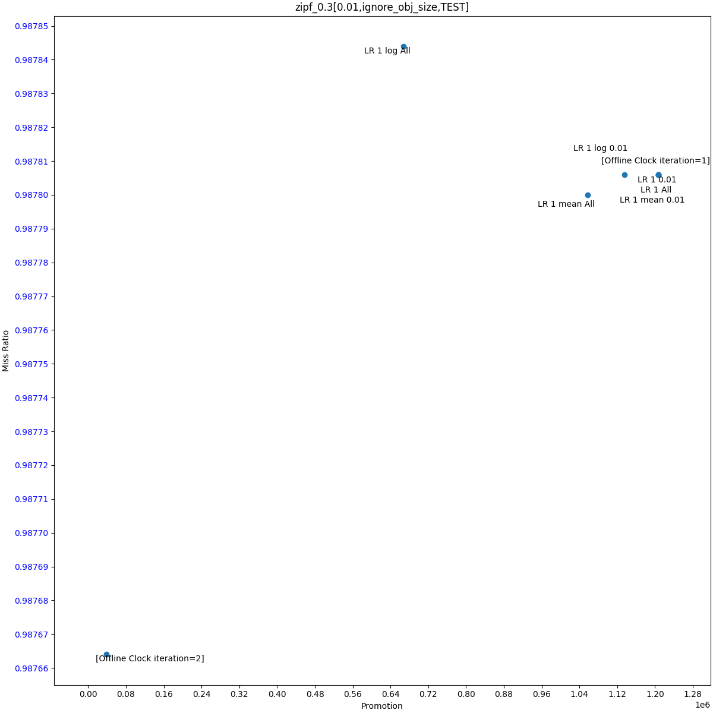  
> **Trace Path**: zipf_0.3.oracleGeneral  
> **Desc**: ['0.01', 'ignore_obj_size', 'TEST', {}]  
> **Cache Size**: 10000  
> **Total Request**: 100,000,000  
> **Best Model**: LR_1_mean_All => 0.9878  
> **Better Than Base**: True  
> 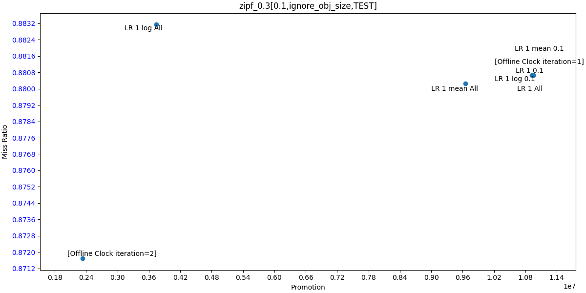  
> **Trace Path**: zipf_0.3.oracleGeneral  
> **Desc**: ['0.1', 'ignore_obj_size', 'TEST', {}]  
> **Cache Size**: 100001  
> **Total Request**: 100,000,000  
> **Best Model**: LR_1_mean_All => 0.880255  
> **Better Than Base**: True  
> 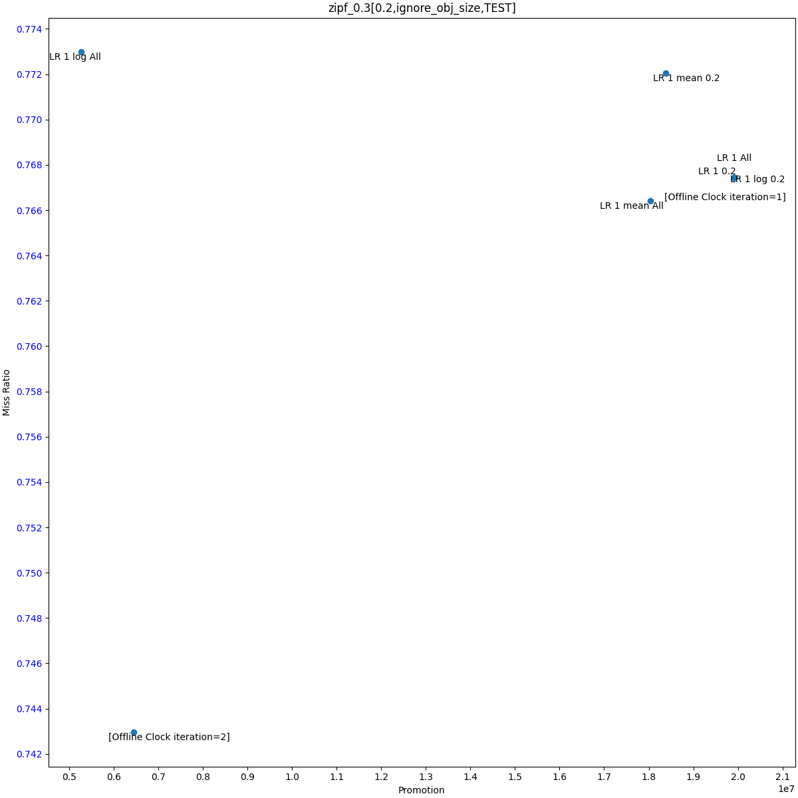  
> **Trace Path**: zipf_0.3.oracleGeneral  
> **Desc**: ['0.2', 'ignore_obj_size', 'TEST', {}]  
> **Cache Size**: 200002  
> **Total Request**: 100,000,000  
> **Best Model**: LR_1_mean_All => 0.766415  
> **Better Than Base**: True  
> 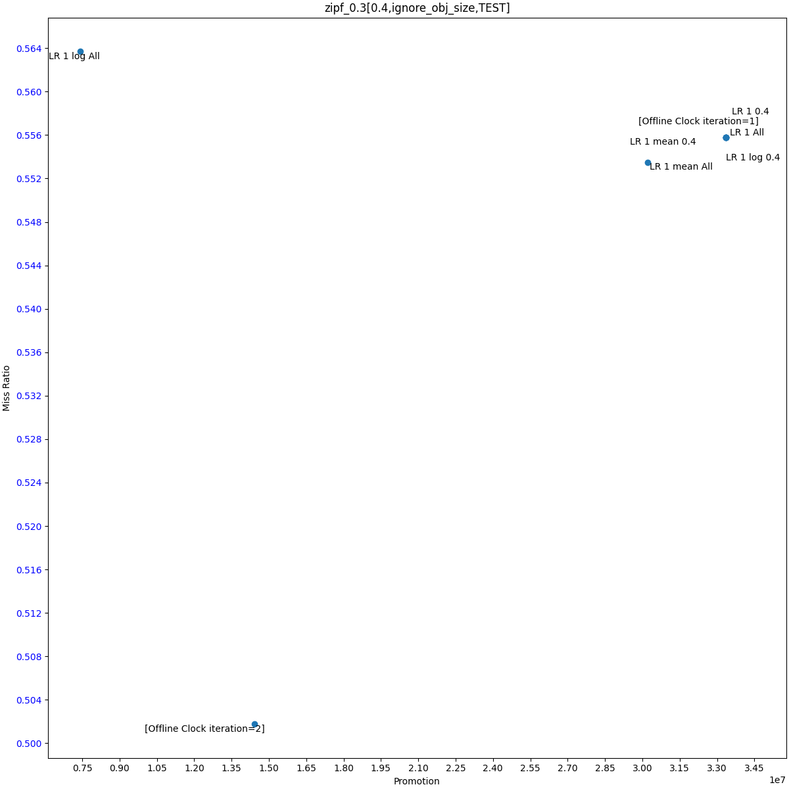  
> **Trace Path**: zipf_0.3.oracleGeneral  
> **Desc**: ['0.4', 'ignore_obj_size', 'TEST', {}]  
> **Cache Size**: 400004  
> **Total Request**: 100,000,000  
> **Best Model**: LR_1_mean_All => 0.553504  
> **Better Than Base**: True  
## zipf_0.7  
 
> 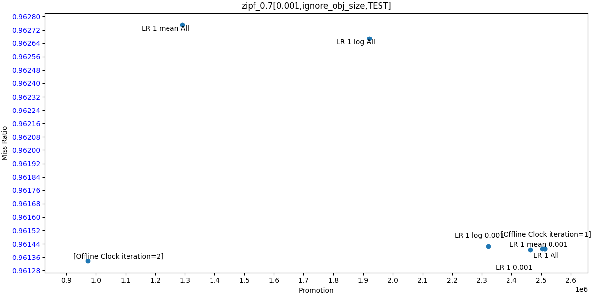  
> **Trace Path**: zipf_0.7.oracleGeneral  
> **Desc**: ['0.001', 'ignore_obj_size', 'TEST', {}]  
> **Cache Size**: 1000  
> **Total Request**: 100,000,000  
> **Best Model**: LR_1_spec => 0.961405  
> **Better Than Base**: True  
> 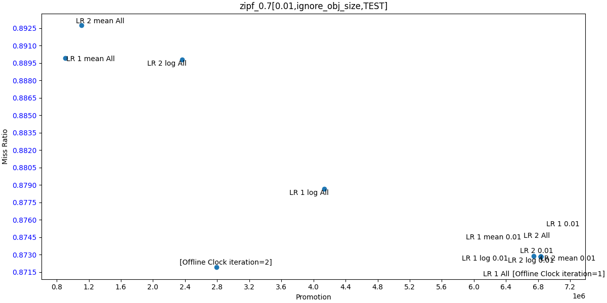  
> **Trace Path**: zipf_0.7.oracleGeneral  
> **Desc**: ['0.01', 'ignore_obj_size', 'TEST', {}]  
> **Cache Size**: 10000  
> **Total Request**: 100,000,000  
> **Best Model**: LR_1_spec,LR_1_All,LR_1_mean_spec,LR_2_spec,LR_2_All,LR_2_log_spec,LR_2_mean_spec => 0.872851  
> **Better Than Base**: False  
> 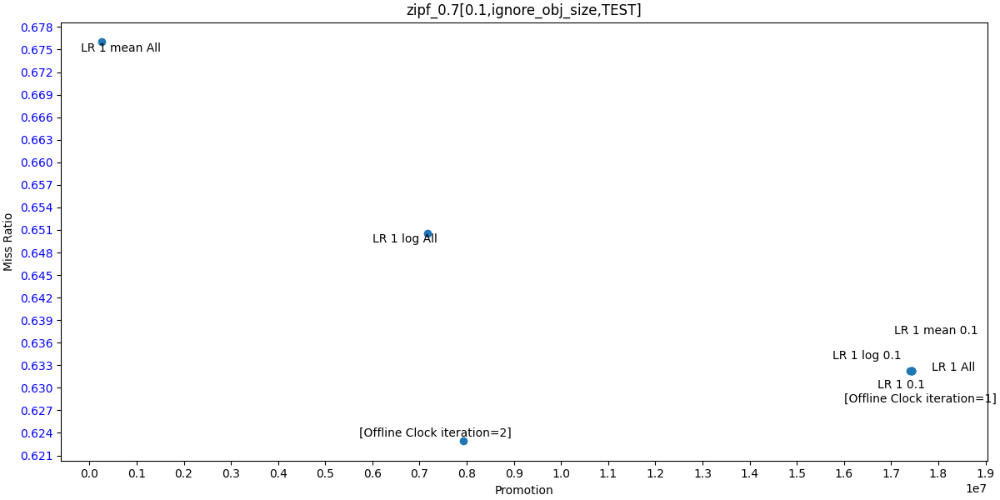  
> **Trace Path**: zipf_0.7.oracleGeneral  
> **Desc**: ['0.1', 'ignore_obj_size', 'TEST', {}]  
> **Cache Size**: 100001  
> **Total Request**: 100,000,000  
> **Best Model**: LR_1_spec,LR_1_All,LR_1_mean_spec,LR_2_spec,LR_2_All,LR_2_log_spec,LR_2_mean_spec => 0.632252  
> **Better Than Base**: False  
> 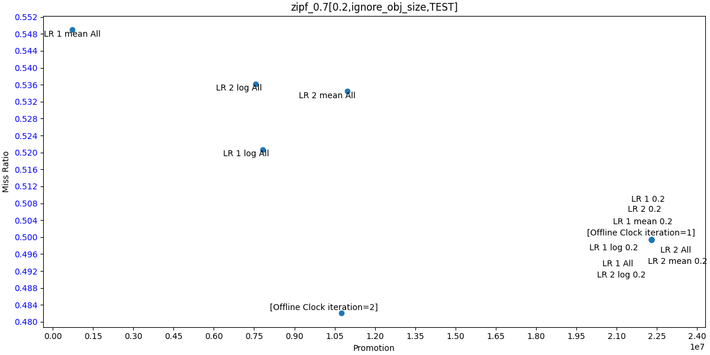  
> **Trace Path**: zipf_0.7.oracleGeneral  
> **Desc**: ['0.2', 'ignore_obj_size', 'TEST', {}]  
> **Cache Size**: 200002  
> **Total Request**: 100,000,000  
> **Best Model**: LR_1_spec,LR_1_All,LR_1_log_spec,LR_1_mean_spec,LR_2_spec,LR_2_All,LR_2_log_spec,LR_2_mean_spec => 0.499366  
> **Better Than Base**: False  
> 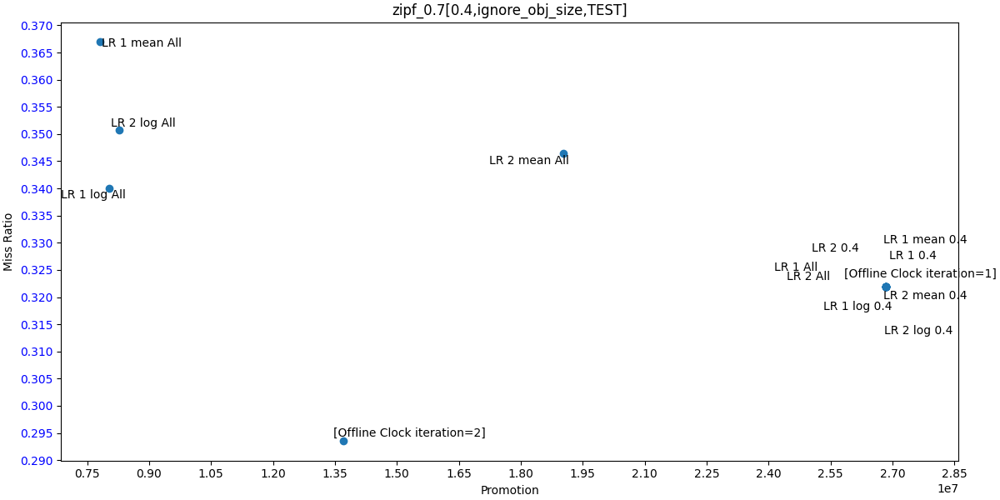  
> **Trace Path**: zipf_0.7.oracleGeneral  
> **Desc**: ['0.4', 'ignore_obj_size', 'TEST', {}]  
> **Cache Size**: 400004  
> **Total Request**: 100,000,000  
> **Best Model**: LR_1_spec,LR_1_All,LR_1_log_spec,LR_1_mean_spec,LR_2_spec,LR_2_All,LR_2_log_spec,LR_2_mean_spec => 0.321945  
> **Better Than Base**: False  
## zipf_0  
 
> 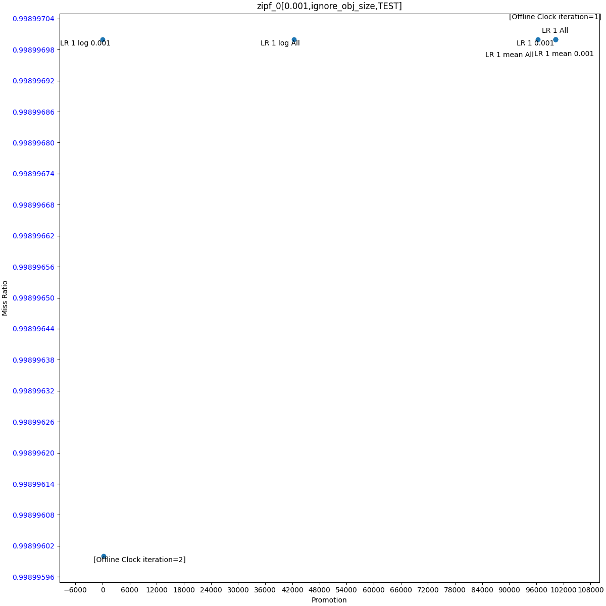  
> **Trace Path**: zipf_0.oracleGeneral  
> **Desc**: ['0.001', 'ignore_obj_size', 'TEST', {}]  
> **Cache Size**: 1000  
> **Total Request**: 100,000,000  
> **Best Model**: LR_1_spec,LR_1_All,LR_1_log_spec,LR_1_log_All,LR_1_mean_spec,LR_1_mean_All,LR_2_spec,LR_2_All,LR_2_log_spec,LR_2_log_All,LR_2_mean_spec,LR_2_mean_All => 0.998997  
> **Better Than Base**: False  
> 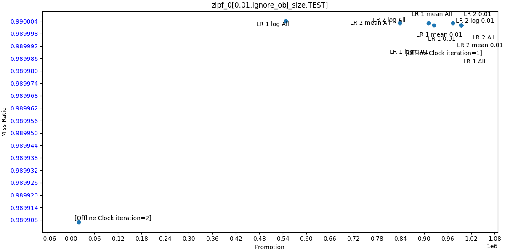  
> **Trace Path**: zipf_0.oracleGeneral  
> **Desc**: ['0.01', 'ignore_obj_size', 'TEST', {}]  
> **Cache Size**: 10000  
> **Total Request**: 100,000,000  
> **Best Model**: LR_1_spec,LR_1_All,LR_1_log_spec,LR_1_mean_spec,LR_2_spec,LR_2_All,LR_2_log_spec,LR_2_mean_spec => 0.990002  
> **Better Than Base**: False  
> 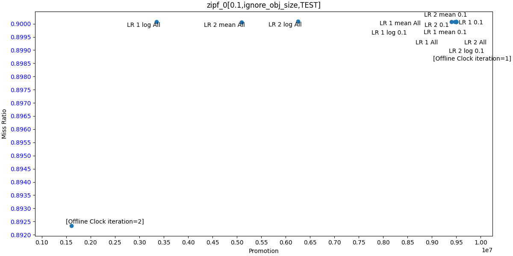  
> **Trace Path**: zipf_0.oracleGeneral  
> **Desc**: ['0.1', 'ignore_obj_size', 'TEST', {}]  
> **Cache Size**: 100001  
> **Total Request**: 100,000,000  
> **Best Model**: LR_2_mean_All => 0.900066  
> **Better Than Base**: True  
> 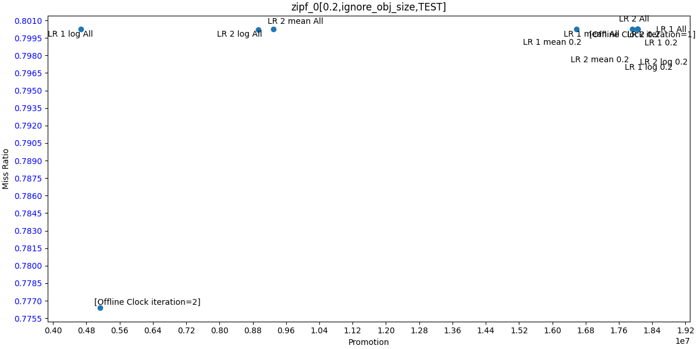  
> **Trace Path**: zipf_0.oracleGeneral  
> **Desc**: ['0.2', 'ignore_obj_size', 'TEST', {}]  
> **Cache Size**: 200002  
> **Total Request**: 100,000,000  
> **Best Model**: LR_2_log_All => 0.800227  
> **Better Than Base**: True  
>   
> **Trace Path**: zipf_0.oracleGeneral  
> **Desc**: ['0.4', 'ignore_obj_size', 'TEST', {}]  
> **Cache Size**: 400004  
> **Total Request**: 100,000,000  
> **Best Model**: LR_2_mean_All => 0.600963  
> **Better Than Base**: True  
## zipf_1.3  
 
> 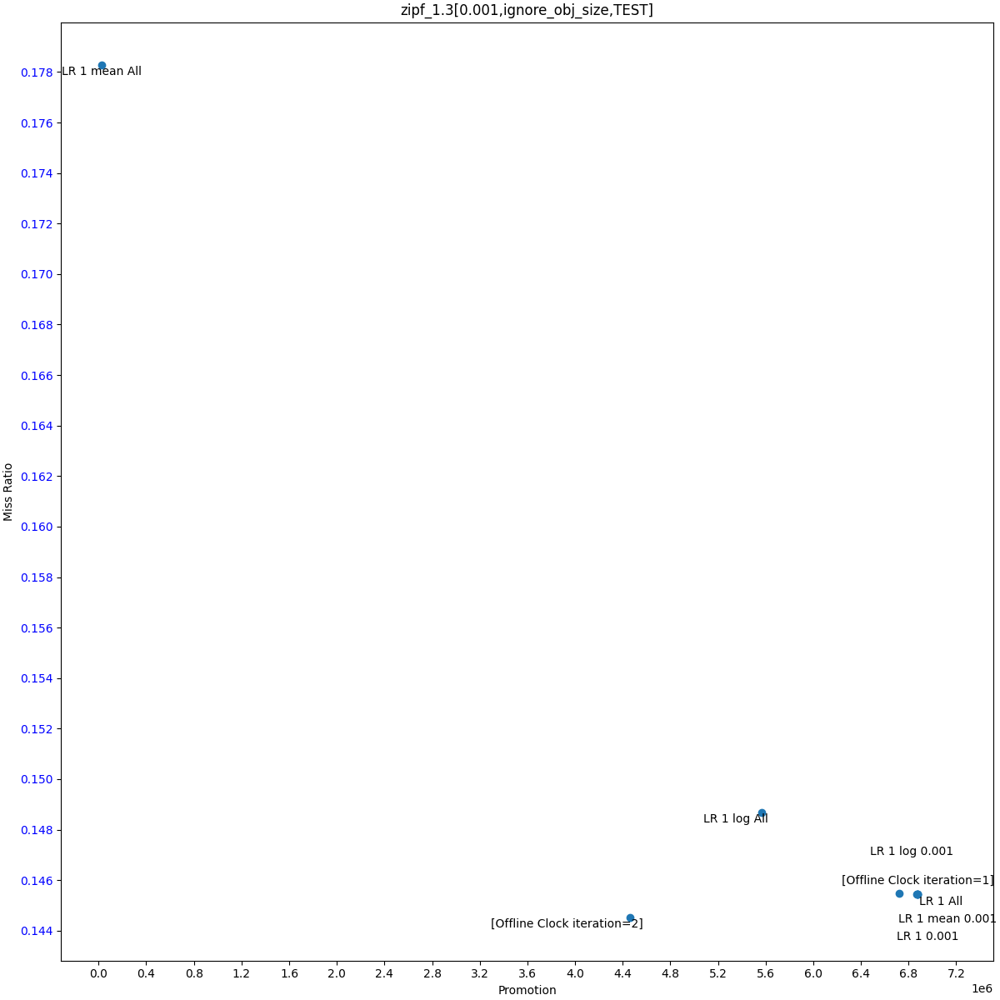  
> **Trace Path**: zipf_1.3.oracleGeneral  
> **Desc**: ['0.001', 'ignore_obj_size', 'TEST', {}]  
> **Cache Size**: 669  
> **Total Request**: 100,000,000  
> **Best Model**: LR_1_spec => 0.145431  
> **Better Than Base**: True  
> 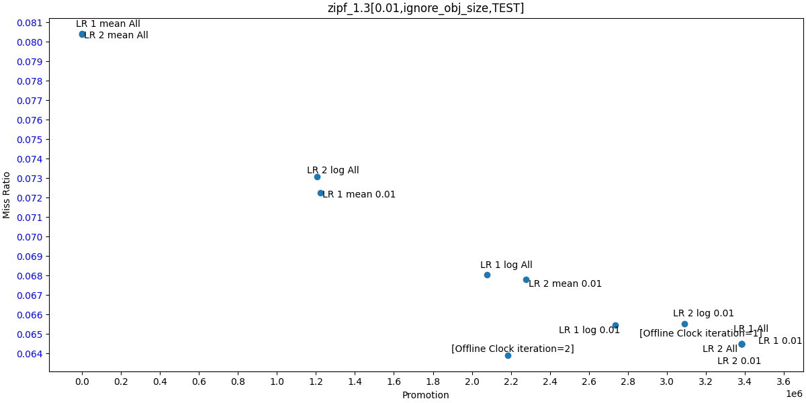  
> **Trace Path**: zipf_1.3.oracleGeneral  
> **Desc**: ['0.01', 'ignore_obj_size', 'TEST', {}]  
> **Cache Size**: 6695  
> **Total Request**: 100,000,000  
> **Best Model**: LR_1_spec,LR_1_All,LR_2_spec,LR_2_All => 0.0645036  
> **Better Than Base**: False  
> 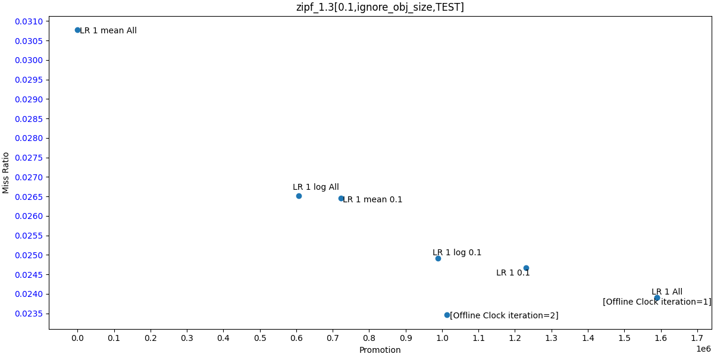  
> **Trace Path**: zipf_1.3.oracleGeneral  
> **Desc**: ['0.1', 'ignore_obj_size', 'TEST', {}]  
> **Cache Size**: 66952  
> **Total Request**: 100,000,000  
> **Best Model**: LR_1_All,LR_2_All => 0.0239022  
> **Better Than Base**: False  
> 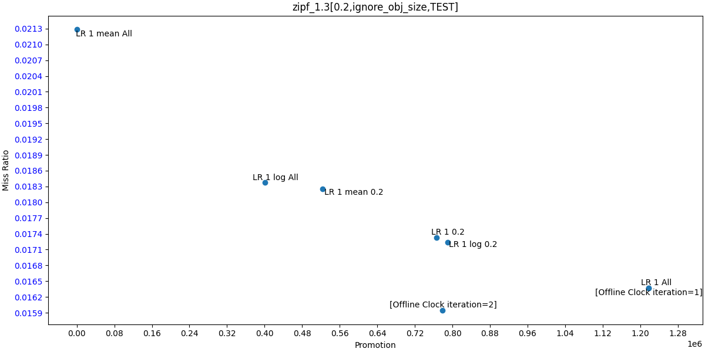  
> **Trace Path**: zipf_1.3.oracleGeneral  
> **Desc**: ['0.2', 'ignore_obj_size', 'TEST', {}]  
> **Cache Size**: 133905  
> **Total Request**: 100,000,000  
> **Best Model**: LR_1_All,LR_2_spec => 0.0163646  
> **Better Than Base**: False  
> 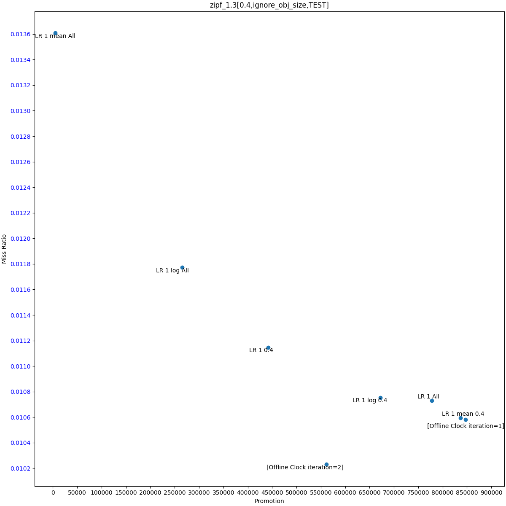  
> **Trace Path**: zipf_1.3.oracleGeneral  
> **Desc**: ['0.4', 'ignore_obj_size', 'TEST', {}]  
> **Cache Size**: 267810  
> **Total Request**: 100,000,000  
> **Best Model**: LR_2_spec => 0.0105821  
> **Better Than Base**: False  
## zipf_1.7  
 
> 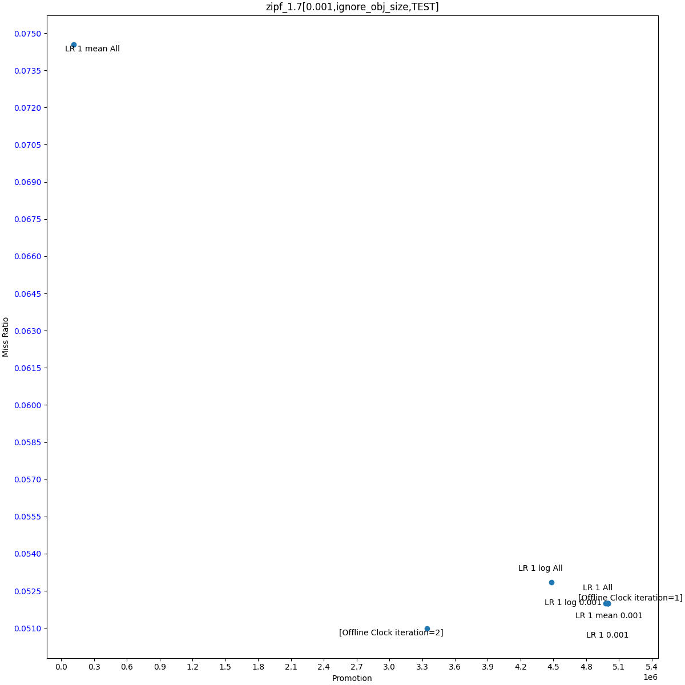  
> **Trace Path**: zipf_1.7.oracleGeneral  
> **Desc**: ['0.001', 'ignore_obj_size', 'TEST', {}]  
> **Cache Size**: 68  
> **Total Request**: 100,000,000  
> **Best Model**: LR_1_spec => 0.0519973  
> **Better Than Base**: True  
> 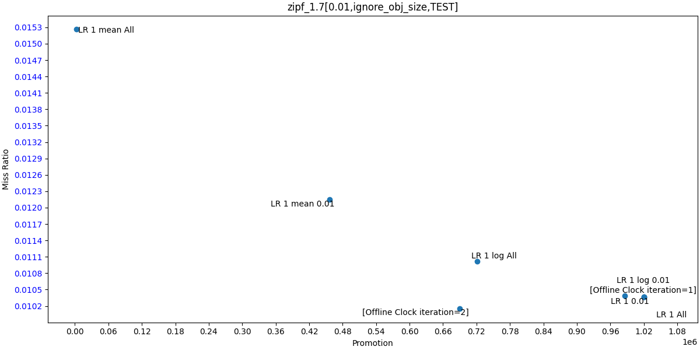  
> **Trace Path**: zipf_1.7.oracleGeneral  
> **Desc**: ['0.01', 'ignore_obj_size', 'TEST', {}]  
> **Cache Size**: 680  
> **Total Request**: 100,000,000  
> **Best Model**: LR_1_spec,LR_1_All,LR_2_spec,LR_2_All,LR_2_log_spec => 0.0103631  
> **Better Than Base**: False  
>   
> **Trace Path**: zipf_1.7.oracleGeneral  
> **Desc**: ['0.1', 'ignore_obj_size', 'TEST', {}]  
> **Cache Size**: 6807  
> **Total Request**: 100,000,000  
> **Best Model**: LR_1_All,LR_2_All => 0.00205443  
> **Better Than Base**: False  
> 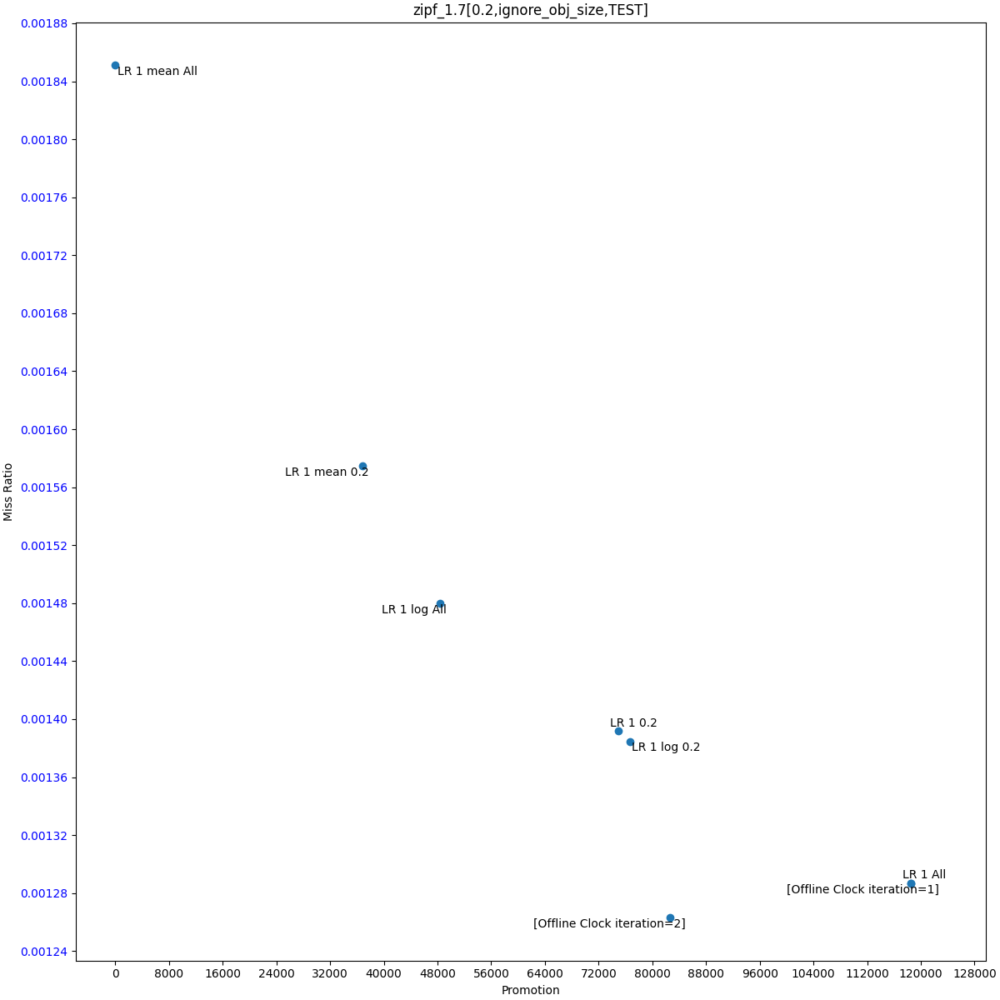  
> **Trace Path**: zipf_1.7.oracleGeneral  
> **Desc**: ['0.2', 'ignore_obj_size', 'TEST', {}]  
> **Cache Size**: 13615  
> **Total Request**: 100,000,000  
> **Best Model**: LR_1_All,LR_2_spec => 0.00128691  
> **Better Than Base**: False  
> 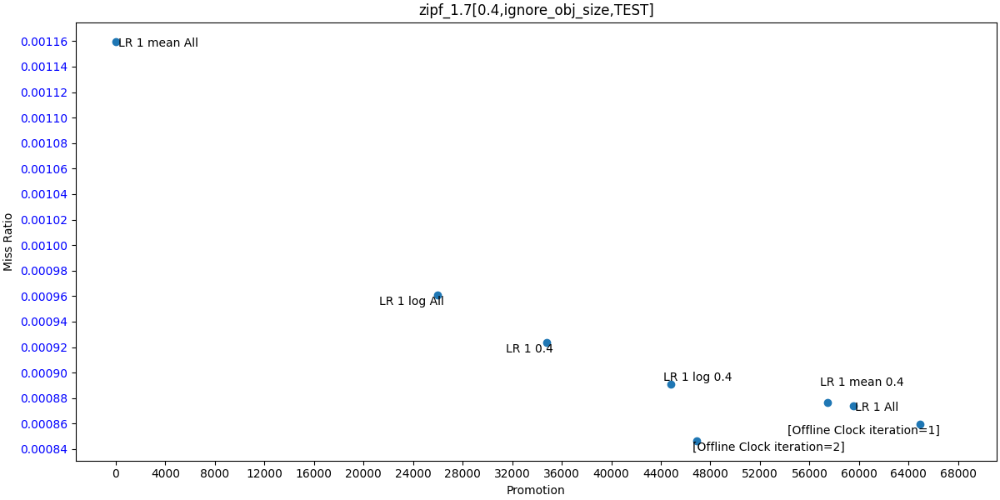  
> **Trace Path**: zipf_1.7.oracleGeneral  
> **Desc**: ['0.4', 'ignore_obj_size', 'TEST', {}]  
> **Cache Size**: 27231  
> **Total Request**: 100,000,000  
> **Best Model**: LR_2_spec => 0.00085926  
> **Better Than Base**: False  
## zipf_1  
 
> 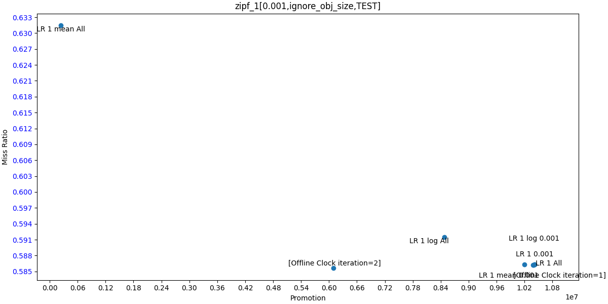  
> **Trace Path**: zipf_1.oracleGeneral  
> **Desc**: ['0.001', 'ignore_obj_size', 'TEST', {}]  
> **Cache Size**: 999  
> **Total Request**: 100,000,000  
> **Best Model**: LR_1_spec => 0.586254  
> **Better Than Base**: True  
> 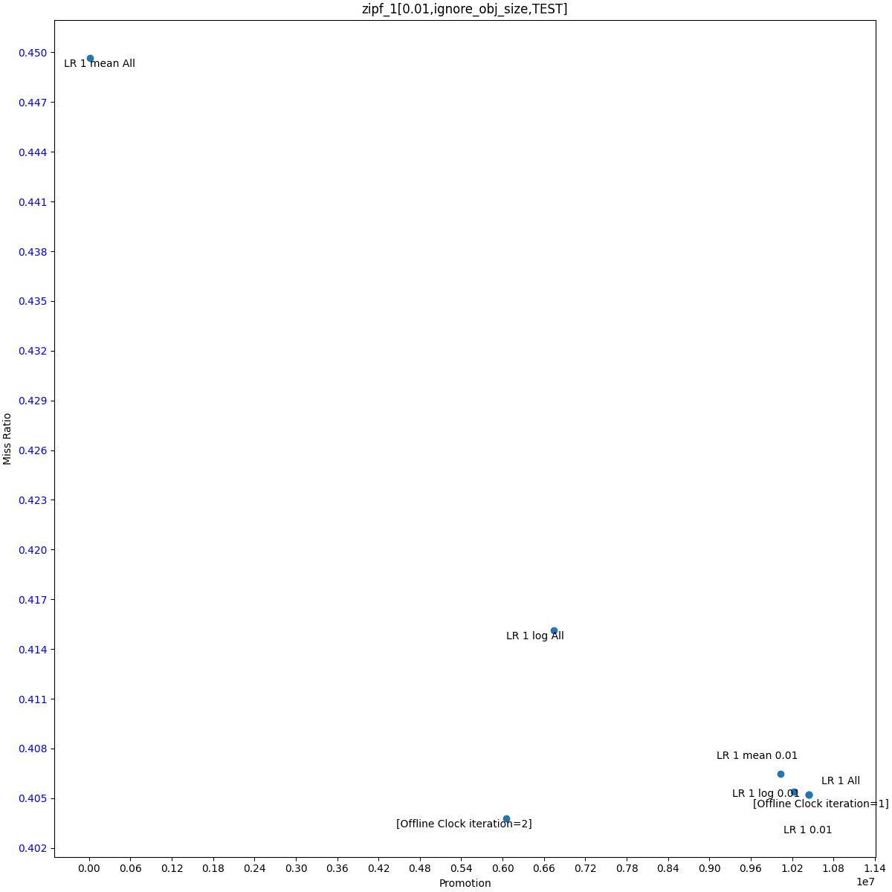  
> **Trace Path**: zipf_1.oracleGeneral  
> **Desc**: ['0.01', 'ignore_obj_size', 'TEST', {}]  
> **Cache Size**: 9999  
> **Total Request**: 100,000,000  
> **Best Model**: LR_1_spec,LR_1_All,LR_2_spec,LR_2_All,LR_2_log_spec,LR_2_mean_spec => 0.405233  
> **Better Than Base**: False  
> 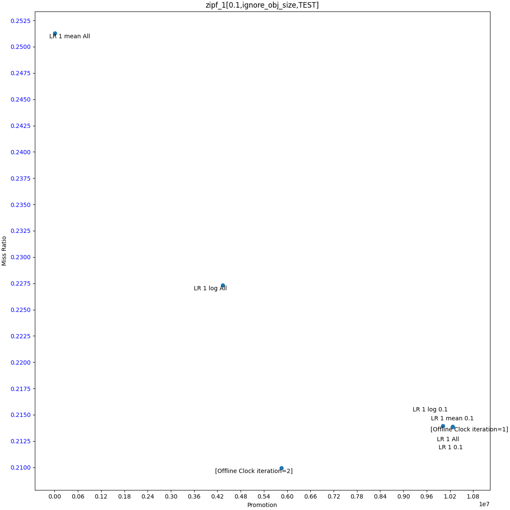  
> **Trace Path**: zipf_1.oracleGeneral  
> **Desc**: ['0.1', 'ignore_obj_size', 'TEST', {}]  
> **Cache Size**: 99994  
> **Total Request**: 100,000,000  
> **Best Model**: LR_1_spec,LR_1_All,LR_1_mean_spec,LR_2_spec,LR_2_All,LR_2_log_spec,LR_2_mean_spec => 0.213886  
> **Better Than Base**: False  
> 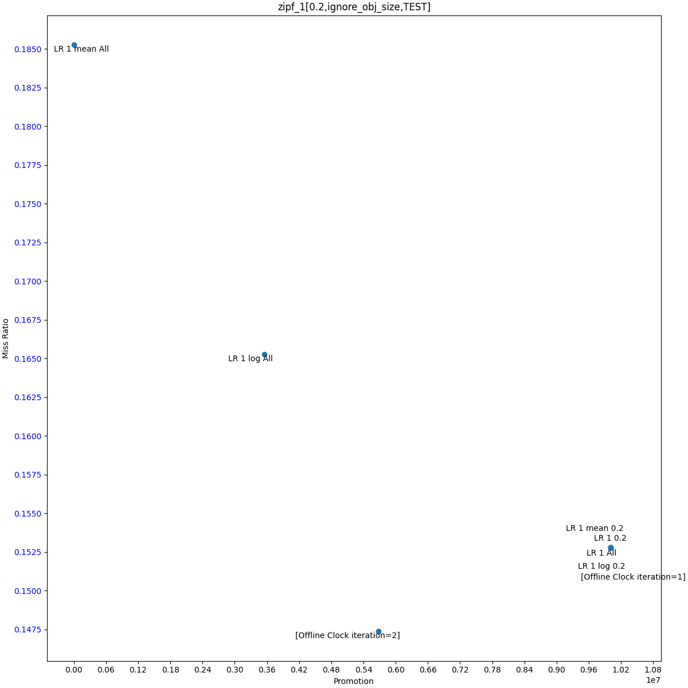  
> **Trace Path**: zipf_1.oracleGeneral  
> **Desc**: ['0.2', 'ignore_obj_size', 'TEST', {}]  
> **Cache Size**: 199988  
> **Total Request**: 100,000,000  
> **Best Model**: LR_1_spec,LR_1_All,LR_1_log_spec,LR_1_mean_spec,LR_2_spec,LR_2_All,LR_2_log_spec,LR_2_mean_spec => 0.152787  
> **Better Than Base**: False  
>   
> **Trace Path**: zipf_1.oracleGeneral  
> **Desc**: ['0.4', 'ignore_obj_size', 'TEST', {}]  
> **Cache Size**: 399977  
> **Total Request**: 100,000,000  
> **Best Model**: LR_1_All,LR_1_log_spec,LR_1_mean_spec,LR_2_spec,LR_2_All,LR_2_log_spec,LR_2_mean_spec => 0.0897345  
> **Better Than Base**: False  
## zipf_2  
 
> 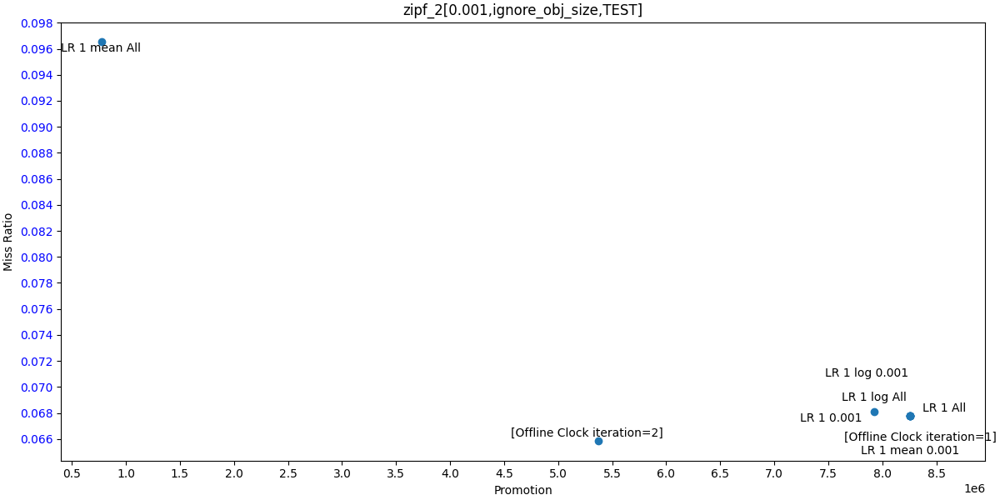  
> **Trace Path**: zipf_2.oracleGeneral  
> **Desc**: ['0.001', 'ignore_obj_size', 'TEST', {}]  
> **Cache Size**: 13  
> **Total Request**: 100,000,000  
> **Best Model**: LR_1_spec => 0.0677552  
> **Better Than Base**: True  
> 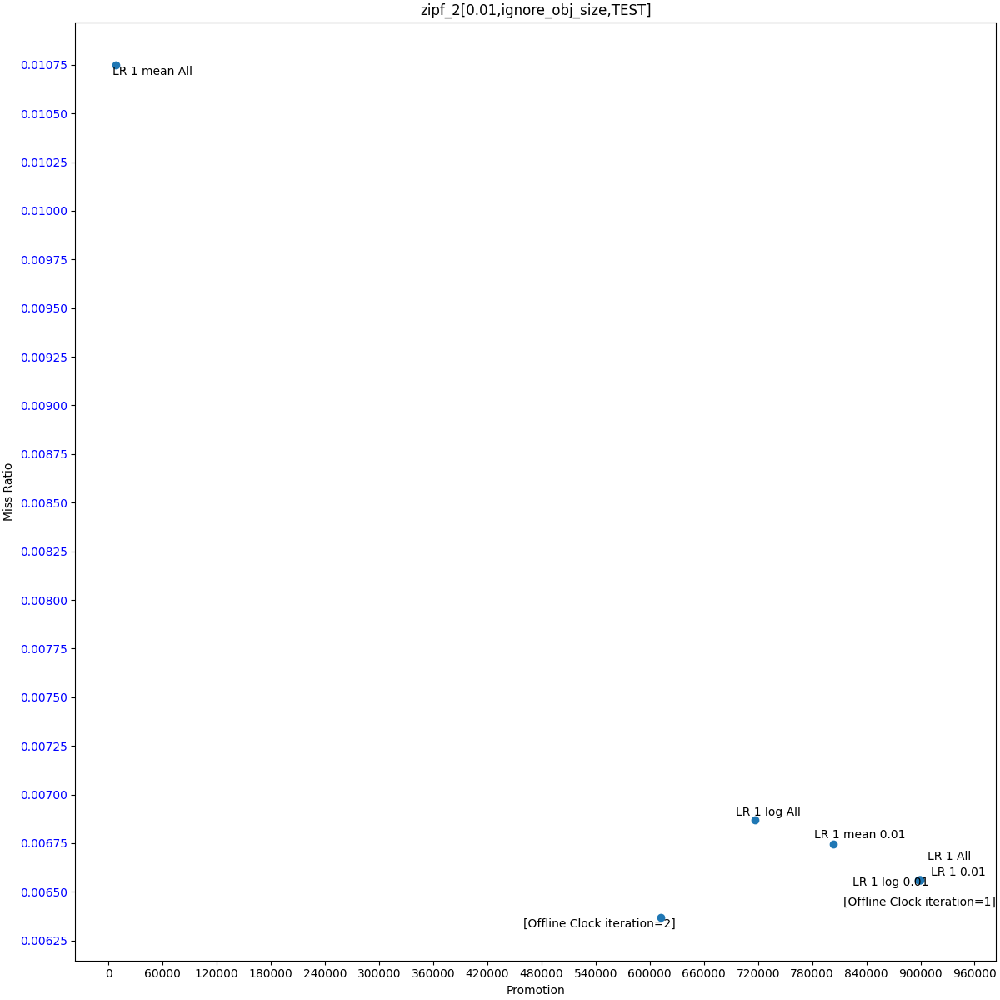  
> **Trace Path**: zipf_2.oracleGeneral  
> **Desc**: ['0.01', 'ignore_obj_size', 'TEST', {}]  
> **Cache Size**: 137  
> **Total Request**: 100,000,000  
> **Best Model**: LR_1_spec,LR_1_All,LR_2_spec,LR_2_All,LR_2_log_spec,LR_2_mean_spec => 0.00656036  
> **Better Than Base**: False  
> 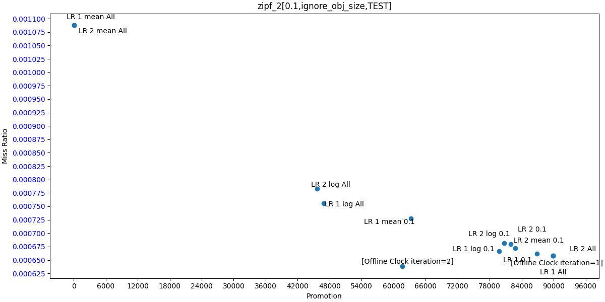  
> **Trace Path**: zipf_2.oracleGeneral  
> **Desc**: ['0.1', 'ignore_obj_size', 'TEST', {}]  
> **Cache Size**: 1379  
> **Total Request**: 100,000,000  
> **Best Model**: LR_1_All,LR_2_All => 0.00065771  
> **Better Than Base**: False  
> 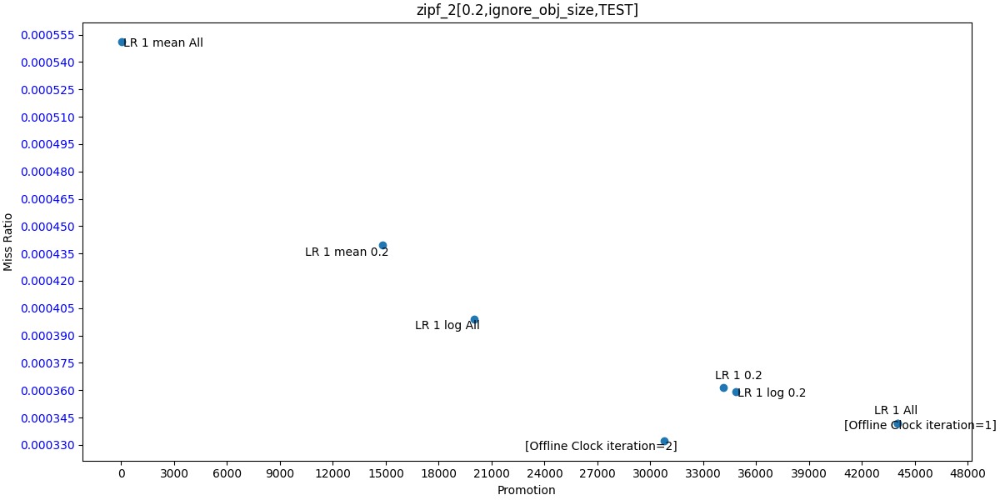  
> **Trace Path**: zipf_2.oracleGeneral  
> **Desc**: ['0.2', 'ignore_obj_size', 'TEST', {}]  
> **Cache Size**: 2758  
> **Total Request**: 100,000,000  
> **Best Model**: LR_1_All,LR_2_spec => 0.00034185  
> **Better Than Base**: False  
> 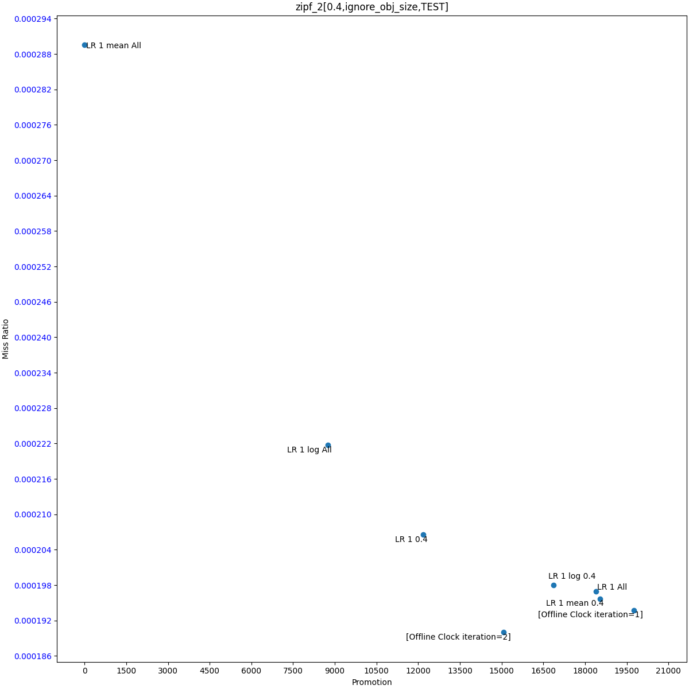  
> **Trace Path**: zipf_2.oracleGeneral  
> **Desc**: ['0.4', 'ignore_obj_size', 'TEST', {}]  
> **Cache Size**: 5517  
> **Total Request**: 100,000,000  
> **Best Model**: LR_2_mean_spec => 0.00019374  
> **Better Than Base**: True  
