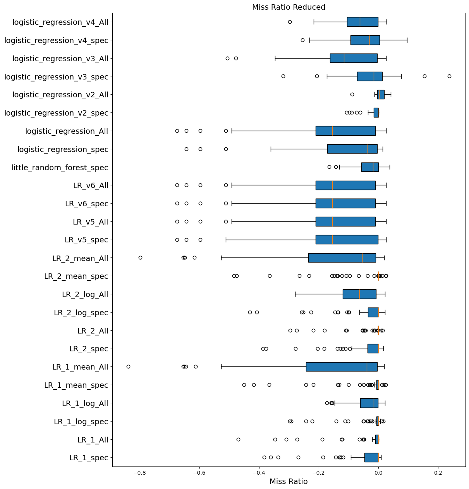
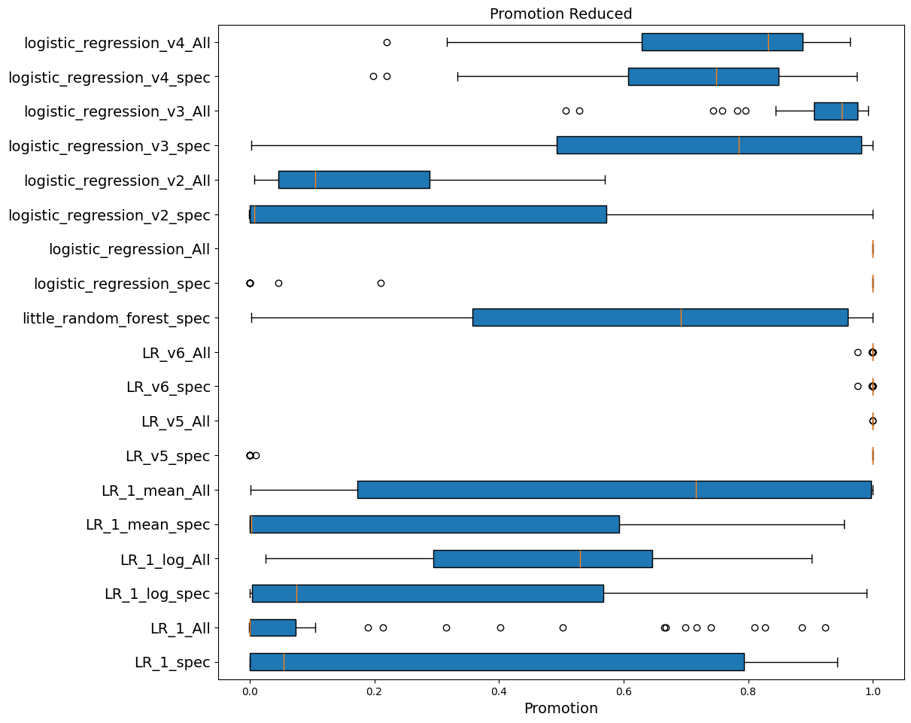
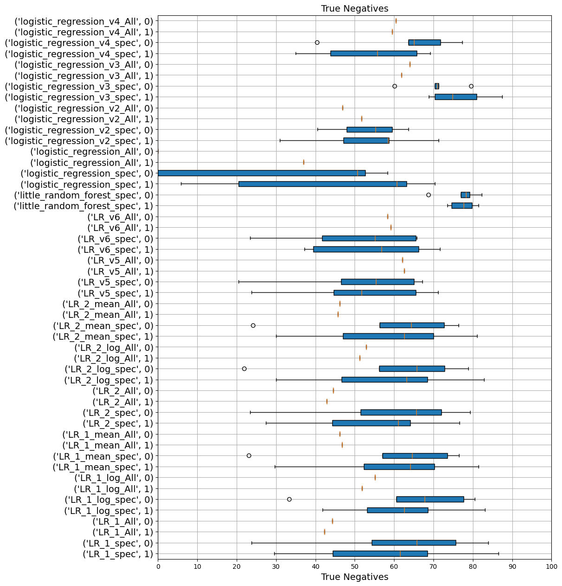
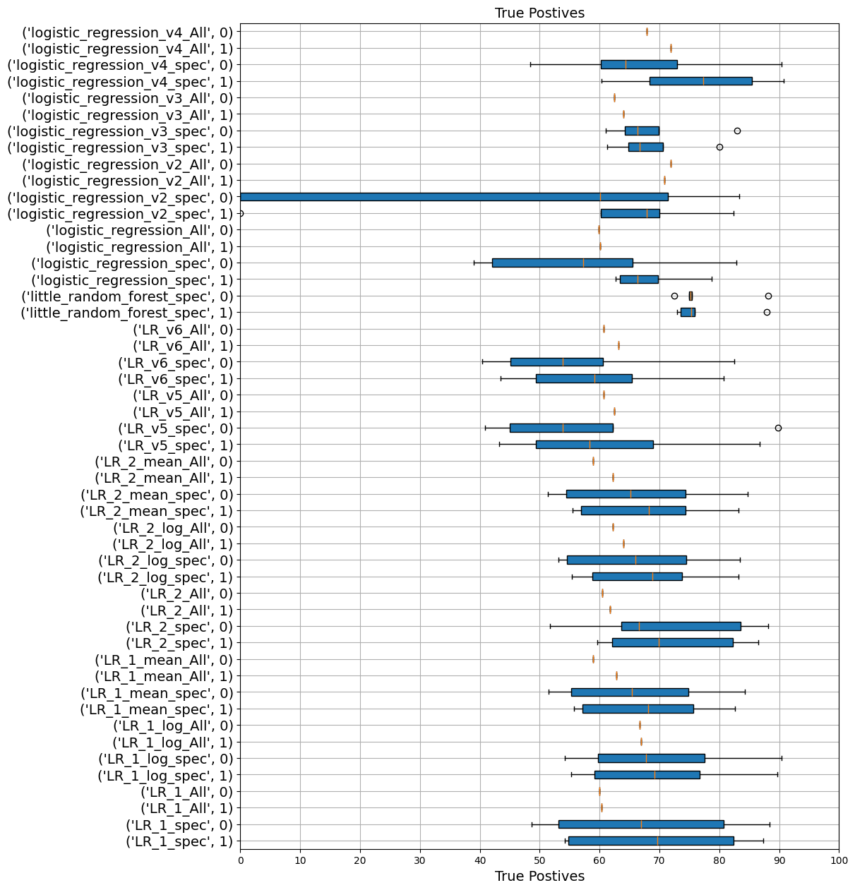
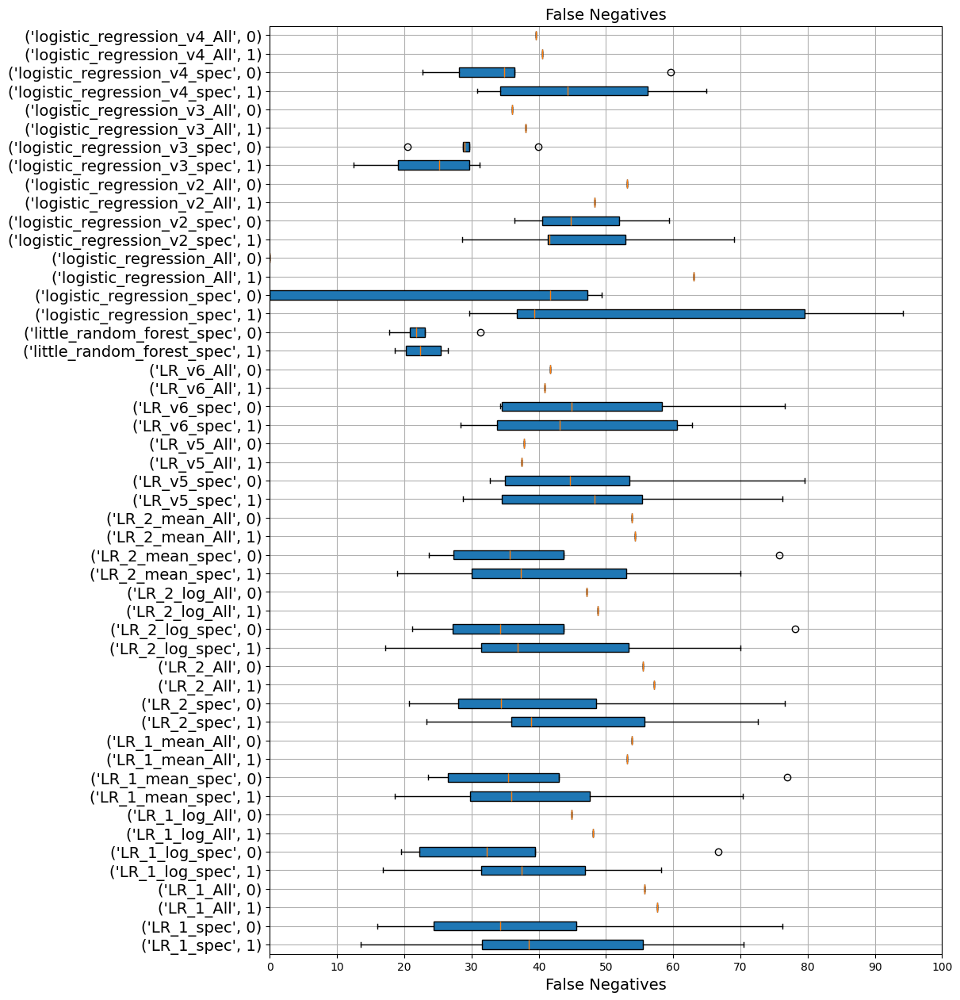
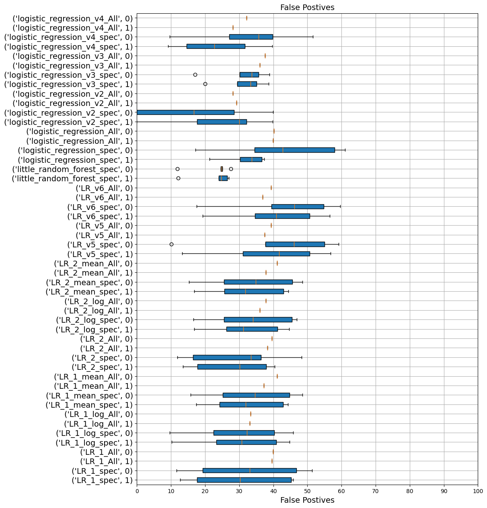

# Test Data Result Obj Size Not Ignored  
# Result  
# Model Summaries  
| Model                       |   Best Models on Exp. |   Better than base % of the times |
|-----------------------------|-----------------------|-----------------------------------|
| LR_1_spec                   |                    15 |                          11.4286  |
| LR_1_All                    |                    22 |                           1.42857 |
| LR_1_log_spec               |                     7 |                          18.5714  |
| LR_1_log_All                |                     2 |                          11.4286  |
| LR_1_mean_spec              |                    23 |                          20       |
| LR_1_mean_All               |                     6 |                          10       |
| LR_v5_spec                  |                     3 |                           5.71429 |
| LR_v5_All                   |                     1 |                           5.71429 |
| LR_v6_spec                  |                     1 |                           5.71429 |
| LR_v6_All                   |                     1 |                           5.71429 |
| little_random_forest_spec   |                     0 |                          31.4286  |
| logistic_regression_spec    |                     1 |                           2.85714 |
| logistic_regression_All     |                     1 |                           5.71429 |
| logistic_regression_v2_spec |                     3 |                           5.71429 |
| logistic_regression_v2_All  |                    17 |                          57.1429  |
| logistic_regression_v3_spec |                     7 |                          37.1429  |
| logistic_regression_v3_All  |                     0 |                          11.4286  |
| logistic_regression_v4_spec |                     3 |                          31.4286  |
| logistic_regression_v4_All  |                     0 |                          20       |  

## Promotion Reduced (%)  
$\dfrac{Base Promotion - Model Promotion}{Base Promotion} \times 100$  
| Model                       |      Max |           Min |      Avg |        Mdn |
|-----------------------------|----------|---------------|----------|------------|
| LR_1_spec                   |  94.3179 |   0           |  30.262  |   5.40057  |
| LR_1_All                    |  92.4203 |  -0.0814759   |  12.9991 |   0        |
| LR_1_log_spec               |  98.9612 |   0           |  27.6345 |   7.47617  |
| LR_1_log_All                |  90.1819 |   2.57692     |  48.1988 |  52.9958   |
| LR_1_mean_spec              |  95.4221 |   0           |  23.8771 |   0.310631 |
| LR_1_mean_All               | 100      |   0.139368    |  58.6845 |  71.5815   |
| LR_v5_spec                  | 100      |   3.77238e-06 |  80.0283 | 100        |
| LR_v5_All                   | 100      |  99.9999      | 100      | 100        |
| LR_v6_spec                  | 100      |  97.5623      |  99.9181 |  99.9998   |
| LR_v6_All                   | 100      |  97.5623      |  99.9181 |  99.9999   |
| little_random_forest_spec   | 100      |   0.200996    |  64.2481 |  69.1575   |
| logistic_regression_spec    | 100      |   0           |  77.8765 | 100        |
| logistic_regression_All     | 100      | 100           | 100      | 100        |
| logistic_regression_v2_spec | 100      |  -0.0784616   |  28.6944 |   0.707168 |
| logistic_regression_v2_All  |  56.9735 |   0.707168    |  18.2832 |  10.5607   |
| logistic_regression_v3_spec | 100      |   0.314614    |  70.0288 |  78.5025   |
| logistic_regression_v3_All  |  99.2122 |  50.6748      |  90.487  |  95.0255   |
| logistic_regression_v4_spec |  97.4116 |  19.7775      |  70.6744 |  74.8239   |
| logistic_regression_v4_All  |  96.3797 |  21.9626      |  74.5052 |  83.1461   |  

## Miss Ratio Reduced (%)  
$\dfrac{Base Miss Ratio - Model Miss Ratio}{Base Miss Ratio} \times 100$  
| Model                       |       Max |       Min |        Avg |           Mdn |
|-----------------------------|-----------|-----------|------------|---------------|
| LR_1_spec                   |  0.963094 | -38.2969  |  -4.13373  |  -0.000127885 |
| LR_1_All                    |  0.151154 | -46.9848  |  -3.08542  |   0           |
| LR_1_log_spec               |  1.68774  | -29.6923  |  -2.34982  |  -0.00175551  |
| LR_1_log_All                |  2.30797  | -17.2854  |  -4.07722  |  -1.53221     |
| LR_1_mean_spec              |  2.49751  | -45.0214  |  -3.23355  |   0           |
| LR_1_mean_All               |  2.0323   | -83.8301  | -15.1569   |  -3.82646     |
| LR_v5_spec                  |  2.60943  | -67.5129  | -16.0921   | -15.4302      |
| LR_v5_All                   |  2.60943  | -67.5129  | -16.9064   | -15.4302      |
| LR_v6_spec                  |  2.60943  | -67.5122  | -16.903    | -15.4302      |
| LR_v6_All                   |  2.60943  | -67.5122  | -16.9031   | -15.4302      |
| little_random_forest_spec   |  3.7867   | -16.4085  |  -3.40806  |  -1.80289     |
| logistic_regression_spec    |  1.51335  | -64.3863  | -11.9804   |  -3.56557     |
| logistic_regression_All     |  2.60943  | -67.5129  | -16.9064   | -15.4302      |
| logistic_regression_v2_spec |  0.113034 | -10.6636  |  -1.64422  |  -0.122698    |
| logistic_regression_v2_All  |  4.23077  |  -8.84895 |   0.603377 |   0.290047    |
| logistic_regression_v3_spec | 23.839    | -31.9559  |  -3.05555  |  -1.49142     |
| logistic_regression_v3_All  |  2.70394  | -50.5816  | -12.5506   | -11.4997      |
| logistic_regression_v4_spec |  9.62847  | -25.409   |  -4.87457  |  -2.8789      |
| logistic_regression_v4_All  |  2.80681  | -29.7517  |  -6.84265  |  -6.14585     |  

# Model Summaries Plot  
## Miss Ratio Reduced (%) 
$\dfrac{Base Miss Ratio - Model Miss Ratio}{Base Miss Ratio} \times 100$  

  
## Promotion Reduced (%) 
$\dfrac{Base Promotion - Model Promotion}{Base Promotion} \times 100$  

  
## True Negatives(%) 
  
## True Postives(%) 
  
## False Negatives(%) 
  
## False Postives(%) 
  
# Individual Workload Result  
## 10  
 https://ftp.pdl.cmu.edu/pub/datasets/twemcacheWorkload/cacheDatasets/twitter/cluster10.oracleGeneral.zst
>   
> **Trace Path**: 10.oracleGeneral.zst  
> **Desc**: ['0.001', 'TEST', {}]  
> **Cache Size**: 82  
> **Total Request**: 2,756,726,994  
> **Best Model**: LR_1_All,LR_v5_spec => 0.999568  
> **Better Than Base**: False  
>   
> **Trace Path**: 10.oracleGeneral.zst  
> **Desc**: ['0.01', 'TEST', {}]  
> **Cache Size**: 826  
> **Total Request**: 2,756,726,994  
> **Best Model**: LR_v5_spec,LR_v5_All,LR_v6_spec,LR_v6_All,logistic_regression_spec,logistic_regression_All => 0.890473  
> **Better Than Base**: True  
>   
> **Trace Path**: 10.oracleGeneral.zst  
> **Desc**: ['0.1', 'TEST', {}]  
> **Cache Size**: 8269  
> **Total Request**: 2,756,726,994  
> **Best Model**: logistic_regression_v4_spec => 0.0346106  
> **Better Than Base**: True  
>   
> **Trace Path**: 10.oracleGeneral.zst  
> **Desc**: ['0.2', 'TEST', {}]  
> **Cache Size**: 16539  
> **Total Request**: 2,756,726,994  
> **Best Model**: logistic_regression_v3_spec => 0.0342232  
> **Better Than Base**: True  
>   
> **Trace Path**: 10.oracleGeneral.zst  
> **Desc**: ['0.4', 'TEST', {}]  
> **Cache Size**: 33078  
> **Total Request**: 2,756,726,994  
> **Best Model**: logistic_regression_v4_spec => 0.0336914  
> **Better Than Base**: True  
## 2016_LUN6  
 https://ftp.pdl.cmu.edu/pub/datasets/twemcacheWorkload/cacheDatasets/systor/2016_LUN6.oracleGeneral.zst
>   
> **Trace Path**: 2016_LUN6.oracleGeneral.zst  
> **Desc**: ['0.001', 'TEST', {}]  
> **Cache Size**: 2476  
> **Total Request**: 655,119,703  
> **Best Model**: LR_1_All,LR_v5_spec => 0.830016  
> **Better Than Base**: False  
>   
> **Trace Path**: 2016_LUN6.oracleGeneral.zst  
> **Desc**: ['0.01', 'TEST', {}]  
> **Cache Size**: 24761  
> **Total Request**: 655,119,703  
> **Best Model**: LR_1_All => 0.699474  
> **Better Than Base**: False  
>   
> **Trace Path**: 2016_LUN6.oracleGeneral.zst  
> **Desc**: ['0.1', 'TEST', {}]  
> **Cache Size**: 247614  
> **Total Request**: 655,119,703  
> **Best Model**: logistic_regression_v2_All => 0.383723  
> **Better Than Base**: False  
>   
> **Trace Path**: 2016_LUN6.oracleGeneral.zst  
> **Desc**: ['0.2', 'TEST', {}]  
> **Cache Size**: 495229  
> **Total Request**: 655,119,703  
> **Best Model**: logistic_regression_v2_spec => 0.198792  
> **Better Than Base**: False  
>   
> **Trace Path**: 2016_LUN6.oracleGeneral.zst  
> **Desc**: ['0.4', 'TEST', {}]  
> **Cache Size**: 990459  
> **Total Request**: 655,119,703  
> **Best Model**: logistic_regression_v2_spec => 0.143264  
> **Better Than Base**: False  
## 202206_kv_traces_all.csv  
 https://ftp.pdl.cmu.edu/pub/datasets/twemcacheWorkload/cacheDatasets/metaKV/202206_kv_traces_all.csv.oracleGeneral.zst
>   
> **Trace Path**: 202206_kv_traces_all.csv.oracleGeneral.zst  
> **Desc**: ['0.001', 'TEST', {}]  
> **Cache Size**: 60  
> **Total Request**: 1,665,685,869  
> **Best Model**: logistic_regression_v2_All => 0.211619  
> **Better Than Base**: True  
>   
> **Trace Path**: 202206_kv_traces_all.csv.oracleGeneral.zst  
> **Desc**: ['0.01', 'TEST', {}]  
> **Cache Size**: 605  
> **Total Request**: 1,665,685,869  
> **Best Model**: logistic_regression_v2_All => 0.100321  
> **Better Than Base**: True  
>   
> **Trace Path**: 202206_kv_traces_all.csv.oracleGeneral.zst  
> **Desc**: ['0.1', 'TEST', {}]  
> **Cache Size**: 6055  
> **Total Request**: 1,665,685,869  
> **Best Model**: logistic_regression_v2_All => 0.0499373  
> **Better Than Base**: True  
>   
> **Trace Path**: 202206_kv_traces_all.csv.oracleGeneral.zst  
> **Desc**: ['0.2', 'TEST', {}]  
> **Cache Size**: 12110  
> **Total Request**: 1,665,685,869  
> **Best Model**: logistic_regression_v2_All => 0.0411439  
> **Better Than Base**: True  
>   
> **Trace Path**: 202206_kv_traces_all.csv.oracleGeneral.zst  
> **Desc**: ['0.4', 'TEST', {}]  
> **Cache Size**: 24221  
> **Total Request**: 1,665,685,869  
> **Best Model**: logistic_regression_v3_spec => 0.0338314  
> **Better Than Base**: True  
## 8610  
 https://ftp.pdl.cmu.edu/pub/datasets/twemcacheWorkload/cacheDatasets/tencentBlock/v2/traces/8610.oracleGeneral.zst
>   
> **Trace Path**: 8610.oracleGeneral.zst  
> **Desc**: ['0.001', 'TEST', {}]  
> **Cache Size**: 16  
> **Total Request**: 188,982,398  
> **Best Model**: LR_1_spec => 0.9037  
> **Better Than Base**: True  
>   
> **Trace Path**: 8610.oracleGeneral.zst  
> **Desc**: ['0.01', 'TEST', {}]  
> **Cache Size**: 166  
> **Total Request**: 188,982,398  
> **Best Model**: logistic_regression_v2_All => 0.79176  
> **Better Than Base**: True  
>   
> **Trace Path**: 8610.oracleGeneral.zst  
> **Desc**: ['0.1', 'TEST', {}]  
> **Cache Size**: 1669  
> **Total Request**: 188,982,398  
> **Best Model**: logistic_regression_v4_spec => 0.176032  
> **Better Than Base**: True  
>   
> **Trace Path**: 8610.oracleGeneral.zst  
> **Desc**: ['0.2', 'TEST', {}]  
> **Cache Size**: 3339  
> **Total Request**: 188,982,398  
> **Best Model**: logistic_regression_v3_spec => 0.0491772  
> **Better Than Base**: True  
>   
> **Trace Path**: 8610.oracleGeneral.zst  
> **Desc**: ['0.4', 'TEST', {}]  
> **Cache Size**: 6679  
> **Total Request**: 188,982,398  
> **Best Model**: logistic_regression_v3_spec => 0.00992362  
> **Better Than Base**: True  
## cluster53  
 https://ftp.pdl.cmu.edu/pub/datasets/twemcacheWorkload/cacheDatasets/twitter/cluster53.oracleGeneral.zst
>   
> **Trace Path**: cluster53.oracleGeneral.zst  
> **Desc**: ['0.001', 'TEST', {}]  
> **Cache Size**: 10  
> **Total Request**: 246,508,262  
> **Best Model**: logistic_regression_v2_All => 0.636095  
> **Better Than Base**: True  
>   
> **Trace Path**: cluster53.oracleGeneral.zst  
> **Desc**: ['0.01', 'TEST', {}]  
> **Cache Size**: 103  
> **Total Request**: 246,508,262  
> **Best Model**: logistic_regression_v2_All => 0.313188  
> **Better Than Base**: True  
>   
> **Trace Path**: cluster53.oracleGeneral.zst  
> **Desc**: ['0.1', 'TEST', {}]  
> **Cache Size**: 1033  
> **Total Request**: 246,508,262  
> **Best Model**: logistic_regression_v2_All => 0.108301  
> **Better Than Base**: True  
>   
> **Trace Path**: cluster53.oracleGeneral.zst  
> **Desc**: ['0.2', 'TEST', {}]  
> **Cache Size**: 2066  
> **Total Request**: 246,508,262  
> **Best Model**: logistic_regression_v2_All => 0.0763369  
> **Better Than Base**: True  
>   
> **Trace Path**: cluster53.oracleGeneral.zst  
> **Desc**: ['0.4', 'TEST', {}]  
> **Cache Size**: 4132  
> **Total Request**: 246,508,262  
> **Best Model**: logistic_regression_v3_spec => 0.0537166  
> **Better Than Base**: True  
## meta_rprn  
 https://ftp.pdl.cmu.edu/pub/datasets/twemcacheWorkload/cacheDatasets/metaCDN/meta_rprn.oracleGeneral.zst
>   
> **Trace Path**: meta_rprn.oracleGeneral.zst  
> **Desc**: ['0.001', 'TEST', {}]  
> **Cache Size**: 698675  
> **Total Request**: 88,470,732  
> **Best Model**: logistic_regression_v2_All => 0.586703  
> **Better Than Base**: True  
>   
> **Trace Path**: meta_rprn.oracleGeneral.zst  
> **Desc**: ['0.01', 'TEST', {}]  
> **Cache Size**: 6986759  
> **Total Request**: 88,470,732  
> **Best Model**: logistic_regression_v2_All => 0.520473  
> **Better Than Base**: True  
>   
> **Trace Path**: meta_rprn.oracleGeneral.zst  
> **Desc**: ['0.1', 'TEST', {}]  
> **Cache Size**: 69867592  
> **Total Request**: 88,470,732  
> **Best Model**: logistic_regression_v2_All => 0.429722  
> **Better Than Base**: True  
>   
> **Trace Path**: meta_rprn.oracleGeneral.zst  
> **Desc**: ['0.2', 'TEST', {}]  
> **Cache Size**: 139735184  
> **Total Request**: 88,470,732  
> **Best Model**: logistic_regression_v2_All => 0.389006  
> **Better Than Base**: True  
>   
> **Trace Path**: meta_rprn.oracleGeneral.zst  
> **Desc**: ['0.4', 'TEST', {}]  
> **Cache Size**: 279470368  
> **Total Request**: 88,470,732  
> **Best Model**: logistic_regression_v3_spec => 0.346304  
> **Better Than Base**: True  
## wiki_2019u  
 https://ftp.pdl.cmu.edu/pub/datasets/twemcacheWorkload/cacheDatasets/wiki/wiki_2019u.oracleGeneral.zst
>   
> **Trace Path**: wiki_2019u.oracleGeneral.zst  
> **Desc**: ['0.001', 'TEST', {}]  
> **Cache Size**: 8016  
> **Total Request**: 2,655,612,611  
> **Best Model**: logistic_regression_v2_All => 0.6071  
> **Better Than Base**: True  
>   
> **Trace Path**: wiki_2019u.oracleGeneral.zst  
> **Desc**: ['0.01', 'TEST', {}]  
> **Cache Size**: 80166  
> **Total Request**: 2,655,612,611  
> **Best Model**: logistic_regression_v2_All => 0.290395  
> **Better Than Base**: True  
>   
> **Trace Path**: wiki_2019u.oracleGeneral.zst  
> **Desc**: ['0.1', 'TEST', {}]  
> **Cache Size**: 801664  
> **Total Request**: 2,655,612,611  
> **Best Model**: logistic_regression_v2_All => 0.0668907  
> **Better Than Base**: False  
>   
> **Trace Path**: wiki_2019u.oracleGeneral.zst  
> **Desc**: ['0.2', 'TEST', {}]  
> **Cache Size**: 1603329  
> **Total Request**: 2,655,612,611  
> **Best Model**: logistic_regression_v2_spec => 0.0386781  
> **Better Than Base**: False  
>   
> **Trace Path**: wiki_2019u.oracleGeneral.zst  
> **Desc**: ['0.4', 'TEST', {}]  
> **Cache Size**: 3206658  
> **Total Request**: 2,655,612,611  
> **Best Model**: logistic_regression_v3_spec => 0.0239131  
> **Better Than Base**: True  
## zipf_0.3  
 
>   
> **Trace Path**: zipf_0.3.oracleGeneral  
> **Desc**: ['0.001', 'TEST', {}]  
> **Cache Size**: 3  
> **Total Request**: 100,000,000  
> **Best Model**: LR_1_mean_All => 0.998778  
> **Better Than Base**: True  
>   
> **Trace Path**: zipf_0.3.oracleGeneral  
> **Desc**: ['0.01', 'TEST', {}]  
> **Cache Size**: 38  
> **Total Request**: 100,000,000  
> **Best Model**: LR_1_mean_All => 0.987792  
> **Better Than Base**: True  
>   
> **Trace Path**: zipf_0.3.oracleGeneral  
> **Desc**: ['0.1', 'TEST', {}]  
> **Cache Size**: 381  
> **Total Request**: 100,000,000  
> **Best Model**: LR_1_mean_All => 0.879949  
> **Better Than Base**: True  
>   
> **Trace Path**: zipf_0.3.oracleGeneral  
> **Desc**: ['0.2', 'TEST', {}]  
> **Cache Size**: 762  
> **Total Request**: 100,000,000  
> **Best Model**: LR_1_mean_All => 0.765574  
> **Better Than Base**: True  
>   
> **Trace Path**: zipf_0.3.oracleGeneral  
> **Desc**: ['0.4', 'TEST', {}]  
> **Cache Size**: 1525  
> **Total Request**: 100,000,000  
> **Best Model**: LR_1_mean_All => 0.552575  
> **Better Than Base**: True  
## zipf_0.7  
 
>   
> **Trace Path**: zipf_0.7.oracleGeneral  
> **Desc**: ['0.001', 'TEST', {}]  
> **Cache Size**: 3  
> **Total Request**: 100,000,000  
> **Best Model**: LR_1_spec,LR_1_mean_spec => 0.961411  
> **Better Than Base**: False  
>   
> **Trace Path**: zipf_0.7.oracleGeneral  
> **Desc**: ['0.01', 'TEST', {}]  
> **Cache Size**: 38  
> **Total Request**: 100,000,000  
> **Best Model**: LR_1_spec,LR_1_All,LR_1_mean_spec => 0.872851  
> **Better Than Base**: False  
>   
> **Trace Path**: zipf_0.7.oracleGeneral  
> **Desc**: ['0.1', 'TEST', {}]  
> **Cache Size**: 381  
> **Total Request**: 100,000,000  
> **Best Model**: LR_1_spec,LR_1_All,LR_1_log_spec,LR_1_mean_spec => 0.632252  
> **Better Than Base**: False  
>   
> **Trace Path**: zipf_0.7.oracleGeneral  
> **Desc**: ['0.2', 'TEST', {}]  
> **Cache Size**: 762  
> **Total Request**: 100,000,000  
> **Best Model**: LR_1_spec,LR_1_All,LR_1_log_spec,LR_1_mean_spec => 0.499366  
> **Better Than Base**: False  
>   
> **Trace Path**: zipf_0.7.oracleGeneral  
> **Desc**: ['0.4', 'TEST', {}]  
> **Cache Size**: 1525  
> **Total Request**: 100,000,000  
> **Best Model**: LR_1_spec,LR_1_All,LR_1_log_spec,LR_1_mean_spec => 0.321945  
> **Better Than Base**: False  
## zipf_0  
 
>   
> **Trace Path**: zipf_0.oracleGeneral  
> **Desc**: ['0.001', 'TEST', {}]  
> **Cache Size**: 3  
> **Total Request**: 100,000,000  
> **Best Model**: LR_1_spec,LR_1_All,LR_1_log_spec,LR_1_log_All,LR_1_mean_spec,LR_1_mean_All => 0.998997  
> **Better Than Base**: False  
>   
> **Trace Path**: zipf_0.oracleGeneral  
> **Desc**: ['0.01', 'TEST', {}]  
> **Cache Size**: 38  
> **Total Request**: 100,000,000  
> **Best Model**: LR_1_spec,LR_1_All,LR_1_log_spec,LR_1_mean_spec => 0.990002  
> **Better Than Base**: False  
>   
> **Trace Path**: zipf_0.oracleGeneral  
> **Desc**: ['0.1', 'TEST', {}]  
> **Cache Size**: 381  
> **Total Request**: 100,000,000  
> **Best Model**: LR_1_log_All => 0.900073  
> **Better Than Base**: True  
>   
> **Trace Path**: zipf_0.oracleGeneral  
> **Desc**: ['0.2', 'TEST', {}]  
> **Cache Size**: 762  
> **Total Request**: 100,000,000  
> **Best Model**: LR_1_mean_spec => 0.800232  
> **Better Than Base**: True  
>   
> **Trace Path**: zipf_0.oracleGeneral  
> **Desc**: ['0.4', 'TEST', {}]  
> **Cache Size**: 1525  
> **Total Request**: 100,000,000  
> **Best Model**: LR_1_mean_spec => 0.600966  
> **Better Than Base**: True  
## zipf_1.3  
 
>   
> **Trace Path**: zipf_1.3.oracleGeneral  
> **Desc**: ['0.001', 'TEST', {}]  
> **Cache Size**: 2  
> **Total Request**: 100,000,000  
> **Best Model**: LR_1_spec,LR_1_mean_spec => 0.145437  
> **Better Than Base**: False  
>   
> **Trace Path**: zipf_1.3.oracleGeneral  
> **Desc**: ['0.01', 'TEST', {}]  
> **Cache Size**: 25  
> **Total Request**: 100,000,000  
> **Best Model**: LR_1_spec,LR_1_All => 0.0645036  
> **Better Than Base**: False  
>   
> **Trace Path**: zipf_1.3.oracleGeneral  
> **Desc**: ['0.1', 'TEST', {}]  
> **Cache Size**: 255  
> **Total Request**: 100,000,000  
> **Best Model**: LR_1_All => 0.0239022  
> **Better Than Base**: False  
>   
> **Trace Path**: zipf_1.3.oracleGeneral  
> **Desc**: ['0.2', 'TEST', {}]  
> **Cache Size**: 510  
> **Total Request**: 100,000,000  
> **Best Model**: LR_1_All => 0.0163646  
> **Better Than Base**: False  
>   
> **Trace Path**: zipf_1.3.oracleGeneral  
> **Desc**: ['0.4', 'TEST', {}]  
> **Cache Size**: 1021  
> **Total Request**: 100,000,000  
> **Best Model**: LR_1_mean_spec => 0.0105821  
> **Better Than Base**: False  
## zipf_1.7  
 
>   
> **Trace Path**: zipf_1.7.oracleGeneral  
> **Desc**: ['0.001', 'TEST', {}]  
> **Cache Size**: 0  
> **Total Request**: 100,000,000  
> **Best Model**: LR_1_mean_spec => 0.0520027  
> **Better Than Base**: True  
>   
> **Trace Path**: zipf_1.7.oracleGeneral  
> **Desc**: ['0.01', 'TEST', {}]  
> **Cache Size**: 2  
> **Total Request**: 100,000,000  
> **Best Model**: LR_1_spec,LR_1_All,LR_1_mean_spec => 0.0103631  
> **Better Than Base**: False  
>   
> **Trace Path**: zipf_1.7.oracleGeneral  
> **Desc**: ['0.1', 'TEST', {}]  
> **Cache Size**: 25  
> **Total Request**: 100,000,000  
> **Best Model**: LR_1_All => 0.00205443  
> **Better Than Base**: False  
>   
> **Trace Path**: zipf_1.7.oracleGeneral  
> **Desc**: ['0.2', 'TEST', {}]  
> **Cache Size**: 51  
> **Total Request**: 100,000,000  
> **Best Model**: LR_1_All => 0.00128691  
> **Better Than Base**: False  
>   
> **Trace Path**: zipf_1.7.oracleGeneral  
> **Desc**: ['0.4', 'TEST', {}]  
> **Cache Size**: 103  
> **Total Request**: 100,000,000  
> **Best Model**: LR_1_mean_spec => 0.00085977  
> **Better Than Base**: False  
## zipf_1  
 
>   
> **Trace Path**: zipf_1.oracleGeneral  
> **Desc**: ['0.001', 'TEST', {}]  
> **Cache Size**: 3  
> **Total Request**: 100,000,000  
> **Best Model**: LR_1_mean_spec => 0.586261  
> **Better Than Base**: True  
>   
> **Trace Path**: zipf_1.oracleGeneral  
> **Desc**: ['0.01', 'TEST', {}]  
> **Cache Size**: 38  
> **Total Request**: 100,000,000  
> **Best Model**: LR_1_spec,LR_1_All,LR_1_mean_spec => 0.405233  
> **Better Than Base**: False  
>   
> **Trace Path**: zipf_1.oracleGeneral  
> **Desc**: ['0.1', 'TEST', {}]  
> **Cache Size**: 381  
> **Total Request**: 100,000,000  
> **Best Model**: LR_1_spec,LR_1_All,LR_1_mean_spec => 0.213886  
> **Better Than Base**: False  
>   
> **Trace Path**: zipf_1.oracleGeneral  
> **Desc**: ['0.2', 'TEST', {}]  
> **Cache Size**: 762  
> **Total Request**: 100,000,000  
> **Best Model**: LR_1_spec,LR_1_All,LR_1_log_spec,LR_1_mean_spec => 0.152787  
> **Better Than Base**: False  
>   
> **Trace Path**: zipf_1.oracleGeneral  
> **Desc**: ['0.4', 'TEST', {}]  
> **Cache Size**: 1525  
> **Total Request**: 100,000,000  
> **Best Model**: LR_1_All,LR_1_log_spec,LR_1_mean_spec => 0.0897345  
> **Better Than Base**: False  
## zipf_2  
 
>   
> **Trace Path**: zipf_2.oracleGeneral  
> **Desc**: ['0.001', 'TEST', {}]  
> **Cache Size**: 0  
> **Total Request**: 100,000,000  
> **Best Model**: LR_1_mean_spec => 0.0677591  
> **Better Than Base**: True  
>   
> **Trace Path**: zipf_2.oracleGeneral  
> **Desc**: ['0.01', 'TEST', {}]  
> **Cache Size**: 0  
> **Total Request**: 100,000,000  
> **Best Model**: LR_1_spec,LR_1_All,LR_1_mean_spec => 0.00656036  
> **Better Than Base**: False  
>   
> **Trace Path**: zipf_2.oracleGeneral  
> **Desc**: ['0.1', 'TEST', {}]  
> **Cache Size**: 5  
> **Total Request**: 100,000,000  
> **Best Model**: LR_1_All,LR_1_mean_spec => 0.00065771  
> **Better Than Base**: False  
>   
> **Trace Path**: zipf_2.oracleGeneral  
> **Desc**: ['0.2', 'TEST', {}]  
> **Cache Size**: 10  
> **Total Request**: 100,000,000  
> **Best Model**: LR_1_All => 0.00034185  
> **Better Than Base**: False  
>   
> **Trace Path**: zipf_2.oracleGeneral  
> **Desc**: ['0.4', 'TEST', {}]  
> **Cache Size**: 21  
> **Total Request**: 100,000,000  
> **Best Model**: LR_1_mean_spec => 0.00019375  
> **Better Than Base**: False  
